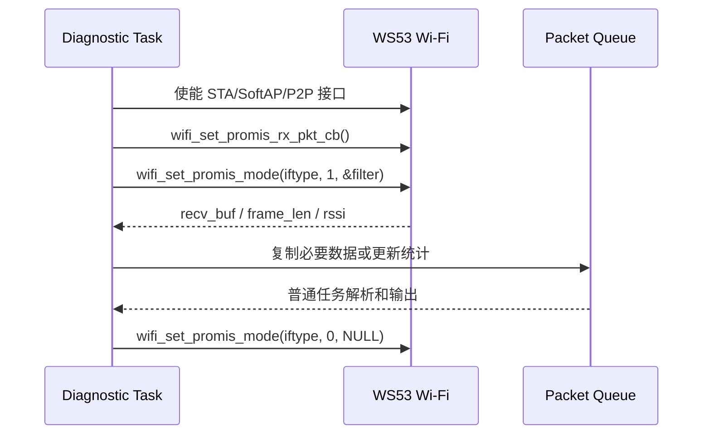

# Wi-Fi 监听模式

> WS53 通过混杂模式接收指定类型的 802.11 空口帧，用于现场诊断、帧统计和协议分析。

## 学习目标

- 为已经使能的 WS53 Wi-Fi 接口配置混杂模式。
- 使用 `wifi_ptype_filter_stru` 控制上报的报文类型。
- 在高频接收回调中安全检查并解析 802.11 帧头。
- 正确关闭监听并释放应用侧资源。

## 案例说明

WS53 当前没有 `src/application/samples/wifi/` 下的独立监听模式案例工程。本页基于 [Wi-Fi Device API](../../../api-reference/middleware/services/wifi/device.md) 给出集成方法，代码需要加入产品的诊断任务或自定义 Sample。

开启混杂模式后，符合过滤条件的帧会通过接收回调上报。回调运行频率取决于当前信道的空口流量，不能在回调中逐帧打印、动态分配大块内存或执行阻塞操作。



## 关键配置

- 调用前必须完成 `wifi_init()`，并使能与 `iftype` 对应的接口。
- 非关联诊断场景可使用 `wifi_set_channel()` 设置监听信道；STA 已关联时，实际工作信道由所连接 AP 决定。
- 从最小过滤集合开始，确认业务需要后再增加报文类型，避免无关帧占用 CPU 和队列。
- 回调和消费任务之间需要有明确的缓冲上限、丢包计数和停止同步机制。

`wifi_ptype_filter_stru` 的 WS53 字段如下：

| 字段 | 置 1 后接收 |
| --- | --- |
| `mdata_en` | 组播或广播数据帧 |
| `udata_en` | 单播数据帧 |
| `mmngt_en` | 组播或广播管理帧 |
| `umngt_en` | 单播管理帧 |
| `custom_en` | Beacon、Probe 等定制上报帧 |

这些成员必须使用带 `_en` 后缀的 WS53 字段名。监听模式不会自动切换或轮询信道，也不能保证应用获得解密后的业务数据。

## 代码详解

### 1. 准备目标接口

混杂模式依附于已使能的 Wi-Fi 接口。以下示例使用 STA 接口：

```c
#include "wifi_device.h"

if (wifi_is_wifi_inited() == 0) {
    /* 等待系统 Wi-Fi 初始化完成。 */
    return ERRCODE_FAIL;
}

if (wifi_sta_enable() != ERRCODE_SUCC) {
    return ERRCODE_FAIL;
}
```

如果应用已经通过 [STA 案例](./sta/sta-connect.md)使能 `wlan0`，不要重复调用 `wifi_sta_enable()`。未关联情况下需要固定监听信道时，可在开启混杂模式前调用：

```c
if (wifi_set_channel(IFTYPE_STA, 6) != ERRCODE_SUCC) {
    return ERRCODE_FAIL;
}
```

信道必须符合当前国家码和区域法规。与 STA、SoftAP 或 P2P 并发时，应以实际业务接口的工作信道为准。

### 2. 注册混杂模式回调

WS53 回调签名为 `int32_t (*)(void *recv_buf, int32_t frame_len, int8_t rssi)`：

```c
static volatile uint32_t g_mgmt_count;
static volatile uint32_t g_data_count;
static volatile uint32_t g_invalid_count;

static int32_t promis_rx_cb(void *recv_buf, int32_t frame_len, int8_t rssi)
{
    const uint8_t *frame = (const uint8_t *)recv_buf;
    uint16_t frame_control;
    uint8_t type;

    (void)rssi;
    if (frame == NULL || frame_len < 2) {
        g_invalid_count++;
        return ERRCODE_FAIL;
    }

    /* 802.11 Frame Control 为小端字段，逐字节读取可避免非对齐访问。 */
    frame_control = (uint16_t)frame[0] | ((uint16_t)frame[1] << 8);
    type = (uint8_t)((frame_control >> 2) & 0x3);

    if (type == 0) {
        g_mgmt_count++;
    } else if (type == 2) {
        g_data_count++;
    }
    return ERRCODE_SUCC;
}

if (wifi_set_promis_rx_pkt_cb(promis_rx_cb) != ERRCODE_SUCC) {
    return ERRCODE_FAIL;
}
```

示例只读取 Frame Control 的 `type`。如需解析 MAC 地址、SSID 或其他 Information Element，必须先按照帧类型和子类型检查最小长度，再逐字段验证边界。不要直接把 `recv_buf` 强制转换为带对齐要求的 C 结构体。

实际产品通常把有限长度的帧头复制到预分配队列，由普通任务完成解析和日志输出。队列已满时应丢弃并计数，不能在回调中等待消费者。

### 3. 配置过滤器并开启监听

下面只接收管理类和定制上报帧：

```c
wifi_ptype_filter_stru filter = {
    .mdata_en = 0,
    .udata_en = 0,
    .mmngt_en = 1,
    .umngt_en = 0,
    .custom_en = 1,
};

if (wifi_set_promis_mode(IFTYPE_STA, 1, &filter) != ERRCODE_SUCC) {
    wifi_set_promis_rx_pkt_cb(NULL);
    return ERRCODE_FAIL;
}
```

`IFTYPE_STA` 必须与实际使能的接口一致。使用 SoftAP 或 P2P 接口时，应传入对应的 `wifi_if_type_enum`，并确认目标构建包含该接口能力。

### 4. 关闭监听

停止时先阻止新帧上报，再注销回调，最后等待消费任务处理或丢弃队列中的剩余数据：

```c
errcode_t ret = wifi_set_promis_mode(IFTYPE_STA, 0, NULL);
wifi_set_promis_rx_pkt_cb(NULL);

if (ret != ERRCODE_SUCC) {
    /* 记录关闭失败，避免立即释放仍可能被访问的上下文。 */
    return ret;
}
```

关闭混杂模式不会自动关闭 STA/SoftAP/P2P 接口。接口是否继续保留应由上层业务决定。

只需要特定管理帧时，也可评估 `wifi_set_mgmt_frame_rx_cb()`，避免同时开启两条重复的报文上报通道。

## 案例操作指导

1. 在自定义诊断工程中加入回调、过滤器和启停函数，构建并烧录 WS53。
2. 使能目标接口并选择合法信道，确认回调注册和混杂模式开启均返回成功。
3. 先只开启一种过滤类型，使用附近 AP 或终端产生 Beacon、Probe 或业务流量。
4. 在普通任务中输出帧类型计数、RSSI 和队列丢包数，确认关闭后计数不再增长。
5. 分别验证高流量、弱信号、队列满、切换信道、重复启停和业务接口并发场景。

监听模式会增加射频、CPU、内存和日志负载，并可能影响正常 Wi-Fi 业务。捕获内容还可能包含其他设备的信息，使用时应遵守当地法规、隐私和数据安全要求。构建与烧录方法参见[快速入门](../../../get-started/quick-start.md)。
