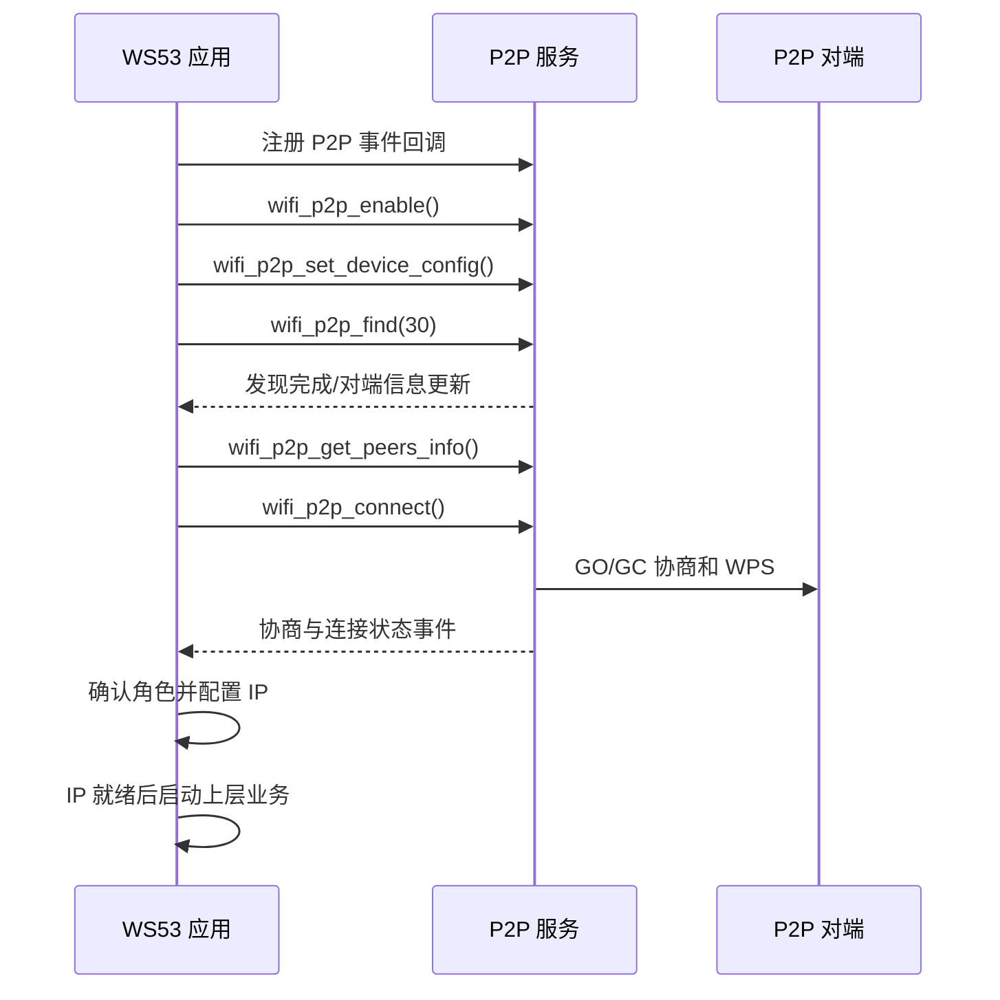

# Wi-Fi P2P

> 本文介绍如何在 WS53 上集成 Wi-Fi P2P（Wi-Fi Direct）。当前 SDK 没有提供独立的 P2P 示例工程，以下代码用于说明接口调用顺序，需集成到产品任务和事件状态机中。

## 学习目标

- 理解 P2P 设备发现、GO/GC 角色协商和连接流程。
- 掌握设备参数配置、对端发现、发起连接和断开清理的接口用法。
- 正确区分 P2P 链路连接、IP 网络就绪和上层业务就绪。

## 案例说明

P2P 允许两个 Wi-Fi 设备在没有传统无线路由器的情况下直接建组。协商完成后，一个设备作为 GO（Group Owner），另一个设备作为 GC（Group Client）。GO/GC 协商成功只表示无线链路已经建立；产品仍需根据最终角色完成 IP 地址、路由和 Socket 业务配置。



!!! note
    公共头文件中提供 P2P 接口，并不代表所有 WS53 固件配置都包含该功能。P2P 服务由 `CONFIG_P2P_SUPPORT` 控制，驱动能力由 `_PRE_WLAN_FEATURE_P2P` 控制；小型化构建会裁剪相关驱动特性。开发前应确认目标配置确实启用了 P2P。

## 关键配置

| 配置项 | 说明 |
| --- | --- |
| 设备名称 | 长度必须小于 `WPS_DEV_NAME_LEN`，用于对端发现和识别 |
| WPS 方式 | 主动连接双方必须使用兼容的方式；建议先使用 `WPS_PBC` 联调 |
| 监听信道 | 用于回复 Probe Response，应满足当前国家码和射频法规要求 |
| 工作信道 | `0` 表示随机选择，非 `0` 表示建议工作信道 |
| GO Intent | 有效范围为 0～15，数值影响 GO 角色协商，不等同于固定的客户端/服务端配置 |
| 发现时间 | `wifi_p2p_find()` 接受 `0` 或 5～120 秒；`0` 会映射为最大值 120 秒，示例使用 30 秒 |

常用接口如下。

| 接口 | 用途 |
| --- | --- |
| `wifi_p2p_enable()` / `wifi_p2p_disable()` | 开启或关闭 P2P 接口 |
| `wifi_p2p_set_device_config()` | 设置设备名、WPS 方式和建议信道 |
| `wifi_p2p_find()` / `wifi_p2p_stop_find()` | 开始或停止发现对端 |
| `wifi_p2p_get_peers_info()` | 读取本轮发现的 P2P 设备列表 |
| `wifi_p2p_connect()` | 使用对端 BSSID、WPS 方式和 GO Intent 发起连接 |
| `wifi_p2p_connect_accept()` | 接受或拒绝对端连接请求 |
| `wifi_p2p_get_connect_info()` | 查询当前角色、连接状态和工作信道 |
| `wifi_p2p_disconnect()` | 断开当前 P2P 连接 |

完整定义参见 [P2P](../../../api-reference/middleware/services/wifi/p2p.md)。

## 代码详解

### 1. 注册事件回调

P2P 操作是异步过程。应在开启 P2P 前注册事件回调，在回调中仅记录状态或向业务任务投递消息。

```c
#include "wifi_device.h"
#include "wifi_event.h"
#include "wifi_p2p.h"

static volatile int g_p2p_event_pending;

static void p2p_go_neg_result(int32_t state, int32_t mode)
{
    (void)state;
    (void)mode;
    g_p2p_event_pending = 1;
}

static void p2p_gc_connection_changed(int32_t state,
    const p2p_status_info_stru *status)
{
    (void)state;
    (void)status;
    g_p2p_event_pending = 1;
}

static void p2p_go_connection_changed(int32_t state,
    const p2p_client_info_stru *client)
{
    (void)state;
    (void)client;
    g_p2p_event_pending = 1;
}

static errcode_t p2p_register_events(void)
{
    wifi_event_stru event = {0};

    event.wifi_event_p2p_go_neg_result = p2p_go_neg_result;
    event.wifi_event_p2p_gc_connection_changed = p2p_gc_connection_changed;
    event.wifi_event_p2p_go_connection_changed = p2p_go_connection_changed;
    return wifi_register_event_cb(&event);
}
```

实际产品还应按业务需要处理 `wifi_event_p2p_receive_connect`、`wifi_event_p2p_go_start` 和 `wifi_event_p2p_invitation_result`。不要在事件回调中等待、重试连接或启动 Socket。

### 2. 开启 P2P 并配置设备信息

```c
#include "securec.h"

static errcode_t p2p_start(void)
{
    static const char device_name[] = "WS53-P2P";
    p2p_device_config_stru config = {0};
    errcode_t ret;

    ret = wifi_p2p_enable();
    if (ret != ERRCODE_SUCC) {
        return ret;
    }

    if (memcpy_s(config.dev_name, sizeof(config.dev_name), device_name,
        sizeof(device_name)) != EOK) {
        (void)wifi_p2p_disable();
        return ERRCODE_FAIL;
    }
    config.wps_method = WPS_PBC;
    config.listen_channel = 6;
    config.oper_channel = 0; /* 由系统选择工作信道 */

    ret = wifi_p2p_set_device_config(&config);
    if (ret != ERRCODE_SUCC) {
        (void)wifi_p2p_disable();
    }
    return ret;
}
```

示例中的监听信道仅用于说明。产品应先设置正确的国家码，并根据所在地区法规、STA/P2P 并发状态和对端能力选择信道。

### 3. 发现并选择对端

```c
#define P2P_PEER_MAX 8

static p2p_device_stru g_peers[P2P_PEER_MAX];

static errcode_t p2p_find_peer(uint32_t *peer_num)
{
    errcode_t ret;

    ret = wifi_p2p_find(30);
    if (ret != ERRCODE_SUCC) {
        return ret;
    }

    /* 在任务中等待发现完成事件或业务超时，不能紧接着立即读取。 */
    *peer_num = P2P_PEER_MAX;
    return wifi_p2p_get_peers_info(g_peers, peer_num);
}
```

`peer_num` 输入时表示数组容量，返回时表示实际写入数量。发现结果最多支持 32 个对端；产品应根据名称、BSSID 和对端支持的 WPS 位图选择目标设备，不能默认使用数组中的第一个结果。

### 4. 发起连接并确认最终状态

```c
static errcode_t p2p_connect_peer(const p2p_device_stru *peer)
{
    p2p_config_stru config = {0};

    if (memcpy_s(config.bssid, sizeof(config.bssid),
        peer->bssid, sizeof(peer->bssid)) != EOK) {
        return ERRCODE_FAIL;
    }
    config.wps_method = WPS_PBC;
    config.go_intent = 7;
    config.persistent = 0;
    return wifi_p2p_connect(&config);
}

static int p2p_link_is_ready(void)
{
    p2p_status_info_stru status = {0};

    if (wifi_p2p_get_connect_info(&status) != ERRCODE_SUCC) {
        return 0;
    }
    return (status.wpa_state == P2P_CONNECTED) &&
        ((status.mode == P2P_MODE_GO) || (status.mode == P2P_MODE_GC));
}
```

`wifi_p2p_connect()` 返回成功仅表示连接请求已受理。收到连接事件后，还应通过 `wifi_p2p_get_connect_info()` 确认 `wpa_state`、`mode` 和 `operation_channel`。随后根据 GO/GC 角色配置 IP；只有 IP 和路由就绪后才能恢复 TCP/UDP 等上层业务。

### 5. 退出与异常清理

```c
static void p2p_stop(void)
{
    (void)wifi_p2p_stop_find();
    (void)wifi_p2p_connect_cancel();
    (void)wifi_p2p_disconnect();
    (void)wifi_p2p_disable();
}
```

清理时应先停止发现和未完成的连接，再断开已建立的连接，最后关闭 P2P。若接口返回“当前状态不允许”，可根据应用状态忽略对应步骤，但不能遗漏最终的资源回收。

## 运行与验证

当前仓库没有可直接构建的 P2P Sample，需将上述流程集成到启用了 P2P 的 WS53 产品工程中。

1. 确认目标构建同时包含 P2P 服务和驱动特性。
2. 准备另一台支持 Wi-Fi Direct 的设备，双方使用兼容的 WPS 方式。
3. 注册事件后开启 P2P，配置设备名并执行 30 秒发现。
4. 检查发现结果中的名称、BSSID 和 WPS 能力，再选择目标发起连接。
5. 分别验证 WS53 协商为 GO 和 GC 的场景，确认角色、工作信道和 IP 配置正确。
6. 验证发现超时、对端消失、拒绝连接、协商失败、主动断开和重复启停。
7. STA 与 P2P 并发时，重点验证共享射频和信道约束，不要假设两个接口可以独立工作在不同信道。

构建、烧录和串口日志查看方法参见[快速入门](../../../get-started/index.md)。
