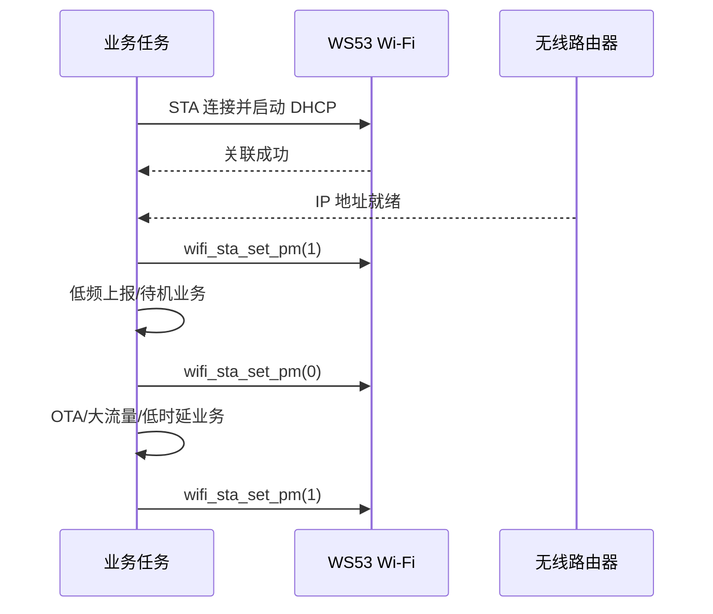

# Wi-Fi STA 省电模式

> 本文介绍如何在 WS53 STA 连接流程中使用 `wifi_sta_set_pm()`，并给出业务动态切换、断线恢复和功耗验证方法。当前 SDK 没有独立的 Wi-Fi 省电 sample，可在 [STA 连接与重连](../sta/sta-connect.md)基础上集成。

## 学习目标

- 理解 STA 省电对平均功耗、下行时延和网络保活的影响。
- 正确使用 `wifi_sta_set_pm()` 开启或关闭 Wi-Fi STA 省电模式。
- 设计连接恢复、OTA/大流量临时退出省电和实际功耗对比流程。

## 案例说明

STA 关联 AP 后，可在无收发时段进入链路层省电，并按照 AP 的 Beacon/DTIM 节奏接收缓存数据。省电通常有利于降低平均功耗，但可能增加下行响应时延，并影响长连接、广播/组播和实时业务体验。



## 关键接口与边界

```c
errcode_t wifi_sta_set_pm(uint8_t ps_switch);
```

| `ps_switch` | 含义 |
| --- | --- |
| `0` | 关闭 STA 省电模式 |
| `1` | 开启 STA 省电模式 |

调用前必须满足：

- Wi-Fi 已通过 `wifi_init()` 初始化。
- STA 已通过 `wifi_sta_enable()` 使能。

公共 Wi-Fi Device API 没有提供对应的省电状态查询接口。应用应保存自己的目标状态和最近一次设置结果，但不能把软件变量当成射频已经实际休眠的证明。接口详情参见 [`wifi_sta_set_pm`](../../../../api-reference/middleware/services/wifi/device.md#wifi_sta_set_pm)。

!!! note
    服务源码中还存在 `wifi_sta_set_pm_param()` 实现，但当前公共 `wifi_device.h` 和 API 文档没有声明该接口。本案例只使用公开的 `wifi_sta_set_pm()`，不要依赖未公开接口及其参数范围。

## 推荐策略

| 业务阶段 | 建议 | 原因 |
| --- | --- | --- |
| 扫描、关联和 DHCP | 保持默认策略 | 便于定位接入和地址获取问题 |
| IP 就绪后的低频上报 | 评估后开启 | 通常有利于降低空闲平均功耗 |
| OTA、大文件、低时延交互 | 临时关闭 | 减少睡眠带来的时延和吞吐波动 |
| STA 断开或重连 | 由连接状态机处理 | 回调中不做等待或复杂接口调用 |
| 重新获得 IP | 按目标策略重新设置 | 确保重连后的实际配置符合业务预期 |

## 代码详解

### 1. 在任务中统一设置省电状态

```c
#include "wifi_device.h"

static uint8_t g_pm_target = 1;  /* 产品默认希望开启省电 */
static uint8_t g_pm_applied;

static errcode_t wifi_pm_apply(uint8_t enable)
{
    errcode_t ret;

    if ((enable != 0) && (enable != 1)) {
        return ERRCODE_FAIL;
    }

    ret = wifi_sta_set_pm(enable);
    if (ret == ERRCODE_SUCC) {
        g_pm_applied = enable;
    }
    return ret;
}
```

`g_pm_applied` 只表示最近一次接口调用成功，不是硬件睡眠状态。设置失败时应保留错误信息并按业务策略重试，不能无条件修改记录值。

### 2. 等待关联和 IP 就绪后开启

接口的最低前置条件是 Wi-Fi 已初始化且 STA 已使能。为了使连接和功耗测试流程更清晰，推荐在关联成功并获得有效 IP 后开启省电。

```c
static volatile int g_sta_connected;
static volatile int g_sta_ip_ready;

static void pm_connection_changed(int32_t state,
    const wifi_linked_info_stru *info, int32_t reason_code)
{
    (void)info;
    (void)reason_code;

    g_sta_connected = (state == WIFI_CONNECTED);
    if (g_sta_connected == 0) {
        g_sta_ip_ready = 0;
    }
}

static void pm_on_dhcp_ready(void)
{
    g_sta_ip_ready = 1;
    if (g_pm_target == 1) {
        (void)wifi_pm_apply(1);
    }
}
```

Wi-Fi 事件回调中只更新连接状态或投递消息。`pm_on_dhcp_ready()` 应由 STA 业务任务在确认 DHCP 地址、掩码和网关有效后调用，不应直接在 Wi-Fi 回调中执行 DHCP 等待或 `osal_msleep()`。

### 3. 为高吞吐业务临时关闭省电

```c
static errcode_t wifi_pm_enter_high_performance(void)
{
    g_pm_target = 0;
    if (g_sta_ip_ready == 0) {
        return ERRCODE_SUCC;
    }
    return wifi_pm_apply(0);
}

static errcode_t wifi_pm_leave_high_performance(void)
{
    g_pm_target = 1;
    if (g_sta_ip_ready == 0) {
        return ERRCODE_SUCC;
    }
    return wifi_pm_apply(1);
}
```

OTA 或大文件传输开始前调用 `wifi_pm_enter_high_performance()`，传输结束且业务确认无待发数据后调用 `wifi_pm_leave_high_performance()`。如果多个模块都可能申请高性能模式，产品应增加互斥锁和引用计数：只有最后一个申请者释放后才能重新开启省电，避免一个业务提前改变另一个业务所需的状态。

### 4. 处理断开和自动重连

断开事件中只将 `g_sta_ip_ready` 清零并通知连接任务，不需要阻塞等待，也不应在回调中反复设置省电。自动重连成功后执行以下顺序：

1. 等待 STA 重新关联。
2. 重新启动或确认 DHCP，并检查 IP、网关和 DNS。
3. 恢复 TCP/MQTT 等上层会话。
4. 根据 `g_pm_target` 再次调用 `wifi_sta_set_pm()`。

若产品优先追求首包时延，也可先恢复必要会话，再开启省电；但测试流程必须固定，便于比较功耗和时延。

### 5. 与系统级低功耗分层

`wifi_sta_set_pm()` 只控制 Wi-Fi STA 的链路层省电策略，不会自动完成以下工作：

- 让应用任务停止轮询或进入阻塞等待。
- 关闭未使用外设的时钟和电源。
- 配置系统级浅睡/深睡及唤醒源。
- 调整 TCP/MQTT 保活、传感器采样或定时器周期。

因此，Wi-Fi 省电应作为整机低功耗方案的一部分，而不能单独代表整机已经进入低功耗状态。

## 运行与验证

当前没有独立 sample，需在 `sta_sample` 或产品 STA 工程中加入上述控制逻辑。

1. 使用同一固件版本、板卡、供电、AP、信道、RSSI 和业务流量建立基线。
2. STA 稳定关联并获得 IP 后，先调用 `wifi_sta_set_pm(0)`，记录足够长时间的平均电流和峰值。
3. 在其他条件不变时调用 `wifi_sta_set_pm(1)`，使用相同测量窗口再次记录。
4. 同时记录 RSSI、重传、丢包率、往返时延、吞吐和断线次数，不能只比较电流。
5. 验证 TCP/MQTT 保活、广播/组播接收、周期上报和服务端下行唤醒。
6. 验证弱信号、AP 重启、信道变化、STA 自动重连和重新获得 IP 后的省电恢复。
7. 执行 OTA 或持续传输，确认开始前关闭、结束后只恢复一次，并检查失败路径也能释放高性能申请。
8. 若调用返回成功但电流没有明显下降，继续检查 AP 的 Beacon/DTIM、网络背景流量、应用定时唤醒、CPU 和其他外设状态。

不要直接沿用其他板卡或其他 AP 的电流数据；实际收益取决于 AP 配置、信号质量、广播/组播流量、重传和整机软件状态。

构建、烧录和串口日志查看方法参见[快速入门](../../../../get-started/quick-start.md)。
