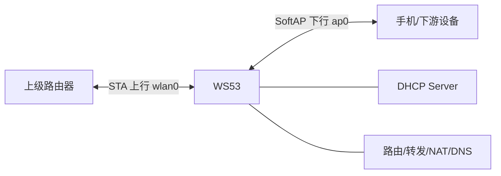
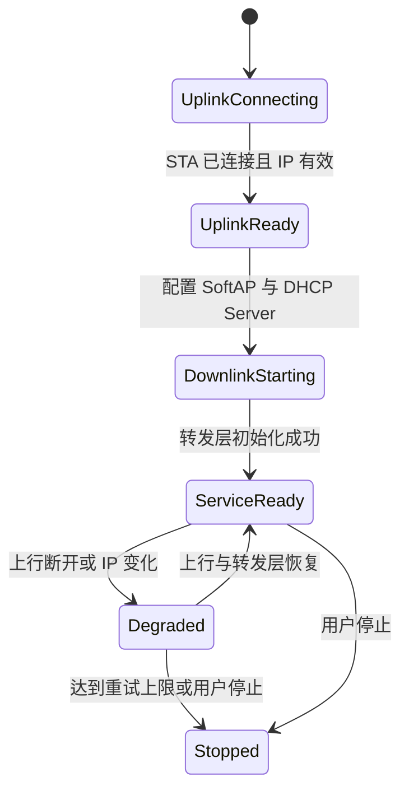

# Wi-Fi 中继设计

> 本页说明 STA (Station) 与 SoftAP 组合时的架构约束。当前 `src/application/samples` 和 `vendor` 中没有可直接构建的中继案例工程。

## 学习目标

- 理解 STA 上行、SoftAP 下行和 IP 转发层之间的依赖关系。
- 掌握上行就绪、下行启动、业务转发和异常恢复的状态机设计。
- 明确当前 SDK 示例可复用的范围，以及产品必须自行实现的网络层能力。

## 案例说明

WS53 通过 STA 接口连接上级路由器，通过 SoftAP 接口向手机或其他终端提供下游无线网络。若要让下游访问上游，还需在两个网络接口之间实现地址分配、路由、IP 转发、DNS 和按产品方案选择的 NAT。



基础无线接口的完整实现分别参见 [STA 连接与重连](./sta/sta-connect.md)和 [SoftAP 热点](./softap/softap.md)。

## 关键配置

| 配置项 | 推荐设计 | 说明 |
| --- | --- | --- |
| 上行接口 | `wlan0`，作为 DHCP Client | STA 关联成功后还要等待获得有效 IP |
| 下行接口 | `ap0`，使用静态网关地址 | 可参考 `192.168.43.1/24`，但必须避开上游网段 |
| 下游地址分配 | 在 `ap0` 上启动 DHCP Server | 向客户端提供地址、网关和 DNS 信息 |
| SoftAP 信道 | 与当前 STA/并发策略一致 | STA 和 SoftAP 共享射频，不能假设能独立工作在不同信道 |
| 转发方式 | 路由、代理或 NAT 由产品选择 | 当前 Wi-Fi Sample 未提供现成 NAT 接口和连接跟踪模块 |
| 上行掉线策略 | 进入降级态并停止对外转发 | 可按产品策略保留或关闭下游局域网 |

## 推荐状态机



只有进入 `ServiceReady` 后，才应向业务报告“中继网络可用”。SoftAP 已启动只能说明下游无线和局域网可用，不能代表互联网访问可用。

## 代码详解

以下代码为集成骨架，用于说明各模块的责任和调用位置，不是仓库内可独立构建的中继 Sample。

### 1. 回调中只更新上行状态

```c
typedef enum {
    REPEATER_UPLINK_DOWN = 0,
    REPEATER_UPLINK_ASSOCIATED,
    REPEATER_UPLINK_IP_READY,
} repeater_uplink_state_enum;

static volatile repeater_uplink_state_enum g_uplink_state =
    REPEATER_UPLINK_DOWN;

static void repeater_sta_connection_changed(int32_t state,
    const wifi_linked_info_stru *info, int32_t reason_code)
{
    (void)info;
    (void)reason_code;
    g_uplink_state = (state == WIFI_CONNECTED) ?
        REPEATER_UPLINK_ASSOCIATED : REPEATER_UPLINK_DOWN;
}
```

回调运行在 Wi-Fi 事件上下文中，只记录状态或投递消息。DHCP、SoftAP 启停、转发表更新和重连等待都应放在业务任务中执行。

### 2. STA 获得 IP 后再启动下行

STA 连接代码可直接复用 `sta_sample` 的流程：调用 `wifi_sta_enable()` 和 `wifi_sta_connect()`，收到关联成功事件后在 `wlan0` 上启动 DHCP Client。

```c
struct netif *uplink = netifapi_netif_find("wlan0");

if ((uplink == NULL) || (netifapi_dhcp_start(uplink) != ERR_OK)) {
    /* 回到上行连接态并执行错误恢复。 */
}

/* 轮询 DHCP 状态或使用网络事件确认地址有效后再置位。 */
g_uplink_state = REPEATER_UPLINK_IP_READY;
```

不能把 STA 关联事件当作 IP 就绪事件。上游地址续租或变更时，也要重新检查路由和 NAT 状态。

### 3. 配置 SoftAP 网关和 DHCP Server

下游接口初始化可复用 `softap_sample`，关键顺序如下。

```c
softap_config_stru ap_config = {0};
struct netif *downlink;
ip4_addr_t ipaddr;
ip4_addr_t netmask;
ip4_addr_t gateway;

/* 填写 ap_config.ssid、pre_shared_key、security_type 和 channel_num。 */
if (wifi_softap_enable(&ap_config) != ERRCODE_SUCC) {
    /* 启动失败，保持在 DownlinkStarting 或进入 Stopped。 */
}

downlink = netifapi_netif_find("ap0");
IP4_ADDR(&ipaddr, 192, 168, 43, 1);
IP4_ADDR(&netmask, 255, 255, 255, 0);
IP4_ADDR(&gateway, 192, 168, 43, 1);

if ((downlink == NULL) ||
    (netifapi_netif_set_addr(downlink, &ipaddr, &netmask, &gateway) != ERR_OK) ||
    (netifapi_dhcps_start(downlink, NULL, 0) != ERR_OK)) {
    (void)wifi_softap_disable();
    /* 释放已创建的下游资源并报告启动失败。 */
}
```

启动前必须比较上游和下游网段。如果上级路由器也使用 `192.168.43.0/24`，应选择其他私网网段并重新配置 DHCP 地址池。

### 4. 在无线接口就绪后接入转发层

```c
static int repeater_forwarding_start(struct netif *uplink,
    struct netif *downlink)
{
    /*
     * 产品在此处初始化路由、IP 转发、DNS 代理以及可选 NAT。
     * 当前 src/application/samples/wifi/ 未提供可直接调用的中继/NAT 实现。
     */
    return PRODUCT_FORWARDING_NOT_IMPLEMENTED;
}
```

转发层应明确以下内容：

- 下游到上游的路由和源地址转换策略。
- DNS 服务器下发、转发或代理方式。
- TCP/UDP/ICMP 的连接跟踪上限和超时。
- 下游客户端隔离、防火墙以及 WS53 管理面的访问控制。

不要在文档或产品代码中用一个虚构的 `nat_enable()` 调用掩盖这些能力。应根据实际采用的网络组件提供初始化、刷新和销毁接口。

### 5. 处理上行掉线和地址变化

```c
static void repeater_on_uplink_lost(void)
{
    g_uplink_state = REPEATER_UPLINK_DOWN;

    /* 由业务任务停止新建转发，清理旧路由/NAT/连接跟踪。 */
    product_forwarding_stop();

    /* SoftAP 是否保留由产品策略决定；保留时只能承诺局域网可用。 */
    repeater_notify_offline();
}
```

STA 自动重连成功并重新获得 IP 后，应使用新地址重建转发层，再从 `Degraded` 返回 `ServiceReady`。若达到重连上限，则通知业务进入离线状态。

### 6. 按依赖关系退出

建议按以下顺序释放资源：

1. 停止上层 TCP/UDP 会话，禁止新连接进入。
2. 停止转发、DNS 代理、NAT 和连接跟踪。
3. 停止 `ap0` 上的 DHCP Server。
4. 调用 `wifi_softap_disable()` 关闭下行接口。
5. 停止 `wlan0` 上的 DHCP Client并断开 STA。
6. 调用 `wifi_sta_disable()` 关闭上行接口。

## 运行与验证

1. 先分别运行 STA 和 SoftAP 案例，确认两个基础接口均能独立工作。
2. 在产品工程中实现状态机，并接入实际采用的转发/NAT 组件。
3. 检查上、下行网段不冲突，下游设备能获取正确的地址、网关和 DNS。
4. 分别验证下游访问 WS53、访问上游局域网和访问外网的安全策略。
5. 修改上级路由器信道或重启路由器，验证 SoftAP 信道同步、STA 重连和转发恢复。
6. 触发上游 DHCP 地址变化，确认旧路由和连接跟踪已清理，新地址生效。
7. 使用多个客户端进行长连接和大流量测试，检查地址、Socket 和连接跟踪资源是否泄漏。
8. 停止服务后确认 DHCP、无线接口和转发资源均已释放。

构建、烧录和串口日志查看方法参见[快速入门](../../../get-started/quick-start.md)。
