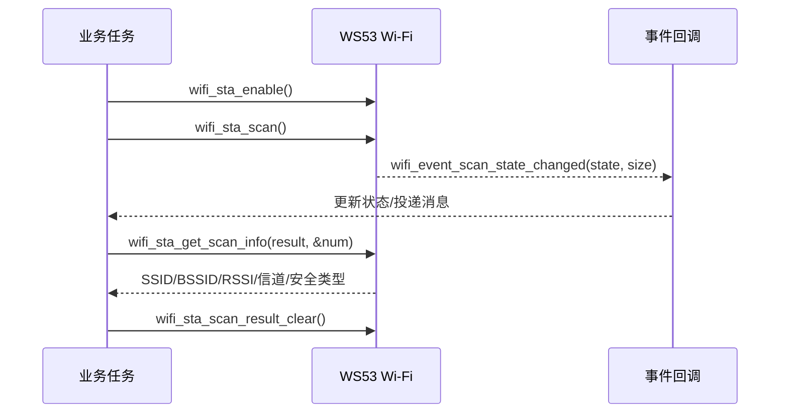

# Wi-Fi 扫描

> 本文介绍 WS53 STA 的基础扫描、定向扫描、异步事件处理和结果读取。当前 SDK 没有独立的扫描示例，完整流程可参考 `src/application/samples/wifi/sta_sample/sta_sample.c`。

## 学习目标

- 使用 WS53 STA 接口扫描周围无线接入点。
- 在扫描完成事件后安全地读取、筛选和释放扫描结果。
- 根据 SSID、SSID 前缀、BSSID 或信道执行定向扫描。

## 案例说明

扫描是异步操作。`wifi_sta_scan()` 或 `wifi_sta_scan_advance()` 返回成功，只表示扫描请求已被接受；应用必须等待 `wifi_event_scan_state_changed` 回调，再在任务上下文调用 `wifi_sta_get_scan_info()`。



## 关键接口

| 接口 | 用途 |
| --- | --- |
| `wifi_sta_scan()` | 发起全信道基础扫描 |
| `wifi_sta_scan_advance()` | 按指定 SSID、前缀、BSSID 或单一信道扫描 |
| `wifi_sta_scan_stop()` | 强制停止正在进行的 STA 扫描 |
| `wifi_sta_get_scan_info()` | 读取服务保存的扫描结果 |
| `wifi_sta_scan_result_clear()` | 清空服务保存的扫描结果 |
| `wifi_register_event_cb()` | 注册扫描状态变化回调 |

接口和结构体定义参见 [Wi-Fi Device API](../../../../api-reference/middleware/services/wifi/device.md)。

## 代码详解

### 1. 注册扫描事件

```c
#include "wifi_device.h"
#include "wifi_event.h"

static volatile int g_scan_done;
static volatile int32_t g_scan_state;
static volatile int32_t g_scan_result_hint;

static void scan_state_changed(int32_t state, int32_t size)
{
    g_scan_state = state;
    g_scan_result_hint = size;
    g_scan_done = 1;
}

static errcode_t scan_register_event(void)
{
    wifi_event_stru event = {0};

    event.wifi_event_scan_state_changed = scan_state_changed;
    return wifi_register_event_cb(&event);
}
```

`size` 可用于日志或预估结果数量，但读取结果时仍要给 `wifi_sta_get_scan_info()` 传入实际数组容量。回调中不要分配大块内存、打印全部 AP 或直接发起连接。

### 2. 发起基础扫描

```c
static errcode_t scan_start(void)
{
    if (wifi_is_wifi_inited() == 0) {
        return ERRCODE_FAIL;
    }
    if (wifi_sta_enable() != ERRCODE_SUCC) {
        return ERRCODE_FAIL;
    }

    g_scan_done = 0;
    g_scan_result_hint = 0;
    return wifi_sta_scan();
}
```

如果 STA 已经使能，无需重复调用 `wifi_sta_enable()`。扫描请求失败时不要等待完成标志，应立即进入错误处理或稍后重试。

### 3. 在任务中读取并筛选结果

WS53 服务接口一次最多接收 64 项结果容量。下面沿用 `sta_sample` 的做法，在任务中申请结果数组。

```c
#include <string.h>
#include "securec.h"
#include "soc_osal.h"

#define SCAN_RESULT_MAX 64

static int scan_read_result(const char *target_ssid)
{
    uint32_t capacity = SCAN_RESULT_MAX;
    uint32_t bytes = sizeof(wifi_scan_info_stru) * capacity;
    wifi_scan_info_stru *result = osal_kmalloc(bytes, OSAL_GFP_ATOMIC);
    int found = 0;

    if (result == NULL) {
        return 0;
    }
    (void)memset_s(result, bytes, 0, bytes);

    if (wifi_sta_get_scan_info(result, &capacity) == ERRCODE_SUCC) {
        for (uint32_t i = 0; i < capacity; i++) {
            if (strcmp(result[i].ssid, target_ssid) == 0) {
                found = 1;
                /* 复制 BSSID、安全类型、信道等需要保留的字段。 */
                break;
            }
        }
    }

    osal_kfree(result);
    return found;
}
```

`capacity` 输入时表示数组可容纳的条目数，输出时表示实际返回数量，有效范围为 1～64。若结果超过数组容量，接口只返回容量范围内的数据。

不要只根据 SSID 判断唯一 AP。多个 AP 可能使用相同 SSID，漫游或选网时还应结合 BSSID、RSSI、安全类型和产品策略。SSID 数组最大长度固定，但业务代码仍应以合法字符串边界或显式长度处理外部数据。

### 4. 发起定向扫描

`wifi_sta_scan_advance()` 支持以下扫描类型。

| `scan_type` | 必填字段 | 说明 |
| --- | --- | --- |
| `WIFI_CHANNEL_SCAN` | `channel_num` | 扫描指定的单一信道 |
| `WIFI_SSID_SCAN` | `ssid`、`ssid_len` | 精确匹配 SSID |
| `WIFI_SSID_PREFIX_SCAN` | `ssid`、`ssid_len` | 匹配指定 SSID 前缀 |
| `WIFI_BSSID_SCAN` | `bssid` | 匹配指定 AP 的 BSSID |

`WIFI_BASIC_SCAN` 应调用 `wifi_sta_scan()`，不能作为 `wifi_sta_scan_advance()` 的参数。

按 SSID 扫描示例如下。

```c
static errcode_t scan_by_ssid(const char *ssid)
{
    wifi_scan_params_stru param = {0};
    size_t ssid_len = strlen(ssid);

    if ((ssid_len == 0) || (ssid_len >= sizeof(param.ssid))) {
        return ERRCODE_FAIL;
    }
    if (memcpy_s(param.ssid, sizeof(param.ssid),
        ssid, ssid_len + 1) != EOK) {
        return ERRCODE_FAIL;
    }

    param.ssid_len = (int8_t)ssid_len;
    param.scan_type = WIFI_SSID_SCAN;
    g_scan_done = 0;
    return wifi_sta_scan_advance(&param);
}
```

按信道扫描只需设置 `scan_type = WIFI_CHANNEL_SCAN` 和 `channel_num`。接口实现接受 1～14，但实际可用信道必须同时符合当前国家码、射频法规和产品配置。

### 5. 停止扫描和清理缓存

```c
static void scan_request_stop(void)
{
    if (g_scan_done == 0) {
        (void)wifi_sta_scan_stop();
    }
}

static void scan_clear_result(void)
{
    /* 等待完成/停止事件并结束本轮结果处理后再调用。 */
    (void)wifi_sta_scan_result_clear();
}
```

强制停止扫描后仍应正确处理扫描状态事件，避免业务状态机永久停留在“扫描中”。读取完成后，如果不再需要旧结果，可调用 `wifi_sta_scan_result_clear()` 释放服务侧缓存；下一次扫描前也可按产品策略清理，避免误用上一轮结果。

## 扫描结果字段

`wifi_scan_info_stru` 的常用字段如下。

| 字段 | 含义 |
| --- | --- |
| `ssid` | 接入点名称 |
| `bssid` | 接入点 MAC 地址 |
| `security_type` | 安全类型；构造连接参数时应使用与目标 AP 匹配的值 |
| `rssi` | 接收信号强度，数值越接近 0 通常表示信号越强 |
| `band` | 频带信息 |
| `channel_num` | AP 工作信道 |

## 运行与验证

1. 使能并运行 `sta_sample`，确认日志出现 `Scan start` 和 `Scan done`。
2. 在 `example_get_match_network()` 中检查 `wifi_sta_get_scan_info()` 返回数量和目标 SSID。
3. 分别验证基础扫描、指定信道、精确 SSID、SSID 前缀和 BSSID 扫描。
4. 准备重名 SSID，确认业务能通过 BSSID、RSSI 和安全类型选择正确 AP。
5. 验证无 AP、隐藏 SSID、大量 AP、扫描请求失败和扫描中止场景。
6. 扫描期间会占用射频资源。STA 已连接或与 SoftAP/P2P 并发时，应根据时延和信道策略限制扫描频率。
7. 连续执行多轮扫描并清理结果，检查任务内存和服务侧结果缓存没有持续增长。

构建、烧录和串口日志查看方法参见[快速入门](../../../../get-started/index.md)。
