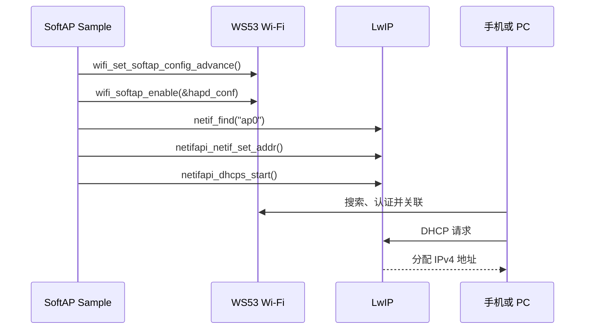

# SoftAP 热点

> WS53 作为 SoftAP 创建无线热点，并通过静态 IPv4 地址和 DHCP Server 为接入终端提供局域网连接。

## 学习目标

- 配置并启动 WS53 Wi-Fi SoftAP。
- 为 AP 接口设置静态 IPv4 地址并启动 DHCP Server。
- 通过事件或查询接口管理已接入的 STA。

## 案例说明

源码位于 `src/application/samples/wifi/softap_sample/`。案例等待 Wi-Fi 初始化完成后，配置 SoftAP 基本参数和扩展参数，创建 `ap0` 接口，再为该接口设置 `192.168.43.1/24` 静态地址并启动 DHCP Server。



SoftAP 无线接口、IPv4 地址和 DHCP Server 是三个独立环节。`wifi_softap_enable()` 返回成功只表示热点接口启动成功；如果没有正确设置 `ap0` 地址并启动 DHCP Server，终端可能已经关联，但无法自动获得 IP 地址。

## 关键配置

- 启用 `ENABLE_WIFI_SAMPLE` 和 `SAMPLE_SUPPORT_SOFTAP_SAMPLE`。
- 在 `softap_sample.c` 的 `example_softap_function()` 中修改 SSID、密码、信道、安全类型、扩展参数和网络地址。
- 信道必须符合当前国家码、区域法规和测试终端能力。案例默认使用信道 13，部分终端或区域配置可能不支持。

默认参数如下，仅用于案例联调：

| 参数 | 默认值 | 修改位置 |
| --- | --- | --- |
| SSID | `my_softAP` | `ssid` |
| 密码 | `my_password` | `pre_shared_key` |
| 安全类型 | WPA/WPA2-PSK 混合模式 | `hapd_conf.security_type`，源码当前赋值为 `3` |
| 信道 | 13 | `hapd_conf.channel_num` |
| Beacon 周期 | 100 ms | `config.beacon_interval` |
| DTIM 周期 | 2 | `config.dtim_period` |
| 组密钥更新周期 | 86400 秒 | `config.group_rekey` |
| 协议模式 | 802.11b/g/n/ax | `config.protocol_mode`，源码当前赋值为 `4` |
| SSID 广播 | 不隐藏 | `config.hidden_ssid_flag = 1` |
| AP 接口 | `ap0` | `ifname` |
| AP 地址和网关 | `192.168.43.1` | `st_ipaddr`、`st_gw` |
| 子网掩码 | `255.255.255.0` | `st_netmask` |

产品代码建议使用 `WIFI_SEC_TYPE_WPA2_WPA_PSK_MIX`、`WIFI_MODE_11B_G_N_AX` 等枚举名代替数字常量。修改 AP 接口名或网段时，必须同步修改 LwIP 网络接口、静态地址和 DHCP Server 配置；下游网段还应避免与可能存在的 STA 上游网段冲突。

## 代码详解

### 等待 Wi-Fi 初始化

SoftAP Sample 由独立任务运行。任务首先等待系统完成 Wi-Fi 初始化，再进入热点配置流程：

```c
while (wifi_is_wifi_inited() == 0) {
    osDelay(10);
}

if (example_softap_function() != 0) {
    PRINT("[WIFI_SOFTAP_SAMPLE]::example_softap_function fail.\r\n");
    return -1;
}
```

这里的等待只确认 Wi-Fi 模块已经初始化，不代表 SoftAP 接口已经创建。实际产品可以由系统就绪事件触发热点任务，避免永久轮询。

### 配置 SoftAP 基本参数

`softap_config_stru` 保存 SSID、预共享密钥、安全类型和信道。下面使用枚举名表示当前 Sample 中的数字配置：

```c
int8_t ssid[WIFI_MAX_SSID_LEN] = "my_softAP";
int8_t pre_shared_key[WIFI_MAX_KEY_LEN] = "my_password";
softap_config_stru hapd_conf = {0};

memcpy_s(hapd_conf.ssid, sizeof(hapd_conf.ssid),
    ssid, sizeof(ssid));
memcpy_s(hapd_conf.pre_shared_key, sizeof(hapd_conf.pre_shared_key),
    pre_shared_key, sizeof(pre_shared_key));

hapd_conf.security_type = WIFI_SEC_TYPE_WPA2_WPA_PSK_MIX;
hapd_conf.channel_num = 13;
hapd_conf.wifi_psk_type = 0;
```

`ssid` 和 `pre_shared_key` 缓冲区在复制前已经清零，因此短字符串后仍保留结束符。产品代码必须检查 `memcpy_s()` 返回值，并校验 SSID、密码长度、安全类型和信道是否合法。不要在日志中打印明文密码。

### 配置 SoftAP 扩展参数

扩展配置需要在 `wifi_softap_enable()` 之前设置：

```c
softap_config_advance_stru config = {0};

config.beacon_interval = 100;
config.dtim_period = 2;
config.gi = 0;
config.group_rekey = 86400;
config.protocol_mode = WIFI_MODE_11B_G_N_AX;
config.hidden_ssid_flag = 1;

if (wifi_set_softap_config_advance(&config) != ERRCODE_SUCC) {
    return -1;
}
```

`hidden_ssid_flag = 1` 表示不隐藏 SSID；`gi = 0` 表示不配置该项。Beacon、DTIM 和组密钥更新周期都有有效范围，产品应使用 [Wi-Fi Hotspot API](../../../../api-reference/middleware/services/wifi/hotspot.md) 中定义的约束，不要直接照搬其他芯片参数。

### 启动热点并配置 DHCP Server

基本参数和扩展参数就绪后启动 SoftAP：

```c
if (wifi_softap_enable(&hapd_conf) != ERRCODE_SUCC) {
    return -1;
}
```

热点启动后，查找自动创建的 `ap0` 接口并设置静态网络参数：

```c
ip4_addr_t ipaddr;
ip4_addr_t netmask;
ip4_addr_t gateway;

IP4_ADDR(&ipaddr, 192, 168, 43, 1);
IP4_ADDR(&netmask, 255, 255, 255, 0);
IP4_ADDR(&gateway, 192, 168, 43, 1);

struct netif *netif_p = netif_find("ap0");
if (netif_p == NULL) {
    wifi_softap_disable();
    return -1;
}

if (netifapi_netif_set_addr(netif_p, &ipaddr, &netmask, &gateway) != ERR_OK) {
    wifi_softap_disable();
    return -1;
}
```

最后启动 DHCP Server：

```c
if (netifapi_dhcps_start(netif_p, NULL, 0) != ERR_OK) {
    wifi_softap_disable();
    return -1;
}

PRINT("[WIFI_SOFTAP_SAMPLE]::SoftAp start success.\r\n");
```

`netifapi_dhcps_start()` 的第二、三个参数为 `NULL` 和 `0` 时使用协议栈默认地址池。产品需要固定地址范围、租约或 DNS 策略时，应按当前 LwIP 配置补充参数。任何网络配置步骤失败后都要关闭已经启动的 SoftAP，避免留下“能被发现但不能正常分配地址”的半初始化状态。

## 客户端状态与服务管理

当前案例只启动 SoftAP 和 DHCP Server，没有注册客户端上下线事件。产品需要管理接入终端时，可通过 `wifi_register_event_cb()` 注册以下回调：

```c
static void softap_sta_join(const wifi_sta_info_stru *info)
{
    /* 记录 MAC 或向业务任务投递上线消息。 */
    (void)info;
}

static void softap_sta_leave(const wifi_sta_info_stru *info)
{
    /* 清理该终端关联的业务状态。 */
    (void)info;
}

static wifi_event_stru g_softap_event = {
    .wifi_event_softap_sta_join = softap_sta_join,
    .wifi_event_softap_sta_leave = softap_sta_leave,
};

wifi_register_event_cb(&g_softap_event);
```

事件回调中只更新状态或投递消息，不要执行延时、阻塞式网络操作或复杂业务。还可以使用 `wifi_softap_get_sta_list()` 查询当前客户端，或使用 `wifi_softap_deauth_sta()` 断开指定 MAC 地址的终端。接口参数和返回值见 [Wi-Fi Hotspot API](../../../../api-reference/middleware/services/wifi/hotspot.md)。

停止 SoftAP 时应按照依赖关系释放资源：

1. 停止依赖下游连接的业务。
2. 调用 `netifapi_dhcps_stop()` 停止 `ap0` 上的 DHCP Server。
3. 调用 `wifi_softap_disable()` 关闭 SoftAP。
4. 清理客户端列表、地址租约映射和业务状态。

STA 与 SoftAP 并发时，两者共享射频资源，应根据当前固件的并发和信道策略设计状态机。启动两个无线接口并不会自动提供路由或 NAT。

## 案例操作指导

1. 根据测试环境修改 SSID、密码、信道和 AP 网段，然后构建并烧录 WS53。
2. 确认日志依次出现 `wifi init succ` 和 `SoftAp start success`。
3. 使用手机或 PC 搜索 `my_softAP`，输入 `my_password` 并连接。
4. 确认终端获得 `192.168.43.0/24` 网段地址，默认网关为 `192.168.43.1`。
5. 从终端访问 `192.168.43.1`，验证终端到 WS53 的局域网链路。

构建方法参见[快速入门](../../../../get-started/quick-start.md)。若需要让 SoftAP 客户端访问 STA 上游网络，还必须实现路由、转发及必要的 NAT。
