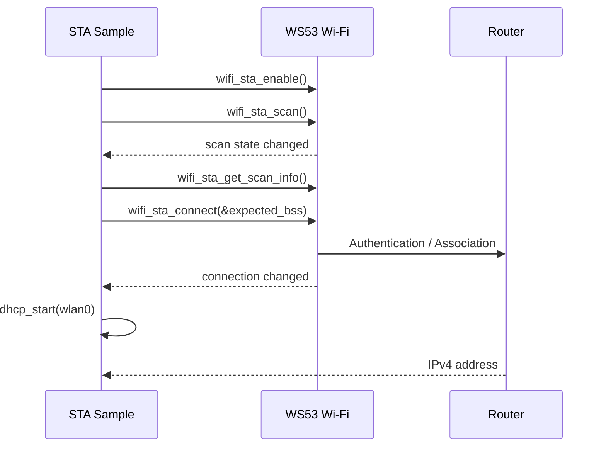

# STA 连接与重连

> WS53 作为 STA (Station) 连接路由器，并通过事件和重连策略维护网络可用状态。

## 学习目标

- 扫描指定 SSID 并建立 Wi-Fi STA 连接。
- 通过 DHCP 获取 IPv4 地址并识别各阶段日志。

## 案例说明

源码位于 `src/application/samples/wifi/sta_sample/`。案例启用 STA 后执行扫描，在结果中查找目标 BSS，使用扫描结果中的安全类型发起连接，关联成功后为 `wlan0` 启动 DHCP Client。



`wifi_sta_scan()` 和 `wifi_sta_connect()` 都是异步请求。应用不能只根据函数返回值判断扫描或关联已经完成，必须等待对应事件；TCP、UDP、MQTT 等网络业务还必须等待 DHCP 成功。

## 关键配置

- 启用 `ENABLE_WIFI_SAMPLE` 和 `SAMPLE_SUPPORT_STA_SAMPLE`。
- 在 `sta_sample.c` 的 `example_get_match_network()` 中修改 `expected_ssid` 和 `key`。默认值为 `my_softAP` / `my_password`，仅用于演示。
- 目标 AP 应工作在 WS53 支持的频段和安全模式。

默认参数如下，仅用于案例联调：

| 参数 | 默认值 | 修改位置 |
| --- | --- | --- |
| SSID | `my_softAP` | `example_get_match_network()` 中的 `expected_ssid` |
| 密码 | `my_password` | `example_get_match_network()` 中的 `key` |
| STA 接口 | `wlan0` | `example_sta_function()` 中的 `ifname` |
| IP 获取方式 | DHCP | `expected_bss->ip_type = 1` |

扫描结果中的 `security_type` 和 BSSID 会复制到 `wifi_sta_config_stru`，因此同名 AP 较多时，产品代码应增加 BSSID、信号强度或信道筛选策略，不能总是连接第一个同名结果。

## 连接状态与重连

案例使用 `wifi_event_connection_changed` 更新关联状态，并在 DHCP 超时或关联失败后重新进入扫描流程。这属于应用层手动重试。产品如需使用协议栈自动重连，推荐在首次关联成功后配置：

```c
wifi_sta_set_reconnect_policy(1, 10, 5, 10);
```

上述参数依次表示使能自动重连、单次重连超时 10 秒、重连间隔 5 秒和最大尝试 10 次。参数范围和返回值见 [`wifi_sta_set_reconnect_policy`](../../../../api-reference/middleware/services/wifi/device.md#wifi_sta_set_reconnect_policy)。

启用协议栈自动重连后，断开事件中只更新链路/IP 状态并挂起上层会话，不要再把 `g_wifi_state` 置为 `WIFI_STA_SAMPLE_INIT` 发起手动扫描，否则两套重连机制可能同时运行。重新关联后还需要重新确认 DHCP 地址，再恢复 TCP、MQTT 等业务。

## 代码详解

### 注册事件并维护状态

案例注册扫描完成和连接变化两个事件：

```c
static void wifi_scan_state_changed(int32_t state, int32_t size)
{
    (void)state;
    (void)size;
    g_wifi_state = WIFI_STA_SAMPLE_SCAN_DONE;
}

static void wifi_connection_changed(int32_t state,
    const wifi_linked_info_stru *info, int32_t reason_code)
{
    (void)info;
    (void)reason_code;

    if (state == WIFI_STATE_NOT_AVALIABLE) {
        g_wifi_state = WIFI_STA_SAMPLE_INIT;
    } else {
        g_wifi_state = WIFI_STA_SAMPLE_CONNECT_DONE;
    }
}

static wifi_event_stru g_wifi_event = {
    .wifi_event_connection_changed = wifi_connection_changed,
    .wifi_event_scan_state_changed = wifi_scan_state_changed,
};

wifi_register_event_cb(&g_wifi_event);
```

`wifi_sta_scan()` 和 `wifi_sta_connect()` 的返回值只表示请求是否成功提交，真正的扫描或连接结果由事件回调更新。回调只切换状态，扫描结果读取、重试和 DHCP 等耗时操作均在 STA 任务中执行。

当前 Sample 使用 `0` 和 `1` 判断连接状态，代码中可改用 `WIFI_STATE_NOT_AVALIABLE` 和 `WIFI_STATE_AVALIABLE` 提高可读性。若改用协议栈自动重连，断开分支应进入单独的“重连中”状态，而不是返回 `WIFI_STA_SAMPLE_INIT`。

### 扫描并匹配目标 AP

初始状态下使能 STA 并发起扫描：

```c
if (wifi_sta_enable() != ERRCODE_SUCC) {
    return -1;
}

g_wifi_state = WIFI_STA_SAMPLE_SCANING;
if (wifi_sta_scan() != ERRCODE_SUCC) {
    g_wifi_state = WIFI_STA_SAMPLE_INIT;
}
```

收到扫描完成事件后，案例通过 `wifi_sta_get_scan_info()` 获取结果，并按 SSID 查找目标 AP：

```c
uint32_t ap_num = WIFI_SCAN_AP_LIMIT;
wifi_scan_info_stru *result = osal_kmalloc(
    sizeof(wifi_scan_info_stru) * WIFI_SCAN_AP_LIMIT, OSAL_GFP_ATOMIC);

if (result == NULL) {
    return -1;
}

if (wifi_sta_get_scan_info(result, &ap_num) != ERRCODE_SUCC) {
    osal_kfree(result);
    return -1;
}

for (uint32_t i = 0; i < ap_num; i++) {
    if (strlen(expected_ssid) == strlen(result[i].ssid) &&
        memcmp(expected_ssid, result[i].ssid, strlen(expected_ssid)) == 0) {
        /* 找到目标 AP，保存 i 后退出循环。 */
        break;
    }
}
```

找到目标 AP 后，需要同时填写 SSID、BSSID、安全类型、密码和 IP 获取方式：

```c
memcpy_s(expected_bss->ssid, sizeof(expected_bss->ssid),
    expected_ssid, strlen(expected_ssid));
memcpy_s(expected_bss->bssid, sizeof(expected_bss->bssid),
    result[bss_index].bssid, WIFI_MAC_LEN);
memcpy_s(expected_bss->pre_shared_key, sizeof(expected_bss->pre_shared_key),
    key, strlen(key));

expected_bss->security_type = result[bss_index].security_type;
expected_bss->ip_type = 1; /* DHCP */
```

安全类型应使用扫描结果中的值，不能固定写成某一种加密方式。同名 SSID 较多时，还应结合 BSSID、RSSI 或信道选择目标 AP。所有失败分支都必须释放 `result`。

### 发起连接并获取地址

配置准备完成后调用 `wifi_sta_connect()`：

```c
g_wifi_state = WIFI_STA_SAMPLE_CONNECTING;
if (wifi_sta_connect(&expected_bss) != ERRCODE_SUCC) {
    g_wifi_state = WIFI_STA_SAMPLE_INIT;
}
```

收到关联成功事件后，查找 `wlan0` 并启动 DHCP Client：

```c
struct netif *netif_p = netifapi_netif_find("wlan0");
if (netif_p == NULL || netifapi_dhcp_start(netif_p) != ERR_OK) {
    g_wifi_state = WIFI_STA_SAMPLE_INIT;
    return -1;
}

g_wifi_state = WIFI_STA_SAMPLE_GET_IP;
```

案例通过轮询接口地址判断 DHCP 是否成功：

```c
if (!ip_addr_isany(&netif_p->ip_addr)) {
    PRINT("[WIFI_STA_SAMPLE]::STA DHCP success.\r\n");
    /* 此时才能启动依赖 IP 的 TCP、UDP 或 MQTT 业务。 */
}
```

关联成功不等于网络可用。只有 DHCP 成功并获得有效 IP 后，才能设置“网络在线”状态。DHCP 超时、断开或重连时应清除旧地址和旧 socket 状态。

## 案例操作指导

1. 准备目标 AP，修改案例中的 SSID 和密码后构建、烧录。
2. 观察 `STA enable succ`、`Scan done`、`Connect succ` 日志。
3. 确认最终出现 `STA DHCP success`，并记录获取到的地址。

构建方法参见[快速入门](../../../../get-started/quick-start.md)。连接失败时依次检查扫描结果、安全类型、密码和 DHCP 服务。
