**概述**

本文档主要针对WS53V100中SAMPLE测试用例的使用进行介绍。用于指导工程人员能够快速使用SAMPLE测试用例进行外设驱动验证。

# SAMPLE简介

本模块用于提供其他软件模块验证用的测试SAMPLE。

# 外设SAMPLE用例

-   **[ADC](#ZH-CN_TOPIC_0000001954470945)**  

-   **[BLINKY](#ZH-CN_TOPIC_0000001954630717)**  

-   **[DMA](#ZH-CN_TOPIC_0000001927312046)**  

-   **[I2C](#ZH-CN_TOPIC_0000001927471374)**  

-   **[I2S](#ZH-CN_TOPIC_0000001954470949)**  

-   **[PINCTRL](#ZH-CN_TOPIC_0000001954630721)**  

-   **[PWM](#ZH-CN_TOPIC_0000001927312050)**  

-   **[RTC](#ZH-CN_TOPIC_0000001927471378)**  

-   **[SFC](#ZH-CN_TOPIC_0000001954470953)**  

-   **[SPI](#ZH-CN_TOPIC_0000001954630725)**  

-   **[QSPI](#ZH-CN_TOPIC_0000001927312054)**  

-   **[SYSTICK](#ZH-CN_TOPIC_0000001927471382)**  

-   **[TCXO](#ZH-CN_TOPIC_0000001954630729)**  

-   **[TIMER](#ZH-CN_TOPIC_0000001927312058)**  

-   **[WATCHDOG](#ZH-CN_TOPIC_0000001954470961)**  

-   **[UART](#ZH-CN_TOPIC_0000002119845181)**  

-   **[SLE CHBA](#ZH-CN_TOPIC_0000002246014070)**  

-   **[SLE CHBA&SYSCHANNEL](#ZH-CN_TOPIC_0000002281478949)**  

## ADC

-   **[编译](#ZH-CN_TOPIC_0000001956081761)**  

-   **[运行](#ZH-CN_TOPIC_0000001955961945)**  

### 编译

1.  在命令行下执行命令“python build.py ws53\_liteos\_app menuconfig”，打开menuconfig配置界面。
2.  在menuconfig界面中选择ADC Sample，如[图1](#fig5830105873015)所示；如果需要修改测试通道，则继续按[图2 选择ADC channel](#fig1252148173414)选择，选择完成后按“Q”或者“q”选择“y”保存退出。
3.  使用IDE编译版本，编译出的版本包在“output\\ws53\\fwpkg\\pack\_all\_core\\ws53\_liteos\_app”路径下，如[图3](#fig116431126152115)所示。
4.  将编译出的版本烧录到单板。

**图 1**  选择ADC Sample  
> 历史资料缺图：选择ADC-Sample.png

**图 2**  选择ADC channel  
> 历史资料缺图：选择ADC-channel.png

**图 3**  编译后的fwpkg  
> 历史资料缺图：编译后的fwpkg.png

### 运行

ADC单板执行结果如下[图1](#fig116431126152115)所示。

**图 1**  ADC运行结果  
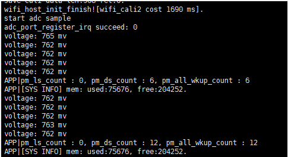

## BLINKY

-   **[编译](#ZH-CN_TOPIC_0000001928723076)**  

-   **[运行](#ZH-CN_TOPIC_0000001928882436)**  

### 编译

1.  在命令行下执行命令“python build.py ws53\_liteos\_app menuconfig”，打开menuconfig配置界面。
2.  在menuconfig界面中选择BLINKY Sample，如[图1](#fig44701426193117)所示；如果需要修改测试管脚，则继续按[图2 选择BLINKY pin](#fig1252148173414)选择，选择完成后按“Q”或者“q”选择“y”保存退出。
3.  使用IDE编译版本，编译出的版本包在“output\\ws53\\fwpkg\\pack\_all\_core\\ws53\_liteos\_app”路径下，如[图3](#fig116431126152115)所示。
4.  将编译出的版本烧录到单板。

**图 1**  选择BLINKY Sample  
> 历史资料缺图：选择BLINKY-Sample.png

**图 2**  选择BLINKY pin  
> 历史资料缺图：选择BLINKY-pin.png

**图 3**  编译后的fwpkg  
> 历史资料缺图：编译后的fwpkg-0.png

### 运行

BLINKY单板执行结果如下[图1](#fig116431126152115)所示。

**图 1**  BLINKY运行结果  
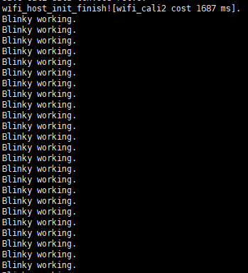

## DMA

-   **[编译](#ZH-CN_TOPIC_0000001956081765)**  

-   **[运行](#ZH-CN_TOPIC_0000001955961953)**  

### 编译

1.  在命令行下执行命令“python build.py ws53\_liteos\_app menuconfig”，打开menuconfig配置界面。
2.  在menuconfig界面中选择DMA Sample，如[图1](#fig17873050113118)所示；选择完成后按“Q”或者“q”选择“y”保存退出。
3.  使用IDE编译版本，编译出的版本包在“output\\ws53\\fwpkg\\pack\_all\_core\\ws53\_liteos\_app”路径下，如[图2](#fig116431126152115)所示。
4.  将编译出的版本烧录到单板。

**图 1**  选择DMA Sample  
> 历史资料缺图：选择DMA-Sample.png

**图 2**  编译后的fwpkg  
> 历史资料缺图：编译后的fwpkg-1.png

### 运行

DMA单板执行结果如下[图1](#fig116431126152115)所示。

**图 1**  DMA运行结果  
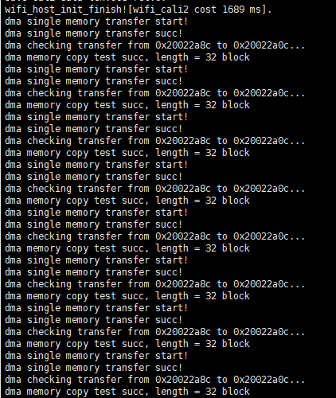

## I2C

-   **[编译](#ZH-CN_TOPIC_0000001928723080)**  

-   **[运行](#ZH-CN_TOPIC_0000001928882440)**  

### 编译

1.  在命令行下执行命令“python build.py ws53\_liteos\_app menuconfig”，打开menuconfig配置界面。
2.  在menuconfig界面中选择I2C Sample，如[图1](#fig4116421123218)所示；如果需要修改配置参数，则继续按[图2 I2C config配置](#fig11700103853218)选择，选择完成后按“Q”或者“q”选择“y”保存退出。
3.  使用IDE编译版本，编译出的版本包在“output\\ws53\\fwpkg\\pack\_all\_core\\ws53\_liteos\_app”路径下，如[图3](#fig1557912755819)所示。
4.  将编译出的版本烧录到单板。

**图 1**  选择I2C Sample  
> 历史资料缺图：选择I2C-Sample.png

**图 2**  I2C config配置  
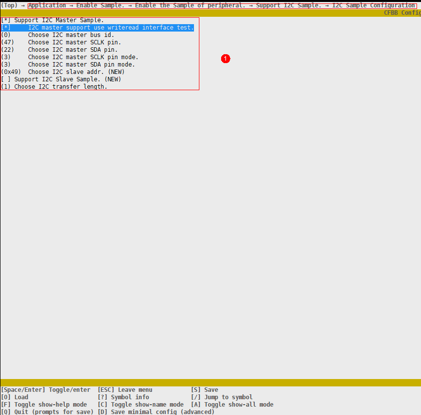

**图 3**  编译后的fwpkg  
> 历史资料缺图：编译后的fwpkg-2.png

### 运行

I2C单板执行结果：（1）打印结果如[图1](#fig1557912755819)所示；（2）输出波形如[图2](#fig84241451145616)所示

**图 1**  I2C打印结果  
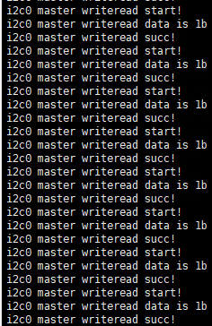

**图 2**  I2C输出波形  
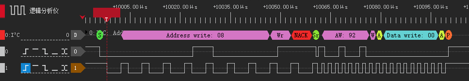

> 历史资料缺图：zh-cn_image_0000001935078354.png

## I2S

-   **[编译](#ZH-CN_TOPIC_0000001956081769)**  

-   **[运行](#ZH-CN_TOPIC_0000001955961957)**  

### 编译

1.  在命令行下执行命令“python build.py ws53\_liteos\_app menuconfig”，打开menuconfig配置界面。
2.  在menuconfig界面中选择I2S Sample，如[图1](#fig106431326122119)所示；如果需要修改配置参数，则继续按[图2 I2S  config配置](#fig56435266213)选择，选择完成后按“Q”或者“q”选择“y”保存退出。
3.  使用IDE编译版本，编译出的版本包在“output\\ws53\\fwpkg\\pack\_all\_core\\ws53\_liteos\_app”路径下，如[图3](#fig116431126152115)所示。
4.  将编译出的版本烧录到单板。

**图 1**  选择I2S Sample  
> 历史资料缺图：选择I2S-Sample.png

**图 2**  I2S  config配置  
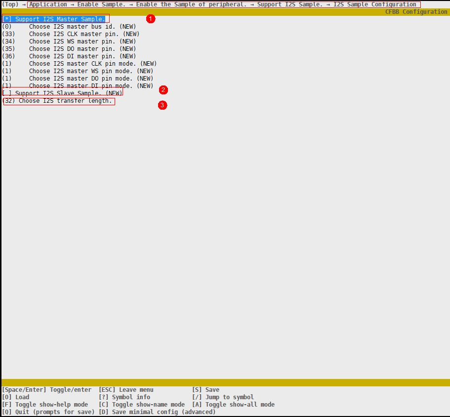

**图 3**  编译后的fwpkg  
> 历史资料缺图：编译后的fwpkg-3.png

### 运行

I2S单板执行结果如下[图1](#fig4715221173314)所示。

**图 1**  I2S运行结果  
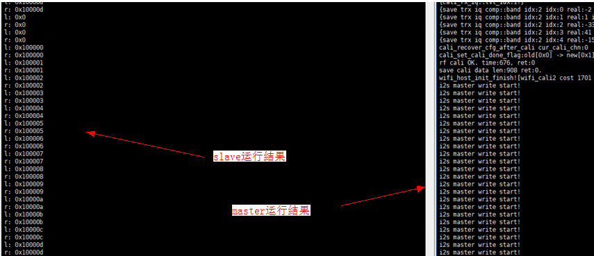

## PINCTRL

-   **[编译](#ZH-CN_TOPIC_0000001928723084)**  

-   **[运行](#ZH-CN_TOPIC_0000001928882444)**  

### 编译

1.  在命令行下执行命令“python build.py ws53\_liteos\_app menuconfig”，打开menuconfig配置界面。
2.  在menuconfig界面中选择PINCTRL Sample，如[图1](#fig106431326122119)所示；如果需要修改测试管脚，则继续按[图2 PINCTRL PIN配置](#fig56435266213)选择，选择完成后按“Q”或者“q”选择“y”保存退出。
3.  使用IDE编译版本，编译出的版本包在“output\\ws53\\fwpkg\\pack\_all\_core\\ws53\_liteos\_app”路径下，如[图3](#fig116431126152115)所示。
4.  将编译出的版本烧录到单板。

**图 1**  选择PINCTRL Sample  
> 历史资料缺图：选择PINCTRL-Sample.png

**图 2**  PINCTRL PIN  

**图 3**  编译后的fwpkg  
> 历史资料缺图：编译后的fwpkg-4.png

### 运行

PINCTRL单板执行结果如下[图1](#fig17590124125414)所示。

**图 1**  PINCTRL运行结果  
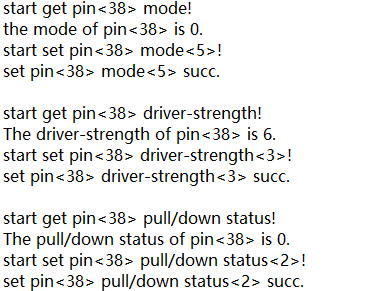

## PWM

-   **[编译](#ZH-CN_TOPIC_0000001956081773)**  

-   **[运行](#ZH-CN_TOPIC_0000001955961961)**  

### 编译

1.  在命令行下执行命令“python build.py ws53\_liteos\_app menuconfig”，打开menuconfig配置界面。
2.  在menuconfig界面中选择PWM Sample，如[图1](#fig106431326122119)所示；如果需要修改配置选项，则继续按[图2 PWM Config配置](#fig56435266213)选择，选择完成后按“Q”或者“q”选择“y”保存退出。
3.  使用IDE编译版本，编译出的版本包在“output\\ws53\\fwpkg\\pack\_all\_core\\ws53\_liteos\_app”路径下，如[图3](#fig116431126152115)所示。
4.  将编译出的版本烧录到单板。

**图 1**  选择PWM Sample  
> 历史资料缺图：选择PWM-Sample.png

**图 2**  PWM Config配置  
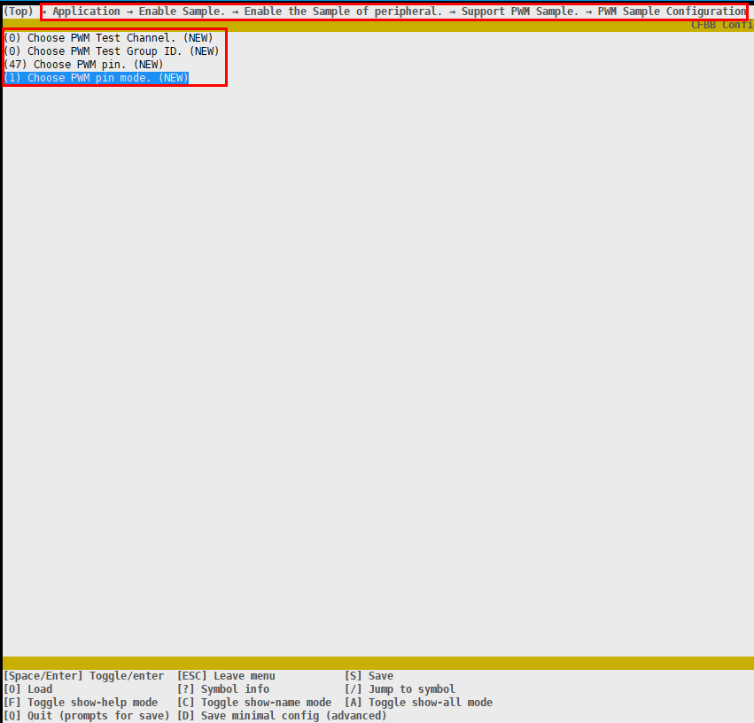

**图 3**  编译后的fwpkg  
> 历史资料缺图：编译后的fwpkg-5.png

### 运行

PWM单板执行结果如[图1](#fig163791153153310)所示。

**图 1**  PWM运行结果  
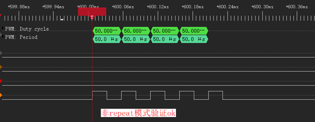

## RTC

-   **[编译](#ZH-CN_TOPIC_0000001928723088)**  

-   **[运行](#ZH-CN_TOPIC_0000001928882448)**  

### 编译

1.  在命令行下执行命令“python build.py ws53\_liteos\_app menuconfig”，打开menuconfig配置界面。
2.  在menuconfig界面中选择RTC Sample，如[图1](#fig98485273417)所示，如果需要修改配置选项，则继续按[图2](#fig768205003013)选择，选择完成后按“Q”或者“q”选择“y”保存退出。
3.  使用IDE编译版本，编译出的版本包在“output\\ws53\\fwpkg\\pack\_all\_core\\ws53\_liteos\_app”路径下，如[图3](#fig116431126152115)所示。
4.  将编译出的版本烧录到单板。

**图 1**  选择RTC Sample  
> 历史资料缺图：选择RTC-Sample.png

**图 2**  RTC config配置  
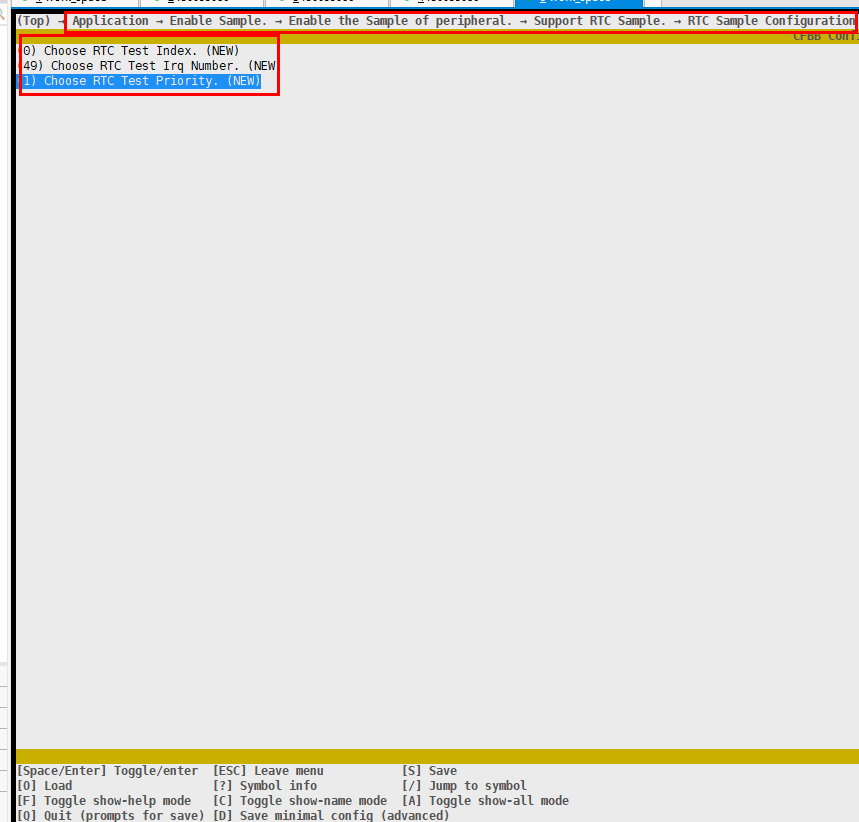

**图 3**  编译后的fwpkg  
> 历史资料缺图：编译后的fwpkg-6.png

### 运行

RTC单板执行结果如下[图1](#fig154761515163419)所示。

**图 1**  RTC运行结果  
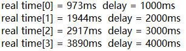

## SFC

-   **[编译](#ZH-CN_TOPIC_0000001956081777)**  

-   **[运行](#ZH-CN_TOPIC_0000001955961965)**  

### 编译

1.  在命令行下执行命令“python build.py ws53\_liteos\_app menuconfig”，打开menuconfig配置界面。
2.  在 menuconfig 界面中选择 SFC Sample，如[图1](#fig106431326122119)所示；如果需要修改配置选项，则继续按[图2 SFC Config配置](#fig56435266213)选择，建议修改地址为预留区，若地址在镜像区或其他区域可能导致程序挂死，需要重新烧录，预留区地址可参考 [WS53 FOTA 开发指南](../../guides/system/fota/index.md)的注意事项；选择完成后按“Q”或者“q”选择“y”保存退出。
3.  使用IDE编译版本，编译出的版本包在“output\\ws53\\fwpkg\\pack\_all\_core\\ws53\_liteos\_app”路径下，如[图3](#fig116431126152115)所示。
4.  将编译出的版本烧录到单板。

**图 1**  选择SFC Sample  
> 历史资料缺图：选择SFC-Sample.png

**图 2**  SFC Config配置  
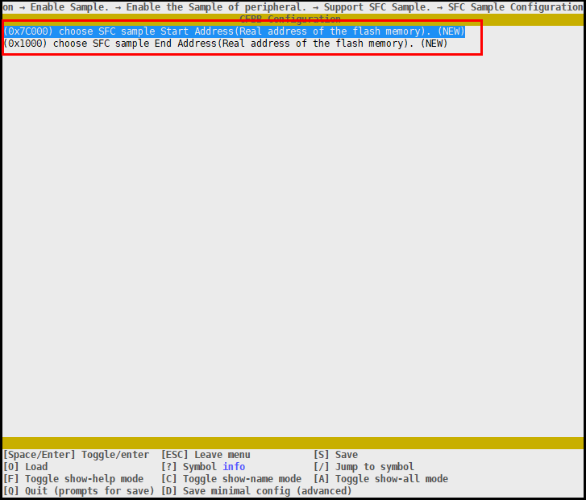

**图 3**  编译后的fwpkg  
> 历史资料缺图：编译后的fwpkg-7.png

### 运行

SFC单板执行结果如下[图1](#fig8542242203417)所示。

**图 1**  SFC运行结果  
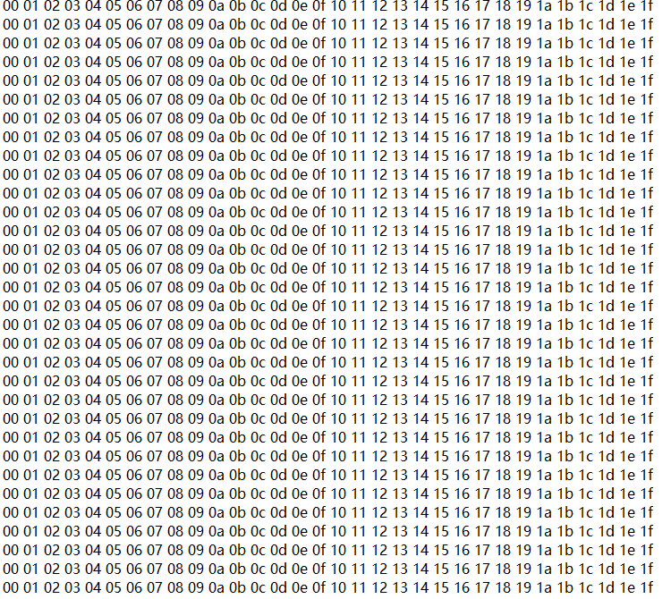

## SPI

SPI组件默认未参与编译，使用该外设驱动需要先配置开启：

在命令行下执行命令“python build.py ws53\_liteos\_app menuconfig”，打开menuconfig配置界面，配置如下：

> 历史资料缺图：zh-cn_image_0000002166603601.png

-   **[编译](#ZH-CN_TOPIC_0000001928723092)**  

-   **[运行](#ZH-CN_TOPIC_0000001928882452)**  

### 编译

1.  在命令行下执行命令“python build.py ws53\_liteos\_app menuconfig”，打开menuconfig配置界面。
2.  在menuconfig界面中选择SPI Sample，如[图1](#fig41985714610)所示，进入SPI Sample Configuration后编辑配置选项如[图2](#fig673338987)，配置bus\_id为0，其它配置根据pin脚和配置选择，选择完成后按“Q”或者“q”选择“y”保存退出。
3.  使用IDE编译版本，编译出的版本包在“output\\ws53\\fwpkg\\pack\_all\_core\\ws53\_liteos\_app”路径下，如[图3](#fig8112101216127)所示。
4.  将编译出的版本烧录到单板。

**图 1**  选择SPI  
> 历史资料缺图：选择SPI.png

**图 2**  SPI Config  
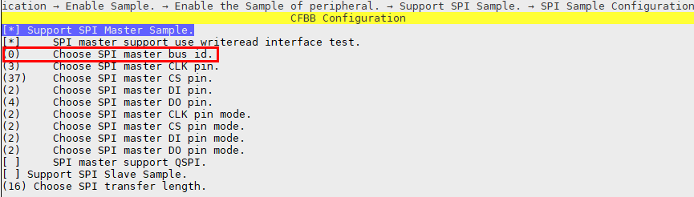

**图 3**  编译后的fwpkg  
> 历史资料缺图：编译后的fwpkg-8.png

### 运行

如下图为SPI做master tx数据波形图

**图 1**  SPI 发送数据  
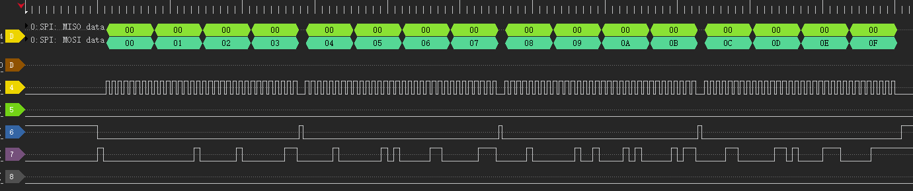

## QSPI

QSPI与SPI共用一套组件，该组件默认不参与编译，使用该外设驱动需要先配置开启：

在命令行下执行命令“python build.py ws53\_liteos\_app menuconfig”，打开menuconfig配置界面，配置如下：

> 历史资料缺图：zh-cn_image_0000002000722404.png

-   **[编译](#ZH-CN_TOPIC_0000001956081781)**  

-   **[运行](#ZH-CN_TOPIC_0000001955961969)**  

### 编译

1.  在命令行下执行命令“python build.py ws53\_liteos\_app menuconfig”，打开menuconfig配置界面。
2.  在menuconfig界面中选择SPI Sample，如[图1](#fig13259125810412)所示，进入SPI Sample Configuration后编辑配置选项如[图2](#fig4377115310531)，配置bus\_id为1和SPI master support QSPI，其它配置根据pin脚和配置选择，选择完成后按“Q”或者“q”选择“y”保存退出。
3.  使用IDE编译版本，编译出的版本包在“output\\ws53\\fwpkg\\pack\_all\_core\\ws53\_liteos\_app”路径下，如[图3](#fig0523114712448)所示。
4.  将编译出的版本烧录到单板。

**图 1**  选择SPI Sample  
> 历史资料缺图：选择SPI-Sample.png

**图 2**  编辑QSPI Config  
> 历史资料缺图：编辑QSPI-Config.png

**图 3**  编译后的fwpkg  
> 历史资料缺图：编译后的fwpkg-9.png

### 运行

如图为QSPI写psram器件波形，配置为单线模式发送8位cmd=0x38命令，四线模式模式发送24位addr=0x123，四线模式模式发送数据0x0 0x1 0x2 0x3

**图 1**  qspi 4线模式写psram  
> 历史资料缺图：qspi-4线模式写psram.png

## SYSTICK

-   **[编译](#ZH-CN_TOPIC_0000001928723096)**  

-   **[运行](#ZH-CN_TOPIC_0000001928882460)**  

### 编译

1.  在命令行下执行命令“python build.py ws53\_liteos\_app menuconfig”，打开menuconfig配置界面。
2.  在menuconfig界面中选择SYSTICK Sample，如[图1](#fig106431326122119)所示，选择完成后按“Q”或者“q”选择“y”保存退出。
3.  使用IDE编译版本，编译出的版本包在“output\\ws53\\fwpkg\\pack\_all\_core\\ws53\_liteos\_app”路径下，如[图2](#fig116431126152115)所示。
4.  将编译出的版本烧录到单板。

**图 1**  选择SYSTICK Sample  
> 历史资料缺图：选择SYSTICK-Sample.png

**图 2**  编译后的fwpkg  
> 历史资料缺图：编译后的fwpkg-10.png

### 运行

SYSTICK单板执行结果如下[图1](#fig993812131095)所示。

**图 1**  SYSTICK运行结果  
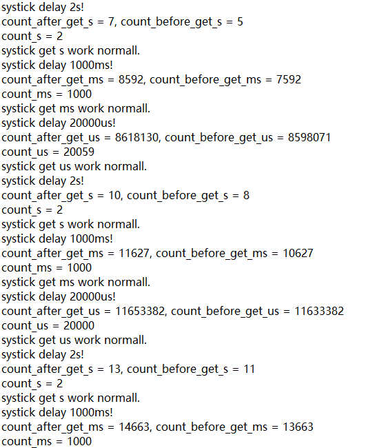

## TCXO

-   **[编译](#ZH-CN_TOPIC_0000001928723104)**  

-   **[运行](#ZH-CN_TOPIC_0000001928882464)**  

### 编译

1.  在命令行下执行命令“python build.py ws53\_liteos\_app menuconfig”，打开menuconfig配置界面。
2.  在menuconfig界面中选择TCXO Sample，如[图1](#fig106431326122119)所示，选择完成后按“Q”或者“q”选择“y”保存退出。
3.  使用IDE编译版本，编译出的版本包在“output\\ws53\\fwpkg\\pack\_all\_core\\ws53\_liteos\_app”路径下，如[图2](#fig116431126152115)所示。
4.  将编译出的版本烧录到单板。

**图 1**  选择TCXO Sample  
> 历史资料缺图：选择TCXO-Sample.png

**图 2**  编译后的fwpkg  
> 历史资料缺图：编译后的fwpkg-11.png

### 运行

TCXO单板执行结果如下[图1](#fig993812131095)所示。

**图 1**  TCXO运行结果  
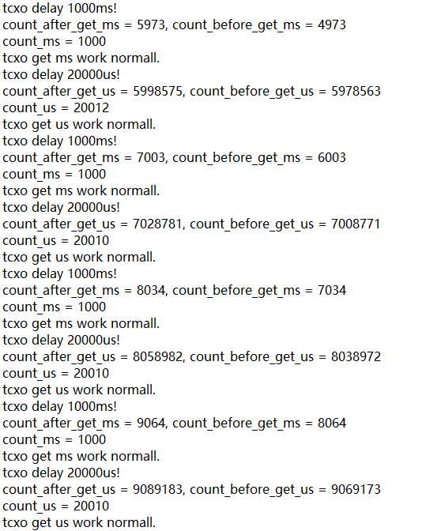

## TIMER

-   **[编译](#ZH-CN_TOPIC_0000001956081789)**  

-   **[运行](#ZH-CN_TOPIC_0000001955961977)**  

### 编译

1.  在命令行下执行命令“python build.py ws53\_liteos\_app menuconfig”，打开menuconfig配置界面。
2.  在menuconfig界面中选择TIMER Sample，如[图1](#fig106431326122119)所示，选择完成后按“Q”或者“q”选择“y”保存退出。
3.  使用IDE编译版本，编译出的版本包在“output\\ws53\\fwpkg\\pack\_all\_core\\ws53\_liteos\_app”路径下，如下[图2](#fig116431126152115)所示。
4.  将编译出的版本烧录到单板。

**图 1**  选择TIMER Sample  
> 历史资料缺图：选择TIMER-Sample.png

**图 2**  编译后的fwpkg  
> 历史资料缺图：编译后的fwpkg-12.png

### 运行

TIMER单板执行结果如下[图1](#fig993812131095)所示。

**图 1**  TIMER运行结果  
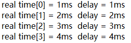

## WATCHDOG

-   **[编译](#ZH-CN_TOPIC_0000001956081793)**  

-   **[运行](#ZH-CN_TOPIC_0000001955961981)**  

### 编译

1.  在命令行下执行命令“python build.py ws53\_liteos\_app menuconfig”，打开menuconfig配置界面。
2.  在menuconfig界面中选择WATCHDOG Sample，如[图1](#fig106431326122119)所示；如果选择超时，则继续按下[图2](#fig116431126152115)所示选择；如果选择喂狗，则继续按下[图3](#fig2787175743)所示选择，选择完成后按“Q”或者“q”选择“y”保存退出。
3.  使用IDE编译版本，编译出的版本包在“output\\ws53\\fwpkg\\pack\_all\_core\\ws53\_liteos\_app”路径下，如[图4](#fig1889013402418)所示。
4.  将编译出的版本烧录到单板。

**图 1**  选择WATCHDOG Sample  
> 历史资料缺图：选择WATCHDOG-Sample.png

**图 2**  WATCHDOG超时  

**图 3**  WATCHDOG 喂狗  

**图 4**  编译后的fwpkg  
> 历史资料缺图：编译后的fwpkg-13.png

### 运行

WATCHDOG单板超时执行结果如下[图1](#fig993812131095)所示，喂狗后执行结果如[图2](#fig586414171377)所示。

**图 1**  WATCHDOG超时运行结果  
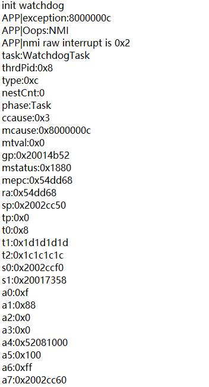

**图 2**  WATCHDOG喂狗运行结果  

## UART

-   **[编译](#ZH-CN_TOPIC_0000002119926653)**  

-   **[运行](#ZH-CN_TOPIC_0000002119846649)**  

### 编译

1.  在命令行下执行命令“python build.py ws53\_liteos\_app menuconfig”，打开menuconfig配置界面。
2.  在menuconfig界面中选择UART Sample，如[图1](#fig106431326122119)所示；进入UART Sample Configuration后编辑配置选项如[图2](#fig116431126152115)所示选择，选择完成后按“Q”或者“q”选择“y”保存退出。
3.  使用IDE编译版本，编译出的版本包在“output\\ws53\\fwpkg\\pack\_all\_core\\ws53\_liteos\_app”路径下，如[图3](#fig1889013402418)所示。
4.  将编译出的版本烧录到单板。

**图 1**  选择UART Sample  
> 历史资料缺图：选择UART-Sample.png

**图 2**  选择中断模式  
> 历史资料缺图：选择中断模式.png

**图 3**  编译后的fwpkg  
> 历史资料缺图：编译后的fwpkg-14.png

### 运行

UART单板执行结果如[图1](#fig993812131095)所示。

**图 1**  UART运行结果  
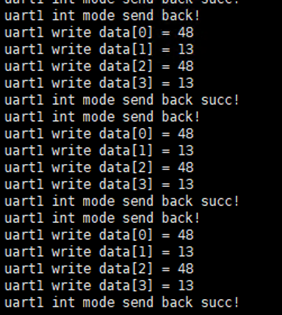

## SLE CHBA

本示例描述了 WS53 对通 WS53、星闪接入 IP 打流的操作方法。

> 历史资料缺图：zh-cn_image_0000002331509593.png

-   **[编译](#ZH-CN_TOPIC_0000002280773173)**  

-   **[运行](#ZH-CN_TOPIC_0000002280893105)**  

### 编译

1.  在命令行下执行命令“python build.py ws53\_liteos\_app menuconfig”，打开menuconfig配置界面。
2.  在menuconfig界面中选择CHBA Sample，如[图1](#fig1739611132615)所示
3.  使用IDE编译版本，编译出的版本包在“output\\ws53\\fwpkg\\pack\_all\_core\\ws53\_liteos\_app”路径下，如[图2](#fig04501428621)所示。
4.  将编译出的版本烧录到单板。

**图 1**  选择chba sample  
> 历史资料缺图：选择chba-sample.png

**图 2**  编译后的fwpkg  
> 历史资料缺图：编译后的fwpkg-15.png

### 运行

1.  配置角色，WS53 AP侧下发 AT+NVWRITE=0x2160,0,2,0000，WS53 STA侧下发 AT+NVWRITE=0x2160,0,2,0001，如[图1](#fig13535175542815)和[图2](#fig42491142913)所示，烧写后只需要配置一次，复位后生效。
2.  复位两侧单板，星闪链路自动连接，如[图3](#fig86041630123011)所示。
3.  WS53 AP侧关闭扫描，命令 AT+SLESTOPSCAN，如[图4](#fig134409333311)所示，常开扫描是为了接入更多chba设备，但扫描业务会影响打流的速率，建议打流时将扫描关闭。
4.  连接参数更新，任意一侧发起更新都可，命令示例（示例为更新到20slot，修改第二和第三个参数，配置范围16\~8000）  AT+SLECONNPARUPD=0,20,20,0,500，如[图5](#fig10609171633920)所示
5.  配置IP，两侧要配置在同一网段下，命令示例 AT+IFCFG=sle,192.168.5.2,netmask,255.255.255.0,gateway,192.168.5.1，如[图6](#fig1817281063517)和[图7](#fig411172243516)所示。
6.  iperf打流，WS53 AP侧下发 AT+IPERF=-s,-i,1,-p,5001,-t,30，WS53 STA侧下发AT+IPERF=-c,192.168.5.1,-i,1,-t,30,-p,5001，如[图8](#fig54344214412)和[图9](#fig1641593374118)所示.

**图 1**  AP侧角色配置  

**图 2**  STA侧角色配置  

**图 3**  星闪建链  
> 历史资料缺图：星闪建链.png

**图 4**  关闭扫描  
> 历史资料缺图：关闭扫描.png

**图 5**  连接参数更新  
> 历史资料缺图：连接参数更新.png

**图 6**  AP侧 ip配置  
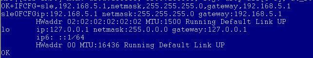

**图 7**  STA侧 ip配置  
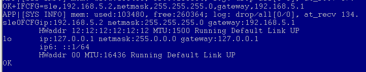

**图 8**  AP侧 iperf打流  
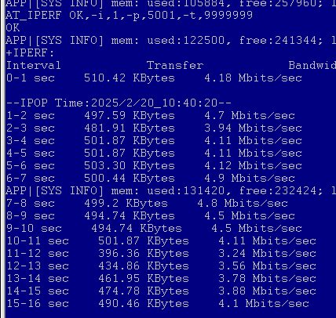

**图 9**  STA侧 iperf打流  
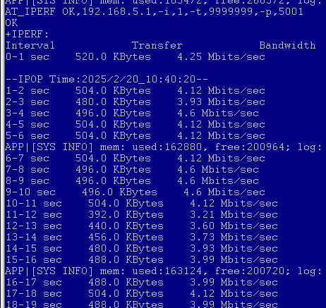

## SLE CHBA&SYSCHANNEL

本示例描述了主控+WS53对通WS53，星闪接入ip打流的操作方法。

> 历史资料缺图：zh-cn_image_0000002297466582.png

-   **[编译](#ZH-CN_TOPIC_0000002246479944)**  

-   **[运行](#ZH-CN_TOPIC_0000002281399037)**  

### 编译

1.  在命令行下执行命令“python build.py ws53\_liteos\_app menuconfig”，打开menuconfig配置界面。
2.  在menuconfig界面中选择CHBA Sample，如[图1](#fig1739611132615)所示
3.  使用IDE编译版本，编译出的版本包在“output\\ws53\\fwpkg\\pack\_all\_core\\ws53\_liteos\_app”路径下，如[图2](#fig04501428621)所示。
4.  将编译出的版本烧录到单板。

**图 1**  选择chba sample  
> 历史资料缺图：选择chba-sample-16.png

**图 2**  编译后的fwpkg  
> 历史资料缺图：编译后的fwpkg-17.png

### 运行

1.  WS53侧配置角色，AP侧下 AT+NVWRITE=0x2160,0,2,0000，STA侧下发 AT+NVWRITE=0x2160,0,2,0001，如[图1](#fig13535175542815)和[图2](#fig42491142913)所示，烧写后只需要配置一次，复位后生效。
2.  复位两侧WS53单板，星闪链路自动连接，如[图3](#fig86041630123011)所示。
3.  WS53 AP侧关闭扫描，命令AT+SLESTOPSCAN，如[图4](#fig134409333311)所示，常开扫描是为了接入更多chba设备，但扫描业务会影响打流的速率，建议打流时将扫描关闭。
4.  星闪连接参数更新，任意一侧发起更新都可，命令示例（示例为更新到20slot，修改第二和第三个参数，配置范围16\~8000）  AT+SLECONNPARUPD=0,20,20,0,500，如[图5](#fig10609171633920)所示
5.  WS53两侧配置IP，要配置在同一网段下。

    WS53 STA侧：

    AT+IFCFG=sle,192.168.5.2,netmask,255.255.255.0,gateway,192.168.5.1

    WS53 AP侧：

    AT+IFCFG=sle,192.168.5.1,netmask,255.255.255.0,gateway,192.168.5.1

6.  WS53 STA侧启动syschannel，并绑定SLE。

    AT+SYSCHANNEL

    AT+SYSCHANIF=sle0

7.  主控侧加载syschannel\_host.ko  并绑定WS53侧网卡，mac地址与IP地址要与WS53侧一致。

    insmod syschannel\_host.ko

    ifconfig wlan0 hw ether 22:22:22:22:22:22

    ifconfig wlan0 192.168.5.2 up

8.  打流测试。

    WS53 AP侧：

    AT+IPERF=-s,-i,1,-p,5001,-t,30

    主控侧：

    iperf -c 192.168.5.1 -i1 -p 5001

**图 1**  ap侧角色配置  

**图 2**  sta侧角色配置  

**图 3**  星闪建链  
> 历史资料缺图：星闪建链-18.png

**图 4**  关闭扫描  
> 历史资料缺图：关闭扫描-19.png

**图 5**  连接参数更新  
> 历史资料缺图：连接参数更新-20.png

