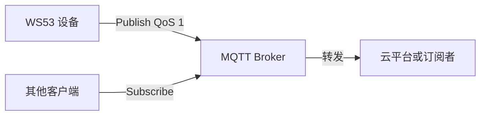
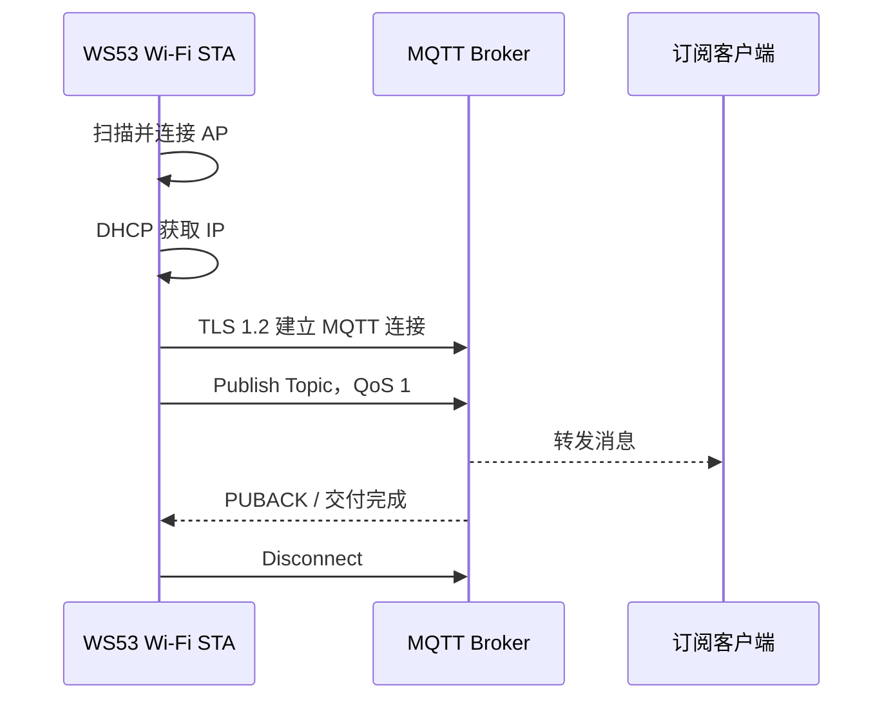

# MQTT

> Paho MQTT C Client、lwIP Socket、TLS 1.2

> 前置阅读：[TCP](../tcp/tcp.md)、[Wi-Fi STA 连接](../../connectivity/wifi/sta/sta-connect.md)

WS53 的 MQTT 案例依赖 Wi-Fi STA。设备扫描并连接固定 AP，完成 DHCP 后调用 mqtt_publish_client()，通过 TLS 1.2 连接 MQTT Broker，发布一条 QoS 1 消息，等待交付完成后断开并释放客户端资源。

当前源码是“单次发布”案例，不包含订阅、遗嘱消息、周期上报或自动重连。WS63 文档中的这些扩展能力不能直接视为 WS53 已实现功能。

## 学习目标

- 理解 MQTT 发布/订阅模型和 Broker 的转发角色。
- 掌握 WS53 从 STA 入网、TLS 配置、连接 Broker 到 QoS 1 发布的调用链。
- 正确配置客户端证书、私钥、根 CA、URI、Topic、账号和消息。
- 根据串口日志定位 Wi-Fi、TLS、MQTT 连接和消息交付问题。

## 基本概念

### MQTT 发布模型



设备不直接与手机或云平台建立应用连接，而是向 Broker 发布 Topic；Broker 再将消息转发给订阅该 Topic 的客户端。

### WS53 实际流程



### QoS 等级

| QoS | 含义 | 本案例 |
| --- | --- | --- |
| 0 | 最多一次，可能丢包 | 未使用 |
| 1 | 至少一次，可能重复 | 使用，等待 Delivery Token |
| 2 | 恰好一次，开销最大 | 未使用 |

QoS 1 只保证消息至少到达一次，Broker 或网络重试时可能产生重复消息。业务侧需要使用消息 ID 或幂等逻辑去重。

### TLS 与 MQTT URI

源码通过 MQTTClient_SSLOptions 配置 TLS 1.2，并将客户端证书、客户端私钥和根 CA 以内存字符串形式传入 Paho 客户端。URI 示例为：

```text
ssl://192.168.80.50:8883
```

URI 中的协议必须与 TLS 配置匹配。Broker 的地址、端口、证书身份和信任链必须相互匹配；证书不应只因为“能连接”就关闭校验。

## 涉及 API

| API | 用途 |
| --- | --- |
| wifi_register_event_cb() | 注册 STA 扫描和连接事件 |
| wifi_sta_enable() | 启用 Wi-Fi STA |
| wifi_sta_scan() | 扫描 AP |
| wifi_sta_get_scan_info() | 获取扫描结果 |
| wifi_sta_connect() | 连接目标 AP |
| netifapi_netif_find() | 查找 wlan0 |
| netifapi_dhcp_start() | 启动 DHCP |
| MQTTClient_init() | 初始化 MQTT 客户端资源 |
| MQTTClient_create() | 创建客户端并设置 Broker URI、Client ID |
| MQTTClient_connect() | 建立 TLS MQTT 连接 |
| MQTTClient_publishMessage() | 发布一条 MQTT 消息 |
| MQTTClient_waitForCompletion() | 等待 QoS 交付完成 |
| MQTTClient_disconnect() | 断开 Broker 连接 |
| MQTTClient_destroy() | 销毁客户端 |
| MQTTClient_cleanup() | 清理 MQTT 全局资源 |

WS53 当前源码没有调用 MQTTClient_subscribe()、MQTTClient_setCallbacks()，也没有实现 connectionLost 回调。

## 案例说明

### 案例简介

STA DHCP 成功后，STA Sample 调用 mqtt_publish_client()。MQTT Client 初始化完成后，创建 Client ID 为 ExampleClientPub 的客户端，配置 TLS 1.2、Keep Alive 20 秒、Clean Session 和用户名密码，连接 g_mqtt_uri，向 g_mqtt_topic 发布 g_mqtt_publish_msg，QoS 为 1，等待最多 10 秒交付完成，然后断开并清理资源。

### 默认应用参数

| 参数 | 源码默认值 | 说明 |
| --- | --- | --- |
| Client ID | ExampleClientPub | MQTT 客户端标识 |
| MQTT URI | 空字符串 | 必须修改，注释示例为 ssl://192.168.80.50:8883 |
| Topic | 'topic' | 源码包含单引号字符，建议按 Broker 约定修改 |
| 用户名 | admin | 必须与 Broker 账号匹配 |
| 密码 | admin | 必须替换为测试或生产凭证 |
| 发布消息 | 'hello,world!' | 源码包含单引号字符 |
| QoS | 1 | 至少一次 |
| Retained | 0 | 不保留消息 |
| Keep Alive | 20 秒 | PING 心跳间隔 |
| Clean Session | 1 | 使用清理会话 |
| TLS 版本 | TLS 1.2 | MQTT SSL 配置 |
| 交付等待 | 10000 ms | 最多等待 10 秒 |

## 关键配置

MQTT 选项依赖 STA Sample，配置应包含：

```text
CONFIG_ENABLE_WIFI_SAMPLE=y
CONFIG_SAMPLE_SUPPORT_STA_SAMPLE=y
CONFIG_SAMPLE_SUPPORT_MQTT=y
```

SAMPLE_SUPPORT_MQTT 位于 sta_sample/Kconfig，并声明 depends on SAMPLE_SUPPORT_STA_SAMPLE。未启用 STA 时，MQTT 子项不能作为独立案例使用。

## 案例操作指导

### 第一步：准备 Broker

准备支持 TLS 1.2 和 MQTT QoS 1 的 Broker，确认：

- Broker 地址和端口可从 WS53 所在局域网访问。
- 服务端证书的域名或 IP 与连接配置匹配。
- 已创建对应用户名、密码和发布 Topic。
- 已使用订阅客户端订阅相同 Topic，便于验证消息。

### 第二步：填写证书和 MQTT 参数

编辑 `src/application/samples/wifi/mqtt_sample/mqtt_sample.c`，整体替换以下内容：

```c
g_mqtt_client_crt   // 客户端证书 PEM
g_mqtt_client_key   // 客户端私钥 PEM
g_mqtt_ca_crt       // 根 CA PEM
g_mqtt_uri          // 例如 ssl://192.168.80.50:8883
g_mqtt_topic        // 发布 Topic
g_mqtt_username     // Broker 用户名
g_mqtt_password     // Broker 密码
g_mqtt_publish_msg  // 发布内容
```

证书字符串必须保留 PEM 头尾和换行格式，每个物理行都必须符合 C 字符串语法；不能只替换星号占位正文而保留当前错误的断行。不要把真实私钥、生产证书或账号密码提交到公共仓库。

### 第三步：编译和烧录

只有在第二步完成、并确认 `mqtt_sample.c` 中不存在未续行的 PEM 文本后，才执行构建：

```bash
fbb build ws53-liteos-app
fbb flash ws53-liteos-app
```

构建和烧录方法请参考[快速入门](../../../get-started/quick-start.md)。

### 第四步：验证 Wi-Fi 前置条件

确认串口依次出现 STA 扫描、连接成功、DHCP start 和 STA DHCP success。只有 DHCP 成功后才会进入 MQTT Client。

典型日志包括：

```text
[WIFI_STA_SAMPLE]::STA DHCP success.
[MQTT_SAMPLE]::Client Start...
```

如果目标 SSID 不存在，STA 会重新扫描；如果 DHCP 超时，STA 会回到初始化流程，MQTT 不会启动。

### 第五步：验证 TLS MQTT

确认串口没有 Client init、Client create 或 Client connect failed。连接和发布成功后应看到：

```text
[MQTT_SAMPLE]::Client will wait at most 10 seconds for publication ...
[MQTT_SAMPLE]::Client published ok,message with delivery token ... delivered!
[MQTT_SAMPLE]::Client Stop!
```

在订阅客户端确认收到目标 Topic 的消息，并核对消息内容。由于本案例只发布一次，不能用它验证周期上报或订阅下行指令。

## 代码详解

### 1. 文件结构

```text
src/application/samples/wifi/
├── sta_sample/
│   ├── sta_sample.c       # Wi-Fi 扫描、连接、DHCP 和 MQTT 入口
│   ├── Kconfig            # MQTT 依赖 STA 的配置
│   └── CMakeLists.txt
└── mqtt_sample/
    ├── mqtt_sample.c      # TLS 配置、连接、发布和清理
    ├── mqtt_sample.h
    └── CMakeLists.txt
```

### 2. DHCP 成功后触发 MQTT

STA Sample 的 DHCP 状态检查在获得 IP 后调用 mqtt_publish_client()：

```c
if (ip_addr_isany(&(netif_p->ip_addr)) == 0) {
    PRINT("STA DHCP success.");
#ifdef CONFIG_SAMPLE_SUPPORT_MQTT
    mqtt_publish_client();
#endif
    return 0;
}
```

MQTT 不是独立常驻任务；发布函数返回后，STA 流程继续结束。

### 3. TLS 连接配置

```c
ssl_opts.los_keyStore = &g_mqtt_client_crt_store;
ssl_opts.los_trustStore = &g_mqtt_ca_crt_store;
ssl_opts.los_privateKey = &g_mqtt_client_key_store;
ssl_opts.sslVersion = MQTT_SSL_VERSION_TLS_1_2;
conn_opts.keepAliveInterval = MQTT_KEEPALIVEINTERVAL;
conn_opts.cleansession = MQTT_CLEANSESSION;
conn_opts.ssl = &ssl_opts;
conn_opts.username = g_mqtt_username;
conn_opts.password = g_mqtt_password;
```

客户端证书、私钥和根 CA 存放在 cert_string、key_string 中，长度由 sizeof 字符串计算。

### 4. 发布和等待交付

```c
pubmsg.payload = (void *)g_mqtt_publish_msg;
pubmsg.payloadlen = (int)strlen(g_mqtt_publish_msg);
pubmsg.qos = MQTT_QOS;
pubmsg.retained = 0;

MQTTClient_publishMessage(client, g_mqtt_topic, &pubmsg, &token);
MQTTClient_waitForCompletion(client, token, MQTT_TCP_TIMEOUT_MS);
```

发布成功后打印 Delivery Token；无论连接、发布或等待结果如何，函数都会进入断开、销毁和全局清理路径。

### 5. 资源清理和错误路径

初始化失败时调用 MQTTClient_cleanup()；连接失败时跳过发布，销毁客户端；发布失败或等待超时后断开并销毁。源码没有重连循环，下一次连接需要由上层重新触发 STA/MQTT 流程。
