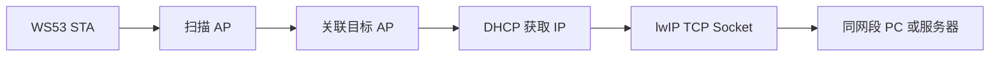

# TCP

> lwIP Socket API

> 前置阅读：[Wi-Fi STA 连接](../../connectivity/wifi/sta/sta-connect.md)

WS53 的 TCP 示例先通过 Wi-Fi STA 扫描并连接指定 AP，完成 DHCP 后，再启动 TCP Client 或 TCP Server。

## 学习目标

- 理解 Wi-Fi STA、DHCP 和 TCP Socket 的衔接关系。
- 掌握 TCP Client 的 socket → bind → connect → send 流程。
- 掌握 TCP Server 的 socket → bind → listen → accept → recv 流程。
- 根据串口日志定位 Wi-Fi、DHCP、Socket 和对端服务问题。

## 基本概念

### WS53 网络数据路径



WS53 使用 lwIP 提供的 BSD Socket 风格接口。TCP 建立可靠、有序的字节流连接，但不保留应用消息边界；一次 send 对应的内容可能被对端一次或多次 recv 取出。

| 对比项 | TCP Client | TCP Server |
| --- | --- | --- |
| 主动方 | WS53 主动连接 PC/服务器 | PC/服务器主动连接 WS53 |
| 关键调用 | connect | bind、listen、accept |
| 地址配置 | 需要目标 IP 和端口 | 监听本地端口，地址为 0.0.0.0 |
| 示例行为 | 建立连接后周期发送 | 接收对端数据并打印 |

## Wi-Fi 前置流程

TCP 任务不会直接启动 Socket。wifi_sta_sample_init() 先注册事件回调，等待 Wi-Fi 初始化，随后执行：

1. wifi_sta_enable() 创建 STA 接口。
2. wifi_sta_scan() 扫描附近 AP。
3. 精确匹配 SSID tcp_test。
4. 使用扫描结果中的 BSSID 和安全类型调用 wifi_sta_connect()。
5. 在 wlan0 上调用 netifapi_dhcp_start()。
6. 获取非零 IP 后调用 CmdTcpSample() 创建 TCP 任务。

| 参数 | 默认值 |
| --- | --- |
| SSID | tcp_test |
| 密码 | 1a2b3c4d |
| Client 目标 IP | 192.168.50.100 |
| TCP 端口 | 5001 |
| TCP 数据缓冲 | 100 字节 |
| DHCP 检查 | 最多 300 次循环 |

实际使用前应修改源码中的演示 SSID、密码和目标地址。

## 涉及 API

| API | 用途 |
| --- | --- |
| wifi_register_event_cb() | 注册扫描和连接事件 |
| wifi_sta_enable() | 启用 Wi-Fi STA |
| wifi_sta_scan() | 扫描 AP |
| wifi_sta_get_scan_info() | 获取扫描结果 |
| wifi_sta_connect() | 连接目标 AP |
| netifapi_netif_find() | 查找 wlan0 接口 |
| netifapi_dhcp_start() | 启动 DHCP |
| socket(AF_INET, SOCK_STREAM, 0) | 创建 TCP Socket |
| setsockopt() | 设置地址复用和收发超时 |
| bind() | 绑定本地地址和端口 |
| listen() / accept() | Server 监听并接受连接 |
| connect() | Client 连接对端 |
| send() / recv() | TCP 数据收发 |
| closesocket() | 关闭 Socket |

## 案例说明

### TCP Client

WS53 连接 192.168.50.100:5001 后，周期创建发送任务，发送 100 字节由字符 0～9 循环填充的测试数据，并打印发送成功或失败日志。Client 不等待对端回复。

### TCP Server

WS53 在本地端口 5001 监听，等待 PC 或其他 TCP Client 连接。连接建立后，Server 循环接收最多 100 字节数据，累计接收字节数并打印内容；对端关闭后退出接收循环。

| 参数 | Client | Server |
| --- | --- | --- |
| 业务任务优先级 | 20 | 5 |
| 业务任务栈 | 0x2000 | 0x2000 |
| 发送任务优先级 | 2 | 不使用 |
| TCP 缓冲长度 | 100 字节 | 100 字节 |
| 发送间隔 | 约 30 秒 | 由对端决定 |
| 发送超时 | 10 秒 | 不使用 |

源码将 Server 接收超时宏 60 转换为 tv_sec=0、tv_usec=60000，实际约为 60 ms，不应理解为 60 秒。

## 关键配置

Client：

```text
CONFIG_ENABLE_WIFI_SAMPLE=y
CONFIG_SUPPORT_TCP_CLIENT_SAMPLE=y
```

Server：

```text
CONFIG_ENABLE_WIFI_SAMPLE=y
CONFIG_SUPPORT_TCP_SERVER_SAMPLE=y
```

两个 TCP 角色位于同一个 Kconfig choice 中，不能同时选择。

| 宏 | 值 | 作用 |
| --- | --- | --- |
| TCP_SAMPLE_DEFAULT_PORT | 5001 | Client 目标端口和 Server 监听端口 |
| TCP_SAMPLE_DEFAULT_TCP_SAMPLE_BUFLEN | 100 | TCP 缓冲长度 |
| TCP_SAMPLE_DEFAULT_RX_TIMEOUT | 60 | Server 接收超时配置值，实际单位需注意 |
| TCP_SAMPLE_DEFAULT_TX_TIMEOUT | 10 秒 | Client 发送超时 |
| WIFI_TCP_SAMPLE_DST_IP | 192.168.50.100 | Client 默认目标 IP |
| WIFI_SSID | tcp_test | 演示 SSID |
| WIFI_TEST | 1a2b3c4d | 演示密码 |

## 案例操作指导

### 第一步：准备对端

- Client 模式：在 192.168.50.100 上准备 TCP Server，监听 5001。
- Server 模式：准备 PC 端 TCP Client，等待 WS53 获取 DHCP 地址后连接 WS53_IP:5001。
- 确保 PC 与 WS53 在同一局域网，防火墙允许 TCP 5001。

### 第二步：修改网络参数

编辑 `src/application/samples/wifi/tcp_sample/tcp_sample.c`：

```c
#define WIFI_TCP_SAMPLE_DST_IP "192.168.50.100"
#define WIFI_SSID "tcp_test"
#define WIFI_TEST "1a2b3c4d"
#define TCP_SAMPLE_DEFAULT_PORT 5001
```

### 第三步：编译和烧录

```bash
fbb build ws53-liteos-app
fbb flash ws53-liteos-app
```

完整步骤请参考[快速入门](../../../get-started/quick-start.md)。

### 第四步：验证 Wi-Fi

确认串口依次出现 Scan start、Connect succ、DHCP start 和 STA DHCP success。扫描不到目标 SSID 或 DHCP 超时，程序会回到初始化状态并重新扫描。

### 第五步：验证 TCP

Client 模式确认出现 Start TcpSample client 和 Send Packet Succ；对端应收到 100 字节测试数据。Server 模式确认出现 Start TcpSample Server，从 PC 连接 WS53_IP:5001 并发送 hello ws53，串口应看到 Recv Msg。

## 代码详解

### 文件结构

```text
src/application/samples/wifi/
├── tcp_sample/
│   ├── tcp_sample.c       # STA 前置流程、Socket 和 Client/Server 任务
│   └── CMakeLists.txt
└── Kconfig
```

### TCP Client 创建连接

```c
sock = socket(AF_INET, SOCK_STREAM, 0);
setsockopt(sock, SOL_SOCKET, SO_REUSEADDR, &reuse, sizeof(reuse));
bind(sock, local, addrLen);
context->trafficSock = sock;
connect(sock, remote, addrLen);
```

### TCP Server 接收连接

```c
sock = socket(AF_INET, SOCK_STREAM, 0);
setsockopt(sock, SOL_SOCKET, SO_REUSEADDR, &reuse, sizeof(reuse));
bind(sock, local, addrLen);
listen(sock, 0);
accept(sock, remote, &addrLen);
```

Server 绑定 IPADDR_ANY，当前 backlog 参数为 0，只适合单连接演示。

### Server 接收循环

```c
while (context->isFinish == FALSE) {
    recvLen = recv(context->trafficSock, context->param.buffer,
                   context->param.bufLen, 0);
    if (recvLen > 0) {
        context->param.total += (uint32_t)recvLen;
        PRINT("Recv Msg");
    }
}
```

### Client 周期发送

Client 建立连接后创建发送任务，使用共享缓冲区发送 100 字节数据；主任务约每 30 秒再次创建发送任务。源码用互斥锁保护共享上下文，但发送成功路径没有调用 `osal_mutex_unlock()`。修正该问题前，后续发送任务可能阻塞在同一互斥锁上，不能把首次发送成功当作周期发送已经稳定运行。
