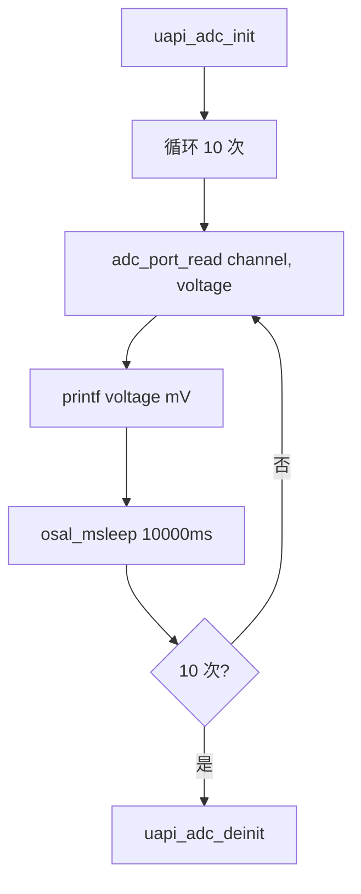

# ADC

> ADC (Analog-to-Digital Converter) 驱动 | sample: adc

## 学习目标

- 掌握 ADC 单次采样的完整流程：`uapi_adc_init()` → `adc_port_read()` 读取电压值
- 理解 WS53 当前 V155 ADC 的 12-bit 分辨率、1800mV 标称换算上限和校准换算方式
- 能够在 WS53 上读取模拟传感器的电压值

## 基本概念

### ADC 做什么

ADC将模拟电压转换为数字值——温度传感器、光敏电阻、电位器等模拟信号都需要 ADC 才能被 CPU 理解。


### 分辨率和参考电压

WS53 当前默认启用 V155 ADC。ADC 原始码为 12-bit，码值范围为 0～4095，共 4096 个量化等级；V155 HAL 使用 1800mV 作为标称换算上限，并结合芯片校准参数 `data_k`、`data_b` 将原始码换算为毫伏值。

应用调用 `adc_port_read()` 时得到的已经是换算后的毫伏值，不需要再按 `原始码 / 4095 × Vref` 进行二次计算。

### 输入电压要求

1800mV 是当前 V155 HAL 使用的标称换算上限。板级是否带有分压或其他模拟前端，需要以开发板原理图和芯片资料为准；在未确认硬件路径前，不要将 3.3V 直接接入 ADC 引脚。

### 单次采样 vs 连续采样

| 模式 | 行为 | 适用场景 |
|------|------|---------|
| 单次 | 触发一次转换，完成后 CPU 读结果 | 温度、光照等慢变信号 |
| 连续 | 硬件持续转换，DMA (Direct Memory Access) 搬数据 | 音频采样、快速波形捕捉 |

## 涉及 API

| API | 用途 | 头文件 |
|-----|------|--------|
| `uapi_adc_init(clock)` | 初始化 ADC 模块 | `adc.h` |
| `adc_port_read(channel, &voltage)` | 读取指定通道的电压值（mV） | `adc_porting.h` |
| `uapi_adc_deinit()` | 去初始化 ADC | `adc.h` |

## 案例说明

### 案例简介

初始化 ADC，每 10 秒采样一次指定通道的电压值并打印。循环 10 次后退出。

### 功能规格

| 规格项 | 说明 |
|--------|------|
| ADC 通道 | `CONFIG_ADC_CHANNEL`（Kconfig 可配） |
| 采样间隔 | 10000ms（10 秒） |
| 采样次数 | 10 次 |
| 输出单位 | mV（毫伏） |
| 任务优先级 | 26 |

程序运行流程：`uapi_adc_init` → 循环 10 次 `adc_port_read` → 打印电压 → `osal_msleep(10000)` → `uapi_adc_deinit`。

### 案例流程



## 案例操作指导

### 第一步：编译

```bash
fbb build ws53-liteos-app
```

> 完整的工程配置和编译方式请参考 [快速入门](../../../get-started/quick-start.md)。

### 第二步：烧录

```bash
fbb flash ws53-liteos-app
```

> 完整的烧录和串口监视方式请参考 [快速入门](../../../get-started/quick-start.md)。

### 第三步：验证

串口每 10 秒输出一次电压值：

```text
voltage: 1650 mv
voltage: 1652 mv
...
```

## 关键配置

| 参数 | 值 | 说明 |
|------|-----|------|
| ADC 通道 | Kconfig 可配 | 确认硬件引脚对应哪个 ADC 通道 |
| 标称换算上限 | 1800mV | 当前 V155 HAL 的 `VOLTAGE_UPPER_LIMIT`，实际结果还会应用芯片校准参数 |
| 采样间隔 | 10000ms | 慢变信号（如温度），无需高频采样 |
| 分压电阻 | 注意 | 有分压则测量值需按比例还原 |

## 代码详解

关键代码片段如下，完整实现见 `src/application/samples/peripheral/adc/adc_demo_inc.c`：

```c
#include "adc.h"
#include "adc_porting.h"
#include "soc_osal.h"
#include "app_init.h"

#define DELAY_10000MS     10000
#define CYCLES            10
#define ADC_TASK_PRIO     26
#define ADC_TASK_STACK_SIZE  0x1000

static void *adc_task(const char *arg)
{
    (void)arg;
    osal_printk("start adc sample\r\n");

    /* 初始化 ADC——clock 参数传入 ADC_CLOCK_NONE */
    uapi_adc_init(ADC_CLOCK_NONE);

    uint8_t adc_channel = CONFIG_ADC_CHANNEL;
    uint16_t voltage = 0;
    uint32_t cnt = 0;

    while (cnt++ < CYCLES) {
        /* 读取指定通道电压——返回单位 mV */
        adc_port_read(adc_channel, &voltage);
        osal_printk("voltage: %d mv\r\n", voltage);
        osal_msleep(DELAY_10000MS);
    }

    /* 如果测量值和实际值有较大差别——确认是否有分压电阻 */
    uapi_adc_deinit();
    return NULL;
}

static void adc_entry(void)
{
    osal_task *task = osal_kthread_create(
        (osal_kthread_handler)adc_task, 0,
        "AdcTask", ADC_TASK_STACK_SIZE);
    if (task != NULL) {
        osal_kthread_set_priority(task, ADC_TASK_PRIO);
    }
}
app_run(adc_entry);
```

> `adc_port_read()` 直接返回毫伏值。当前 V155 HAL 以 4096 个量化等级和 1800mV 标称上限为基础，并应用芯片校准参数完成换算；如果测量值与外部电压不一致，还需确认板级分压或模拟前端。

---
