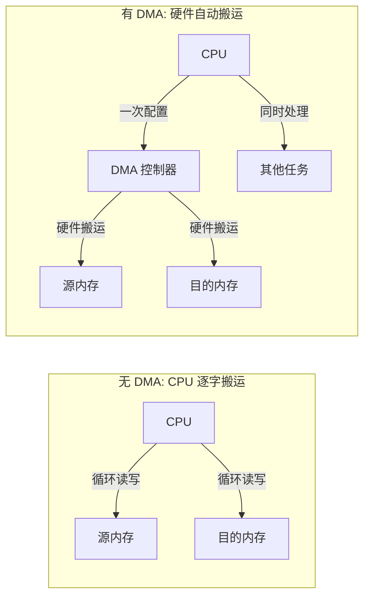
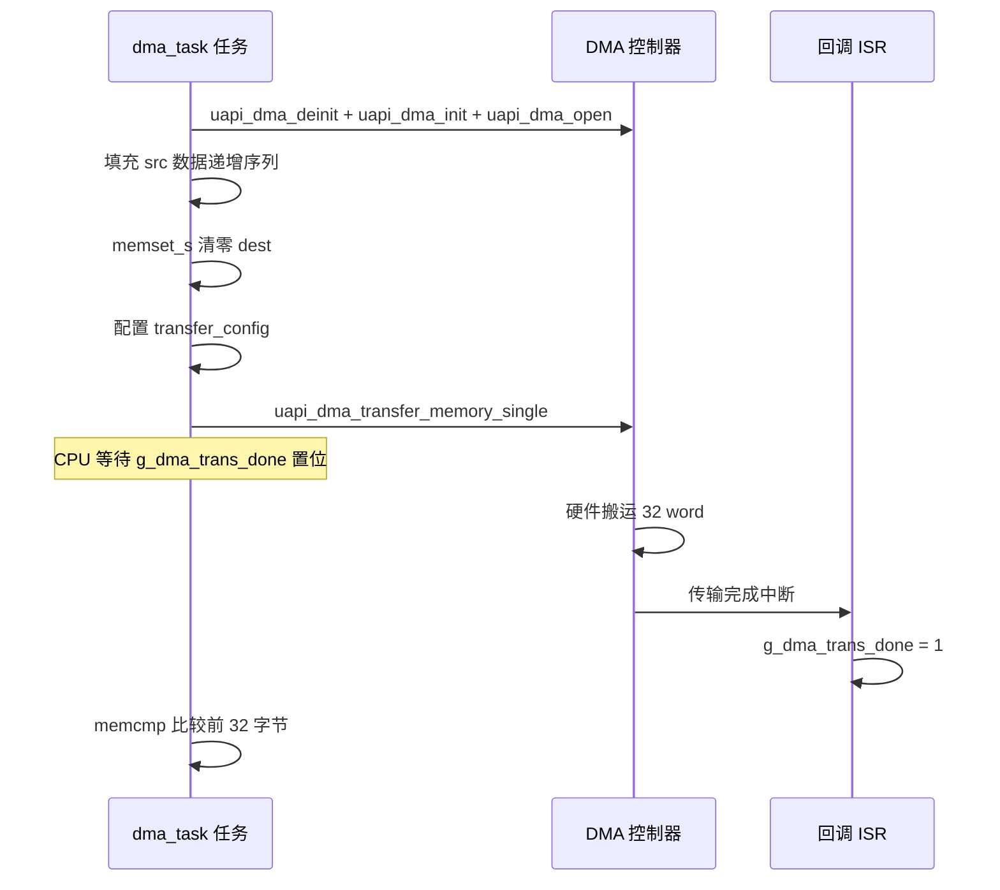

# DMA

> DMA (Direct Memory Access) 驱动 | sample: `src/application/samples/peripheral/dma/dma_demo.c` | 前置：[UART (Universal Asynchronous Receiver/Transmitter)](../uart/uart.md)、[SPI (Serial Peripheral Interface)](../spi/spi.md)

## 学习目标

- 理解 DMA 的核心价值——数据搬运不需要 CPU 逐字节参与
- 掌握 DMA 的基本配置：源/目的地址、传输宽度、传输数量、优先级
- 能够使用 `uapi_dma_transfer_memory_single()` 实现内存间数据拷贝，并理解 LLI (Linked List Item) 链式传输的扩展能力

## 基本概念

### DMA 做什么

没有 DMA 时，拷贝 128 字节数据：CPU 循环 32 次（32-bit 宽度），每次读一个字、写一个字——CPU 完全被占用。有 DMA 时：CPU 只需配置好源/目的/长度/宽度，启动后即可去处理其他任务，DMA 完成后通过中断回调通知 CPU。



### DMA 传输要素

每次 DMA 传输需要明确以下参数，这些参数在 `dma_ch_user_memory_config_t` 结构体中配置：

| 要素 | 字段 | 说明 | sample 取值 |
|------|------|------|---|
| 源地址 | `src` | 数据来源地址（物理地址） | `g_app_dma_src_data` 数组首址 |
| 目的地址 | `dest` | 数据去向地址（物理地址） | `g_app_dma_desc_data` 数组首址 |
| 传输数量 | `transfer_num` | 总共传输的 word 数 | 32 |
| 传输宽度 | `width` | 每 word 的字节宽度（0=8b, 1=16b, 2=32b） | 2（32-bit） |
| 优先级 | `priority` | DMA 通道优先级（0 最高） | 0 |

## 涉及 API

| API | 用途 | 头文件 |
|-----|------|--------|
| `uapi_dma_deinit()` | 清理已有 DMA 驱动状态 | `hal_dma.h` |
| `uapi_dma_init()` | 初始化 DMA 模块 | `hal_dma.h` |
| `uapi_dma_open()` | 打开 DMA 使能 | `hal_dma.h` |
| `uapi_dma_transfer_memory_single(&cfg, cb, arg)` | 启动单次内存→内存 DMA 传输 | `hal_dma.h` |
| `uapi_dma_transfer_memory_lli(ch, &cfg, cb)` | 配置 LLI 链式传输（扩展） | `hal_dma.h` |
| `uapi_dma_enable_lli(ch, cb, arg)` | 启动 LLI 传输 | `hal_dma.h` |
| `uapi_dma_end_transfer(ch)` | 结束/释放 DMA 通道 | `hal_dma.h` |
| `uapi_dma_get_lli_channel(port, hs)` | 获取 LLI 传输专用通道 | `hal_dma.h` |

## 案例说明

### 案例简介

本案例演示 DMA 两种传输模式的内存间数据拷贝：
- **单次传输**（默认）：一次性配置源/目的/长度，启动后 DMA 自动搬运 32 个 word，完成后通过回调通知任务；当前 Sample 的比较长度存在不足，详见后文说明
- **LLI 链式传输**（`CONFIG_DMA_MEMORY_LLI_TRANSFER_MODE` 宏开启）：将传输描述符链表预先写入 DMA，硬件自动遍历执行，适合连续多块搬运

### 功能规格

| 规格项 | 说明 |
|--------|------|
| 传输方向 | 内存 src 数组 → 内存 dest 数组 |
| 传输宽度 | 32-bit（width=2） |
| 单次传输量 | 32 word（128 字节） |
| 优先级 | 0（最高） |
| 完成通知 | DMA 中断回调 `app_dma_trans_done_callback` |
| 当前正确性检查 | `memcmp(src, dest, transfer_num)`，只比较前 32 字节，不能证明 128 字节全部一致 |
| 任务间隔 | 每 500ms 启动一次传输 |

### 案例流程



## 案例操作指导

1. 确保工程已使能 DMA 驱动（Kconfig 中选中 `DMA` 相关配置）
2. 编译：
   ```bash
   fbb build ws53-liteos-app
   ```
   更多编译选项请参考 [构建](../../../overall-architecture/build-system/index.md#构建)。
3. 如需体验 LLI 链式传输，在 `menuconfig` 中开启 `CONFIG_DMA_MEMORY_LLI_TRANSFER_MODE` 后重新编译
4. 烧录固件后，串口观察输出：
   - 单次模式输出：`dma single memory transfer start!` → `dma memory copy test succ, length = 32 block`。该日志只表示当前源码比较的前 32 字节一致
   - LLI 模式输出：`dma config link list item of memory to memory succ!` → `dma channel transfer finish!`

## 关键配置

| 配置项 | 推荐值 | 说明 |
|--------|---|------|
| `width` 传输宽度 | 2（32-bit） | 32-bit 一次搬 4 字节，效率最高。根据外设 FIFO (First-In First-Out) 宽度匹配，UART 通常用 8-bit（0） |
| `transfer_num` | 按实际需求 | 单位需要结合传输宽度和驱动定义确认；单次传输上限应以 WS53 驱动约束或芯片资料为准 |
| `priority` | 0 | 0 优先级最高。多个 DMA 通道同时请求时，高优先级先执行 |
| 传输模式 | 单次 vs LLI | 简单内存拷贝用 `_single()`；连续多块搬运（音频、大数据）用 `_lli()` |

> **Trade-off**：单次传输 API 配置简单；LLI 链式传输需要预先构建链表，但适合连续多块数据的搬运。应根据数据组织方式、实时性和 CPU 参与程度选择，不使用未经 WS53 资料确认的固定容量阈值。

## 代码详解

### 1. 全局变量定义与回调注册

DMA 传输需要源缓冲区和目的缓冲区，外加一个完成标志供任务轮询。以下定义来自 sample 实际代码：

```c
#define DMA_TRANSFER_WORD_NUM       32
#define DMA_TRANSFER_PRIORITY       0
#define DMA_TRANSFER_WIDTH          2

static uint32_t g_app_dma_src_data[DMA_TRANSFER_WORD_NUM] = { 0 };
static uint32_t g_app_dma_desc_data[DMA_TRANSFER_WORD_NUM] = { 0 };
static uint8_t g_dma_trans_done = 0;
```

DMA 完成回调在 ISR (Interrupt Service Routine) 上下文中执行，根据 `int_type` 区分传输完成、块完成、错误三种事件：

```c
static void app_dma_trans_done_callback(uint8_t int_type, uint8_t channel, uintptr_t arg)
{
    unused(arg);
    unused(channel);
    switch (int_type) {
        case HAL_DMA_INTERRUPT_TFR:    /* 全部传输完成 */
            g_dma_trans_done = 1;
            break;
        case HAL_DMA_INTERRUPT_BLOCK:  /* 单块传输完成（LLI） */
            g_dma_trans_done = 1;
            break;
        case HAL_DMA_INTERRUPT_ERR:    /* 传输错误 */
            osal_printk("DMA transfer error.\r\n");
            break;
        default:
            break;
    }
}
```

> `HAL_DMA_INTERRUPT_TFR` 在单次传输完成时触发；`HAL_DMA_INTERRUPT_BLOCK` 在 LLI 链表中单块完成时触发。两者都置位 `g_dma_trans_done`。

### 2. DMA 初始化与数据准备

任务开始时先初始化 DMA 模块，然后用递增序列填充源数据。下面保留当前 Sample 的写法：`DMA_TRANSFER_WORD_NUM` 为 32，但 `memset_s` 的长度单位是字节，因此这里只清零了目的缓冲区前 32 字节，而不是完整的 128 字节：

```c
/* DMA init. */
uapi_dma_deinit();
uapi_dma_init();
uapi_dma_open();

for (uint32_t i = 0; i < DMA_TRANSFER_WORD_NUM; i++) {
    g_app_dma_src_data[i] = i;       /* 填充 0, 1, 2, ... 31 */
}
memset_s(g_app_dma_desc_data, DMA_TRANSFER_WORD_NUM, 0, DMA_TRANSFER_WORD_NUM);
```

完整清零应使用 `sizeof(g_app_dma_desc_data)` 作为目标缓冲区大小和清零长度。

### 3. 单次传输配置与调用

以下配置定义源地址、目的地址、传输数量、优先级和宽度。注意 `src` 和 `dest` 必须是物理地址（WS53 中虚拟地址即物理地址，故直接强转）：

```c
dma_ch_user_memory_config_t transfer_config = { 0 };
transfer_config.src = (uint32_t)(uintptr_t)g_app_dma_src_data;
transfer_config.dest = (uint32_t)(uintptr_t)g_app_dma_desc_data;
transfer_config.transfer_num = DMA_TRANSFER_WORD_NUM;
transfer_config.priority = DMA_TRANSFER_PRIORITY;
transfer_config.width = DMA_TRANSFER_WIDTH;
```

启动单次传输——`uapi_dma_transfer_memory_single` 是非阻塞调用，返回后 CPU 可以去做其他事：

```c
if (uapi_dma_transfer_memory_single(&transfer_config, app_dma_trans_done_callback,
                                    (uintptr_t)NULL) == ERRCODE_SUCC) {
    osal_printk("dma single memory transfer succ!\r\n");
}
```

### 4. 等待完成并验证

任务轮询 `g_dma_trans_done` 标志等待 DMA 完成。下面是当前源码的比较逻辑；`transfer_num` 为 32，而 `memcmp` 的第三个参数单位是字节，因此实际只比较前 32 字节：

```c
while (!g_dma_trans_done) {}   /* 等待 DMA 完成中断 */
if (memcmp((void *)transfer_config.src, (void *)transfer_config.dest,
           transfer_config.transfer_num) == 0) {
    osal_printk("dma memory copy test succ, length = %d block\r\n",
                transfer_config.transfer_num);
}
```

### 当前源码验证范围

当前 Sample 只比较四分之一缓冲区。两个缓冲区均为 `uint32_t[32]`，总大小为 128 字节。要完整验证，应将比较长度改为 `transfer_config.transfer_num * sizeof(uint32_t)`，或直接使用缓冲区的 `sizeof`。在源码修正前，不能依据成功日志认定完整 128 字节均一致。

### 5. LLI 链式传输（扩展模式）

当 `CONFIG_DMA_MEMORY_LLI_TRANSFER_MODE` 开启时，sample 走 LLI 分支。LLI 传输需要先获取专用通道，再配置链表，最后使能传输：

```c
dma_channel_t dma_channel = uapi_dma_get_lli_channel(0, HAL_DMA_HANDSHAKING_MAX_NUM);
uapi_dma_transfer_memory_lli(dma_channel, &transfer_config,
                             app_dma_trans_done_callback);
uapi_dma_enable_lli(dma_channel, app_dma_trans_done_callback, (uintptr_t)NULL);
/* 等待完成 */
while (!g_dma_trans_done) {}
uapi_dma_end_transfer(dma_channel);
```

> LLI 模式的核心价值在于提前构建多条传输描述符链表——DMA 完成一条后自动加载下一条，无需 CPU 再次介入。适用于音频流、显示帧缓冲等需要连续搬运多块数据的场景。

---
