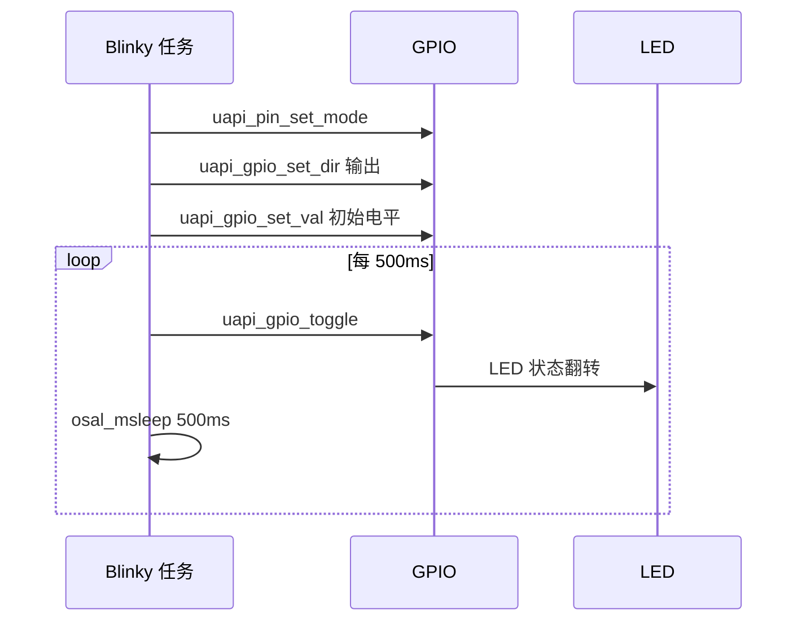

# GPIO

> GPIO (General Purpose Input/Output) 驱动 | sample: blinky

## 学习目标

- 掌握 GPIO 输出的初始化流程。
- 使用 GPIO 控制 LED (Light Emitting Diode) 电平。
- 理解高电平驱动与低电平驱动的差异。

## 输入与输出

| 模式 | 数据方向 | 典型用途 | 关键操作 |
| --- | --- | --- | --- |
| 输出 | CPU → 引脚 | LED、使能信号、继电器控制 | 设置方向、写电平或翻转 |
| 输入 | 引脚 → CPU | 按键、开关量、外部触发 | 设置方向、读取电平 |
| 输入中断 | 引脚 → ISR (Interrupt Service Routine) | 按键和边沿事件 | 配置上下拉、触发边沿和回调 |

无论输入还是输出，都应先将引脚复用为 GPIO，再设置方向和电气属性。

## GPIO 输出

基本流程：


常用接口包括 `uapi_pin_set_mode()`、`uapi_gpio_set_dir()`、`uapi_gpio_set_val()` 和 `uapi_gpio_toggle()`。

GPIO 驱动能力有限。LED 需要串联限流电阻，继电器、电机等大电流负载必须通过三极管或 MOSFET 驱动。

## 涉及 API

| API | 用途 | 头文件 |
| --- | --- | --- |
| `uapi_pin_set_mode()` | 将引脚复用为 GPIO 功能 | `pinctrl.h` |
| `uapi_gpio_set_dir()` | 设置 GPIO 输出方向 | `gpio.h` |
| `uapi_gpio_set_val()` | 写输出电平 | `gpio.h` |
| `uapi_gpio_toggle()` | 翻转输出电平 | `gpio.h` |

## 案例说明

### 案例简介

`blinky` 案例将一个 GPIO 配置为输出，每隔 500ms 翻转一次电平，使开发板 LED 周期性亮灭。

### 功能规格

| 规格项 | 说明 |
| --- | --- |
| 源码目录 | `src/application/samples/peripheral/blinky/` |
| 输出引脚 | `CONFIG_BLINKY_PIN`，通过 Kconfig 配置 |
| 初始电平 | 低电平 |
| 翻转间隔 | 500ms |
| 运行现象 | LED 以固定周期闪烁，串口周期输出运行日志 |

程序运行流程：引脚复用 → 设置输出方向 → 写入初始电平 → 周期性翻转电平。



## 案例操作指导

### 第一步：配置案例

启用 `blinky` 案例，并确认 `CONFIG_BLINKY_PIN` 与开发板 LED 引脚一致。

### 第二步：编译

```bash
fbb build ws53-liteos-app
```

> 更多编译选项请参考 [构建](../../../overall-architecture/build-system/index.md#构建)。

### 第三步：烧录

```bash
fbb flash ws53-liteos-app
```

> 更多烧录选项请参考 [烧录](../../../overall-architecture/build-system/index.md#烧录)。

### 第四步：验证

LED 周期性亮灭，串口持续输出运行日志。

## 关键配置

| 参数 | 推荐值 | 说明 |
| --- | --- | --- |
| LED 引脚 | 按开发板原理图配置 | 必须与板载 LED 实际连接一致 |
| LED 初始电平 | 按有效电平配置 | 部分开发板 LED 为低电平点亮 |
| 翻转间隔 | 500ms | 便于直接观察亮灭变化 |

## 代码详解

### LED 输出核心代码

完整实现位于 `src/application/samples/peripheral/blinky/`。GPIO 输出的核心逻辑如下：

```c
#include "pinctrl.h"
#include "gpio.h"
#include "soc_osal.h"

#define BLINKY_DURATION_MS 500

static void blinky_task(void)
{
    uapi_pin_set_mode(CONFIG_BLINKY_PIN, HAL_PIO_FUNC_GPIO);
    uapi_gpio_set_dir(CONFIG_BLINKY_PIN, GPIO_DIRECTION_OUTPUT);
    uapi_gpio_set_val(CONFIG_BLINKY_PIN, GPIO_LEVEL_LOW);

    while (1) {
        osal_msleep(BLINKY_DURATION_MS);
        uapi_gpio_toggle(CONFIG_BLINKY_PIN);
        osal_printk("Blinky working.\r\n");
    }
}
```

`uapi_pin_set_mode()` 决定引脚由 GPIO 控制，`uapi_gpio_set_dir()` 决定数据方向，之后才能写入或翻转输出电平。LED 是否低电平点亮取决于开发板电路。

## 验证要点

- LED 输出案例应按固定周期切换电平。
- 若 LED 不闪烁，检查 `CONFIG_BLINKY_PIN` 是否与开发板原理图一致。
- 若亮灭状态与预期相反，检查 LED 是高电平有效还是低电平有效。

通用中断注册和 ISR 约束请参考 [OSAL 中断管理](../../../api-reference/osal/interrupt.md)。
