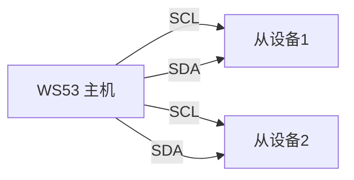
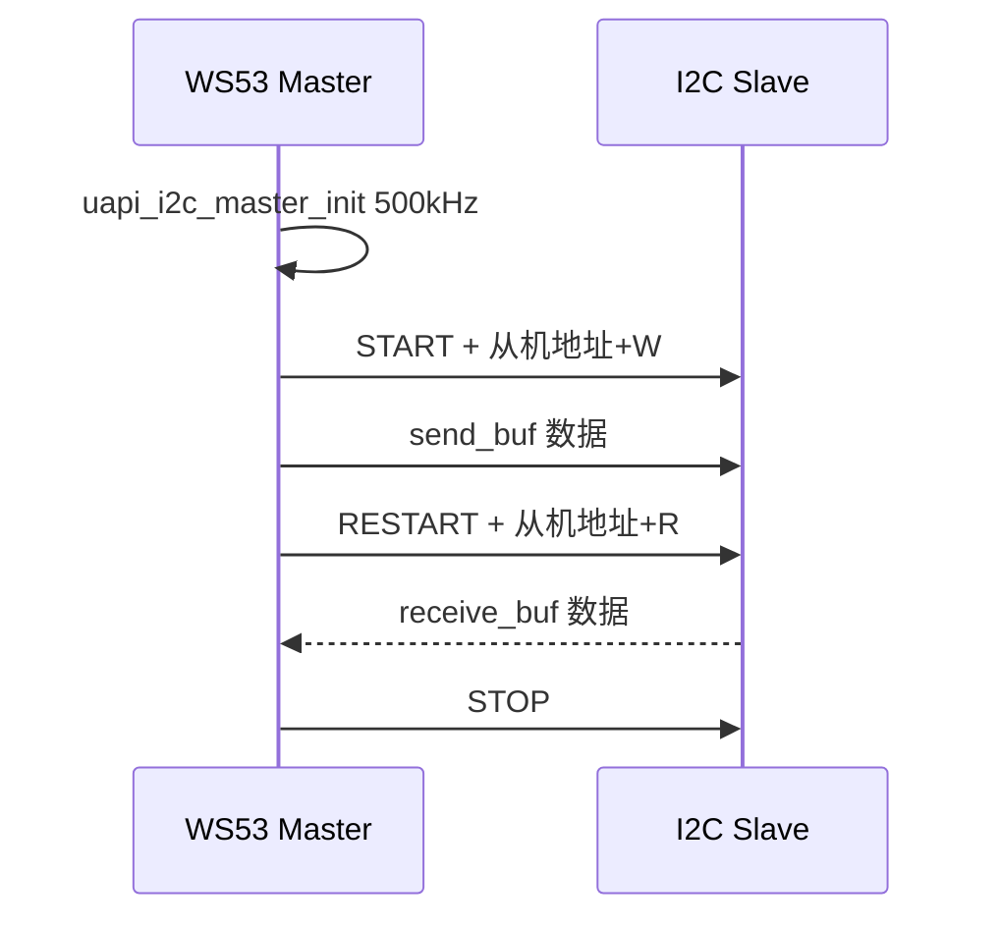

# I2C

> I2C (Inter-Integrated Circuit) 驱动 | sample: i2c

## 学习目标

- 理解 I2C 两线制总线（SCL (Serial Clock Line)+ SDA (Serial Data Line)）和主从模型
- 掌握 I2C 主机和从机的初始化、收发 API 及 Kconfig 选择方式
- 能够根据外接器件协议使用 WS53 主机 Sample，或使用两块开发板配合验证主从 Sample

## 基本概念

### I2C 总线简介

I2C是飞利浦发明的两线制串行总线——SCL（时钟）+ SDA（数据），支持一主多从。



### 从机地址

每个 I2C 设备有唯一的 7-bit 地址——主机通过地址选中目标从机，然后发起读写。常见地址：EEPROM 0x50~0x57、温度传感器 0x48。

### 传输速率

| 模式 | 速率 | 适用场景 |
|------|---|------|
| 标准模式 | 100kHz | 低速传感器、EEPROM |
| 快速模式 | 400kHz | 多数传感器和存储器 |
| 高速模式 | 3.4MHz | 摄像头等高速设备 |

### I2C 读写时序

通用写事务：START → 从机地址+W → 数据 → STOP

通用写后读事务：START → 从机地址+W → 写数据 → RESTART → 从机地址+R → 读数据 → STOP

> “寄存器地址 + 数据”是 EEPROM、传感器等具体器件常见的上层协议，不是所有 I2C 设备的统一事务格式。当前 Sample 只提供通用缓冲区收发，如何组织寄存器地址应以目标器件协议为准。

## 涉及 API

| API | 用途 | 头文件 |
|-----|------|--------|
| `uapi_pin_set_mode(pin, mode)` | 设置 SCL/SDA 引脚为 I2C 功能 | `pinctrl.h` |
| `uapi_i2c_master_init(bus, baudrate, hscode)` | 初始化 I2C 主机总线和速率 | `i2c.h` |
| `uapi_i2c_master_write(bus, addr, &data)` | 主机向从机写数据 | `i2c.h` |
| `uapi_i2c_master_read(bus, addr, &data)` | 主机从从机读数据 | `i2c.h` |
| `uapi_i2c_master_writeread(bus, addr, &data)` | 在一次事务中完成写后读 | `i2c.h` |
| `uapi_i2c_slave_init(bus, baudrate, addr)` | 初始化 I2C 从机 | `i2c.h` |
| `uapi_i2c_slave_read(bus, &data)` | 从机接收主机数据 | `i2c.h` |
| `uapi_i2c_slave_write(bus, &data)` | 从机向主机发送数据 | `i2c.h` |

## 案例说明

### 案例简介

目录中同时提供主机和从机 Sample。CMake 使用 `if/elseif` 选择其中一个：

- `CONFIG_SAMPLE_SUPPORT_I2C_MASTER`：以 500kHz 初始化主机，默认执行 `uapi_i2c_master_writeread()`，并打印接收缓冲区。
- `CONFIG_SAMPLE_SUPPORT_I2C_SLAVE`：以 500kHz 初始化从机，地址固定为 `0x8`，循环执行从机接收和发送。

### 功能规格

| 规格项 | 说明 |
|--------|------|
| 主机端口 | `CONFIG_I2C_MASTER_BUS_ID`，默认 I2C0 |
| 从机端口 | `CONFIG_I2C_SLAVE_BUS_ID`，默认 I2C1 |
| 速率 | 主机、从机源码均为 500kHz |
| 高速模式主机码 | 主机源码 `hscode=0`；它不是主机地址，只在高速模式下使用 |
| 主机目标地址 | `CONFIG_I2C_SLAVE_ADDR`，默认 0x49 |
| WS53 从机地址 | 从机源码固定为 0x8 |
| 传输长度 | `CONFIG_I2C_TRANSFER_LEN`，默认 1 字节 |
| 主机操作 | 默认写后读；关闭 `CONFIG_I2C_MASTER_SUPPORT_WRITEREAD` 后先写再读 |
| 从机操作 | 先调用 `uapi_i2c_slave_read()`，成功后调用 `uapi_i2c_slave_write()` |

主机程序流程：引脚复用 → `uapi_i2c_master_init` → 准备收发缓冲区 → `master_writeread`，或依次执行 `master_write` 和 `master_read` → 打印结果。从机程序流程：引脚复用 → `uapi_i2c_slave_init` → `slave_read` → 打印数据 → `slave_write`。

### 案例流程



## 案例操作指导

### 第一步：编译

```bash
fbb build ws53-liteos-app
```

> 更多编译选项请参考 [构建操作](../../../get-started/quick-start.md)。

### 第二步：烧录

```bash
fbb flash ws53-liteos-app
```

> 更多烧录选项请参考 [构建操作](../../../get-started/quick-start.md)。

如需用两块 WS53 开发板对测：一块启用主机 Sample，另一块启用从机 Sample；将两块板的 SCL、SDA 和 GND 对应连接，并确保总线上有合适的上拉。由于从机源码地址固定为 `0x8`，主机侧需要将 `CONFIG_I2C_SLAVE_ADDR` 改为 `0x8`。主机和从机默认使用不同总线号和引脚，应按各自 Kconfig 配置接线。

### 第三步：验证

主机和从机 Sample 都会打印接收缓冲区，供人工核对收发结果。当前源码没有执行 `memcmp` 或逐字节自动比较，因此“传输成功”日志不等同于已经自动证明发送与接收数据完全一致。

## 关键配置

| 参数 | 值 | 说明 |
|------|-----|------|
| `baudrate` | 500000 | 与从设备支持的速率保持一致 |
| `hscode` | 0x0 | 高速模式主机码，有效范围 0～7；只在高速模式下使用，不是普通主机地址 |
| `CONFIG_I2C_SLAVE_ADDR` | 0x49 | 目标从机地址，以设备手册为准 |
| `CONFIG_I2C_TRANSFER_LEN` | 1 | 单次收发缓冲区长度 |
| 上拉 | 按总线电压、速率和负载选择 | I2C 为开漏总线；部分开发板已集成上拉，外接前先确认原理图 |

## 代码详解

以下为主机关键代码片段，完整实现见 `src/application/samples/peripheral/i2c/i2c_master_demo.c`：

```c
#include "pinctrl.h"
#include "i2c.h"
#include "soc_osal.h"
#include "app_init.h"

#define I2C_MASTER_ADDR       0x0
#define I2C_SET_BAUDRATE      500000
#define I2C_TASK_PRIO         24

static i2c_data_t data = { 0 };
static uint8_t tx_buff[CONFIG_I2C_TRANSFER_LEN] = { 0 };
static uint8_t rx_buff[CONFIG_I2C_TRANSFER_LEN] = { 0 };

static void app_i2c_init_pin(void)
{
    /* SCL 和 SDA 都要设为 I2C 功能 */
    uapi_pin_set_mode(CONFIG_I2C_MASTER_SCL_PIN,
        CONFIG_I2C_MASTER_SCL_PIN_MODE);
    uapi_pin_set_mode(CONFIG_I2C_MASTER_SDA_PIN,
        CONFIG_I2C_MASTER_SDA_PIN_MODE);
}

static void app_i2c_data_config(void)
{
    for (uint32_t i = 0; i < CONFIG_I2C_TRANSFER_LEN; i++) {
        tx_buff[i] = i & 0xFF;
    }
    data.send_buf = tx_buff;
    data.send_len = CONFIG_I2C_TRANSFER_LEN;
    data.receive_buf = rx_buff;
    data.receive_len = CONFIG_I2C_TRANSFER_LEN;
}

static void *i2c_master_task(const char *arg)
{
    unused(arg);
    app_i2c_init_pin();
    uapi_i2c_master_init(CONFIG_I2C_MASTER_BUS_ID,
        I2C_SET_BAUDRATE, I2C_MASTER_ADDR);
    app_i2c_data_config();

    while (1) {
        osal_msleep(500);
        uapi_i2c_master_writeread(CONFIG_I2C_MASTER_BUS_ID,
            CONFIG_I2C_SLAVE_ADDR, &data);
        osal_printk("read back: 0x%02X\r\n", data.receive_buf[0]);
    }
    return NULL;
}
app_run(i2c_master_entry);
```

### 从机关键流程

从机实现位于 `src/application/samples/peripheral/i2c/i2c_slave_demo.c`。当前地址固定为 `0x8`，默认总线和引脚由 `CONFIG_I2C_SLAVE_*` 配置：

```c
#define I2C_SLAVE_ADDR 0x8
#define I2C_SET_BAUDRATE 500000

uapi_i2c_slave_init(CONFIG_I2C_SLAVE_BUS_ID,
                    I2C_SET_BAUDRATE,
                    I2C_SLAVE_ADDR);

while (1) {
    osal_msleep(100);
    if (uapi_i2c_slave_read(CONFIG_I2C_SLAVE_BUS_ID, &data) != ERRCODE_SUCC) {
        continue;
    }
    for (uint32_t i = 0; i < data.receive_len; i++) {
        osal_printk("i2c slave receive data is %x\r\n", data.receive_buf[i]);
    }
    (void)uapi_i2c_slave_write(CONFIG_I2C_SLAVE_BUS_ID, &data);
}
```

> I2C 是开漏（OD）总线，SCL 和 SDA 需要上拉。阻值应根据总线电压、速率、电容和板级已有电路确定，不能把某个通用阻值直接视为所有 WS53 接线的固定值。

---
