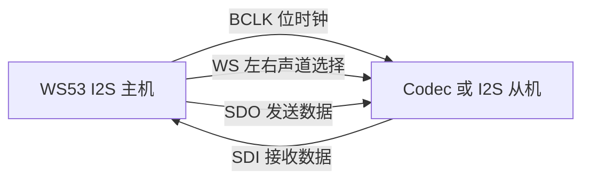
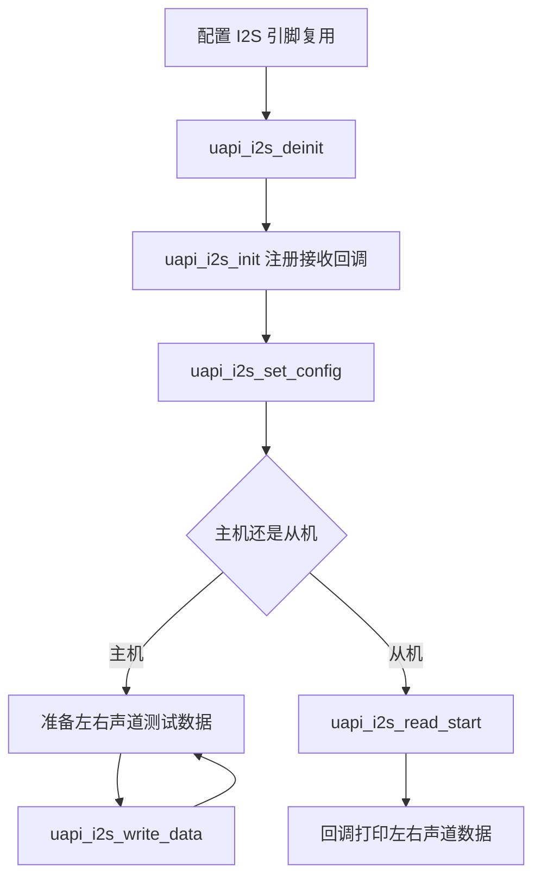

# I2S

> I2S (Inter-IC Sound) 驱动 | sample: `src/application/samples/peripheral/i2s/`

!!! info "与 WS63 参考案例的区别"

    本页对应 WS53 当前可构建的普通 I2S 主从收发 Sample。WS63 对应页面基于 `i2s_dma_lli/`，重点是 DMA/LLI 流式传输，两者不是同一个案例，因此位宽、传输接口和案例流程不同。

## 学习目标

- 理解 I2S 的 BCLK、WS、SDI 和 SDO 信号及左右声道帧结构
- 掌握 I2S 主机和从机的初始化、格式配置与引脚复用流程
- 能够在主机模式下使用 `uapi_i2s_write_data()` 发送双声道数据，并在从机模式下通过接收回调读取数据

## 基本概念

### I2S 总线简介

I2S 是面向数字音频的同步串行总线。主机提供位时钟和声道选择信号，数据按左、右声道依次传输。



| 信号 | 作用 |
|------|------|
| BCLK/CLK | 每个音频数据位的同步时钟 |
| WS/LRCLK | 标识当前传输的是左声道还是右声道 |
| SDO | WS53 向外发送的串行音频数据 |
| SDI | WS53 从外部接收的串行音频数据 |

### 音频格式参数

| 参数 | WS53 案例配置 | 说明 |
|------|---|------|
| 工作模式 | 标准 I2S（`STD_MODE`） | 使用标准左右声道帧格式 |
| 数据位宽 | 24-bit | 每个声道使用 24 位有效数据 |
| 声道数 | 2 | 左、右双声道 |
| 采样边沿 | 上升沿 | 在 BCLK 上升沿采样数据 |
| 时钟分频 | 24 | 由 `div_number` 配置 |

### 主机与从机

| 模式 | 时钟来源 | 案例行为 |
|------|------|------|
| 主机 | WS53 输出 BCLK 和 WS | 周期发送左右声道测试数据；当前主机 Sample 未启动接收 |
| 从机 | 外部主机提供 BCLK 和 WS | 启动读取，在回调中打印左右声道数据 |

## 涉及 API

| API | 用途 | 头文件 |
|-----|------|--------|
| `uapi_i2s_init(bus, callback)` | 初始化 I2S 并注册接收回调 | `i2s.h` |
| `uapi_i2s_set_config(bus, &config)` | 配置主从模式、位宽、声道和时钟 | `i2s.h` |
| `uapi_i2s_write_data(bus, &data)` | 发送左右声道数据 | `i2s.h` |
| `uapi_i2s_read_start(bus)` | 启动 I2S 接收 | `i2s.h` |
| `uapi_i2s_deinit(bus)` | 去初始化指定 I2S 总线 | `i2s.h` |

## 案例说明

### 案例简介

WS53 提供主机和从机两个 I2S Sample。主机案例构造递增的左右声道数据并周期发送；从机案例启动接收，收到数据后通过回调分别打印左右声道内容。

当前案例使用普通 I2S 收发接口，不配置 DMA，也不演示 LLI 链式传输。

### 功能规格

| 规格项 | 说明 |
|--------|------|
| 主机源码 | `i2s/i2s_master_demo.c` |
| 从机源码 | `i2s/i2s_slave_demo.c` |
| 总线编号 | `CONFIG_I2S_MASTER_BUS_ID` / `CONFIG_I2S_SLAVE_BUS_ID`，默认 0 |
| 数据位宽 | 24-bit |
| 声道 | 左、右双声道 |
| 传输长度 | `CONFIG_I2S_TRANSFER_LEN`，默认 32 |
| 传输方式 | 普通 I2S 写入/中断接收，不使用 DMA/LLI |
| 主机发送周期 | 任务等待 500ms 后发送，再延时 1000ms |

### 案例流程



## 案例操作指导

### 第一步：配置案例

启用 `ENABLE_PERIPHERAL_SAMPLE`、`SAMPLE_SUPPORT_I2S`，再选择 `SAMPLE_SUPPORT_I2S_MASTER` 或 `SAMPLE_SUPPORT_I2S_SLAVE`。总线编号和传输长度可通过 Kconfig 配置。

### 当前引脚配置

`sio_porting_i2s_pinmux()` 没有读取 I2S Sample Kconfig 中的 CLK、WS、DO、DI 引脚配置，而是将 `S_MGPIO17`、`S_MGPIO20`、`S_MGPIO19`、`S_MGPIO18` 固定配置为 `PIN_MODE_3`。如需更换引脚，应根据 WS53 引脚复用表修改 `src/drivers/chips/ws53/porting/sio/sio_porting.c`，不能只修改 Sample Kconfig。

### 第二步：连接设备

两端必须共地，并按所选模式连接：

- 运行 WS53 主机 Sample 时，将 WS53 输出的 BCLK、WS 接到从机对应输入，并将 WS53 的 SDO 接到从机 SDI。当前主机 Sample 只发送，不需要连接反向数据线。
- 运行 WS53 从机 Sample 时，由外部主机提供 BCLK、WS，并将外部主机 SDO 接到 WS53 SDI。

### 第三步：编译和烧录

```bash
fbb build ws53-liteos-app
fbb flash ws53-liteos-app
```

> 完整的工程配置、编译、烧录和串口监视方式请参考 [构建系统](../../../overall-architecture/build-system/index.md)。

### 第四步：验证

主机日志周期输出 `i2s master write start!`。从机收到数据后，回调按 `l: 0x...`、`r: 0x...` 打印左右声道值。没有外部时钟和配套设备时，从机不会产生有效接收日志。

## 关键配置

| 配置项 | 默认值 | 说明 |
|--------|---|------|
| `CONFIG_I2S_MASTER_BUS_ID` | 0 | 主机使用的 I2S 总线 |
| `CONFIG_I2S_SLAVE_BUS_ID` | 0 | 从机使用的 I2S 总线 |
| `CONFIG_I2S_TRANSFER_LEN` | 32 | 每个声道的传输数据数量 |
| `I2S_DIV_NUM` | 24 | I2S 时钟分频值 |
| `data_width` | `TWENTY_FOUR_BIT` | 单声道有效数据位宽 |
| `channels_num` | `TWO_CH` | 双声道传输 |

> WS53 I2S Sample 在启用低功耗功能时会调用 `uapi_lpc_set_type(PM_NO_SLEEP)`，防止传输期间进入当前 I2S 尚不支持的低功耗状态。

## 代码详解

### 1. 配置 I2S 格式

主机和从机使用同一套音频格式，仅 `drive_mode` 不同：

```c
i2s_config_t config = {
    .drive_mode = MASTER,
    .transfer_mode = STD_MODE,
    .data_width = TWENTY_FOUR_BIT,
    .channels_num = TWO_CH,
    .timing = NONE_TIMING_MODE,
    .clk_edge = RISING_EDGE,
    .div_number = I2S_DIV_NUM,
    .number_of_channels = I2S_NUMBER_OF_CHANNELS,
};

sio_porting_i2s_pinmux();
uapi_i2s_deinit(CONFIG_I2S_MASTER_BUS_ID);
uapi_i2s_init(CONFIG_I2S_MASTER_BUS_ID, app_i2s_rx_callback);
uapi_i2s_set_config(CONFIG_I2S_MASTER_BUS_ID, &config);
```

主机源码虽然向 `uapi_i2s_init()` 传入了接收回调，但没有调用 `uapi_i2s_read_start()`，因此当前主机 Sample 不会启动接收；从机源码调用该接口后才真正使能 RX。

### 2. 主机发送双声道数据

```c
static uint32_t g_app_left_data[CONFIG_I2S_TRANSFER_LEN];
static uint32_t g_app_right_data[CONFIG_I2S_TRANSFER_LEN];

static i2s_tx_data_t g_app_write_data = {
    .left_buff = g_app_left_data,
    .right_buff = g_app_right_data,
    .length = CONFIG_I2S_TRANSFER_LEN,
};

while (1) {
    osal_msleep(I2S_TASK_DURATION_MS);
    osal_printk("i2s master write start!\r\n");
    uapi_i2s_write_data(CONFIG_I2S_MASTER_BUS_ID, &g_app_write_data);
    uapi_tcxo_delay_ms(TCXO_DELAY_MS);
}
```

### 3. 从机接收回调

```c
void app_i2s_rx_callback(uint32_t *left_buff,
    uint32_t *right_buff, uint32_t length)
{
    for (uint32_t i = 0; i < length; i++) {
        osal_printk("l: 0x%0x\r\n", left_buff[i]);
        osal_printk("r: 0x%0x\r\n", right_buff[i]);
    }
}

uapi_i2s_read_start(CONFIG_I2S_SLAVE_BUS_ID);
```

接收回调应避免耗时处理。实际音频应用中，建议将数据转交给任务或缓冲队列，避免逐样本打印导致数据丢失。

---
