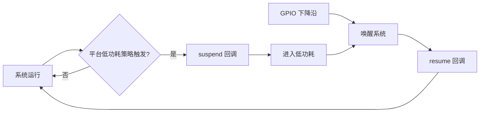
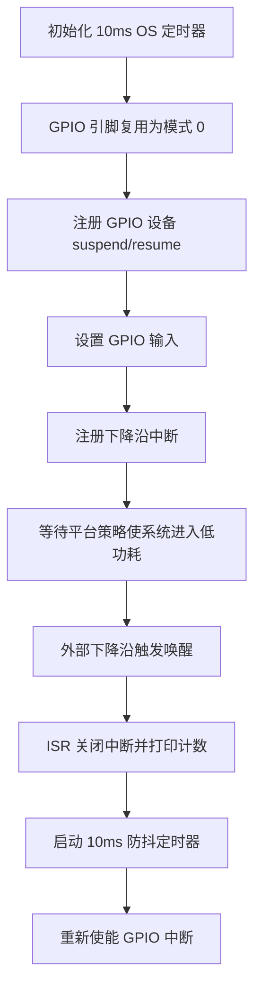

# LPC GPIO 唤醒

> LPC (Low Power Control) + GPIO 唤醒 | sample: `src/application/samples/peripheral/lpc/lpc_gpio_wakeup_demo.c` | WS53 独有案例

## 学习目标

- 理解设备进入和退出低功耗时的 suspend/resume 回调机制
- 掌握 GPIO 输入、下降沿中断和低功耗唤醒源的配置流程
- 能够在平台已启用并实际进入低功耗的前提下，通过 ISR、suspend 和 resume 计数观察唤醒流程

## 基本概念

### 低功耗设备生命周期

系统准备进入低功耗状态时，会调用已注册设备的 suspend 回调，使设备保存状态或停止工作；系统被唤醒后，再调用 resume 回调恢复设备。本案例只为 GPIO 设备注册这两个回调，并配置 GPIO 下降沿中断，本身不调用系统低功耗进入接口，也不独立选择睡眠类型。

### 平台低功耗前提

注册 suspend/resume 回调不等同于系统会自动休眠。只有平台全局低功耗策略实际使系统进入相应状态，并允许该 GPIO 作为唤醒源时，suspend/resume 计数才会变化；否则 GPIO 中断仍可能触发，但两项计数会保持为 0。



### GPIO 唤醒与防抖

唤醒引脚配置为输入和下降沿中断。中断触发后，案例立即关闭该引脚中断，并启动 10ms OS 定时器；定时器到期后重新使能中断，以减少机械按键抖动或信号毛刺导致的重复上报。

## 涉及 API

| API | 用途 | 头文件 |
|-----|------|--------|
| `uapi_pm_register_dev_ops(dev, &ops)` | 注册设备 suspend/resume 回调 | `pm_dev.h` |
| `uapi_pin_set_mode(pin, mode)` | 将引脚复用为 GPIO | `pinctrl.h` |
| `uapi_gpio_set_dir(pin, direction)` | 将唤醒引脚设置为输入 | `gpio.h` |
| `uapi_gpio_register_isr_func(pin, edge, callback)` | 注册 GPIO 边沿中断回调 | `gpio.h` |
| `uapi_gpio_disable_interrupt(pin)` | 中断处理期间临时关闭引脚中断 | `gpio.h` |
| `uapi_gpio_enable_interrupt(pin)` | 防抖结束后重新使能引脚中断 | `gpio.h` |
| `osal_timer_init()` / `osal_timer_mod()` | 创建并启动 10ms 防抖定时器 | `soc_osal.h` |

## 案例说明

### 案例简介

案例将 Kconfig 指定的 GPIO 配置为输入并注册下降沿中断，同时为 GPIO 设备注册 suspend/resume 回调。每次 GPIO 中断时打印 ISR、suspend 和 resume 累计次数，并使用 10ms 定时器控制中断重新使能。能否进入低功耗并由该引脚唤醒，取决于平台全局低功耗配置。

### 功能规格

| 规格项 | 说明 |
|--------|------|
| Sample 入口 | `SAMPLE_SUPPORT_LPC` |
| 测试引脚 | `CONFIG_LPC_GPIO_WAKEUP_PIN`，默认 0；作为低功耗唤醒源还需平台支持 |
| GPIO 方向 | 输入 |
| 触发方式 | 下降沿中断 |
| 防重复触发时间 | 10ms |
| 低功耗回调 | GPIO 设备 suspend/resume |
| 验证数据 | ISR、suspend、resume 三组累计计数 |

### 案例流程



## 案例操作指导

### 第一步：配置案例

启用 `ENABLE_PERIPHERAL_SAMPLE` 和 `SAMPLE_SUPPORT_LPC`，将 `LPC_GPIO_WAKEUP_PIN` 设置为开发板上支持唤醒且未被其他外设占用的引脚。同时确认平台全局低功耗策略已启用；本 Sample 不负责主动请求休眠或选择睡眠类型。

### 第二步：连接唤醒信号

为引脚提供稳定的默认高电平，并通过按键或外部信号产生下降沿。输入电压不得超过 WS53 IO 允许范围，开发板和信号源必须共地。

### 第三步：编译和烧录

```bash
fbb build ws53-liteos-app
fbb flash ws53-liteos-app
```

> 完整的工程配置、编译、烧录和串口监视方式请参考 [快速入门](../../../get-started/quick-start.md)。

### 第四步：验证

启动后首先看到所选 GPIO 编号。如果平台确实进入低功耗并由该 GPIO 唤醒，串口输出可能类似：

```text
lpc_gpio_task gpio:0
lpc gpio test count isr:1, suspend:1, resume:1
```

多次触发时 ISR 计数应持续增加；suspend/resume 计数取决于平台实际进入和退出低功耗的次数。如果系统未进入低功耗，看到 ISR 增长而 suspend/resume 保持 0 属于符合源码的结果。

## 关键配置

| 配置项 | 默认值 | 说明 |
|--------|---|------|
| `CONFIG_LPC_GPIO_WAKEUP_PIN` | 0 | GPIO 唤醒引脚 |
| `LPC_GPIO_TIMER_MS` | 10ms | 中断防重复触发时间 |
| 中断边沿 | `GPIO_INTERRUPT_FALLING_EDGE` | 高电平到低电平时触发 |
| 引脚模式 | `PIN_MODE_0` | GPIO 功能复用 |
| 施密特触发 | 条件使能 | 驱动支持时降低输入毛刺影响 |

> 如果系统无法进入低功耗，应检查其他模块是否持有 sleep veto；如果能够休眠但不能唤醒，应检查引脚唤醒能力、默认电平、上下拉、边沿方向和低功耗域供电。

## 代码详解

### 1. 注册低功耗回调

```c
static errcode_t lpc_gpio_sample_suspend(uintptr_t arg)
{
    unused(arg);
    g_lpc_gpio_suspend++;
    return 0;
}

static errcode_t lpc_gpio_sample_resume(uintptr_t arg)
{
    unused(arg);
    g_lpc_gpio_resume++;
    return 0;
}

static pm_dev_ops_t g_lpc_gpio_ops = {
    .suspend = lpc_gpio_sample_suspend,
    .resume = lpc_gpio_sample_resume,
};

uapi_pm_register_dev_ops(PM_DEV_GPIO, &g_lpc_gpio_ops);
```

### 2. GPIO 中断与 10ms 防抖

```c
static void lpc_gpio_wakeup_callback(pin_t pin, uintptr_t param)
{
    unused(pin);
    unused(param);
    uapi_gpio_disable_interrupt(LPC_WAKEUP_GPIO);
    g_lpc_gpio_isr++;
    osal_printk("lpc gpio test count isr:%u, suspend:%u, resume:%u\r\n",
        g_lpc_gpio_isr, g_lpc_gpio_suspend, g_lpc_gpio_resume);
    if (osal_timer_mod(&g_lpc_gpio_timer, LPC_GPIO_TIMER_MS) != OSAL_SUCCESS) {
        uapi_gpio_enable_interrupt(LPC_WAKEUP_GPIO);
    }
}

static void lpc_gpio_timer_timeout(unsigned long param)
{
    unused(param);
    uapi_gpio_enable_interrupt(LPC_WAKEUP_GPIO);
}
```

### 3. 配置唤醒引脚

```c
uapi_pin_set_mode(LPC_WAKEUP_GPIO, PIN_MODE_0);
uapi_gpio_set_dir(LPC_WAKEUP_GPIO, GPIO_DIRECTION_INPUT);

#if defined(CONFIG_PINCTRL_SUPPORT_ST)
uapi_pin_set_st(LPC_WAKEUP_GPIO, PIN_ST_ENABLE);
#endif

uapi_gpio_register_isr_func(LPC_WAKEUP_GPIO,
    GPIO_INTERRUPT_FALLING_EDGE, lpc_gpio_wakeup_callback);
```

中断回调目前包含日志输出，便于 Sample 验证。量产代码应尽量缩短 ISR，只更新状态并通知任务完成日志和业务处理。

---
