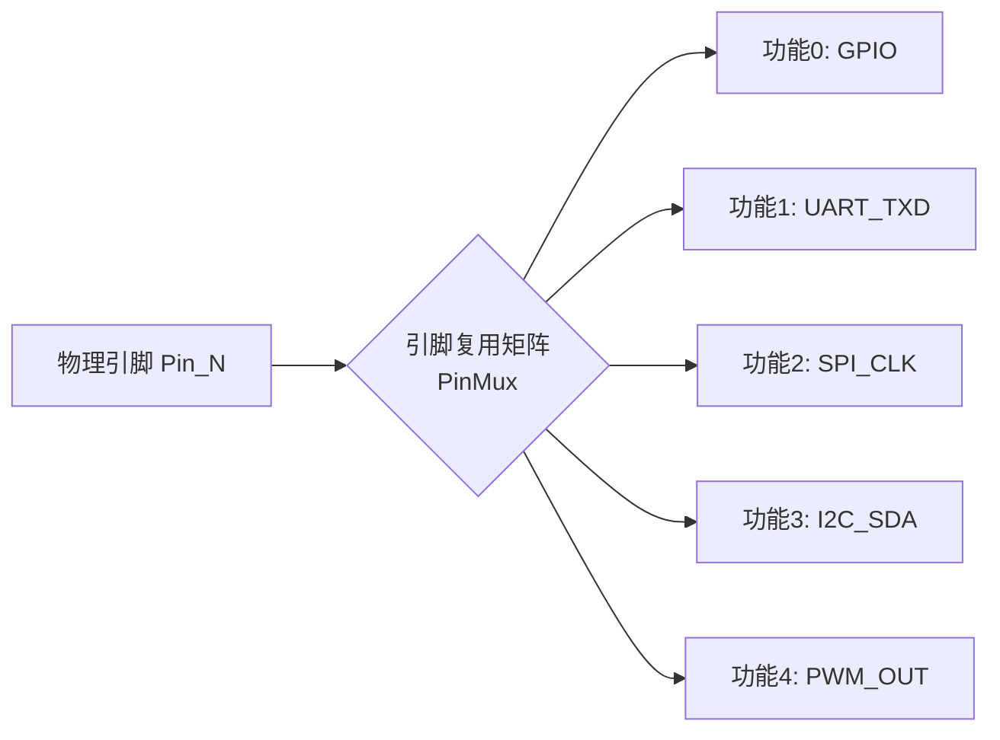
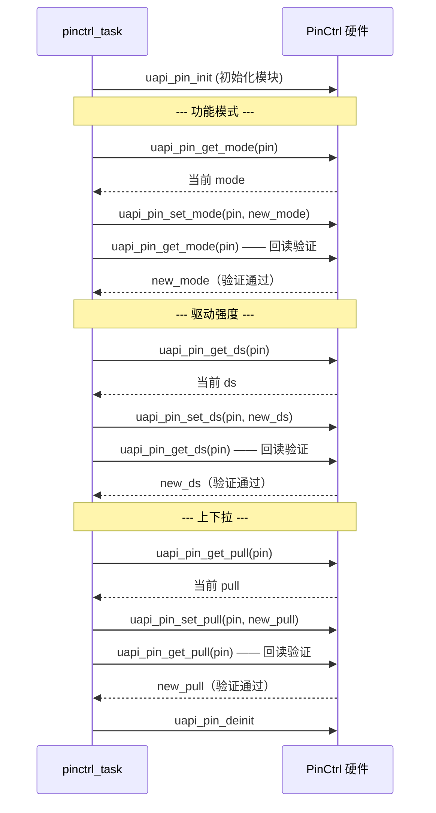
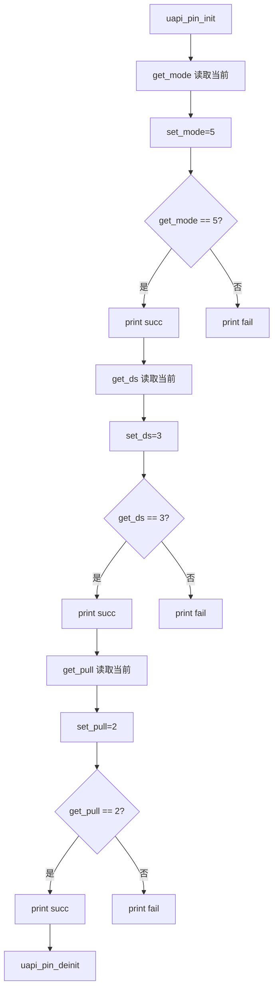

# Pinctrl

> PinCtrl (Pin Control) 驱动 | sample: `src/application/samples/peripheral/pinctrl/pinctrl_demo.c`

## 学习目标

- 理解引脚复用概念——同一物理引脚可动态切换为 GPIO (General Purpose Input/Output)、UART (Universal Asynchronous Receiver/Transmitter)、SPI (Serial Peripheral Interface)、I2C (Inter-Integrated Circuit) 等不同功能
- 掌握引脚属性三要素的配置：功能模式（mode）、驱动强度（drive-strength）、上下拉（pull）
- 掌握 `get → set → 回读验证` 的标准操作模式，确保配置生效

## 基本概念

### 为什么需要引脚复用

芯片的物理引脚数量远远少于内部功能模块的数量——WS53 有数十个外设（UART×3、SPI×2、I2C×2、GPIO×N 等），但封装引脚只有几十个。通过引脚复用矩阵（PinMux (Pin Multiplexing)），一个物理引脚可以根据软件配置连接到不同的内部功能模块：



### 引脚属性三要素

每个引脚除了功能模式，还有两个影响电气特性的属性：

| 属性 | API | 说明 | sample 取值 |
|------|-----|------|---|
| `mode`（功能模式） | `uapi_pin_set_mode` / `uapi_pin_get_mode` | 选择引脚连接到的功能模块 | 5 |
| `ds`（驱动强度） | `uapi_pin_set_ds` / `uapi_pin_get_ds` | 引脚输出电流能力，影响信号边沿速率和 EMI | 3 |
| `pull`（上下拉） | `uapi_pin_set_pull` / `uapi_pin_get_pull` | 未驱动时的默认电平——上拉/下拉/浮空 | 2 |

> **驱动强度选择**：数字越大驱动电流越强。高速信号（SPI CLK > 10MHz）需要高驱动强度以保证信号完整性；低速信号（I2C、UART）用低驱动强度以减少功耗和 EMI。

### 配置流程



## 涉及 API

| API | 用途 | 头文件 |
|-----|------|--------|
| `uapi_pin_init()` | 初始化引脚控制模块 | `pinctrl.h` |
| `uapi_pin_deinit()` | 反初始化引脚控制模块 | `pinctrl.h` |
| `uapi_pin_set_mode(pin, mode)` | 设置引脚功能模式 | `pinctrl.h` |
| `uapi_pin_get_mode(pin)` | 查询引脚当前功能模式 | `pinctrl.h` |
| `uapi_pin_set_ds(pin, ds)` | 设置引脚驱动强度 | `pinctrl.h` |
| `uapi_pin_get_ds(pin)` | 查询引脚当前驱动强度 | `pinctrl.h` |
| `uapi_pin_set_pull(pin, pull)` | 设置引脚上下拉 | `pinctrl.h` |
| `uapi_pin_get_pull(pin)` | 查询引脚当前上下拉状态 | `pinctrl.h` |

## 案例说明

### 案例简介

对 `CONFIG_PINCTRL_USE_PIN` 指定的引脚，依次配置并验证三项属性：
1. 功能模式（mode）：读取 → 设置为值 5 → 回读验证
2. 驱动强度（ds）：读取 → 设置为值 3 → 回读验证
3. 上下拉（pull）：读取 → 设置为值 2 → 回读验证

每次设置后立即回读——如果回读值与写入值一致，则配置成功。

### 功能规格

| 规格项 | 说明 |
|--------|------|
| 操作引脚 | `CONFIG_PINCTRL_USE_PIN`（Kconfig 可配） |
| 测试 mode | 5 |
| 测试 ds | 3 |
| 测试 pull | 2 |
| 验证方式 | `set` → `get` 回读对比 |

### 案例流程



## 案例操作指导

1. 在 `menuconfig` 中选择要测试的引脚（`CONFIG_PINCTRL_USE_PIN`），确保该引脚未被其他外设占用
2. 编译：
   ```bash
   fbb build ws53-liteos-app
   ```
3. 烧录固件，串口观察输出：
   - `start get pin<N> mode!` → `the mode of pin<N> is X.`
   - `start set pin<N> mode<5>!` → `set pin<N> mode<5> succ.`
   - `start get pin<N> driver-strength!` → `set pin<N> driver-strength<3> succ.`
   - `start get pin<N> pull/down status!` → `set pin<N> pull/down status<2> succ.`
4. 三项属性全部 `succ` 即验证通过

## 关键配置

| 配置项 | 推荐值 | 说明 |
|--------|---|------|
| `mode` 切换前 | 先 `deinit` 原外设 | 切换引脚功能前确保原外设已停用——否则新旧功能可能同时驱动引脚导致电平冲突 |
| `pull` 值 | 依外设需求 | UART RX (Receive) 用上拉（防悬空误触发）；I2C 用上拉（开漏输出需要）；GPIO 输出用浮空 |
| `ds` 值 | 3（中等等级） | 低速信号 1~3，高速信号 4~7。驱动强度越高功耗越大、EMI 越高 |
| 回读验证 | 必须 | 引脚配置寄存器可能受硬件限制只读部分位——必须回读确认实际生效的值 |

> **Trade-off**：高驱动强度 = 更快的信号边沿 + 更好的信号完整性，但代价是更高的动态功耗和更强的电磁辐射。在 EMI 敏感场景（如射频附近），应使用最低可接受的驱动强度。

## 代码详解

### 1. 初始化和功能模式配置

`uapi_pin_init()` 初始化引脚控制模块。每个属性的操作遵循相同模式：`get`（读当前值）→ `set`（写新值）→ `get`（回读验证）：

```c
pin_t pin = CONFIG_PINCTRL_USE_PIN;
pin_mode_t mode;

uapi_pin_init();

/* 功能模式：读取 → 设置 → 回读验证 */
osal_printk("start get pin<%d> mode!\r\n", pin);
mode = uapi_pin_get_mode(pin);
osal_printk("the mode of pin<%d> is %d.\r\n", pin, mode);

mode = PINCTRL_PIN_MODE;  /* 5 */
osal_printk("start set pin<%d> mode<%d>!\r\n", pin, mode);
if (uapi_pin_set_mode(pin, mode) == ERRCODE_SUCC &&
    uapi_pin_get_mode(pin) == mode) {
    osal_printk("set pin<%d> mode<%d> succ.\r\n", pin, mode);
}
```

### 2. 驱动强度配置

```c
pin_drive_strength_t ds;

osal_printk("start get pin<%d> driver-strength!\r\n", pin);
ds = uapi_pin_get_ds(pin);
osal_printk("The driver-strength of pin<%d> is %d.\r\n", pin, ds);

ds = PINCTRL_PIN_DS;  /* 3 */
osal_printk("start set pin<%d> driver-strength<%d>!\r\n", pin, ds);
if (uapi_pin_set_ds(pin, ds) == ERRCODE_SUCC &&
    uapi_pin_get_ds(pin) == ds) {
    osal_printk("set pin<%d> driver-strength<%d> succ.\r\n", pin, ds);
}
```

### 3. 上下拉配置

```c
pin_pull_t pull;

osal_printk("start get pin<%d> pull/down status!\r\n", pin);
pull = uapi_pin_get_pull(pin);
osal_printk("The pull/down status of pin<%d> is %d.\r\n", pin, pull);

pull = PINCTRL_PIN_PULL;  /* 2 */
osal_printk("start set pin<%d> pull/down status<%d>!\r\n", pin, pull);
if (uapi_pin_set_pull(pin, pull) == ERRCODE_SUCC &&
    uapi_pin_get_pull(pin) == pull) {
    osal_printk("set pin<%d> pull/down status<%d> succ.\r\n", pin, pull);
}
```

### 4. 反初始化

```c
uapi_pin_deinit();
```

> `uapi_pin_deinit()` 释放引脚控制模块的资源。在 Sample 中仅作演示——实际项目中如果后续还要使用其他引脚功能，不应过早 deinit。

---
