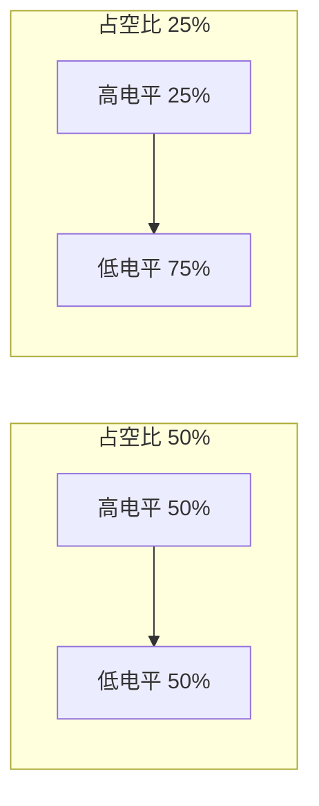
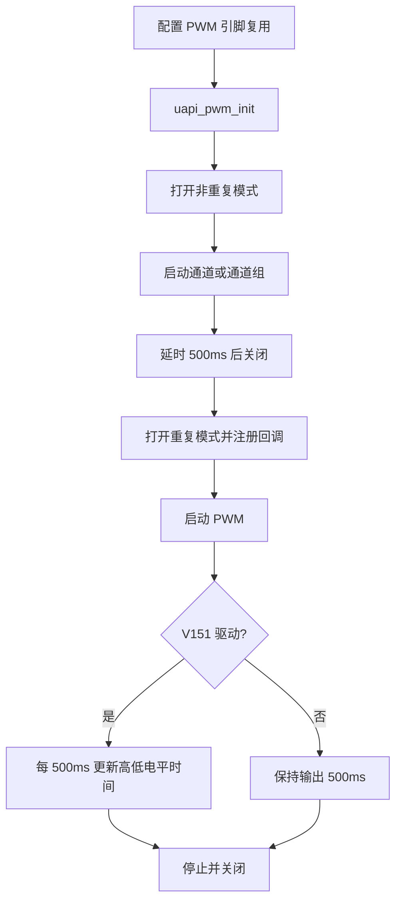

# PWM

> PWM (Pulse Width Modulation) 驱动 | sample: `src/application/samples/peripheral/pwm/pwm_demo.c`

!!! info "与 WS63 参考案例的关系"

    WS53 与 WS63 的主 `pwm_demo.c` 流程基本一致，均包含非重复输出、重复输出和 V151 动态配置更新。本页使用 WS53 的默认通道 0、引脚 47，并按完整源码流程说明。WS63 额外提供的 PWM Preload Sample 当前不在 WS53 源码中。

## 学习目标

- 掌握 PWM 高、低电平时间与周期、占空比之间的关系
- 理解 `pwm_config_t` 中高低电平时间、偏移、周期数和重复模式的作用
- 能够在 WS53 上启动 PWM、注册 PWM 完成中断回调并动态调整占空比

## 基本概念

### PWM 做什么

PWM 通过周期性切换高低电平，并调整高电平在一个周期中的占比来控制平均输出功率。常见用途包括 LED 调光、电机调速、蜂鸣器和舵机控制。



| 占空比 | 平均电压（VCC=3.3V） | LED 效果 |
|---|---|------|
| 100% | 3.3V | 最亮 |
| 50% | 1.65V | 半亮 |
| 25% | 0.825V | 较暗 |
| 0% | 0V | 熄灭 |

### 周期、频率和占空比

- 周期由 `high_time + low_time` 决定。
- PWM 频率等于 PWM 时钟除以一个周期的总计数值。
- 占空比等于 `high_time / (high_time + low_time)`。

### 单次与重复模式

| 模式 | `repeat` 字段 | 行为 | 适用场景 |
|------|---|------|------|
| 非重复模式 | `false` | 按配置输出指定周期后停止 | 精确脉冲、一次性控制 |
| 重复模式 | `true` | 持续输出，并可在运行中更新配置 | LED 调光、电机调速 |

`cycles` 和 `repeat` 是两个独立字段：`cycles` 表示硬件周期计数，范围为 0～32767；`repeat` 是是否连续输出的布尔标志。案例中的 `0xFF` 赋给 `cycles`，不是“无限循环”的标志。

## 涉及 API

| API | 用途 | 头文件 |
|-----|------|--------|
| `uapi_pin_set_mode(pin, mode)` | 将目标引脚复用为 PWM 功能 | `pinctrl.h` |
| `uapi_pwm_init()` | 初始化 PWM 模块 | `pwm.h` |
| `uapi_pwm_open(channel, &config)` | 打开并配置 PWM 通道 | `pwm.h` |
| `uapi_pwm_register_interrupt(channel, callback)` | 注册 PWM 完成中断回调 | `pwm.h` |
| `uapi_pwm_start(channel)` | 启动单个 PWM 通道 | `pwm.h` |
| `uapi_pwm_set_group()` / `uapi_pwm_start_group()` | 配置并启动 PWM 通道组 | `pwm.h` |
| `uapi_pwm_update_cfg(channel, &config)` | 运行中更新 PWM 配置 | `pwm.h` |
| `uapi_pwm_close(channel)` | 关闭 PWM 通道 | `pwm.h` |
| `uapi_pwm_deinit()` | 去初始化 PWM | `pwm.h` |

## 案例说明

### 案例简介

案例先以非重复模式输出高、低电平各 100 个时钟计数的波形，启动 500ms 后关闭；随后进入重复模式，高电平初始为 20、低电平初始为 0，并注册 PWM 完成中断回调。使用 V151 驱动时，案例逐步增加低电平时间、减少高电平时间，以演示动态占空比变化。

### 功能规格

| 规格项 | 说明 |
|--------|------|
| PWM 通道 | `CONFIG_PWM_CHANNEL`，默认 0 |
| PWM 引脚 | `CONFIG_PWM_PIN`，默认 47 |
| 非重复模式 | `low_time=100`、`high_time=100`、`repeat=false` |
| 重复模式 | `low_time=0`、`high_time=20`、`repeat=true` |
| 配置更新间隔 | 500ms |
| 回调 | PWM 完成中断触发时累计 `g_pwm_cyc_done_cnt` |

### 案例流程



## 案例操作指导

### 第一步：配置案例

启用 `ENABLE_PERIPHERAL_SAMPLE` 和 `SAMPLE_SUPPORT_PWM`，根据开发板原理图确认 `PWM_CHANNEL`、`PWM_PIN` 和 `PWM_PIN_MODE`。使用 V151 驱动时还需确认 `PWM_GROUP_ID`。

### 第二步：编译和烧录

```bash
fbb build ws53-liteos-app
fbb flash ws53-liteos-app
```

> 完整的工程配置、编译和烧录方式请参考 [快速入门](../../../get-started/quick-start.md)。

### 第三步：验证

使用示波器或逻辑分析仪测量 PWM 引脚。应先看到占空比约为 50% 的非重复模式波形，随后看到重复模式波形；V151 驱动下占空比会按 500ms 间隔逐步变化，串口同时打印 PWM 完成中断累计计数和当前占空比。

## 关键配置

| 配置项 | 默认值 | 说明 |
|--------|---|------|
| `CONFIG_PWM_CHANNEL` | 0 | PWM 通道编号 |
| `CONFIG_PWM_GROUP_ID` | 0 | V151 驱动使用的通道组编号 |
| `CONFIG_PWM_PIN` | 47 | PWM 输出引脚 |
| `CONFIG_PWM_PIN_MODE` | 1 | 引脚复用模式 |
| `TEST_TCXO_DELAY_500MS` | 500ms | 两次配置更新之间的延时 |
| `PWM_HIGH_TIME_CYC` | 20 | 重复模式初始高电平时间 |
| `PWM_LOW_TIME_CYC` | 0 | 重复模式初始低电平时间 |

> PWM 实际频率取决于底层 PWM 时钟。连接 LED、电机或舵机前，应同时确认输出频率、电平和外部驱动能力，不能直接用 IO 引脚驱动大电流负载。

## 代码详解

### 1. PWM 完成中断回调

回调由 PWM 完成中断触发，触发节奏受 `cycles` 配置和底层驱动行为影响，不应理解为每个高低电平波形周期都进入一次回调。

```c
static uint32_t g_pwm_cyc_done_cnt = 0;

static errcode_t pwm_sample_callback(uint8_t channel)
{
    unused(channel);
    g_pwm_cyc_done_cnt++;
    return ERRCODE_SUCC;
}
```

### 2. 非重复模式

```c
pwm_config_t cfg_no_repeat = {
    100,   /* low_time */
    100,   /* high_time */
    0,     /* offset */
    0xFF,  /* cycles */
    false  /* 非重复模式 */
};

uapi_pin_set_mode(CONFIG_PWM_PIN, CONFIG_PWM_PIN_MODE);
uapi_pwm_init();
uapi_pwm_open(CONFIG_PWM_CHANNEL, &cfg_no_repeat);
uapi_pwm_register_interrupt(CONFIG_PWM_CHANNEL, pwm_sample_callback);

#ifdef CONFIG_PWM_USING_V151
uint8_t channel_id = CONFIG_PWM_CHANNEL;
uapi_pwm_set_group(CONFIG_PWM_GROUP_ID, &channel_id, 1);
uapi_pwm_start_group(CONFIG_PWM_GROUP_ID);
#else
uapi_pwm_start(CONFIG_PWM_CHANNEL);
#endif

uapi_tcxo_delay_ms(TEST_TCXO_DELAY_500MS);
uapi_pwm_close(CONFIG_PWM_CHANNEL);
uapi_pwm_deinit();
```

### 3. 重复模式与动态更新

```c
pwm_config_t cfg_repeat = {
    PWM_LOW_TIME_CYC,
    PWM_HIGH_TIME_CYC,
    0,
    0xFF,
    true
};

uapi_pwm_init();
uapi_pwm_open(CONFIG_PWM_CHANNEL, &cfg_repeat);
uapi_pwm_register_interrupt(CONFIG_PWM_CHANNEL, pwm_sample_callback);

#ifdef CONFIG_PWM_USING_V151
uint8_t channel_id = CONFIG_PWM_CHANNEL;
uapi_pwm_set_group(CONFIG_PWM_GROUP_ID, &channel_id, 1);
uapi_pwm_start_group(CONFIG_PWM_GROUP_ID);

while (cfg_repeat.low_time <= PWM_HIGH_TIME_CYC) {
    uapi_pwm_update_cfg(CONFIG_PWM_CHANNEL, &cfg_repeat);
    uapi_tcxo_delay_ms(TEST_TCXO_DELAY_500MS);
    cfg_repeat.low_time++;
    cfg_repeat.high_time--;
}
uapi_pwm_stop_group(CONFIG_PWM_GROUP_ID);
#else
uapi_pwm_start(CONFIG_PWM_CHANNEL);
#endif
```

在 V151 分支中，高电平时间从 20 逐步减小到 0，低电平时间从 0 逐步增加到 20，因此总周期保持为 20，而占空比逐步下降。

---
