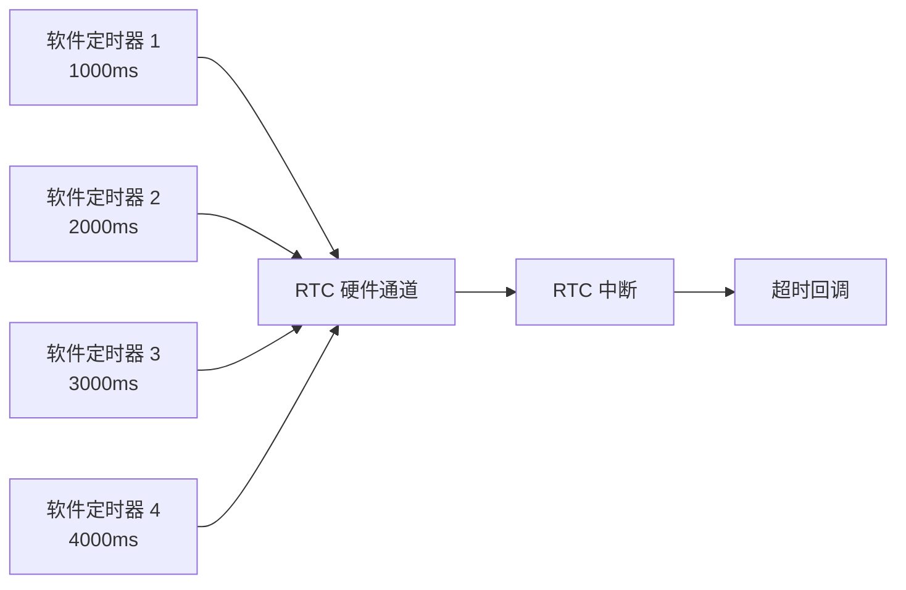
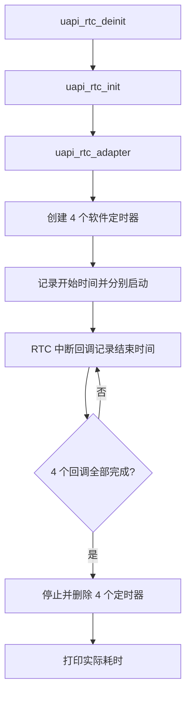

# RTC 软件定时器

> RTC (Real-Time Clock) 驱动 | sample: `src/application/samples/peripheral/rtc/rtc_demo.c`

## 学习目标

- 使用 `uapi_rtc_init()` 初始化 RTC 驱动
- 使用 `uapi_rtc_adapter()` 适配 RTC 硬件通道和中断
- 使用 `uapi_rtc_create()` 创建多个 RTC 软件定时器
- 使用 `uapi_rtc_start()` 启动一次性定时并接收超时回调
- 使用 `uapi_rtc_stop()`、`uapi_rtc_delete()` 和 `uapi_rtc_deinit()` 管理资源

## 基本概念

### RTC 硬件与软件定时器

RTC 提供低功耗、长时间运行的硬件计时能力。驱动在指定 RTC 硬件通道之上创建软件定时器句柄，使多个一次性定时任务可以复用同一硬件计时资源。



### 回调上下文

RTC 超时回调运行在中断上下文中，应只执行记录时间、更新标志等短操作，不能阻塞或进行复杂处理。本案例在回调中记录 TCXO 时间戳并增加完成计数，日志输出和资源回收由任务完成。

## 涉及 API

| API | 用途 | 头文件 |
|-----|------|--------|
| `uapi_rtc_init()` | 初始化 RTC 驱动 | `rtc.h` |
| `uapi_rtc_adapter(index, irq, priority)` | 适配 RTC 通道、中断号和优先级 | `rtc.h` |
| `uapi_rtc_create(index, &handle)` | 创建 RTC 软件定时器并返回句柄 | `rtc.h` |
| `uapi_rtc_start(handle, ms, callback, data)` | 启动一次性定时器 | `rtc.h` |
| `uapi_rtc_stop(handle)` | 停止 RTC 软件定时器 | `rtc.h` |
| `uapi_rtc_delete(handle)` | 删除 RTC 软件定时器 | `rtc.h` |
| `uapi_rtc_deinit()` | 去初始化 RTC 驱动 | `rtc.h` |

## 案例说明

### 案例简介

案例初始化并适配 RTC0，然后创建 4 个软件定时器，超时时间依次为 1000ms、2000ms、3000ms 和 4000ms。所有回调执行完成后，任务停止并删除定时器，打印每个定时器的实际耗时。

### 功能规格

| 规格项 | 说明 |
|--------|------|
| RTC 通道 | `CONFIG_RTC_INDEX`，默认 0 |
| 中断号 | `CONFIG_RTC_IRQN`，默认 49 |
| 中断优先级 | `CONFIG_RTC_PRIO`，默认 1 |
| 软件定时器数量 | 4 |
| 超时时间 | 1000ms、2000ms、3000ms、4000ms |
| 时间测量 | 使用 `uapi_tcxo_get_ms()` 记录开始和结束时间 |

### 案例流程



## 案例操作指导

### 第一步：配置案例

启用 `ENABLE_PERIPHERAL_SAMPLE` 和 `SAMPLE_SUPPORT_RTC`。一般保持 `RTC_INDEX=0`、`RTC_IRQN=49` 和 `RTC_PRIO=1`；只有在板级中断分配发生变化时才修改。

### 第二步：编译和烧录

```bash
fbb build ws53_liteos_app
fbb flash ws53_liteos_app
```

> 完整的工程配置、编译、烧录和串口监视方式请参考 [命令行配置与构建](../../../guides/sdk-development/build/index.md)和[烧录与运行验证](../../../guides/sdk-development/flash-and-run/index.md)。

### 第三步：验证

4 个定时器全部到期后，串口输出类似：

```text
real time[0] = 1000ms  delay = 1000ms
real time[1] = 2000ms  delay = 2000ms
real time[2] = 3000ms  delay = 3000ms
real time[3] = 4000ms  delay = 4000ms
```

实际时间可能有少量调度和中断延迟，但应接近配置值，并保持超时顺序一致。

## 关键配置

| 配置项 | 默认值 | 说明 |
|--------|---|------|
| `CONFIG_RTC_INDEX` | 0 | RTC 硬件通道编号 |
| `CONFIG_RTC_IRQN` | 49 | RTC 中断号 |
| `CONFIG_RTC_PRIO` | 1 | RTC 中断优先级 |
| `RTC_TIMERS_NUM` | 4 | 同时创建的软件定时器数量 |
| `RTC1_DELAY_1000MS` | 1000 | 第一个定时器超时值 |
| `RTC2_DELAY_2000MS` | 2000 | 第二个定时器超时值 |
| `RTC3_DELAY_3000MS` | 3000 | 第三个定时器超时值 |
| `RTC4_DELAY_4000MS` | 4000 | 第四个定时器超时值 |

## 代码详解

### 1. 超时回调

回调参数携带软件定时器序号，用于将结束时间写入对应记录：

```c
static void rtc_timeout_callback(uintptr_t data)
{
    uint32_t rtc_index = (uint32_t)data;
    g_rtcs_info[rtc_index].end_time = uapi_tcxo_get_ms();
    g_rtc_int_count++;
}
```

### 2. 初始化并启动多个定时器

```c
rtc_handle_t rtc_index[RTC_TIMERS_NUM] = { 0 };

uapi_rtc_deinit();
uapi_rtc_init();
uapi_rtc_adapter(CONFIG_RTC_INDEX, CONFIG_RTC_IRQN, CONFIG_RTC_PRIO);

for (uint32_t i = 0; i < RTC_TIMERS_NUM; i++) {
    uapi_rtc_create(CONFIG_RTC_INDEX, &rtc_index[i]);
    g_rtcs_info[i].start_time = uapi_tcxo_get_ms();
    uapi_rtc_start(rtc_index[i], g_rtcs_info[i].delay_time,
        rtc_timeout_callback, i);
}
```

### 3. 等待完成并释放资源

```c
while (g_rtc_int_count < RTC_TIMERS_NUM) {
    osal_msleep(1);
}

for (uint32_t i = 0; i < RTC_TIMERS_NUM; i++) {
    uapi_rtc_stop(rtc_index[i]);
    uapi_rtc_delete(rtc_index[i]);
    osal_printk("real time[%d] = %dms  delay = %dms\r\n", i,
        g_rtcs_info[i].end_time - g_rtcs_info[i].start_time,
        g_rtcs_info[i].delay_time);
}
```

当前 Sample 在开始时调用一次 `uapi_rtc_deinit()` 清理已有状态，但结束前没有再次反初始化。源码没有说明省略结束反初始化的原因；应用在确认所有句柄已删除且不再使用 RTC 后，可以按自身资源生命周期调用 `uapi_rtc_deinit()`。

---
