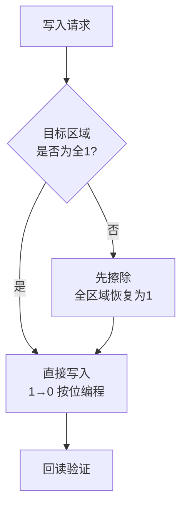
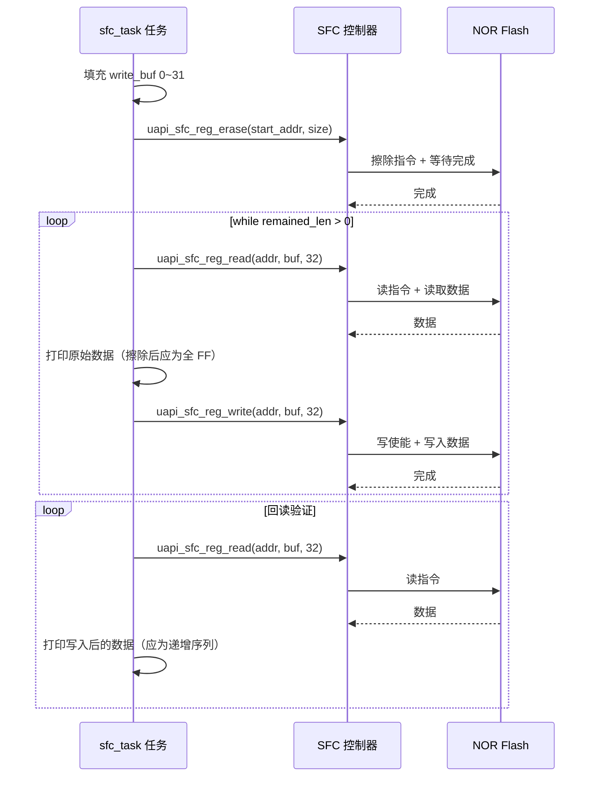

# SFC

> SFC (Serial Flash Controller) 驱动 | sample: `src/application/samples/peripheral/sfc/sfc_demo.c` | 前置：[SPI (Serial Peripheral Interface)](../spi/spi.md)

## 学习目标

- 理解 NOR Flash 的 Erase-Before-Write 特性——bit 只能从 1 变 0，擦除将整块恢复为全 1
- 掌握 SFC 控制器的初始化、寄存器接口读写（`uapi_sfc_reg_read/write`）及区域擦除（`uapi_sfc_reg_erase`）
- 理解 QSPI (Quad Serial Peripheral Interface) 四线模式相比标准 SPI 的带宽差异，以及擦除粒度的选择策略

## 基本概念

### NOR Flash 为什么必须先擦除再写入

NOR Flash 存储单元的物理特性决定了每个 bit 只能被编程为 0（写操作），不能从 0 恢复为 1。要将某个区域恢复为全 1，必须执行擦除操作——擦除以扇区/块/全片为单位，将该区域内所有 bit 同时恢复为 1。这种机制被称为 **Erase-Before-Write**：



### 擦除粒度

NOR Flash 通常提供扇区、块或全片等不同擦除粒度，但具体大小、对齐要求、支持的指令和耗时取决于实际 Flash 器件及驱动配置。使用前应查阅目标器件手册，不能把通用的 4KB、64KB 或典型耗时直接当作 WS53 当前硬件的固定参数。

### QSPI 四线 vs 标准 SPI

| 对比项 | 标准 SPI | QSPI |
|--------|---|---|
| 数据线数量 | 2（MOSI (Master Out Slave In) + MISO (Master In Slave Out)，全双工各1） | 4（IO0~IO3，半双工复用） |
| 指令/地址/数据模式 | 1-1-1 | 1-1-4 / 1-4-4 |
| 读取带宽 | ~12.5 MB/s @ 100MHz | ~50 MB/s @ 100MHz |
| 引脚占用 | 4（CS (Carrier Synchronization)+CLK+MOSI+MISO） | 6（CS+CLK+IO0~3） |

## 涉及 API

| API | 用途 | 头文件 |
|-----|------|--------|
| `uapi_sfc_reg_read(addr, buf, len)` | 从 Flash 寄存器接口读取数据 | `sfc.h` |
| `uapi_sfc_reg_write(addr, buf, len)` | 通过寄存器接口写入 Flash（须先擦除） | `sfc.h` |
| `uapi_sfc_reg_erase(addr, size)` | 擦除 Flash 指定区域 | `sfc.h` |

> Sample 中使用的是 SFC 寄存器接口（`sfc_reg_*`），而非更高层的 `sfc_*` API。两者区别：`sfc_reg_*` 直接操作 SFC 控制寄存器，提供更细粒度的控制；高层 API 内部封装了指令编码和等待逻辑。

## 案例说明

### 案例简介

在 Flash 客户预留区中执行擦除 → 写入 → 回读观察的流程。测试数据为 0~31 的递增序列，擦除范围由 `CONFIG_SFC_SAMPLE_USER_ADDR` 和 `CONFIG_SFC_SAMPLE_USER_SIZE` 指定，每次操作 32 字节。

### 功能规格

| 规格项 | 说明 |
|--------|------|
| Flash 接口 | QSPI 四线模式（SFC 控制器自动管理） |
| 操作模式 | `uapi_sfc_reg_*` 寄存器接口 |
| 默认测试区域 | 客户预留区 `rsv0 for customer` 的前 4KB：`0x003F3000`～`0x003F3FFF` |
| 擦除范围 | `CONFIG_SFC_SAMPLE_USER_ADDR` 起始、长度为 `CONFIG_SFC_SAMPLE_USER_SIZE`；必须满足实际 Flash 器件的擦除对齐要求 |
| 操作粒度 | 每次 32 字节（`SFC_PRINT_BUFF_LEN`） |
| 验证方式 | 写入后回读，逐字节打印对比 |

### 案例流程



## 案例操作指导

1. 检查 `CONFIG_SFC_SAMPLE_USER_ADDR` 和 `CONFIG_SFC_SAMPLE_USER_SIZE`。默认会擦除 `0x003F3000`～`0x003F3FFF`，即客户预留区前 4KB；确认其中没有有效数据并完成必要备份
2. 编译：
   ```bash
   fbb build ws53-liteos-app
   ```
3. 烧录固件，串口观察输出：
   - `Erasing for API sample...` → 擦除中
   - `Start API read sample...` → 开始读写验证
   - 第一轮打印：擦除后原始数据（应为 FF FF FF ...）
   - 第二轮打印：写入验证数据 00 01 02 03 ... 1E 1F（应为写入的值）
4. 对比两轮输出：第一轮全 FF，第二轮为递增序列即验证通过

## 关键配置

| 配置项 | 推荐值 | 说明 |
|--------|---|------|
| 擦除地址和长度 | 按实际 Flash 器件要求对齐 | 地址或长度不满足擦除粒度时可能擦除失败，或影响超出预期的范围 |
| 测试区域 | 明确确认可擦除 | 默认位于客户预留区，不等同于可随意覆盖；不得覆盖固件、启动、参数或仍在使用的数据区域 |
| 写入粒度 | 按实际器件页编程限制 | 当前 Sample 每次写 32 字节；其他长度需结合器件手册和驱动能力确认 |
| 擦除等待 | 轮询或回调 | `uapi_sfc_reg_erase` 内部等待擦除完成，不要在此期间操作同一 Flash |

> **Trade-off**：更大的擦除粒度会扩大数据影响范围；频繁擦写还会消耗 Flash 寿命。实际设计应依据所用器件的擦除粒度、寿命指标和耗时，并在应用层评估磨损均衡与掉电保护。

## 代码详解

### 1. 全局变量与测试数据准备

```c
#define SFC_SAMPLE_LEN                  0x80000
#define SFC_PRINT_BUFF_LEN              32
uint8_t g_print_data_buff[SFC_PRINT_BUFF_LEN] = {0};   /* 读出缓冲区 */
uint8_t g_write_data_buff[SFC_PRINT_BUFF_LEN] = {0};   /* 写入数据源 */

/* sfc_task 开头填充写入数据为 0~31 递增序列 */
for (uint8_t i = 0; i < SFC_PRINT_BUFF_LEN; i++) {
    g_write_data_buff[i] = i;
}
```

### 2. 擦除用户区域

擦除操作必须最先执行——如果区域已有旧数据，直接写入会因 bit 无法 0→1 而失败：

```c
errcode_t ret = uapi_sfc_reg_erase(CONFIG_SFC_SAMPLE_USER_ADDR,
                                    CONFIG_SFC_SAMPLE_USER_SIZE);
if (ret != ERRCODE_SUCC) {
    osal_printk("flash erase failed! ret = %x\r\n", ret);
    return NULL;
}
```

### 3. 读取原始数据并写入新数据

遍历整个测试区域，每次操作 32 字节。先读取并打印擦除后的原始状态（应为全 0xFF），再写入测试数据：

```c
static void sfc_sample_start_api_test(void)
{
    uint32_t remained_len = CONFIG_SFC_SAMPLE_USER_SIZE;
    uint32_t start_addr = CONFIG_SFC_SAMPLE_USER_ADDR;

    /* 第一轮：读取原始数据并写入测试数据 */
    while (remained_len > 0) {
        uint32_t cur_len = remained_len > SFC_PRINT_BUFF_LEN ?
                           SFC_PRINT_BUFF_LEN : remained_len;

        uapi_sfc_reg_read(start_addr, g_print_data_buff, cur_len);
        for (uint8_t i = 0; i < cur_len; i++) {
            osal_printk("%02x ", g_print_data_buff[i]);   /* 打印原始数据 */
        }

        uapi_sfc_reg_write(start_addr, g_write_data_buff, cur_len);

        start_addr += cur_len;
        remained_len -= cur_len;
        osal_printk("\r\n");
    }
```

### 4. 回读验证

重新从头读取，验证写入是否正确：

```c
    /* 第二轮：回读验证写入的数据 */
    start_addr = CONFIG_SFC_SAMPLE_USER_ADDR;
    remained_len = CONFIG_SFC_SAMPLE_USER_SIZE;
    while (remained_len > 0) {
        uint32_t cur_len = remained_len > SFC_PRINT_BUFF_LEN ?
                           SFC_PRINT_BUFF_LEN : remained_len;

        uapi_sfc_reg_read(start_addr, g_print_data_buff, cur_len);
        for (uint8_t i = 0; i < cur_len; i++) {
            osal_printk("%02x ", g_print_data_buff[i]);   /* 打印回读数据 */
        }

        start_addr += cur_len;
        remained_len -= cur_len;
        osal_printk("\r\n");
    }
}
```

> 本 Sample 通过串口打印两轮数据进行人工对比。在量产代码中，应使用 `memcmp()` 自动验证并在写入前检查 Flash 忙状态。

---
