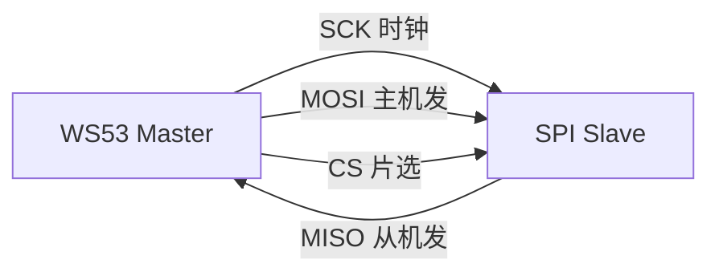
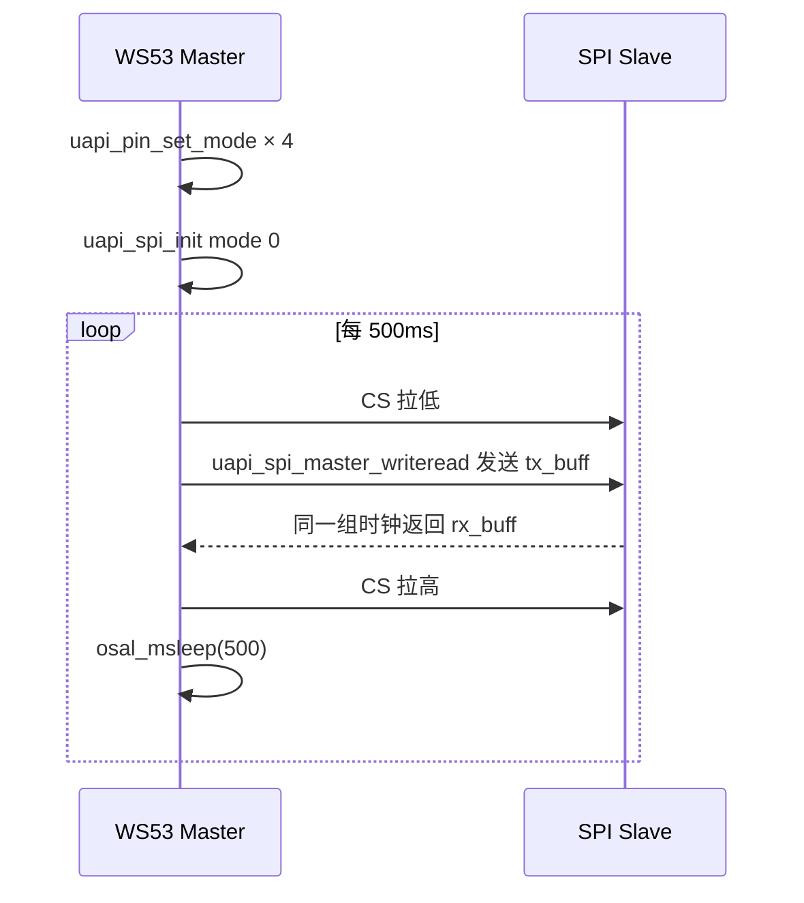

# SPI

> SPI (Serial Peripheral Interface) 驱动 | sample: spi

## 学习目标

- 理解 SPI 四线制总线（SCK/MOSI/MISO/CS）和全双工特性
- 掌握 SPI 主机和从机的初始化、收发 API 及 Kconfig 选择方式
- 理解 CPOL/CPHA 四种模式的区别和选择依据

## 基本概念

### SPI 总线简介

SPI是 Motorola 发明的四线制同步串行总线——有时钟线，无需约定波特率，速度远超 UART (Universal Asynchronous Receiver/Transmitter)。



| 信号 | 方向 | 说明 |
|------|---|------|
| SCK (Serial Clock) | Master→Slave | 时钟信号 |
| MOSI (Master Out Slave In) | Master→Slave | 主机发从机收 |
| MISO (Master In Slave Out) | Slave→Master | 从机发主机收 |
| CS/SS | Master→Slave | 片选——低电平选中从机 |

### CPOL 和 CPHA —— 四种模式

| 模式 | CPOL | CPHA | SCK 空闲电平 | 采样边沿 |
|---|---|---|---|---|
| 0 | 0 | 0 | 低 | 上升沿 |
| 1 | 0 | 1 | 低 | 下降沿 |
| 2 | 1 | 0 | 高 | 下降沿 |
| 3 | 1 | 1 | 高 | 上升沿 |

> 大多数 SPI 设备工作在模式 0 或模式 3。具体用哪个看设备数据手册的时序图。

### SPI vs I2C vs UART

| 对比项 | SPI | I2C (Inter-Integrated Circuit) | UART |
|--------|---|---|---|
| 线数 | 4（多从机时通常各自使用 CS，Chip Select） | 2 | 3（TX/RX/GND） |
| 速率 | 由主从设备、布线和驱动配置决定 | 由模式和设备决定 | 由双方波特率配置决定 |
| 全双工 | 是 | 否 | 是 |
| 一主多从 | CS 片选 | 地址寻址 | 不支持 |

## 涉及 API

| API | 用途 | 头文件 |
|-----|------|--------|
| `uapi_pin_set_mode(pin, mode)` | 设置 SCK/MOSI/MISO/CS 引脚为 SPI 功能 | `pinctrl.h` |
| `uapi_spi_init(bus, &attr, &extra_attr)` | 初始化 SPI 总线 | `spi.h` |
| `uapi_spi_master_write(bus, &data, timeout)` | 主机写数据 | `spi.h` |
| `uapi_spi_master_read(bus, &data, timeout)` | 主机读数据 | `spi.h` |
| `uapi_spi_master_writeread(bus, &data, timeout)` | 主机全双工收发 | `spi.h` |
| `uapi_spi_slave_write/read/writeread(...)` | 从机发送、接收或全双工收发 | `spi.h` |
| `uapi_spi_deinit(bus)` | 去初始化 SPI | `spi.h` |

## 案例说明

### 案例简介

目录中同时提供 SPI 主机和从机 Sample，CMake 使用 `if/elseif` 选择其中一个：

- `CONFIG_SAMPLE_SUPPORT_SPI_MASTER`：以模式 0、2MHz 初始化主机。`CONFIG_SPI_MASTER_SUPPORT_WRITEREAD` 默认开启，因此默认调用 `uapi_spi_master_writeread()`。
- `CONFIG_SAMPLE_SUPPORT_SPI_SLAVE`：以相同模式和帧配置初始化从机。默认关闭 `CONFIG_SPI_SLAVE_SUPPORT_WRITEREAD`，因此默认先 `slave_write`，再 `slave_read`。

### 功能规格

| 规格项 | 说明 |
|--------|------|
| 主机端口 | `CONFIG_SPI_MASTER_BUS_ID`，默认 SPI0 |
| 从机端口 | `CONFIG_SPI_SLAVE_BUS_ID`，默认 SPI0 |
| 模式 | 0（CPOL=0, CPHA=0） |
| 帧格式 | 标准 SPI，32-bit 数据帧（`SPI_FRAME_SIZE=0x1f`） |
| 速率 | `SPI_FREQUENCY=2MHz` |
| 传输长度 | `CONFIG_SPI_TRANSFER_LEN`，默认 16 字节 |
| 默认主机传输 | `uapi_spi_master_writeread()` |
| 默认从机传输 | `uapi_spi_slave_write()` 后 `uapi_spi_slave_read()` |
| 可选能力 | 主机 QSPI、DMA、中断模式 |

主机默认流程：4 引脚复用 → `spi_init` 配置模式和速率 → 每 500ms 调用 `master_writeread` 并打印接收数据。关闭 `CONFIG_SPI_MASTER_SUPPORT_WRITEREAD` 后，才改为 `master_write` 后 `master_read`。

### 案例流程



## 案例操作指导

### 第一步：编译

```bash
fbb build ws53-liteos-app
```

> 更多编译选项请参考 [构建操作](../../../get-started/quick-start.md)。

### 第二步：烧录

```bash
fbb flash ws53-liteos-app
```

> 更多烧录选项请参考 [构建操作](../../../get-started/quick-start.md)。

如需用两块 WS53 开发板对测：一块编译主机 Sample，另一块编译从机 Sample；连接 Master CLK→Slave CLK、Master DO(MOSI)→Slave DI、Slave DO(MISO)→Master DI、Master CS→Slave CS，并连接 GND。两侧的 CPOL、CPHA、帧大小和速率配置必须匹配。

### 第三步：验证

SPI 逻辑分析仪看到每 500ms 一组 SPI 帧。串口打印收发数据。

## 关键配置

| 参数 | 值 | 说明 |
|------|-----|------|
| CPOL / CPHA | 0 / 0（模式 0） | 根据从设备时序图选择 |
| 帧大小 | 32-bit | 由 `SPI_FRAME_SIZE=0x1f` 设置 |
| 速率 | 2MHz | 根据从设备最大速率调整 |
| CS | 硬件或 GPIO | 多从机时各接独立 CS |

## 代码详解

以下为主机关键代码片段，完整实现见 `src/application/samples/peripheral/spi/spi_master_demo.c`：

```c
#include "pinctrl.h"
#include "spi.h"
#include "soc_osal.h"
#include "app_init.h"

#define SPI_SLAVE_NUM         1
#define SPI_FREQUENCY         2
#define SPI_CLK_POLARITY      0
#define SPI_CLK_PHASE         0
#define SPI_FRAME_FORMAT      0
#define SPI_FRAME_SIZE        0x1f
#define SPI_TASK_PRIO         24

static void app_spi_init_pin(void)
{
    /* 四根线全部设为 SPI 功能 */
    uapi_pin_set_mode(CONFIG_SPI_MASTER_CLK_PIN,
        CONFIG_SPI_MASTER_CLK_PIN_MODE);
    uapi_pin_set_mode(CONFIG_SPI_MASTER_CS_PIN,
        CONFIG_SPI_MASTER_CS_PIN_MODE);
    uapi_pin_set_mode(CONFIG_SPI_MASTER_DI_PIN,
        CONFIG_SPI_MASTER_DI_PIN_MODE);
    uapi_pin_set_mode(CONFIG_SPI_MASTER_DO_PIN,
        CONFIG_SPI_MASTER_DO_PIN_MODE);
}

static void app_spi_master_init_config(void)
{
    spi_attr_t cfg = {
        .is_slave = false,
        .slave_num = SPI_SLAVE_NUM,
        .bus_clk = SPI_CLK_FREQ,
        .freq_mhz = SPI_FREQUENCY,
        .clk_polarity = SPI_CLK_POLARITY,
        .clk_phase = SPI_CLK_PHASE,
        .frame_format = SPI_FRAME_FORMAT,
        .spi_frame_format = HAL_SPI_FRAME_FORMAT_STANDARD,
        .frame_size = SPI_FRAME_SIZE,
        .tmod = SPI_TMOD,
        .sste = 0,
    };
    spi_extra_attr_t extra_cfg = { 0 };
    uapi_spi_init(CONFIG_SPI_MASTER_BUS_ID, &cfg, &extra_cfg);
}

static void *spi_master_task(const char *arg)
{
    unused(arg);

    app_spi_init_pin();
    app_spi_master_init_config();

    uint8_t tx_data[CONFIG_SPI_TRANSFER_LEN] = { 0 };
    uint8_t rx_data[CONFIG_SPI_TRANSFER_LEN] = { 0 };
    spi_xfer_data_t data = {
        .tx_buff = tx_data,
        .tx_bytes = CONFIG_SPI_TRANSFER_LEN,
        .rx_buff = rx_data,
        .rx_bytes = CONFIG_SPI_TRANSFER_LEN,
    };

    while (1) {
        osal_msleep(500);
        uapi_spi_master_writeread(CONFIG_SPI_MASTER_BUS_ID,
            &data, 0xFFFFFFFF);
        osal_printk("recv: 0x%02X\r\n", data.rx_buff[0]);
    }
    return NULL;
}
app_run(spi_master_entry);
```

### 从机关键流程

从机实现位于 `src/application/samples/peripheral/spi/spi_slave_demo.c`。它将 `is_slave` 设为 `true`，其余总线时钟、模式和帧大小与主机侧保持一致：

```c
spi_attr_t config = { 0 };
spi_extra_attr_t ext_config = { 0 };

config.is_slave = true;
config.slave_num = SPI_SLAVE_NUM;
config.bus_clk = SPI_CLK_FREQ;
config.freq_mhz = SPI_FREQUENCY;
config.clk_polarity = SPI_CLK_POLARITY;
config.clk_phase = SPI_CLK_PHASE;
config.frame_format = SPI_FRAME_FORMAT;
config.spi_frame_format = HAL_SPI_FRAME_FORMAT_STANDARD;
config.frame_size = SPI_FRAME_SIZE;
config.tmod = SPI_TMOD;
config.sste = 0;

uapi_spi_init(CONFIG_SPI_SLAVE_BUS_ID, &config, &ext_config);

#ifndef CONFIG_SPI_SLAVE_SUPPORT_WRITEREAD
    (void)uapi_spi_slave_write(CONFIG_SPI_SLAVE_BUS_ID, &data, 0xFFFFFFFF);
    (void)uapi_spi_slave_read(CONFIG_SPI_SLAVE_BUS_ID, &data, 0xFFFFFFFF);
#else
    (void)uapi_spi_slave_writeread(CONFIG_SPI_SLAVE_BUS_ID, &data, 0xFFFFFFFF);
#endif
```

> SPI 是全双工的。使用 `uapi_spi_master_writeread()` 时，`rx_buff` 保存从机在同一时钟周期返回的数据；如果从机没有有效数据，接收值通常为 0xFF 或 0x00，具体取决于从机行为。

---
