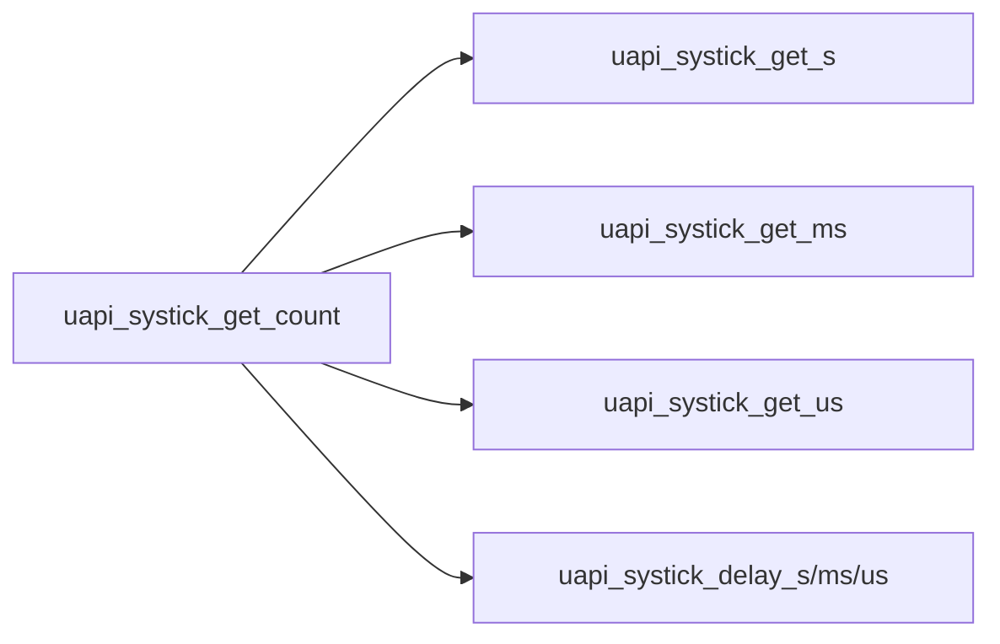
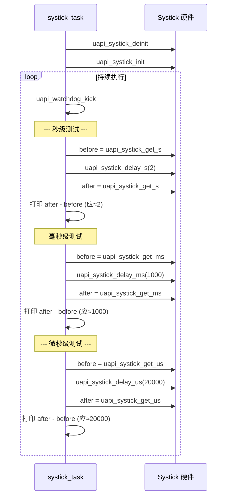

# SysTick

> SysTick 驱动 | Sample: `src/application/samples/peripheral/systick/systick_demo.c`

## 学习目标

- 理解 WS53 SysTick 驱动提供的统一计数基准和时间单位换算
- 掌握 `uapi_systick_get_s()` / `uapi_systick_get_ms()` / `uapi_systick_get_us()` 的时间戳获取功能
- 掌握 `uapi_systick_delay_s()` / `uapi_systick_delay_ms()` / `uapi_systick_delay_us()` 的阻塞延时用法

## 基本概念

### SysTick 是什么

WS53 的 SysTick 驱动向应用提供秒、毫秒、微秒时间戳和对应的阻塞延时接口。当前 `systick.c` 中的 `uapi_systick_get_s()`、`uapi_systick_get_ms()`、`uapi_systick_get_us()` 都先调用同一个 `uapi_systick_get_count()`，再按目标单位换算；不能把 `get_ms()` 描述成读取 OS 软件 Tick、把 `get_us()` 描述成另一条硬件直读路径。



### SysTick 与 Timer 案例的使用方式

| 对比项 | SysTick API | Timer API |
|--------|---|---|
| 使用方式 | 直接获取时间戳或执行阻塞延时 | 创建定时器并在到期时执行回调 |
| 典型 API | `get_s/get_ms/get_us/delay_*` | `create/start/stop/delete` + 回调 |
| 当前案例关注点 | 时间戳递增和延时接口基本功能 | 多个定时器的触发顺序 |

## 涉及 API

| API | 用途 | 头文件 |
|-----|------|--------|
| `uapi_systick_deinit()` | 清理已有 SysTick 状态 | `systick.h` |
| `uapi_systick_init()` | 初始化 SysTick（使能时钟和中断） | `systick.h` |
| `uapi_systick_get_s()` | 获取系统运行秒数（uint64） | `systick.h` |
| `uapi_systick_get_ms()` | 获取系统运行毫秒数（uint64） | `systick.h` |
| `uapi_systick_get_us()` | 获取系统运行微秒数（uint64） | `systick.h` |
| `uapi_systick_delay_s(n)` | 阻塞延时 n 秒 | `systick.h` |
| `uapi_systick_delay_ms(n)` | 阻塞延时 n 毫秒 | `systick.h` |
| `uapi_systick_delay_us(n)` | 阻塞延时 n 微秒 | `systick.h` |

> 三个 `get_*()` 接口基于同一个 SysTick 计数值，只是返回单位不同。返回单位不等同于已验证的测量精度。

## 案例说明

### 案例简介

本 Sample 演示 SysTick 时间获取与阻塞延时的三种单位（秒/毫秒/微秒），每种单位执行以下步骤：
1. 记录延时前的时间戳（`get_s/ms/us`）
2. 调用对应的 `delay_*()` 阻塞延时
3. 记录延时后的时间戳
4. 计算差值并打印；源码以 `after > before` 判断计数是否正常递增

### 功能规格

| 规格项 | 说明 |
|--------|------|
| 秒级延时 | 2 秒（`SYSTICK_DELAY_S=2`） |
| 毫秒级延时 | 1000 毫秒（`SYSTICK_DELAY_MS=1000`） |
| 微秒级延时 | 20000 微秒（`SYSTICK_DELAY_US=20000`） |
| 循环维护 | 每轮开始调用 `uapi_watchdog_kick()` |
| 当前成功条件 | `after > before`，不等同于精度验证 |

### 案例流程



## 案例操作指导

1. 编译：
   ```bash
   fbb build ws53_liteos_app
   ```
2. 烧录固件，串口观察输出：
   - `systick delay 2s!` → `count_s = 2` → `systick get s work normall.`
   - `systick delay 1000ms!` → `count_ms = 1000` → `systick get ms work normall.`
   - `systick delay 20000us!` → `count_us ≈ 20000` → `systick get us work normall.`
3. 程序持续循环输出，每轮开始会喂看门狗

## 关键配置

| 配置项 | 推荐值 | 说明 |
|--------|---|------|
| 时间单位 | 与所调用接口一致 | `get_s/delay_s` 为秒，`get_ms/delay_ms` 为毫秒，`get_us/delay_us` 为微秒 |
| 极短延时 | 在目标系统实测 | 函数调用、中断和系统负载会影响实际延时，不用返回单位替代误差测试 |
| 时间戳变量类型 | `uint64_t` | 与当前接口返回类型保持一致 |

> `get_s()`、`get_ms()` 和 `get_us()` 共享同一计数来源。应根据所需返回单位选择接口；如需评价定时误差，应使用独立基准和明确的允许范围进行测量。

## 代码详解

### 1. SysTick 初始化

```c
uapi_systick_deinit();
uapi_systick_init();
```

案例先反初始化再初始化 SysTick，确保测试从明确的驱动状态开始。进入每轮秒、毫秒和微秒测试前调用 `uapi_watchdog_kick()`，避免长时间阻塞延时触发系统看门狗。

### 2. 秒级延时与验证

记录延时前后的秒时间戳，差值应等于延时值（误差 ±1 秒内）：

```c
uint64_t count_before_get_s;
uint64_t count_after_get_s;

count_before_get_s = uapi_systick_get_s();
uapi_systick_delay_s(SYSTICK_DELAY_S);   /* 阻塞 2 秒 */
count_after_get_s = uapi_systick_get_s();

osal_printk("count_s = %llu\r\n", count_after_get_s - count_before_get_s);
if (count_after_get_s > count_before_get_s) {
    osal_printk("systick get s work normall.\r\n");
}
```

### 3. 毫秒级延时与验证

```c
uint64_t count_before_get_ms;
uint64_t count_after_get_ms;

count_before_get_ms = uapi_systick_get_ms();
uapi_systick_delay_ms(SYSTICK_DELAY_MS); /* 阻塞 1000ms */
count_after_get_ms = uapi_systick_get_ms();

osal_printk("count_ms = %llu\r\n", count_after_get_ms - count_before_get_ms);
if (count_after_get_ms > count_before_get_ms) {
    osal_printk("systick get ms work normall.\r\n");
}
```

### 4. 微秒级延时与验证

```c
uint64_t count_before_get_us;
uint64_t count_after_get_us;

count_before_get_us = uapi_systick_get_us();
uapi_systick_delay_us(SYSTICK_DELAY_US); /* 阻塞 20000us = 20ms */
count_after_get_us = uapi_systick_get_us();

osal_printk("count_us = %llu\r\n", count_after_get_us - count_before_get_us);
if (count_after_get_us > count_before_get_us) {
    osal_printk("systick get us work normall.\r\n");
}
```

> `uapi_systick_delay_us()` 是**阻塞延时**——调用期间 CPU 不释放。微秒级短延时（<100us）用阻塞方式无问题，但毫秒级以上延时建议用 `osal_msleep()` 释放 CPU 给其他任务。

---
