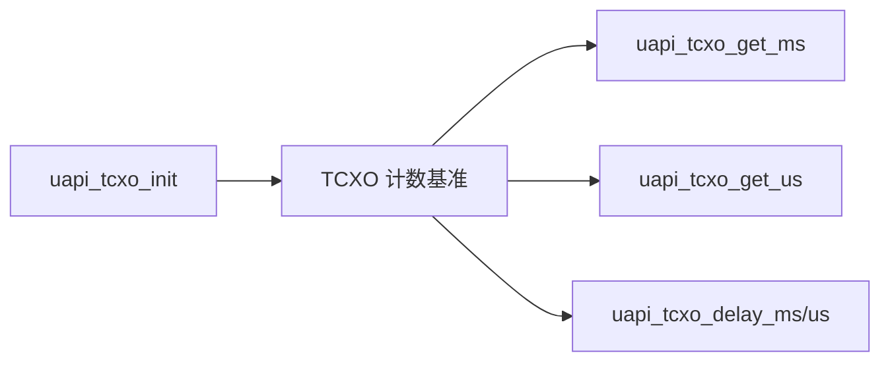
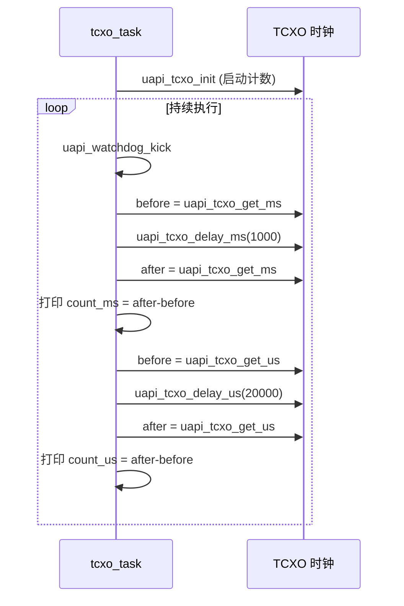

# TCXO

> TCXO (Temperature Compensated Crystal Oscillator) 驱动 | sample: `src/application/samples/peripheral/tcxo/tcxo_demo.c`

## 学习目标

- 了解 WS53 TCXO 驱动提供的时间戳和阻塞延时能力
- 掌握 TCXO 初始化（`uapi_tcxo_init`）、延时（`uapi_tcxo_delay_ms/us`）和时间戳获取（`uapi_tcxo_get_ms/us`）的用法
- 能够使用延时前后的时间戳检查计数是否单调递增

## 基本概念

### 本案例验证的能力

TCXO 是 Temperature Compensated Crystal Oscillator（温度补偿晶体振荡器）的缩写。WS53 驱动向应用提供初始化、计数、毫秒/微秒时间戳和阻塞延时接口；本案例只验证这些接口的基本可用性。

WS53 的实际时钟源结构、温度补偿方式、频率误差和低功耗切换流程不能由当前 Sample 源码得出。如需使用这些硬件指标，应以对应芯片手册、开发板原理图和器件规格书为准。



### TCXO 时钟 vs SysTick 时钟

| 对比项 | TCXO API | SysTick API |
|--------|---|---|
| 时间戳接口 | `uapi_tcxo_get_ms/us` | `uapi_systick_get_ms/us` |
| 延时接口 | `uapi_tcxo_delay_ms/us` | `uapi_systick_delay_ms/us` |
| 本页面验证范围 | TCXO 接口的计数递增和延时基本功能 | 不在本案例中验证 |

> 两组 API 的精度、时钟源和功耗差异需要结合 WS53 芯片资料和具体系统配置评估，不能只从 Sample 名称推断。

## 涉及 API

| API | 用途 | 头文件 |
|-----|------|--------|
| `uapi_tcxo_init()` | 初始化 TCXO 模块（启动计数） | `tcxo.h` |
| `uapi_tcxo_get_ms()` | 获取 TCXO 毫秒时间戳（uint64） | `tcxo.h` |
| `uapi_tcxo_get_us()` | 获取 TCXO 微秒时间戳（uint64） | `tcxo.h` |
| `uapi_tcxo_delay_ms(n)` | 基于 TCXO 计数的阻塞延时，单位毫秒 | `tcxo.h` |
| `uapi_tcxo_delay_us(n)` | 基于 TCXO 计数的阻塞延时，单位微秒 | `tcxo.h` |

## 案例说明

### 案例简介

本 Sample 演示 TCXO 时钟的毫秒/微秒级延时与时间戳功能：
1. `uapi_tcxo_init()` 初始化 TCXO
2. 在循环中执行毫秒级延时 1000ms 和微秒级延时 20000us，并在每轮开始时喂看门狗
3. 每种延时前后分别调用 `get_ms/get_us` 获取时间戳；源码以 `after > before` 作为接口正常的判定条件

### 功能规格

| 规格项 | 说明 |
|--------|------|
| 毫秒级测试 | 延时 1000ms（`TCXO_DELAY_MS=1000`） |
| 微秒级测试 | 延时 20000us（`TCXO_DELAY_US=20000`） |
| 循环维护 | 每轮调用 `uapi_watchdog_kick()`，防止测试期间看门狗复位 |
| 时间戳类型 | `uint64_t` |
| 当前成功条件 | `after > before`，只验证计数单调递增，不验证延时误差或 ppm 精度 |

### 案例流程



## 案例操作指导

1. 编译：
   ```bash
   fbb build ws53-liteos-app
   ```
2. 烧录固件，串口观察输出：
   - `tcxo delay 1000ms!` 后打印实际 `count_ms`；只要延时后的时间戳大于延时前，就输出 `tcxo get ms work normall.`
   - `tcxo delay 20000us!` 后打印实际 `count_us`；只要延时后的时间戳大于延时前，就输出 `tcxo get us work normall.`
3. 程序持续循环输出测试结果

## 关键配置

| 配置项 | 推荐值 | 说明 |
|--------|---|------|
| TCXO 初始化时机 | 使用计时 API 之前 | `get_ms/get_us` 和延时接口应在初始化后调用 |
| 延时参数 | 按接口定义和实际需求设置 | 极短延时会受到函数调用和中断等开销影响，误差需在目标系统实测 |

## 代码详解

### 1. TCXO 初始化

在使用本案例中的 TCXO 时间戳和延时接口前先调用 `uapi_tcxo_init()`：

```c
uapi_tcxo_init();
```

### 2. 毫秒级延时与时间戳检查

记录延时前后的毫秒时间戳并打印差值。当前代码只检查后一个时间戳是否更大：

```c
uint64_t count_before_get_ms;
uint64_t count_after_get_ms;

count_before_get_ms = uapi_tcxo_get_ms();
uapi_tcxo_delay_ms(TCXO_DELAY_MS);   /* 阻塞 1000ms */
count_after_get_ms = uapi_tcxo_get_ms();

osal_printk("count_after_get_ms = %llu, count_before_get_ms = %llu\r\n",
            count_after_get_ms, count_before_get_ms);
osal_printk("count_ms = %llu\r\n", count_after_get_ms - count_before_get_ms);
if (count_after_get_ms > count_before_get_ms) {
    osal_printk("tcxo get ms work normall.\r\n");
}
```

### 3. 微秒级延时与时间戳检查

记录延时前后的微秒时间戳并打印差值。当前代码同样只检查后一个时间戳是否更大：

```c
uint64_t count_before_get_us;
uint64_t count_after_get_us;

count_before_get_us = uapi_tcxo_get_us();
uapi_tcxo_delay_us(TCXO_DELAY_US);   /* 阻塞 20000us = 20ms */
count_after_get_us = uapi_tcxo_get_us();

osal_printk("count_after_get_us = %llu, count_before_get_us = %llu\r\n",
            count_after_get_us, count_before_get_us);
osal_printk("count_us = %llu\r\n", count_after_get_us - count_before_get_us);
if (count_after_get_us > count_before_get_us) {
    osal_printk("tcxo get us work normall.\r\n");
}
```

---
