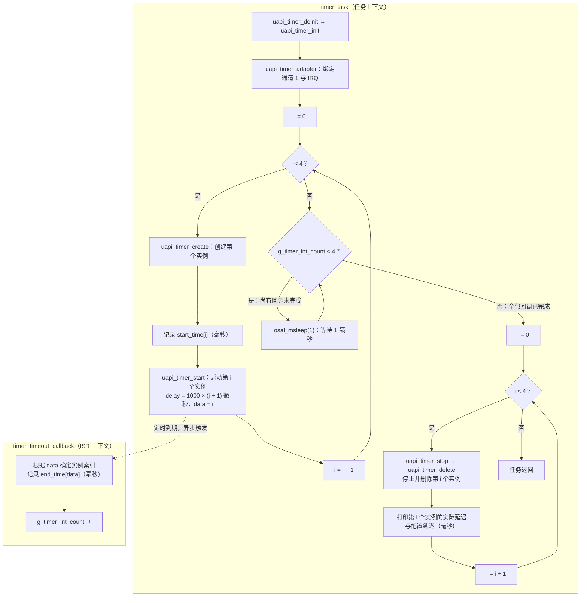
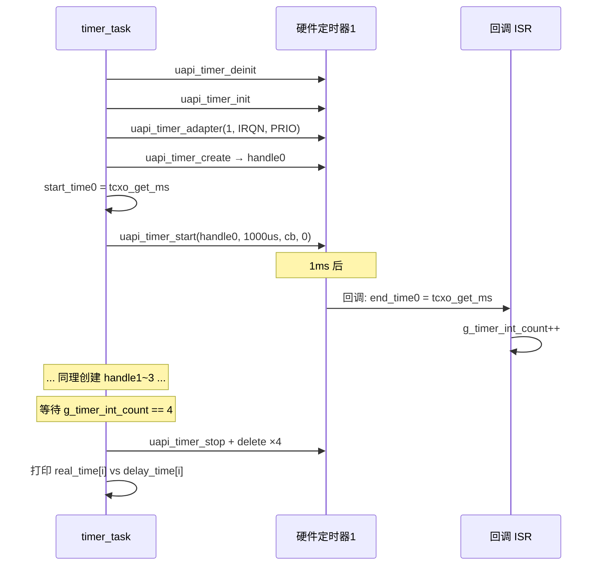

# Timer

> Timer 驱动 | sample: `src/application/samples/peripheral/timer/timer_demo.c` | 参考：[Timer API](../../../api-reference/driver/timer.md)

## 学习目标

- 理解硬件定时器与 OS (Operating System) 软件定时器在使用方式上的区别——本案例的延迟参数单位为微秒，回调运行在 ISR (Interrupt Service Routine) 上下文中
- 掌握 `uapi_timer_init` / `uapi_timer_create` / `uapi_timer_start` / `uapi_timer_stop` / `uapi_timer_delete` 的完整生命周期管理
- 能够使用 `uapi_tcxo_get_ms()` 粗略观察 1～4ms 定时器的触发顺序和毫秒级延迟

## 基本概念

### 硬件定时器 vs OS 软件定时器

| 对比维度 | 硬件定时器 | OS 软件定时器 |
|--------|---|---|
| 时钟源 | 芯片硬件定时器（APB 时钟） | OS tick（SysTick 1ms） |
| 延迟参数单位 | 微秒 | 取决于所用软件定时器接口 |
| 回调执行上下文 | **中断上下文（硬件 ISR）** | 软件中断或任务上下文，取决于具体实现 |
| 是否允许阻塞调用 | 不允许，不能调用睡眠、打印等阻塞或耗时 API | 不允许在回调中调用延时接口；任务上下文中的阻塞操作也会延误其他软件定时器回调 |
| 资源数量 | 受芯片硬件定时器数量及驱动资源限制 | 受系统配置和内存资源限制 |
| 典型用途 | 精确定时、PWM (Pulse Width Modulation) 生成、波形测量 | 周期性任务、超时处理 |

> **关键约束**：硬件定时器回调在 ISR 中执行——不能调用 `osal_msleep`、`osal_printk`、`printf` 等阻塞或耗时 API。回调中只能做简单操作（翻转 GPIO (General Purpose Input/Output)、递增计数器、`sem_up` 信号量通知任务）。

### Sample 架构：多定时器同步测量

本 Sample 创建 4 个硬件定时器，分别配置 1ms / 2ms / 3ms / 4ms 延迟，记录每个定时器的启动时间和回调触发时间，最后打印实际延迟与理论值的对比：



实线表示各上下文内的执行顺序，虚线表示定时到期后异步触发回调。回调可能在创建循环尚未结束时执行；任务启动全部 4 个实例后检查完成计数，尚未全部完成时休眠 1ms 后重试，待所有回调完成后逐个停止、删除实例并打印对应结果。图中的 `4` 对应代码中的 `TIMER_TIMERS_NUM`。

## 涉及 API

| API | 用途 | 头文件 |
|-----|------|--------|
| `uapi_timer_deinit()` | 清理已有定时器驱动状态 | `timer.h` |
| `uapi_timer_init()` | 初始化定时器模块 | `timer.h` |
| `uapi_timer_adapter(index, irqn, prio)` | 绑定定时器硬件通道与中断号 | `timer.h` |
| `uapi_timer_create(index, &handle)` | 创建定时器实例（获取句柄） | `timer.h` |
| `uapi_timer_start(handle, delay_us, cb, data)` | 启动单次/周期定时器（微秒） | `timer.h` |
| `uapi_timer_stop(handle)` | 停止定时器 | `timer.h` |
| `uapi_timer_delete(handle)` | 删除定时器实例 | `timer.h` |
| `uapi_tcxo_get_ms()` | 获取系统毫秒时间戳（TCXO (Temperature Compensated Crystal Oscillator) 时钟） | `tcxo.h` |

## 案例说明

### 案例简介

创建 4 个硬件定时器，配置不同延迟（1000/2000/3000/4000 微秒），在每个定时器的回调中用 `uapi_tcxo_get_ms()` 记录触发时间戳，待所有回调完成后打印毫秒级观测结果。由于记录接口的返回单位为毫秒，本案例只能进行基本触发顺序和粗略延迟检查，不能证明微秒级精度。

### 功能规格

| 规格项 | 说明 |
|--------|------|
| 定时器数量 | 4 个 |
| 延迟配置 | 1000us / 2000us / 3000us / 4000us |
| 定时器通道 | 硬件通道 1（TIMER_INDEX=1） |
| 观测手段 | `uapi_tcxo_get_ms()` 记录启动和回调时间，分辨到毫秒单位 |
| 回调功能 | 记录 `end_time` + 递增 `g_timer_int_count` |

### 案例流程



## 案例操作指导

1. 编译：
   ```bash
   fbb build ws53-liteos-app
   ```
2. 烧录固件，串口观察输出：
   ```
   real time[0] = xxxms    delay = 1ms
   real time[1] = xxxms    delay = 2ms
   real time[2] = xxxms    delay = 3ms
   real time[3] = xxxms    delay = 4ms
   ```
3. `real time` 用于观察 1ms、2ms、3ms、4ms 的大致触发顺序。毫秒时间戳无法区分不足 1ms 的差异，不能将量化结果解释为 TCXO 本身存在“±1ms 误差”

## 关键配置

| 配置项 | 推荐值 | 说明 |
|--------|---|------|
| `delay_time` 单位 | 微秒 | `uapi_timer_start` 的 `delay` 参数单位为 **微秒**，`1ms = 1000` |
| `TIMER_INDEX` | 1（或 SOC 定义） | 不同通道对应不同的硬件定时器 IP (Internet Protocol)。WS53 的通道号和 IRQ (Interrupt Request) 号需查芯片手册 |
| `timer_adapter` 优先级 | 与 Sample 和系统中断规划一致 | 具体优先级需要结合 WS53 中断控制器及整个系统的中断优先级方案配置 |
| 完成等待间隔 | `osal_msleep(1)` | 任务每 1ms 检查一次 4 个回调是否全部完成 |

> **Trade-off**：硬件定时器资源有限且回调有 ISR 上下文约束；软件定时器受调度影响，但管理更灵活。选择时应结合定时分辨率、允许抖动、回调工作量和可用资源，不使用未经 WS53 资料确认的固定通道数量。

## 代码详解

### 1. 数据结构定义

每个定时器关联一个 `timer_info_t` 记录起始时间和延迟值：

```c
typedef struct timer_info {
    uint32_t start_time;   /* 启动时的 TCXO 毫秒时间戳 */
    uint32_t end_time;     /* 回调触发时的 TCXO 毫秒时间戳 */
    uint32_t delay_time;   /* 配置的延迟（微秒） */
} timer_info_t;

static uint32_t g_timer_int_count = 0;
static timer_info_t g_timers_info[TIMER_TIMERS_NUM] = {
    {0, 0, TIMER1_DELAY_1000US},   /* 1000us */
    {0, 0, TIMER2_DELAY_2000US},   /* 2000us */
    {0, 0, TIMER3_DELAY_3000US},   /* 3000us */
    {0, 0, TIMER4_DELAY_4000US}    /* 4000us */
};
```

### 2. 定时器回调（ISR 上下文）

回调通过 `data` 参数传递定时器索引，在 ISR 中仅做时间记录和计数递增——不能做任何阻塞操作：

```c
static void timer_timeout_callback(uintptr_t data)
{
    uint32_t timer_index = (uint32_t)data;
    g_timers_info[timer_index].end_time = uapi_tcxo_get_ms();  /* 记录触发时间 */
    g_timer_int_count++;  /* 递增全局计数 */
}
```

### 3. 定时器初始化与创建

先初始化模块，绑定硬件通道与中断号，然后循环创建 4 个定时器实例并依次启动：

```c
timer_handle_t timer_index[TIMER_TIMERS_NUM] = { 0 };
uapi_timer_deinit();
uapi_timer_init();
uapi_timer_adapter(TIMER_INDEX, TIMER_1_IRQN, TIMER_PRIO);

for (uint32_t i = 0; i < TIMER_TIMERS_NUM; i++) {
    uapi_timer_create(TIMER_INDEX, &timer_index[i]);         /* 创建实例 */
    g_timers_info[i].start_time = uapi_tcxo_get_ms();        /* 记录启动时间 */
    uapi_timer_start(timer_index[i], g_timers_info[i].delay_time,
                     timer_timeout_callback, i);             /* 启动（us） */
}
```

### 4. 等待完成并清理

轮询 `g_timer_int_count` 等待所有回调触发完毕，然后逐个停止并删除定时器，最后打印实际延迟：

```c
while (g_timer_int_count < TIMER_TIMERS_NUM) {
    osal_msleep(1);
}

for (uint32_t i = 0; i < TIMER_TIMERS_NUM; i++) {
    uapi_timer_stop(timer_index[i]);
    uapi_timer_delete(timer_index[i]);
    osal_printk("real time[%d] = %dms  delay = %dms\r\n", i,
        g_timers_info[i].end_time - g_timers_info[i].start_time,
        g_timers_info[i].delay_time / TIMER_MS_2_US);
}
```

> 硬件定时器使用完毕后必须调用 `uapi_timer_delete` 释放资源——定时器句柄是有限资源，泄漏会导致后续定时器创建失败。

---
