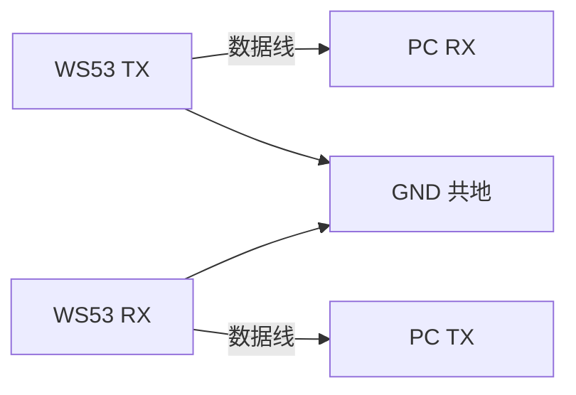
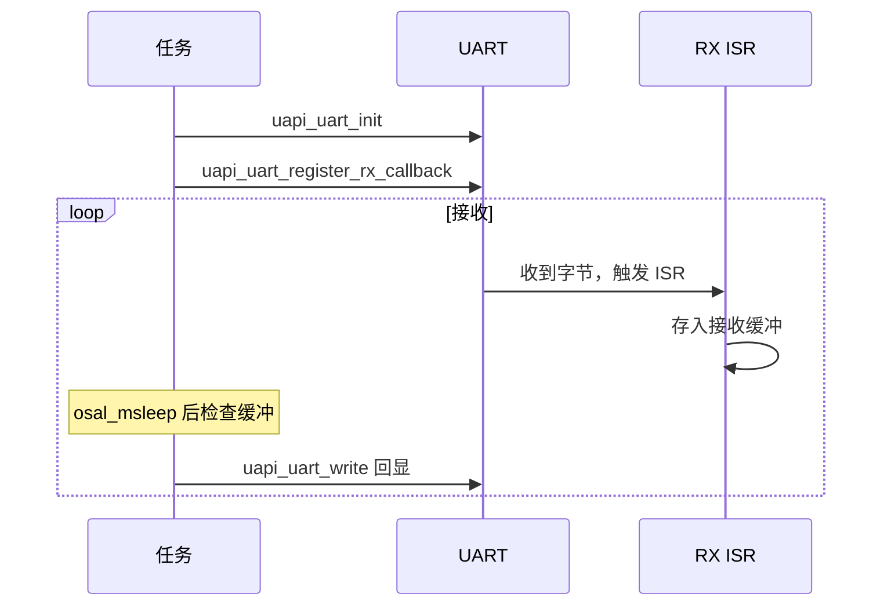

# UART

> UART (Universal Asynchronous Receiver/Transmitter) 驱动 | sample: uart

## 学习目标

- 掌握 UART 初始化的完整流程：引脚复用 → 波特率/数据位/停止位配置 → 中断/DMA 模式选择
- 掌握 `uapi_uart_write()` 发送数据和中断回调接收数据的用法
- 理解 UART 三种传输模式——中断、DMA (Direct Memory Access)、轮询——的差异和选择策略

## 基本概念

### UART 通信简介

UART是嵌入式最常用的异步串行通信接口——仅需 TX/RX/GND 三根线，无需时钟线（异步意味着收发双方约定相同波特率）。



### 波特率和帧格式

| 参数 | 常见值 | 说明 |
|------|--------|------|
| 波特率 | 9600 / 115200 / 921600 | 每秒传输的 bit 数，收发双方必须一致 |
| 数据位 | 8 | 每帧有效数据位数 |
| 停止位 | 1 | 帧结束标志 |
| 校验位 | None | 可选奇/偶校验 |

### 三种传输模式

| 模式 | 原理 | CPU 占用 | 适用场景 |
|------|------|---|------|
| 中断（INT） | 每收到一个字节触发 ISR (Interrupt Service Routine) | 中（每字节中断一次） | 低波特率、小数据量 |
| DMA | 硬件自动搬数据，完成后一次中断 | 低 | 高波特率、大数据量 |
| 轮询（Poll） | CPU 循环检查 FIFO (First-In First-Out) | 高 | 调试、简单回环测试 |

## 涉及 API

| API | 用途 | 头文件 |
|-----|------|--------|
| `uapi_pin_set_mode(pin, mode)` | 设置 TX/RX 引脚为 UART 功能 | `pinctrl.h` |
| `uapi_uart_init(bus, &pins, &attr, &extra, &buffer)` | 初始化 UART，引脚、帧格式和缓冲区一次传入 | `uart.h` |
| `uapi_uart_write(bus, buf, len, timeout)` | 发送数据，timeout 控制阻塞时间 | `uart.h` |
| `uapi_uart_register_rx_callback(bus, condition, size, callback)` | 注册中断接收回调 | `uart.h` |
| `uapi_uart_read(bus, buf, len, timeout)` | 轮询读取数据 | `uart.h` |
| `uapi_uart_read_by_dma()` / `uapi_uart_write_by_dma()` | 使用 DMA 收发数据 | `uart.h` |

## 案例说明

### 案例简介

配置 UART 为 115200 8N1，根据 Kconfig 选择中断、DMA 或轮询方式，实现固定长度数据回显。

### 功能规格

| 规格项 | 说明 |
|--------|------|
| UART 端口 | `CONFIG_UART_BUS_ID`，默认 UART0 |
| 波特率 | 115200 |
| 帧格式 | 8 数据位 + 1 停止位 + 无校验（8N1） |
| TX/RX 引脚 | Kconfig 可配，通过 `uapi_pin_set_mode` 复用 |
| 模式 | 中断（INT）/ DMA / 轮询（Poll），Kconfig 切换 |

程序运行流程：引脚复用 → 准备 `uart_pin_config_t` 和 `uart_attr_t` → `uapi_uart_init` → 进入对应模式的接收与回显循环。

### 案例流程（中断模式）



## 案例操作指导

### 第一步：编译

```bash
fbb build ws53-liteos-app
```

> 更多编译选项请参考 [构建](../../../guides/sdk-development/build/index.md#cli-build)。

### 第二步：烧录

```bash
fbb flash ws53-liteos-app
```

> 更多烧录选项请参考 [烧录](../../../guides/sdk-development/flash-and-run/index.md#cli-flash)。

### 第三步：验证

串口工具打开对应 COM 口（115200 8N1），按 `CONFIG_UART_TRANSFER_SIZE` 发送数据。日志显示当前模式的 receive/send back 状态，并返回相同数据。

## 关键配置

### 基础参数

| 参数 | 示例值 | 说明 |
|------|--------|------|
| 波特率 | `115200` | 与串口工具保持一致，适合常用的嵌入式调试场景 |
| 帧格式 | `8N1` | 8 个数据位、无校验位、1 个停止位 |
| `CONFIG_UART_BUS_ID` | `0` | UART 总线编号，示例使用 UART0 |
| `CONFIG_UART_TRANSFER_SIZE` | `4` | 每次接收和回显的数据长度，单位为字节 |
| 任务栈大小 | `0x1000`（4096） | UART 任务栈大小，单位为字节 |

### 传输模式选择

| 模式 | 适用场景 | 说明 |
|------|----------|------|
| 中断（INT） | 间歇传输或数据量较小 | 每次收发由中断驱动，实际吞吐量取决于系统负载、缓冲区和回调处理时间 |
| DMA | 连续传输或数据量较大 | 由硬件搬运数据，可减少逐字节中断；是否启用应通过目标负载实测 |

## 代码详解

以下为关键代码片段，完整实现见 `src/application/samples/peripheral/uart/uart_demo.c`：

```c
#include "pinctrl.h"
#include "uart.h"
#include "soc_osal.h"
#include "app_init.h"

#define UART_BAUDRATE                115200
#define UART_TASK_STACK_SIZE         0x1000

static void app_uart_init_pin(void)
{
    /* 设置引脚为 UART 功能——TX 和 RX 都要设置 */
    uapi_pin_set_mode(CONFIG_UART_TXD_PIN, CONFIG_UART_TXD_PIN_MODE);
    uapi_pin_set_mode(CONFIG_UART_RXD_PIN, CONFIG_UART_RXD_PIN_MODE);
}

static void app_uart_init_config(void)
{
    uart_attr_t attr = {
        .baud_rate = UART_BAUDRATE,        // 115200
        .data_bits = UART_DATA_BIT_8,      // 8 位数据
        .stop_bits = UART_STOP_BIT_1,      // 1 位停止
        .parity = UART_PARITY_NONE         // 无校验
    };
    uart_pin_config_t pins = {
        .tx_pin = CONFIG_UART_TXD_PIN,
        .rx_pin = CONFIG_UART_RXD_PIN,
        .cts_pin = PIN_NONE,
        .rts_pin = PIN_NONE
    };
    uapi_uart_deinit(CONFIG_UART_BUS_ID);
    uapi_uart_init(CONFIG_UART_BUS_ID, &pins, &attr, NULL,
        &g_app_uart_buffer_config);
}

#if defined(CONFIG_UART_SUPPORT_INT_MODE)
/* 中断模式——RX 回调中收数据 */
static void app_uart_read_int_handler(const void *buffer,
    uint16_t length, bool error)
{
    unused(error);
    memcpy_s(g_app_uart_int_rx_buff, CONFIG_UART_TRANSFER_SIZE,
        buffer, length);
    g_app_uart_int_rx_flag = 1;
}
#endif

static void uart_task(const char *arg)
{
    (void)arg;
    app_uart_init_pin();
    app_uart_init_config();
#if defined(CONFIG_UART_SUPPORT_INT_MODE)
    uapi_uart_register_rx_callback(CONFIG_UART_BUS_ID,
        UART_RX_CONDITION_FULL_OR_SUFFICIENT_DATA_OR_IDLE,
        1, app_uart_read_int_handler);
#endif

    while (1) {
#if defined(CONFIG_UART_SUPPORT_INT_MODE)
        while (g_app_uart_int_rx_flag != 1) {
            osal_msleep(5);
        }
        g_app_uart_int_rx_flag = 0;
        uapi_uart_write_int(CONFIG_UART_BUS_ID,
            g_app_uart_int_rx_buff, CONFIG_UART_TRANSFER_SIZE,
            0, app_uart_write_int_handler);
#elif defined(CONFIG_UART_SUPPORT_DMA)
        uapi_uart_read_by_dma(CONFIG_UART_BUS_ID, g_app_uart_rx_buff,
            CONFIG_UART_TRANSFER_SIZE, &g_app_dma_cfg);
        uapi_uart_write_by_dma(CONFIG_UART_BUS_ID, g_app_uart_rx_buff,
            CONFIG_UART_TRANSFER_SIZE, &g_app_dma_cfg);
#else
        uapi_uart_read(CONFIG_UART_BUS_ID, g_app_uart_rx_buff,
            CONFIG_UART_TRANSFER_SIZE, 0);
        uapi_uart_write(CONFIG_UART_BUS_ID, g_app_uart_rx_buff,
            CONFIG_UART_TRANSFER_SIZE, 0);
#endif
    }
}
app_run(uart_entry);
```

!!! note "当前 Sample 与产品代码的区别"

    当前 `uart_demo.c` 为了便于观察接收数据，会在 RX 回调中多次调用 `osal_printk()` 并逐字节打印。这是 Sample 的现状，不代表推荐的产品实现。量产代码应避免在回调中阻塞或大量打印，优先把数据写入环形缓冲区或投递给任务，再由任务完成日志和业务处理。

---
