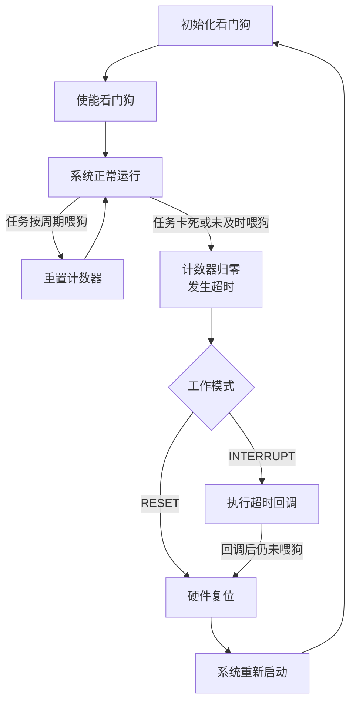
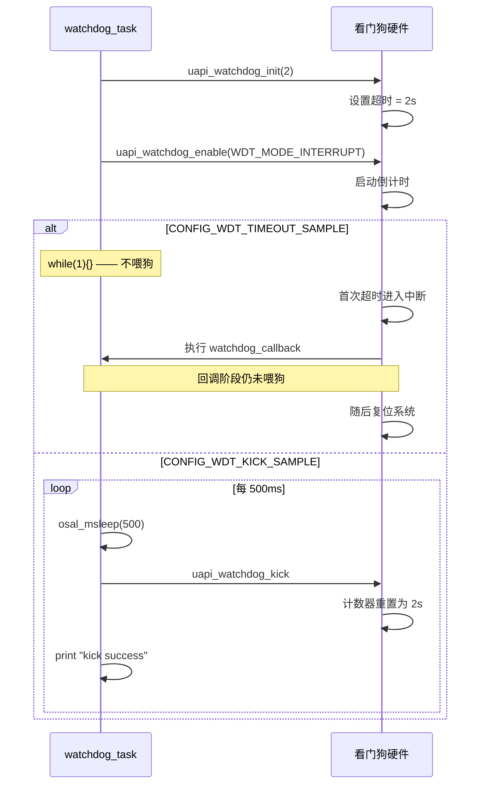

# Watchdog

> Watchdog 驱动 | sample: `src/application/samples/peripheral/watchdog/watchdog_demo.c`

## 学习目标

- 理解看门狗的原理——硬件倒计时器，超时未喂狗则触发系统复位
- 掌握 `uapi_watchdog_init` / `uapi_watchdog_enable` / `uapi_watchdog_kick` 的标准用法
- 能够区分"超时复位"和"正常喂狗"两种场景，并在实际工程中选择合适的超时值和喂狗策略

## 基本概念

### 看门狗做什么

看门狗是一个独立于 CPU 的硬件倒计时器——一旦启动就从初始值往下数。如果程序正常，会周期性"喂狗"（把计数器重置回初始值）；如果程序跑飞（死循环、内存踩踏、任务卡死），无法喂狗，计数器减到 0 时按所选模式直接复位，或先进入中断再在未喂狗时复位：



### 超时值的选择策略

超时值必须大于系统内**最长不可中断操作**的时间：

| 操作类型 | 注意事项 |
|----------|----------------------|
| Flash 擦除/写入 | 以所用 Flash 器件手册和驱动实测的最坏耗时为准 |
| OTA (Over-The-Air) 下载与校验 | 确保长流程中仍由健康监控逻辑按策略喂狗 |
| 正常任务循环 | 超时值必须覆盖任务最坏调度延迟和不可中断区间 |

> Sample 默认超时 2 秒（`TIME_OUT=2`），喂狗间隔 500ms。该配置用于演示；产品配置仍需根据任务最坏响应时间和调度抖动评估。

### Sample 的两种配置

本 Sample 通过 Kconfig 控制两种行为：
- **`CONFIG_WDT_TIMEOUT_SAMPLE`**：启动看门狗后进入 `while(1){}` 死循环——不喂狗。当前 `WDT_MODE=1` 为中断模式，首次超时执行回调；回调阶段仍未喂狗时，系统随后复位
- **`CONFIG_WDT_KICK_SAMPLE`**：启动看门狗后在循环中每 500ms 喂狗——系统稳定运行不复位。用于验证喂狗机制正常工作

## 涉及 API

| API | 用途 | 头文件 |
|-----|------|--------|
| `uapi_watchdog_init(timeout)` | 初始化看门狗，设置超时时间（秒） | `watchdog.h` |
| `uapi_watchdog_enable(mode)` | 使能看门狗并设置工作模式 | `watchdog.h` |
| `uapi_register_watchdog_callback(cb)` | 注册中断模式下的超时回调 | `watchdog.h` |
| `uapi_watchdog_kick()` | 喂狗——重置计数器到初始值 | `watchdog.h` |
| `uapi_watchdog_deinit()` | 反初始化看门狗 | `watchdog.h` |

## 案例说明

### 案例简介

演示看门狗的两种典型场景：
1. **超时验证**（`CONFIG_WDT_TIMEOUT_SAMPLE`）：启动看门狗后不喂狗，首次超时进入回调；仍未喂狗时系统随后复位
2. **正常喂狗**（`CONFIG_WDT_KICK_SAMPLE`）：启动看门狗后每 500ms 喂狗一次，系统持续稳定运行——验证喂狗 API 正确性

### 功能规格

| 规格项 | 说明 |
|--------|------|
| 超时时间 | 2 秒（`TIME_OUT=2`） |
| 工作模式 | 1（`WDT_MODE_INTERRUPT`，中断模式） |
| 超时回调 | `watchdog_callback`——中断模式首次超时时执行 |
| 喂狗间隔 | 500ms（远小于 2s 超时） |
| 喂狗 API | `uapi_watchdog_kick()` |

### 案例流程



## 案例操作指导

1. 编译：
   ```bash
   fbb build ws53-liteos-app
   ```
2. 测试超时流程——在 `menuconfig` 中选中 `CONFIG_WDT_TIMEOUT_SAMPLE`：
   - 烧录后串口打印 `init watchdog`
   - 首次超时打印 `watchdog kick timeout!`
   - 未喂狗时系统随后复位，串口重新输出启动日志
   - 验证中断模式的超时回调和后续复位流程
3. 测试喂狗模式——在 `menuconfig` 中选中 `CONFIG_WDT_KICK_SAMPLE`：
   - 烧录后串口每 500ms 打印 `kick success`
   - 系统持续运行不复位
   - 验证喂狗机制正常

## 关键配置

| 配置项 | 推荐值 | 说明 |
|--------|---|------|
| `TIME_OUT` | 根据系统最坏响应时间确定 | Sample 使用 2 秒便于观察；产品值应覆盖最长不可中断操作和调度抖动，并满足故障恢复时间要求 |
| `WDT_MODE` | 使用枚举名 | `WDT_MODE_RESET=0`：触发时直接复位；`WDT_MODE_INTERRUPT=1`：先进入中断，若中断阶段未喂狗则随后复位。Sample 当前使用模式 1 |
| 喂狗位置 | 最高优先级监控任务 | 严禁各功能任务分别独立执行看门狗喂狗操作。否则，一旦监控任务发生卡死，而某一低优先级任务仍持续喂狗，将导致看门狗监控机制失效，无法发挥异常检测与复位保护作用。 |
| 超时回调 | 仅作日志/告警 | `watchdog_callback` 在超时前极短时间窗口触发——只能做最少操作（记录日志、设置标志），不能做耗时操作 |

> **Trade-off**：超时值过小会使正常的长耗时操作或调度抖动误触发看门狗；超时值过大会延长故障恢复时间。应使用目标系统的最坏耗时实测结果确定，而不是套用统一数值。

## 代码详解

### 1. 初始化看门狗

案例先调用 `uapi_watchdog_deinit()` 清理已有状态，再重新初始化。`uapi_watchdog_init` 的参数 `TIME_OUT` 单位为秒（非毫秒）。返回值检查 `ERRCODE_INVALID_PARAM` 用于防御无效超时值：

```c
(void)uapi_watchdog_deinit();
errcode_t ret = uapi_watchdog_init(TIME_OUT);  /* TIME_OUT = 2 秒 */
if (ret == ERRCODE_INVALID_PARAM) {
    osal_printk("param is error, timeout is %d.\r\n", TIME_OUT);
    return NULL;
}
(void)uapi_watchdog_enable((wdt_mode_t)WDT_MODE);
(void)uapi_register_watchdog_callback(watchdog_callback);
osal_printk("init watchdog\r\n");
```

### 2. 超时回调

当前 Sample 使用 `WDT_MODE_INTERRUPT`。首次超时时进入回调；若回调阶段仍未喂狗，系统随后复位。回调中只应执行有确定时延的最小操作：

```c
static errcode_t watchdog_callback(uintptr_t param)
{
    UNUSED(param);
    osal_printk("watchdog kick timeout!\r\n");
    return ERRCODE_SUCC;
}
```

### 3. 超时场景（不喂狗）

使能 `CONFIG_WDT_TIMEOUT_SAMPLE` 后，任务进入死循环。当前模式下先触发超时回调，未喂狗时随后复位：

```c
#if defined(CONFIG_WDT_TIMEOUT_SAMPLE)
    while (1) {};   /* 故意不喂狗 —— 首次超时进入回调，随后复位 */
#endif
```

### 4. 正常喂狗场景

使能 `CONFIG_WDT_KICK_SAMPLE` 后，任务每 500ms 调用 `uapi_watchdog_kick()` 重置计数器：

```c
#if defined(CONFIG_WDT_KICK_SAMPLE)
    while (1) {
        osal_msleep(WDT_TASK_DURATION_MS);   /* 500ms */
        (void)uapi_watchdog_kick();          /* 喂狗 —— 重置 2s 倒计时 */
        osal_printk("kick success\r\n");
    }
#endif
```

### 5. 反初始化（正常退出路径）

当不复位也不喂狗时（两个 Kconfig 都未开启），执行 `deinit` 退出：

```c
(void)uapi_watchdog_deinit();
return NULL;
```

> 喂狗必须放在一个**独立且不会卡死**的任务中。如果系统有多个任务，建议创建一个最高优先级的"系统监控任务"专门负责喂狗——而不是在业务任务中顺手喂狗。

---
