# 前言

**概述**

本文针对WS53所应用产品如何通过BQB认证提供建议。

**产品版本**

与本文档对应的产品版本如下。

<table><thead align="left"><tr id="row761817313520"><th class="cellrowborder" valign="top" width="50%" id="mcps1.1.3.1.1">
<strong id="b8778123341615">产品名称</strong>

</th>
<th class="cellrowborder" valign="top" width="50%" id="mcps1.1.3.1.2">
<strong id="b12785103341614">产品版本</strong>

</th>
</tr>
</thead>
<tbody><tr id="row11619103553"><td class="cellrowborder" valign="top" width="50%" headers="mcps1.1.3.1.1 ">
WS53

</td>
<td class="cellrowborder" valign="top" width="50%" headers="mcps1.1.3.1.2 ">
V100

</td>
</tr>
</tbody>
</table>

**读者对象**

本文档主要适用于以下工程师：

-   技术支持工程师
-   产品测试工程师
-   产品开发工程师

**符号约定**

在本文中可能出现下列标志，它们所代表的含义如下。

<table><thead align="left"><tr id="row1530720816410"><th class="cellrowborder" valign="top" width="20.580000000000002%" id="mcps1.1.3.1.1">
<strong id="b2136615816410">符号</strong>

</th>
<th class="cellrowborder" valign="top" width="79.42%" id="mcps1.1.3.1.2">
<strong id="b5941558116410">说明</strong>

</th>
</tr>
</thead>
<tbody><tr id="row1372280416410"><td class="cellrowborder" valign="top" width="20.580000000000002%" headers="mcps1.1.3.1.1 ">

</td>
<td class="cellrowborder" valign="top" width="79.42%" headers="mcps1.1.3.1.2 ">
表示如不避免则将会导致死亡或严重伤害的具有高等级风险的危害。

</td>
</tr>
<tr id="row466863216410"><td class="cellrowborder" valign="top" width="20.580000000000002%" headers="mcps1.1.3.1.1 ">

</td>
<td class="cellrowborder" valign="top" width="79.42%" headers="mcps1.1.3.1.2 ">
表示如不避免则可能导致死亡或严重伤害的具有中等级风险的危害。

</td>
</tr>
<tr id="row123863216410"><td class="cellrowborder" valign="top" width="20.580000000000002%" headers="mcps1.1.3.1.1 ">

</td>
<td class="cellrowborder" valign="top" width="79.42%" headers="mcps1.1.3.1.2 ">
表示如不避免则可能导致轻微或中度伤害的具有低等级风险的危害。

</td>
</tr>
<tr id="row5786682116410"><td class="cellrowborder" valign="top" width="20.580000000000002%" headers="mcps1.1.3.1.1 ">

</td>
<td class="cellrowborder" valign="top" width="79.42%" headers="mcps1.1.3.1.2 ">
用于传递设备或环境安全警示信息。如不避免则可能会导致设备损坏、数据丢失、设备性能降低或其它不可预知的结果。

“须知”不涉及人身伤害。

</td>
</tr>
<tr id="row2856923116410"><td class="cellrowborder" valign="top" width="20.580000000000002%" headers="mcps1.1.3.1.1 ">

</td>
<td class="cellrowborder" valign="top" width="79.42%" headers="mcps1.1.3.1.2 ">
对正文中重点信息的补充说明。

“说明”不是安全警示信息，不涉及人身、设备及环境伤害信息。

</td>
</tr>
</tbody>
</table>

**修改记录**

<table><thead align="left"><tr id="row2942532716410"><th class="cellrowborder" valign="top" width="20.580000000000002%" id="mcps1.1.4.1.1">
<strong id="b5687322716410">文档版本</strong>

</th>
<th class="cellrowborder" valign="top" width="29.189999999999998%" id="mcps1.1.4.1.2">
<strong id="b5800814916410">发布日期</strong>

</th>
<th class="cellrowborder" valign="top" width="50.23%" id="mcps1.1.4.1.3">
<strong id="b3316380216410">修改说明</strong>

</th>
</tr>
</thead>
<tbody><tr id="row20562335161919"><td class="cellrowborder" valign="top" width="20.580000000000002%" headers="mcps1.1.4.1.1 ">
01

</td>
<td class="cellrowborder" valign="top" width="29.189999999999998%" headers="mcps1.1.4.1.2 ">
2024-07-23

</td>
<td class="cellrowborder" valign="top" width="50.23%" headers="mcps1.1.4.1.3 ">
第一次正式版本发布。

</td>
</tr>
</tbody>
</table>

# 蓝牙BQB认证简介

-   **[概述](#ZH-CN_TOPIC_0000001993226053)**  

-   **[认证类型](#ZH-CN_TOPIC_0000001956226716)**  

-   **[认证流程](#ZH-CN_TOPIC_0000001993105845)**  

-   **[认证继承](#ZH-CN_TOPIC_0000001956226728)**  

## 概述

任何使用蓝牙无线技术的产品必须通过BQB（Bluetooth Qualification Body）认证，获得BQB认证后产品外观可以标蓝牙标志。

使用蓝牙技术时就必须获得蓝牙技术联盟的（Bluetooth Special interest Group，简称SIG） 的授权，否则相关蓝牙产品投入市场就是违法的。如不能提供BQB认证，相关产品出口时会被海关稽查扣押。

使用蓝牙技术的芯片、产品、贴牌的产品，均需BQB认证。

## 认证类型

蓝牙认证可以分为如下三种类型。

芯片厂家一般选择component，subsystem（host/profile/ controller）类型认证，成品产品厂家一般选择End product类型认证。

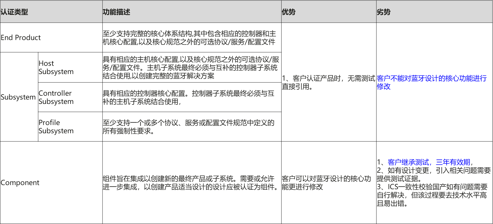

蓝牙SIG官方参考链接：

[https://www.bluetooth.com/develop-with-bluetooth/qualification-listing/](https://www.bluetooth.com/develop-with-bluetooth/qualification-listing/)

## 认证流程

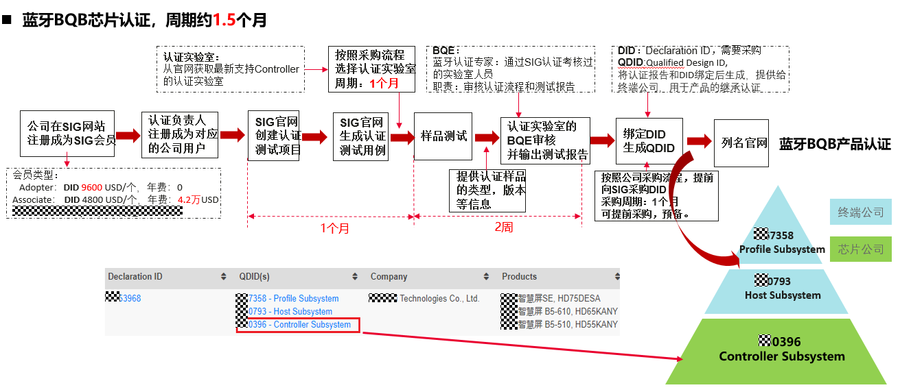

例如，芯片厂家认证controller subsystem类型，获得一个QDID。

使用了该芯片的产品需要在SIG官网列名DID, 可以继承该部分的认证结果而无需重新认证。

一个DID可以引用一个或者多个QDID。

## 认证继承

认证状态：WS53芯片已进行认证，联盟网站均已列名

1.  BTH host subsystem协议认证。
2.  BTC 协议和射频 controller subsystem认证。

产品或者模组厂商， 一般可以继承芯片厂商的协议认证，射频测试无法继承，需要对应产品厂商单独去认证。

详细认证规则以及需要的材料信息，建议咨询联盟或者认证实验室，以其信息为准。

# BQB协议认证

-   **[认证环境](#ZH-CN_TOPIC_0000001956226736)**  

-   **[认证准备](#ZH-CN_TOPIC_0000001956226720)**  

-   **[参数设置](#ZH-CN_TOPIC_0000001956226724)**  

## 认证环境

Ellisys是蓝牙SIG指令的测试系统,  EllisysBluetoothQualifierInstaller认证仪由Ellisys认证仪和Ellisys分析仪器卡两个设备组成

如下图所示，蓝牙BQB认证环境由BQB认证仪、Ellisys分析仪器、测试单板、PC组成。

认证仪与测试单板之间可以通过增加衰减来调节功率,为了保证认证环境，尽量在屏蔽房的环境下进行

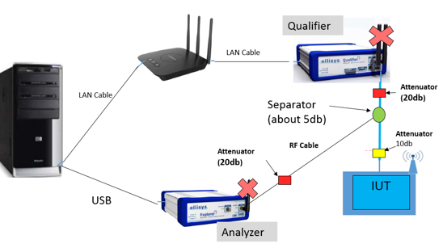

现在SIG要求认证必须同时检测并提供空口log,因此整套认证环境需要强制绑定一个Ellisys分析仪器。Ellisys分析仪器、认证仪和IUT设备三个设备之间通过功分器连接。

需要注意的是Ellisys分析仪器抓到的RSSI如果比较高，需要修改功率或者增加衰减，否则认证仪或Ellisys分析仪器任何一方收不到包，都会导致认证失败，建议认证仪配合20dBm的衰减器。

## 认证准备

1.  按照认证环境搭建好设备，根据实际情况使用串口线将认证仪与便携机连接起来
2.  将蓝牙单板下载好软件（单板固件），启动蓝牙。

## 参数设置

打开EBQ软件，单击Import IXIT，导致参数配置文件。

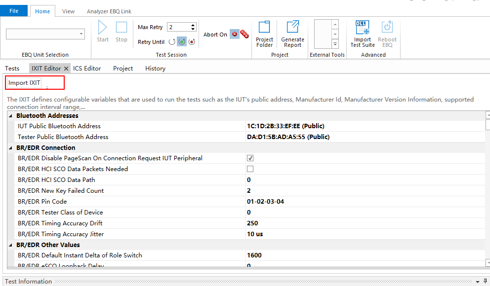

配置导入后能看到关联后的特性ICS Editor，以及TEST用例，连接认证仪器。

Max Retry次数表示用例自动复测次数，如有复测次数限制，需要注意相关设置值。

-   点击START即可开始测试。
-   点击Generate Report 即可导出测试文件和测试结果。

    // 相关配置操作可以找认证中心管理员进行指导。

    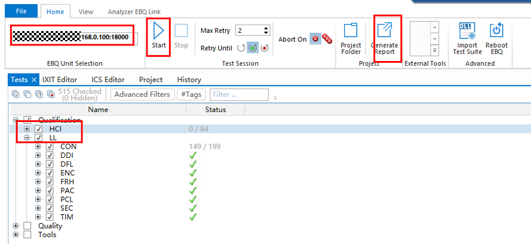

    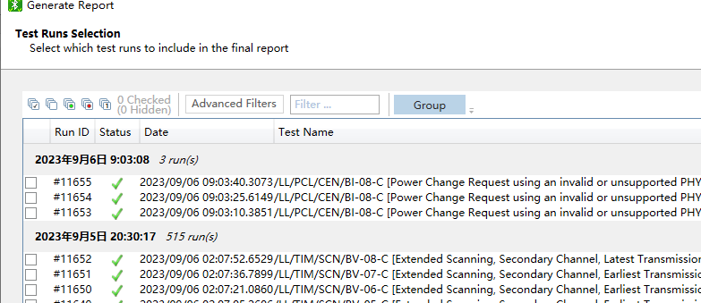

# BQB 射频认证

-   **[射频认证环境](#ZH-CN_TOPIC_0000001993226069)**  

-   **[认证准备和参数](#ZH-CN_TOPIC_0000001993226077)**  

## 射频认证环境

蓝牙射频测试系统是7layers Group独立开发的一套Bluetooth SIG指定测试平台。由主控系统和专用蓝牙信令单元CMW、信令分析仪SA、高低频信号源SG、射频信号分配器SU和射频功率计PM等设备连接组成。设备连接图如[图1](#fig84431117192113)和[图2](#fig18983152214217)所示。

**图 1**  设备连接示意图1  
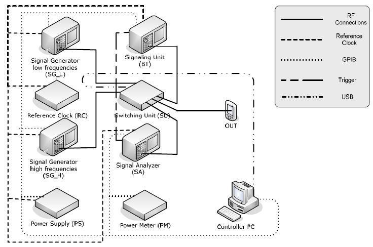

**图 2**  设备连接示意图2  
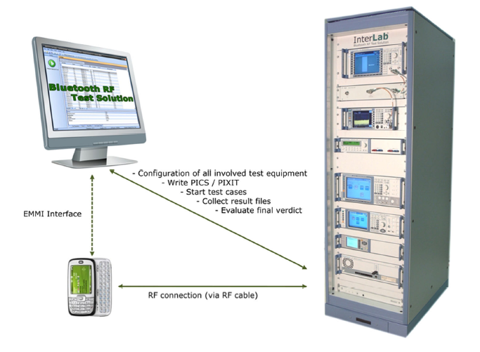

## 认证准备和参数

相关接口及版本下载同协议认证。

认证中心会按照从官网根据勾选规格生成的模板，基于模板导入生成用例，单击开始测试。

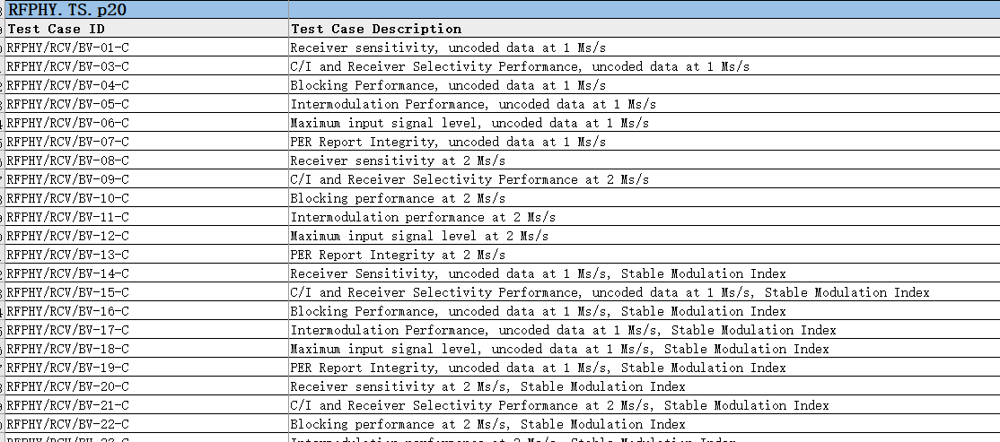

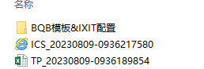

# WS53特性支持情况

WS73认证了**BLE Controller Subsystem**类型，WS53规格同WS73，所以继承WS73的认证结果。

终端、模组厂商可以直接继承芯片的认证结果。

-   支持最新的蓝牙5.4协议。
-   详细产品规格参见产品文档

    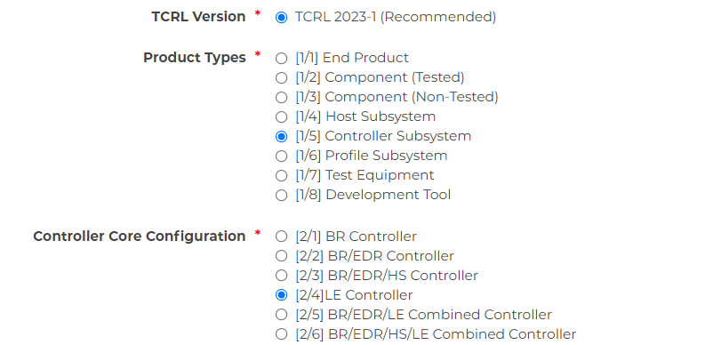

# 常见问题&测试命令汇总\(FAQ\)

-   **[软件版本获取](#ZH-CN_TOPIC_0000001993226073)**  

-   **[串口工具和驱动](#ZH-CN_TOPIC_0000001993105849)**  

-   **[软件启动加载](#ZH-CN_TOPIC_0000001956226732)**  

## 软件版本获取

<table><thead align="left"><tr id="row1012133751"><th class="cellrowborder" valign="top" width="18.22%" id="mcps1.1.6.1.1">
WS53

</th>
<th class="cellrowborder" valign="top" width="17.97%" id="mcps1.1.6.1.2">
认证类型

</th>
<th class="cellrowborder" valign="top" width="21.02%" id="mcps1.1.6.1.3">
软件版本

</th>
<th class="cellrowborder" valign="top" width="16.78%" id="mcps1.1.6.1.4">
测试接口

</th>
<th class="cellrowborder" valign="top" width="26.009999999999998%" id="mcps1.1.6.1.5">
说明

</th>
</tr>
</thead>
<tbody><tr id="row1712113310510"><td class="cellrowborder" rowspan="2" valign="top" width="18.22%" headers="mcps1.1.6.1.1 ">
BLE BQB认证

</td>
<td class="cellrowborder" valign="top" width="17.97%" headers="mcps1.1.6.1.2 ">
协议认证

</td>
<td class="cellrowborder" valign="top" width="21.02%" headers="mcps1.1.6.1.3 ">
device only版本

</td>
<td class="cellrowborder" valign="top" width="16.78%" headers="mcps1.1.6.1.4 ">
HCI串口

</td>
<td class="cellrowborder" rowspan="2" valign="top" width="26.009999999999998%" headers="mcps1.1.6.1.5 "><ol id="ol89471549202410"><li>BLE协议和射频认证，认证仪器需要使用到HCI发送协议消息，必须使用device only版本。</li><li>模组或者产品厂商需要外接HCI口</li></ol>
</td>
</tr>
<tr id="row7121143751"><td class="cellrowborder" valign="top" headers="mcps1.1.6.1.1 ">
射频认证

</td>
<td class="cellrowborder" valign="top" headers="mcps1.1.6.1.2 ">
device only版本

</td>
<td class="cellrowborder" valign="top" headers="mcps1.1.6.1.3 ">
HCI串口

</td>
</tr>
<tr id="row5121731252"><td class="cellrowborder" rowspan="2" valign="top" width="18.22%" headers="mcps1.1.6.1.1 ">
星闪SLE认证

</td>
<td class="cellrowborder" valign="top" width="17.97%" headers="mcps1.1.6.1.2 ">
协议认证

</td>
<td class="cellrowborder" valign="top" width="21.02%" headers="mcps1.1.6.1.3 ">
device only版本

/产测版本

</td>
<td class="cellrowborder" valign="top" width="16.78%" headers="mcps1.1.6.1.4 ">
HCI串口/AT串口

</td>
<td class="cellrowborder" rowspan="2" valign="top" width="26.009999999999998%" headers="mcps1.1.6.1.5 ">
星闪认证，产测版本可以支持射频测试命令发送

</td>
</tr>
<tr id="row161221939511"><td class="cellrowborder" valign="top" headers="mcps1.1.6.1.1 ">
射频认证

</td>
<td class="cellrowborder" valign="top" headers="mcps1.1.6.1.2 ">
device only版本

/产测版本

</td>
<td class="cellrowborder" valign="top" headers="mcps1.1.6.1.3 ">
HCI串口/AT串口

</td>
</tr>
</tbody>
</table>

默认软件版本对应的串口信息如下, 如果产品或者模组存在管脚占用，需要单独联系。

HCI串口：UART波特率115200, 对应UART2

AT串口：UART波特率115200，对应UART0

## 串口工具和驱动

-   sscom.5.13.1

    https://mydown.yesky.com/pcsoft/413551036.html

-   串口小板的驱动

    https://www.driverguide.com/driver/detail.php?driverid=2041464

-   版本烧写，使用burntools工具

## 软件启动加载

1.  下载软件，启动蓝牙服务：BQB认证是使用BTC only版本（请从SDK发布包中“BQB以及星闪认证镜像”目录中获取），HCI命令口接串口小板使用（4层板位置J16）。

    HCI串口UART波特率为115200。

    

2.  软件启动：

    btc only烧完版本后直接复位即可本地启动，可用于协议或者射频测试。

