# 前言<a name="ZH-CN_TOPIC_0000001807760396"></a>

**概述<a name="section4537382116410"></a>**

本文档详细描述了WS53 Syschannel组件的使用，帮助用户更好地利用Syschannel组件开发产品。

**产品版本<a name="section27775771"></a>**

与本文档相对应的产品版本如下。

<a name="table52250146"></a>
<table><thead align="left"><tr id="row55967882"><th class="cellrowborder" valign="top" width="39.39%" id="mcps1.1.3.1.1"><p id="p37104584"><a name="p37104584"></a><a name="p37104584"></a><strong id="b48174912328"><a name="b48174912328"></a><a name="b48174912328"></a>产品名称</strong></p>
</th>
<th class="cellrowborder" valign="top" width="60.61%" id="mcps1.1.3.1.2"><p id="p52681331"><a name="p52681331"></a><a name="p52681331"></a><strong id="b682239163211"><a name="b682239163211"></a><a name="b682239163211"></a>产品版本</strong></p>
</th>
</tr>
</thead>
<tbody><tr id="row21488352389"><td class="cellrowborder" valign="top" width="39.39%" headers="mcps1.1.3.1.1 "><p id="p17561800"><a name="p17561800"></a><a name="p17561800"></a>WS53</p>
</td>
<td class="cellrowborder" valign="top" width="60.61%" headers="mcps1.1.3.1.2 "><p id="p13219733"><a name="p13219733"></a><a name="p13219733"></a>V100</p>
</td>
</tr>
</tbody>
</table>

**读者对象<a name="section4378592816410"></a>**

本文档主要适用于以下工程师：

-   技术支持工程师
-   软件工程师
-   硬件工程师
-   测试工程师

**符号约定<a name="section133020216410"></a>**

在本文中可能出现下列标志，它们所代表的含义如下。

<a name="table2622507016410"></a>
<table><thead align="left"><tr id="row1530720816410"><th class="cellrowborder" valign="top" width="20.580000000000002%" id="mcps1.1.3.1.1"><p id="p6450074116410"><a name="p6450074116410"></a><a name="p6450074116410"></a><strong id="b2136615816410"><a name="b2136615816410"></a><a name="b2136615816410"></a>符号</strong></p>
</th>
<th class="cellrowborder" valign="top" width="79.42%" id="mcps1.1.3.1.2"><p id="p5435366816410"><a name="p5435366816410"></a><a name="p5435366816410"></a><strong id="b5941558116410"><a name="b5941558116410"></a><a name="b5941558116410"></a>说明</strong></p>
</th>
</tr>
</thead>
<tbody><tr id="row1372280416410"><td class="cellrowborder" valign="top" width="20.580000000000002%" headers="mcps1.1.3.1.1 "><p id="p3734547016410"><a name="p3734547016410"></a><a name="p3734547016410"></a><a name="image2670064316410"></a><a name="image2670064316410"></a><span></span></p>
</td>
<td class="cellrowborder" valign="top" width="79.42%" headers="mcps1.1.3.1.2 "><p id="p1757432116410"><a name="p1757432116410"></a><a name="p1757432116410"></a>表示如不避免则将会导致死亡或严重伤害的具有高等级风险的危害。</p>
</td>
</tr>
<tr id="row466863216410"><td class="cellrowborder" valign="top" width="20.580000000000002%" headers="mcps1.1.3.1.1 "><p id="p1432579516410"><a name="p1432579516410"></a><a name="p1432579516410"></a><a name="image4895582316410"></a><a name="image4895582316410"></a><span></span></p>
</td>
<td class="cellrowborder" valign="top" width="79.42%" headers="mcps1.1.3.1.2 "><p id="p959197916410"><a name="p959197916410"></a><a name="p959197916410"></a>表示如不避免则可能导致死亡或严重伤害的具有中等级风险的危害。</p>
</td>
</tr>
<tr id="row123863216410"><td class="cellrowborder" valign="top" width="20.580000000000002%" headers="mcps1.1.3.1.1 "><p id="p1232579516410"><a name="p1232579516410"></a><a name="p1232579516410"></a><a name="image1235582316410"></a><a name="image1235582316410"></a><span></span></p>
</td>
<td class="cellrowborder" valign="top" width="79.42%" headers="mcps1.1.3.1.2 "><p id="p123197916410"><a name="p123197916410"></a><a name="p123197916410"></a>表示如不避免则可能导致轻微或中度伤害的具有低等级风险的危害。</p>
</td>
</tr>
<tr id="row5786682116410"><td class="cellrowborder" valign="top" width="20.580000000000002%" headers="mcps1.1.3.1.1 "><p id="p2204984716410"><a name="p2204984716410"></a><a name="p2204984716410"></a><a name="image4504446716410"></a><a name="image4504446716410"></a><span></span></p>
</td>
<td class="cellrowborder" valign="top" width="79.42%" headers="mcps1.1.3.1.2 "><p id="p4388861916410"><a name="p4388861916410"></a><a name="p4388861916410"></a>用于传递设备或环境安全警示信息。如不避免则可能会导致设备损坏、数据丢失、设备性能降低或其它不可预知的结果。</p>
<p id="p1238861916410"><a name="p1238861916410"></a><a name="p1238861916410"></a>“须知”不涉及人身伤害。</p>
</td>
</tr>
<tr id="row2856923116410"><td class="cellrowborder" valign="top" width="20.580000000000002%" headers="mcps1.1.3.1.1 "><p id="p5555360116410"><a name="p5555360116410"></a><a name="p5555360116410"></a><a name="image799324016410"></a><a name="image799324016410"></a><span></span></p>
</td>
<td class="cellrowborder" valign="top" width="79.42%" headers="mcps1.1.3.1.2 "><p id="p4612588116410"><a name="p4612588116410"></a><a name="p4612588116410"></a>对正文中重点信息的补充说明。</p>
<p id="p1232588116410"><a name="p1232588116410"></a><a name="p1232588116410"></a>“说明”不是安全警示信息，不涉及人身、设备及环境伤害信息。</p>
</td>
</tr>
</tbody>
</table>

**修改记录<a name="section2467512116410"></a>**

<a name="table1557726816410"></a>
<table><thead align="left"><tr id="row2942532716410"><th class="cellrowborder" valign="top" width="14.860000000000001%" id="mcps1.1.4.1.1"><p id="p3778275416410"><a name="p3778275416410"></a><a name="p3778275416410"></a><strong id="b5687322716410"><a name="b5687322716410"></a><a name="b5687322716410"></a>文档版本</strong></p>
</th>
<th class="cellrowborder" valign="top" width="14.510000000000002%" id="mcps1.1.4.1.2"><p id="p5627845516410"><a name="p5627845516410"></a><a name="p5627845516410"></a><strong id="b5800814916410"><a name="b5800814916410"></a><a name="b5800814916410"></a>发布日期</strong></p>
</th>
<th class="cellrowborder" valign="top" width="70.63000000000001%" id="mcps1.1.4.1.3"><p id="p2382284816410"><a name="p2382284816410"></a><a name="p2382284816410"></a><strong id="b3316380216410"><a name="b3316380216410"></a><a name="b3316380216410"></a>修改说明</strong></p>
</th>
</tr>
</thead>
<tbody><tr id="row4300161223814"><td class="cellrowborder" valign="top" width="14.860000000000001%" headers="mcps1.1.4.1.1 "><p id="p18301161213816"><a name="p18301161213816"></a><a name="p18301161213816"></a>06</p>
</td>
<td class="cellrowborder" valign="top" width="14.510000000000002%" headers="mcps1.1.4.1.2 "><p id="p23013129389"><a name="p23013129389"></a><a name="p23013129389"></a>2026-04-20</p>
</td>
<td class="cellrowborder" valign="top" width="70.63000000000001%" headers="mcps1.1.4.1.3 "><p id="p19810202832819"><a name="p19810202832819"></a><a name="p19810202832819"></a>新增“<a href="#ZH-CN_TOPIC_0000002454438370">Syschannel收发包维测统计</a>”小节内容。</p>
</td>
</tr>
<tr id="row139601181076"><td class="cellrowborder" valign="top" width="14.860000000000001%" headers="mcps1.1.4.1.1 "><p id="p596114813717"><a name="p596114813717"></a><a name="p596114813717"></a>05</p>
</td>
<td class="cellrowborder" valign="top" width="14.510000000000002%" headers="mcps1.1.4.1.2 "><p id="p89611181717"><a name="p89611181717"></a><a name="p89611181717"></a>2025-05-28</p>
</td>
<td class="cellrowborder" valign="top" width="70.63000000000001%" headers="mcps1.1.4.1.3 "><p id="p643581713716"><a name="p643581713716"></a><a name="p643581713716"></a>更新“<a href="#ZH-CN_TOPIC_0000002024485321">SDIO探卡成功，但收发包异常，应该如何排查？</a>”小节内容。</p>
</td>
</tr>
<tr id="row1930314332118"><td class="cellrowborder" valign="top" width="14.860000000000001%" headers="mcps1.1.4.1.1 "><p id="p1730323152111"><a name="p1730323152111"></a><a name="p1730323152111"></a>04</p>
</td>
<td class="cellrowborder" valign="top" width="14.510000000000002%" headers="mcps1.1.4.1.2 "><p id="p11304113202111"><a name="p11304113202111"></a><a name="p11304113202111"></a>2025-01-14</p>
</td>
<td class="cellrowborder" valign="top" width="70.63000000000001%" headers="mcps1.1.4.1.3 "><a name="ul1284310452219"></a><a name="ul1284310452219"></a><ul id="ul1284310452219"><li>更新“<a href="#ZH-CN_TOPIC_0000001807760400">API 使用指南</a>”小节内容。</li><li>更新“<a href="#ZH-CN_TOPIC_0000002017346009">如何配置SDIO GPIO中断模式？</a>”小节内容。</li><li>更新“<a href="#ZH-CN_TOPIC_0000002024485321">SDIO探卡成功，但收发包异常，应该如何排查？</a>”小节内容。</li></ul>
</td>
</tr>
<tr id="row394024442420"><td class="cellrowborder" valign="top" width="14.860000000000001%" headers="mcps1.1.4.1.1 "><p id="p3561114715209"><a name="p3561114715209"></a><a name="p3561114715209"></a>03</p>
</td>
<td class="cellrowborder" valign="top" width="14.510000000000002%" headers="mcps1.1.4.1.2 "><p id="p105616476206"><a name="p105616476206"></a><a name="p105616476206"></a>2024-11-25</p>
</td>
<td class="cellrowborder" valign="top" width="70.63000000000001%" headers="mcps1.1.4.1.3 "><a name="ul6774195511277"></a><a name="ul6774195511277"></a><ul id="ul6774195511277"><li>新增“<a href="#ZH-CN_TOPIC_0000002058921245">AOV场景支持</a>”小节内容。</li><li>更新“<a href="#ZH-CN_TOPIC_0000002017425473">Syschannel适配总体流程是什么？</a>”小节内容。</li><li>更新“<a href="#ZH-CN_TOPIC_0000002024485321">SDIO探卡成功，但收发包异常，应该如何排查？</a>”小节内容。</li></ul>
</td>
</tr>
<tr id="row3176112712301"><td class="cellrowborder" valign="top" width="14.860000000000001%" headers="mcps1.1.4.1.1 "><p id="p417620277307"><a name="p417620277307"></a><a name="p417620277307"></a>02</p>
</td>
<td class="cellrowborder" valign="top" width="14.510000000000002%" headers="mcps1.1.4.1.2 "><p id="p317642723020"><a name="p317642723020"></a><a name="p317642723020"></a>2024-09-06</p>
</td>
<td class="cellrowborder" valign="top" width="70.63000000000001%" headers="mcps1.1.4.1.3 "><a name="ul4791623175317"></a><a name="ul4791623175317"></a><ul id="ul4791623175317"><li>更新“<a href="#ZH-CN_TOPIC_0000001854599081">芯片间心跳机制</a>”小节内容。</li><li>更新“<a href="#ZH-CN_TOPIC_0000002038010537">待机唤醒配置</a>”小节内容。</li><li>更新“<a href="#ZH-CN_TOPIC_0000001854719077">Syschannel 组件编译</a>”小节内容。</li><li>更新“<a href="#ZH-CN_TOPIC_0000001980547172">Syschannel 适配常见问题</a>”小节内容。</li></ul>
</td>
</tr>
<tr id="row152875919426"><td class="cellrowborder" valign="top" width="14.860000000000001%" headers="mcps1.1.4.1.1 "><p id="p4286596425"><a name="p4286596425"></a><a name="p4286596425"></a>01</p>
</td>
<td class="cellrowborder" valign="top" width="14.510000000000002%" headers="mcps1.1.4.1.2 "><p id="p42885911421"><a name="p42885911421"></a><a name="p42885911421"></a>2024-08-08</p>
</td>
<td class="cellrowborder" valign="top" width="70.63000000000001%" headers="mcps1.1.4.1.3 "><p id="p1540913514414"><a name="p1540913514414"></a><a name="p1540913514414"></a>第一次正式版本发布。</p>
<a name="ul68271755320"></a><a name="ul68271755320"></a><ul id="ul68271755320"><li>更新“<a href="#ZH-CN_TOPIC_0000001807920228">Syschannel 组件初始化</a>”小节内容。</li><li>更新“<a href="#ZH-CN_TOPIC_0000001807920232">Repeater转发规则开发</a>”小节内容。</li><li>更新“<a href="#ZH-CN_TOPIC_0000001854719077">Syschannel 组件编译</a>”小节内容。</li><li>新增“<a href="#ZH-CN_TOPIC_0000001980547172">Syschannel 适配常见问题</a>”章节内容。</li></ul>
</td>
</tr>
<tr id="row6491111210531"><td class="cellrowborder" valign="top" width="14.860000000000001%" headers="mcps1.1.4.1.1 "><p id="p3491171219530"><a name="p3491171219530"></a><a name="p3491171219530"></a>00B05</p>
</td>
<td class="cellrowborder" valign="top" width="14.510000000000002%" headers="mcps1.1.4.1.2 "><p id="p13491151265312"><a name="p13491151265312"></a><a name="p13491151265312"></a>2024-07-15</p>
</td>
<td class="cellrowborder" valign="top" width="70.63000000000001%" headers="mcps1.1.4.1.3 "><p id="p205071221115314"><a name="p205071221115314"></a><a name="p205071221115314"></a>更新“<a href="#ZH-CN_TOPIC_0000001807760400">API 使用指南</a>”小节内容。</p>
</td>
</tr>
<tr id="row109491717102511"><td class="cellrowborder" valign="top" width="14.860000000000001%" headers="mcps1.1.4.1.1 "><p id="p970120255254"><a name="p970120255254"></a><a name="p970120255254"></a>00B04</p>
</td>
<td class="cellrowborder" valign="top" width="14.510000000000002%" headers="mcps1.1.4.1.2 "><p id="p15949417172510"><a name="p15949417172510"></a><a name="p15949417172510"></a>2024-06-11</p>
</td>
<td class="cellrowborder" valign="top" width="70.63000000000001%" headers="mcps1.1.4.1.3 "><p id="p131071719172512"><a name="p131071719172512"></a><a name="p131071719172512"></a>更新“<a href="#ZH-CN_TOPIC_0000001854719077">Syschannel 组件编译</a>”小节内容。</p>
</td>
</tr>
<tr id="row1529912311957"><td class="cellrowborder" valign="top" width="14.860000000000001%" headers="mcps1.1.4.1.1 "><p id="p1029923116510"><a name="p1029923116510"></a><a name="p1029923116510"></a>00B03</p>
</td>
<td class="cellrowborder" valign="top" width="14.510000000000002%" headers="mcps1.1.4.1.2 "><p id="p1299103117513"><a name="p1299103117513"></a><a name="p1299103117513"></a>2024-05-11</p>
</td>
<td class="cellrowborder" valign="top" width="70.63000000000001%" headers="mcps1.1.4.1.3 "><p id="p1164342858"><a name="p1164342858"></a><a name="p1164342858"></a>更新“<a href="#ZH-CN_TOPIC_0000001854719077">Syschannel 组件编译</a>”小节内容。</p>
</td>
</tr>
<tr id="row168312613309"><td class="cellrowborder" valign="top" width="14.860000000000001%" headers="mcps1.1.4.1.1 "><p id="p1168396153015"><a name="p1168396153015"></a><a name="p1168396153015"></a>00B02</p>
</td>
<td class="cellrowborder" valign="top" width="14.510000000000002%" headers="mcps1.1.4.1.2 "><p id="p146835619309"><a name="p146835619309"></a><a name="p146835619309"></a>2024-04-07</p>
</td>
<td class="cellrowborder" valign="top" width="70.63000000000001%" headers="mcps1.1.4.1.3 "><p id="p8530181308"><a name="p8530181308"></a><a name="p8530181308"></a>更新“<a href="#ZH-CN_TOPIC_0000001807920232">Repeater转发规则开发</a>”小节内容。</p>
</td>
</tr>
<tr id="row5947359616410"><td class="cellrowborder" valign="top" width="14.860000000000001%" headers="mcps1.1.4.1.1 "><p id="p2149706016410"><a name="p2149706016410"></a><a name="p2149706016410"></a>00B01</p>
</td>
<td class="cellrowborder" valign="top" width="14.510000000000002%" headers="mcps1.1.4.1.2 "><p id="p648803616410"><a name="p648803616410"></a><a name="p648803616410"></a>2024-03-06</p>
</td>
<td class="cellrowborder" valign="top" width="70.63000000000001%" headers="mcps1.1.4.1.3 "><p id="p1946537916410"><a name="p1946537916410"></a><a name="p1946537916410"></a>第一次临时版本发布。</p>
</td>
</tr>
</tbody>
</table>

# Syschannel 简介<a name="ZH-CN_TOPIC_0000001854599077"></a>

Syschannel 组件主要用于低功耗解决方案，例如Camera场景，其主要功能是搭建一个主控芯片（Host）与Wi-Fi芯片（Device）通信的通道（注意后续内容中提到的Host侧指Camera等不具备Wi-Fi功能的主控芯片，Device侧指WS53 Wi-Fi芯片），该通道可细分为两个子通道：

-   Msg通道：主要用于传输用户自定义消息至Device。
-   Data通道：主要用于传输网络数据包。

Syschannel组件软件运行在Host、Device两侧，支持1线和4线SDIO，Syschannel组件基本框架如[图1](#fig143812541511)所示。

**图 1**  Syschannel组件基本框架图<a name="fig143812541511"></a>  
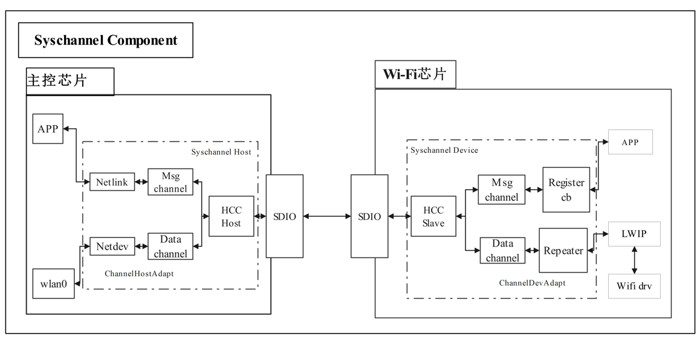

Syschannel通道支持承载消息和报文，包含Syschannel Host子系统、Syschannel Device子系统。下面对每个模块的主要功能做简要介绍。

Syschannel Host子系统：运行在主控芯片上，通过SDIO/SPI/UART总线与Wi-Fi芯片上的Syschannel Device子系统通信，主要包含ChannelHostAdapt模块，虚拟网卡适配模块、HCC Host模块：

-   wlan0：Host侧软件部分虚拟出的一个wlan0网络接口，与正常网络接口无区别，主要用于接收/发送网络数据包
-   ChannelHostAdapt模块：负责与Syschannel Device子系统建立HCC通信通道。
-   虚拟网卡适配模块：负责向协议栈注册虚拟网卡，通过HCC接口实现协议栈到SDIO/SPI/UART总线的报文收发。
-   HCC Host模块：负责屏蔽SDIO/SPI/UART总线差异，为上层业务提供统一的数据收发接口。

Syschannel Device子系统：运行在Wi-Fi芯片上，通过SDIO/SPI/UART总线与Syschannel Host子系统通信，主要包换ChannelDevtAdapt模块和Repeater模块：

-   ChannelDevtAdapt模块：负责与Syschannel Host子系统建立HCC通信通道；
-   Repeater模块：负责根据报文转发规则转发报文。

# Syschannel 使用指南<a name="ZH-CN_TOPIC_0000001854719081"></a>

为了帮助用户快速将Syschannel组件与自身业务对接，本章节Syschannel的基本使用规则做了简要介绍，主要包括以下方面：

-   Syschannel组件初始化
-   Repeater转发规则开发
-   API使用指南
-   芯片间心跳机制
-   待机唤醒配置

-   **[Syschannel 组件初始化](#ZH-CN_TOPIC_0000001807920228)**  

-   **[Repeater转发规则开发](#ZH-CN_TOPIC_0000001807920232)**  

-   **[API 使用指南](#ZH-CN_TOPIC_0000001807760400)**  

-   **[芯片间心跳机制](#ZH-CN_TOPIC_0000001854599081)**  

-   **[待机唤醒配置](#ZH-CN_TOPIC_0000002038010537)**  

-   **[AOV场景支持](#ZH-CN_TOPIC_0000002058921245)**  

-   **[Syschannel收发包维测统计](#ZH-CN_TOPIC_0000002454438370)**  

## Syschannel 组件初始化<a name="ZH-CN_TOPIC_0000001807920228"></a>

Syschannel组件初始化的主要目的是建立主控芯片与Wi-Fi 芯片的通道，保证主、从芯片能够进行网络数据通信和用户自定义消息通信，Syschannel组件初始化流程如[图1](#fig721318157491)所示。

**图 1**  Syschannel组件初始化流程图<a name="fig721318157491"></a>  
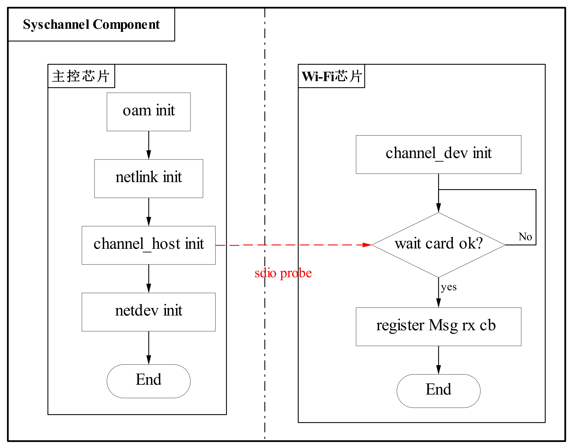

各初始化模块描述如下：

-   Host侧：
    -   oam init：初始化维测模块。
    -   netlink init：netlink初始化，主要用于建立用户态与内核态信息传递。
    -   channel\_host init：初始化Syschannel 通信的 Host侧必要资源（init Tx/Rx queue,  流控，sdio probe等）。
    -   netdev init：创建网络节点，用于接受/发送网络数据包。

-   Device侧：
    -   channel\_dev init：HCC Slave初始化，SDIO持续处于等卡状态，探卡成功初始化流程才能继续执行。
    -   register Msg rx cb：注册Device侧接收消息回调函数，主要用于用户个性化业务开发。用户在回调函数中，不能做阻塞、流程较长的业务。如果由于业务所需，用户需切换至新的task中去完成该业务。

用户可通过Syschannel 初始化的典型流程快速熟悉初始化流程，具体内容如下：

1.  Device侧启动一个task，初始化sdio device，在系统启动时调用。demo如下所示。

    ```
    static int *sdio_init_task_body(osal_void *param)
    {
        printf("start sdio init\r\n");
        unused(param);
        /* To prevent watchdog exceptions caused by SDIO host, disable the watchdog first. */
        uapi_watchdog_disable();  
    
    #ifndef CONFIG_FACTORY_TEST_MODE
    #ifdef _PRE_SYSCHANNEL_FEATURE
        if (uapi_syschannel_dev_init(SDIO_TYPE) != HI_ERR_SUCCESS) {
            printf("syschannel_init:: syschannel_dev_init failed");
            uapi_watchdog_enable();
            return 0;
        }
    #endif
    #endif
        uapi_watchdog_enable();
     
        printf("finish sdio init\r\n");
        return 0;
    }
    ```

    ```
    osal_u32 app_sdio_init(osal_void)
    {
        if (osal_kthread_create(sdio_init_task_body, NULL, "sdio_init", 0) == NULL) {
            printf("Falied to create sdio init task!\n");
            return OSAL_NOK;
        }
        return OSAL_OK;
    }
    ```

2.  注册lwip协议栈网络节点属性（ip地址，网关等）变化的回调函数。对应的API为netifapi\_netif\_add\_ext\_callback。
3.  注册虚拟网络接口。对应的API为syschannel\_init\_netdev。
4.  设置默认Repeater模块转发规则。对应的API为syschannel\_set\_default\_filter。

    完成以上操作后，Device侧初始化暂时停止；直到Host侧Syschannel初始化动作完成，Device侧初始化流程继续进行。

    Host侧加载syschannel.ko的具体命令为：

    ```
    insmod syschannel.ko
    ```

5.  Device侧wait card成功后，初始化channel device资源。对应的API为syschannel\_dev\_init。
6.  注册Device侧接收Host侧发送消息的回调函数。对应的API 为syschannel\_register\_rx\_cb。

> **说明：** 
>Syschannel初始化完成后不能再进行wlan\_init操作，wlan\_init中会重新给SDIO credit扩展寄存器进行赋初值，导致Syschannel驱动（Host侧）中通过查询该寄存器值来获取Syschannel收包信息有误。

## Repeater转发规则开发<a name="ZH-CN_TOPIC_0000001807920232"></a>

Syschannel组件提供网络转发功能。通过调用Repeater相关API，设置特定网络包的转发方向。Host侧可以使用Device侧驱动，通过Repeater模块将Device收到的报文转发到Host侧，从而实现接收Wi-Fi网络包。

由于Host与Device共用网络配置（MAC、IPv4/IPv6 addr、netmask、gateway），Syschannel组件连接建立后用户在Host侧可以直接使用Device侧网络接口向外网发送网络包。

对于发送到外部的网络包，Host侧和Device侧互不影响，并统一通过Device侧Wi-Fi向外发送（发送不涉及转发规则，只由Device侧发送，Host侧的报文也通过SDIO传送给Device侧发送）。

对于从外部接收进来的网络包，Device侧收到之后依据网络包属性和调用Repeater API所设置的转发规则转发到Host侧或者Device侧。

Device侧接收到报文之后的转发处理如下：

-   来自外部的ICMP、IGMP和ARP给Host和Device均会转发一份，无需配置转发规则，Repeater内部已实现。
-   接收到外部的包但未匹配上任何转发规则，按默认规则进行转发（Syschannel已经设置为转发到Host侧）。
-   接收到外部的包并匹配上所设置的特定转发规则（IP、协议类型、端口、端口范围），按照配置的转发方向转给对应的目标（Host或Device）。

在初始化的时候根据具体的报文属性设置特定转发规则，转发规则支持配置IPv4和IPv6报文的转发方向。以IPv4举例（IPv6同IPv4类似），配置转发规则的具体方法如下。

```
syschannel_ipv4_filter_stru filter_ipv4 = {0};    /* 定义转发规则结构体变量 */
filter_ipv4.local_port = 5001;                 /* 设置本端端口号，即报文携带的目的端口号需要为5001 */
filter_ipv4.packet_type = 17;                  /*  设置报文类型需要为UDP报文，UDP为17，TCP为6 */
filter_ipv4.remotep_min = 8000;                /* 设置报文对端端口范围最小值为8000(包含8000) */
filter_ipv4.remotep_max = 9000;                /* 设置报文对端端口范围最大值为9000(包含9000) ，即源端口范围为[8000, 9000]*/
filter_ipv4.match_mask = WIFI_FILTER_MASK_LOCAL_PORT | WIFI_FILTER_MASK_PROTOCOL | WIFI_FILTER_MASK_REMOTE_PORT_RANGE;            /* 掩码字段配置需要同时匹配本端端口号、协议类型、对端端口范围 */
filter_ipv4.config_type = WIFI_FILTER_LWIP;    /* 配置匹配本转发规则的报文转发到Device侧，LWIP为Device侧，VLWIP为Host侧 */
ret = syschannel_add_filter((hi_char*)&filter_ipv4, sizeof(filter_ipv4), WIFI_FILTER_TYPE_IPV4);  /* 调用API接口 syschannel_add_filter将本IPv4转发规则配置生效 */
```

其中转发规则结构体各字段定义如下：

```
typedef struct syschannel_ipv4_filter {
unsigned int   remote_ip;            /*  选设字段，指定接收报文携带的对端IP地址。即报文中的源IP地址 */
unsigned short local_port;           /*  选设字段，指定接收报文对应的本端端口号。由于设备是接收方，即为对应报文携带的目的端口号 */
unsigned short localp_min;           /*  选设字段，指定接收报文对应的本端端口范围最小值。由于设备是接收方，即为对应报文的目的端口号范围最小值 */
unsigned short localp_max;           /*  选设字段，指定接收报文对应的本端端口范围最大值。由于设备是接收方，即为对应报文的目的端口号范围最大值，最大值需大于最小值 */
unsigned short remote_port;          /*  选设字段，指定接收报文对应的对端端口号。由于设备是接收方，即为对应报文携带的源端口号 */
unsigned short remotep_min;          /*  选设字段，指定接收报文对应的对端端口范围最小值。由于设备是接收方，即为对应报文的源端口号范围最小值 */
unsigned short remotep_max;          /*  选设字段，指定接收报文对应的对端端口范围最大值。由于设备是接收方，即为对应报文的源端口号范围最大值，最大值需大于最小值 */
unsigned char  packet_type;          /*   选设字段，指定接收报文采用的传输层协议，一般指定为TCP（6）或者UDP（17） */
unsigned char  config_type;          /*   必设字段，设置匹配本转发规则的报文的转发方向， 设置为WIFI_FILTER_LWIP转发到Device侧，设置为WIFI_FILTER_VLWIP转发到Host侧，WIFI_FILTER_BOTH则两边都转发 */
unsigned char  match_mask;           /*   必设字段，指定上述哪些选设字段是有效值，每个选设字段通过对应Bit掩码置位。置位之后代表需要同时满足匹配该字段，例如 WIFI_FILTER_MASK_IP | WIFI_FILTER_MASK_PROTOCOL 值为0x1 | 0x2 = 0x3,表示报文需要同时满足匹配源IP地址和协议类型（TCP或UDP）才匹配本规则，匹配之后按照config_type指定的方向转发本报文 */
unsigned char  resv;                  /*  保留字段 */
}syschannel_ipv4_filter_stru;
```

上述“syschannel\_ipv4\_filter\_stru”结构中match\_mask字段，通过掩码枚举值对应的组合来定义（IPv6也采用同样掩码枚举值）。例如“WIFI\_FILTER\_MASK\_IP | WIFI\_FILTER\_MASK\_LOCAL\_PORT | WIFI\_FILTER\_MASK\_REMOTE\_PORT\_RANGE”表示报文需要同时匹配上指定的源IP地址、本端端口号（即目的端口号）和对端端口号范围（即源端口号范围）才算匹配本条规则。

```
typedef enum {
WIFI_FILTER_MASK_IP                = 0x01,         /*  掩码枚举：表示源IP地址，对应remote_ip字段，不指定则表示该字段不作为匹配条件 */
WIFI_FILTER_MASK_PROTOCOL          = 0x02,         /*  掩码枚举：协议类型（TCP或UDP)，对应packet_type字段，不指定则表示该字段不作为匹配条件 */
WIFI_FILTER_MASK_LOCAL_PORT        = 0x04,         /*  掩码枚举：接收到报文的目的端口号，对应local_port字段，不指定则表示该字段不作为匹配条件 */
WIFI_FILTER_MASK_LOCAL_PORT_RANGE  = 0x08,         /*  掩码枚举：接收到报文的目的端口号范围，对应localp_min和localp_max字段，不指定则表示该字段不作为匹配条件 */
WIFI_FILTER_MASK_REMOTE_PORT       = 0x10,         /*  掩码枚举：接收到报文的源端口号，对应remote_port字段，不指定则表示该字段不作为匹配条件 */
WIFI_FILTER_MASK_REMOTE_PORT_RANGE = 0x20,         /*  掩码枚举：接收到报文的源端口号范围，对应remotep_min和remotep_max字段，不指定则表示该字段不作为匹配条件 */
WIFI_FILTER_MASK_BUTT
} wifi_filter_field_enum;
```

> **说明：** 
>如果一条规则同时设置了需要匹配报文的源端口号和源端口号范围，则Repeater会优先匹配指定的源端口号。
>-   如果源端口号不匹配，则再去匹配指定的源端口号范围。
>-   如果源端口号可以匹配，则认为源端口号范围也已匹配。
>对于同时匹配报文的目的端口号和目的端口号范围的场景也类似。

Syschannel组件Repeater相关API如下：

-   uapi\_syschannel\_set\_default\_filter
-   uapi\_syschannel\_add\_filter
-   uapi\_syschannel\_del\_filter
-   uapi\_syschannel\_query\_filter

在实际应用中，一般Device侧网络应用较少，如果Device侧有业务交互需求，如通过DHCP获取IP地址，可添加对应转发到Device侧的转发规则。如果服务器提供独立端口专供Device侧进行业务交互，则可用此远端端口号作为转发规则识别并转发来自该服务器的报文到Device侧。

UDP端口67（DHCP server端口号）、68（DHCP client端口号）需配置为转发到Device侧，这两个端口为DHCP帧的收发端口，不应用于其他用途。

Syschannel已经设置默认收到的报文都转发给Host侧，当Device侧为STA时，需要通过收发DHCP包来获取IP地址，DHCP客户端口为68，协议为UDP，则需要添加一个转发规则转发到Device侧：

```
filter_ipv4.local_port = 68;                              /*  配置本规则需匹配目的端口号为68的包(发给DHCP客户端) */
filter_ipv4.packet_type = 17;                             /* UDP 17, TCP 6。配置本规则需匹配协议类型为UDP的包(DHCP包为UDP包) */
filter_ipv4.match_mask = WIFI_FILTER_MASK_LOCAL_PORT | WIFI_FILTER_MASK_PROTOCOL;   /* 掩码字段配置需要同时匹配本端端口号、协议类型 */
filter_ipv4.config_type = WIFI_FILTER_LWIP;               /* 配置匹配本转发规则的报文转发到Device侧。LWIP为Device侧，VLWIP为Host侧 */
```

然后调用uapi\_syschannel\_add\_filter函数添加该规则（syschannel\_set\_default\_filter中已经包含如下代码，用户无需额外设置）。

## API 使用指南<a name="ZH-CN_TOPIC_0000001807760400"></a>

Syschannel提供的API如[表1](#table1824411372614)和[表2](#table263122154711)所示。

**表 1**  Device侧Syschannel提供的API接口

<a name="table1824411372614"></a>
<table><thead align="left"><tr id="row32456379619"><th class="cellrowborder" valign="top" width="41.57%" id="mcps1.2.3.1.1"><p id="p1324519374616"><a name="p1324519374616"></a><a name="p1324519374616"></a>Name</p>
</th>
<th class="cellrowborder" valign="top" width="58.43000000000001%" id="mcps1.2.3.1.2"><p id="p132451937561"><a name="p132451937561"></a><a name="p132451937561"></a>Description</p>
</th>
</tr>
</thead>
<tbody><tr id="row152454373614"><td class="cellrowborder" valign="top" width="41.57%" headers="mcps1.2.3.1.1 "><p id="p424520371969"><a name="p424520371969"></a><a name="p424520371969"></a>uapi_syschannel_set_default_filter</p>
</td>
<td class="cellrowborder" valign="top" width="58.43000000000001%" headers="mcps1.2.3.1.2 "><p id="p32459371861"><a name="p32459371861"></a><a name="p32459371861"></a>设置Repeater默认的过滤转发方向（Syschannel已经设置为转发到Host侧，用户不需要使用该接口再次配置）。</p>
</td>
</tr>
<tr id="row14245173712617"><td class="cellrowborder" valign="top" width="41.57%" headers="mcps1.2.3.1.1 "><p id="p62456378615"><a name="p62456378615"></a><a name="p62456378615"></a>uapi_syschannel_add_filter</p>
</td>
<td class="cellrowborder" valign="top" width="58.43000000000001%" headers="mcps1.2.3.1.2 "><p id="p1024511371367"><a name="p1024511371367"></a><a name="p1024511371367"></a>添加过滤规则到Repeater的转发表。</p>
</td>
</tr>
<tr id="row42458378616"><td class="cellrowborder" valign="top" width="41.57%" headers="mcps1.2.3.1.1 "><p id="p82451837768"><a name="p82451837768"></a><a name="p82451837768"></a>uapi_syschannel_del_filter</p>
</td>
<td class="cellrowborder" valign="top" width="58.43000000000001%" headers="mcps1.2.3.1.2 "><p id="p3245193712618"><a name="p3245193712618"></a><a name="p3245193712618"></a>从Repeater的转发表删除过滤规则。</p>
</td>
</tr>
<tr id="row11679101415715"><td class="cellrowborder" valign="top" width="41.57%" headers="mcps1.2.3.1.1 "><p id="p2679121455715"><a name="p2679121455715"></a><a name="p2679121455715"></a>uapi_syschannel_del_all_filter</p>
</td>
<td class="cellrowborder" valign="top" width="58.43000000000001%" headers="mcps1.2.3.1.2 "><p id="p267916145579"><a name="p267916145579"></a><a name="p267916145579"></a>删除全部过滤规则。</p>
</td>
</tr>
<tr id="row224520379614"><td class="cellrowborder" valign="top" width="41.57%" headers="mcps1.2.3.1.1 "><p id="p16245133714620"><a name="p16245133714620"></a><a name="p16245133714620"></a>uapi_syschannel_query_filter</p>
</td>
<td class="cellrowborder" valign="top" width="58.43000000000001%" headers="mcps1.2.3.1.2 "><p id="p12245103714617"><a name="p12245103714617"></a><a name="p12245103714617"></a>查询Repeater的转发表内容。</p>
</td>
</tr>
<tr id="row1929294514111"><td class="cellrowborder" valign="top" width="41.57%" headers="mcps1.2.3.1.1 "><p id="p1829234514117"><a name="p1829234514117"></a><a name="p1829234514117"></a>uapi_syschannel_dev_init</p>
</td>
<td class="cellrowborder" valign="top" width="58.43000000000001%" headers="mcps1.2.3.1.2 "><p id="p2029274511114"><a name="p2029274511114"></a><a name="p2029274511114"></a>初始化Syschannel，包括收发任务创建、内存池初始化、SDIO状态初始化和中断回调处理函数注册等操作。</p>
</td>
</tr>
<tr id="row57715711129"><td class="cellrowborder" valign="top" width="41.57%" headers="mcps1.2.3.1.1 "><p id="p177711771214"><a name="p177711771214"></a><a name="p177711771214"></a>uapi_syschannel_send_to_host</p>
</td>
<td class="cellrowborder" valign="top" width="58.43000000000001%" headers="mcps1.2.3.1.2 "><p id="p1777197191211"><a name="p1777197191211"></a><a name="p1777197191211"></a>Device发送消息到Host，每次发送数据的最大长度为1500个字节。</p>
</td>
</tr>
<tr id="row6193110171219"><td class="cellrowborder" valign="top" width="41.57%" headers="mcps1.2.3.1.1 "><p id="p31931310141213"><a name="p31931310141213"></a><a name="p31931310141213"></a>uapi_syschannel_dev_reinit</p>
</td>
<td class="cellrowborder" valign="top" width="58.43000000000001%" headers="mcps1.2.3.1.2 "><p id="p121932010151218"><a name="p121932010151218"></a><a name="p121932010151218"></a>重新初始化Syschannel，包括SDIO中断回调处理函数注册和重新进入SDIO初始化流程，等待Host探卡，在给Host上电之前，重新启动一个线程，调用此函数，一直等待Host探卡成功。</p>
</td>
</tr>
<tr id="row1540431416122"><td class="cellrowborder" valign="top" width="41.57%" headers="mcps1.2.3.1.1 "><p id="p194042144127"><a name="p194042144127"></a><a name="p194042144127"></a>uapi_syschannel_register_rx_cb</p>
</td>
<td class="cellrowborder" valign="top" width="58.43000000000001%" headers="mcps1.2.3.1.2 "><p id="p1440481416129"><a name="p1440481416129"></a><a name="p1440481416129"></a>注册接收处理回调函数，用于处理从Host接收到的消息数据。</p>
</td>
</tr>
<tr id="row173991310165918"><td class="cellrowborder" valign="top" width="41.57%" headers="mcps1.2.3.1.1 "><p id="p04000109592"><a name="p04000109592"></a><a name="p04000109592"></a>uapi_syschannel_register_timeout_cb</p>
</td>
<td class="cellrowborder" valign="top" width="58.43000000000001%" headers="mcps1.2.3.1.2 "><p id="p16400161019598"><a name="p16400161019598"></a><a name="p16400161019598"></a>注册心跳超时回调函数。</p>
</td>
</tr>
<tr id="row298210466593"><td class="cellrowborder" valign="top" width="41.57%" headers="mcps1.2.3.1.1 "><p id="p18982846125911"><a name="p18982846125911"></a><a name="p18982846125911"></a>uapi_syschannel_register_dev_reset</p>
</td>
<td class="cellrowborder" valign="top" width="58.43000000000001%" headers="mcps1.2.3.1.2 "><p id="p1598217460595"><a name="p1598217460595"></a><a name="p1598217460595"></a>清空Device侧资源。</p>
</td>
</tr>
<tr id="row85574432418"><td class="cellrowborder" valign="top" width="41.57%" headers="mcps1.2.3.1.1 "><p id="p25576410247"><a name="p25576410247"></a><a name="p25576410247"></a>uapi_syschannel_vlwip_netif_init</p>
</td>
<td class="cellrowborder" valign="top" width="58.43000000000001%" headers="mcps1.2.3.1.2 "><p id="p10557174142420"><a name="p10557174142420"></a><a name="p10557174142420"></a>指定Syschannel使用的网络设备接口（netif）。</p>
</td>
</tr>
</tbody>
</table>

**表 2**  Host侧Syschannel提供的API接口

<a name="table263122154711"></a>
<table><thead align="left"><tr id="row2063120214477"><th class="cellrowborder" valign="top" width="41.57%" id="mcps1.2.3.1.1"><p id="p186319224715"><a name="p186319224715"></a><a name="p186319224715"></a>Name</p>
</th>
<th class="cellrowborder" valign="top" width="58.43000000000001%" id="mcps1.2.3.1.2"><p id="p9631132174720"><a name="p9631132174720"></a><a name="p9631132174720"></a>Description</p>
</th>
</tr>
</thead>
<tbody><tr id="row563111213475"><td class="cellrowborder" valign="top" width="41.57%" headers="mcps1.2.3.1.1 "><p id="p063114218479"><a name="p063114218479"></a><a name="p063114218479"></a>syschannel_host_init</p>
</td>
<td class="cellrowborder" valign="top" width="58.43000000000001%" headers="mcps1.2.3.1.2 "><p id="p76315204717"><a name="p76315204717"></a><a name="p76315204717"></a>初始化Syschannel，打开心跳检测等操作。</p>
</td>
</tr>
<tr id="row13631192204713"><td class="cellrowborder" valign="top" width="41.57%" headers="mcps1.2.3.1.1 "><p id="p16284172525317"><a name="p16284172525317"></a><a name="p16284172525317"></a>syschannel_host_exit</p>
</td>
<td class="cellrowborder" valign="top" width="58.43000000000001%" headers="mcps1.2.3.1.2 "><p id="p18631921471"><a name="p18631921471"></a><a name="p18631921471"></a>去初始化Syschannel，关闭心跳检测等操作。</p>
</td>
</tr>
<tr id="row166311326476"><td class="cellrowborder" valign="top" width="41.57%" headers="mcps1.2.3.1.1 "><p id="p278621121118"><a name="p278621121118"></a><a name="p278621121118"></a>syschannel_handler_register_rx_cb</p>
</td>
<td class="cellrowborder" valign="top" width="58.43000000000001%" headers="mcps1.2.3.1.2 "><p id="p106312214473"><a name="p106312214473"></a><a name="p106312214473"></a>注册消息接收处理回调函数，用于处理从Device接收到的消息。报文接收后上送TCP/IP协议栈，不在该回调函数中处理。</p>
</td>
</tr>
<tr id="row16631152194710"><td class="cellrowborder" valign="top" width="41.57%" headers="mcps1.2.3.1.1 "><p id="p563118219473"><a name="p563118219473"></a><a name="p563118219473"></a>syschannel_tx_msg_adapt</p>
</td>
<td class="cellrowborder" valign="top" width="58.43000000000001%" headers="mcps1.2.3.1.2 "><p id="p963110210473"><a name="p963110210473"></a><a name="p963110210473"></a>Host发送消息到Device，每次发送消息的最大长度为1500个字节。发送报文使用TCP/IP协议栈的发送接口，不能使用该接口发送报文。</p>
</td>
</tr>
</tbody>
</table>

## 芯片间心跳机制<a name="ZH-CN_TOPIC_0000001854599081"></a>

用户产品工作过程中，存在一些异常的场景，例如：Wi-Fi业务连接异常，主控芯片异常重启等。心跳周期和超时次数可在Host侧自定义，默认值如下。心跳开启后，Device侧会同步该心跳参数，从而保持相同的心跳节奏。

```
#define SYSCHANNEL_HB_INTERVAL    1000     /* 默认心跳发包周期1秒 */
#define HB_TIMEOUT_THRESHOLD      3        /* 默认心跳超时次数 */
```

-   针对Wi-Fi业务连接异常场景，需要用户结合本身的业务情况去做定制化心跳机制，目的是快速恢复业务连接。
-   针对主控芯片异常重启场景，Syschannel 链路心跳机制主要作用是快速检测到主控芯片异常，使SDIO Device恢复成等卡状态，从而使主控重启后能快速恢复Syschannel 链路连通性。

    心跳机制默认打开，由Host侧启动，代码位置在syschannel\_host\_adapt.c 文件的syschannel\_host\_init函数中， 具体如下：

    ```
    ret = syschannel_enable_heartbeat(OSAL_TRUE);
    if (ret != OSAL_OK) {
        osal_printk("syschannel_enable_heartbeat failed");
    }
    ```

    Device侧心跳超时后，会回调syschannel\_timeout\_callback函数，用户可在函数内根据实际场景自定义重新上电、探卡等相关逻辑。

    ```
    unsigned int syschannel_timeout_callback(void)
    {
        // 心跳超时后，可选择主动触发重新探卡流程
        // 1. uapi_syschannel_dev_reset(SDIO_TYPE)
        // 2. soc_power_off
        // 3. app_sdio_reinit()
        // 4. soc power on
        return OSAL_OK;
    }   
    ```

    Host侧心跳超时的回调函数功能为空，由用户根据实际场景自定义。

    ```
    osal_u32 syschannel_host_create(osal_void)
    {
        ...
        syschannel_handler->bus_type = SDIO_TYPE;
        syschannel_handler->hcc_id = hcc_id;
        syschannel_handler->inuse = OSAL_TRUE;
        syschannel_handler->rx_func = oal_send_user_msg;    
        syschannel_handler->timeout_func = timeout_func;
        
        return syschannel_host_wait_ready(hcc_id);
    }
    ```

## 待机唤醒配置<a name="ZH-CN_TOPIC_0000002038010537"></a>

本小节主要对主控和WS53待机，唤醒流程进行说明。为实现低功耗解决方案功耗低的目标，在无业务情况下，使主控处于待机或者下电状态；当收到用户数据传输需求时，再使主控芯片处于唤醒状态。

● 主控芯片待机。为了降低功耗，当无数据传输业务时，主控芯片处于下电状态，WS53端可以进入深睡状态，具体流程为：

1.  先复位Syschannel停止发包，调用接口：

    ```
    uapi_syschannel_dev_reset(SDIO_TYPE);
    ```

2.  主控下电，或者进入待机状态；
3.  重新初始化Syschannel，调用接口：

    ```
    app_sdio_reinit();
    ```

4.  打开深睡使能，调用接口：

    ```
    idle_set_open_pm(1);
    ```

● 主控芯片和WS53唤醒流程为：

1.  关闭深睡使能，调用接口：

    ```
    idle_set_open_pm(0);
    ```

2.  主控上电，或者退出待机状态；
3.  Syschannel重新初始化，调用接口：

    ```
    app_sdio_reinit();
    ```

## AOV场景支持<a name="ZH-CN_TOPIC_0000002058921245"></a>

在IPC AOV场景中，IPC主控不下电，存在主控唤醒WS53的场景，此时硬件上需要有GPIO能唤醒WS53，同时WS53可以唤醒IPC主控。硬件示意图如[图1](#fig17774141714254)所示，与主控除了SDIO连接以外，需要有GPIO能相互唤醒。

**图 1**  硬件示意图<a name="fig17774141714254"></a>  
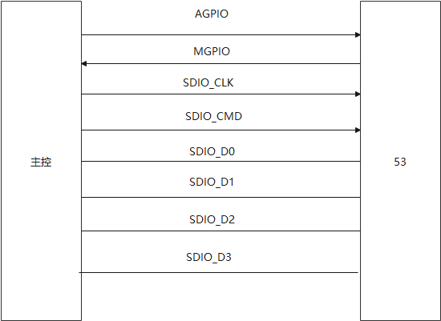

软件实现步骤：

步骤1：Syschannnel建立成功，可以正常进行Syschannel业务。WS53侧使用接口uapi\_syschannel\_register\_suspend\_cb注册处理函数，该接口函数可以调用uapi\_syschannel\_dev\_reset复位Syschannel，然后调用接口使WS53重新进入深睡模式。uapi\_syschannel\_register\_suspend\_cb注册的函数处于中断上下文，不能调用耗时较长的功能。

步骤2：主控调用uapi\_syschannel\_host\_suspend退出Syschannel，该函数会通知到WS53调用uapi\_syschannel\_register\_suspend\_cb注册函数。

步骤3：主控通过AGPIO唤醒WS53，唤醒中断处理需要WS53重新进入SDIO等卡。主控侧调用函数uapi\_syschannel\_host\_resume恢复通道，完成SDIO重新探卡，恢复心跳。

表2 Syschannel AOV场景新增API接口

<a name="table1824411372614"></a>
<table><thead align="left"><tr id="row32456379619"><th class="cellrowborder" valign="top" width="41.57%" id="mcps1.1.3.1.1"><p id="p1324519374616"><a name="p1324519374616"></a><a name="p1324519374616"></a>Name</p>
</th>
<th class="cellrowborder" valign="top" width="58.43000000000001%" id="mcps1.1.3.1.2"><p id="p132451937561"><a name="p132451937561"></a><a name="p132451937561"></a>Description</p>
</th>
</tr>
</thead>
<tbody><tr id="row152454373614"><td class="cellrowborder" valign="top" width="41.57%" headers="mcps1.1.3.1.1 "><p id="p71541055174419"><a name="p71541055174419"></a><a name="p71541055174419"></a>uapi_syschannel_host_resume</p>
</td>
<td class="cellrowborder" valign="top" width="58.43000000000001%" headers="mcps1.1.3.1.2 "><p id="p10135165554416"><a name="p10135165554416"></a><a name="p10135165554416"></a>主控侧API，在主控侧Syschannel恢复通道。因为主控侧要重新探卡，需要WS53侧进入等卡阶段，所以参数增加了探卡等待次数，以及每次尝试探卡的延时ms</p>
</td>
</tr>
<tr id="row17345010486"><td class="cellrowborder" valign="top" width="41.57%" headers="mcps1.1.3.1.1 "><p id="p2357064818"><a name="p2357064818"></a><a name="p2357064818"></a>uapi_syschannel_host_suspend</p>
</td>
<td class="cellrowborder" valign="top" width="58.43000000000001%" headers="mcps1.1.3.1.2 "><p id="p3351609487"><a name="p3351609487"></a><a name="p3351609487"></a>主控侧API，在主控侧退出Syschannel，同时通知WS53</p>
</td>
</tr>
<tr id="row42458378616"><td class="cellrowborder" valign="top" width="41.57%" headers="mcps1.1.3.1.1 "><p id="p82451837768"><a name="p82451837768"></a><a name="p82451837768"></a>uapi_syschannel_register_suspend_cb</p>
</td>
<td class="cellrowborder" valign="top" width="58.43000000000001%" headers="mcps1.1.3.1.2 "><p id="p3245193712618"><a name="p3245193712618"></a><a name="p3245193712618"></a>WS53侧API, 在主控侧退出Syschannel时，WS53注册处理接口。</p>
</td>
</tr>
</tbody>
</table>

Host侧提供命令进行测试：

主动退出Syschannel：

echo syschannel\_suspend \> /sys/hcc\_test\_cmd/hcc\_test\_cmd

主控通过AGPIO唤醒WS53进行等卡，或者WS53侧使用命令（AT+RESYSCHANN）进入等卡。

Host恢复通道命令\(示例中最多尝试100次，每次失败等待10ms\)：

echo syschannel\_resume 100 10 \> /sys/hcc\_test\_cmd/hcc\_test\_cmd

通过cat /sys/hcc\_test\_cmd/hcc\_test\_cmd查看状态。

数值“1”：初始状态;数值“2”：suspend状态;数值“3”：恢复状态。

## Syschannel收发包维测统计<a name="ZH-CN_TOPIC_0000002454438370"></a>

Syschannel提供了Host和Device双向收发包的维测统计，包含主控Host和Device侧的数据包和消息计数统计。方便统计Syschannel的收发报文、消息是否有丢失。

1.  统计命令：AT+SYSCHANSTAT

    正常情况下：Host的TX数据 等于Decice侧的 RX数据+RX alloc fail的数据，如果数据对不上，证明有丢包，需要定位。

    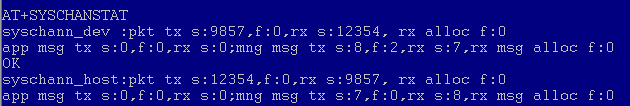

2.  统计清零命令：AT+SYSCHANSTATC

    将Host和Device的统计全局变量全部清零。

    

# Syschannel 编译指导<a name="ZH-CN_TOPIC_0000001854599085"></a>

Syschannel组件作为系统的组成部分，已经默认集成到版本中，并通过宏\_PRE\_SYSCHANNEL\_FEATURE控制。

-   **[Syschannel 组件目录结构](#ZH-CN_TOPIC_0000001807760404)**  

-   **[Syschannel 组件编译](#ZH-CN_TOPIC_0000001854719077)**  

## Syschannel 组件目录结构<a name="ZH-CN_TOPIC_0000001807760404"></a>

Syschannel 组件目录如[图1](#fig727113352820)所示。

**图 1**  Syschannel 组件目录结构<a name="fig727113352820"></a>  
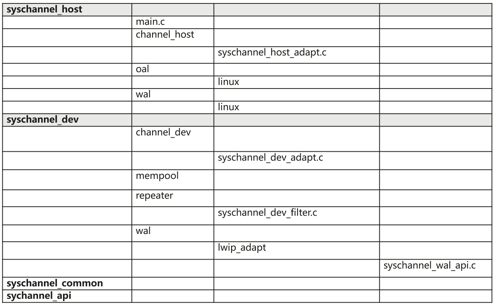

## Syschannel 组件编译<a name="ZH-CN_TOPIC_0000001854719077"></a>

1.  Device侧编译：
    1.  在build/config/target\_config/ws53目录下的config.py文件中，ram\_component增加'syschannel\_dev'模块，目前已默认添加该配置。
    2.  在WS53根目录中执行：

        ```
        python3 build.py -c ws53_liteos_app menuconfig
        ```

        进入menuconfig配置界面并配置如下项：

        Application → 勾选Support Syschannel dev Sample

    3.  执行./build.py -c ws53\_liteos\_app，output/ws53/fwpkg/pack\_all\_core/ws53\_liteos\_app目录生成的ws53\_liteos\_app\_all\_in\_one.fwpkg即集成了Syschannel Device侧组件。

2.  Host侧编译：\(本部分源码在SDK里提供，这里以linux 版本为例介绍编译方法\)
    1.  syschannel.ko单独编译：
        1.  修改编译工具链，打开middleware/utils/syschannel/syschannel\_host/env\_config.mk，修改如下内容：
            -   默认为海思3518EV300平台：

                ```
                CFG_3518EV300 = y
                CFG_T23 = n
                WLAN_CFLAGS +=-D_PRE_OS_PLATFORM=_PRE_PLATFORM_HISILICON
                ```

            -   其他平台，以君正T23平台为例，修改CFG\_3518EV300为n，CFG\_T23为y，以及WLAN\_CFLAGS为相应的配置，如果是其他三方平台，参考下方配置修改：

                ```
                CFG_3518EV300 = n
                CFG_T23 = y
                WLAN_CFLAGS +=-D_PRE_OS_PLATFORM=_PRE_PLATFOMR_JZ
                ```

        2.  修改内核路径，打开、middleware/utils/syschannel/syschannel\_host/Makefile，修改如下内容：
            -   默认为海思3518EV300内核：

                ```
                KDIR ?= ${WLBUS_SDIO_KERNEL_DIR}
                ```

            -   君正T23平台，修改为对应的path，如果是其他三方平台，参考下方配置修改：

                ```
                KDIR ?= /home/shell/kernel_t23
                ```

        3.  cd middleware/utils/syschannel/syschannel\_host
        4.  make clean; make all
        5.  生成目标文件：middleware/utils/syschannel/syschannel\_host/syschannel.ko。

    2.  syschannel.ko跟随镜像一起编译，在build/config/target\_config/ws53目录下的config.py文件中，ram\_component区域添加“syschannel\_host\_ko”模块，目前已默认添加该配置，如不需要Syschannel特性，可自行删除该配置。执行python3 build.py -c ws53\_liteos\_app，在output/ws53/acore/ws53\_liteos\_app目录生成syschannel.ko。
    3.  Sample编译方法：
        1.  修改编译工具链，打开application/samples/wifi/syschannel\_host/linux/base.mak，修改如下内容:
            -   海思3518EV300平台：

                ```
                CFG_HI_TOOLCHAINS_NAME = arm-himix100-linux
                ```

            -   君正T23平台：

                ```
                CFG_HI_TOOLCHAINS_NAME = mips-linux-uclibc-gnu
                ```

        2.  cd application/samples/wifi/syschannel\_host/linux
        3.  make clean; make all
        4.  生成目标文件：application/samples/wifi/syschannel\_host/linux/app/link/sample\_link, application/samples/wifi/syschannel\_host/linux/app/client/sample\_cli
        5.  sample\_link 用于同步WS53侧网络节点的Mac地址信息，命令执行：./sample\_link &；sample\_cli用于发送客户自定义Msg，例如同步ip地址命令执行：./sample\_cli cmd\_get\_ip。

# Syschannel 适配常见问题<a name="ZH-CN_TOPIC_0000001980547172"></a>

-   **[Syschannel适配总体流程是什么？](#ZH-CN_TOPIC_0000002017425473)**  

-   **[SDIO的管脚配置有什么约束？](#ZH-CN_TOPIC_0000001980706060)**  

-   **[如何配置SDIO GPIO中断模式？](#ZH-CN_TOPIC_0000002017346009)**  

-   **[如何编译客户主控平台的syschannel.ko？](#ZH-CN_TOPIC_0000001980865776)**  

-   **[WS53 Syschannel初始化和主控上电时序应该如何保证？](#ZH-CN_TOPIC_0000002017425477)**  

-   **[Syschannel 初始化的任务优先级要配置为多少？](#ZH-CN_TOPIC_0000001980706064)**  

-   **[如何配置取消探卡？](#ZH-CN_TOPIC_0000002017346013)**  

-   **[如何开发Syschannel心跳超时处理流程？](#ZH-CN_TOPIC_0000001980865780)**  

-   **[Syschannel和低功耗的关系是什么，如何适配？](#ZH-CN_TOPIC_0000002017425481)**  

-   **[SDIO探卡成功，但收发包异常，应该如何排查？](#ZH-CN_TOPIC_0000002024485321)**  

-   **[SDIO主控侧的驱动正常工作，还需要做哪些额外适配？](#ZH-CN_TOPIC_0000001988004876)**  

## Syschannel适配总体流程是什么？<a name="ZH-CN_TOPIC_0000002017425473"></a>

1.  参考《WS53V100 SoC Wi-Fi、BLE 和 SLE Combo 芯片 硬件用户指南》“SDIO 接口参考”设计章节，确定SDIO接口设计。
2.  参考《WS53V100 SoC Wi-Fi、BLE 和 SLE Combo 芯片 硬件用户指南》“SDIO 四线模式”章节以及“SDIO 一线模式”章节确认使用SDIO一线模式还是SDIO四线模式，确认所需管脚连接正常。
3.  参考《WS53V100 SoC Wi-Fi、BLE 和 SLE Combo 芯片 硬件用户指南》“SDIO时序”章节，确认主控能否满足WS53的时序要求。
4.  确认SDIO使用哪种中断模式，SDIO 四线/一线模式根据中断方式可以分成两种：一种是GPIO中断方式，另一种是 SDIO 中断方式，推荐使用SDIO中断，SDK默认支持的是SDIO中断模式，如果是GPIO中断模式，需要参考“[如何配置SDIO GPIO中断模式？](#ZH-CN_TOPIC_0000002017346009)”适配。
5.  完成Syschannel 53侧代码开发，参考Syschannel的dev demo示例代码（路径：application/samples/wifi/syschannel\_dev/syschannel\_dev\_sample.c）开发，或者参考“[Syschannel 组件编译](#ZH-CN_TOPIC_0000001854719077)”章节打开demo组件用于调试。重点关注SDIO管脚配置，参考“[SDIO的管脚配置有什么约束？](#ZH-CN_TOPIC_0000001980706060)”。
6.  完成Syschannel主控侧ko编译，参考“[如何编译客户主控平台的syschannel.ko？](#ZH-CN_TOPIC_0000001980865776)”。
7.  调试Syschannel加载流程，先在WS53侧发起等待探卡流程，再给主控上电，主控加载syschannel ko发起SDIO探卡，探卡成功后WS53侧会打印wait card ok。具体说明参考“[WS53 Syschannel初始化和主控上电时序应该如何保证？](#ZH-CN_TOPIC_0000002017425477)”以及“[Syschannel 初始化的任务优先级要配置为多少？](#ZH-CN_TOPIC_0000001980706064)”。
8.  调试Syschannel数据通信，Syschannel探卡/等卡成功后，先在WS53关联AP以及获取IP，在主控侧同步WS53的MAC地址以及IP地址, 然后主控侧ping AP测试数据通信。设置MAC地址以及IP的命令如下：

    ```
    ifconfig wlan0 hw ether 01:03:04:05:06:07
    ifconfig wlan0 192.168.1.100 netmask 255.255.255.0
    ping 192.168.1.1
    ```

## SDIO的管脚配置有什么约束？<a name="ZH-CN_TOPIC_0000001980706060"></a>

在使用 SDIO 一线模式时，SDIO\_D2 和 SDIO\_D3 需要保持悬空状态，并配置管脚为SDIO模式以及软件上拉，不能复用为其它功能。使用四线模式时，SDIO\_D2和SDIO\_D3也需要配置为软件上拉。除了确认软件配置，需要用示波器实际测量D2/D3管脚信号，确认上拉配置是否生效，避免外围硬件影响。软件代码可参考Syschannel的dev demo示例（路径：application/samples/wifi/syschannel\_dev/syschannel\_dev\_sample.c，函数：app\_sdio\_io\_init）。

```
osal_void app_sdio_io_init(osal_void)
{
    uapi_pin_set_pull(S_MGPIO0, PIN_PULL_UP); // d2
    uapi_pin_set_pull(S_AGPIO6, PIN_PULL_UP); // d3
    uapi_pin_set_pull(S_MGPIO2, PIN_PULL_UP); // cmd
    uapi_pin_set_pull(S_MGPIO4, PIN_PULL_UP); // d0
    uapi_pin_set_pull(S_AGPIO5, PIN_PULL_UP); // d1

    uapi_pin_set_mode(S_MGPIO0, 1); // sdio data2
    uapi_pin_set_mode(S_AGPIO6, 1); // sdio data3
    uapi_pin_set_mode(S_MGPIO2, 1); // sdio cmd
    uapi_pin_set_mode(S_MGPIO3, 1); // sdio clk
    uapi_pin_set_mode(S_MGPIO4, 1); // sdio data0
    uapi_pin_set_mode(S_AGPIO5, 1); // sdio data1
}
```

SDIO\_D2、SDIO\_D3管脚的信号在探卡阶段，预期一直是拉高的，如下图：

**图 1**  逻辑分析仪抓取到的四线模式探卡阶段波形<a name="fig4651430204512"></a>  
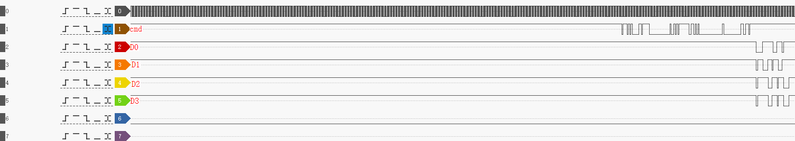

## 如何配置SDIO GPIO中断模式？<a name="ZH-CN_TOPIC_0000002017346009"></a>

GPIO中断模式是指SDIO的中断线不使用SDIO\_D1, 而是使用普通GPIO来实现。比如使用MGPIO13作为SDIO中断。适配流程如下：

WS53侧适配流程：Syschannel初始化时，初始化MGPIO13为低电平输出，并注册钩子给WS53 SDIO Slave, 这样WS53在SDIO slave往SDIO master传输时会将MGPIO13先输出高电平，再输出低电平，从而触发主控侧的对应GPIO（配置为输入）产生中断。示例代码如下：

```
#SDIO GPIO中断模式开发示例
 
#include "gpio.h"
#include "pinctrl.h"
#include "sdio_slave.h"
 
/* use gpio to notify sdio master */
pin_t g_hcc_notify_gpio;
void hcc_notify_gpio_init(pin_t pin)
{
    uapi_pin_set_mode(pin, 0);
    uapi_gpio_set_dir(pin, GPIO_DIRECTION_OUTPUT);
    uapi_gpio_set_val(pin, GPIO_LEVEL_LOW);
    g_hcc_notify_gpio = pin;
}
 
void hcc_notify_master_sdio_rx(sdio_bus_t bus)
{
    unused(bus);
    uapi_gpio_set_val(g_hcc_notify_gpio, GPIO_LEVEL_HIGH);
    uapi_gpio_set_val(g_hcc_notify_gpio, GPIO_LEVEL_LOW);
}
 
int sdio_init_task_body(osal_void *param)
{
    unused(param);
    uapi_watchdog_disable();
 
 // 配置gpio中断模式, S_MGPIO13作为中断管脚
 hcc_notify_gpio_init(S_MGPIO13);
 uapi_sdio_slave_register_notify_message_callback(hcc_notify_master_sdio_rx);
 
    if (uapi_syschannel_dev_init(SDIO_TYPE) != OSAL_OK) {
        printf("sdio_init_task_body:: syschannel_dev_init failed");
        uapi_watchdog_enable(WDT_MODE_INTERRUPT);
        return 0;
    }
    uapi_watchdog_enable(WDT_MODE_INTERRUPT);
 
    /* 初始化syschannel */
    if (syschannel_dev_init_demo() != OSAL_OK) {
        printf("syschannel dev init failed!\n");
    };
    printf("sdio init finish\r\n");
    return 0;
}
```

主控侧适配流程：主控侧默认配置为SDIO D1中断模式，需要修改配置文件，切换为GPIO中断模式，并按照主控和WS53的实际连线，配置主控侧作为输入的GPIO管脚号。修改示例如下：

```
路径：middleware\utils\hcc\host\hcc_sdio_host.c
td_s32 g_sdio_intr_mode = INT_MODE_SDIO; // 修改为td_s32 g_sdio_intr_mode = INT_MODE_GPIO;

#define HCC_SDIO_INT_GPIO_NUM        9   // 修改为主控侧作为SDIO中断的GPIO管脚号，需要和主控厂商确认
```

## 如何编译客户主控平台的syschannel.ko？<a name="ZH-CN_TOPIC_0000001980865776"></a>

1.  进入sdk目录：middleware/utils/syschannel/syschannel\_host
2.  修改env\_config.mk, 示例如下：

    ```
    ##############################CONFIGURATION##########################
    CFG_3518EV300 = y  // 指定所使用的主控型号，可以自行添加
    CFG_T23 = n
    CFG_T41 = n
    CFG_3519D = n
     
    SYSCHANNEL_DEBUG = n
     
    ###############################PLATFORM##############################
    WLAN_CFLAGS +=-D_PRE_PLATFORM_JZ=1
    WLAN_CFLAGS +=-D_PRE_PLATFORM_HISILICON=2
    WLAN_CFLAGS +=-D_PRE_OS_PLATFORM=_PRE_PLATFORM_HISILICON  // 指定或添加自定义宏
     
    ifeq ($(SYSCHANNEL_DEBUG), y)
    WLAN_CFLAGS += -D_PRE_SYSCHANNEL_DEBUG
    endif
    ################################INCLUDE##############################
    WLAN_CFLAGS += -I$(WLAN_DIR)/oal/linux
    WLAN_CFLAGS += -I$(WLAN_DIR)/wal/linux
    WLAN_CFLAGS += -I$(WLAN_DIR)/channel_host
    WLAN_CFLAGS += -I$(WLAN_DIR)/../syschannel_common
    WLAN_CFLAGS += -I$(WLAN_DIR)/../syschannel_api
    ```

3.  修改Makefile, 以T23主控为例:

    ```
    ifeq ($(CFG_T23), y)
    ARCH ?= mips  // 根据工具链架构类型配置
    KDIR ?= /home/shell/kernel_t23  // 修改内核路径，需要是已编译内核的绝对路径
    WLAN_CFLAGS += -DSYSCHANNEL_LITTLE_ENDIAN=1
    WLAN_CFLAGS += -DSYSCHANNEL_BIG_ENDIAN=2
    WLAN_CFLAGS += -DSYSCHANNEL_ENDIAN=SYSCHANNEL_LITTLE_ENDIAN
    WLAN_CFLAGS += -DETH_PAD_SIZE=2
    CROSS_COMPILE ?= mips-linux-gnu- // 修改工具链，如果环境变量里已经有路径，可以只写工具链前缀，否则需要填写工具链绝对路径
    endif
    ```

4.  make clean; make all
5.  生成目标文件： middleware/utils/syschannel/syschannel\_host/syschannel.ko

## WS53 Syschannel初始化和主控上电时序应该如何保证？<a name="ZH-CN_TOPIC_0000002017425477"></a>

WS53 Syschannel要先初始化进入等卡状态，主控再上电发起探卡。代码开发可参考Syschannel的dev demo示例（路径：application/samples/wifi/syschannel\_dev/syschannel\_dev\_sample.c，函数：app\_sdio\_init）。

```
osal_u32 app_sdio_init(osal_void)
{
    /* Create a task to init sdio */
    osThreadAttr_t attr;
    attr.name = "sdio init";
    attr.attr_bits = 0U;
    attr.cb_mem = NULL;
    attr.cb_size = 0U;
    attr.stack_mem = NULL;
    attr.stack_size = 0x1000;
    attr.priority = SYSCHANNEL_TASK_PRIO;
    if (osThreadNew((osThreadFunc_t)sdio_init_task_body, NULL, &attr) == NULL) {
        printf("Falied to create sdio init task!\n");
        return OSAL_NOK;
    }
    // 给主控上电，根据实际情况增加时延
    // osal_msleep(10);
    // soc_power_up();
    return OSAL_OK;
}
```

先起一个新任务执行Syschannel初始化，然后再给主控上电。此时WS53发起等卡和主控上电初始化并行，提高执行效率，如果发现主控上电以及加载syschannel.ko太快（利用串口工具比较主控加载KO和WS53发起等卡的时间戳），导致在WS53发起等卡前就开始探卡，造成探卡失败，可以在起任务后，延时10ms再给主控上电，保证时序。。总之，要保证实际的执行效果是WS53先进入等卡, 其标识是串口出现打印“APP |wait card"，主控再发起探卡，探卡成功后，则打印“APP|wait card ok”。

**图 1**  主控和WS53上电以及SDIO探卡时序示意图<a name="fig1085792084012"></a>  
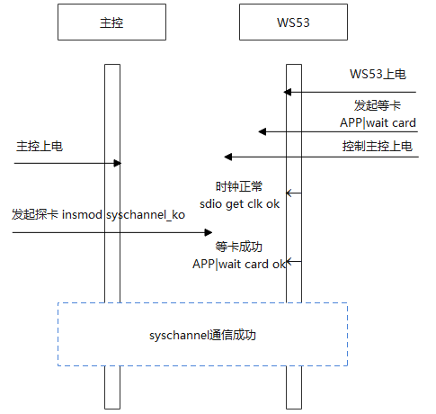

## Syschannel 初始化的任务优先级要配置为多少？<a name="ZH-CN_TOPIC_0000001980706064"></a>

Syschannel dev初始化时需要等待主控探卡，会有阻塞操作，因此建议按照demo，单独起任务来执行Syschannel初始化，该任务的优先级需要设置为最高优先级。优先级配置过低，有概率导致等卡任务被其他高优先级任务打断，导致等卡一直不成功。

Syschannel demo代码示例：

```
#define SYSCHANNEL_TASK_PRIO (osPriority_t)(40)
osal_u32 app_sdio_init(osal_void)
{
    /* Create a task to init sdio */
    osThreadAttr_t attr;
    attr.name = "sdio init";
    attr.attr_bits = 0U;
    attr.cb_mem = NULL;
    attr.cb_size = 0U;
    attr.stack_mem = NULL;
    attr.stack_size = 0x1000;
    attr.priority = SYSCHANNEL_TASK_PRIO;
    if (osThreadNew((osThreadFunc_t)sdio_init_task_body, NULL, &attr) == NULL) {
        printf("Falied to create sdio init task!\n");
        return OSAL_NOK;
    }

    return OSAL_OK;
}
```

## 如何配置取消探卡？<a name="ZH-CN_TOPIC_0000002017346013"></a>

如果发起等卡后，客户想要强制取消，可以调用以下API接口取消探卡：

```
#includ "hal_sdio.h"
void sdio_force_exit_wait_card(void);
```

## 如何开发Syschannel心跳超时处理流程？<a name="ZH-CN_TOPIC_0000001980865780"></a>

打开了Syschannel的心跳功能后，可以通过接口uapi\_syschannel\_register\_timeout\_cb注册心跳超时函数，心跳连续3次超时后，会执行此回调，在心跳超时处理流程中，可以按照以下流程重置Syschannel来尝试恢复通信：

1.  先复位Syschannel停止发包，示例：

    ```
    uapi_syschannel_dev_reset(SDIO_TYPE);
    ```

2.  给主控下电
3.  重新初始化Syschannel, 示例：

    ```
    app_sdio_reinit();
    ```

4.  给主控上电，触发重新探卡

## Syschannel和低功耗的关系是什么，如何适配？<a name="ZH-CN_TOPIC_0000002017425481"></a>

Syschannel初始化时，会先关闭深睡功能，以保持SDIO通信。退出Syschannel后，可以根据业务需要恢复深睡功能。

以下介绍了在实际业务流程中，如何控制Syschannel反复初始化/重置来实现Syschannel低功耗的流程：

a\) 不需要和主控通信了，准备进入深睡：

1.  先复位Syschannel停止发包, 示例：

    ```
    uapi_syschannel_dev_reset(SDIO_TYPE);
    ```

2.  主控下电
3.  打开深睡使能，示例：

    ```
    idle_set_open_pm(1);
    ```

b\) 重新加载Syschannel，恢复和主控通信

1.  关闭深睡使能，示例：

    ```
    idle_set_open_pm(0);
    ```

2.  主控上电
3.  Syschannel重新初始化，示例：

    ```
    app_sdio_reinit();
    ```

## SDIO探卡成功，但收发包异常，应该如何排查？<a name="ZH-CN_TOPIC_0000002024485321"></a>

SDIO探卡成功之后，如果发现收发包异常，请按以下步骤排查：

1.  确认SDIO数据线管脚连线，一线模式确认D0，四线模式确认D0\~D3，是否有虚焊的情况，SDIO管脚避免有飞线。
2.  确认SDIO中断是否正常，通过示波器量取D1（GPIO中断模式下则抓取对应GPIO）波形，确认在数据接收方向，有中断触发。
3.  确认SDIO时钟信号是否连续，通过示波器量取CLK管脚波形，观察CLK波形特征。为了保证WS53 SDIO正常工作，需要Host持续提供SDIO CLK，否则可能导致SDIO业务数据异常。

    **图 1**  SDIO不连续时钟信号示意<a name="fig7187193313581"></a>  
    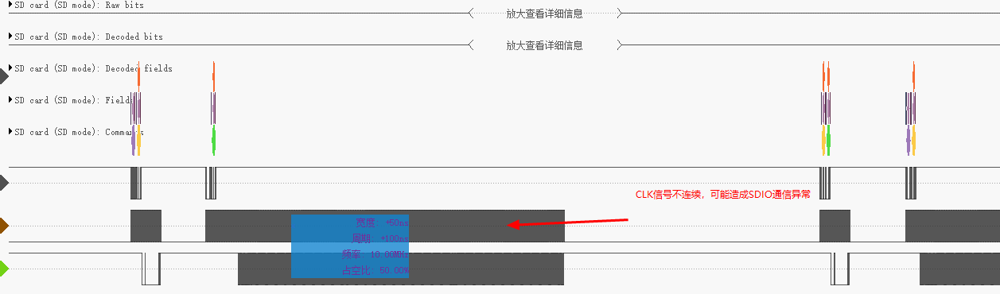

4.  确认SDIO时钟信号质量是否符合预期，通过示波器量取CLK管脚波形，探卡后预期SDIO时钟频率和主控配置匹配，和硬件确认时钟波形，判断是否有过脉冲等情况。主控可以通过调低管脚的驱动能力或者增加串阻来缓解过冲问题。以下是时钟过脉冲波形图示例：

    **图 2**  SDIO过脉冲时钟信号<a name="fig15289143318313"></a>  
    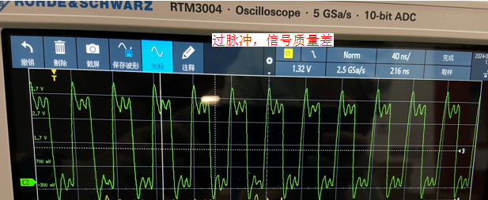

    以下是正常信号的时钟波形示例：

    **图 3**  SDIO正常时钟信号<a name="fig1373495913318"></a>  
    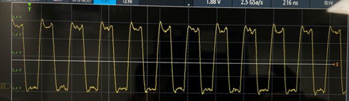

5.  确认SDIO供电，通过示波器确认主控是按照1.8V或者3.3V供电。示例如下：

    **图 4**  3.3V SDIO时钟信号<a name="fig141902013143217"></a>  
    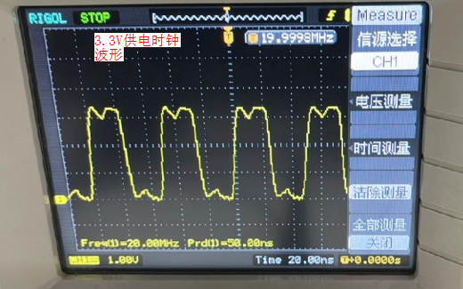

6.  确认SDIO信号质量，通过高精度示波器同时观察CLK和DATA波形，确认CLK可以对DATA线正常采样。以下是由于SDIO相位配置异常，导致时钟上升沿采样不正确的示例：

    **图 5**  SDIO时钟相位异常信号<a name="fig155641352163211"></a>  
    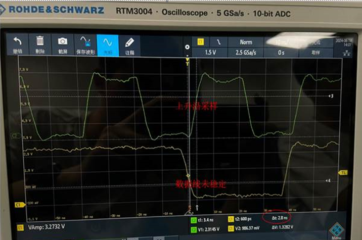

    预期正确的波形如下：

    **图 6**  SDIO时钟相位正常信号<a name="fig1253202283312"></a>  
    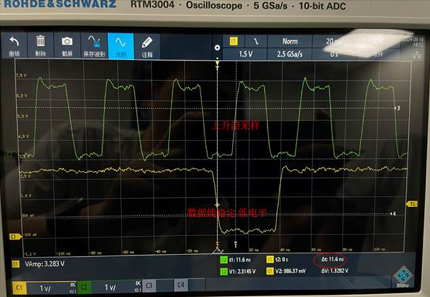

    通过高精度示波器同时观察CLK和CMD波形，确认CLK和CMD波形不存在过冲、震荡、回钩等问题。如下图，CMD信号上升沿出现回钩，信号震荡严重，通信异常。也可以尝试通过降低主控侧管脚驱动能力或者增加串阻来解决：

    **图 7**  SDIO CMD线异常信号（绿色线是CLK，黄色线是CMD）<a name="fig312613583324"></a>  
    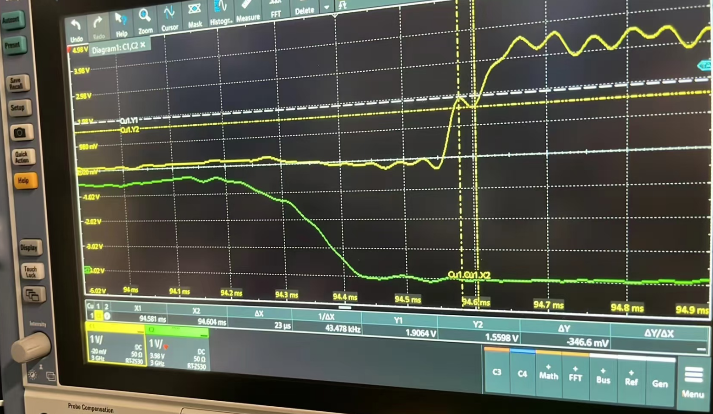

7.  通过逻辑分析仪抓取SDIO管脚信号，整体分析SDIO收发流程是否符合协议。下面示例中，主控发送CMD53命令发起发包流程，但是数据线D0上抓取的数据信号和预期不符合，原因是主控SDIO不支持ADMA，但是驱动仍然配置为ADMA收发包，导致异常，参考“[SDIO主控侧的驱动正常工作，还需要做哪些额外适配？](#ZH-CN_TOPIC_0000001988004876)”：

    **图 8**  逻辑分析仪结果异常示例1<a name="fig51791932123313"></a>  
    
    下面示例中，主控发送cmd53命令报错，通过同时抓取D0信号，发现D0信号拉低时（表示WS53 SDIO Device是busy状态），主控发送了cmd53命令，导致WS53无响应，说明主控侧发送命令操作适配很可能有问题，需要做进一步排查：

    **图 9**  逻辑分析仪结果异常示例2<a name="fig1810814575117"></a>  
    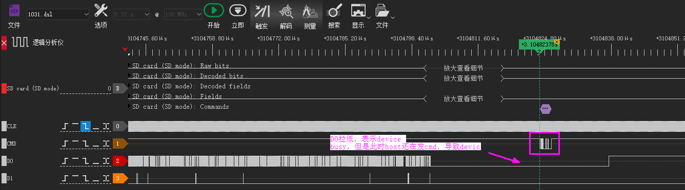

8.  确认主控对SDIO管脚是否有特殊的要求，比如：SDIO管脚是否需要配置硬件上拉。
9.  如果出现cmd53超时，需要抓信号确认WS53是否回复response, 排查主控侧对cmd53 response的中断处理流程是否正确，例如，如果cmd53 response中断在主控侧被误清除，就会导致cmd53因为获取不到response导致超时。

## SDIO主控侧的驱动正常工作，还需要做哪些额外适配？<a name="ZH-CN_TOPIC_0000001988004876"></a>

Syschannel通信需要依赖SDIO驱动正常工作，以下是为了主控侧的SDIO驱动适配不同的主控，需要额外确认的事项。

1.  适配主控侧重新探卡函数 - sdio\_detectcard\_change，该函数目的是如果SDIO Host和Slave启动时序不一致，导致上电时未探卡，可以保证在加载syschannel.ko的时候重新发起一次探卡。

    ```
    #if defined(_PRE_OS_VERSION_LINUX) && defined(_PRE_OS_VERSION) && (_PRE_OS_VERSION_LINUX == _PRE_OS_VERSION)
    static td_s32 sdio_detectcard_change(td_void)
    {
    #ifdef CONFIG_SDIO_RESCAN
    #if defined(CONFIG_JZMMC_V12_MMC1) || defined(CONFIG_MMC_SDHCI_INGENIC)
        jzmmc_manual_detect(1, 1);
    #elif defined(CONFIG_3519D)
        bsp_sdio_rescan(2); /* mmc2 */
    #else
        hisi_sdio_rescan(1);
    #endif
    #endif
        return EXT_ERR_SUCCESS;
    }
    ```

    如果主控侧驱动未提供探卡的接口，可以参考hisi\_sdio\_rescan实现，例程如下：

    ```
    int hisi_sdio_rescan(int slot)
    {
           struct mmc_host *mmc = mci_host[slot];
           if (mmc == NULL) {
                   pr_err("invalid mmc, please check the argument ");
                   return -EINVAL;
           }
           mmc_detect_change(mmc, 0);
           return 0;
    }
    ```

    想要快速验证SDIO功能时，可以通过注释掉宏CONFIG\_SDIO\_RESCAN，先关闭该功能，预期不影响SDIO基本通信。

2.  确认主控侧mmc驱动是否支持ADMA（Advanced DMA）。ADMA是SDHCI控制器的一种数据传输模式，它允许更灵活的数据传输，ADMA支持使用描述符列表来组织数据传输，并支持跨越多个非连续内存缓冲区的数据传输。需要软/硬件同时支持。另一种传输模式是SDMA（Simple DMA）。

    目前，WS53主控侧SDIO驱动默认认为当前主控支持**ADMA模式传输**。如果确认不支持ADMA，需要修改宏配置，如果按照ADMA模式传输，需要打开宏PRE\_SDIO\_FEATURE\_SCATTER，如果按照SDMA模式传输，需要打开宏PRE\_SDIO\_FEATURE\_FLAT\_MEMORY, 示例如下：

    ```
    路径：middleware\utils\hcc\host\hcc_sdio_host.c
    
    #if defined(_PRE_OS_VERSION_LINUX) && defined(_PRE_OS_VERSION) && (_PRE_OS_VERSION_LINUX == _PRE_OS_VERSION)
    #include "oal_sdio_linux_adapt.h"
    #define PRE_SDIO_FEATURE_SCATTER       // 表示按照ADMA模式传输
    //#define PRE_SDIO_FEATURE_FLAT_MEMORY // 表示按照SDMA模式传输
    #endif
    ```

