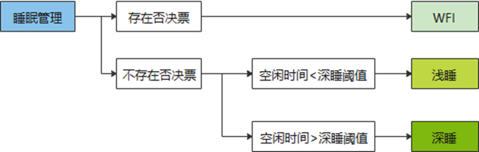

# 前言<a name="ZH-CN_TOPIC_0000001854618441"></a>

**概述<a name="section4537382116410"></a>**

本文档详细描述了WS53V100 的系统低功耗模式及应用开发指导，同时提供了常见问题的处理方法。

**产品版本<a name="section578420251745"></a>**

与本文档对应的产品版本如下。

<a name="table06171831652"></a>
<table><thead align="left"><tr id="row761817313520"><th class="cellrowborder" valign="top" width="50%" id="mcps1.1.3.1.1"><p id="p1361973854"><a name="p1361973854"></a><a name="p1361973854"></a><strong id="b138501913165"><a name="b138501913165"></a><a name="b138501913165"></a>产品名称</strong></p>
</th>
<th class="cellrowborder" valign="top" width="50%" id="mcps1.1.3.1.2"><p id="p1961917310511"><a name="p1961917310511"></a><a name="p1961917310511"></a><strong id="b5855151161619"><a name="b5855151161619"></a><a name="b5855151161619"></a>产品版本</strong></p>
</th>
</tr>
</thead>
<tbody><tr id="row11619103553"><td class="cellrowborder" valign="top" width="50%" headers="mcps1.1.3.1.1 "><p id="p061923257"><a name="p061923257"></a><a name="p061923257"></a>WS53</p>
</td>
<td class="cellrowborder" valign="top" width="50%" headers="mcps1.1.3.1.2 "><p id="p26191931853"><a name="p26191931853"></a><a name="p26191931853"></a>V100</p>
</td>
</tr>
</tbody>
</table>

**读者对象<a name="section4378592816410"></a>**

本文档主要适用于以下工程师：

-   技术支持工程师
-   软件开发工程师

**符号约定<a name="section133020216410"></a>**

在本文中可能出现下列标志，它们所代表的含义如下。

<a name="table2622507016410"></a>
<table><thead align="left"><tr id="row1530720816410"><th class="cellrowborder" valign="top" width="20.580000000000002%" id="mcps1.1.3.1.1"><p id="p6450074116410"><a name="p6450074116410"></a><a name="p6450074116410"></a><strong id="b2136615816410"><a name="b2136615816410"></a><a name="b2136615816410"></a>符号</strong></p>
</th>
<th class="cellrowborder" valign="top" width="79.42%" id="mcps1.1.3.1.2"><p id="p5435366816410"><a name="p5435366816410"></a><a name="p5435366816410"></a><strong id="b5941558116410"><a name="b5941558116410"></a><a name="b5941558116410"></a>说明</strong></p>
</th>
</tr>
</thead>
<tbody><tr id="row1372280416410"><td class="cellrowborder" valign="top" width="20.580000000000002%" headers="mcps1.1.3.1.1 "><p id="p3734547016410"><a name="p3734547016410"></a><a name="p3734547016410"></a><a name="image2670064316410"></a><a name="image2670064316410"></a><span></span></p>
</td>
<td class="cellrowborder" valign="top" width="79.42%" headers="mcps1.1.3.1.2 "><p id="p1757432116410"><a name="p1757432116410"></a><a name="p1757432116410"></a>表示如不避免则将会导致死亡或严重伤害的具有高等级风险的危害。</p>
</td>
</tr>
<tr id="row466863216410"><td class="cellrowborder" valign="top" width="20.580000000000002%" headers="mcps1.1.3.1.1 "><p id="p1432579516410"><a name="p1432579516410"></a><a name="p1432579516410"></a><a name="image4895582316410"></a><a name="image4895582316410"></a><span></span></p>
</td>
<td class="cellrowborder" valign="top" width="79.42%" headers="mcps1.1.3.1.2 "><p id="p959197916410"><a name="p959197916410"></a><a name="p959197916410"></a>表示如不避免则可能导致死亡或严重伤害的具有中等级风险的危害。</p>
</td>
</tr>
<tr id="row123863216410"><td class="cellrowborder" valign="top" width="20.580000000000002%" headers="mcps1.1.3.1.1 "><p id="p1232579516410"><a name="p1232579516410"></a><a name="p1232579516410"></a><a name="image1235582316410"></a><a name="image1235582316410"></a><span></span></p>
</td>
<td class="cellrowborder" valign="top" width="79.42%" headers="mcps1.1.3.1.2 "><p id="p123197916410"><a name="p123197916410"></a><a name="p123197916410"></a>表示如不避免则可能导致轻微或中度伤害的具有低等级风险的危害。</p>
</td>
</tr>
<tr id="row5786682116410"><td class="cellrowborder" valign="top" width="20.580000000000002%" headers="mcps1.1.3.1.1 "><p id="p2204984716410"><a name="p2204984716410"></a><a name="p2204984716410"></a><a name="image4504446716410"></a><a name="image4504446716410"></a><span></span></p>
</td>
<td class="cellrowborder" valign="top" width="79.42%" headers="mcps1.1.3.1.2 "><p id="p4388861916410"><a name="p4388861916410"></a><a name="p4388861916410"></a>用于传递设备或环境安全警示信息。如不避免则可能会导致设备损坏、数据丢失、设备性能降低或其它不可预知的结果。</p>
<p id="p1238861916410"><a name="p1238861916410"></a><a name="p1238861916410"></a>“须知”不涉及人身伤害。</p>
</td>
</tr>
<tr id="row2856923116410"><td class="cellrowborder" valign="top" width="20.580000000000002%" headers="mcps1.1.3.1.1 "><p id="p5555360116410"><a name="p5555360116410"></a><a name="p5555360116410"></a><a name="image799324016410"></a><a name="image799324016410"></a><span></span></p>
</td>
<td class="cellrowborder" valign="top" width="79.42%" headers="mcps1.1.3.1.2 "><p id="p4612588116410"><a name="p4612588116410"></a><a name="p4612588116410"></a>对正文中重点信息的补充说明。</p>
<p id="p1232588116410"><a name="p1232588116410"></a><a name="p1232588116410"></a>“说明”不是安全警示信息，不涉及人身、设备及环境伤害信息。</p>
</td>
</tr>
</tbody>
</table>

**修改记录<a name="section2467512116410"></a>**

<a name="table1557726816410"></a>
<table><thead align="left"><tr id="row2942532716410"><th class="cellrowborder" valign="top" width="20.72%" id="mcps1.1.4.1.1"><p id="p3778275416410"><a name="p3778275416410"></a><a name="p3778275416410"></a><strong id="b5687322716410"><a name="b5687322716410"></a><a name="b5687322716410"></a>文档版本</strong></p>
</th>
<th class="cellrowborder" valign="top" width="26.119999999999997%" id="mcps1.1.4.1.2"><p id="p5627845516410"><a name="p5627845516410"></a><a name="p5627845516410"></a><strong id="b5800814916410"><a name="b5800814916410"></a><a name="b5800814916410"></a>发布日期</strong></p>
</th>
<th class="cellrowborder" valign="top" width="53.16%" id="mcps1.1.4.1.3"><p id="p2382284816410"><a name="p2382284816410"></a><a name="p2382284816410"></a><strong id="b3316380216410"><a name="b3316380216410"></a><a name="b3316380216410"></a>修改说明</strong></p>
</th>
</tr>
</thead>
<tbody><tr id="row108439118412"><td class="cellrowborder" valign="top" width="20.72%" headers="mcps1.1.4.1.1 "><p id="p17843151117417"><a name="p17843151117417"></a><a name="p17843151117417"></a>04</p>
</td>
<td class="cellrowborder" valign="top" width="26.119999999999997%" headers="mcps1.1.4.1.2 "><p id="p6843511174115"><a name="p6843511174115"></a><a name="p6843511174115"></a>2025-05-28</p>
</td>
<td class="cellrowborder" valign="top" width="53.16%" headers="mcps1.1.4.1.3 "><a name="ul1739624184110"></a><a name="ul1739624184110"></a><ul id="ul1739624184110"><li>更新“<a href="#ZH-CN_TOPIC_0000001807939754">系统低功耗模式说明</a>”小节内容。</li><li>更新“<a href="#ZH-CN_TOPIC_0000001807939750">接口说明</a>”小节内容。</li><li>更新“<a href="#ZH-CN_TOPIC_0000001854738413">接口说明</a>”小节内容。</li></ul>
</td>
</tr>
<tr id="row11319511456"><td class="cellrowborder" valign="top" width="20.72%" headers="mcps1.1.4.1.1 "><p id="p1731125119455"><a name="p1731125119455"></a><a name="p1731125119455"></a>03</p>
</td>
<td class="cellrowborder" valign="top" width="26.119999999999997%" headers="mcps1.1.4.1.2 "><p id="p631205115453"><a name="p631205115453"></a><a name="p631205115453"></a>2024-11-25</p>
</td>
<td class="cellrowborder" valign="top" width="53.16%" headers="mcps1.1.4.1.3 "><a name="ul1768212467467"></a><a name="ul1768212467467"></a><ul id="ul1768212467467"><li>更新“<a href="#ZH-CN_TOPIC_0000001807939754">系统低功耗模式说明</a>”小节内容。</li><li>更新“<a href="#ZH-CN_TOPIC_0000001854738417">超深睡模式</a>”小节内容。</li><li>更新“<a href="#ZH-CN_TOPIC_0000001807939750">接口说明</a>”小节内容。</li><li>更新“<a href="#ZH-CN_TOPIC_0000001854738413">接口说明</a>”小节内容。</li></ul>
</td>
</tr>
<tr id="row48298143553"><td class="cellrowborder" valign="top" width="20.72%" headers="mcps1.1.4.1.1 "><p id="p7495429112210"><a name="p7495429112210"></a><a name="p7495429112210"></a>02</p>
</td>
<td class="cellrowborder" valign="top" width="26.119999999999997%" headers="mcps1.1.4.1.2 "><p id="p15495929132220"><a name="p15495929132220"></a><a name="p15495929132220"></a>2024-09-13</p>
</td>
<td class="cellrowborder" valign="top" width="53.16%" headers="mcps1.1.4.1.3 "><a name="ul0817134485619"></a><a name="ul0817134485619"></a><ul id="ul0817134485619"><li>更新“<a href="#ZH-CN_TOPIC_0000001808099582">接口说明</a>”、“<a href="#ZH-CN_TOPIC_0000001807939746">应用示例</a>”小节内容。</li><li>更新“<a href="#ZH-CN_TOPIC_0000001807939750">接口说明</a>”、“<a href="#ZH-CN_TOPIC_0000001807939758">应用示例</a>”小节内容。</li><li>更新“<a href="#ZH-CN_TOPIC_0000001854738429">浅睡模式</a>”小节内容。</li></ul>
</td>
</tr>
<tr id="row193904010370"><td class="cellrowborder" valign="top" width="20.72%" headers="mcps1.1.4.1.1 "><p id="p1293915407371"><a name="p1293915407371"></a><a name="p1293915407371"></a>01</p>
</td>
<td class="cellrowborder" valign="top" width="26.119999999999997%" headers="mcps1.1.4.1.2 "><p id="p2939204014377"><a name="p2939204014377"></a><a name="p2939204014377"></a>2024-08-08</p>
</td>
<td class="cellrowborder" valign="top" width="53.16%" headers="mcps1.1.4.1.3 "><p id="p1031614161639"><a name="p1031614161639"></a><a name="p1031614161639"></a>第一次正式版本发布。</p>
<a name="ul247119814398"></a><a name="ul247119814398"></a><ul id="ul247119814398"><li>更新“<a href="#ZH-CN_TOPIC_0000001807939754">系统低功耗模式说明</a>”小节内容。</li><li>更新“<a href="#ZH-CN_TOPIC_0000001854618433">概述</a>”、“<a href="#ZH-CN_TOPIC_0000001808099582">接口说明</a>”小节内容。</li><li>更新“<a href="#ZH-CN_TOPIC_0000001854618437">概述</a>”、“<a href="#ZH-CN_TOPIC_0000001807939750">接口说明</a>”小节内容。</li><li>更新“<a href="#ZH-CN_TOPIC_0000001854738429">浅睡模式</a>”小节内容。</li></ul>
</td>
</tr>
<tr id="row1455042814112"><td class="cellrowborder" valign="top" width="20.72%" headers="mcps1.1.4.1.1 "><p id="p955052817111"><a name="p955052817111"></a><a name="p955052817111"></a>00B02</p>
</td>
<td class="cellrowborder" valign="top" width="26.119999999999997%" headers="mcps1.1.4.1.2 "><p id="p13550228111111"><a name="p13550228111111"></a><a name="p13550228111111"></a>2024-07-15</p>
</td>
<td class="cellrowborder" valign="top" width="53.16%" headers="mcps1.1.4.1.3 "><a name="ul1724851816511"></a><a name="ul1724851816511"></a><ul id="ul1724851816511"><li>更新“<a href="#ZH-CN_TOPIC_0000001807939762">概述</a>”小节内容。</li><li>更新“<a href="#ZH-CN_TOPIC_0000001854618433">概述</a>”小节内容。</li><li>更新“<a href="#ZH-CN_TOPIC_0000001854618437">概述</a>”、“<a href="#ZH-CN_TOPIC_0000001807939750">接口说明</a>”、“<a href="#ZH-CN_TOPIC_0000001807939758">应用示例</a>”小节内容。</li><li>更新“<a href="#ZH-CN_TOPIC_0000001808099594">概述</a>”小节内容。</li></ul>
</td>
</tr>
<tr id="row5947359616410"><td class="cellrowborder" valign="top" width="20.72%" headers="mcps1.1.4.1.1 "><p id="p570915018549"><a name="p570915018549"></a><a name="p570915018549"></a>00B01</p>
</td>
<td class="cellrowborder" valign="top" width="26.119999999999997%" headers="mcps1.1.4.1.2 "><p id="p170965005410"><a name="p170965005410"></a><a name="p170965005410"></a>2024-05-11</p>
</td>
<td class="cellrowborder" valign="top" width="53.16%" headers="mcps1.1.4.1.3 "><p id="p570919509546"><a name="p570919509546"></a><a name="p570919509546"></a>第一次临时版本发布。</p>
</td>
</tr>
</tbody>
</table>

# 概述<a name="ZH-CN_TOPIC_0000001807939762"></a>

-   **[低功耗配置前提条件](#ZH-CN_TOPIC_0000001854738425)**  

-   **[系统低功耗模式说明](#ZH-CN_TOPIC_0000001807939754)**  

## 低功耗配置前提条件<a name="ZH-CN_TOPIC_0000001854738425"></a>

WS53芯片包含A核和C核两个核：C核负责Wi-Fi、蓝牙和星闪的底层数据收发；A核负责网络数据协议、外设驱动和应用处理。上电默认两个核均使能了深睡模式。芯片上电C核在无Wi-Fi、蓝牙数据处理时隙时进入深睡，C核在Wi-Fi、蓝牙数据需要A核协议层处理时，C核唤醒A核。A核只有执行Idle任务，并且idle空闲时间超过配置值（默认配置20ms），才会进入深睡。在A核和C核均处于深睡时，WS53芯片整体进入深睡。A核深睡模式下，可以被UART RX、GPIO中断、RTC中断（操作系统idle到期）和看门狗唤醒。UART RX唤醒之后，软件上会让系统等待至少1s才进入深睡。

系统IDLE任务优先级最低，只有其它业务任务挂起或者阻塞时，系统才能进入IDLE任务。IDLE任务的空闲时间受其它高优先级任务阻塞时间和定时器影响，所以业务需要设计好相关任务和定时器，防止系统无法进入IDLE任务或者IDLE空闲时间过短影响功耗。在IDLE任务会对睡眠条件进行管理：



如果业务希望执行IDLE任务时不进入睡眠模式，可以关闭低功耗入口或者可以通过投否决票实现。

> **说明：** 
>注册给操作系统的低功耗入口函数：static void idle\_task\_process\(void\)
>低功耗管理功能函数：void uapi\_pm\_enter\_sleep\(void\)

低功耗入口函数：static void idle\_task\_process\(void\)

添加睡眠否决票：errcode\_t uapi\_pm\_add\_sleep\_veto\(pm\_veto\_id\_t veto\_id\)

移除睡眠否决票：errcode\_t uapi\_pm\_remove\_sleep\_veto\(pm\_veto\_id\_t veto\_id\)

如果只是希望从投票时间开始一段时间不能进入睡眠，也可以调用接口：

errcode\_t uapi\_pm\_add\_sleep\_veto\_with\_timeout\(pm\_veto\_id\_t veto\_id, uint32\_t timeout\_ms\)

## 系统低功耗模式说明<a name="ZH-CN_TOPIC_0000001807939754"></a>

WS53V100支持3种系统低功耗模式（如[表1](#table24835906)所示），用户可根据实际应用场景选用对应的低功耗策略（默认使用深睡模式）。

**表 1**  低功耗模式说明

<a name="table24835906"></a>
<table><thead align="left"><tr id="row49979058"><th class="cellrowborder" valign="top" width="18.07%" id="mcps1.2.4.1.1"><p id="p21771894"><a name="p21771894"></a><a name="p21771894"></a>模式</p>
</th>
<th class="cellrowborder" valign="top" width="36.88%" id="mcps1.2.4.1.2"><p id="p37739593"><a name="p37739593"></a><a name="p37739593"></a>芯片状态</p>
</th>
<th class="cellrowborder" valign="top" width="45.050000000000004%" id="mcps1.2.4.1.3"><p id="p194011637423"><a name="p194011637423"></a><a name="p194011637423"></a>特点</p>
</th>
</tr>
</thead>
<tbody><tr id="row1190473"><td class="cellrowborder" valign="top" width="18.07%" headers="mcps1.2.4.1.1 "><p id="p29319479"><a name="p29319479"></a><a name="p29319479"></a>超深睡模式</p>
</td>
<td class="cellrowborder" valign="top" width="36.88%" headers="mcps1.2.4.1.2 "><a name="ul543182211112"></a><a name="ul543182211112"></a><ul id="ul543182211112"><li>CPU下电，RAM下电，所有外设下电。</li><li>该模式仅支持配置GPIO唤醒源唤醒。</li></ul>
</td>
<td class="cellrowborder" valign="top" width="45.050000000000004%" headers="mcps1.2.4.1.3 "><a name="ul67661010145715"></a><a name="ul67661010145715"></a><ul id="ul67661010145715"><li>不支持Wi-Fi协议规定的节能模式。</li><li>唤醒后系统重新启动（类似上电重启）。</li><li>不保持Wi-Fi、蓝牙连接。</li><li>配置为输出模式的AGOIO输出电平可保持。</li></ul>
</td>
</tr>
<tr id="row35595432"><td class="cellrowborder" valign="top" width="18.07%" headers="mcps1.2.4.1.1 "><p id="p64657730"><a name="p64657730"></a><a name="p64657730"></a>深睡模式</p>
</td>
<td class="cellrowborder" valign="top" width="36.88%" headers="mcps1.2.4.1.2 "><a name="ul579452511112"></a><a name="ul579452511112"></a><ul id="ul579452511112"><li>CPU下电，RAM不下电，GPIO、RTC以外其他外设下电。</li><li>该模式仅支持GPIO/Wi-Fi/BLE/SLE/RTC/UART/看门狗唤醒。</li></ul>
</td>
<td class="cellrowborder" valign="top" width="45.050000000000004%" headers="mcps1.2.4.1.3 "><a name="ul5970101212013"></a><a name="ul5970101212013"></a><ul id="ul5970101212013"><li>支持Wi-Fi协议规定的节能模式。</li><li>支持BLE协议规定的节能模式。</li><li>支持SLE协议规定的节能模式。</li><li>保持AP连接（Station关联AP后）。</li><li>AGPIO可以保持输出电平，其他外设在休眠时不能正常工作。</li><li>与浅睡模式互斥，不能同时设置。</li></ul>
</td>
</tr>
<tr id="row44724910"><td class="cellrowborder" valign="top" width="18.07%" headers="mcps1.2.4.1.1 "><p id="p65947939"><a name="p65947939"></a><a name="p65947939"></a>浅睡模式</p>
</td>
<td class="cellrowborder" valign="top" width="36.88%" headers="mcps1.2.4.1.2 "><p id="p33585991"><a name="p33585991"></a><a name="p33585991"></a>CPU不下电，RAM不下电，支持WiFi、蓝牙、星闪的低功耗，SOC外设均不关闭，不下电。</p>
</td>
<td class="cellrowborder" valign="top" width="45.050000000000004%" headers="mcps1.2.4.1.3 "><a name="ul7342101717019"></a><a name="ul7342101717019"></a><ul id="ul7342101717019"><li>支持Wi-Fi协议规定的节能模式。</li><li>支持BLE协议规定的节能模式。</li><li>支持SLE协议规定的节能模式。</li><li>保持AP连接（Station关联AP后）。</li><li>依赖Wi-Fi子系统的低功耗，关闭Wi-Fi模块电路，包括RF。</li><li>依赖BLE、SLE子系统的低功耗，关闭BLE、SLE模块电路，包括RF。</li><li>支持所有外设正常工作。</li><li>与深睡模式互斥，不能同时设置。</li></ul>
</td>
</tr>
</tbody>
</table>

# 超深睡模式<a name="ZH-CN_TOPIC_0000001854738417"></a>

-   **[概述](#ZH-CN_TOPIC_0000001854618433)**  

-   **[接口说明](#ZH-CN_TOPIC_0000001808099582)**  

-   **[应用示例](#ZH-CN_TOPIC_0000001807939746)**  

-   **[注意事项](#ZH-CN_TOPIC_0000001854618445)**  

## 概述<a name="ZH-CN_TOPIC_0000001854618433"></a>

超深睡模式下仅保留IO唤醒相关模块供电，AGPIO配置及其复用关系不丢失，所有IO管脚驱动能力和PULL UP/DOWN配置不丢失，其他模块均下电，内存信息不保留，外设配置恢复到初始状态，Wi-Fi、星闪、蓝牙连接均断开。超深睡模式由用户调用超深睡函数接口后直接进入超深睡模式，超深睡接口调用之后，在之前所有配置为输入中断模式的AGPIO都能触发系统从超深睡模式唤醒。

## 接口说明<a name="ZH-CN_TOPIC_0000001808099582"></a>

**表 1**  超深睡模式接口说明

<a name="table9103621"></a>
<table><thead align="left"><tr id="row12799434"><th class="cellrowborder" valign="top" width="36.57%" id="mcps1.2.3.1.1"><p id="p30121258"><a name="p30121258"></a><a name="p30121258"></a>接口名称</p>
</th>
<th class="cellrowborder" valign="top" width="63.43%" id="mcps1.2.3.1.2"><p id="p23902851"><a name="p23902851"></a><a name="p23902851"></a>描述</p>
</th>
</tr>
</thead>
<tbody><tr id="row13799068"><td class="cellrowborder" valign="top" width="36.57%" headers="mcps1.2.3.1.1 "><p id="p1192210417217"><a name="p1192210417217"></a><a name="p1192210417217"></a>-uapi_pm_enter_udsleep</p>
</td>
<td class="cellrowborder" valign="top" width="63.43%" headers="mcps1.2.3.1.2 "><p id="p69221044219"><a name="p69221044219"></a><a name="p69221044219"></a>-进入超深睡。</p>
</td>
</tr>
<tr id="row747932843810"><td class="cellrowborder" valign="top" width="36.57%" headers="mcps1.2.3.1.1 "><p id="p247922816382"><a name="p247922816382"></a><a name="p247922816382"></a>pm_port_get_udsleep_wakeup_src</p>
</td>
<td class="cellrowborder" valign="top" width="63.43%" headers="mcps1.2.3.1.2 "><p id="p16479182818386"><a name="p16479182818386"></a><a name="p16479182818386"></a>超深睡唤醒以后查询唤醒管脚，如果有多个GPIO配置了中断模式，查询结果是本次唤醒的GPIO。</p>
</td>
</tr>
</tbody>
</table>

## 应用示例<a name="ZH-CN_TOPIC_0000001807939746"></a>

超深睡模式一般用于按键唤醒、主从设备长时间待机唤醒等极低功耗要求的场景。

超深睡配置：

/\* 设置管脚APGIO3为GPIO模式 \*/

uapi\_pin\_set\_mode\(S\_AGPIO3, PIN\_MODE\_0\);

/\* 设置GPIO为输入模式 \*/

uapi\_gpio\_set\_dir\(S\_AGPIO3,, GPIO\_DIRECTION\_INPUT\);

/\* 设置GPIO为下降沿中断唤醒模式 \*/

uapi\_gpio\_set\_isr\_mode\(S\_AGPIO3,, GPIO\_INTERRUPT\_FALLING\_EDGE\);

/\* 进入超深睡模式 \*/

uapi\_pm\_enter\_udsleep\(\);

超深睡唤醒之后，系统重启，软件可以查询获取唤醒GPIO号：

int32\_t pm\_port\_get\_udsleep\_wakeup\_src\(const uint8\_t agpio\_array\[\], uint8\_t agpio\_cnt, bool wakeup\[\]\)

agpio\_array为查询的GPIO标号，wakeup将对唤醒的GPIO位置标记为TRUE.

## 注意事项<a name="ZH-CN_TOPIC_0000001854618445"></a>

超深睡之前，只要有AGPIO配置了中断模式，如果该管脚被触发，都能把系统从超深睡唤醒。

# 深睡模式<a name="ZH-CN_TOPIC_0000001854738421"></a>

-   **[概述](#ZH-CN_TOPIC_0000001854618437)**  

-   **[接口说明](#ZH-CN_TOPIC_0000001807939750)**  

-   **[应用示例](#ZH-CN_TOPIC_0000001807939758)**  

-   **[注意事项](#ZH-CN_TOPIC_0000001808099586)**  

## 概述<a name="ZH-CN_TOPIC_0000001854618437"></a>

WS53在idle空闲任务系统判断没有即将执行的业务则可以进入深睡模式，默认使用该模式。该模式可以通过深睡唤醒源唤醒，深睡唤醒源包括GPIO、系统tick（RTC）等。系统休眠时间采用tickless机制，避免每个系统tick都被唤醒。

模组作为STA，设置深睡模式后，系统空闲时会自动进入休眠，默认休眠时间取决于系统空闲状态、所关联AP的DTIM及Beacon周期、BLE和SLE连接状态等。只有系统低功耗、业务（WiFi、星闪蓝牙）低功耗均打开的时候才能进入深睡模式。

> **说明：** 
>DTIM \(Delivery Traffic Indication Message\)：AP发送广播/组播数据包的频率。
>BI\(Beacon period\)：AP beacon帧发送间隔。
>用户无需特别配置，BLE/SLE默认开启深睡策略；在BLE/SLE业务空闲5ms及以上时间时，投票允许进入深睡，不择投票禁止深睡。

## 接口说明<a name="ZH-CN_TOPIC_0000001807939750"></a>

> **说明：** 
>-   用户无需特别配置，软件默认开启深睡，通过uapi\_pm\_add\_sleep\_veto/uapi\_pm\_remove\_sleep\_veto实现否决投票和否决投票移除，采用一票否决机制，只要有一个模块禁止休眠，则系统不能进入系统低功耗模式。
>-   进入深睡前，如果已经开启了Wi-Fi/BLE/SLE业务，需要Wi-Fi/BLE/SLE模块全部进入浅睡，整系统才会进入深睡。即只有在uapi\_lpc\_set\_type和uapi\_wifi\_set\_pm\_switch同时打开才能进入深睡。
>-   使能/去使能Wi-Fi协议低功耗，原接口wifi\_sta\_set\_pm不建议使用，推荐使用新接口uapi\_wifi\_set\_pm\_switch

**表 1**  深睡模式接口说明

<a name="table7513055"></a>
<table><thead align="left"><tr id="row60882656"><th class="cellrowborder" valign="top" width="30.959999999999997%" id="mcps1.2.3.1.1"><p id="p1096619262352"><a name="p1096619262352"></a><a name="p1096619262352"></a>接口名称</p>
</th>
<th class="cellrowborder" valign="top" width="69.04%" id="mcps1.2.3.1.2"><p id="p49661926123519"><a name="p49661926123519"></a><a name="p49661926123519"></a>描述</p>
</th>
</tr>
</thead>
<tbody><tr id="row23431702"><td class="cellrowborder" valign="top" width="30.959999999999997%" headers="mcps1.2.3.1.1 "><p id="p174491851537"><a name="p174491851537"></a><a name="p174491851537"></a>uapi_pm_add_sleep_veto</p>
</td>
<td class="cellrowborder" valign="top" width="69.04%" headers="mcps1.2.3.1.2 "><p id="p56101350"><a name="p56101350"></a><a name="p56101350"></a>用户投票使用，否决进入休眠状态。用户可通过增加pm_veto_id_t枚举实现否决投票，每个ID仅对应一个否决票。如果有业务投票反对进入深睡，系统将无法进入深睡模式。</p>
</td>
</tr>
<tr id="row35150104"><td class="cellrowborder" valign="top" width="30.959999999999997%" headers="mcps1.2.3.1.1 "><p id="p28586180"><a name="p28586180"></a><a name="p28586180"></a>uapi_pm_remove_sleep_veto</p>
</td>
<td class="cellrowborder" valign="top" width="69.04%" headers="mcps1.2.3.1.2 "><p id="p33779240"><a name="p33779240"></a><a name="p33779240"></a>用户投票使用，解除否决进入休眠状态。</p>
</td>
</tr>
<tr id="row261632321014"><td class="cellrowborder" valign="top" width="30.959999999999997%" headers="mcps1.2.3.1.1 "><p id="p10616192318109"><a name="p10616192318109"></a><a name="p10616192318109"></a>uapi_pm_add_sleep_veto_with_timeout</p>
</td>
<td class="cellrowborder" valign="top" width="69.04%" headers="mcps1.2.3.1.2 "><p id="p961672341015"><a name="p961672341015"></a><a name="p961672341015"></a>用户从投票时刻起延时进入低功耗，不需要对应解除函数，进入低功耗时判断超时时间</p>
</td>
</tr>
<tr id="row30729051"><td class="cellrowborder" valign="top" width="30.959999999999997%" headers="mcps1.2.3.1.1 "><p id="p6025228"><a name="p6025228"></a><a name="p6025228"></a>uapi_lpc_set_type</p>
</td>
<td class="cellrowborder" valign="top" width="69.04%" headers="mcps1.2.3.1.2 "><p id="p18422132124118"><a name="p18422132124118"></a><a name="p18422132124118"></a>设置系统睡眠模式，在Wi-Fi子系统低功耗使能的场景下设置深睡模式PM_DEEP_SLEEP支持外设和CPU可下电。</p>
</td>
</tr>
<tr id="row30315759"><td class="cellrowborder" valign="top" width="30.959999999999997%" headers="mcps1.2.3.1.1 "><p id="p19506154715587"><a name="p19506154715587"></a><a name="p19506154715587"></a>uapi_wifi_set_pm_switch</p>
</td>
<td class="cellrowborder" valign="top" width="69.04%" headers="mcps1.2.3.1.2 "><p id="p474943815385"><a name="p474943815385"></a><a name="p474943815385"></a>打开/关闭Wi-FI子系统低功耗</p>
<p id="p2887264594"><a name="p2887264594"></a><a name="p2887264594"></a>参数说明如下：</p>
<a name="ul488326125915"></a><a name="ul488326125915"></a><ul id="ul488326125915"><li>[1]enable 使能/去使能Wi-Fi协议低功耗</li><li>[2]sleep_time 配置睡眠时长，通常配置1s（DTIM10），enable配置去使能时，参数2无效</li></ul>
</td>
</tr>
<tr id="row172952344439"><td class="cellrowborder" valign="top" width="30.959999999999997%" headers="mcps1.2.3.1.1 "><p id="p62951034104316"><a name="p62951034104316"></a><a name="p62951034104316"></a>uapi_pm_register_dev_ops</p>
</td>
<td class="cellrowborder" valign="top" width="69.04%" headers="mcps1.2.3.1.2 "><p id="p172953349431"><a name="p172953349431"></a><a name="p172953349431"></a>深睡定制接口回调注册，成员函数suspend做睡眠前处理，resume做唤醒之后的处理</p>
</td>
</tr>
</tbody>
</table>

> **说明：** 
>uapi\_wifi\_set\_pm\_switch不支持在中断上下文调用。

外设下电恢复：在低功耗处理流程中，由于外设模块在深睡过程中会掉电，深睡前软件对外设进行状态和配置保存，深睡唤醒以后软件在进行恢复操作。

**表 2**  外设下电和恢复说明

<a name="table137716255346"></a>
<table><thead align="left"><tr id="row337722515341"><th class="cellrowborder" valign="top" width="8.799999999999999%" id="mcps1.2.5.1.1"><p id="p1137792573418"><a name="p1137792573418"></a><a name="p1137792573418"></a>序号</p>
</th>
<th class="cellrowborder" valign="top" width="8.72%" id="mcps1.2.5.1.2"><p id="p163771025113413"><a name="p163771025113413"></a><a name="p163771025113413"></a>驱动</p>
</th>
<th class="cellrowborder" valign="top" width="35.839999999999996%" id="mcps1.2.5.1.3"><p id="p43771225113418"><a name="p43771225113418"></a><a name="p43771225113418"></a>深睡下电说明</p>
</th>
<th class="cellrowborder" valign="top" width="46.64%" id="mcps1.2.5.1.4"><p id="p937712513341"><a name="p937712513341"></a><a name="p937712513341"></a>唤醒恢复</p>
</th>
</tr>
</thead>
<tbody><tr id="row1567113119393"><td class="cellrowborder" valign="top" width="8.799999999999999%" headers="mcps1.2.5.1.1 "><p id="p13121443175812"><a name="p13121443175812"></a><a name="p13121443175812"></a>1</p>
</td>
<td class="cellrowborder" valign="top" width="8.72%" headers="mcps1.2.5.1.2 "><p id="p1212243155819"><a name="p1212243155819"></a><a name="p1212243155819"></a>Pinctrl</p>
</td>
<td class="cellrowborder" valign="top" width="35.839999999999996%" headers="mcps1.2.5.1.3 "><p id="p1682082105120"><a name="p1682082105120"></a><a name="p1682082105120"></a>AGPIO mode不下电，MGPIO mode下电：SDK调用uapi_pin_suspend保存状态.  pull不下电、ds不下电。</p>
</td>
<td class="cellrowborder" valign="top" width="46.64%" headers="mcps1.2.5.1.4 "><p id="p1712343165814"><a name="p1712343165814"></a><a name="p1712343165814"></a>mode：SDK调用uapi_pin_resume恢复。</p>
</td>
</tr>
<tr id="row1367115193919"><td class="cellrowborder" valign="top" width="8.799999999999999%" headers="mcps1.2.5.1.1 "><p id="p71234325810"><a name="p71234325810"></a><a name="p71234325810"></a>2</p>
</td>
<td class="cellrowborder" valign="top" width="8.72%" headers="mcps1.2.5.1.2 "><p id="p1852672575219"><a name="p1852672575219"></a><a name="p1852672575219"></a>GPIO</p>
</td>
<td class="cellrowborder" valign="top" width="35.839999999999996%" headers="mcps1.2.5.1.3 "><p id="p540674017524"><a name="p540674017524"></a><a name="p540674017524"></a>AGPIO不下电：睡眠时输出电平可保持，输入可以作为唤醒引脚。</p>
<p id="p534125515529"><a name="p534125515529"></a><a name="p534125515529"></a>MGPIO下电：  睡眠时输出电平不保持。SDK调用uapi_gpio_suspend保存配置，睡眠时芯片默认为输入，软件默认配置为输入下拉(业务可以调用pm_port_skip_pull_down去掉引脚在睡眠时做下拉)。MGPIO1\MGPIO6\MGPIO7\MGPIO11\MGPIO16可以作为输入唤醒GPIO</p>
</td>
<td class="cellrowborder" valign="top" width="46.64%" headers="mcps1.2.5.1.4 "><p id="p2842512155714"><a name="p2842512155714"></a><a name="p2842512155714"></a>AGPIO：芯片和软件均不处理，建议客户在深睡状态如果不需要使用输出功能，可以配置为输入下拉，减少漏电，流程定制接口函数uapi_pm_register_dev_ops。</p>
<p id="p512134345813"><a name="p512134345813"></a><a name="p512134345813"></a>MGPIO: SDK调用uapi_gpio_resume恢复配置。</p>
</td>
</tr>
<tr id="row136712114392"><td class="cellrowborder" valign="top" width="8.799999999999999%" headers="mcps1.2.5.1.1 "><p id="p212134395818"><a name="p212134395818"></a><a name="p212134395818"></a>3</p>
</td>
<td class="cellrowborder" valign="top" width="8.72%" headers="mcps1.2.5.1.2 "><p id="p91234375813"><a name="p91234375813"></a><a name="p91234375813"></a>UART</p>
</td>
<td class="cellrowborder" valign="top" width="35.839999999999996%" headers="mcps1.2.5.1.3 "><p id="p1312184319585"><a name="p1312184319585"></a><a name="p1312184319585"></a>下电，RX引脚如果使用AGPIO，可以作为UART RX输入唤醒。</p>
</td>
<td class="cellrowborder" valign="top" width="46.64%" headers="mcps1.2.5.1.4 "><p id="p191224395819"><a name="p191224395819"></a><a name="p191224395819"></a>SDK调用uapi_uart_resume恢复。</p>
</td>
</tr>
<tr id="row667119113391"><td class="cellrowborder" valign="top" width="8.799999999999999%" headers="mcps1.2.5.1.1 "><p id="p18123434587"><a name="p18123434587"></a><a name="p18123434587"></a>4</p>
</td>
<td class="cellrowborder" valign="top" width="8.72%" headers="mcps1.2.5.1.2 "><p id="p312164311580"><a name="p312164311580"></a><a name="p312164311580"></a>ADC</p>
</td>
<td class="cellrowborder" valign="top" width="35.839999999999996%" headers="mcps1.2.5.1.3 "><p id="p12121643125818"><a name="p12121643125818"></a><a name="p12121643125818"></a>下电。</p>
</td>
<td class="cellrowborder" valign="top" width="46.64%" headers="mcps1.2.5.1.4 "><p id="p1012144335811"><a name="p1012144335811"></a><a name="p1012144335811"></a>上电不做恢复，每次读取采样结果时配置ADC。</p>
</td>
</tr>
<tr id="row1067061143915"><td class="cellrowborder" valign="top" width="8.799999999999999%" headers="mcps1.2.5.1.1 "><p id="p81274310581"><a name="p81274310581"></a><a name="p81274310581"></a>5</p>
</td>
<td class="cellrowborder" valign="top" width="8.72%" headers="mcps1.2.5.1.2 "><p id="p3122435581"><a name="p3122435581"></a><a name="p3122435581"></a>DMA</p>
</td>
<td class="cellrowborder" valign="top" width="35.839999999999996%" headers="mcps1.2.5.1.3 "><p id="p1312104313581"><a name="p1312104313581"></a><a name="p1312104313581"></a>下电。</p>
</td>
<td class="cellrowborder" valign="top" width="46.64%" headers="mcps1.2.5.1.4 "><p id="p121215431584"><a name="p121215431584"></a><a name="p121215431584"></a>SDK调用uapi_dma_resume恢复。。</p>
</td>
</tr>
<tr id="row1567015163910"><td class="cellrowborder" valign="top" width="8.799999999999999%" headers="mcps1.2.5.1.1 "><p id="p121214315810"><a name="p121214315810"></a><a name="p121214315810"></a>6</p>
</td>
<td class="cellrowborder" valign="top" width="8.72%" headers="mcps1.2.5.1.2 "><p id="p41284314580"><a name="p41284314580"></a><a name="p41284314580"></a>WDT</p>
</td>
<td class="cellrowborder" valign="top" width="35.839999999999996%" headers="mcps1.2.5.1.3 "><p id="p4121143195816"><a name="p4121143195816"></a><a name="p4121143195816"></a>不下电。</p>
</td>
<td class="cellrowborder" valign="top" width="46.64%" headers="mcps1.2.5.1.4 "><p id="p181211432588"><a name="p181211432588"></a><a name="p181211432588"></a>SDK恢复WDT NMI中断。。</p>
</td>
</tr>
<tr id="row166704193919"><td class="cellrowborder" valign="top" width="8.799999999999999%" headers="mcps1.2.5.1.1 "><p id="p71214431582"><a name="p71214431582"></a><a name="p71214431582"></a>7</p>
</td>
<td class="cellrowborder" valign="top" width="8.72%" headers="mcps1.2.5.1.2 "><p id="p6123435587"><a name="p6123435587"></a><a name="p6123435587"></a>RTC</p>
</td>
<td class="cellrowborder" valign="top" width="35.839999999999996%" headers="mcps1.2.5.1.3 "><p id="p51311437582"><a name="p51311437582"></a><a name="p51311437582"></a>不下电，睡眠前获取计数。</p>
</td>
<td class="cellrowborder" valign="top" width="46.64%" headers="mcps1.2.5.1.4 "><p id="p10131438585"><a name="p10131438585"></a><a name="p10131438585"></a>唤醒以后读取计数补充系统tick。</p>
</td>
</tr>
<tr id="row12670919393"><td class="cellrowborder" valign="top" width="8.799999999999999%" headers="mcps1.2.5.1.1 "><p id="p51394317583"><a name="p51394317583"></a><a name="p51394317583"></a>8</p>
</td>
<td class="cellrowborder" valign="top" width="8.72%" headers="mcps1.2.5.1.2 "><p id="p191364365817"><a name="p191364365817"></a><a name="p191364365817"></a>SFC</p>
</td>
<td class="cellrowborder" valign="top" width="35.839999999999996%" headers="mcps1.2.5.1.3 "><p id="p1313443195815"><a name="p1313443195815"></a><a name="p1313443195815"></a>下电。</p>
</td>
<td class="cellrowborder" valign="top" width="46.64%" headers="mcps1.2.5.1.4 "><p id="p1113243115811"><a name="p1113243115811"></a><a name="p1113243115811"></a>SDK恢复。</p>
</td>
</tr>
<tr id="row1366044719444"><td class="cellrowborder" valign="top" width="8.799999999999999%" headers="mcps1.2.5.1.1 "><p id="p96611147164411"><a name="p96611147164411"></a><a name="p96611147164411"></a>9</p>
</td>
<td class="cellrowborder" valign="top" width="8.72%" headers="mcps1.2.5.1.2 "><p id="p56612473447"><a name="p56612473447"></a><a name="p56612473447"></a>PWM</p>
</td>
<td class="cellrowborder" valign="top" width="35.839999999999996%" headers="mcps1.2.5.1.3 "><p id="p17661174734410"><a name="p17661174734410"></a><a name="p17661174734410"></a>下电，SDK调用uapi_pwm_suspend恢复配置</p>
</td>
<td class="cellrowborder" valign="top" width="46.64%" headers="mcps1.2.5.1.4 "><p id="p1166144715449"><a name="p1166144715449"></a><a name="p1166144715449"></a>SDK调用uapi_pwm_resume恢复，PWM不自动输出，用户调用uapi_pwm_start开始输出PWM波形。</p>
</td>
</tr>
<tr id="row155741357433"><td class="cellrowborder" valign="top" width="8.799999999999999%" headers="mcps1.2.5.1.1 "><p id="p145749534310"><a name="p145749534310"></a><a name="p145749534310"></a>10</p>
</td>
<td class="cellrowborder" valign="top" width="8.72%" headers="mcps1.2.5.1.2 "><p id="p135741957436"><a name="p135741957436"></a><a name="p135741957436"></a>I2C</p>
</td>
<td class="cellrowborder" valign="top" width="35.839999999999996%" headers="mcps1.2.5.1.3 "><p id="p8574175124312"><a name="p8574175124312"></a><a name="p8574175124312"></a>下电，SDK调用uapi_i2c_suspend保存配置。</p>
</td>
<td class="cellrowborder" valign="top" width="46.64%" headers="mcps1.2.5.1.4 "><p id="p1657410594319"><a name="p1657410594319"></a><a name="p1657410594319"></a>SDK调用uap_i2c_resume恢复，用户调用接口进行数据传输。</p>
</td>
</tr>
<tr id="row5670712399"><td class="cellrowborder" valign="top" width="8.799999999999999%" headers="mcps1.2.5.1.1 "><p id="p31384375818"><a name="p31384375818"></a><a name="p31384375818"></a>11</p>
</td>
<td class="cellrowborder" valign="top" width="8.72%" headers="mcps1.2.5.1.2 "><p id="p1413124325818"><a name="p1413124325818"></a><a name="p1413124325818"></a>SPI</p>
</td>
<td class="cellrowborder" valign="top" width="35.839999999999996%" headers="mcps1.2.5.1.3 "><p id="p713174345813"><a name="p713174345813"></a><a name="p713174345813"></a>下电，SDK调用uapi_spi_suspend保存配置。</p>
</td>
<td class="cellrowborder" valign="top" width="46.64%" headers="mcps1.2.5.1.4 "><p id="p111394305815"><a name="p111394305815"></a><a name="p111394305815"></a>SDK调用uapi_spi_resume恢复配置，用户调用接口进行数据传输。</p>
</td>
</tr>
<tr id="row966991203919"><td class="cellrowborder" valign="top" width="8.799999999999999%" headers="mcps1.2.5.1.1 "><p id="p4132435580"><a name="p4132435580"></a><a name="p4132435580"></a>12</p>
</td>
<td class="cellrowborder" valign="top" width="8.72%" headers="mcps1.2.5.1.2 "><p id="p181313433583"><a name="p181313433583"></a><a name="p181313433583"></a>RAM</p>
</td>
<td class="cellrowborder" valign="top" width="35.839999999999996%" headers="mcps1.2.5.1.3 "><p id="p3131543155811"><a name="p3131543155811"></a><a name="p3131543155811"></a>不下电。</p>
</td>
<td class="cellrowborder" valign="top" width="46.64%" headers="mcps1.2.5.1.4 "><p id="p1167022819178"><a name="p1167022819178"></a><a name="p1167022819178"></a>-</p>
</td>
</tr>
</tbody>
</table>

> **说明：** 
>上述外设低功耗处理流程在文件pm\_sleep\_porting.c中处理。

## 应用示例<a name="ZH-CN_TOPIC_0000001807939758"></a>

示例代码

用户可以配置GPIO为输入中断模式来唤醒系统，同时也可以使用接口uapi\_pm\_register\_dev\_ops定制在睡眠唤醒前后的业务处理。

GPIO唤醒的示例代码:

```
static errcode_t lpc_gpio_sample_suspend(uintptr_t arg)
{
unused(arg);
g_lpc_gpio_suspend++;
return 0;
}

static errcode_t lpc_gpio_sample_reume(uintptr_t arg)
{
unused(arg);
g_lpc_gpio_resume++;
return 0;
}

static pm_dev_ops_t g_lpc_gpio_ops = {
.suspend = lpc_gpio_sample_suspend,
.resume = lpc_gpio_sample_reume,
};

static void lpc_gpio_wakeup_callback(pin_t pin, uintptr_t param)
{
unused(pin);
unused(param);
/* 用户投票反对A核休眠，保护业务代码，避免业务代码运行中，A核进入低功耗 */
uapi_pm_add_sleep_veto(PM_USER0_VETO_ID);
g_lpc_gpio_isr++;
/* 用户同意A核休眠，如果所有子业务均同意休眠，A核进入低功耗 */
uapi_pm_remove_sleep_veto(PM_USER0_VETO_ID);
printf("lpc gpio test count isr:%u, suspend:%u, resume:%u\r\n",
g_lpc_gpio_isr, g_lpc_gpio_suspend, g_lpc_gpio_resume);
}

static int lpc_gpio_task(void *data)
{
unused(data);
/* 设置GPIO模式 */
uapi_pin_set_mode(LPC_WAKEUP_GPIO, PIN_MODE_0);
/* 注册进入低功耗supend和退出低功耗resume接口，可选 */
uapi_pm_register_dev_ops(PM_DEV_USER1, &g_lpc_gpio_ops);

/* 设置为输入模式 */
uapi_gpio_set_dir(LPC_WAKEUP_GPIO, GPIO_DIRECTION_INPUT);
/* 中断下降沿唤醒，不需要处理函数可以使用uapi_gpio_set_isr_mode */
uapi_gpio_register_isr_func(LPC_WAKEUP_GPIO, GPIO_INTERRUPT_FALLING_EDGE, lpc_gpio_wakeup_callback);
return 0;
}

深睡模式：
static int deep_sleep_sample_task(void *data)
{
/* 注册深睡GPIO唤醒回调处理 */
lpc_gpio_task(data)
/* 设置深睡模式 */
uapi_lpc_set_type(PM_DEEP_SLEEP); // 默认配置深睡，可以不设置
/* 创建STA */
wifi_sta_enable();
/* 关闭Wi-Fi协议低功耗,避免连接后自动进入协议低功耗，后面需要主动打开Wi-Fi协议低功耗 */
uapi_wifi_set_pm_switch(0, 0);
/* 配置Wi-Fi连接测试热点 */
/* Wi-Fi连接热点示例代码参见SDK路径：\application\samples\wifi\sta_sample\sta_sample.c */
/* 使能Wi-Fi协议低功耗，配置睡眠时长1s（DTIM10） */
uapi_wifi_set_pm_switch(1, 1000);


return 0;
}
```

## 注意事项<a name="ZH-CN_TOPIC_0000001808099586"></a>

暂无

# 浅睡模式<a name="ZH-CN_TOPIC_0000001854738429"></a>

-   **[概述](#ZH-CN_TOPIC_0000001808099594)**  

-   **[接口说明](#ZH-CN_TOPIC_0000001854738413)**  

-   **[应用示例](#ZH-CN_TOPIC_0000001854738433)**  

## 概述<a name="ZH-CN_TOPIC_0000001808099594"></a>

实现原理与深睡模式类似，区别为CPU和外设不下电，通过业务子系统来降低功耗。实现上通过uapi\_lpc\_set\_type设置模式PM\_LIGHT\_MODE进入浅睡，此时Wi-Fi/BLE/SLE子系统低仍然可以进入低功耗模式，CPU可以进入WFI状态来实现降低整体功耗。

## 接口说明<a name="ZH-CN_TOPIC_0000001854738413"></a>

> **说明：** 
>1.  浅睡模式，uapi\_lpc\_set\_type设置PM\_LIGHT\_SLEEP或者PM\_NO\_SLEEP，打开uapi\_wifi\_set\_pm\_switch，即支持wifi协议低功耗，CPU和外设不会掉电。但是PM\_LIGHT\_SLEEP模式CPU可进入WFI降功耗。
>2.  Wi-Fi打开时，uapi\_lpc\_set\_type不设置PM\_DEEP\_SLEEP或者uapi\_wifi\_set\_pm\_switch参数1设置为1无法进入深睡，只能进入浅睡。
>3.  Wi-Fi打开时，uapi\_wifi\_set\_pm\_switch参数1设0，则关闭wifi协议低功耗，uapi\_lpc\_set\_type设置为PM\_DEEP\_SLEEP或者PM\_LIGHT\_SLEEP模式，CPU和外设都不会掉电，CPU空闲可以进入WFI。
>4.  使能/去使能Wi-Fi协议低功耗，原接口wifi\_sta\_set\_pm不建议使用，推荐使用新接口uapi\_wifi\_set\_pm\_switch。
>5.  uapi\_wifi\_sta\_set\_pm\_param，仅调试使用，如无特殊需求，不建议配置。

**表 1**  浅睡模式接口说明

<a name="table24432171"></a>
<table><thead align="left"><tr id="row24744865"><th class="cellrowborder" valign="top" width="27.66%" id="mcps1.2.3.1.1"><p id="p51372075"><a name="p51372075"></a><a name="p51372075"></a>接口名称</p>
</th>
<th class="cellrowborder" valign="top" width="72.34%" id="mcps1.2.3.1.2"><p id="p388543"><a name="p388543"></a><a name="p388543"></a>描述</p>
</th>
</tr>
</thead>
<tbody><tr id="row1967413654713"><td class="cellrowborder" valign="top" width="27.66%" headers="mcps1.2.3.1.1 "><p id="p6025228"><a name="p6025228"></a><a name="p6025228"></a>uapi_lpc_set_type</p>
</td>
<td class="cellrowborder" valign="top" width="72.34%" headers="mcps1.2.3.1.2 "><p id="p16571145393"><a name="p16571145393"></a><a name="p16571145393"></a>参数设置PM_LIGHT_SLEEP: 系统支持WFI模式的浅睡模式。</p>
<p id="p094894918820"><a name="p094894918820"></a><a name="p094894918820"></a>参数设置PM_NO_SLEEP：系统关闭低功耗，Wi-Fi子系统低功耗独立控制。</p>
</td>
</tr>
<tr id="row3496894"><td class="cellrowborder" valign="top" width="27.66%" headers="mcps1.2.3.1.1 "><p id="p19506154715587"><a name="p19506154715587"></a><a name="p19506154715587"></a>uapi_wifi_set_pm_switch</p>
</td>
<td class="cellrowborder" valign="top" width="72.34%" headers="mcps1.2.3.1.2 "><p id="p191320018599"><a name="p191320018599"></a><a name="p191320018599"></a>打开/关闭Wi-FI子系统低功耗</p>
<p id="p2887264594"><a name="p2887264594"></a><a name="p2887264594"></a>参数说明如下：</p>
<a name="ul488326125915"></a><a name="ul488326125915"></a><ul id="ul488326125915"><li>[1]enable 使能/去使能Wi-Fi协议低功耗</li><li>[2]sleep_time 配置睡眠时长，通常配置1s（DTIM10），enable配置去使能时，参数2无效</li></ul>
</td>
</tr>
<tr id="row7201143131416"><td class="cellrowborder" valign="top" width="27.66%" headers="mcps1.2.3.1.1 "><p id="p18201331181418"><a name="p18201331181418"></a><a name="p18201331181418"></a>uapi_wifi_sta_set_pm_param</p>
</td>
<td class="cellrowborder" valign="top" width="72.34%" headers="mcps1.2.3.1.2 "><p id="p1515111717156"><a name="p1515111717156"></a><a name="p1515111717156"></a>参数说明如下：</p>
<a name="ul942263210239"></a><a name="ul942263210239"></a><ul id="ul942263210239"><li>[1]pm_timeout 低功耗定时器周期，默认20ms。</li><li>[2]pm_timer_cnt 低功耗定时器重启次数。</li><li>[3]bcn_timeout beacon接收超时时间。</li><li>[4]mcast_timeout 组播广播接收超时时间。</li><li>[5]sleep_time 预期休眠时间。</li></ul>
</td>
</tr>
</tbody>
</table>

> **说明：** 
>uapi\_wifi\_set\_pm\_switch，uapi\_wifi\_sta\_set\_pm\_param不支持在中断上下文调用。

## 应用示例<a name="ZH-CN_TOPIC_0000001854738433"></a>

代码示例：

```
浅睡模式：
static int light_sleep_sample_task(void *data)
{
unused(data);
/* 设置浅睡模式 */
uapi_lpc_set_type(PM_LIGHT_SLEEP);
/* 创建STA */
wifi_sta_enable();
/* 关闭Wi-Fi协议低功耗,避免连接后自动进入协议低功耗，后面需要主动打开Wi-Fi协议低功耗 */
uapi_wifi_set_pm_switch(0, 0);
/* 配置Wi-Fi连接测试热点 */
/* Wi-Fi连接热点示例代码参见SDK路径：\application\samples\wifi\sta_sample\sta_sample.c */
/* 使能Wi-Fi协议低功耗，配置睡眠时长1s（DTIM10） */
uapi_wifi_set_pm_switch(1, 1000);
return 0;
}

关闭低功耗，仅使能Wi-Fi协议低功耗：
static int only_wifi_sleep_sample_task(void *data)
{
unused(data);
/* 设置浅睡模式 */
uapi_lpc_set_type(PM_NO_SLEEP);
/* 创建STA */
wifi_sta_enable();
/* 关闭Wi-Fi协议低功耗,避免连接后自动进入协议低功耗，后面需要主动打开Wi-Fi协议低功耗 */
uapi_wifi_set_pm_switch(0,0);
/* 配置Wi-Fi连接测试热点 */
/* Wi-Fi连接热点示例代码参见SDK路径：\application\samples\wifi\sta_sample\sta_sample.c */

/* 使能Wi-Fi协议低功耗，配置睡眠时长1s（DTIM10） */
uapi_wifi_set_pm_switch(1, 1000);
return 0;
}
```

# 常见问题<a name="ZH-CN_TOPIC_0000001854618449"></a>

-   **[不能进入休眠模式，可能是什么原因](#ZH-CN_TOPIC_0000001854738409)**  

-   **[外设对应业务概率性收发报文异常](#ZH-CN_TOPIC_0000001808099570)**  

-   **[进入超深睡模式后立即被唤醒](#ZH-CN_TOPIC_0000001854738405)**  

-   **[功耗数据会比预期偏高](#ZH-CN_TOPIC_0000001807939734)**  

-   **[Wi-Fi子系统低功耗与系统低功耗的关系](#ZH-CN_TOPIC_0000001808099578)**  

-   **[如何调整Wi-Fi链路保活Null Data帧的发送周期](#ZH-CN_TOPIC_0000001808099590)**  

-   **[降低功耗的相关建议](#ZH-CN_TOPIC_0000001854618429)**  

## 不能进入休眠模式，可能是什么原因<a name="ZH-CN_TOPIC_0000001854738409"></a>

不能进入休眠模式原因比较多，常见以下几种原因：

-   定时器使用错误
    -   举例：启动10ms周期定时器。
    -   分析：系统在入睡前会检查是否有定时器即将到期，如果定时器即将到期，系统不允许进入系统低功耗模式。
    -   建议：根据实际业务启动定时器，在业务空闲时关闭对应定时器，特别是周期性定时器。

-   任务使用错误
    -   举例：任务体中循环操作，无主动释放动作，如调用阻塞接口接口。
    -   分析：某一任务无主动释放动作，则其他低优先级任务得不到执行，严重时会引起看门狗复位。系统在入睡前会检查是否有任务即将被调度，如果存在任务主动释放过少，则系统不允许进入系统低功耗模式。
    -   建议：业务设计上尽量调用阻塞接口，超时时间设置为无穷大或合理超时时间。

-   uapi\_pm\_add\_sleep\_veto/uapi\_pm\_remove\_sleep\_veto使用错误
    -   举例：uapi\_pm\_add\_sleep\_veto/uapi\_pm\_remove\_sleep\_veto未成对使用。
    -   分析：系统在入睡前会检查“否决”休眠的状态，如有某个模块否决休眠，则一票即否决进入休眠模式，如果不解除对应的否决状态，系统将永远不能进入休眠模式。
    -   建议：严格检查是否成对使用，并保证否决休眠的状态持续时间尽量短，以保证尽快进入休眠模式。

-   未打开Wi-Fi子系统低功耗
    -   举例：关闭Wi-Fi子系统低功耗后，未调用uapi\_wifi\_set\_pm\_switch接口恢复Wi-Fi子系统低功耗。
    -   分析：打开Wi-Fi子系统低功耗是系统可进入休眠模式的前提，否则即使设置了低功耗模式系统也不会进入休眠模式。
    -   建议：采用低功耗策略，必须打开Wi-Fi子系统低功耗。

-   UART外设阻止入睡
    -   举例：系统默认AT业务串口具有睡眠投票属性。如果UART RX处于悬空或没有上拉，即RX为低电平，UART IP将误认为处于接收状态，会拒绝睡眠。如果通过串口执行AT命令唤醒设备，AT模块会使设备在1S定时器超时后才能进休眠。

-   时钟不稳定
    -   举例：RC时钟不稳定，如VBAT电压在休眠后的唤醒瞬间抖动偏大，影响RC校准准确度。
    -   影响：时钟不稳定会导致接受beacon异常，导致无法睡眠，可以直接使用示波器进行测量保活电流波形。

-   抓取无法入睡下的维测
    -   在开启业务串口参与投票时，尽可能的减少log打印或采用延时打印等，避免投票函数的错误判断。
    -   调试阶段，A核串口每50s打印一次A核深睡、浅睡核全系统深睡的统计，可以通过统计判断系统睡眠情况。

## 外设对应业务概率性收发报文异常<a name="ZH-CN_TOPIC_0000001808099570"></a>

-   举例：SPI设备通信发现偶尔接收不到数据，或发送数据与预期不符。
-   分析：深睡后外设均掉电，会导致接收不到对端的发送数据，或者调用完异步发送接口后，数据实际并未发送出去，但系统认为没有业务即将或正在执行，从而进入休眠模式导致数据发送异常。
-   建议：对应业务上需要增加uapi\_pm\_add\_sleep\_veto/uapi\_pm\_remove\_sleep\_veto等接口调用，以通知系统是否可以进入休眠模式。

## 进入超深睡模式后立即被唤醒<a name="ZH-CN_TOPIC_0000001854738405"></a>

建议：查看唤醒源对应管脚电平是不是稳定的低电平状态。

## 功耗数据会比预期偏高<a name="ZH-CN_TOPIC_0000001807939734"></a>

建议从硬件和软件两个方面排查。

-   硬件：检查底电流是否符合预期。
-   软件：通过以下手段排查：
    1.  观察A核串口打印中，深睡和全系统深睡统计增长情况；
    2.  在WS53处于低功耗模式下，抓包查看到：STA周期性醒来，查收并获取到路由器的缓存数据时，会发送null data帧。之后STA会额外等待一定时间来保持唤醒状态。即STA每次发送null data后，间隔20ms才会再次发送null data帧进入睡眠状态，造成功耗偏高。

        在STA连接上路由器之后，可通过调用uapi\_wifi\_sta\_set\_pm\_param接口进行保持唤醒时间的动态配置，从而降低功耗。参数定义见service API手册。

## Wi-Fi子系统低功耗与系统低功耗的关系<a name="ZH-CN_TOPIC_0000001808099578"></a>

-   功耗角度：Wi-Fi子系统进行睡眠时关闭Wi-Fi业务侧的MAC PHY等；系统睡眠时Wi-Fi子系统也处于睡眠状态，如果设置系统为深睡模式则CPU会下电，如果设置系统为浅睡模式则会WFI CPU。
-   投票关系：Wi-Fi子系统睡眠时向系统进行投睡眠票，Wi-Fi子系统工作时向系统投否决票；系统睡眠前将Wi-Fi子系统的投票结果以及其他业务注册的投票结果一起判决，只有所有投票结果都赞成睡眠时系统才会入睡；否则，存在某一投票结果投否决票，系统将不睡。

## 如何调整Wi-Fi链路保活Null Data帧的发送周期<a name="ZH-CN_TOPIC_0000001808099590"></a>

不支持修改Wi-Fi链路保活Null Data帧的发送周期

## 降低功耗的相关建议<a name="ZH-CN_TOPIC_0000001854618429"></a>

1.  不使用的外设可在深睡唤醒后关闭相应的时钟门控，建议不使用的外设在不使用时就关闭掉，可进一步降低功耗。
2.  深睡时不使用的IO可配置为GPIO模式、配置为输入态、关闭IO的IE以及无上下拉电阻来降低漏电流。
3.  建议使用默认提供的低功耗参数，以达到功耗和性能的平衡。
4.  睡眠流程在锁中断、锁任务的状态下执行，尽可能的减少阻塞动作，减少不必要的打印等。
5.  AT串口默认开启低功耗投票，尽量不使用printk。
6.  如果业务注册了投票函数，在业务需要睡眠时要进行投睡眠票
7.  Wi-Fi投票进入深睡的必要条件：使能低功耗（AT+PS=1），idle时间大于200ms，才投票睡眠。

