# 前言<a name="ZH-CN_TOPIC_0000001161963484"></a>

**概述<a name="section4537382116410"></a>**

本文档主要介绍BurnTool的使用方法。用于指导工程人员快速使用BurnTool工具进行镜像烧写。

**产品版本<a name="section27775771"></a>**

与本文档相对应的产品版本如下。

<a name="table52250146"></a>
<table><thead align="left"><tr id="row55967882"><th class="cellrowborder" valign="top" width="39.39%" id="mcps1.1.3.1.1"><p id="p37104584"><a name="p37104584"></a><a name="p37104584"></a><strong id="b48174912328"><a name="b48174912328"></a><a name="b48174912328"></a>产品名称</strong></p>
</th>
<th class="cellrowborder" valign="top" width="60.61%" id="mcps1.1.3.1.2"><p id="p52681331"><a name="p52681331"></a><a name="p52681331"></a><strong id="b682239163211"><a name="b682239163211"></a><a name="b682239163211"></a>产品版本</strong></p>
</th>
</tr>
</thead>
<tbody><tr id="row39329394"><td class="cellrowborder" valign="top" width="39.39%" headers="mcps1.1.3.1.1 "><p id="p11916345184419"><a name="p11916345184419"></a><a name="p11916345184419"></a>4GCat1</p>
</td>
<td class="cellrowborder" valign="top" width="60.61%" headers="mcps1.1.3.1.2 "><p id="p89161245164410"><a name="p89161245164410"></a><a name="p89161245164410"></a>V100</p>
</td>
</tr>
<tr id="row1839952621615"><td class="cellrowborder" valign="top" width="39.39%" headers="mcps1.1.3.1.1 "><p id="p170641410172"><a name="p170641410172"></a><a name="p170641410172"></a>5GNB</p>
</td>
<td class="cellrowborder" valign="top" width="60.61%" headers="mcps1.1.3.1.2 "><p id="p870641415176"><a name="p870641415176"></a><a name="p870641415176"></a>V100</p>
</td>
</tr>
<tr id="row1977222218163"><td class="cellrowborder" valign="top" width="39.39%" headers="mcps1.1.3.1.1 "><p id="p16911826455"><a name="p16911826455"></a><a name="p16911826455"></a>BS25</p>
</td>
<td class="cellrowborder" valign="top" width="60.61%" headers="mcps1.1.3.1.2 "><p id="p991229459"><a name="p991229459"></a><a name="p991229459"></a>V100</p>
</td>
</tr>
<tr id="row9715101971616"><td class="cellrowborder" valign="top" width="39.39%" headers="mcps1.1.3.1.1 "><p id="p177212011144517"><a name="p177212011144517"></a><a name="p177212011144517"></a>BS2X</p>
</td>
<td class="cellrowborder" valign="top" width="60.61%" headers="mcps1.1.3.1.2 "><p id="p472110118455"><a name="p472110118455"></a><a name="p472110118455"></a>V100</p>
</td>
</tr>
<tr id="row197880371165"><td class="cellrowborder" valign="top" width="39.39%" headers="mcps1.1.3.1.1 "><p id="p9952379450"><a name="p9952379450"></a><a name="p9952379450"></a>GNSS71</p>
</td>
<td class="cellrowborder" valign="top" width="60.61%" headers="mcps1.1.3.1.2 "><p id="p8958371458"><a name="p8958371458"></a><a name="p8958371458"></a>V100</p>
</td>
</tr>
<tr id="row7788113710169"><td class="cellrowborder" valign="top" width="39.39%" headers="mcps1.1.3.1.1 "><p id="p863615244451"><a name="p863615244451"></a><a name="p863615244451"></a>Melody</p>
</td>
<td class="cellrowborder" valign="top" width="60.61%" headers="mcps1.1.3.1.2 "><p id="p17636132414458"><a name="p17636132414458"></a><a name="p17636132414458"></a>V100</p>
</td>
</tr>
<tr id="row1778823710167"><td class="cellrowborder" valign="top" width="39.39%" headers="mcps1.1.3.1.1 "><p id="p13615337457"><a name="p13615337457"></a><a name="p13615337457"></a>MP1X</p>
</td>
<td class="cellrowborder" valign="top" width="60.61%" headers="mcps1.1.3.1.2 "><p id="p96153304513"><a name="p96153304513"></a><a name="p96153304513"></a>V100</p>
</td>
</tr>
<tr id="row768341715161"><td class="cellrowborder" valign="top" width="39.39%" headers="mcps1.1.3.1.1 "><p id="p275717443457"><a name="p275717443457"></a><a name="p275717443457"></a>NB1X</p>
</td>
<td class="cellrowborder" valign="top" width="60.61%" headers="mcps1.1.3.1.2 "><p id="p9757124414453"><a name="p9757124414453"></a><a name="p9757124414453"></a>V100</p>
</td>
</tr>
<tr id="row2170915151614"><td class="cellrowborder" valign="top" width="39.39%" headers="mcps1.1.3.1.1 "><p id="p6251510124613"><a name="p6251510124613"></a><a name="p6251510124613"></a>SP31</p>
</td>
<td class="cellrowborder" valign="top" width="60.61%" headers="mcps1.1.3.1.2 "><p id="p15251161024612"><a name="p15251161024612"></a><a name="p15251161024612"></a>V100</p>
</td>
</tr>
<tr id="row12429144181613"><td class="cellrowborder" valign="top" width="39.39%" headers="mcps1.1.3.1.1 "><p id="p1362155454513"><a name="p1362155454513"></a><a name="p1362155454513"></a>Sparta</p>
</td>
<td class="cellrowborder" valign="top" width="60.61%" headers="mcps1.1.3.1.2 "><p id="p862105464511"><a name="p862105464511"></a><a name="p862105464511"></a>V100</p>
</td>
</tr>
<tr id="row74294448166"><td class="cellrowborder" valign="top" width="39.39%" headers="mcps1.1.3.1.1 "><p id="p1319910165469"><a name="p1319910165469"></a><a name="p1319910165469"></a>SW21</p>
</td>
<td class="cellrowborder" valign="top" width="60.61%" headers="mcps1.1.3.1.2 "><p id="p16199101613462"><a name="p16199101613462"></a><a name="p16199101613462"></a>V100</p>
</td>
</tr>
<tr id="row1642904416167"><td class="cellrowborder" valign="top" width="39.39%" headers="mcps1.1.3.1.1 "><p id="p1025110279462"><a name="p1025110279462"></a><a name="p1025110279462"></a>SW38</p>
</td>
<td class="cellrowborder" valign="top" width="60.61%" headers="mcps1.1.3.1.2 "><p id="p72513271460"><a name="p72513271460"></a><a name="p72513271460"></a>V100</p>
</td>
</tr>
<tr id="row242919447165"><td class="cellrowborder" valign="top" width="39.39%" headers="mcps1.1.3.1.1 "><p id="p1648273234615"><a name="p1648273234615"></a><a name="p1648273234615"></a>SW39</p>
</td>
<td class="cellrowborder" valign="top" width="60.61%" headers="mcps1.1.3.1.2 "><p id="p448219328464"><a name="p448219328464"></a><a name="p448219328464"></a>V100</p>
</td>
</tr>
<tr id="row1430644151619"><td class="cellrowborder" valign="top" width="39.39%" headers="mcps1.1.3.1.1 "><p id="p204014164712"><a name="p204014164712"></a><a name="p204014164712"></a>TG1</p>
</td>
<td class="cellrowborder" valign="top" width="60.61%" headers="mcps1.1.3.1.2 "><p id="p194021124718"><a name="p194021124718"></a><a name="p194021124718"></a>V100</p>
</td>
</tr>
<tr id="row1043054451615"><td class="cellrowborder" valign="top" width="39.39%" headers="mcps1.1.3.1.1 "><p id="p7437854715"><a name="p7437854715"></a><a name="p7437854715"></a>TG2</p>
</td>
<td class="cellrowborder" valign="top" width="60.61%" headers="mcps1.1.3.1.2 "><p id="p14437816472"><a name="p14437816472"></a><a name="p14437816472"></a>V100</p>
</td>
</tr>
<tr id="row1430134410160"><td class="cellrowborder" valign="top" width="39.39%" headers="mcps1.1.3.1.1 "><p id="p5911512194717"><a name="p5911512194717"></a><a name="p5911512194717"></a>TG2E</p>
</td>
<td class="cellrowborder" valign="top" width="60.61%" headers="mcps1.1.3.1.2 "><p id="p17915125471"><a name="p17915125471"></a><a name="p17915125471"></a>V100</p>
</td>
</tr>
<tr id="row184301644151611"><td class="cellrowborder" valign="top" width="39.39%" headers="mcps1.1.3.1.1 "><p id="p72791917184710"><a name="p72791917184710"></a><a name="p72791917184710"></a>TG3</p>
</td>
<td class="cellrowborder" valign="top" width="60.61%" headers="mcps1.1.3.1.2 "><p id="p15279617114711"><a name="p15279617114711"></a><a name="p15279617114711"></a>V100</p>
</td>
</tr>
<tr id="row10283981715"><td class="cellrowborder" valign="top" width="39.39%" headers="mcps1.1.3.1.1 "><p id="p057392624715"><a name="p057392624715"></a><a name="p057392624715"></a>WS53</p>
</td>
<td class="cellrowborder" valign="top" width="60.61%" headers="mcps1.1.3.1.2 "><p id="p18573202615478"><a name="p18573202615478"></a><a name="p18573202615478"></a>V100</p>
</td>
</tr>
<tr id="row10297919170"><td class="cellrowborder" valign="top" width="39.39%" headers="mcps1.1.3.1.1 "><p id="p701031184717"><a name="p701031184717"></a><a name="p701031184717"></a>WS63</p>
</td>
<td class="cellrowborder" valign="top" width="60.61%" headers="mcps1.1.3.1.2 "><p id="p1401631164714"><a name="p1401631164714"></a><a name="p1401631164714"></a>V100</p>
</td>
</tr>
<tr id="row17298941719"><td class="cellrowborder" valign="top" width="39.39%" headers="mcps1.1.3.1.1 "><p id="p42497355476"><a name="p42497355476"></a><a name="p42497355476"></a>WS73</p>
</td>
<td class="cellrowborder" valign="top" width="60.61%" headers="mcps1.1.3.1.2 "><p id="p152491235184717"><a name="p152491235184717"></a><a name="p152491235184717"></a>V100</p>
</td>
</tr>
</tbody>
</table>

**读者对象<a name="section4378592816410"></a>**

本文档主要适用于以下工程师：

-   技术支持工程师
-   软件工程师
-   硬件工程师

**符号约定<a name="section133020216410"></a>**

在本文中可能出现下列标志，它们所代表的含义如下。

<a name="table2622507016410"></a>
<table><thead align="left"><tr id="row1530720816410"><th class="cellrowborder" valign="top" width="20.580000000000002%" id="mcps1.1.3.1.1"><p id="p6450074116410"><a name="p6450074116410"></a><a name="p6450074116410"></a><strong id="b2136615816410"><a name="b2136615816410"></a><a name="b2136615816410"></a>符号</strong></p>
</th>
<th class="cellrowborder" valign="top" width="79.42%" id="mcps1.1.3.1.2"><p id="p5435366816410"><a name="p5435366816410"></a><a name="p5435366816410"></a><strong id="b5941558116410"><a name="b5941558116410"></a><a name="b5941558116410"></a>说明</strong></p>
</th>
</tr>
</thead>
<tbody><tr id="row1372280416410"><td class="cellrowborder" valign="top" width="20.580000000000002%" headers="mcps1.1.3.1.1 "><p id="p3734547016410"><a name="p3734547016410"></a><a name="p3734547016410"></a><a name="image2670064316410"></a><a name="image2670064316410"></a><span></span></p>
</td>
<td class="cellrowborder" valign="top" width="79.42%" headers="mcps1.1.3.1.2 "><p id="p1757432116410"><a name="p1757432116410"></a><a name="p1757432116410"></a>表示如不避免则将会导致死亡或严重伤害的具有高等级风险的危害。</p>
</td>
</tr>
<tr id="row466863216410"><td class="cellrowborder" valign="top" width="20.580000000000002%" headers="mcps1.1.3.1.1 "><p id="p1432579516410"><a name="p1432579516410"></a><a name="p1432579516410"></a><a name="image4895582316410"></a><a name="image4895582316410"></a><span></span></p>
</td>
<td class="cellrowborder" valign="top" width="79.42%" headers="mcps1.1.3.1.2 "><p id="p959197916410"><a name="p959197916410"></a><a name="p959197916410"></a>表示如不避免则可能导致死亡或严重伤害的具有中等级风险的危害。</p>
</td>
</tr>
<tr id="row123863216410"><td class="cellrowborder" valign="top" width="20.580000000000002%" headers="mcps1.1.3.1.1 "><p id="p1232579516410"><a name="p1232579516410"></a><a name="p1232579516410"></a><a name="image1235582316410"></a><a name="image1235582316410"></a><span></span></p>
</td>
<td class="cellrowborder" valign="top" width="79.42%" headers="mcps1.1.3.1.2 "><p id="p123197916410"><a name="p123197916410"></a><a name="p123197916410"></a>表示如不避免则可能导致轻微或中度伤害的具有低等级风险的危害。</p>
</td>
</tr>
<tr id="row5786682116410"><td class="cellrowborder" valign="top" width="20.580000000000002%" headers="mcps1.1.3.1.1 "><p id="p2204984716410"><a name="p2204984716410"></a><a name="p2204984716410"></a><a name="image4504446716410"></a><a name="image4504446716410"></a><span></span></p>
</td>
<td class="cellrowborder" valign="top" width="79.42%" headers="mcps1.1.3.1.2 "><p id="p4388861916410"><a name="p4388861916410"></a><a name="p4388861916410"></a>用于传递设备或环境安全警示信息。如不避免则可能会导致设备损坏、数据丢失、设备性能降低或其它不可预知的结果。</p>
<p id="p1238861916410"><a name="p1238861916410"></a><a name="p1238861916410"></a>“须知”不涉及人身伤害。</p>
</td>
</tr>
<tr id="row2856923116410"><td class="cellrowborder" valign="top" width="20.580000000000002%" headers="mcps1.1.3.1.1 "><p id="p5555360116410"><a name="p5555360116410"></a><a name="p5555360116410"></a><a name="image799324016410"></a><a name="image799324016410"></a><span></span></p>
</td>
<td class="cellrowborder" valign="top" width="79.42%" headers="mcps1.1.3.1.2 "><p id="p4612588116410"><a name="p4612588116410"></a><a name="p4612588116410"></a>对正文中重点信息的补充说明。</p>
<p id="p1232588116410"><a name="p1232588116410"></a><a name="p1232588116410"></a>“说明”不是安全警示信息，不涉及人身、设备及环境伤害信息。</p>
</td>
</tr>
</tbody>
</table>

# 产品安装<a name="ZH-CN_TOPIC_0000002510835592"></a>

BurnTool安装程序的安装步骤如下：

**操作步骤<a name="ol35252783710"></a>**

1.  打开BurnTool安装程序“BurnTool.exe”。
2.  弹出BurnTool安装路径选择界面，如[图1](#fig183951846738)所示，选择好安装路径后单击“Next”按钮。若安装路径选择为C盘“Program Files”需要在运行时使用管理员权限。

    **图 1**  BurnTool安装界面<a name="fig183951846738"></a>  
    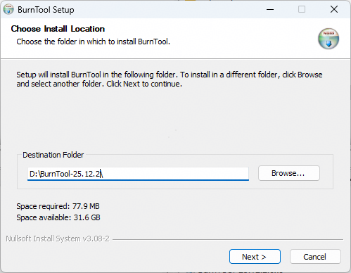

3.  弹出BurnTool选择协议界面，如[图2](#fig310025311224)所示，选择对应的产品，单击“Next”按钮。

    **图 2**  BurnTool选择协议界面<a name="fig310025311224"></a>  
    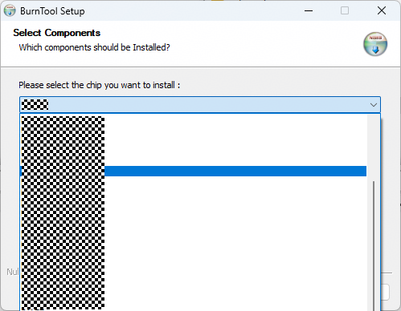

4.  弹出BurnTool额外任务选择界面，如[图3](#fig7113204711510)所示，单击“Install”按钮。

    **图 3**  BurnTool额外任务选择界面<a name="fig7113204711510"></a>  
    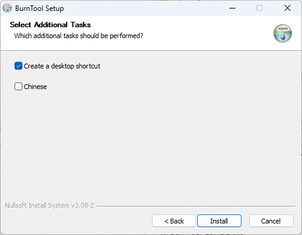

5.  弹出BurnTool正在安装界面，请等待，直至安装完成。
6.  弹出BurnTool安装完成界面，如[图4](#fig1786441312496)所示，单击“Finish”按钮退出安装。

    **图 4**  BurnTool安装完成界面<a name="fig1786441312496"></a>  
    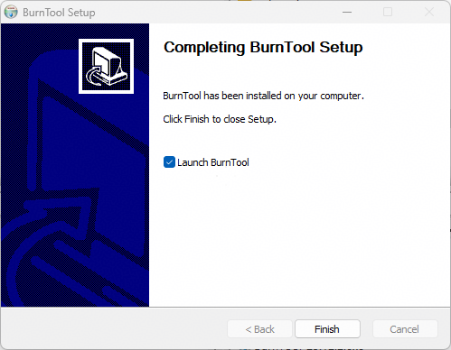

# BurnTool工具简介<a name="ZH-CN_TOPIC_0000001162282010"></a>

-   **[功能说明](#ZH-CN_TOPIC_0000001207563433)**  

-   **[应用场景](#ZH-CN_TOPIC_0000001207961977)**  

-   **[界面说明](#ZH-CN_TOPIC_0000001207843443)**  

## 功能说明<a name="ZH-CN_TOPIC_0000001207563433"></a>

BurnTool是芯片配套的烧写工具，通过打断程序启动的方式，对单板烧写镜像文件。

## 应用场景<a name="ZH-CN_TOPIC_0000001207961977"></a>

BurnTool主要适用于以下场景：

-   镜像烧写
-   导出镜像

## 界面说明<a name="ZH-CN_TOPIC_0000001207843443"></a>

-   **[选择Chip](#ZH-CN_TOPIC_0000001906927033)**  

-   **[BurnTool](#ZH-CN_TOPIC_0000001207721967)**  

-   **[BurnTool-3x](#ZH-CN_TOPIC_0000001906996081)**  

-   **[BurnTool-Sparta](#ZH-CN_TOPIC_0000001860881080)**  

-   **[BurnTool-Dfu](#ZH-CN_TOPIC_0000001860864884)**  

-   **[BurnTool-J-Link](#ZH-CN_TOPIC_0000001906904645)**  

-   **[BurnTool-组播升级](#ZH-CN_TOPIC_0000001861042980)**  

-   **[BurnTool-OTA升级](#ZH-CN_TOPIC_0000001938380988)**  

-   **[BurnTool-TFTP](#ZH-CN_TOPIC_0000002077956033)**  

-   **[BurnTool-MCU](#ZH-CN_TOPIC_0000002041995260)**  

-   **[BurnTool-USB](#ZH-CN_TOPIC_0000002310895974)**  

-   **[工厂烧写](#ZH-CN_TOPIC_0000001162441960)**  

-   **[设置界面](#ZH-CN_TOPIC_0000001161963482)**  

-   **[设置界面-3x](#ZH-CN_TOPIC_0000001907283089)**  

-   **[选择J-Link执行程序界面](#ZH-CN_TOPIC_0000001907005225)**  

### 选择Chip<a name="ZH-CN_TOPIC_0000001906927033"></a>

通过“Option”-“Change chip”打开芯片选择框，用于选择与单板匹配的芯片类型，部分芯片还可选择需要的烧写方式，界面如[图1](#fig131614316534)所示。

**图 1**  选择Chip界面示意图<a name="fig131614316534"></a>  


**表 1**  选择Chip界面说明

<a name="table1923619111210"></a>
<table><thead align="left"><tr id="row8232019141213"><th class="cellrowborder" valign="top" width="13.66%" id="mcps1.2.3.1.1"><p id="p12351913126"><a name="p12351913126"></a><a name="p12351913126"></a>区域</p>
</th>
<th class="cellrowborder" valign="top" width="86.33999999999999%" id="mcps1.2.3.1.2"><p id="p9232199124"><a name="p9232199124"></a><a name="p9232199124"></a>说明</p>
</th>
</tr>
</thead>
<tbody><tr id="row1623119111212"><td class="cellrowborder" valign="top" width="13.66%" headers="mcps1.2.3.1.1 "><p id="p1723219201211"><a name="p1723219201211"></a><a name="p1723219201211"></a>1</p>
</td>
<td class="cellrowborder" valign="top" width="86.33999999999999%" headers="mcps1.2.3.1.2 "><a name="ul15231719181215"></a><a name="ul15231719181215"></a><ul id="ul15231719181215"><li>Chip List：可选芯片列表。</li></ul>
</td>
</tr>
<tr id="row3237195120"><td class="cellrowborder" valign="top" width="13.66%" headers="mcps1.2.3.1.1 "><p id="p2023219131213"><a name="p2023219131213"></a><a name="p2023219131213"></a>2</p>
</td>
<td class="cellrowborder" valign="top" width="86.33999999999999%" headers="mcps1.2.3.1.2 "><a name="ul1231919191217"></a><a name="ul1231919191217"></a><ul id="ul1231919191217"><li>OK：确定选择按钮。</li><li>Cancel：取消选择按钮。</li></ul>
</td>
</tr>
</tbody>
</table>

### BurnTool<a name="ZH-CN_TOPIC_0000001207721967"></a>

BurnTool界面如[图1](#fig18251152003119)所示。

**图 1**  BurnTool界面示意图<a name="fig18251152003119"></a>  
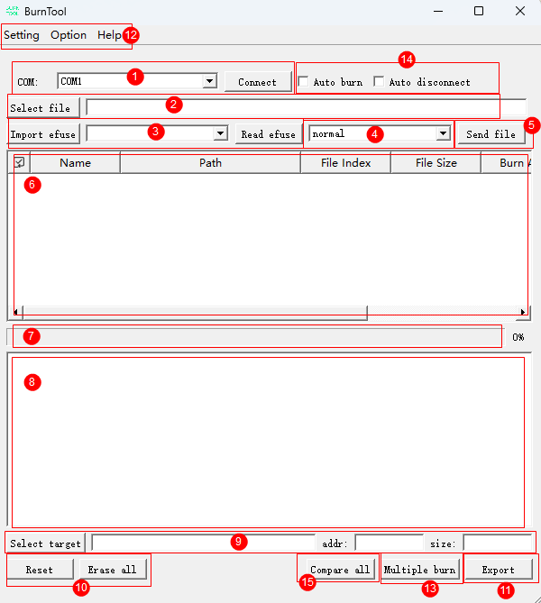

**表 1**  BurnTool界面说明

<a name="zh-cn_topic_0279549098_table156913141826"></a>
<table><thead align="left"><tr id="zh-cn_topic_0279549098_row0695148215"><th class="cellrowborder" valign="top" width="13.669999999999998%" id="mcps1.2.3.1.1"><p id="zh-cn_topic_0279549098_p5455981"><a name="zh-cn_topic_0279549098_p5455981"></a><a name="zh-cn_topic_0279549098_p5455981"></a>区域</p>
</th>
<th class="cellrowborder" valign="top" width="86.33%" id="mcps1.2.3.1.2"><p id="zh-cn_topic_0279549098_p39281331"><a name="zh-cn_topic_0279549098_p39281331"></a><a name="zh-cn_topic_0279549098_p39281331"></a>说明</p>
</th>
</tr>
</thead>
<tbody><tr id="zh-cn_topic_0279549098_row10707148214"><td class="cellrowborder" valign="top" width="13.669999999999998%" headers="mcps1.2.3.1.1 "><p id="zh-cn_topic_0279549098_p47714657"><a name="zh-cn_topic_0279549098_p47714657"></a><a name="zh-cn_topic_0279549098_p47714657"></a>1</p>
</td>
<td class="cellrowborder" valign="top" width="86.33%" headers="mcps1.2.3.1.2 "><a name="zh-cn_topic_0279549098_ul85142597204"></a><a name="zh-cn_topic_0279549098_ul85142597204"></a><ul id="zh-cn_topic_0279549098_ul85142597204"><li>Connect：打开串口并发送打断报文。</li><li>COM：串口号列表，显示当前可用串口号。</li></ul>
</td>
</tr>
<tr id="zh-cn_topic_0279549098_row7702141527"><td class="cellrowborder" valign="top" width="13.669999999999998%" headers="mcps1.2.3.1.1 "><p id="zh-cn_topic_0279549098_p63739165"><a name="zh-cn_topic_0279549098_p63739165"></a><a name="zh-cn_topic_0279549098_p63739165"></a>2</p>
</td>
<td class="cellrowborder" valign="top" width="86.33%" headers="mcps1.2.3.1.2 "><p id="p159272473478"><a name="p159272473478"></a><a name="p159272473478"></a>Select file：选择烧写镜像。</p>
</td>
</tr>
<tr id="zh-cn_topic_0279549098_row107011141123"><td class="cellrowborder" valign="top" width="13.669999999999998%" headers="mcps1.2.3.1.1 "><p id="zh-cn_topic_0279549098_p4179377"><a name="zh-cn_topic_0279549098_p4179377"></a><a name="zh-cn_topic_0279549098_p4179377"></a>3</p>
</td>
<td class="cellrowborder" valign="top" width="86.33%" headers="mcps1.2.3.1.2 "><a name="zh-cn_topic_0279549098_ul121341840460"></a><a name="zh-cn_topic_0279549098_ul121341840460"></a><ul id="zh-cn_topic_0279549098_ul121341840460"><li>Import Efuse：导入eFuse配置文件。</li><li>Efuse列表：显示当前可读取的eFuse名称。</li><li>Read Efuse：根据选中的eFuse下发读取报文。</li></ul>
</td>
</tr>
<tr id="zh-cn_topic_0279549098_row1770214822"><td class="cellrowborder" valign="top" width="13.669999999999998%" headers="mcps1.2.3.1.1 "><p id="zh-cn_topic_0279549098_p57396781"><a name="zh-cn_topic_0279549098_p57396781"></a><a name="zh-cn_topic_0279549098_p57396781"></a>4</p>
</td>
<td class="cellrowborder" valign="top" width="86.33%" headers="mcps1.2.3.1.2 "><a name="zh-cn_topic_0279549098_ul33174514213"></a><a name="zh-cn_topic_0279549098_ul33174514213"></a><ul id="zh-cn_topic_0279549098_ul33174514213"><li>Erase Mode：选择擦除模式。<a name="zh-cn_topic_0279549098_ul11788427400"></a><a name="zh-cn_topic_0279549098_ul11788427400"></a><ul id="zh-cn_topic_0279549098_ul11788427400"><li>normal：按照固件包中的参数进行擦除操作。</li><li>erase all：第一个烧写项烧写前进行全片擦除，剩余烧写项烧写时不再进行擦除操作。</li><li>no erase：不进行擦除操作。注意，该方式需要保证flash为空片或已进行全片擦除。</li></ul>
</li></ul>
</td>
</tr>
<tr id="zh-cn_topic_0279549098_row14707149214"><td class="cellrowborder" valign="top" width="13.669999999999998%" headers="mcps1.2.3.1.1 "><p id="zh-cn_topic_0279549098_p23568328"><a name="zh-cn_topic_0279549098_p23568328"></a><a name="zh-cn_topic_0279549098_p23568328"></a>5</p>
</td>
<td class="cellrowborder" valign="top" width="86.33%" headers="mcps1.2.3.1.2 "><p id="zh-cn_topic_0279549098_p543412584714"><a name="zh-cn_topic_0279549098_p543412584714"></a><a name="zh-cn_topic_0279549098_p543412584714"></a>Send file：按照表格选中信息依次烧写镜像。</p>
</td>
</tr>
<tr id="zh-cn_topic_0279549098_row37018141229"><td class="cellrowborder" valign="top" width="13.669999999999998%" headers="mcps1.2.3.1.1 "><p id="zh-cn_topic_0279549098_p49697568"><a name="zh-cn_topic_0279549098_p49697568"></a><a name="zh-cn_topic_0279549098_p49697568"></a>6</p>
</td>
<td class="cellrowborder" valign="top" width="86.33%" headers="mcps1.2.3.1.2 "><p id="zh-cn_topic_0279549098_p9951144310910"><a name="zh-cn_topic_0279549098_p9951144310910"></a><a name="zh-cn_topic_0279549098_p9951144310910"></a>镜像表格：显示可被烧写的镜像信息。各列含义为：</p>
<a name="zh-cn_topic_0279549098_ul1989564910910"></a><a name="zh-cn_topic_0279549098_ul1989564910910"></a><ul id="zh-cn_topic_0279549098_ul1989564910910"><li>Name：名称。</li><li>Path：路径。</li><li>File Index：镜像在文件中的起始索引。</li><li>File Size：镜像大小。</li><li>Burn Addr：烧写的Flash起始地址。</li><li>Burn Size：擦除的Flash大小。</li><li>Type：通用类型，包括：<a name="zh-cn_topic_0279549098_ul885418294117"></a><a name="zh-cn_topic_0279549098_ul885418294117"></a><ul id="zh-cn_topic_0279549098_ul885418294117"><li>0：Loader。</li><li>1：一般镜像文件。</li><li>2：参数文件。</li><li>3：eFuse文件。</li></ul>
<p id="zh-cn_topic_0279549098_p14365142618416"><a name="zh-cn_topic_0279549098_p14365142618416"></a><a name="zh-cn_topic_0279549098_p14365142618416"></a>其他的数字由各产品定义，不一一列举。</p>
</li></ul>
</td>
</tr>
<tr id="zh-cn_topic_0279549098_row1388672115219"><td class="cellrowborder" valign="top" width="13.669999999999998%" headers="mcps1.2.3.1.1 "><p id="zh-cn_topic_0279549098_p55310098"><a name="zh-cn_topic_0279549098_p55310098"></a><a name="zh-cn_topic_0279549098_p55310098"></a>7</p>
</td>
<td class="cellrowborder" valign="top" width="86.33%" headers="mcps1.2.3.1.2 "><p id="zh-cn_topic_0279549098_p1612521515910"><a name="zh-cn_topic_0279549098_p1612521515910"></a><a name="zh-cn_topic_0279549098_p1612521515910"></a>烧写进度。</p>
</td>
</tr>
<tr id="zh-cn_topic_0279549098_row288620211526"><td class="cellrowborder" valign="top" width="13.669999999999998%" headers="mcps1.2.3.1.1 "><p id="zh-cn_topic_0279549098_p36189605"><a name="zh-cn_topic_0279549098_p36189605"></a><a name="zh-cn_topic_0279549098_p36189605"></a>8</p>
</td>
<td class="cellrowborder" valign="top" width="86.33%" headers="mcps1.2.3.1.2 "><p id="zh-cn_topic_0279549098_p31461811102010"><a name="zh-cn_topic_0279549098_p31461811102010"></a><a name="zh-cn_topic_0279549098_p31461811102010"></a>回显视图：显示打断之后单板上报的数据。</p>
</td>
</tr>
<tr id="zh-cn_topic_0279549098_row1539045322012"><td class="cellrowborder" valign="top" width="13.669999999999998%" headers="mcps1.2.3.1.1 "><p id="zh-cn_topic_0279549098_p1139015311202"><a name="zh-cn_topic_0279549098_p1139015311202"></a><a name="zh-cn_topic_0279549098_p1139015311202"></a>9</p>
</td>
<td class="cellrowborder" valign="top" width="86.33%" headers="mcps1.2.3.1.2 "><a name="zh-cn_topic_0279549098_ul113165792216"></a><a name="zh-cn_topic_0279549098_ul113165792216"></a><ul id="zh-cn_topic_0279549098_ul113165792216"><li>Select target：选择导出镜像位置。</li><li>addr：输入要导出的Flash起始地址。</li><li>size：输入要导出的Flash大小。</li></ul>
</td>
</tr>
<tr id="zh-cn_topic_0279549098_row579172745311"><td class="cellrowborder" valign="top" width="13.669999999999998%" headers="mcps1.2.3.1.1 "><p id="zh-cn_topic_0279549098_p1479220277536"><a name="zh-cn_topic_0279549098_p1479220277536"></a><a name="zh-cn_topic_0279549098_p1479220277536"></a>10</p>
</td>
<td class="cellrowborder" valign="top" width="86.33%" headers="mcps1.2.3.1.2 "><p id="zh-cn_topic_0279549098_p13684748173011"><a name="zh-cn_topic_0279549098_p13684748173011"></a><a name="zh-cn_topic_0279549098_p13684748173011"></a>Reset：重启单板。(本功能仅在烧写loader之后生效)</p>
<p id="zh-cn_topic_0279549098_p025717111612"><a name="zh-cn_topic_0279549098_p025717111612"></a><a name="zh-cn_topic_0279549098_p025717111612"></a>Erase all：全片擦除。(本功能仅在烧写loader之后生效)</p>
</td>
</tr>
<tr id="zh-cn_topic_0279549098_row649954692020"><td class="cellrowborder" valign="top" width="13.669999999999998%" headers="mcps1.2.3.1.1 "><p id="zh-cn_topic_0279549098_p13499164652019"><a name="zh-cn_topic_0279549098_p13499164652019"></a><a name="zh-cn_topic_0279549098_p13499164652019"></a>11</p>
</td>
<td class="cellrowborder" valign="top" width="86.33%" headers="mcps1.2.3.1.2 "><p id="zh-cn_topic_0279549098_p10745162311459"><a name="zh-cn_topic_0279549098_p10745162311459"></a><a name="zh-cn_topic_0279549098_p10745162311459"></a>Export：导出镜像。(本功能仅在烧写loader之后生效)</p>
</td>
</tr>
<tr id="zh-cn_topic_0279549098_row1588515211226"><td class="cellrowborder" valign="top" width="13.669999999999998%" headers="mcps1.2.3.1.1 "><p id="zh-cn_topic_0279549098_p41303584"><a name="zh-cn_topic_0279549098_p41303584"></a><a name="zh-cn_topic_0279549098_p41303584"></a>12</p>
</td>
<td class="cellrowborder" valign="top" width="86.33%" headers="mcps1.2.3.1.2 "><a name="zh-cn_topic_0279549098_ul218617351719"></a><a name="zh-cn_topic_0279549098_ul218617351719"></a><ul id="zh-cn_topic_0279549098_ul218617351719"><li>Setting：包括以下菜单：<a name="zh-cn_topic_0279549098_ul15707193414267"></a><a name="zh-cn_topic_0279549098_ul15707193414267"></a><ul id="zh-cn_topic_0279549098_ul15707193414267"><li>Settings：设置串口参数。</li><li>Burn interval：设置打断间隔（选中2表示打断时以2ms间隔发送打断报文，10同理），可输入值，范围为1～30。</li><li>Import config：导入配置文件。</li><li>Save config：保存配置文件。</li><li>Language：修改语言。</li></ul>
</li><li>Option：包含以下菜单<a name="ul14619118971"></a><a name="ul14619118971"></a><ul id="ul14619118971"><li>Change chip：切换芯片。</li></ul>
</li><li>Help：显示版本号。</li></ul>
</td>
</tr>
<tr id="zh-cn_topic_0279549098_row925116613581"><td class="cellrowborder" valign="top" width="13.669999999999998%" headers="mcps1.2.3.1.1 "><p id="zh-cn_topic_0279549098_p225114685817"><a name="zh-cn_topic_0279549098_p225114685817"></a><a name="zh-cn_topic_0279549098_p225114685817"></a>13</p>
</td>
<td class="cellrowborder" valign="top" width="86.33%" headers="mcps1.2.3.1.2 "><p id="zh-cn_topic_0279549098_p5251156195814"><a name="zh-cn_topic_0279549098_p5251156195814"></a><a name="zh-cn_topic_0279549098_p5251156195814"></a>Multiple burn：进入工厂烧写界面。</p>
</td>
</tr>
<tr id="zh-cn_topic_0279549098_row161301845171317"><td class="cellrowborder" valign="top" width="13.669999999999998%" headers="mcps1.2.3.1.1 "><p id="zh-cn_topic_0279549098_p613164517135"><a name="zh-cn_topic_0279549098_p613164517135"></a><a name="zh-cn_topic_0279549098_p613164517135"></a>14</p>
</td>
<td class="cellrowborder" valign="top" width="86.33%" headers="mcps1.2.3.1.2 "><a name="zh-cn_topic_0279549098_ul11104195221319"></a><a name="zh-cn_topic_0279549098_ul11104195221319"></a><ul id="zh-cn_topic_0279549098_ul11104195221319"><li>Auto burn：打断成功后无需单击“Send file”按钮。工具将按照表格选中的信息依次烧写镜像。<p id="p6318450978"><a name="p6318450978"></a><a name="p6318450978"></a>注意：该功能仅用于烧写，若需要导出镜像或读efuse则不可勾选。</p>
</li><li>Auto disconnect: 在程序烧写完成后自动断开连接。</li></ul>
</td>
</tr>
<tr id="row3787102920181"><td class="cellrowborder" valign="top" width="13.669999999999998%" headers="mcps1.2.3.1.1 "><p id="p15787629101811"><a name="p15787629101811"></a><a name="p15787629101811"></a>15</p>
</td>
<td class="cellrowborder" valign="top" width="86.33%" headers="mcps1.2.3.1.2 "><p id="p16788202915187"><a name="p16788202915187"></a><a name="p16788202915187"></a>Compare All：比较全部文件，当前只有ws63支持。</p>
</td>
</tr>
</tbody>
</table>

### BurnTool-3x<a name="ZH-CN_TOPIC_0000001906996081"></a>

BurnTool界面如[图1](#fig12411194644511)所示。

**图 1**  BurnTool界面示意图<a name="fig12411194644511"></a>  
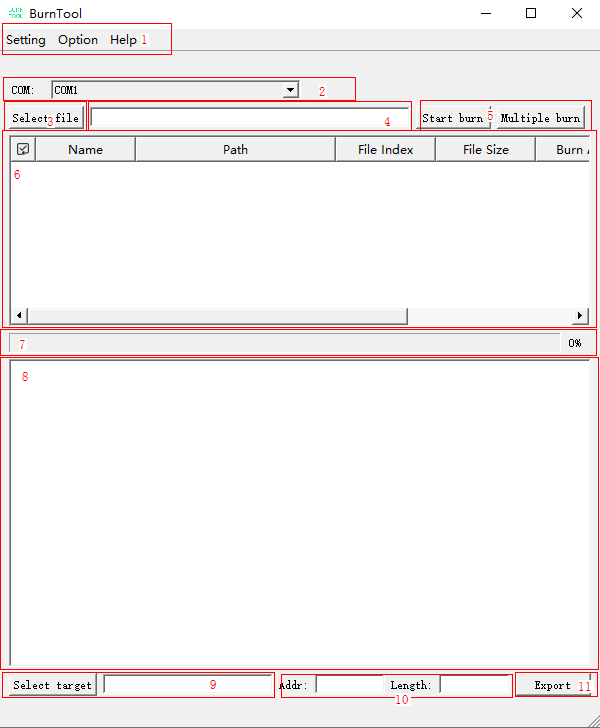

**表 1**  BurnTool界面说明

<a name="table1923619111210"></a>
<table><thead align="left"><tr id="row8232019141213"><th class="cellrowborder" valign="top" width="13.66%" id="mcps1.2.3.1.1"><p id="p12351913126"><a name="p12351913126"></a><a name="p12351913126"></a>区域</p>
</th>
<th class="cellrowborder" valign="top" width="86.33999999999999%" id="mcps1.2.3.1.2"><p id="p9232199124"><a name="p9232199124"></a><a name="p9232199124"></a>说明</p>
</th>
</tr>
</thead>
<tbody><tr id="row1623119111212"><td class="cellrowborder" valign="top" width="13.66%" headers="mcps1.2.3.1.1 "><p id="p1723219201211"><a name="p1723219201211"></a><a name="p1723219201211"></a>1</p>
</td>
<td class="cellrowborder" valign="top" width="86.33999999999999%" headers="mcps1.2.3.1.2 "><a name="ul15231719181215"></a><a name="ul15231719181215"></a><ul id="ul15231719181215"><li>Setting：包括以下菜单：<a name="ul1077410220134"></a><a name="ul1077410220134"></a><ul id="ul1077410220134"><li>Settings：设置串口参数。</li><li>Import config：导入配置文件。</li><li>Save config：保存配置文件。</li><li>Language：修改语言。</li></ul>
</li><li>Option：包括以下菜单：<a name="ul1886910264194"></a><a name="ul1886910264194"></a><ul id="ul1886910264194"><li>Change Chip：修改产品。</li></ul>
</li><li>Help：包括以下菜单：<a name="ul449165114915"></a><a name="ul449165114915"></a><ul id="ul449165114915"><li>About：显示版本信息。</li></ul>
</li></ul>
</td>
</tr>
<tr id="row3237195120"><td class="cellrowborder" valign="top" width="13.66%" headers="mcps1.2.3.1.1 "><p id="p2023219131213"><a name="p2023219131213"></a><a name="p2023219131213"></a>2</p>
</td>
<td class="cellrowborder" valign="top" width="86.33999999999999%" headers="mcps1.2.3.1.2 "><a name="ul1231919191217"></a><a name="ul1231919191217"></a><ul id="ul1231919191217"><li>COM：串口号列表，显示当前可用串口号。</li></ul>
</td>
</tr>
<tr id="row1723121921215"><td class="cellrowborder" valign="top" width="13.66%" headers="mcps1.2.3.1.1 "><p id="p7232019151215"><a name="p7232019151215"></a><a name="p7232019151215"></a>3</p>
</td>
<td class="cellrowborder" valign="top" width="86.33999999999999%" headers="mcps1.2.3.1.2 "><a name="ul123121914123"></a><a name="ul123121914123"></a><ul id="ul123121914123"><li>Select file：选择格式为fwpkg的烧写镜像。</li></ul>
</td>
</tr>
<tr id="row723919141213"><td class="cellrowborder" valign="top" width="13.66%" headers="mcps1.2.3.1.1 "><p id="p1623141971211"><a name="p1623141971211"></a><a name="p1623141971211"></a>4</p>
</td>
<td class="cellrowborder" valign="top" width="86.33999999999999%" headers="mcps1.2.3.1.2 "><a name="ul1023719141210"></a><a name="ul1023719141210"></a><ul id="ul1023719141210"><li>显示烧写镜像路径。</li></ul>
</td>
</tr>
<tr id="row19231319171216"><td class="cellrowborder" valign="top" width="13.66%" headers="mcps1.2.3.1.1 "><p id="p17231219121216"><a name="p17231219121216"></a><a name="p17231219121216"></a>5</p>
</td>
<td class="cellrowborder" valign="top" width="86.33999999999999%" headers="mcps1.2.3.1.2 "><a name="ul153732715383"></a><a name="ul153732715383"></a><ul id="ul153732715383"><li>Start burn：按照表格选中信息依次烧写镜像。</li><li>Multiple burn：打开工厂一拖多烧写界面。</li></ul>
</td>
</tr>
<tr id="row112481931213"><td class="cellrowborder" valign="top" width="13.66%" headers="mcps1.2.3.1.1 "><p id="p1324219121220"><a name="p1324219121220"></a><a name="p1324219121220"></a>6</p>
</td>
<td class="cellrowborder" valign="top" width="86.33999999999999%" headers="mcps1.2.3.1.2 "><p id="p20241719121218"><a name="p20241719121218"></a><a name="p20241719121218"></a>镜像表格：显示可被烧写的镜像信息。各列含义为：</p>
<a name="ul1824161981218"></a><a name="ul1824161981218"></a><ul id="ul1824161981218"><li>Name：名称。</li><li>Path：路径。</li><li>File Index：镜像在文件中的起始索引。</li><li>File Size：镜像大小。</li><li>Burn Addr：烧写的Flash起始地址。</li><li>Burn Size：擦除的Flash大小。</li><li>Type：通用类型，包括：<a name="ul1724161919122"></a><a name="ul1724161919122"></a><ul id="ul1724161919122"><li>0：ssb镜像。</li><li>18：application镜像。</li><li>19：application签名文件。</li><li>20：bt镜像。</li><li>21：bt签名文件。</li><li>22：dsp main镜像。</li><li>23：dsp main签名文件。</li><li>24：ssb校验文件。</li><li>25：ssb签名文件。</li><li>26：dsp overlay镜像。</li><li>27：dsp overlay签名文件。</li><li>30：ssb公匙文件。</li><li>31：ssb二级证书。</li><li>100：flash文件。</li><li>101：文件系统镜像。</li><li>102：flash/文件系统镜像/otp校验文件。</li><li>103：otp文件。</li></ul>
</li></ul>
</td>
</tr>
<tr id="row824119151216"><td class="cellrowborder" valign="top" width="13.66%" headers="mcps1.2.3.1.1 "><p id="p1024719131211"><a name="p1024719131211"></a><a name="p1024719131211"></a>7</p>
</td>
<td class="cellrowborder" valign="top" width="86.33999999999999%" headers="mcps1.2.3.1.2 "><a name="ul19822102410408"></a><a name="ul19822102410408"></a><ul id="ul19822102410408"><li>烧写进度。</li></ul>
</td>
</tr>
<tr id="row2024101919122"><td class="cellrowborder" valign="top" width="13.66%" headers="mcps1.2.3.1.1 "><p id="p82411911120"><a name="p82411911120"></a><a name="p82411911120"></a>8</p>
</td>
<td class="cellrowborder" valign="top" width="86.33999999999999%" headers="mcps1.2.3.1.2 "><a name="ul68661610184110"></a><a name="ul68661610184110"></a><ul id="ul68661610184110"><li>日志视图：显示烧写过程中单板上报的日志及工具打印的日志。</li></ul>
</td>
</tr>
<tr id="row112051255124818"><td class="cellrowborder" valign="top" width="13.66%" headers="mcps1.2.3.1.1 "><p id="p6205455174816"><a name="p6205455174816"></a><a name="p6205455174816"></a>9</p>
</td>
<td class="cellrowborder" valign="top" width="86.33999999999999%" headers="mcps1.2.3.1.2 "><a name="ul1319713115018"></a><a name="ul1319713115018"></a><ul id="ul1319713115018"><li>Select target：选择一个文件路径。</li></ul>
</td>
</tr>
<tr id="row19392174916489"><td class="cellrowborder" valign="top" width="13.66%" headers="mcps1.2.3.1.1 "><p id="p18393124984811"><a name="p18393124984811"></a><a name="p18393124984811"></a>10</p>
</td>
<td class="cellrowborder" valign="top" width="86.33999999999999%" headers="mcps1.2.3.1.2 "><a name="ul1136381355219"></a><a name="ul1136381355219"></a><ul id="ul1136381355219"><li>Addr：导出镜像起始地址。</li><li>Length：导出镜像的长度。</li></ul>
</td>
</tr>
<tr id="row18741204497"><td class="cellrowborder" valign="top" width="13.66%" headers="mcps1.2.3.1.1 "><p id="p2741804491"><a name="p2741804491"></a><a name="p2741804491"></a>11</p>
</td>
<td class="cellrowborder" valign="top" width="86.33999999999999%" headers="mcps1.2.3.1.2 "><a name="ul9672165115311"></a><a name="ul9672165115311"></a><ul id="ul9672165115311"><li>Export：导出开始按钮。（开始后按钮会变为stop，并再次点击将会停止导出。）</li></ul>
</td>
</tr>
</tbody>
</table>

### BurnTool-Sparta<a name="ZH-CN_TOPIC_0000001860881080"></a>

BurnTool界面如[图1](#fig1518172194411)所示。

**图 1**  BurnTool界面示意图<a name="fig1518172194411"></a>  
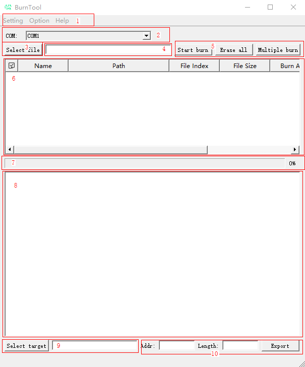

**表 1**  BurnTool界面说明

<a name="table1923619111210"></a>
<table><thead align="left"><tr id="row8232019141213"><th class="cellrowborder" valign="top" width="13.66%" id="mcps1.2.3.1.1"><p id="p12351913126"><a name="p12351913126"></a><a name="p12351913126"></a>区域</p>
</th>
<th class="cellrowborder" valign="top" width="86.33999999999999%" id="mcps1.2.3.1.2"><p id="p9232199124"><a name="p9232199124"></a><a name="p9232199124"></a>说明</p>
</th>
</tr>
</thead>
<tbody><tr id="row1623119111212"><td class="cellrowborder" valign="top" width="13.66%" headers="mcps1.2.3.1.1 "><p id="p1723219201211"><a name="p1723219201211"></a><a name="p1723219201211"></a>1</p>
</td>
<td class="cellrowborder" valign="top" width="86.33999999999999%" headers="mcps1.2.3.1.2 "><a name="ul15231719181215"></a><a name="ul15231719181215"></a><ul id="ul15231719181215"><li>Setting：包括以下菜单：<a name="ul1077410220134"></a><a name="ul1077410220134"></a><ul id="ul1077410220134"><li>Settings：设置串口参数。</li><li>Import config：导入配置文件。</li><li>Save config：保存配置文件。</li><li>Language：修改语言。</li></ul>
</li><li>Option：包括以下菜单：<a name="ul1886910264194"></a><a name="ul1886910264194"></a><ul id="ul1886910264194"><li>Change Chip：修改产品。</li></ul>
</li><li>Help：包括以下菜单：<a name="ul449165114915"></a><a name="ul449165114915"></a><ul id="ul449165114915"><li>About：显示版本信息。</li></ul>
</li></ul>
</td>
</tr>
<tr id="row3237195120"><td class="cellrowborder" valign="top" width="13.66%" headers="mcps1.2.3.1.1 "><p id="p2023219131213"><a name="p2023219131213"></a><a name="p2023219131213"></a>2</p>
</td>
<td class="cellrowborder" valign="top" width="86.33999999999999%" headers="mcps1.2.3.1.2 "><a name="ul1231919191217"></a><a name="ul1231919191217"></a><ul id="ul1231919191217"><li>COM：串口号列表，显示当前可用串口号。</li></ul>
</td>
</tr>
<tr id="row1723121921215"><td class="cellrowborder" valign="top" width="13.66%" headers="mcps1.2.3.1.1 "><p id="p7232019151215"><a name="p7232019151215"></a><a name="p7232019151215"></a>3</p>
</td>
<td class="cellrowborder" valign="top" width="86.33999999999999%" headers="mcps1.2.3.1.2 "><a name="ul123121914123"></a><a name="ul123121914123"></a><ul id="ul123121914123"><li>Select file：选择格式为fwpkg的烧写镜像。</li></ul>
</td>
</tr>
<tr id="row723919141213"><td class="cellrowborder" valign="top" width="13.66%" headers="mcps1.2.3.1.1 "><p id="p1623141971211"><a name="p1623141971211"></a><a name="p1623141971211"></a>4</p>
</td>
<td class="cellrowborder" valign="top" width="86.33999999999999%" headers="mcps1.2.3.1.2 "><a name="ul1023719141210"></a><a name="ul1023719141210"></a><ul id="ul1023719141210"><li>显示烧写镜像路径。</li></ul>
</td>
</tr>
<tr id="row19231319171216"><td class="cellrowborder" valign="top" width="13.66%" headers="mcps1.2.3.1.1 "><p id="p17231219121216"><a name="p17231219121216"></a><a name="p17231219121216"></a>5</p>
</td>
<td class="cellrowborder" valign="top" width="86.33999999999999%" headers="mcps1.2.3.1.2 "><a name="ul153732715383"></a><a name="ul153732715383"></a><ul id="ul153732715383"><li>Start burn：按照表格选中信息依次烧写镜像。</li><li>Erase all：擦除全部镜像。</li><li>Multiple burn：打开工厂一拖多烧写界面。</li></ul>
</td>
</tr>
<tr id="row112481931213"><td class="cellrowborder" valign="top" width="13.66%" headers="mcps1.2.3.1.1 "><p id="p1324219121220"><a name="p1324219121220"></a><a name="p1324219121220"></a>6</p>
</td>
<td class="cellrowborder" valign="top" width="86.33999999999999%" headers="mcps1.2.3.1.2 "><p id="p20241719121218"><a name="p20241719121218"></a><a name="p20241719121218"></a>镜像表格：显示可被烧写的镜像信息。各列含义为：</p>
<a name="ul1824161981218"></a><a name="ul1824161981218"></a><ul id="ul1824161981218"><li>Name：名称。</li><li>Path：路径。</li><li>File Index：镜像在文件中的起始索引。</li><li>File Size：镜像大小。</li><li>Burn Addr：烧写的Flash起始地址。</li><li>Burn Size：擦除的Flash大小。</li><li>Type：通用类型，包括：<a name="ul1724161919122"></a><a name="ul1724161919122"></a><ul id="ul1724161919122"><li>0：ssb文件。</li><li>18：application文件。</li><li>19：application签名文件。</li><li>20：bt文件。</li><li>21：bt签名文件。</li><li>22：dsp main文件。</li><li>23：dsp main签名文件。</li><li>24：ssb校验文件。</li><li>25：ssb签名文件。</li><li>26：dsp overlay文件。</li><li>27：dsp overlay签名文件。</li><li>30：ssb公匙文件。</li><li>31：ssb二级证书。</li><li>100：flash文件。</li><li>101：文件系统镜像。</li><li>102：flash/文件系统镜像/otp校验文件。</li><li>103：otp文件。</li></ul>
</li></ul>
</td>
</tr>
<tr id="row824119151216"><td class="cellrowborder" valign="top" width="13.66%" headers="mcps1.2.3.1.1 "><p id="p1024719131211"><a name="p1024719131211"></a><a name="p1024719131211"></a>7</p>
</td>
<td class="cellrowborder" valign="top" width="86.33999999999999%" headers="mcps1.2.3.1.2 "><a name="ul19822102410408"></a><a name="ul19822102410408"></a><ul id="ul19822102410408"><li>烧写进度。</li></ul>
</td>
</tr>
<tr id="row2024101919122"><td class="cellrowborder" valign="top" width="13.66%" headers="mcps1.2.3.1.1 "><p id="p82411911120"><a name="p82411911120"></a><a name="p82411911120"></a>8</p>
</td>
<td class="cellrowborder" valign="top" width="86.33999999999999%" headers="mcps1.2.3.1.2 "><a name="ul68661610184110"></a><a name="ul68661610184110"></a><ul id="ul68661610184110"><li>日志视图：显示烧写过程中单板上报的日志及工具打印的日志。</li></ul>
</td>
</tr>
<tr id="row15277181771712"><td class="cellrowborder" valign="top" width="13.66%" headers="mcps1.2.3.1.1 "><p id="p18393124984811"><a name="p18393124984811"></a><a name="p18393124984811"></a>10</p>
</td>
<td class="cellrowborder" valign="top" width="86.33999999999999%" headers="mcps1.2.3.1.2 "><a name="ul1136381355219"></a><a name="ul1136381355219"></a><ul id="ul1136381355219"><li>Addr：导出镜像起始地址。</li><li>Length：导出镜像的长度。</li></ul>
</td>
</tr>
<tr id="row41456215177"><td class="cellrowborder" valign="top" width="13.66%" headers="mcps1.2.3.1.1 "><p id="p2741804491"><a name="p2741804491"></a><a name="p2741804491"></a>11</p>
</td>
<td class="cellrowborder" valign="top" width="86.33999999999999%" headers="mcps1.2.3.1.2 "><a name="ul9672165115311"></a><a name="ul9672165115311"></a><ul id="ul9672165115311"><li>Export：导出开始按钮。（开始后按钮会变为stop，并再次点击将会停止导出。）</li></ul>
</td>
</tr>
</tbody>
</table>

### BurnTool-Dfu<a name="ZH-CN_TOPIC_0000001860864884"></a>

DFU升级界面如[图1](#fig67031058134814)所示，Auto DFU烧写界面如[图2](#fig450363243119)所示，Hid DFU升级界面如[图3](#fig965583135018)所示

**图 1**  DFU升级界面<a name="fig67031058134814"></a>  


**图 2**  Auto DFU烧写界面<a name="fig450363243119"></a>  
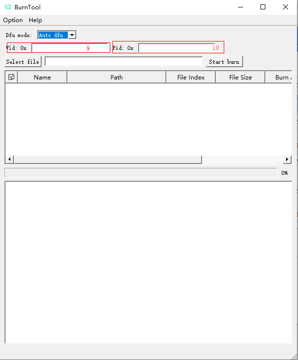

**图 3**  Hid DFU升级界面<a name="fig965583135018"></a>  


**表 1**  Dfu烧写界面说明

<a name="table1923619111210"></a>
<table><thead align="left"><tr id="row8232019141213"><th class="cellrowborder" valign="top" width="13.66%" id="mcps1.2.3.1.1"><p id="p12351913126"><a name="p12351913126"></a><a name="p12351913126"></a>区域</p>
</th>
<th class="cellrowborder" valign="top" width="86.33999999999999%" id="mcps1.2.3.1.2"><p id="p9232199124"><a name="p9232199124"></a><a name="p9232199124"></a>说明</p>
</th>
</tr>
</thead>
<tbody><tr id="row1623119111212"><td class="cellrowborder" valign="top" width="13.66%" headers="mcps1.2.3.1.1 "><p id="p1723219201211"><a name="p1723219201211"></a><a name="p1723219201211"></a>1</p>
</td>
<td class="cellrowborder" valign="top" width="86.33999999999999%" headers="mcps1.2.3.1.2 "><a name="ul15231719181215"></a><a name="ul15231719181215"></a><ul id="ul15231719181215"><li>Option：包括以下菜单：<a name="ul1886910264194"></a><a name="ul1886910264194"></a><ul id="ul1886910264194"><li>Change Chip：修改产品。</li><li>Language：修改语言。</li></ul>
</li><li>Help：包括以下菜单：<a name="ul449165114915"></a><a name="ul449165114915"></a><ul id="ul449165114915"><li>About：显示版本信息。</li></ul>
</li></ul>
</td>
</tr>
<tr id="row8226123835212"><td class="cellrowborder" valign="top" width="13.66%" headers="mcps1.2.3.1.1 "><p id="p19226143818521"><a name="p19226143818521"></a><a name="p19226143818521"></a>2</p>
</td>
<td class="cellrowborder" valign="top" width="86.33999999999999%" headers="mcps1.2.3.1.2 "><a name="ul19532650175210"></a><a name="ul19532650175210"></a><ul id="ul19532650175210"><li>Dfu mode：选择DFU的升级模式<a name="ul8603024165318"></a><a name="ul8603024165318"></a><ul id="ul8603024165318"><li>Dfu： 在hid状态切换到dfu升级模式进行dfu升级。</li><li>Auto dfu：直接进入dfu升级模式。</li><li>Hid dfu：在hid状态直接升级。</li></ul>
</li></ul>
</td>
</tr>
<tr id="row3237195120"><td class="cellrowborder" valign="top" width="13.66%" headers="mcps1.2.3.1.1 "><p id="p2023219131213"><a name="p2023219131213"></a><a name="p2023219131213"></a>3</p>
</td>
<td class="cellrowborder" valign="top" width="86.33999999999999%" headers="mcps1.2.3.1.2 "><a name="ul1231919191217"></a><a name="ul1231919191217"></a><ul id="ul1231919191217"><li>USB：显示所有的USB-HID设备</li></ul>
</td>
</tr>
<tr id="row723919141213"><td class="cellrowborder" valign="top" width="13.66%" headers="mcps1.2.3.1.1 "><p id="p1623141971211"><a name="p1623141971211"></a><a name="p1623141971211"></a>4</p>
</td>
<td class="cellrowborder" valign="top" width="86.33999999999999%" headers="mcps1.2.3.1.2 "><a name="ul1023719141210"></a><a name="ul1023719141210"></a><ul id="ul1023719141210"><li>Select file：选择格式为fwpkg的烧写镜像，并显示烧写镜像路径。</li></ul>
</td>
</tr>
<tr id="row19231319171216"><td class="cellrowborder" valign="top" width="13.66%" headers="mcps1.2.3.1.1 "><p id="p17231219121216"><a name="p17231219121216"></a><a name="p17231219121216"></a>5</p>
</td>
<td class="cellrowborder" valign="top" width="86.33999999999999%" headers="mcps1.2.3.1.2 "><a name="ul153732715383"></a><a name="ul153732715383"></a><ul id="ul153732715383"><li>Start burn：按照表格选中信息依次烧写镜像。</li></ul>
</td>
</tr>
<tr id="row112481931213"><td class="cellrowborder" valign="top" width="13.66%" headers="mcps1.2.3.1.1 "><p id="p1324219121220"><a name="p1324219121220"></a><a name="p1324219121220"></a>6</p>
</td>
<td class="cellrowborder" valign="top" width="86.33999999999999%" headers="mcps1.2.3.1.2 "><p id="p20241719121218"><a name="p20241719121218"></a><a name="p20241719121218"></a>镜像表格：显示可被烧写的镜像信息。各列含义为：</p>
<a name="ul1824161981218"></a><a name="ul1824161981218"></a><ul id="ul1824161981218"><li>Name：名称。</li><li>Path：路径。</li><li>File Index：镜像在文件中的起始索引。</li><li>File Size：镜像大小。</li><li>Burn Addr：烧写的Flash起始地址。</li><li>Burn Size：擦除的Flash大小。</li><li>Type：通用类型，包括：<a name="zh-cn_topic_0279549098_ul885418294117"></a><a name="zh-cn_topic_0279549098_ul885418294117"></a><ul id="zh-cn_topic_0279549098_ul885418294117"><li>0：Loader。</li><li>1：一般镜像文件。</li><li>2：参数文件。</li><li>3：eFuse文件。</li></ul>
<a name="ul41646461563"></a><a name="ul41646461563"></a><ul id="ul41646461563"><li>32：fota文件。</li></ul>
</li></ul>
</td>
</tr>
<tr id="row824119151216"><td class="cellrowborder" valign="top" width="13.66%" headers="mcps1.2.3.1.1 "><p id="p1024719131211"><a name="p1024719131211"></a><a name="p1024719131211"></a>7</p>
</td>
<td class="cellrowborder" valign="top" width="86.33999999999999%" headers="mcps1.2.3.1.2 "><a name="ul19822102410408"></a><a name="ul19822102410408"></a><ul id="ul19822102410408"><li>烧写进度。</li></ul>
</td>
</tr>
<tr id="row2024101919122"><td class="cellrowborder" valign="top" width="13.66%" headers="mcps1.2.3.1.1 "><p id="p82411911120"><a name="p82411911120"></a><a name="p82411911120"></a>8</p>
</td>
<td class="cellrowborder" valign="top" width="86.33999999999999%" headers="mcps1.2.3.1.2 "><a name="ul68661610184110"></a><a name="ul68661610184110"></a><ul id="ul68661610184110"><li>日志视图：显示烧写过程中单板上报的日志及工具打印的日志。</li></ul>
</td>
</tr>
<tr id="row2842044193219"><td class="cellrowborder" valign="top" width="13.66%" headers="mcps1.2.3.1.1 "><p id="p14842124413213"><a name="p14842124413213"></a><a name="p14842124413213"></a>9</p>
</td>
<td class="cellrowborder" valign="top" width="86.33999999999999%" headers="mcps1.2.3.1.2 "><a name="ul465664163310"></a><a name="ul465664163310"></a><ul id="ul465664163310"><li>Vid：设备的Vendor ID。</li></ul>
</td>
</tr>
<tr id="row5572238203214"><td class="cellrowborder" valign="top" width="13.66%" headers="mcps1.2.3.1.1 "><p id="p1257363817326"><a name="p1257363817326"></a><a name="p1257363817326"></a>10</p>
</td>
<td class="cellrowborder" valign="top" width="86.33999999999999%" headers="mcps1.2.3.1.2 "><a name="ul1845617330340"></a><a name="ul1845617330340"></a><ul id="ul1845617330340"><li>Pid：设备的Product ID。</li></ul>
</td>
</tr>
</tbody>
</table>

### BurnTool-J-Link<a name="ZH-CN_TOPIC_0000001906904645"></a>

J-Link烧写界面如[图1](#fig12224550243)所示

**图 1** J-Link烧写界面<a name="fig12224550243"></a>  


**表 1** J-Link烧写界面说明

<a name="table1923619111210"></a>
<table><thead align="left"><tr id="row8232019141213"><th class="cellrowborder" valign="top" width="13.66%" id="mcps1.2.3.1.1"><p id="p12351913126"><a name="p12351913126"></a><a name="p12351913126"></a>区域</p>
</th>
<th class="cellrowborder" valign="top" width="86.33999999999999%" id="mcps1.2.3.1.2"><p id="p9232199124"><a name="p9232199124"></a><a name="p9232199124"></a>说明</p>
</th>
</tr>
</thead>
<tbody><tr id="row1623119111212"><td class="cellrowborder" valign="top" width="13.66%" headers="mcps1.2.3.1.1 "><p id="p1723219201211"><a name="p1723219201211"></a><a name="p1723219201211"></a>1</p>
</td>
<td class="cellrowborder" valign="top" width="86.33999999999999%" headers="mcps1.2.3.1.2 "><a name="ul15231719181215"></a><a name="ul15231719181215"></a><ul id="ul15231719181215"><li>Setting：<div class="p" id="p8924153174517"><a name="p8924153174517"></a><a name="p8924153174517"></a>包括以下菜单：<a name="ul1077410220134"></a><a name="ul1077410220134"></a><ul id="ul1077410220134"><li>J<span id="ph121031858191319"><a name="ph121031858191319"></a><a name="ph121031858191319"></a>-</span><span id="ph24790595137"><a name="ph24790595137"></a><a name="ph24790595137"></a>L</span>ink Settings：设置J<span id="ph1054417291412"><a name="ph1054417291412"></a><a name="ph1054417291412"></a>-</span><span id="ph2115134111413"><a name="ph2115134111413"></a><a name="ph2115134111413"></a>L</span>ink执行文件路径。</li><li>Language：修改语言。</li></ul>
</div>
</li><li>Option：<div class="p" id="p381645954511"><a name="p381645954511"></a><a name="p381645954511"></a>包括以下菜单：<a name="ul1886910264194"></a><a name="ul1886910264194"></a><ul id="ul1886910264194"><li>Change Chip：修改产品。</li></ul>
</div>
</li><li>Help：<div class="p" id="p45421933465"><a name="p45421933465"></a><a name="p45421933465"></a>包括以下菜单：<a name="ul449165114915"></a><a name="ul449165114915"></a><ul id="ul449165114915"><li>About：显示版本信息。</li></ul>
</div>
</li></ul>
</td>
</tr>
<tr id="row3237195120"><td class="cellrowborder" valign="top" width="13.66%" headers="mcps1.2.3.1.1 "><p id="p2023219131213"><a name="p2023219131213"></a><a name="p2023219131213"></a>2</p>
</td>
<td class="cellrowborder" valign="top" width="86.33999999999999%" headers="mcps1.2.3.1.2 "><p id="p17153174519450"><a name="p17153174519450"></a><a name="p17153174519450"></a>Select file：选择格式为fwpkg的烧写镜像。</p>
</td>
</tr>
<tr id="row1723121921215"><td class="cellrowborder" valign="top" width="13.66%" headers="mcps1.2.3.1.1 "><p id="p7232019151215"><a name="p7232019151215"></a><a name="p7232019151215"></a>3</p>
</td>
<td class="cellrowborder" valign="top" width="86.33999999999999%" headers="mcps1.2.3.1.2 "><p id="p19153145184516"><a name="p19153145184516"></a><a name="p19153145184516"></a>Start burn：按照表格选中信息依次烧写镜像。</p>
</td>
</tr>
<tr id="row723919141213"><td class="cellrowborder" valign="top" width="13.66%" headers="mcps1.2.3.1.1 "><p id="p1623141971211"><a name="p1623141971211"></a><a name="p1623141971211"></a>4</p>
</td>
<td class="cellrowborder" valign="top" width="86.33999999999999%" headers="mcps1.2.3.1.2 "><p id="p858114453113"><a name="p858114453113"></a><a name="p858114453113"></a>镜像表格：显示可被烧写的镜像信息。各列含义如下。</p>
<a name="ul9925203813115"></a><a name="ul9925203813115"></a><ul id="ul9925203813115"><li>Name：名称。</li><li>Path：路径。</li><li>File Index：镜像在文件中的起始索引。</li><li>File Size：镜像大小。</li><li>Burn Addr：烧写的Flash起始地址。</li><li>Burn Size：擦除的Flash大小。</li><li>Type：烧写文件类型。</li></ul>
</td>
</tr>
<tr id="row19231319171216"><td class="cellrowborder" valign="top" width="13.66%" headers="mcps1.2.3.1.1 "><p id="p17231219121216"><a name="p17231219121216"></a><a name="p17231219121216"></a>5</p>
</td>
<td class="cellrowborder" valign="top" width="86.33999999999999%" headers="mcps1.2.3.1.2 "><p id="p15731542194514"><a name="p15731542194514"></a><a name="p15731542194514"></a>烧写进度。</p>
</td>
</tr>
<tr id="row112481931213"><td class="cellrowborder" valign="top" width="13.66%" headers="mcps1.2.3.1.1 "><p id="p1324219121220"><a name="p1324219121220"></a><a name="p1324219121220"></a>6</p>
</td>
<td class="cellrowborder" valign="top" width="86.33999999999999%" headers="mcps1.2.3.1.2 "><p id="p77481142134518"><a name="p77481142134518"></a><a name="p77481142134518"></a>日志视图：显示烧写过程中单板上报的日志及工具打印的日志。</p>
</td>
</tr>
</tbody>
</table>

### BurnTool-组播升级<a name="ZH-CN_TOPIC_0000001861042980"></a>

组播升级界面如[图1](#fig15454123811217)所示。

**图 1**  组播升级界面<a name="fig15454123811217"></a>  
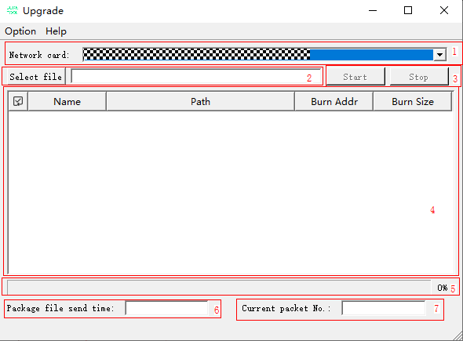

**表 1**  组播升级界面说明

<a name="table1923619111210"></a>
<table><thead align="left"><tr id="row8232019141213"><th class="cellrowborder" valign="top" width="16.42%" id="mcps1.2.3.1.1"><p id="p12351913126"><a name="p12351913126"></a><a name="p12351913126"></a>区域</p>
</th>
<th class="cellrowborder" valign="top" width="83.58%" id="mcps1.2.3.1.2"><p id="p9232199124"><a name="p9232199124"></a><a name="p9232199124"></a>说明</p>
</th>
</tr>
</thead>
<tbody><tr id="row1623119111212"><td class="cellrowborder" valign="top" width="16.42%" headers="mcps1.2.3.1.1 "><p id="p1723219201211"><a name="p1723219201211"></a><a name="p1723219201211"></a>1</p>
</td>
<td class="cellrowborder" valign="top" width="83.58%" headers="mcps1.2.3.1.2 "><p id="p71822018104514"><a name="p71822018104514"></a><a name="p71822018104514"></a>Network card：选择网卡。组播升级默认使用13456端口。</p>
</td>
</tr>
<tr id="row3237195120"><td class="cellrowborder" valign="top" width="16.42%" headers="mcps1.2.3.1.1 "><p id="p2023219131213"><a name="p2023219131213"></a><a name="p2023219131213"></a>2</p>
</td>
<td class="cellrowborder" valign="top" width="83.58%" headers="mcps1.2.3.1.2 "><p id="p3988172212452"><a name="p3988172212452"></a><a name="p3988172212452"></a>Select file：选择升级文件。</p>
</td>
</tr>
<tr id="row1723121921215"><td class="cellrowborder" valign="top" width="16.42%" headers="mcps1.2.3.1.1 "><p id="p7232019151215"><a name="p7232019151215"></a><a name="p7232019151215"></a>3</p>
</td>
<td class="cellrowborder" valign="top" width="83.58%" headers="mcps1.2.3.1.2 "><a name="ul339161711819"></a><a name="ul339161711819"></a><ul id="ul339161711819"><li>Start：开始升级。</li><li>Stop：停止升级。</li></ul>
</td>
</tr>
<tr id="row723919141213"><td class="cellrowborder" valign="top" width="16.42%" headers="mcps1.2.3.1.1 "><p id="p1623141971211"><a name="p1623141971211"></a><a name="p1623141971211"></a>4</p>
</td>
<td class="cellrowborder" valign="top" width="83.58%" headers="mcps1.2.3.1.2 "><p id="p9604154051915"><a name="p9604154051915"></a><a name="p9604154051915"></a>升级文件信息表。各列含义如下。</p>
<a name="ul1023719141210"></a><a name="ul1023719141210"></a><ul id="ul1023719141210"><li>Name：名称。</li><li>Path：路径。</li><li>Burn Addr：升级的起始地址。</li><li>Burn Size：升级的大小。</li></ul>
</td>
</tr>
<tr id="row19231319171216"><td class="cellrowborder" valign="top" width="16.42%" headers="mcps1.2.3.1.1 "><p id="p17231219121216"><a name="p17231219121216"></a><a name="p17231219121216"></a>5</p>
</td>
<td class="cellrowborder" valign="top" width="83.58%" headers="mcps1.2.3.1.2 "><p id="p105151027174512"><a name="p105151027174512"></a><a name="p105151027174512"></a>升级进度。</p>
</td>
</tr>
<tr id="row112481931213"><td class="cellrowborder" valign="top" width="16.42%" headers="mcps1.2.3.1.1 "><p id="p1324219121220"><a name="p1324219121220"></a><a name="p1324219121220"></a>6</p>
</td>
<td class="cellrowborder" valign="top" width="83.58%" headers="mcps1.2.3.1.2 "><p id="p14515102764517"><a name="p14515102764517"></a><a name="p14515102764517"></a>Package file send time：文件发送次数。</p>
</td>
</tr>
<tr id="row824119151216"><td class="cellrowborder" valign="top" width="16.42%" headers="mcps1.2.3.1.1 "><p id="p1024719131211"><a name="p1024719131211"></a><a name="p1024719131211"></a>7</p>
</td>
<td class="cellrowborder" valign="top" width="83.58%" headers="mcps1.2.3.1.2 "><p id="p4516152717451"><a name="p4516152717451"></a><a name="p4516152717451"></a>Current packet No.：当前包的编号。</p>
</td>
</tr>
</tbody>
</table>

### BurnTool-OTA升级<a name="ZH-CN_TOPIC_0000001938380988"></a>

OTA升级界面如[图1](#fig9360446113611)所示

**图 1**  OTA升级界面示意图<a name="fig9360446113611"></a>  
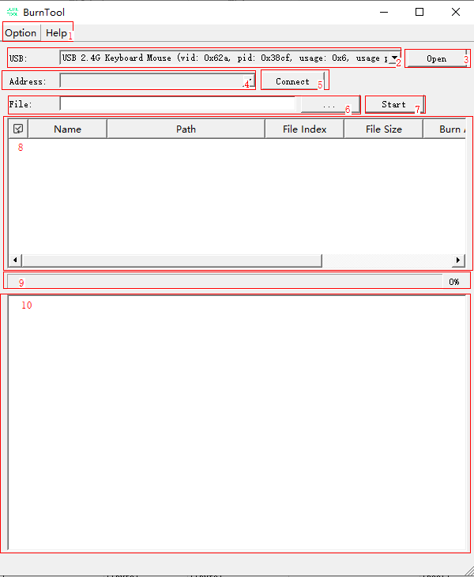

**表 1** OTA升级界面说明

<a name="table1923619111210"></a>
<table><thead align="left"><tr id="row8232019141213"><th class="cellrowborder" valign="top" width="13.66%" id="mcps1.2.3.1.1"><p id="p12351913126"><a name="p12351913126"></a><a name="p12351913126"></a>区域</p>
</th>
<th class="cellrowborder" valign="top" width="86.33999999999999%" id="mcps1.2.3.1.2"><p id="p9232199124"><a name="p9232199124"></a><a name="p9232199124"></a>说明</p>
</th>
</tr>
</thead>
<tbody><tr id="row1623119111212"><td class="cellrowborder" valign="top" width="13.66%" headers="mcps1.2.3.1.1 "><p id="p1723219201211"><a name="p1723219201211"></a><a name="p1723219201211"></a>1</p>
</td>
<td class="cellrowborder" valign="top" width="86.33999999999999%" headers="mcps1.2.3.1.2 "><a name="ul15231719181215"></a><a name="ul15231719181215"></a><ul id="ul15231719181215"><li>Option：<div class="p" id="p381645954511"><a name="p381645954511"></a><a name="p381645954511"></a>包括以下菜单：<a name="ul1886910264194"></a><a name="ul1886910264194"></a><ul id="ul1886910264194"><li>Change Chip：修改产品。</li><li>Language：修改语言。</li></ul>
</div>
</li><li>Help：<div class="p" id="p45421933465"><a name="p45421933465"></a><a name="p45421933465"></a>包括以下菜单：<a name="ul449165114915"></a><a name="ul449165114915"></a><ul id="ul449165114915"><li>About：显示版本信息。</li></ul>
</div>
</li></ul>
</td>
</tr>
<tr id="row3237195120"><td class="cellrowborder" valign="top" width="13.66%" headers="mcps1.2.3.1.1 "><p id="p2023219131213"><a name="p2023219131213"></a><a name="p2023219131213"></a>2</p>
</td>
<td class="cellrowborder" valign="top" width="86.33999999999999%" headers="mcps1.2.3.1.2 "><a name="ul1231919191217"></a><a name="ul1231919191217"></a><ul id="ul1231919191217"><li>USB：显示所有的USB-HID设备。</li></ul>
</td>
</tr>
<tr id="row1723121921215"><td class="cellrowborder" valign="top" width="13.66%" headers="mcps1.2.3.1.1 "><p id="p7232019151215"><a name="p7232019151215"></a><a name="p7232019151215"></a>3</p>
</td>
<td class="cellrowborder" valign="top" width="86.33999999999999%" headers="mcps1.2.3.1.2 "><a name="ul613819284312"></a><a name="ul613819284312"></a><ul id="ul613819284312"><li>Open：打开所选的USB设备。</li></ul>
</td>
</tr>
<tr id="row20975142974318"><td class="cellrowborder" valign="top" width="13.66%" headers="mcps1.2.3.1.1 "><p id="p49753294437"><a name="p49753294437"></a><a name="p49753294437"></a>4</p>
</td>
<td class="cellrowborder" valign="top" width="86.33999999999999%" headers="mcps1.2.3.1.2 "><a name="ul159069338435"></a><a name="ul159069338435"></a><ul id="ul159069338435"><li>Address：Open时扫描设备设备地址，扫描到的设备添加其中。</li></ul>
</td>
</tr>
<tr id="row1244919287444"><td class="cellrowborder" valign="top" width="13.66%" headers="mcps1.2.3.1.1 "><p id="p444917280440"><a name="p444917280440"></a><a name="p444917280440"></a>5</p>
</td>
<td class="cellrowborder" valign="top" width="86.33999999999999%" headers="mcps1.2.3.1.2 "><a name="ul17307123213442"></a><a name="ul17307123213442"></a><ul id="ul17307123213442"><li>Connect：连接设备。</li></ul>
</td>
</tr>
<tr id="row18390124874411"><td class="cellrowborder" valign="top" width="13.66%" headers="mcps1.2.3.1.1 "><p id="p19390174824415"><a name="p19390174824415"></a><a name="p19390174824415"></a>6</p>
</td>
<td class="cellrowborder" valign="top" width="86.33999999999999%" headers="mcps1.2.3.1.2 "><a name="ul17987823104519"></a><a name="ul17987823104519"></a><ul id="ul17987823104519"><li>File：选择升级文件。</li></ul>
</td>
</tr>
<tr id="row163871658164519"><td class="cellrowborder" valign="top" width="13.66%" headers="mcps1.2.3.1.1 "><p id="p19388165811459"><a name="p19388165811459"></a><a name="p19388165811459"></a>7</p>
</td>
<td class="cellrowborder" valign="top" width="86.33999999999999%" headers="mcps1.2.3.1.2 "><a name="ul3363171394620"></a><a name="ul3363171394620"></a><ul id="ul3363171394620"><li>Start：开始升级（已经开始时会变成Stop，点击中断升级）。</li></ul>
</td>
</tr>
<tr id="row723919141213"><td class="cellrowborder" valign="top" width="13.66%" headers="mcps1.2.3.1.1 "><p id="p1623141971211"><a name="p1623141971211"></a><a name="p1623141971211"></a>8</p>
</td>
<td class="cellrowborder" valign="top" width="86.33999999999999%" headers="mcps1.2.3.1.2 "><p id="p858114453113"><a name="p858114453113"></a><a name="p858114453113"></a>镜像表格：显示可被烧写的镜像信息。各列含义如下。</p>
<a name="ul9925203813115"></a><a name="ul9925203813115"></a><ul id="ul9925203813115"><li>Name：名称。</li><li>Path：路径。</li><li>File Index：镜像在文件中的起始索引。</li><li>File Size：镜像大小。</li><li>Burn Addr：烧写的Flash起始地址。</li><li>Burn Size：擦除的Flash大小。</li><li>Type：烧写文件类型。</li></ul>
</td>
</tr>
<tr id="row19231319171216"><td class="cellrowborder" valign="top" width="13.66%" headers="mcps1.2.3.1.1 "><p id="p17231219121216"><a name="p17231219121216"></a><a name="p17231219121216"></a>9</p>
</td>
<td class="cellrowborder" valign="top" width="86.33999999999999%" headers="mcps1.2.3.1.2 "><a name="ul165671022164719"></a><a name="ul165671022164719"></a><ul id="ul165671022164719"><li>烧写进度。</li></ul>
</td>
</tr>
<tr id="row112481931213"><td class="cellrowborder" valign="top" width="13.66%" headers="mcps1.2.3.1.1 "><p id="p1324219121220"><a name="p1324219121220"></a><a name="p1324219121220"></a>10</p>
</td>
<td class="cellrowborder" valign="top" width="86.33999999999999%" headers="mcps1.2.3.1.2 "><a name="ul113511026488"></a><a name="ul113511026488"></a><ul id="ul113511026488"><li>日志视图：显示烧写过程中单板上报的日志及工具打印的日志。</li></ul>
</td>
</tr>
</tbody>
</table>

### BurnTool-TFTP<a name="ZH-CN_TOPIC_0000002077956033"></a>

TFTP烧写包括LUOFU、EMEI、XILING、TG0、TG1和TG2六种不同芯片，通过“[选择Chip](#ZH-CN_TOPIC_0000001906927033)”章节选择所需要的芯片种类。LUOFU、EMEI、XILING和TG0界面请参见“[LUOFU、EMEI、XILING和TG0](#ZH-CN_TOPIC_0000002078114633)”章节，TG1和TG2请参见“[TG1和TG2](#ZH-CN_TOPIC_0000002041836936)”章节。

-   **[LUOFU、EMEI、XILING和TG0](#ZH-CN_TOPIC_0000002078114633)**  

-   **[TG1和TG2](#ZH-CN_TOPIC_0000002041836936)**  

-   **[板端IP配置界面](#ZH-CN_TOPIC_0000002042006080)**  

-   **[擦除配置信息界面](#ZH-CN_TOPIC_0000002077967381)**  

#### LUOFU、EMEI、XILING和TG0<a name="ZH-CN_TOPIC_0000002078114633"></a>

LUOFU、EMEI、XILING和TG0界面如[图1](#fig2225228104614)所示。

**图 1**  LUOFU、EMEI、XILING和TG0烧写界面<a name="fig2225228104614"></a>  
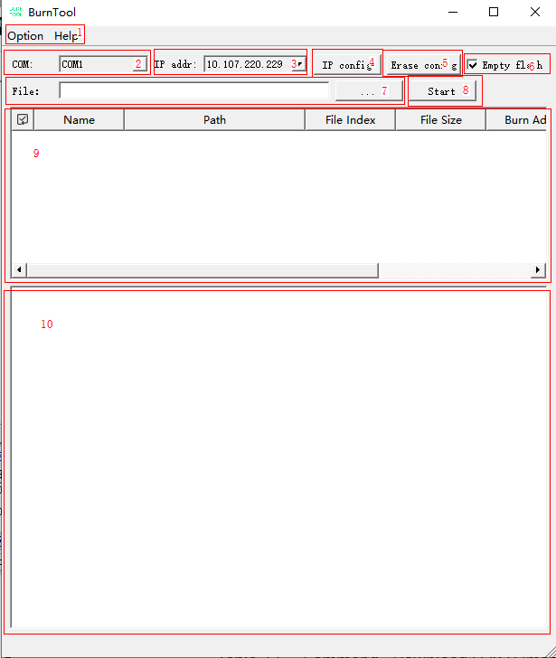

**表 1**  LUOFU、EMEI、XILING和TG0烧写界面说明

<a name="table1923619111210"></a>
<table><thead align="left"><tr id="row8232019141213"><th class="cellrowborder" valign="top" width="15.340000000000002%" id="mcps1.2.3.1.1"><p id="p12351913126"><a name="p12351913126"></a><a name="p12351913126"></a>区域</p>
</th>
<th class="cellrowborder" valign="top" width="84.66%" id="mcps1.2.3.1.2"><p id="p9232199124"><a name="p9232199124"></a><a name="p9232199124"></a>说明</p>
</th>
</tr>
</thead>
<tbody><tr id="row1623119111212"><td class="cellrowborder" valign="top" width="15.340000000000002%" headers="mcps1.2.3.1.1 "><p id="p1723219201211"><a name="p1723219201211"></a><a name="p1723219201211"></a>1</p>
</td>
<td class="cellrowborder" valign="top" width="84.66%" headers="mcps1.2.3.1.2 "><div class="p" id="p95233553245"><a name="p95233553245"></a><a name="p95233553245"></a>Option：<a name="ul1886910264194"></a><a name="ul1886910264194"></a><ul id="ul1886910264194"><li>Change Chip：修改产品。</li><li>Language：修改语言。</li></ul>
</div>
<div class="p" id="p1952875716248"><a name="p1952875716248"></a><a name="p1952875716248"></a>Help：<a name="ul449165114915"></a><a name="ul449165114915"></a><ul id="ul449165114915"><li>About：显示版本信息。</li></ul>
</div>
</td>
</tr>
<tr id="row3237195120"><td class="cellrowborder" valign="top" width="15.340000000000002%" headers="mcps1.2.3.1.1 "><p id="p2023219131213"><a name="p2023219131213"></a><a name="p2023219131213"></a>2</p>
</td>
<td class="cellrowborder" valign="top" width="84.66%" headers="mcps1.2.3.1.2 "><p id="p55143537243"><a name="p55143537243"></a><a name="p55143537243"></a>COM：串口号列表，显示当前可用串口号。</p>
</td>
</tr>
<tr id="row1723121921215"><td class="cellrowborder" valign="top" width="15.340000000000002%" headers="mcps1.2.3.1.1 "><p id="p7232019151215"><a name="p7232019151215"></a><a name="p7232019151215"></a>3</p>
</td>
<td class="cellrowborder" valign="top" width="84.66%" headers="mcps1.2.3.1.2 "><p id="p551525312246"><a name="p551525312246"></a><a name="p551525312246"></a>IP Adress：PC的IP地址。</p>
</td>
</tr>
<tr id="row20975142974318"><td class="cellrowborder" valign="top" width="15.340000000000002%" headers="mcps1.2.3.1.1 "><p id="p49753294437"><a name="p49753294437"></a><a name="p49753294437"></a>4</p>
</td>
<td class="cellrowborder" valign="top" width="84.66%" headers="mcps1.2.3.1.2 "><p id="p1751525342418"><a name="p1751525342418"></a><a name="p1751525342418"></a>IP Config：点击打开配置板端需要的IP配置信息，配置界面请参见“<a href="#ZH-CN_TOPIC_0000002042006080">板端IP配置界面</a>”章节。</p>
</td>
</tr>
<tr id="row1244919287444"><td class="cellrowborder" valign="top" width="15.340000000000002%" headers="mcps1.2.3.1.1 "><p id="p444917280440"><a name="p444917280440"></a><a name="p444917280440"></a>5</p>
</td>
<td class="cellrowborder" valign="top" width="84.66%" headers="mcps1.2.3.1.2 "><p id="p151518537242"><a name="p151518537242"></a><a name="p151518537242"></a>Erase config：点击打开擦除内容配置，配置界面请参见“<a href="#ZH-CN_TOPIC_0000002077967381">擦除配置信息界面</a>”章节。</p>
</td>
</tr>
<tr id="row18390124874411"><td class="cellrowborder" valign="top" width="15.340000000000002%" headers="mcps1.2.3.1.1 "><p id="p19390174824415"><a name="p19390174824415"></a><a name="p19390174824415"></a>6</p>
</td>
<td class="cellrowborder" valign="top" width="84.66%" headers="mcps1.2.3.1.2 "><p id="p751610530243"><a name="p751610530243"></a><a name="p751610530243"></a>Empty flash：用来设置是否为裸烧模式。</p>
</td>
</tr>
<tr id="row163871658164519"><td class="cellrowborder" valign="top" width="15.340000000000002%" headers="mcps1.2.3.1.1 "><p id="p19388165811459"><a name="p19388165811459"></a><a name="p19388165811459"></a>7</p>
</td>
<td class="cellrowborder" valign="top" width="84.66%" headers="mcps1.2.3.1.2 "><p id="p14516353102413"><a name="p14516353102413"></a><a name="p14516353102413"></a>File：选择升级文件。</p>
</td>
</tr>
<tr id="row05815493590"><td class="cellrowborder" valign="top" width="15.340000000000002%" headers="mcps1.2.3.1.1 "><p id="p3348810906"><a name="p3348810906"></a><a name="p3348810906"></a>8</p>
</td>
<td class="cellrowborder" valign="top" width="84.66%" headers="mcps1.2.3.1.2 "><p id="p1672011124261"><a name="p1672011124261"></a><a name="p1672011124261"></a>Start：开始升级。</p>
</td>
</tr>
<tr id="row723919141213"><td class="cellrowborder" valign="top" width="15.340000000000002%" headers="mcps1.2.3.1.1 "><p id="p1623141971211"><a name="p1623141971211"></a><a name="p1623141971211"></a>9</p>
</td>
<td class="cellrowborder" valign="top" width="84.66%" headers="mcps1.2.3.1.2 "><p id="p858114453113"><a name="p858114453113"></a><a name="p858114453113"></a>镜像表格：显示可被烧写的镜像信息。各列含义如下。</p>
<a name="ul9925203813115"></a><a name="ul9925203813115"></a><ul id="ul9925203813115"><li>Name：名称。</li><li>Path：路径。</li><li>File Index：镜像在文件中的起始索引。</li><li>File Size：镜像大小。</li><li>Burn Addr：烧写的Flash起始地址。</li><li>Burn Size：擦除的Flash大小。</li><li>Type：烧写文件类型。</li></ul>
</td>
</tr>
<tr id="row112481931213"><td class="cellrowborder" valign="top" width="15.340000000000002%" headers="mcps1.2.3.1.1 "><p id="p1324219121220"><a name="p1324219121220"></a><a name="p1324219121220"></a>10</p>
</td>
<td class="cellrowborder" valign="top" width="84.66%" headers="mcps1.2.3.1.2 "><p id="p55998270263"><a name="p55998270263"></a><a name="p55998270263"></a>日志视图：显示烧写过程中单板上报的日志及工具打印的日志。</p>
</td>
</tr>
</tbody>
</table>

#### TG1和TG2<a name="ZH-CN_TOPIC_0000002041836936"></a>

TG1和TG2界面如[图1](#fig785513197321)所示。

**图 1**  TG1和TG2烧写界面<a name="fig785513197321"></a>  
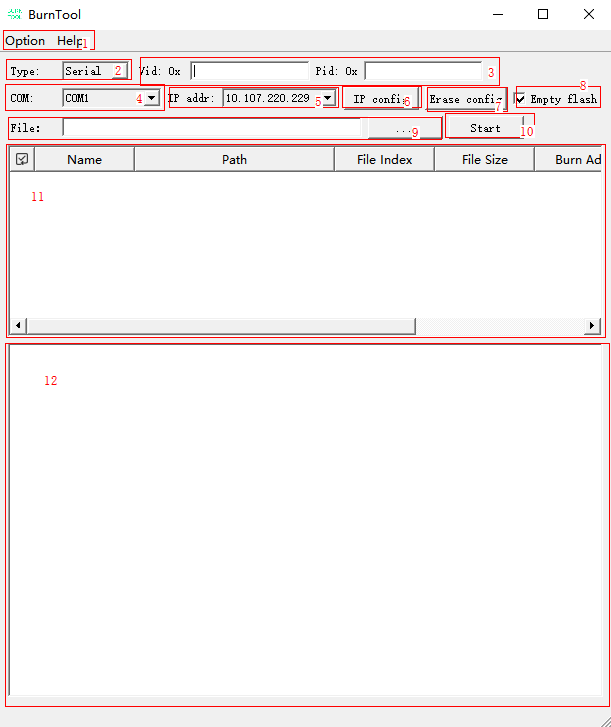

**表 1**  TG1和TG2烧写界面说明

<a name="table1923619111210"></a>
<table><thead align="left"><tr id="row8232019141213"><th class="cellrowborder" valign="top" width="16.02%" id="mcps1.2.3.1.1"><p id="p12351913126"><a name="p12351913126"></a><a name="p12351913126"></a>区域</p>
</th>
<th class="cellrowborder" valign="top" width="83.98%" id="mcps1.2.3.1.2"><p id="p9232199124"><a name="p9232199124"></a><a name="p9232199124"></a>说明</p>
</th>
</tr>
</thead>
<tbody><tr id="row1623119111212"><td class="cellrowborder" valign="top" width="16.02%" headers="mcps1.2.3.1.1 "><p id="p1723219201211"><a name="p1723219201211"></a><a name="p1723219201211"></a>1</p>
</td>
<td class="cellrowborder" valign="top" width="83.98%" headers="mcps1.2.3.1.2 "><div class="p" id="p353955515262"><a name="p353955515262"></a><a name="p353955515262"></a>Option：<a name="ul1886910264194"></a><a name="ul1886910264194"></a><ul id="ul1886910264194"><li>Change Chip：修改产品。</li><li>Language：修改语言。</li></ul>
</div>
<div class="p" id="p367510577261"><a name="p367510577261"></a><a name="p367510577261"></a>Help：<a name="ul449165114915"></a><a name="ul449165114915"></a><ul id="ul449165114915"><li>About：显示版本信息。</li></ul>
</div>
</td>
</tr>
<tr id="row11752195134920"><td class="cellrowborder" valign="top" width="16.02%" headers="mcps1.2.3.1.1 "><p id="p11571216104914"><a name="p11571216104914"></a><a name="p11571216104914"></a>2</p>
</td>
<td class="cellrowborder" valign="top" width="83.98%" headers="mcps1.2.3.1.2 "><div class="p" id="p142923117270"><a name="p142923117270"></a><a name="p142923117270"></a>Type：设置bootroom的烧写方式。<a name="ul2934141415019"></a><a name="ul2934141415019"></a><ul id="ul2934141415019"><li>Serial：通过串口烧写。</li><li>USB：通过USB烧写。</li></ul>
</div>
</td>
</tr>
<tr id="row13785921145114"><td class="cellrowborder" valign="top" width="16.02%" headers="mcps1.2.3.1.1 "><p id="p127851021165110"><a name="p127851021165110"></a><a name="p127851021165110"></a>3</p>
</td>
<td class="cellrowborder" valign="top" width="83.98%" headers="mcps1.2.3.1.2 "><p id="p169564820270"><a name="p169564820270"></a><a name="p169564820270"></a>Vid：设备的Vendor ID；</p>
<p id="p199564816274"><a name="p199564816274"></a><a name="p199564816274"></a>Pid：设备的Product ID。</p>
</td>
</tr>
<tr id="row3237195120"><td class="cellrowborder" valign="top" width="16.02%" headers="mcps1.2.3.1.1 "><p id="p2023219131213"><a name="p2023219131213"></a><a name="p2023219131213"></a>4</p>
</td>
<td class="cellrowborder" valign="top" width="83.98%" headers="mcps1.2.3.1.2 "><p id="p48022165279"><a name="p48022165279"></a><a name="p48022165279"></a>COM：串口号列表，显示当前可用串口号。</p>
</td>
</tr>
<tr id="row1723121921215"><td class="cellrowborder" valign="top" width="16.02%" headers="mcps1.2.3.1.1 "><p id="p7232019151215"><a name="p7232019151215"></a><a name="p7232019151215"></a>5</p>
</td>
<td class="cellrowborder" valign="top" width="83.98%" headers="mcps1.2.3.1.2 "><p id="p480381682720"><a name="p480381682720"></a><a name="p480381682720"></a>IP Adress：PC的IP地址。</p>
</td>
</tr>
<tr id="row20975142974318"><td class="cellrowborder" valign="top" width="16.02%" headers="mcps1.2.3.1.1 "><p id="p1667142116532"><a name="p1667142116532"></a><a name="p1667142116532"></a>6</p>
</td>
<td class="cellrowborder" valign="top" width="83.98%" headers="mcps1.2.3.1.2 "><p id="p1380310160275"><a name="p1380310160275"></a><a name="p1380310160275"></a>IP Config：点击打开配置板端需要的IP配置信息，配置界面请参见“<a href="#ZH-CN_TOPIC_0000002042006080">板端IP配置界面</a>”章节。</p>
</td>
</tr>
<tr id="row1244919287444"><td class="cellrowborder" valign="top" width="16.02%" headers="mcps1.2.3.1.1 "><p id="p444917280440"><a name="p444917280440"></a><a name="p444917280440"></a>7</p>
</td>
<td class="cellrowborder" valign="top" width="83.98%" headers="mcps1.2.3.1.2 "><p id="p208031616172718"><a name="p208031616172718"></a><a name="p208031616172718"></a>Erase config：点击打开擦除内容配置，配置界面请参见“<a href="#ZH-CN_TOPIC_0000002077967381">擦除配置信息界面</a>”章节。</p>
</td>
</tr>
<tr id="row18390124874411"><td class="cellrowborder" valign="top" width="16.02%" headers="mcps1.2.3.1.1 "><p id="p19390174824415"><a name="p19390174824415"></a><a name="p19390174824415"></a>8</p>
</td>
<td class="cellrowborder" valign="top" width="83.98%" headers="mcps1.2.3.1.2 "><p id="p580411620270"><a name="p580411620270"></a><a name="p580411620270"></a>Empty flash：用来设置是否为裸烧模式。</p>
</td>
</tr>
<tr id="row163871658164519"><td class="cellrowborder" valign="top" width="16.02%" headers="mcps1.2.3.1.1 "><p id="p19388165811459"><a name="p19388165811459"></a><a name="p19388165811459"></a>9</p>
</td>
<td class="cellrowborder" valign="top" width="83.98%" headers="mcps1.2.3.1.2 "><p id="p19804161614274"><a name="p19804161614274"></a><a name="p19804161614274"></a>File：选择升级文件。</p>
</td>
</tr>
<tr id="row05815493590"><td class="cellrowborder" valign="top" width="16.02%" headers="mcps1.2.3.1.1 "><p id="p3348810906"><a name="p3348810906"></a><a name="p3348810906"></a>10</p>
</td>
<td class="cellrowborder" valign="top" width="83.98%" headers="mcps1.2.3.1.2 "><p id="p10805171610278"><a name="p10805171610278"></a><a name="p10805171610278"></a>Start：开始升级。</p>
</td>
</tr>
<tr id="row723919141213"><td class="cellrowborder" valign="top" width="16.02%" headers="mcps1.2.3.1.1 "><p id="p1623141971211"><a name="p1623141971211"></a><a name="p1623141971211"></a>11</p>
</td>
<td class="cellrowborder" valign="top" width="83.98%" headers="mcps1.2.3.1.2 "><p id="p858114453113"><a name="p858114453113"></a><a name="p858114453113"></a>镜像表格：显示可被烧写的镜像信息。各列含义如下。</p>
<a name="ul9925203813115"></a><a name="ul9925203813115"></a><ul id="ul9925203813115"><li>Name：名称。</li><li>Path：路径。</li><li>File Index：镜像在文件中的起始索引。</li><li>File Size：镜像大小。</li><li>Burn Addr：烧写的Flash起始地址。</li><li>Burn Size：擦除的Flash大小。</li><li>Type：烧写文件类型。</li></ul>
</td>
</tr>
<tr id="row112481931213"><td class="cellrowborder" valign="top" width="16.02%" headers="mcps1.2.3.1.1 "><p id="p1324219121220"><a name="p1324219121220"></a><a name="p1324219121220"></a>12</p>
</td>
<td class="cellrowborder" valign="top" width="83.98%" headers="mcps1.2.3.1.2 "><a name="ul113511026488"></a><a name="ul113511026488"></a><ul id="ul113511026488"><li>日志视图：显示烧写过程中单板上报的日志及工具打印的日志。</li></ul>
</td>
</tr>
</tbody>
</table>

#### 板端IP配置界面<a name="ZH-CN_TOPIC_0000002042006080"></a>

板侧IP配置界面如[图1](#fig15904118135410)所示。

**图 1**  板侧IP配置界面<a name="fig15904118135410"></a>  
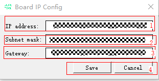

**表 1**  板侧IP配置界面说明

<a name="table1923619111210"></a>
<table><thead align="left"><tr id="row8232019141213"><th class="cellrowborder" valign="top" width="19.63%" id="mcps1.2.3.1.1"><p id="p12351913126"><a name="p12351913126"></a><a name="p12351913126"></a>区域</p>
</th>
<th class="cellrowborder" valign="top" width="80.36999999999999%" id="mcps1.2.3.1.2"><p id="p9232199124"><a name="p9232199124"></a><a name="p9232199124"></a>说明</p>
</th>
</tr>
</thead>
<tbody><tr id="row1623119111212"><td class="cellrowborder" valign="top" width="19.63%" headers="mcps1.2.3.1.1 "><p id="p1723219201211"><a name="p1723219201211"></a><a name="p1723219201211"></a>1</p>
</td>
<td class="cellrowborder" valign="top" width="80.36999999999999%" headers="mcps1.2.3.1.2 "><p id="p204671920293"><a name="p204671920293"></a><a name="p204671920293"></a>IP address：IP地址。</p>
</td>
</tr>
<tr id="row11752195134920"><td class="cellrowborder" valign="top" width="19.63%" headers="mcps1.2.3.1.1 "><p id="p11571216104914"><a name="p11571216104914"></a><a name="p11571216104914"></a>2</p>
</td>
<td class="cellrowborder" valign="top" width="80.36999999999999%" headers="mcps1.2.3.1.2 "><p id="p174671212919"><a name="p174671212919"></a><a name="p174671212919"></a>Subnet mask：子网掩码。</p>
</td>
</tr>
<tr id="row13785921145114"><td class="cellrowborder" valign="top" width="19.63%" headers="mcps1.2.3.1.1 "><p id="p127851021165110"><a name="p127851021165110"></a><a name="p127851021165110"></a>3</p>
</td>
<td class="cellrowborder" valign="top" width="80.36999999999999%" headers="mcps1.2.3.1.2 "><p id="p154673252920"><a name="p154673252920"></a><a name="p154673252920"></a>Gateway：网关。</p>
</td>
</tr>
<tr id="row3237195120"><td class="cellrowborder" valign="top" width="19.63%" headers="mcps1.2.3.1.1 "><p id="p2023219131213"><a name="p2023219131213"></a><a name="p2023219131213"></a>4</p>
</td>
<td class="cellrowborder" valign="top" width="80.36999999999999%" headers="mcps1.2.3.1.2 "><p id="p166241442910"><a name="p166241442910"></a><a name="p166241442910"></a>Save：保存配置；</p>
<p id="p10624641294"><a name="p10624641294"></a><a name="p10624641294"></a>Cancel：取消设置的配置。</p>
</td>
</tr>
</tbody>
</table>

#### 擦除配置信息界面<a name="ZH-CN_TOPIC_0000002077967381"></a>

擦除配置信息界面如[图1](#fig9899959015)所示。

**图 1**  擦除配置信息界面<a name="fig9899959015"></a>  
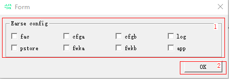

**表 1**  板侧IP配置界面说明

<a name="table1923619111210"></a>
<table><thead align="left"><tr id="row8232019141213"><th class="cellrowborder" valign="top" width="20.51%" id="mcps1.2.3.1.1"><p id="p12351913126"><a name="p12351913126"></a><a name="p12351913126"></a>区域</p>
</th>
<th class="cellrowborder" valign="top" width="79.49000000000001%" id="mcps1.2.3.1.2"><p id="p9232199124"><a name="p9232199124"></a><a name="p9232199124"></a>说明</p>
</th>
</tr>
</thead>
<tbody><tr id="row1623119111212"><td class="cellrowborder" valign="top" width="20.51%" headers="mcps1.2.3.1.1 "><p id="p1723219201211"><a name="p1723219201211"></a><a name="p1723219201211"></a>1</p>
</td>
<td class="cellrowborder" valign="top" width="79.49000000000001%" headers="mcps1.2.3.1.2 "><p id="p1841112358290"><a name="p1841112358290"></a><a name="p1841112358290"></a>Erase config：擦除配置项，设置擦除区间。</p>
</td>
</tr>
<tr id="row11752195134920"><td class="cellrowborder" valign="top" width="20.51%" headers="mcps1.2.3.1.1 "><p id="p11571216104914"><a name="p11571216104914"></a><a name="p11571216104914"></a>2</p>
</td>
<td class="cellrowborder" valign="top" width="79.49000000000001%" headers="mcps1.2.3.1.2 "><p id="p0413173515299"><a name="p0413173515299"></a><a name="p0413173515299"></a>OK：确认设置。</p>
</td>
</tr>
</tbody>
</table>

### BurnTool-MCU<a name="ZH-CN_TOPIC_0000002041995260"></a>

-   **[MCU烧写界面](#ZH-CN_TOPIC_0000002078345109)**  

-   **[参数配置](#ZH-CN_TOPIC_0000002042264342)**  

-   **[保护区配置](#ZH-CN_TOPIC_0000002555525633)**  

#### MCU烧写界面<a name="ZH-CN_TOPIC_0000002078345109"></a>

MCU烧写界面如[图1](#fig192225181012)所示。

**图 1**  烧写界面<a name="fig192225181012"></a>  
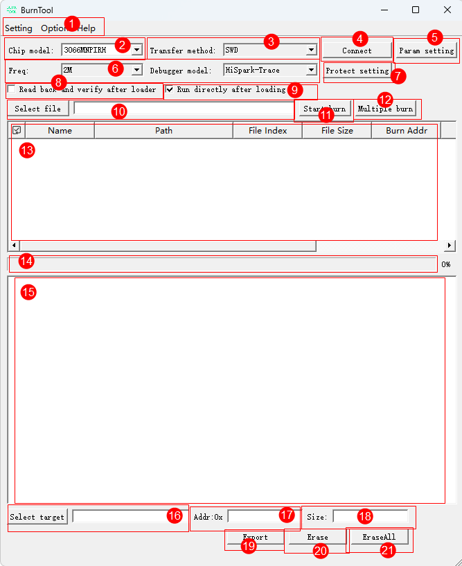

**表 1**  MCU烧写界面说明

<a name="table1923619111210"></a>
<table><thead align="left"><tr id="row8232019141213"><th class="cellrowborder" valign="top" width="19.88%" id="mcps1.2.3.1.1"><p id="p12351913126"><a name="p12351913126"></a><a name="p12351913126"></a>区域</p>
</th>
<th class="cellrowborder" valign="top" width="80.12%" id="mcps1.2.3.1.2"><p id="p9232199124"><a name="p9232199124"></a><a name="p9232199124"></a>说明</p>
</th>
</tr>
</thead>
<tbody><tr id="row1623119111212"><td class="cellrowborder" valign="top" width="19.88%" headers="mcps1.2.3.1.1 "><p id="p1723219201211"><a name="p1723219201211"></a><a name="p1723219201211"></a>1</p>
</td>
<td class="cellrowborder" valign="top" width="80.12%" headers="mcps1.2.3.1.2 "><div class="p" id="p28484161104"><a name="p28484161104"></a><a name="p28484161104"></a>Setting：<a name="ul410516561901"></a><a name="ul410516561901"></a><ul id="ul410516561901"><li>Language：修改语言。</li></ul>
</div>
<div class="p" id="p38138280302"><a name="p38138280302"></a><a name="p38138280302"></a>Option：<a name="ul1886910264194"></a><a name="ul1886910264194"></a><ul id="ul1886910264194"><li>Change Chip：修改产品。</li></ul>
</div>
<div class="p" id="p462815308301"><a name="p462815308301"></a><a name="p462815308301"></a>Help：<a name="ul449165114915"></a><a name="ul449165114915"></a><ul id="ul449165114915"><li>About：显示版本信息。</li></ul>
</div>
</td>
</tr>
<tr id="row11752195134920"><td class="cellrowborder" valign="top" width="19.88%" headers="mcps1.2.3.1.1 "><p id="p11571216104914"><a name="p11571216104914"></a><a name="p11571216104914"></a>2</p>
</td>
<td class="cellrowborder" valign="top" width="80.12%" headers="mcps1.2.3.1.2 "><p id="p7221534173012"><a name="p7221534173012"></a><a name="p7221534173012"></a>Chip model：选择需要烧写的芯片。</p>
</td>
</tr>
<tr id="row13785921145114"><td class="cellrowborder" valign="top" width="19.88%" headers="mcps1.2.3.1.1 "><p id="p127851021165110"><a name="p127851021165110"></a><a name="p127851021165110"></a>3</p>
</td>
<td class="cellrowborder" valign="top" width="80.12%" headers="mcps1.2.3.1.2 "><p id="p422253414303"><a name="p422253414303"></a><a name="p422253414303"></a>Transfer method：烧写方式。</p>
</td>
</tr>
<tr id="row3237195120"><td class="cellrowborder" valign="top" width="19.88%" headers="mcps1.2.3.1.1 "><p id="p2023219131213"><a name="p2023219131213"></a><a name="p2023219131213"></a>4</p>
</td>
<td class="cellrowborder" valign="top" width="80.12%" headers="mcps1.2.3.1.2 "><p id="p1622263413011"><a name="p1622263413011"></a><a name="p1622263413011"></a>Connect：连接设备。</p>
</td>
</tr>
<tr id="row1723121921215"><td class="cellrowborder" valign="top" width="19.88%" headers="mcps1.2.3.1.1 "><p id="p7232019151215"><a name="p7232019151215"></a><a name="p7232019151215"></a>5</p>
</td>
<td class="cellrowborder" valign="top" width="80.12%" headers="mcps1.2.3.1.2 "><p id="p11222123473013"><a name="p11222123473013"></a><a name="p11222123473013"></a>Param setting：NV参数配置，配置界面请参见“<a href="#ZH-CN_TOPIC_0000002042264342">参数配置</a>”章节。</p>
</td>
</tr>
<tr id="row20975142974318"><td class="cellrowborder" valign="top" width="19.88%" headers="mcps1.2.3.1.1 "><p id="p1667142116532"><a name="p1667142116532"></a><a name="p1667142116532"></a>6</p>
</td>
<td class="cellrowborder" valign="top" width="80.12%" headers="mcps1.2.3.1.2 "><p id="p162225341307"><a name="p162225341307"></a><a name="p162225341307"></a>参数区：根据所选的Transfer method确定设置的参数。</p>
<p id="p92051461010"><a name="p92051461010"></a><a name="p92051461010"></a>当选择SWD和JTAG时参数为频率和调试设备，当选择CAN、UART（USB）、UART时参数为波特率，当选择I2C和SPI时参数为速率。</p>
</td>
</tr>
<tr id="row2888123710404"><td class="cellrowborder" valign="top" width="19.88%" headers="mcps1.2.3.1.1 "><p id="p188892037104013"><a name="p188892037104013"></a><a name="p188892037104013"></a><span id="ph12311143994016"><a name="ph12311143994016"></a><a name="ph12311143994016"></a>7</span></p>
</td>
<td class="cellrowborder" valign="top" width="80.12%" headers="mcps1.2.3.1.2 "><p id="p18891337194018"><a name="p18891337194018"></a><a name="p18891337194018"></a><span id="ph2022684564013"><a name="ph2022684564013"></a><a name="ph2022684564013"></a>保护区配置</span><span id="ph46921923135617"><a name="ph46921923135617"></a><a name="ph46921923135617"></a>，当前只有3066m芯片支持该配置</span></p>
</td>
</tr>
<tr id="row1244919287444"><td class="cellrowborder" valign="top" width="19.88%" headers="mcps1.2.3.1.1 "><p id="p444917280440"><a name="p444917280440"></a><a name="p444917280440"></a><span id="ph4729342164112"><a name="ph4729342164112"></a><a name="ph4729342164112"></a>8</span></p>
</td>
<td class="cellrowborder" valign="top" width="80.12%" headers="mcps1.2.3.1.2 "><p id="p1223183413020"><a name="p1223183413020"></a><a name="p1223183413020"></a>Read back and verify after loader：加载后回读校验。</p>
</td>
</tr>
<tr id="row18390124874411"><td class="cellrowborder" valign="top" width="19.88%" headers="mcps1.2.3.1.1 "><p id="p19390174824415"><a name="p19390174824415"></a><a name="p19390174824415"></a><span id="ph335110443419"><a name="ph335110443419"></a><a name="ph335110443419"></a>9</span></p>
</td>
<td class="cellrowborder" valign="top" width="80.12%" headers="mcps1.2.3.1.2 "><p id="p8223203423017"><a name="p8223203423017"></a><a name="p8223203423017"></a>Run directly after loading：加载后直接运行。</p>
</td>
</tr>
<tr id="row163871658164519"><td class="cellrowborder" valign="top" width="19.88%" headers="mcps1.2.3.1.1 "><p id="p19388165811459"><a name="p19388165811459"></a><a name="p19388165811459"></a><span id="ph11372164644116"><a name="ph11372164644116"></a><a name="ph11372164644116"></a>10</span></p>
</td>
<td class="cellrowborder" valign="top" width="80.12%" headers="mcps1.2.3.1.2 "><p id="p17223183473015"><a name="p17223183473015"></a><a name="p17223183473015"></a>Select file：选择文件。</p>
</td>
</tr>
<tr id="row05815493590"><td class="cellrowborder" valign="top" width="19.88%" headers="mcps1.2.3.1.1 "><p id="p3348810906"><a name="p3348810906"></a><a name="p3348810906"></a>1<span id="ph72776485412"><a name="ph72776485412"></a><a name="ph72776485412"></a>1</span></p>
</td>
<td class="cellrowborder" valign="top" width="80.12%" headers="mcps1.2.3.1.2 "><p id="p12224203463013"><a name="p12224203463013"></a><a name="p12224203463013"></a>Start burn：开始升级。</p>
</td>
</tr>
<tr id="row149914306469"><td class="cellrowborder" valign="top" width="19.88%" headers="mcps1.2.3.1.1 "><p id="p799203013462"><a name="p799203013462"></a><a name="p799203013462"></a><span id="ph962813117465"><a name="ph962813117465"></a><a name="ph962813117465"></a>12</span></p>
</td>
<td class="cellrowborder" valign="top" width="80.12%" headers="mcps1.2.3.1.2 "><p id="p10100153014462"><a name="p10100153014462"></a><a name="p10100153014462"></a><span id="ph13515324511"><a name="ph13515324511"></a><a name="ph13515324511"></a>Mutip</span><span id="ph1953412407511"><a name="ph1953412407511"></a><a name="ph1953412407511"></a>le</span> <span id="ph1285375465115"><a name="ph1285375465115"></a><a name="ph1285375465115"></a>burn：工厂烧写。</span></p>
</td>
</tr>
<tr id="row723919141213"><td class="cellrowborder" valign="top" width="19.88%" headers="mcps1.2.3.1.1 "><p id="p1623141971211"><a name="p1623141971211"></a><a name="p1623141971211"></a>1<span id="ph114537538412"><a name="ph114537538412"></a><a name="ph114537538412"></a>3</span></p>
</td>
<td class="cellrowborder" valign="top" width="80.12%" headers="mcps1.2.3.1.2 "><p id="p858114453113"><a name="p858114453113"></a><a name="p858114453113"></a>镜像表格：显示可被烧写的镜像信息。各列含义如下。</p>
<a name="ul9925203813115"></a><a name="ul9925203813115"></a><ul id="ul9925203813115"><li>Name：名称。</li><li>Path：路径。</li><li>File Index：镜像在文件中的起始索引。</li><li>File Size：镜像大小。</li><li>Burn Addr：烧写的Flash起始地址。</li><li>Burn Size：擦除的Flash大小。</li><li>Type：烧写文件类型。</li></ul>
</td>
</tr>
<tr id="row1544850152"><td class="cellrowborder" valign="top" width="19.88%" headers="mcps1.2.3.1.1 "><p id="p12554353513"><a name="p12554353513"></a><a name="p12554353513"></a>1<span id="ph1591055534113"><a name="ph1591055534113"></a><a name="ph1591055534113"></a>4</span></p>
</td>
<td class="cellrowborder" valign="top" width="80.12%" headers="mcps1.2.3.1.2 "><p id="p6913153317313"><a name="p6913153317313"></a><a name="p6913153317313"></a>烧写进度。</p>
</td>
</tr>
<tr id="row112481931213"><td class="cellrowborder" valign="top" width="19.88%" headers="mcps1.2.3.1.1 "><p id="p1324219121220"><a name="p1324219121220"></a><a name="p1324219121220"></a>1<span id="ph4915157194111"><a name="ph4915157194111"></a><a name="ph4915157194111"></a>5</span></p>
</td>
<td class="cellrowborder" valign="top" width="80.12%" headers="mcps1.2.3.1.2 "><p id="p142391540163117"><a name="p142391540163117"></a><a name="p142391540163117"></a>日志视图：显示烧写过程中单板上报的日志及工具打印的日志。</p>
</td>
</tr>
<tr id="row17413571675"><td class="cellrowborder" valign="top" width="19.88%" headers="mcps1.2.3.1.1 "><p id="p15410182017810"><a name="p15410182017810"></a><a name="p15410182017810"></a>1<span id="ph89260596415"><a name="ph89260596415"></a><a name="ph89260596415"></a>6</span></p>
</td>
<td class="cellrowborder" valign="top" width="80.12%" headers="mcps1.2.3.1.2 "><p id="p14119124215313"><a name="p14119124215313"></a><a name="p14119124215313"></a>Select target：选择导出的文件。</p>
</td>
</tr>
<tr id="row2715921281"><td class="cellrowborder" valign="top" width="19.88%" headers="mcps1.2.3.1.1 "><p id="p18716021885"><a name="p18716021885"></a><a name="p18716021885"></a>1<span id="ph1890671144218"><a name="ph1890671144218"></a><a name="ph1890671144218"></a>7</span></p>
</td>
<td class="cellrowborder" valign="top" width="80.12%" headers="mcps1.2.3.1.2 "><p id="p1865774419316"><a name="p1865774419316"></a><a name="p1865774419316"></a>Addr：导出的地址或擦除地址。<span id="ph1456913494717"><a name="ph1456913494717"></a><a name="ph1456913494717"></a>输入内容为16进制</span><span id="ph554214994712"><a name="ph554214994712"></a><a name="ph554214994712"></a>。</span></p>
</td>
</tr>
<tr id="row9699282810"><td class="cellrowborder" valign="top" width="19.88%" headers="mcps1.2.3.1.1 "><p id="p146991486812"><a name="p146991486812"></a><a name="p146991486812"></a>1<span id="ph189503310426"><a name="ph189503310426"></a><a name="ph189503310426"></a>8</span></p>
</td>
<td class="cellrowborder" valign="top" width="80.12%" headers="mcps1.2.3.1.2 "><p id="p165834419313"><a name="p165834419313"></a><a name="p165834419313"></a>Size：导出长度或擦除长度。</p>
</td>
</tr>
<tr id="row15677016171411"><td class="cellrowborder" valign="top" width="19.88%" headers="mcps1.2.3.1.1 "><p id="p1677316201415"><a name="p1677316201415"></a><a name="p1677316201415"></a>1<span id="ph1094516514213"><a name="ph1094516514213"></a><a name="ph1094516514213"></a>9</span></p>
</td>
<td class="cellrowborder" valign="top" width="80.12%" headers="mcps1.2.3.1.2 "><p id="p765884473112"><a name="p765884473112"></a><a name="p765884473112"></a>Export：导出文件。</p>
</td>
</tr>
<tr id="row119242011161413"><td class="cellrowborder" valign="top" width="19.88%" headers="mcps1.2.3.1.1 "><p id="p1992415118149"><a name="p1992415118149"></a><a name="p1992415118149"></a><span id="ph153351010184216"><a name="ph153351010184216"></a><a name="ph153351010184216"></a>20</span></p>
</td>
<td class="cellrowborder" valign="top" width="80.12%" headers="mcps1.2.3.1.2 "><p id="p86581444113113"><a name="p86581444113113"></a><a name="p86581444113113"></a>Erase：擦除文件。</p>
</td>
</tr>
<tr id="row1860997121414"><td class="cellrowborder" valign="top" width="19.88%" headers="mcps1.2.3.1.1 "><p id="p760916781412"><a name="p760916781412"></a><a name="p760916781412"></a><span id="ph175741512144215"><a name="ph175741512144215"></a><a name="ph175741512144215"></a>21</span></p>
</td>
<td class="cellrowborder" valign="top" width="80.12%" headers="mcps1.2.3.1.2 "><p id="p865814417317"><a name="p865814417317"></a><a name="p865814417317"></a>Erase All：全擦。</p>
</td>
</tr>
</tbody>
</table>

#### 参数配置<a name="ZH-CN_TOPIC_0000002042264342"></a>

NV参数配置如[图1](#fig028333616222)所示。

**图 1**  NV参数配置<a name="fig028333616222"></a>  
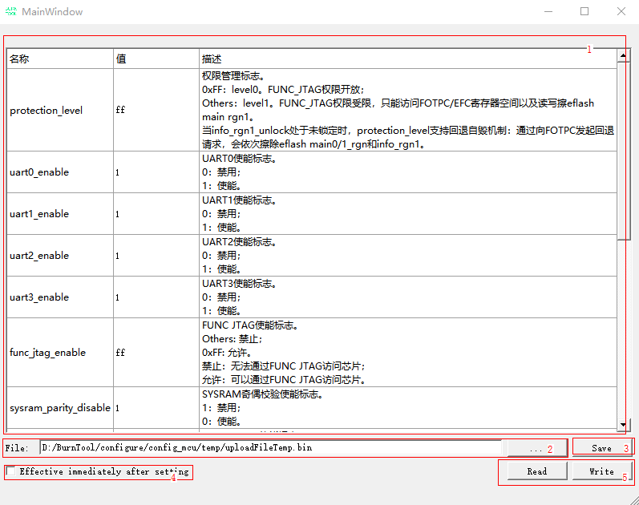

**表 1**  NV参数配置界面说明

<a name="table1923619111210"></a>
<table><thead align="left"><tr id="row8232019141213"><th class="cellrowborder" valign="top" width="17.560000000000002%" id="mcps1.2.3.1.1"><p id="p12351913126"><a name="p12351913126"></a><a name="p12351913126"></a>区域</p>
</th>
<th class="cellrowborder" valign="top" width="82.44%" id="mcps1.2.3.1.2"><p id="p9232199124"><a name="p9232199124"></a><a name="p9232199124"></a>说明</p>
</th>
</tr>
</thead>
<tbody><tr id="row1623119111212"><td class="cellrowborder" valign="top" width="17.560000000000002%" headers="mcps1.2.3.1.1 "><p id="p1723219201211"><a name="p1723219201211"></a><a name="p1723219201211"></a>1</p>
</td>
<td class="cellrowborder" valign="top" width="82.44%" headers="mcps1.2.3.1.2 "><p id="p610017551328"><a name="p610017551328"></a><a name="p610017551328"></a>参数列表。</p>
</td>
</tr>
<tr id="row3237195120"><td class="cellrowborder" valign="top" width="17.560000000000002%" headers="mcps1.2.3.1.1 "><p id="p2023219131213"><a name="p2023219131213"></a><a name="p2023219131213"></a>2</p>
</td>
<td class="cellrowborder" valign="top" width="82.44%" headers="mcps1.2.3.1.2 "><p id="p17101055103213"><a name="p17101055103213"></a><a name="p17101055103213"></a>File：选择保存到的文件。</p>
</td>
</tr>
<tr id="row1723121921215"><td class="cellrowborder" valign="top" width="17.560000000000002%" headers="mcps1.2.3.1.1 "><p id="p7232019151215"><a name="p7232019151215"></a><a name="p7232019151215"></a>3</p>
</td>
<td class="cellrowborder" valign="top" width="82.44%" headers="mcps1.2.3.1.2 "><p id="p101011755103214"><a name="p101011755103214"></a><a name="p101011755103214"></a>Save：保存到所选文件中。</p>
</td>
</tr>
<tr id="row723919141213"><td class="cellrowborder" valign="top" width="17.560000000000002%" headers="mcps1.2.3.1.1 "><p id="p1623141971211"><a name="p1623141971211"></a><a name="p1623141971211"></a>4</p>
</td>
<td class="cellrowborder" valign="top" width="82.44%" headers="mcps1.2.3.1.2 "><p id="p210165563219"><a name="p210165563219"></a><a name="p210165563219"></a>Effective immediately after setting：设置后立即生效。</p>
</td>
</tr>
<tr id="row19231319171216"><td class="cellrowborder" valign="top" width="17.560000000000002%" headers="mcps1.2.3.1.1 "><p id="p17231219121216"><a name="p17231219121216"></a><a name="p17231219121216"></a>5</p>
</td>
<td class="cellrowborder" valign="top" width="82.44%" headers="mcps1.2.3.1.2 "><p id="p310215558325"><a name="p310215558325"></a><a name="p310215558325"></a>Read：读取参数；</p>
<p id="p16102455153219"><a name="p16102455153219"></a><a name="p16102455153219"></a>write：写入参数。</p>
</td>
</tr>
</tbody>
</table>

#### 保护区配置<a name="ZH-CN_TOPIC_0000002555525633"></a>

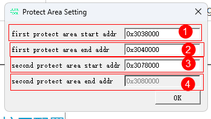

<a name="table1923619111210"></a>
<table><thead align="left"><tr id="row8232019141213"><th class="cellrowborder" valign="top" width="17.560000000000002%" id="mcps1.1.3.1.1"><p id="p12351913126"><a name="p12351913126"></a><a name="p12351913126"></a>区域</p>
</th>
<th class="cellrowborder" valign="top" width="82.44%" id="mcps1.1.3.1.2"><p id="p9232199124"><a name="p9232199124"></a><a name="p9232199124"></a>说明</p>
</th>
</tr>
</thead>
<tbody><tr id="row1623119111212"><td class="cellrowborder" valign="top" width="17.560000000000002%" headers="mcps1.1.3.1.1 "><p id="p1723219201211"><a name="p1723219201211"></a><a name="p1723219201211"></a>1</p>
</td>
<td class="cellrowborder" valign="top" width="82.44%" headers="mcps1.1.3.1.2 "><p id="p610017551328"><a name="p610017551328"></a><a name="p610017551328"></a>第1段保护区开始地址，烧写时，会跳过第一段保护区地址。</p>
</td>
</tr>
<tr id="row3237195120"><td class="cellrowborder" valign="top" width="17.560000000000002%" headers="mcps1.1.3.1.1 "><p id="p2023219131213"><a name="p2023219131213"></a><a name="p2023219131213"></a>2</p>
</td>
<td class="cellrowborder" valign="top" width="82.44%" headers="mcps1.1.3.1.2 "><p id="p17101055103213"><a name="p17101055103213"></a><a name="p17101055103213"></a>第1段保护区结束地址</p>
</td>
</tr>
<tr id="row1723121921215"><td class="cellrowborder" valign="top" width="17.560000000000002%" headers="mcps1.1.3.1.1 "><p id="p7232019151215"><a name="p7232019151215"></a><a name="p7232019151215"></a>3</p>
</td>
<td class="cellrowborder" valign="top" width="82.44%" headers="mcps1.1.3.1.2 "><p id="p1329628155010"><a name="p1329628155010"></a><a name="p1329628155010"></a>第2段保护区开始地址，烧写时，使用的地址会检验不大于这个地址。</p>
</td>
</tr>
<tr id="row723919141213"><td class="cellrowborder" valign="top" width="17.560000000000002%" headers="mcps1.1.3.1.1 "><p id="p1623141971211"><a name="p1623141971211"></a><a name="p1623141971211"></a>4</p>
</td>
<td class="cellrowborder" valign="top" width="82.44%" headers="mcps1.1.3.1.2 "><p id="p210165563219"><a name="p210165563219"></a><a name="p210165563219"></a>第2段保护区结束地址</p>
</td>
</tr>
</tbody>
</table>

### BurnTool-USB<a name="ZH-CN_TOPIC_0000002310895974"></a>

USB升级界面如[图1](#fig67031058134814_usb)所示。

**图 1**  USB升级界面<a name="fig67031058134814_usb"></a>  
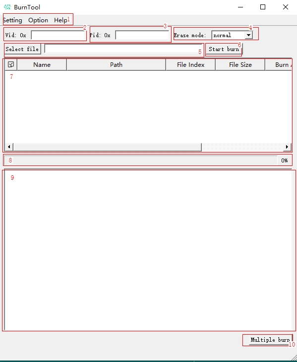

**表 1**  Dfu烧写界面说明

<a name="table1923619111210"></a>
<table><thead align="left"><tr id="row8232019141213"><th class="cellrowborder" valign="top" width="13.65%" id="mcps1.2.3.1.1"><p id="p12351913126"><a name="p12351913126"></a><a name="p12351913126"></a>区域</p>
</th>
<th class="cellrowborder" valign="top" width="86.35000000000001%" id="mcps1.2.3.1.2"><p id="p9232199124"><a name="p9232199124"></a><a name="p9232199124"></a>说明</p>
</th>
</tr>
</thead>
<tbody><tr id="row1623119111212"><td class="cellrowborder" valign="top" width="13.65%" headers="mcps1.2.3.1.1 "><p id="p1723219201211"><a name="p1723219201211"></a><a name="p1723219201211"></a>1</p>
</td>
<td class="cellrowborder" valign="top" width="86.35000000000001%" headers="mcps1.2.3.1.2 "><a name="ul179231849192920"></a><a name="ul179231849192920"></a><ul id="ul179231849192920"><li>Setting：包括以下菜单：<a name="ul1612815653017"></a><a name="ul1612815653017"></a><ul id="ul1612815653017"><li>USB Setting：设置USB配置信息。</li><li>Language：修改语言。</li></ul>
</li></ul>
<a name="ul15231719181215"></a><a name="ul15231719181215"></a><ul id="ul15231719181215"><li>Option：包括以下菜单：<p id="p448684352113"><a name="p448684352113"></a><a name="p448684352113"></a>Change Chip：修改产品。</p>
</li><li>Help：包括以下菜单：<p id="p10342244192110"><a name="p10342244192110"></a><a name="p10342244192110"></a>About：显示版本信息。</p>
</li></ul>
</td>
</tr>
<tr id="row8226123835212"><td class="cellrowborder" valign="top" width="13.65%" headers="mcps1.2.3.1.1 "><p id="p19226143818521"><a name="p19226143818521"></a><a name="p19226143818521"></a>2</p>
</td>
<td class="cellrowborder" valign="top" width="86.35000000000001%" headers="mcps1.2.3.1.2 "><p id="p12795162162110"><a name="p12795162162110"></a><a name="p12795162162110"></a>Vid：设备的Vendor ID。</p>
</td>
</tr>
<tr id="row3237195120"><td class="cellrowborder" valign="top" width="13.65%" headers="mcps1.2.3.1.1 "><p id="p2023219131213"><a name="p2023219131213"></a><a name="p2023219131213"></a>3</p>
</td>
<td class="cellrowborder" valign="top" width="86.35000000000001%" headers="mcps1.2.3.1.2 "><p id="p1572614222213"><a name="p1572614222213"></a><a name="p1572614222213"></a>Pid：设备的Product ID。</p>
</td>
</tr>
<tr id="row723919141213"><td class="cellrowborder" valign="top" width="13.65%" headers="mcps1.2.3.1.1 "><p id="p1623141971211"><a name="p1623141971211"></a><a name="p1623141971211"></a>4</p>
</td>
<td class="cellrowborder" valign="top" width="86.35000000000001%" headers="mcps1.2.3.1.2 "><div class="p" id="p1044102319211"><a name="p1044102319211"></a><a name="p1044102319211"></a>Erase Mode：选择擦除模式。<a name="ul2711213143516"></a><a name="ul2711213143516"></a><ul id="ul2711213143516"><li>normal：按照固件包中的参数进行擦除操作。</li><li>erase all：第一个烧写项进行全片擦除，剩余烧写项不再进行擦除操作。</li><li>no erase：不进行擦除操作。注意：该方式需要保证flash为空片或已进行全片擦除。</li></ul>
</div>
</td>
</tr>
<tr id="row19231319171216"><td class="cellrowborder" valign="top" width="13.65%" headers="mcps1.2.3.1.1 "><p id="p17231219121216"><a name="p17231219121216"></a><a name="p17231219121216"></a>5</p>
</td>
<td class="cellrowborder" valign="top" width="86.35000000000001%" headers="mcps1.2.3.1.2 "><p id="p101153260212"><a name="p101153260212"></a><a name="p101153260212"></a>Select file：选择格式为fwpkg的烧写镜像，并显示烧写镜像路径。</p>
</td>
</tr>
<tr id="row112481931213"><td class="cellrowborder" valign="top" width="13.65%" headers="mcps1.2.3.1.1 "><p id="p1324219121220"><a name="p1324219121220"></a><a name="p1324219121220"></a>6</p>
</td>
<td class="cellrowborder" valign="top" width="86.35000000000001%" headers="mcps1.2.3.1.2 "><p id="p1555442652114"><a name="p1555442652114"></a><a name="p1555442652114"></a>Start burn：按照表格选中信息依次烧写镜像。</p>
</td>
</tr>
<tr id="row824119151216"><td class="cellrowborder" valign="top" width="13.65%" headers="mcps1.2.3.1.1 "><p id="p1024719131211"><a name="p1024719131211"></a><a name="p1024719131211"></a>7</p>
</td>
<td class="cellrowborder" valign="top" width="86.35000000000001%" headers="mcps1.2.3.1.2 "><p id="p208311208366"><a name="p208311208366"></a><a name="p208311208366"></a>镜像表格：显示可被烧写的镜像信息。各列含义为：</p>
<a name="ul18831520113615"></a><a name="ul18831520113615"></a><ul id="ul18831520113615"><li>Name：名称。</li><li>Path：路径。</li><li>File Index：镜像在文件中的起始索引。</li><li>File Size：镜像大小。</li><li>Burn Addr：烧写的Flash起始地址。</li><li>Burn Size：擦除的Flash大小。</li><li>Type：通用类型，包括：<a name="ul148313204368"></a><a name="ul148313204368"></a><ul id="ul148313204368"><li>0：Loader。</li><li>1：一般镜像文件。</li><li>2：参数文件。</li><li>3：eFuse文件。</li></ul>
<a name="ul583420163619"></a><a name="ul583420163619"></a><ul id="ul583420163619"><li>32：fota文件。</li></ul>
</li></ul>
</td>
</tr>
<tr id="row2024101919122"><td class="cellrowborder" valign="top" width="13.65%" headers="mcps1.2.3.1.1 "><p id="p82411911120"><a name="p82411911120"></a><a name="p82411911120"></a>8</p>
</td>
<td class="cellrowborder" valign="top" width="86.35000000000001%" headers="mcps1.2.3.1.2 "><p id="p2044192962115"><a name="p2044192962115"></a><a name="p2044192962115"></a>烧写进度。</p>
</td>
</tr>
<tr id="row2842044193219"><td class="cellrowborder" valign="top" width="13.65%" headers="mcps1.2.3.1.1 "><p id="p14842124413213"><a name="p14842124413213"></a><a name="p14842124413213"></a>9</p>
</td>
<td class="cellrowborder" valign="top" width="86.35000000000001%" headers="mcps1.2.3.1.2 "><p id="p18536162992112"><a name="p18536162992112"></a><a name="p18536162992112"></a>日志视图：显示烧写过程中单板上报的日志及工具打印的日志。</p>
</td>
</tr>
<tr id="row5572238203214"><td class="cellrowborder" valign="top" width="13.65%" headers="mcps1.2.3.1.1 "><p id="p1257363817326"><a name="p1257363817326"></a><a name="p1257363817326"></a>10</p>
</td>
<td class="cellrowborder" valign="top" width="86.35000000000001%" headers="mcps1.2.3.1.2 "><p id="p2482143016218"><a name="p2482143016218"></a><a name="p2482143016218"></a>Multiple burn：进入工厂烧写界面。</p>
</td>
</tr>
</tbody>
</table>

### 工厂烧写<a name="ZH-CN_TOPIC_0000001162441960"></a>

工厂烧写功能用于大批量烧写场景。在打断之后根据表格中的选中顺序发送文件。工厂烧写界面如[图1](#zh-cn_topic_0281207084_fig24712267)所示。

**图 1**  工厂烧写界面示意图<a name="zh-cn_topic_0281207084_fig24712267"></a>  
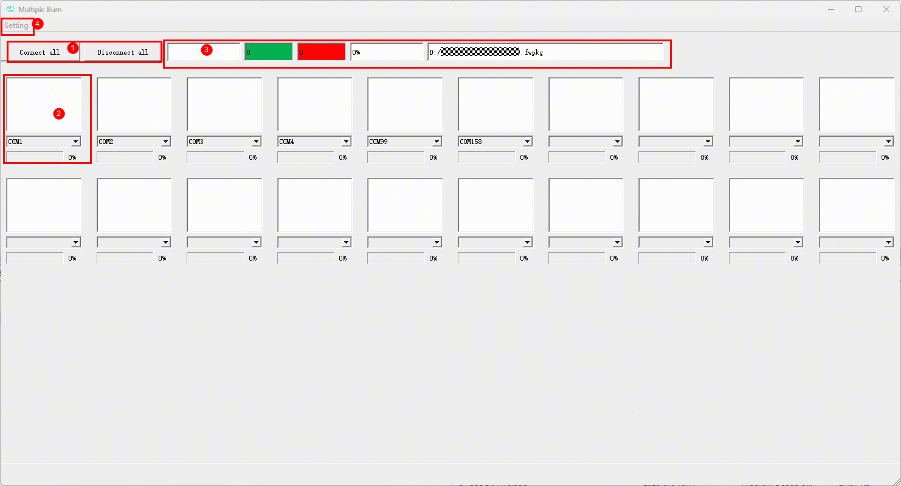

**表 1**  工厂烧写界面说明

<a name="zh-cn_topic_0281207084_table1435556181"></a>
<table><thead align="left"><tr id="zh-cn_topic_0281207084_row1835656183"><th class="cellrowborder" valign="top" width="17.77%" id="mcps1.2.3.1.1"><p id="zh-cn_topic_0281207084_p115311511086"><a name="zh-cn_topic_0281207084_p115311511086"></a><a name="zh-cn_topic_0281207084_p115311511086"></a>区域</p>
</th>
<th class="cellrowborder" valign="top" width="82.23%" id="mcps1.2.3.1.2"><p id="zh-cn_topic_0281207084_p5531145116817"><a name="zh-cn_topic_0281207084_p5531145116817"></a><a name="zh-cn_topic_0281207084_p5531145116817"></a>说明</p>
</th>
</tr>
</thead>
<tbody><tr id="zh-cn_topic_0281207084_row1778202182511"><td class="cellrowborder" valign="top" width="17.77%" headers="mcps1.2.3.1.1 "><p id="zh-cn_topic_0281207084_p1978218222513"><a name="zh-cn_topic_0281207084_p1978218222513"></a><a name="zh-cn_topic_0281207084_p1978218222513"></a>1</p>
</td>
<td class="cellrowborder" valign="top" width="82.23%" headers="mcps1.2.3.1.2 "><a name="zh-cn_topic_0281207084_ul137862022513"></a><a name="zh-cn_topic_0281207084_ul137862022513"></a><ul id="zh-cn_topic_0281207084_ul137862022513"><li>Connect all：连接所有串口。</li><li>Disconnect all：断开所有已打开的串口。</li></ul>
</td>
</tr>
<tr id="zh-cn_topic_0281207084_row1235619611820"><td class="cellrowborder" valign="top" width="17.77%" headers="mcps1.2.3.1.1 "><p id="zh-cn_topic_0281207084_p195316518818"><a name="zh-cn_topic_0281207084_p195316518818"></a><a name="zh-cn_topic_0281207084_p195316518818"></a>2</p>
</td>
<td class="cellrowborder" valign="top" width="82.23%" headers="mcps1.2.3.1.2 "><a name="zh-cn_topic_0281207084_ul05676417267"></a><a name="zh-cn_topic_0281207084_ul05676417267"></a><ul id="zh-cn_topic_0281207084_ul05676417267"><li>回显视图：显示单板烧写状态“Doing”、“Pass”、“Fail”、“Waiting”。</li><li>串口号列表：显示当前可用的串口号。</li></ul>
</td>
</tr>
<tr id="zh-cn_topic_0281207084_row735616614819"><td class="cellrowborder" valign="top" width="17.77%" headers="mcps1.2.3.1.1 "><p id="zh-cn_topic_0281207084_p15531251083"><a name="zh-cn_topic_0281207084_p15531251083"></a><a name="zh-cn_topic_0281207084_p15531251083"></a>3</p>
</td>
<td class="cellrowborder" valign="top" width="82.23%" headers="mcps1.2.3.1.2 "><p id="zh-cn_topic_0281207084_p193431818246"><a name="zh-cn_topic_0281207084_p193431818246"></a><a name="zh-cn_topic_0281207084_p193431818246"></a>烧写结果统计：成功数，失败数，成功率，本次烧写时间，当前烧写文件及路径。</p>
</td>
</tr>
<tr id="row7993754201618"><td class="cellrowborder" valign="top" width="17.77%" headers="mcps1.2.3.1.1 "><p id="p17993185418160"><a name="p17993185418160"></a><a name="p17993185418160"></a>4</p>
</td>
<td class="cellrowborder" valign="top" width="82.23%" headers="mcps1.2.3.1.2 "><div class="p" id="p1799395471615"><a name="p1799395471615"></a><a name="p1799395471615"></a>Setting：包括以下菜单<a name="ul1077410220134"></a><a name="ul1077410220134"></a><ul id="ul1077410220134"><li>Save config：包含以下菜单。</li><li>check COM：串口检查，根据单板返回的位置信息，把单板对应的串口排到界面对应位置，注意该功能需单板镜像支持。</li><li>Robotic Arm Com Setting：机械臂串口配置，配置后烧写单板后，会向选择的串口发送成功和失败信息。</li></ul>
</div>
</td>
</tr>
</tbody>
</table>

**图 2**  机械臂串口设置界面<a name="fig912992718270"></a>  


<a name="table149798213285"></a>
<table><thead align="left"><tr id="row1497972162819"><th class="cellrowborder" valign="top" width="17.77%" id="mcps1.1.3.1.1"><p id="p897932115284"><a name="p897932115284"></a><a name="p897932115284"></a>区域</p>
</th>
<th class="cellrowborder" valign="top" width="82.23%" id="mcps1.1.3.1.2"><p id="p1097952112817"><a name="p1097952112817"></a><a name="p1097952112817"></a>说明</p>
</th>
</tr>
</thead>
<tbody><tr id="row179791521162817"><td class="cellrowborder" valign="top" width="17.77%" headers="mcps1.1.3.1.1 "><p id="p14979121162814"><a name="p14979121162814"></a><a name="p14979121162814"></a>1</p>
</td>
<td class="cellrowborder" valign="top" width="82.23%" headers="mcps1.1.3.1.2 "><p id="p3158163315282"><a name="p3158163315282"></a><a name="p3158163315282"></a>选择是否启用机械臂串口，勾选之后，以下参数才可以配置。</p>
</td>
</tr>
<tr id="row1497902117288"><td class="cellrowborder" valign="top" width="17.77%" headers="mcps1.1.3.1.1 "><p id="p7979132116282"><a name="p7979132116282"></a><a name="p7979132116282"></a>2</p>
</td>
<td class="cellrowborder" valign="top" width="82.23%" headers="mcps1.1.3.1.2 "><a name="zh-cn_topic_0000001138051779_ul137862022513"></a><a name="zh-cn_topic_0000001138051779_ul137862022513"></a><ul id="zh-cn_topic_0000001138051779_ul137862022513"><li>COM：串口</li><li>Baud：波特率</li><li>Data Bit：数据位</li><li>Stop Bit：停止位</li><li>Parity：校验位</li><li>Flow ctrl：流控</li></ul>
</td>
</tr>
<tr id="row14979721142814"><td class="cellrowborder" valign="top" width="17.77%" headers="mcps1.1.3.1.1 "><p id="p39791621172817"><a name="p39791621172817"></a><a name="p39791621172817"></a>3</p>
</td>
<td class="cellrowborder" valign="top" width="82.23%" headers="mcps1.1.3.1.2 "><a name="ul3287204162911"></a><a name="ul3287204162911"></a><ul id="ul3287204162911"><li>Pass info：烧写成功发送的信息，输入格式为0x32或者2。</li><li>Fail info：烧写失败发送的信息，输入格式为0x33或者3。</li></ul>
</td>
</tr>
</tbody>
</table>

### 设置界面<a name="ZH-CN_TOPIC_0000001161963482"></a>

设置界面主要用于设置串口参数，设置界面如[图1](#fig392365342019)所示。

**图 1**  设置界面示意图<a name="fig392365342019"></a>  
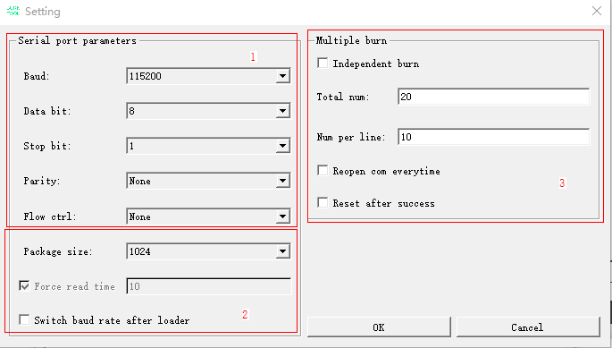

**表 1**  设置界面说明

<a name="zh-cn_topic_0000001138051779_table1435556181"></a>
<table><thead align="left"><tr id="zh-cn_topic_0000001138051779_row1835656183"><th class="cellrowborder" valign="top" width="17.77%" id="mcps1.2.3.1.1"><p id="zh-cn_topic_0000001138051779_p115311511086"><a name="zh-cn_topic_0000001138051779_p115311511086"></a><a name="zh-cn_topic_0000001138051779_p115311511086"></a>区域</p>
</th>
<th class="cellrowborder" valign="top" width="82.23%" id="mcps1.2.3.1.2"><p id="zh-cn_topic_0000001138051779_p5531145116817"><a name="zh-cn_topic_0000001138051779_p5531145116817"></a><a name="zh-cn_topic_0000001138051779_p5531145116817"></a>说明</p>
</th>
</tr>
</thead>
<tbody><tr id="zh-cn_topic_0000001138051779_row1778202182511"><td class="cellrowborder" valign="top" width="17.77%" headers="mcps1.2.3.1.1 "><p id="zh-cn_topic_0000001138051779_p1978218222513"><a name="zh-cn_topic_0000001138051779_p1978218222513"></a><a name="zh-cn_topic_0000001138051779_p1978218222513"></a>1</p>
</td>
<td class="cellrowborder" valign="top" width="82.23%" headers="mcps1.2.3.1.2 "><a name="zh-cn_topic_0000001138051779_ul137862022513"></a><a name="zh-cn_topic_0000001138051779_ul137862022513"></a><ul id="zh-cn_topic_0000001138051779_ul137862022513"><li>Baud：波特率。各产品可支持的波特率范围不同，工具仅列出所有常用波特率，是否可正常使用以产品约束为准，一般波特率越高速度越快，但对硬件要求越高。</li><li>Data Bit：数据位。</li><li>Stop Bit：停止位。</li><li>Parity：校验位。</li><li>Flow ctrl：流控。</li></ul>
</td>
</tr>
<tr id="zh-cn_topic_0000001138051779_row1235619611820"><td class="cellrowborder" valign="top" width="17.77%" headers="mcps1.2.3.1.1 "><p id="zh-cn_topic_0000001138051779_p195316518818"><a name="zh-cn_topic_0000001138051779_p195316518818"></a><a name="zh-cn_topic_0000001138051779_p195316518818"></a>2</p>
</td>
<td class="cellrowborder" valign="top" width="82.23%" headers="mcps1.2.3.1.2 "><a name="zh-cn_topic_0000001138051779_ul05676417267"></a><a name="zh-cn_topic_0000001138051779_ul05676417267"></a><ul id="zh-cn_topic_0000001138051779_ul05676417267"><li>Package size：数据传输每包大小，一般只支持1024字节，除非产品有特殊支持，否则不应该修改。</li><li>Force Read Time：串口定时读时间间隔，表示串口两次接收的时间间隔至少为N ms，默认为勾选且时间间隔为10ms（在4.4版本之后，默认强制勾选且无法修改）。默认为勾选可以防止出现如下场景：<a name="ul121434109233"></a><a name="ul121434109233"></a><ul id="ul121434109233"><li>在某些PC环境下BurnTool无法正常使用。</li><li>在一拖多场景下CPU占用率过高。</li></ul>
</li><li>Switch baud rate after loader：在烧写完loader后切换所设置的波特率。loader在高波特率下无法烧写并且其他文件在此波特率下可以烧写时勾选其可以提升烧写速度。</li></ul>
</td>
</tr>
<tr id="zh-cn_topic_0000001138051779_row829518303389"><td class="cellrowborder" valign="top" width="17.77%" headers="mcps1.2.3.1.1 "><p id="zh-cn_topic_0000001138051779_p229616307382"><a name="zh-cn_topic_0000001138051779_p229616307382"></a><a name="zh-cn_topic_0000001138051779_p229616307382"></a>3</p>
</td>
<td class="cellrowborder" valign="top" width="82.23%" headers="mcps1.2.3.1.2 "><a name="zh-cn_topic_0000001138051779_ul12554334173812"></a><a name="zh-cn_topic_0000001138051779_ul12554334173812"></a><ul id="zh-cn_topic_0000001138051779_ul12554334173812"><li>Independent Burn：独立烧写。勾选后工厂界面所有串口将完全独立，不做整体流程控制，不计算总烧写时间，适用于夹具为单独烧写的工厂；不勾选则工厂界面所有串口会统筹管理，烧写完成后将一起判断夹具抬起操作。</li><li>Total num：工厂界面窗口总个数。</li><li>Num per line：工厂界面每行窗口个数。</li><li>Reopen Com Everytime：勾选后在工厂烧写界面每次烧写完成后，下次开始烧写之前会重新打开串口。</li><li>Reset after success：勾选后在工厂烧写界面每次烧写完成后，会重启单板。</li></ul>
</td>
</tr>
</tbody>
</table>

### 设置界面-3x<a name="ZH-CN_TOPIC_0000001907283089"></a>

设置界面主要用于设置串口参数，设置界面如[图1](#fig495215380385)所示。

**图 1**  设置界面示意图<a name="fig495215380385"></a>  
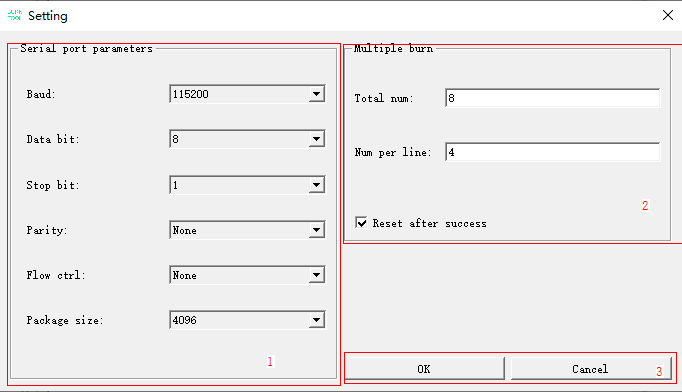

**表 1**  设置界面说明

<a name="zh-cn_topic_0000001138051779_table1435556181"></a>
<table><thead align="left"><tr id="zh-cn_topic_0000001138051779_row1835656183"><th class="cellrowborder" valign="top" width="11.91%" id="mcps1.2.3.1.1"><p id="zh-cn_topic_0000001138051779_p115311511086"><a name="zh-cn_topic_0000001138051779_p115311511086"></a><a name="zh-cn_topic_0000001138051779_p115311511086"></a>区域</p>
</th>
<th class="cellrowborder" valign="top" width="88.09%" id="mcps1.2.3.1.2"><p id="zh-cn_topic_0000001138051779_p5531145116817"><a name="zh-cn_topic_0000001138051779_p5531145116817"></a><a name="zh-cn_topic_0000001138051779_p5531145116817"></a>说明</p>
</th>
</tr>
</thead>
<tbody><tr id="zh-cn_topic_0000001138051779_row1778202182511"><td class="cellrowborder" valign="top" width="11.91%" headers="mcps1.2.3.1.1 "><p id="zh-cn_topic_0000001138051779_p1978218222513"><a name="zh-cn_topic_0000001138051779_p1978218222513"></a><a name="zh-cn_topic_0000001138051779_p1978218222513"></a>1</p>
</td>
<td class="cellrowborder" valign="top" width="88.09%" headers="mcps1.2.3.1.2 "><a name="zh-cn_topic_0000001138051779_ul137862022513"></a><a name="zh-cn_topic_0000001138051779_ul137862022513"></a><ul id="zh-cn_topic_0000001138051779_ul137862022513"><li>Baud：波特率。默认为115200，各产品可支持的波特率范围不同，工具仅列出所有常用波特率，是否可正常使用以产品约束为准。</li><li>Data Bit：数据位。</li><li>Stop Bit：停止位。</li><li>Parity：校验位。</li><li>Flow ctrl：流控。</li><li>Package size：烧写时每一包的大小。</li></ul>
</td>
</tr>
<tr id="row732424895812"><td class="cellrowborder" valign="top" width="11.91%" headers="mcps1.2.3.1.1 "><p id="p1232404855812"><a name="p1232404855812"></a><a name="p1232404855812"></a>2</p>
</td>
<td class="cellrowborder" valign="top" width="88.09%" headers="mcps1.2.3.1.2 "><a name="ul1773251165910"></a><a name="ul1773251165910"></a><ul id="ul1773251165910"><li>Total num：工厂界面窗口总个数（总个数范围1～32）。</li><li>Num per line：工厂界面每行窗口个数（每行窗口个数范围4～8）。</li><li>Reset after success：工厂烧写成功后是否重启单板（默认重启）。</li></ul>
</td>
</tr>
<tr id="row1930111240476"><td class="cellrowborder" valign="top" width="11.91%" headers="mcps1.2.3.1.1 "><p id="p0302924114710"><a name="p0302924114710"></a><a name="p0302924114710"></a>3</p>
</td>
<td class="cellrowborder" valign="top" width="88.09%" headers="mcps1.2.3.1.2 "><a name="ul1124643110478"></a><a name="ul1124643110478"></a><ul id="ul1124643110478"><li>OK：确定设置，并关闭setting界面。</li><li>Cancel：取消修改，并关闭setting界面。</li></ul>
</td>
</tr>
</tbody>
</table>

### 选择J-Link执行程序界面<a name="ZH-CN_TOPIC_0000001907005225"></a>

通过“Setting”-“J-Link Settings”打开J-Link设置，用来配置J-Link执行程序路径，界面如[图1](#fig18205527191819)所示。

**图 1**  选择J-Link执行程序界面<a name="fig18205527191819"></a>  
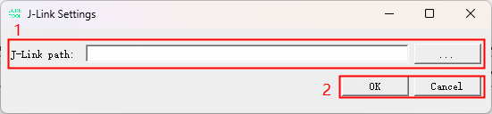

**表 1**  选择J-Link执行程序界面说明

<a name="zh-cn_topic_0000001138051779_table1435556181"></a>
<table><thead align="left"><tr id="zh-cn_topic_0000001138051779_row1835656183"><th class="cellrowborder" valign="top" width="17.77%" id="mcps1.2.3.1.1"><p id="zh-cn_topic_0000001138051779_p115311511086"><a name="zh-cn_topic_0000001138051779_p115311511086"></a><a name="zh-cn_topic_0000001138051779_p115311511086"></a>区域</p>
</th>
<th class="cellrowborder" valign="top" width="82.23%" id="mcps1.2.3.1.2"><p id="zh-cn_topic_0000001138051779_p5531145116817"><a name="zh-cn_topic_0000001138051779_p5531145116817"></a><a name="zh-cn_topic_0000001138051779_p5531145116817"></a>说明</p>
</th>
</tr>
</thead>
<tbody><tr id="zh-cn_topic_0000001138051779_row1778202182511"><td class="cellrowborder" valign="top" width="17.77%" headers="mcps1.2.3.1.1 "><p id="zh-cn_topic_0000001138051779_p1978218222513"><a name="zh-cn_topic_0000001138051779_p1978218222513"></a><a name="zh-cn_topic_0000001138051779_p1978218222513"></a>1</p>
</td>
<td class="cellrowborder" valign="top" width="82.23%" headers="mcps1.2.3.1.2 "><a name="zh-cn_topic_0000001138051779_ul137862022513"></a><a name="zh-cn_topic_0000001138051779_ul137862022513"></a><ul id="zh-cn_topic_0000001138051779_ul137862022513"><li><span id="ph1133041512290"><a name="ph1133041512290"></a><a name="ph1133041512290"></a>J-Link</span> path：“...”选择J-Link执行程序所在的文件夹。</li></ul>
</td>
</tr>
<tr id="row732424895812"><td class="cellrowborder" valign="top" width="17.77%" headers="mcps1.2.3.1.1 "><p id="p1232404855812"><a name="p1232404855812"></a><a name="p1232404855812"></a>2</p>
</td>
<td class="cellrowborder" valign="top" width="82.23%" headers="mcps1.2.3.1.2 "><a name="ul1773251165910"></a><a name="ul1773251165910"></a><ul id="ul1773251165910"><li>OK：确定修改。</li><li>Cancel：取消修改，按照上次所选执行。</li></ul>
</td>
</tr>
</tbody>
</table>

# 操作指南<a name="ZH-CN_TOPIC_0000001207721965"></a>

-   **[手动烧写](#ZH-CN_TOPIC_0000001162123482)**  

-   **[工厂烧写](#ZH-CN_TOPIC_0000001162441958)**  

-   **[工厂烧写-金版校准和机械臂设置](#ZH-CN_TOPIC_0000002409809722)**  

-   **[工厂烧写-USB](#ZH-CN_TOPIC_0000002488739022)**  

-   **[命令行烧写](#ZH-CN_TOPIC_0000001162123486)**  

-   **[读eFuse](#ZH-CN_TOPIC_0000001161963486)**  

-   **[命令行读eFuse](#ZH-CN_TOPIC_0000002486136448)**  

-   **[导出镜像](#ZH-CN_TOPIC_0000001162282012)**  

-   **[导出镜像-3x](#ZH-CN_TOPIC_0000001861321798)**  

-   **[命令行导出](#ZH-CN_TOPIC_0000002335981193)**  

-   **[命令行导出-3x](#ZH-CN_TOPIC_0000001861319574)**  

-   **[组播升级](#ZH-CN_TOPIC_0000001861158562)**  

-   **[OTA升级](#ZH-CN_TOPIC_0000001966789053)**  

-   **[TFTP烧写](#ZH-CN_TOPIC_0000002043190224)**  

-   **[MCU](#ZH-CN_TOPIC_0000002360460356)**  

-   **[全部擦除](#ZH-CN_TOPIC_0000002335766225)**  

-   **[fwpkg生成及拆分](#ZH-CN_TOPIC_0000002328102306)**  

-   **[Reset说明](#ZH-CN_TOPIC_0000002504111393)**  

-   **[比较全部文件功能](#ZH-CN_TOPIC_0000002524412510)**  

## 手动烧写<a name="ZH-CN_TOPIC_0000001162123482"></a>

-   **[串口烧写](#ZH-CN_TOPIC_0000001860836886)**  

-   **[3x协议串口烧写](#ZH-CN_TOPIC_0000002079275381)**  

-   **[DFU烧写](#ZH-CN_TOPIC_0000001906956365)**  

-   **[J-Link烧写](#ZH-CN_TOPIC_0000001906901101)**  

-   **[TCP烧写](#ZH-CN_TOPIC_0000002257271065)**  

-   **[USB烧写](#ZH-CN_TOPIC_0000002311057342)**  

### 串口烧写<a name="ZH-CN_TOPIC_0000001860836886"></a>

**操作步骤<a name="zh-cn_topic_0279549073_ol85749249353"></a>**

1.  在BurnTool界面中单击“Select file”按钮，选择各产品编译生成的固件包，并单击“OK”。
2.  在表格中选中需要烧写的文件（请参考各产品文档中关于烧写的部分）。
3.  选择“Setting”→“Settings”，配置串口参数，默认配置如[图1](#fig323525813325)所示。

    > **说明：** 
    >Force Read Time：定时读取的时间，以毫秒为单位。勾选时为定时读取串口，不勾选时为事件触发读取串口。适用于不勾选该选项无法正常烧录的场景。

    **图 1**  串口设置示例<a name="fig323525813325"></a>  
    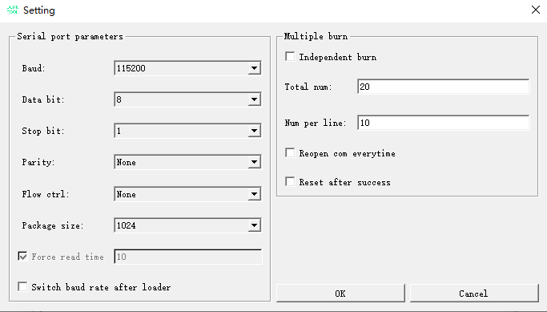

4.  选择目标串口号并单击“Connect”按钮（单击后“Connect”变为“Disconnect”），复位单板。打断后效果如[图2](#zh-cn_topic_0279549073_fig1957511242357)所示。

    **图 2**  打断效果示意图<a name="zh-cn_topic_0279549073_fig1957511242357"></a>  
    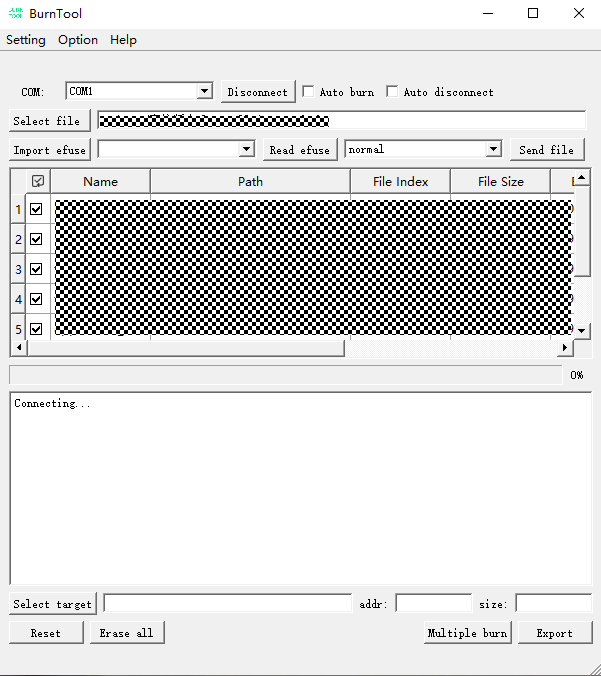

5.  当界面显示字符串“CCC”时，单击“Send file”按钮。不同产品“CCC”上方的字符串可能不同。
6.  等待传输完成后结束烧写，烧写完成会出现“All images burn successfully”。烧写完成效果如[图3](#zh-cn_topic_0279549073_fig11410377529)所示。

    **图 3**  烧写完成示意图<a name="zh-cn_topic_0279549073_fig11410377529"></a>  
    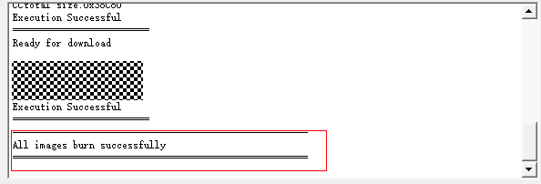

> **说明：** 
>若镜像在服务器上，并多次出现烧写镜像失败的情况，请拷贝至本地烧写

### 3x协议串口烧写<a name="ZH-CN_TOPIC_0000002079275381"></a>

**操作步骤<a name="zh-cn_topic_0279549073_ol85749249353"></a>**

1.  参考[选择Chip](#ZH-CN_TOPIC_0000001906927033)章节选择正确的芯片。
2.  在BurnTool界面的COM处选择串口。如[图1](#fig196045434581)所示

    **图 1**  选择串口<a name="fig196045434581"></a>  
    

3.  <a name="zh-cn_topic_0279549073_li6574112413510"></a>在BurnTool界面中单击“Select file”按钮，选择产品编译生成的固件包，并单击“打开”。
4.  <a name="zh-cn_topic_0279549073_li17418101543217"></a>在表格中选中需要烧写的文件。
5.  （可选）点击“Setting”→“Settings”，配置串口参数，默认配置如[图2](#fig1136320254399)所示。

    **图 2**  串口设置示例<a name="fig1136320254399"></a>  
    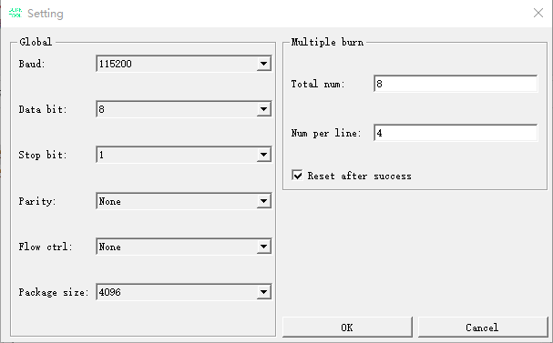

6.  单击“Start burn”按钮（单击后“Start burn”变为“Stop burn”），出现如[图3](#fig143907620139)所示提示，复位单板。

    **图 3**  复位单板提示<a name="fig143907620139"></a>  
    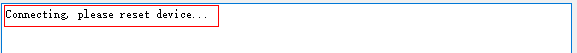

7.  等待传输完成后结束烧写，烧写完成会出现“All images burn successfully”。烧写完成效果如[图4](#fig14610485390)所示。

    **图 4**  烧写完成示意图<a name="fig14610485390"></a>  
    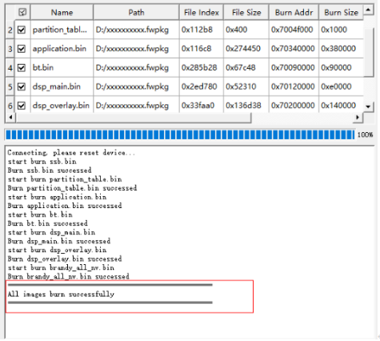

> **说明：** 
>若上次运行BurnTool工具时通过Setting-Save Config保存了当时配置（如[图5](#fig8192174211481)所示），在打开BurnTool时会询问是否使用上次配置进行烧写（如[图6](#fig911361811518)所示）。若选择“Yes”，则加载配置文件，可以酌情跳过[3](#zh-cn_topic_0279549073_li6574112413510)、[4](#zh-cn_topic_0279549073_li17418101543217)。若选择“No”，则不会加载配置文件。
>**图 5**  保存配置示意图<a name="fig8192174211481"></a>  
>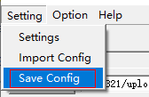
>**图 6**  询问是否加载配置示意图<a name="fig911361811518"></a>  
>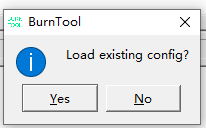

### DFU烧写<a name="ZH-CN_TOPIC_0000001906956365"></a>

**操作步骤<a name="zh-cn_topic_0279549073_ol85749249353"></a>**

1.  使用管理员权限打开程序（右键点击应用程序，点击以管理员身份运行，如[图1](#fig127414312457)所示）。

    **图 1**  以管理员身份运行示意图<a name="fig127414312457"></a>  
    

2.  参考“[选择Chip](#ZH-CN_TOPIC_0000001906927033)”章节选择带DFU后缀的芯片，如“XXX-USB”。
3.  <a name="li637125023912"></a>选择烧写模式，如[图2](#fig1636825093917)所示，选择dfu升级模式。

    **图 2**  烧写模式选择示意图<a name="fig1636825093917"></a>  
    

4.  根据[3](#li637125023912)选择的模式选择设备或者填写设备信息。Dfu模式时选择设备信息如[图3](#fig196045434581_dfu)所示。Auto dfu和 Hid dfu模式时填写设备信息如[图4](#fig18275145418455)所示。

    **图 3**  选择USB设备<a name="fig196045434581_dfu"></a>  
    

    **图 4**  填写usb设备信息<a name="fig18275145418455"></a>  
    

5.  在BurnTool界面中单击“Select file”按钮，选择产品编译生成的固件包，并单击“打开”。
6.  在表格中选中需要烧写的文件。
7.  单击“Start burn”按钮（单击后“Start burn”变为“Stop burn”）。
8.  等待传输完成后结束烧写，烧写完成会出现“All images burn successfully”。烧写完成效果如[图5](#fig10497621143610)所示。

    **图 5**  烧写完成示意图<a name="fig10497621143610"></a>  
    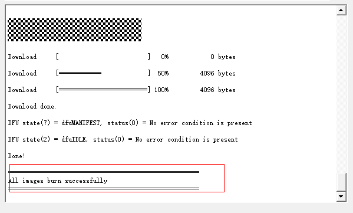

    > **警告：** 
    >在打印“All images burn successfully”之前请一定不要断电，否则单板将有概率异常。

### J-Link烧写<a name="ZH-CN_TOPIC_0000001906901101"></a>

**操作步骤<a name="zh-cn_topic_0279549073_ol85749249353"></a>**

1.  参考“选择Chip”章节选择带J-Link后缀的芯片，如“XXX-J-Link”。
2.  在BurnTool界面中单击“Select file”按钮，选择产品编译生成的固件包，并单击“打开”。
3.  在表格中选中需要烧写的文件。
4.  单击“Start burn”按钮（单击后“Start burn”变为“Stop burn”）。
5.  等待传输完成后结束烧写，烧写完成会出现“All images burn successfully”。烧写完成效果如[图1](#fig10142182714288)所示。

    **图 1**  烧写完成示意图<a name="fig10142182714288"></a>  
    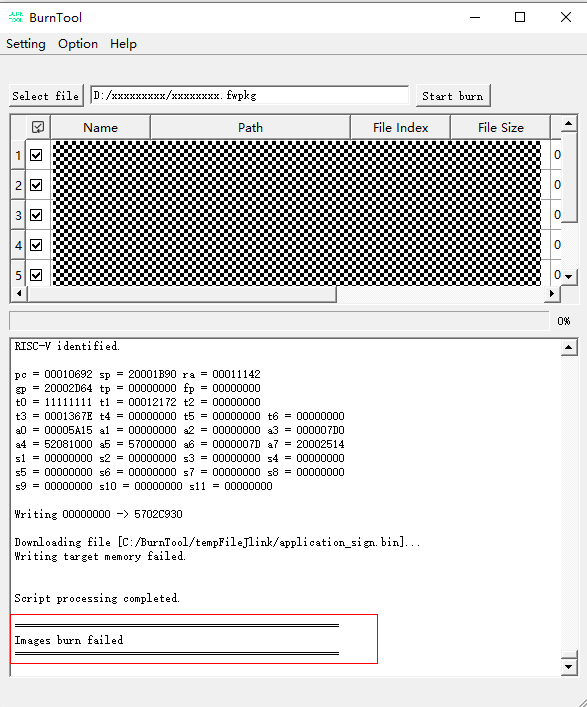

### TCP烧写<a name="ZH-CN_TOPIC_0000002257271065"></a>

**操作步骤<a name="zh-cn_topic_0279549073_ol85749249353"></a>**

1.  在BurnTool界面中单击“Select file”按钮，选择各产品编译生成的固件包，并单击“OK”。
2.  在表格中选中需要烧写的文件（请参考各产品文档中关于烧写的部分）。
3.  配置串口服务器的ip地址和端口，并单击“Connect”按钮（单击后“Connect”变为“Disconnect”），复位单板。打断后效果如[图1](#zh-cn_topic_0279549073_fig1957511242357_tcp)所示。

    **图 1**  打断效果示意图<a name="zh-cn_topic_0279549073_fig1957511242357_tcp"></a>  
    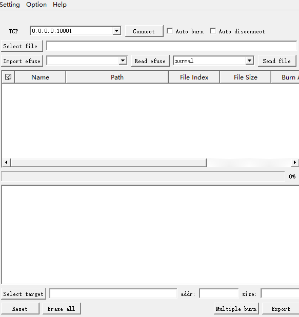

4.  当界面显示字符串“CCC”时，单击“Send file”按钮。不同产品“CCC”上方的字符串可能不同。
5.  等待传输完成后结束烧写，烧写完成会出现“All images burn successfully”。烧写完成效果如[图2](#zh-cn_topic_0279549073_fig11410377529_tcp)所示。

    **图 2**  烧写完成示意图<a name="zh-cn_topic_0279549073_fig11410377529_tcp"></a>  
    

### USB烧写<a name="ZH-CN_TOPIC_0000002311057342"></a>

**操作步骤<a name="ol13666435143119"></a>**

1.  在BurnTool界面中正确填写USB设备的Vid和Pid信息，单击“Select file”按钮，如[图1](#fig174621210163718)所示，选择各产品编译生成的固件包，并单击“打开”。

    **图 1**  单击“Select file”按钮<a name="fig174621210163718"></a>  
    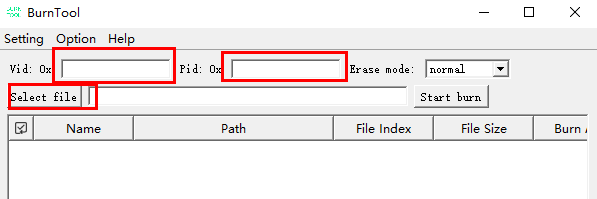

2.  在表格中选中需要烧写的文件（请参考各产品文档中关于烧写的部分），如[图2](#fig4262172193911)所示。

    **图 2**  烧写文件表格<a name="fig4262172193911"></a>  
    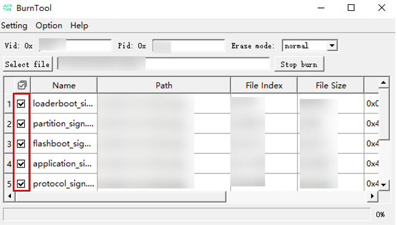

3.  单击“Start burn”按钮，待日志窗口出现“Reset the device...”如[图 等待单板复位](#fig1133854119489)所示，此时按下单板的复位键。工具等待单板复位超时默认为10s，如果超时时间内未检测到单板复位日志窗口会打印“Driver may not be installed. Open the device manager to confirm.No DFU capable USB device available.”，如[图 检测单板复位超时](#fig10735114165612)所示。

    **图 3**  等待单板复位<a name="fig1133854119489"></a>  
    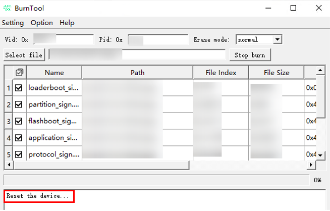

    **图 4**  检测单板复位超时<a name="fig10735114165612"></a>  
    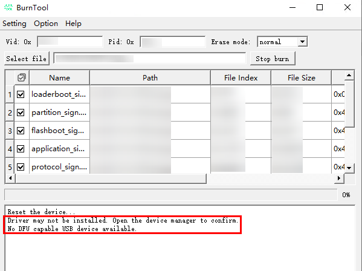

4.  等待传输完成后结束烧写，烧写完成会出现“All images burnt successfully”。烧写完成效果如[图 烧写完成示意图](#fig2320156175918)所示。

    **图 5**  烧写完成示意图<a name="fig2320156175918"></a>  
    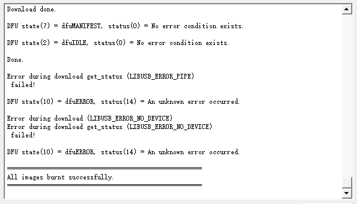

## 工厂烧写<a name="ZH-CN_TOPIC_0000001162441958"></a>

**操作步骤<a name="zh-cn_topic_0281207485_ol91416525475"></a>**

1.  在BurnTool界面中单击“Select file”按钮，选择各产品编译生成的固件包，并单击“OK”。
2.  在表格中选中需要烧写的文件。
3.  选择“Setting”→“Settings”，配置串口参数，默认配置如[图1](#zh-cn_topic_0281207485_fig12141552194715)所示。

    **图 1**  串口设置示例<a name="zh-cn_topic_0281207485_fig12141552194715"></a>  
    

    > **说明：** 
    >Total num在研发测试中最大已压测个数为20，实际烧录最大个数上限理论不限制，一般与电脑性能、夹具、接线稳定性有关。

4.  单击“Multiple burn”按钮，打开工厂烧写窗口，若已有配置会自动读取。若无配置手动选择串口后，可以选择“Setting”→“Save config”生成配置。
5.  单击“Connect all”按钮，并复位所有单板。
6.  等待所有回显视图都显示绿色“PASS”或红色“Fail”。

    

## 工厂烧写-金版校准和机械臂设置<a name="ZH-CN_TOPIC_0000002409809722"></a>

**操作步骤<a name="zh-cn_topic_0281207485_ol91416525475"></a>**

1.  在BurnTool界面中单击“Select file”按钮，选择各产品编译生成的固件包，并单击“OK”。
2.  在表格中选中需要烧写的文件。
3.  选择“Setting”→“Settings”，配置串口参数，默认配置如[图1](#zh-cn_topic_0281207485_fig12141552194715_calibration)所示。

    **图 1**  串口设置示例<a name="zh-cn_topic_0281207485_fig12141552194715_calibration"></a>  
    

    > **说明：** 
    >Total num在研发测试中最大已压测个数为20，实际烧录最大个数上限理论不限制，一般与电脑性能、夹具、接线稳定性有关。

4.  单击“Multiple burn”按钮，打开工厂烧写窗口，若已有配置会自动读取。若无配置手动选择串口后，可以选择“Setting”→“Save config”生成配置。
5.  可选步骤，如果需要使用串口检查功能，选择“Setting”，点击“Check COM”, 工具会根据单板返回的位置信息，把单板对应的串口排到界面对应位置，

    注意该功能需单板镜像支持。

6.  可选步骤，如果需要使用机械臂串口功能，选择“Setting”，点击“Robotic Arm Com Setting”,在弹出的界面配置串口信息，配置后烧写单板后，

    会向选择的串口发送成功和失败信息。

    **图 2**  机械臂串口设置界面<a name="fig12495195794117"></a>  
    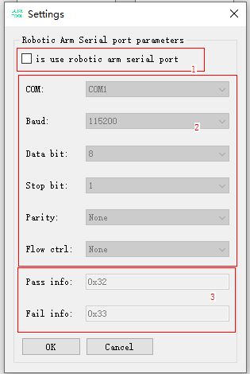

7.  单击“Connect all”按钮，并复位所有单板。
8.  等待所有回显视图都显示绿色“PASS”或红色“Fail”。

    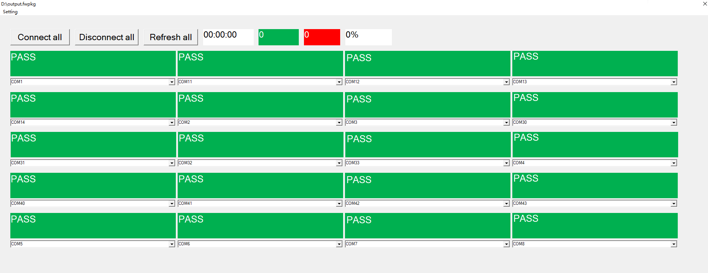

## 工厂烧写-USB<a name="ZH-CN_TOPIC_0000002488739022"></a>

**操作步骤<a name="ol183845810011"></a>**

1.  执行“手动烧写”章节的步骤1。
2.  打开软件安装路径下的“configure\\config\_dfu”文件夹中的“config.ini”文件（以软件安装路径“D:\\BurnTool”为例），如[图1](#fig4944237174018)所示。

    **图 1**  config.ini文件路径<a name="fig4944237174018"></a>  
    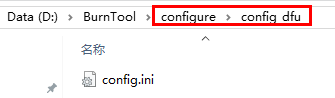

3.  <a name="li1064142019409"></a>在设备管理器的“通用串行总线控制器”中找到连接的单板的位置信息（例如Port\_\#0006.Hub\_\#0001），如[图2](#fig1950975854616)所示。

    **图 2**  单板位置信息<a name="fig1950975854616"></a>  
    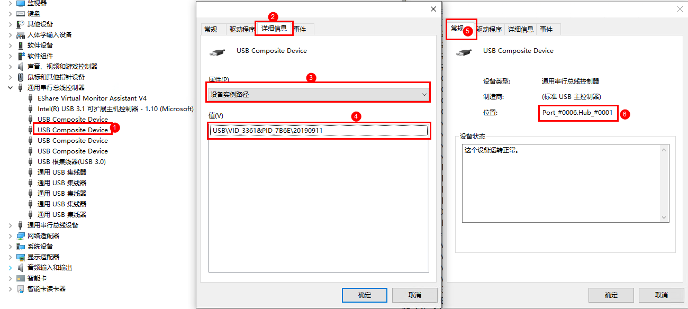

4.  <a name="li12486145715458"></a>将[3](#li1064142019409)中找到的单板位置信息（以Port\_\#0006.Hub\_\#0001为例），保存在“config.ini”中的LOCATION1属性中，如[图3](#fig592582045215)所示。

    **图 3**  LOCATION1位置信息<a name="fig592582045215"></a>  
    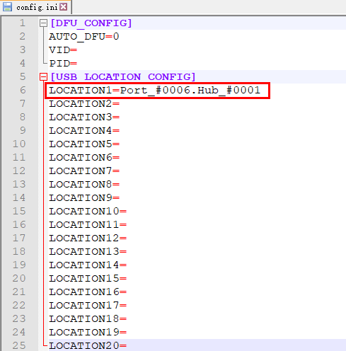

5.  重复执行[3](#li1064142019409)和[4](#li12486145715458)直到将需要烧写的单板的位置信息按序填写在“config.ini”中。

    > **说明：** 
    >-   如果需要同时烧写2块单板，则需要配置这2块单板的位置信息到LOCATION1和LOCATION2属性中。
    >-   如果需要同时烧写20块单板，则需要配置这20块单板的位置信息到LOCATION1到LOCATION20属性中。
    >客户实际使用过程中，可以找20块单板（非空片），全部将其接到HUB中。然后分别给每一块单板上电，一个一个找到每一块单板的位置信息，填充到“config.ini”中。

6.  打开工具界面，执行“手动烧写”章节的步骤2。
7.  选择“Setting”→“USB Settings”，配置工厂烧写相关参数，默认配置如[图4](#fig136217583413)所示。

    **图 4**  工厂烧写默认参数<a name="fig136217583413"></a>  
    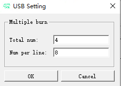

    -   Total num：工厂界面窗口总个数（窗口总个数最大值为20，最小值为1）。
    -   Num per line：工厂界面每行窗口个数（每行窗口个数最大值为8，最小值为4）。

    > **说明：** 
    >Total num的配置个数应与实际烧写的单板个数保持一致。例如如果实际要同时烧写2块单板，则Total num应该配置成2，如果实际要同时烧写20块单板，则Total num应该配置成20。

8.  单击“Multiple burn”按钮，打开工厂烧写窗口。
9.  单击“Connect all”按钮并复位所有单板。
10. 等待所有单板烧写完成（以连接一个单板为例），如[图5](#fig23011151698)所示。

    **图 5**  工厂烧写结束示意图<a name="fig23011151698"></a>  
    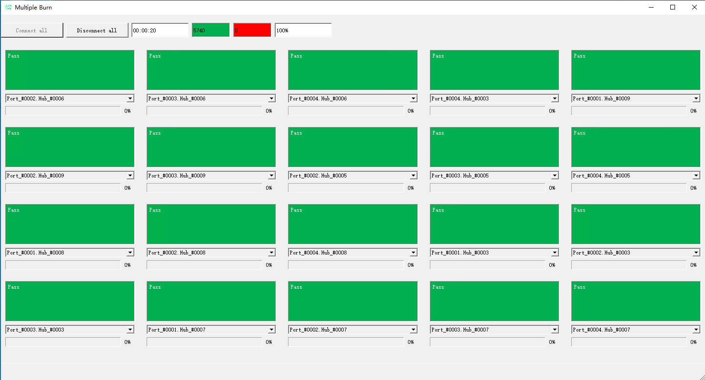

    **表 1**  工厂烧写界面说明

    <a name="table1026339102319"></a>
    <table><thead align="left"><tr id="row1326311919237"><th class="cellrowborder" valign="top" width="10.16%" id="mcps1.2.3.1.1"><p id="p526315911234"><a name="p526315911234"></a><a name="p526315911234"></a>区域</p>
    </th>
    <th class="cellrowborder" valign="top" width="89.84%" id="mcps1.2.3.1.2"><p id="p32637942313"><a name="p32637942313"></a><a name="p32637942313"></a>说明</p>
    </th>
    </tr>
    </thead>
    <tbody><tr id="row1126319982316"><td class="cellrowborder" valign="top" width="10.16%" headers="mcps1.2.3.1.1 "><p id="p92641962320"><a name="p92641962320"></a><a name="p92641962320"></a>1</p>
    </td>
    <td class="cellrowborder" valign="top" width="89.84%" headers="mcps1.2.3.1.2 "><a name="ul6715427202514"></a><a name="ul6715427202514"></a><ul id="ul6715427202514"><li>Connect all：开始检查插入的USB设备。</li><li>Disconnect all：待所有USB设备烧写完成后，手动退出本次烧写。</li></ul>
    </td>
    </tr>
    <tr id="row62642913231"><td class="cellrowborder" valign="top" width="10.16%" headers="mcps1.2.3.1.1 "><p id="p2264189182314"><a name="p2264189182314"></a><a name="p2264189182314"></a>2</p>
    </td>
    <td class="cellrowborder" valign="top" width="89.84%" headers="mcps1.2.3.1.2 "><p id="p74561861857"><a name="p74561861857"></a><a name="p74561861857"></a>烧写结果统计：成功数、失败数、成功率、本次烧写时间。</p>
    </td>
    </tr>
    <tr id="row926459162319"><td class="cellrowborder" valign="top" width="10.16%" headers="mcps1.2.3.1.1 "><p id="p3264397231"><a name="p3264397231"></a><a name="p3264397231"></a>3</p>
    </td>
    <td class="cellrowborder" valign="top" width="89.84%" headers="mcps1.2.3.1.2 "><a name="ul956350162813"></a><a name="ul956350162813"></a><ul id="ul956350162813"><li>回显视图：显示单板烧写状态“Doing”、“PASS”、“Fail”、“Connecting”、“Stop”。</li><li>序列号：显示当前视图检测到的USB序列号。</li></ul>
    </td>
    </tr>
    </tbody>
    </table>

## 命令行烧写<a name="ZH-CN_TOPIC_0000001162123486"></a>

-   **[串口烧写](#ZH-CN_TOPIC_0000001906960121)**  

-   **[3x协议烧写](#ZH-CN_TOPIC_0000001861320450)**  

-   **[DFU烧写](#ZH-CN_TOPIC_0000001906880417)**  

-   **[TCP 烧写](#ZH-CN_TOPIC_0000002257359233)**  

-   **[USB烧写](#ZH-CN_TOPIC_0000002344936389)**  

### 串口烧写<a name="ZH-CN_TOPIC_0000001906960121"></a>

在Windows环境下，BurnTool.exe支持以命令行的方式调用，可用于集成到用户已有的工厂产线烧写程序中，调用命令如下：

```
BurnTool.exe params
```

命令之间用空格隔开，如果命令带有参数，命令与参数之间用冒号隔开，最简示例如下：

```
BurnTool.exe -com:1 -bin:C:\test_bin\xxx.fwpkg -signalbaud:921600 -chiptype:XXXX
```

BurnTool.exe烧写命令可以配置的params参数如[表1](#zh-cn_topic_0279549078_table51147202142)所示。

**表 1**  BurnTool.exe烧写命令参数表

<a name="zh-cn_topic_0279549078_table51147202142"></a>
<table><thead align="left"><tr id="zh-cn_topic_0279549078_row111472021414"><th class="cellrowborder" valign="top" width="19.16191619161916%" id="mcps1.2.4.1.1"><p id="zh-cn_topic_0279549078_p1782320288143"><a name="zh-cn_topic_0279549078_p1782320288143"></a><a name="zh-cn_topic_0279549078_p1782320288143"></a>命令</p>
</th>
<th class="cellrowborder" valign="top" width="17.781778177817785%" id="mcps1.2.4.1.2"><p id="zh-cn_topic_0279549078_p4823202816141"><a name="zh-cn_topic_0279549078_p4823202816141"></a><a name="zh-cn_topic_0279549078_p4823202816141"></a>参数</p>
</th>
<th class="cellrowborder" valign="top" width="63.056305630563045%" id="mcps1.2.4.1.3"><p id="zh-cn_topic_0279549078_p782372815142"><a name="zh-cn_topic_0279549078_p782372815142"></a><a name="zh-cn_topic_0279549078_p782372815142"></a>说明</p>
</th>
</tr>
</thead>
<tbody><tr id="zh-cn_topic_0279549078_row4114220111417"><td class="cellrowborder" valign="top" width="19.16191619161916%" headers="mcps1.2.4.1.1 "><p id="zh-cn_topic_0279549078_p6464935131411"><a name="zh-cn_topic_0279549078_p6464935131411"></a><a name="zh-cn_topic_0279549078_p6464935131411"></a>-com:</p>
</td>
<td class="cellrowborder" valign="top" width="17.781778177817785%" headers="mcps1.2.4.1.2 "><p id="zh-cn_topic_0279549078_p146415352140"><a name="zh-cn_topic_0279549078_p146415352140"></a><a name="zh-cn_topic_0279549078_p146415352140"></a>x</p>
</td>
<td class="cellrowborder" valign="top" width="63.056305630563045%" headers="mcps1.2.4.1.3 "><p id="zh-cn_topic_0279549078_p846410354145"><a name="zh-cn_topic_0279549078_p846410354145"></a><a name="zh-cn_topic_0279549078_p846410354145"></a>PC端的串口号（例如：1）。</p>
</td>
</tr>
<tr id="zh-cn_topic_0279549078_row211482013145"><td class="cellrowborder" valign="top" width="19.16191619161916%" headers="mcps1.2.4.1.1 "><p id="zh-cn_topic_0279549078_p10464135131419"><a name="zh-cn_topic_0279549078_p10464135131419"></a><a name="zh-cn_topic_0279549078_p10464135131419"></a>-bin:</p>
</td>
<td class="cellrowborder" valign="top" width="17.781778177817785%" headers="mcps1.2.4.1.2 "><p id="zh-cn_topic_0279549078_p3464163511416"><a name="zh-cn_topic_0279549078_p3464163511416"></a><a name="zh-cn_topic_0279549078_p3464163511416"></a>path\xxx.bin</p>
</td>
<td class="cellrowborder" valign="top" width="63.056305630563045%" headers="mcps1.2.4.1.3 "><p id="zh-cn_topic_0279549078_p9464133571410"><a name="zh-cn_topic_0279549078_p9464133571410"></a><a name="zh-cn_topic_0279549078_p9464133571410"></a>固件包xxx.bin的绝对路径。固件包的名称和文件类型根据各产品实际情况可能有所不同。（路径不能存在空格字符）</p>
</td>
</tr>
<tr id="row5600171875019"><td class="cellrowborder" valign="top" width="19.16191619161916%" headers="mcps1.2.4.1.1 "><p id="p1584418119154"><a name="p1584418119154"></a><a name="p1584418119154"></a>-chiptype:</p>
</td>
<td class="cellrowborder" valign="top" width="17.781778177817785%" headers="mcps1.2.4.1.2 "><p id="p10464113013156"><a name="p10464113013156"></a><a name="p10464113013156"></a>xxxx</p>
</td>
<td class="cellrowborder" valign="top" width="63.056305630563045%" headers="mcps1.2.4.1.3 "><p id="p97041741131416"><a name="p97041741131416"></a><a name="p97041741131416"></a>芯片类型。</p>
</td>
</tr>
<tr id="zh-cn_topic_0279549078_row2114162071419"><td class="cellrowborder" valign="top" width="19.16191619161916%" headers="mcps1.2.4.1.1 "><p id="zh-cn_topic_0279549078_p146433513144"><a name="zh-cn_topic_0279549078_p146433513144"></a><a name="zh-cn_topic_0279549078_p146433513144"></a>-signalbaud:</p>
</td>
<td class="cellrowborder" valign="top" width="17.781778177817785%" headers="mcps1.2.4.1.2 "><p id="zh-cn_topic_0279549078_p19464193571410"><a name="zh-cn_topic_0279549078_p19464193571410"></a><a name="zh-cn_topic_0279549078_p19464193571410"></a>115200</p>
</td>
<td class="cellrowborder" valign="top" width="63.056305630563045%" headers="mcps1.2.4.1.3 "><p id="zh-cn_topic_0279549078_p54641835181410"><a name="zh-cn_topic_0279549078_p54641835181410"></a><a name="zh-cn_topic_0279549078_p54641835181410"></a>RomBoot下传输固件包时的串口波特率，默认为115200bit/s。建议根据硬件支持情况，配置成921600bit/s或更高波特率，以提升烧写效率。</p>
</td>
</tr>
<tr id="zh-cn_topic_0279549078_row2646161518281"><td class="cellrowborder" valign="top" width="19.16191619161916%" headers="mcps1.2.4.1.1 "><p id="zh-cn_topic_0279549078_p1564761512282"><a name="zh-cn_topic_0279549078_p1564761512282"></a><a name="zh-cn_topic_0279549078_p1564761512282"></a>-burninterval:</p>
</td>
<td class="cellrowborder" valign="top" width="17.781778177817785%" headers="mcps1.2.4.1.2 "><p id="zh-cn_topic_0279549078_p12647715112818"><a name="zh-cn_topic_0279549078_p12647715112818"></a><a name="zh-cn_topic_0279549078_p12647715112818"></a>x</p>
</td>
<td class="cellrowborder" valign="top" width="63.056305630563045%" headers="mcps1.2.4.1.3 "><p id="zh-cn_topic_0279549078_p86472156282"><a name="zh-cn_topic_0279549078_p86472156282"></a><a name="zh-cn_topic_0279549078_p86472156282"></a>使用xms间隔发送打断报文，常用于快速启动场景。不包含此参数时，间隔则为10ms。</p>
</td>
</tr>
<tr id="zh-cn_topic_0279549078_row1715818567399"><td class="cellrowborder" valign="top" width="19.16191619161916%" headers="mcps1.2.4.1.1 "><p id="zh-cn_topic_0279549078_p51584560397"><a name="zh-cn_topic_0279549078_p51584560397"></a><a name="zh-cn_topic_0279549078_p51584560397"></a>-forceread:</p>
</td>
<td class="cellrowborder" valign="top" width="17.781778177817785%" headers="mcps1.2.4.1.2 "><p id="zh-cn_topic_0279549078_p915875623915"><a name="zh-cn_topic_0279549078_p915875623915"></a><a name="zh-cn_topic_0279549078_p915875623915"></a>10</p>
</td>
<td class="cellrowborder" valign="top" width="63.056305630563045%" headers="mcps1.2.4.1.3 "><p id="zh-cn_topic_0279549078_p17683185835817"><a name="zh-cn_topic_0279549078_p17683185835817"></a><a name="zh-cn_topic_0279549078_p17683185835817"></a>包含此参数表示打开串口定时读功能，读数据间隔为10ms。</p>
<p id="zh-cn_topic_0279549078_p6501124013157"><a name="zh-cn_topic_0279549078_p6501124013157"></a><a name="zh-cn_topic_0279549078_p6501124013157"></a>一般无需打开，在如下场景可考虑打开：</p>
<a name="zh-cn_topic_0279549078_ul54691647111514"></a><a name="zh-cn_topic_0279549078_ul54691647111514"></a><ul id="zh-cn_topic_0279549078_ul54691647111514"><li>在某些PC环境下BurnTool无法正常使用。</li><li>在一拖多场景下CPU占用率过高。</li></ul>
</td>
</tr>
<tr id="zh-cn_topic_0279549078_row164607487544"><td class="cellrowborder" valign="top" width="19.16191619161916%" headers="mcps1.2.4.1.1 "><p id="zh-cn_topic_0279549078_p16460174814546"><a name="zh-cn_topic_0279549078_p16460174814546"></a><a name="zh-cn_topic_0279549078_p16460174814546"></a>-erasemode:</p>
</td>
<td class="cellrowborder" valign="top" width="17.781778177817785%" headers="mcps1.2.4.1.2 "><p id="zh-cn_topic_0279549078_p346034875416"><a name="zh-cn_topic_0279549078_p346034875416"></a><a name="zh-cn_topic_0279549078_p346034875416"></a>x</p>
</td>
<td class="cellrowborder" valign="top" width="63.056305630563045%" headers="mcps1.2.4.1.3 "><p id="zh-cn_topic_0279549078_p57861027194111"><a name="zh-cn_topic_0279549078_p57861027194111"></a><a name="zh-cn_topic_0279549078_p57861027194111"></a>擦除模式。其中：</p>
<a name="zh-cn_topic_0279549078_ul209361847134110"></a><a name="zh-cn_topic_0279549078_ul209361847134110"></a><ul id="zh-cn_topic_0279549078_ul209361847134110"><li>0：正常擦除</li><li>1：全片擦除</li><li>2：不擦除</li></ul>
</td>
</tr>
<tr id="zh-cn_topic_0279549078_row114172595516"><td class="cellrowborder" valign="top" width="19.16191619161916%" headers="mcps1.2.4.1.1 "><p id="zh-cn_topic_0279549078_p13410258557"><a name="zh-cn_topic_0279549078_p13410258557"></a><a name="zh-cn_topic_0279549078_p13410258557"></a>-timeout:</p>
</td>
<td class="cellrowborder" valign="top" width="17.781778177817785%" headers="mcps1.2.4.1.2 "><p id="zh-cn_topic_0279549078_p74114253559"><a name="zh-cn_topic_0279549078_p74114253559"></a><a name="zh-cn_topic_0279549078_p74114253559"></a>x</p>
</td>
<td class="cellrowborder" valign="top" width="63.056305630563045%" headers="mcps1.2.4.1.3 "><p id="zh-cn_topic_0279549078_p134162513558"><a name="zh-cn_topic_0279549078_p134162513558"></a><a name="zh-cn_topic_0279549078_p134162513558"></a>打断的超时时间，单位ms。</p>
</td>
</tr>
<tr id="zh-cn_topic_0279549078_row684720710565"><td class="cellrowborder" valign="top" width="19.16191619161916%" headers="mcps1.2.4.1.1 "><p id="zh-cn_topic_0279549078_p1484718711568"><a name="zh-cn_topic_0279549078_p1484718711568"></a><a name="zh-cn_topic_0279549078_p1484718711568"></a>-console</p>
</td>
<td class="cellrowborder" valign="top" width="17.781778177817785%" headers="mcps1.2.4.1.2 "><p id="zh-cn_topic_0279549078_p88479725614"><a name="zh-cn_topic_0279549078_p88479725614"></a><a name="zh-cn_topic_0279549078_p88479725614"></a>无</p>
</td>
<td class="cellrowborder" valign="top" width="63.056305630563045%" headers="mcps1.2.4.1.3 "><p id="zh-cn_topic_0279549078_p284777145614"><a name="zh-cn_topic_0279549078_p284777145614"></a><a name="zh-cn_topic_0279549078_p284777145614"></a>使用标准输入输出，为重定向做准备。</p>
</td>
</tr>
<tr id="zh-cn_topic_0279549078_row22810183011"><td class="cellrowborder" valign="top" width="19.16191619161916%" headers="mcps1.2.4.1.1 "><p id="zh-cn_topic_0279549078_p122121053012"><a name="zh-cn_topic_0279549078_p122121053012"></a><a name="zh-cn_topic_0279549078_p122121053012"></a>-clearlog</p>
</td>
<td class="cellrowborder" valign="top" width="17.781778177817785%" headers="mcps1.2.4.1.2 "><p id="zh-cn_topic_0279549078_p7217100308"><a name="zh-cn_topic_0279549078_p7217100308"></a><a name="zh-cn_topic_0279549078_p7217100308"></a>无</p>
</td>
<td class="cellrowborder" valign="top" width="63.056305630563045%" headers="mcps1.2.4.1.3 "><p id="zh-cn_topic_0279549078_p132101073010"><a name="zh-cn_topic_0279549078_p132101073010"></a><a name="zh-cn_topic_0279549078_p132101073010"></a>屏蔽单板打印的日志。</p>
</td>
</tr>
<tr id="zh-cn_topic_0279549078_row1349413213114"><td class="cellrowborder" valign="top" width="19.16191619161916%" headers="mcps1.2.4.1.1 "><p id="zh-cn_topic_0279549078_p174941321818"><a name="zh-cn_topic_0279549078_p174941321818"></a><a name="zh-cn_topic_0279549078_p174941321818"></a>-onlyeraseall</p>
</td>
<td class="cellrowborder" valign="top" width="17.781778177817785%" headers="mcps1.2.4.1.2 "><p id="zh-cn_topic_0279549078_p1494221212"><a name="zh-cn_topic_0279549078_p1494221212"></a><a name="zh-cn_topic_0279549078_p1494221212"></a>无</p>
</td>
<td class="cellrowborder" valign="top" width="63.056305630563045%" headers="mcps1.2.4.1.3 "><p id="zh-cn_topic_0279549078_p149452120110"><a name="zh-cn_topic_0279549078_p149452120110"></a><a name="zh-cn_topic_0279549078_p149452120110"></a>仅进行全片擦除</p>
</td>
</tr>
<tr id="zh-cn_topic_0279549078_row596472420110"><td class="cellrowborder" valign="top" width="19.16191619161916%" headers="mcps1.2.4.1.1 "><p id="zh-cn_topic_0279549078_p19964132412117"><a name="zh-cn_topic_0279549078_p19964132412117"></a><a name="zh-cn_topic_0279549078_p19964132412117"></a>-onlyburn:</p>
</td>
<td class="cellrowborder" valign="top" width="17.781778177817785%" headers="mcps1.2.4.1.2 "><p id="zh-cn_topic_0279549078_p1696419248120"><a name="zh-cn_topic_0279549078_p1696419248120"></a><a name="zh-cn_topic_0279549078_p1696419248120"></a>name</p>
</td>
<td class="cellrowborder" valign="top" width="63.056305630563045%" headers="mcps1.2.4.1.3 "><p id="zh-cn_topic_0279549078_p7964152410112"><a name="zh-cn_topic_0279549078_p7964152410112"></a><a name="zh-cn_topic_0279549078_p7964152410112"></a>指定烧写对应名字的文件，可重复传参，效果累加。</p>
</td>
</tr>
<tr id="zh-cn_topic_0279549078_row778594311418"><td class="cellrowborder" valign="top" width="19.16191619161916%" headers="mcps1.2.4.1.1 "><p id="zh-cn_topic_0279549078_p17861143101412"><a name="zh-cn_topic_0279549078_p17861143101412"></a><a name="zh-cn_topic_0279549078_p17861143101412"></a>-reset</p>
</td>
<td class="cellrowborder" valign="top" width="17.781778177817785%" headers="mcps1.2.4.1.2 "><p id="zh-cn_topic_0279549078_p878694313143"><a name="zh-cn_topic_0279549078_p878694313143"></a><a name="zh-cn_topic_0279549078_p878694313143"></a>无</p>
</td>
<td class="cellrowborder" valign="top" width="63.056305630563045%" headers="mcps1.2.4.1.3 "><p id="zh-cn_topic_0279549078_p87869435143"><a name="zh-cn_topic_0279549078_p87869435143"></a><a name="zh-cn_topic_0279549078_p87869435143"></a>烧写完成后自动重启设备。</p>
</td>
</tr>
<tr id="row391712289530"><td class="cellrowborder" valign="top" width="19.16191619161916%" headers="mcps1.2.4.1.1 "><p id="p169181028125315"><a name="p169181028125315"></a><a name="p169181028125315"></a>-packagesize:</p>
</td>
<td class="cellrowborder" valign="top" width="17.781778177817785%" headers="mcps1.2.4.1.2 "><p id="p69181628165310"><a name="p69181628165310"></a><a name="p69181628165310"></a>x</p>
</td>
<td class="cellrowborder" valign="top" width="63.056305630563045%" headers="mcps1.2.4.1.3 "><p id="p0918172819535"><a name="p0918172819535"></a><a name="p0918172819535"></a>每次传输的包大小，当前支持1024，2048，4096，8192</p>
</td>
</tr>
<tr id="row5728175013533"><td class="cellrowborder" valign="top" width="19.16191619161916%" headers="mcps1.2.4.1.1 "><p id="p16728450185313"><a name="p16728450185313"></a><a name="p16728450185313"></a>-switchafterloader</p>
</td>
<td class="cellrowborder" valign="top" width="17.781778177817785%" headers="mcps1.2.4.1.2 "><p id="p7728450105310"><a name="p7728450105310"></a><a name="p7728450105310"></a>无</p>
</td>
<td class="cellrowborder" valign="top" width="63.056305630563045%" headers="mcps1.2.4.1.3 "><p id="p97283501536"><a name="p97283501536"></a><a name="p97283501536"></a>在加载loader完成后再切换波特率。</p>
</td>
</tr>
<tr id="row251629155517"><td class="cellrowborder" valign="top" width="19.16191619161916%" headers="mcps1.2.4.1.1 "><p id="p175213294553"><a name="p175213294553"></a><a name="p175213294553"></a>-beforereset</p>
</td>
<td class="cellrowborder" valign="top" width="17.781778177817785%" headers="mcps1.2.4.1.2 "><p id="p1520296558"><a name="p1520296558"></a><a name="p1520296558"></a>无</p>
</td>
<td class="cellrowborder" valign="top" width="63.056305630563045%" headers="mcps1.2.4.1.3 "><p id="p125218296556"><a name="p125218296556"></a><a name="p125218296556"></a>在发送打断报文后，发送at重启命令，复位单板。</p>
</td>
</tr>
</tbody>
</table>

**其他典型场景<a name="section173263145463"></a>**

-   如果需要使用标准输入输出获取烧写过程的打印，命令如下：

    ```
    BurnTool.exe -com:1 -bin:C:\test_bin\xxx.fwpkg -signalbaud:921600 -chiptype:XXXX -console 
    ```

-   如果需要指定烧写一个烧录包中的其中两个bin文件，命令如下：

    ```
    BurnTool.exe -com:1 -bin:C:\test_bin\xxx.fwpkg -signalbaud:921600 -chiptype:XXXX -onlyburn:a.bin -onlyburn:b.bin
    ```

-   如果需要使用全片擦除且烧写完之后自动复位单板，命令如下：

    ```
    BurnTool.exe -com:1 -bin:C:\test_bin\xxx.fwpkg -signalbaud:921600 -chiptype:XXXX -erasemode:1 -reset
    ```

### 3x协议烧写<a name="ZH-CN_TOPIC_0000001861320450"></a>

> **说明：** 
>命令行烧写需在安装路径下打开Windows命令行程序。

BurnTool.exe支持不打开界面，直接通过命令行进行参数设置与工具启动调度并烧写，可用于集成到用户已有的工厂产线烧写程序中，调用命令如下：

```
BurnTool.exe params
```

命令之间用空格隔开，如果命令带有参数，命令与参数之间用冒号隔开，最简示例如下：

```
BurnTool.exe -com:1 -bin:C:\test_bin\xxx.fwpkg -signalbaud:115200 -3x
```

BurnTool.exe烧写命令可以配置的params参数如[表1](#zh-cn_topic_0279549078_table51147202142_3x)所示

**表 1**  BurnTool.exe烧写命令参数表

<a name="zh-cn_topic_0279549078_table51147202142_3x"></a>
<table><thead align="left"><tr id="zh-cn_topic_0279549078_row111472021414"><th class="cellrowborder" valign="top" width="13.72137213721372%" id="mcps1.2.4.1.1"><p id="zh-cn_topic_0279549078_p1782320288143"><a name="zh-cn_topic_0279549078_p1782320288143"></a><a name="zh-cn_topic_0279549078_p1782320288143"></a>命令</p>
</th>
<th class="cellrowborder" valign="top" width="15.001500150015001%" id="mcps1.2.4.1.2"><p id="zh-cn_topic_0279549078_p4823202816141"><a name="zh-cn_topic_0279549078_p4823202816141"></a><a name="zh-cn_topic_0279549078_p4823202816141"></a>参数</p>
</th>
<th class="cellrowborder" valign="top" width="71.27712771277128%" id="mcps1.2.4.1.3"><p id="zh-cn_topic_0279549078_p782372815142"><a name="zh-cn_topic_0279549078_p782372815142"></a><a name="zh-cn_topic_0279549078_p782372815142"></a>说明</p>
</th>
</tr>
</thead>
<tbody><tr id="zh-cn_topic_0279549078_row4114220111417"><td class="cellrowborder" valign="top" width="13.72137213721372%" headers="mcps1.2.4.1.1 "><p id="zh-cn_topic_0279549078_p6464935131411"><a name="zh-cn_topic_0279549078_p6464935131411"></a><a name="zh-cn_topic_0279549078_p6464935131411"></a>-com:</p>
</td>
<td class="cellrowborder" valign="top" width="15.001500150015001%" headers="mcps1.2.4.1.2 "><p id="zh-cn_topic_0279549078_p146415352140"><a name="zh-cn_topic_0279549078_p146415352140"></a><a name="zh-cn_topic_0279549078_p146415352140"></a>x</p>
</td>
<td class="cellrowborder" valign="top" width="71.27712771277128%" headers="mcps1.2.4.1.3 "><p id="zh-cn_topic_0279549078_p846410354145"><a name="zh-cn_topic_0279549078_p846410354145"></a><a name="zh-cn_topic_0279549078_p846410354145"></a>PC端的串口号。</p>
<div class="note" id="note18627105425112"><a name="note18627105425112"></a><a name="note18627105425112"></a><span class="notetitle"> 说明： </span><div class="notebody"><p id="p8557194312515"><a name="p8557194312515"></a><a name="p8557194312515"></a>参数为10进制数字。</p>
</div></div>
</td>
</tr>
<tr id="zh-cn_topic_0279549078_row211482013145"><td class="cellrowborder" valign="top" width="13.72137213721372%" headers="mcps1.2.4.1.1 "><p id="zh-cn_topic_0279549078_p10464135131419"><a name="zh-cn_topic_0279549078_p10464135131419"></a><a name="zh-cn_topic_0279549078_p10464135131419"></a>-bin:</p>
</td>
<td class="cellrowborder" valign="top" width="15.001500150015001%" headers="mcps1.2.4.1.2 "><p id="zh-cn_topic_0279549078_p3464163511416"><a name="zh-cn_topic_0279549078_p3464163511416"></a><a name="zh-cn_topic_0279549078_p3464163511416"></a>path\xxx.fwpkg</p>
</td>
<td class="cellrowborder" valign="top" width="71.27712771277128%" headers="mcps1.2.4.1.3 "><p id="zh-cn_topic_0279549078_p9464133571410"><a name="zh-cn_topic_0279549078_p9464133571410"></a><a name="zh-cn_topic_0279549078_p9464133571410"></a>固件包xxx.fwpkg的绝对路径。固件包的名称和文件类型根据各产品实际情况可能有所不同。</p>
<div class="note" id="zh-cn_topic_0279615088_note11987903"><a name="zh-cn_topic_0279615088_note11987903"></a><a name="zh-cn_topic_0279615088_note11987903"></a><span class="notetitle"> 说明： </span><div class="notebody"><p id="p4141645658"><a name="p4141645658"></a><a name="p4141645658"></a>路径不能包含空格字符。</p>
</div></div>
</td>
</tr>
<tr id="zh-cn_topic_0279549078_row2114162071419"><td class="cellrowborder" valign="top" width="13.72137213721372%" headers="mcps1.2.4.1.1 "><p id="zh-cn_topic_0279549078_p146433513144"><a name="zh-cn_topic_0279549078_p146433513144"></a><a name="zh-cn_topic_0279549078_p146433513144"></a>-signalbaud:</p>
</td>
<td class="cellrowborder" valign="top" width="15.001500150015001%" headers="mcps1.2.4.1.2 "><p id="zh-cn_topic_0279549078_p19464193571410"><a name="zh-cn_topic_0279549078_p19464193571410"></a><a name="zh-cn_topic_0279549078_p19464193571410"></a>115200</p>
</td>
<td class="cellrowborder" valign="top" width="71.27712771277128%" headers="mcps1.2.4.1.3 "><p id="zh-cn_topic_0279549078_p54641835181410"><a name="zh-cn_topic_0279549078_p54641835181410"></a><a name="zh-cn_topic_0279549078_p54641835181410"></a>传输固件包时的串口波特率，默认为115200bit/s。</p>
<div class="note" id="note993072585219"><a name="note993072585219"></a><a name="note993072585219"></a><span class="notetitle"> 说明： </span><div class="notebody"><p id="p34064714513"><a name="p34064714513"></a><a name="p34064714513"></a>参数为10进制数字。</p>
<p id="p1248553118143"><a name="p1248553118143"></a><a name="p1248553118143"></a>建议根据产品形态，硬件支持情况，实际使用情况设置合适的波特率。</p>
</div></div>
</td>
</tr>
<tr id="zh-cn_topic_0279549078_row2646161518281"><td class="cellrowborder" valign="top" width="13.72137213721372%" headers="mcps1.2.4.1.1 "><p id="zh-cn_topic_0279549078_p1564761512282"><a name="zh-cn_topic_0279549078_p1564761512282"></a><a name="zh-cn_topic_0279549078_p1564761512282"></a>-3x</p>
</td>
<td class="cellrowborder" valign="top" width="15.001500150015001%" headers="mcps1.2.4.1.2 "><p id="zh-cn_topic_0279549078_p12647715112818"><a name="zh-cn_topic_0279549078_p12647715112818"></a><a name="zh-cn_topic_0279549078_p12647715112818"></a>无</p>
</td>
<td class="cellrowborder" valign="top" width="71.27712771277128%" headers="mcps1.2.4.1.3 "><p id="zh-cn_topic_0279549078_p86472156282"><a name="zh-cn_topic_0279549078_p86472156282"></a><a name="zh-cn_topic_0279549078_p86472156282"></a>按照3x协议烧写。选择3x则不能选择dfu。</p>
</td>
</tr>
<tr id="zh-cn_topic_0279549078_row684720710565"><td class="cellrowborder" valign="top" width="13.72137213721372%" headers="mcps1.2.4.1.1 "><p id="zh-cn_topic_0279549078_p1484718711568"><a name="zh-cn_topic_0279549078_p1484718711568"></a><a name="zh-cn_topic_0279549078_p1484718711568"></a>-console</p>
</td>
<td class="cellrowborder" valign="top" width="15.001500150015001%" headers="mcps1.2.4.1.2 "><p id="zh-cn_topic_0279549078_p88479725614"><a name="zh-cn_topic_0279549078_p88479725614"></a><a name="zh-cn_topic_0279549078_p88479725614"></a>无</p>
</td>
<td class="cellrowborder" valign="top" width="71.27712771277128%" headers="mcps1.2.4.1.3 "><p id="zh-cn_topic_0279549078_p284777145614"><a name="zh-cn_topic_0279549078_p284777145614"></a><a name="zh-cn_topic_0279549078_p284777145614"></a>使用标准输入输出，为重定向做准备。</p>
</td>
</tr>
<tr id="row5244655903"><td class="cellrowborder" valign="top" width="13.72137213721372%" headers="mcps1.2.4.1.1 "><p id="p62448551203"><a name="p62448551203"></a><a name="p62448551203"></a>-timeout:</p>
</td>
<td class="cellrowborder" valign="top" width="15.001500150015001%" headers="mcps1.2.4.1.2 "><p id="p124405514019"><a name="p124405514019"></a><a name="p124405514019"></a>30000</p>
</td>
<td class="cellrowborder" valign="top" width="71.27712771277128%" headers="mcps1.2.4.1.3 "><p id="p1324475519020"><a name="p1324475519020"></a><a name="p1324475519020"></a>烧写ssb文件握手超时时间，默认为30000ms。</p>
<div class="note" id="note92266241721"><a name="note92266241721"></a><a name="note92266241721"></a><span class="notetitle"> 说明： </span><div class="notebody"><p id="p5227192410210"><a name="p5227192410210"></a><a name="p5227192410210"></a>参数为10进制数字，单位：ms。</p>
</div></div>
</td>
</tr>
<tr id="row155761247103710"><td class="cellrowborder" valign="top" width="13.72137213721372%" headers="mcps1.2.4.1.1 "><p id="zh-cn_topic_0279549078_p19964132412117"><a name="zh-cn_topic_0279549078_p19964132412117"></a><a name="zh-cn_topic_0279549078_p19964132412117"></a>-onlyburn:</p>
</td>
<td class="cellrowborder" valign="top" width="15.001500150015001%" headers="mcps1.2.4.1.2 "><p id="zh-cn_topic_0279549078_p1696419248120"><a name="zh-cn_topic_0279549078_p1696419248120"></a><a name="zh-cn_topic_0279549078_p1696419248120"></a>name</p>
</td>
<td class="cellrowborder" valign="top" width="71.27712771277128%" headers="mcps1.2.4.1.3 "><p id="zh-cn_topic_0279549078_p7964152410112"><a name="zh-cn_topic_0279549078_p7964152410112"></a><a name="zh-cn_topic_0279549078_p7964152410112"></a>指定烧写对应名字的文件，可重复传参，效果累加。</p>
</td>
</tr>
</tbody>
</table>

**其他典型场景<a name="section173263145463"></a>**

如果需要使用标准输入输出获取烧写过程的打印，命令如下：

```
BurnTool.exe -3x -com:1 -bin:C:\test_bin\xxx.fwpkg -signalbaud:115200 -console
如果需要指定烧写一个烧录包中的其中两个bin文件，命令如下：
BurnTool.exe -3x -com:1 -bin:C:\test_bin\xxx.fwpkg -signalbaud:921600 -chiptype:XXXX -onlyburn:a.bin -onlyburn:b.bin
```

### DFU烧写<a name="ZH-CN_TOPIC_0000001906880417"></a>

> **说明：** 
>命令行烧写需在安装路径下打开Windows命令行程序。

BurnTool.exe支持不打开界面，直接通过命令行进行参数设置与工具启动调度并烧写，可用于集成到用户已有的工厂产线烧写程序中。需在管理员权限下执行命令。调用命令如下：

```
BurnTool.exe params
```

使用C++代码管理员权限调用示例如下：

```
#include <windows.h>
int main(int argc, char *argv[])
{
    char cmd[] = "D:\\BurnTool\\BurnTool.exe";
    ShellExecuteA(NULL, "runas", cmd, "-dfu -vid:0x01 -pid:0x01 -usage:0x01 -usagepage:0x01 -bin:C:\test_bin\xxx.fwpkg -console", NULL, SW_NORMAL);
    return 0;
}
```

命令之间用空格隔开，如果命令带有参数，命令与参数之间用冒号隔开，最简示例如下：

```
BurnTool.exe -dfu -pid:0x01 -vid:0x01 -usage:0x01 -usagepage:0x01 -bin:C:\test_bin\xxx.fwpkg -chiptype:XXXX
```

BurnTool.exe dfu模式烧写命令可以配置的params参数如[表1](#zh-cn_topic_0279549078_table51147202142_dfu)所示

**表 1**  BurnTool.exe dfu模式烧写命令参数表

<a name="zh-cn_topic_0279549078_table51147202142_dfu"></a>
<table><thead align="left"><tr id="zh-cn_topic_0279549078_row111472021414"><th class="cellrowborder" valign="top" width="16.071607160716074%" id="mcps1.2.4.1.1"><p id="zh-cn_topic_0279549078_p1782320288143"><a name="zh-cn_topic_0279549078_p1782320288143"></a><a name="zh-cn_topic_0279549078_p1782320288143"></a>命令</p>
</th>
<th class="cellrowborder" valign="top" width="18.971897189718973%" id="mcps1.2.4.1.2"><p id="zh-cn_topic_0279549078_p4823202816141"><a name="zh-cn_topic_0279549078_p4823202816141"></a><a name="zh-cn_topic_0279549078_p4823202816141"></a>参数</p>
</th>
<th class="cellrowborder" valign="top" width="64.95649564956494%" id="mcps1.2.4.1.3"><p id="zh-cn_topic_0279549078_p782372815142"><a name="zh-cn_topic_0279549078_p782372815142"></a><a name="zh-cn_topic_0279549078_p782372815142"></a>说明</p>
</th>
</tr>
</thead>
<tbody><tr id="zh-cn_topic_0279549078_row4114220111417"><td class="cellrowborder" valign="top" width="16.071607160716074%" headers="mcps1.2.4.1.1 "><p id="p21061752165315"><a name="p21061752165315"></a><a name="p21061752165315"></a>-dfu</p>
</td>
<td class="cellrowborder" valign="top" width="18.971897189718973%" headers="mcps1.2.4.1.2 "><p id="zh-cn_topic_0279549078_p146415352140"><a name="zh-cn_topic_0279549078_p146415352140"></a><a name="zh-cn_topic_0279549078_p146415352140"></a>-</p>
</td>
<td class="cellrowborder" valign="top" width="64.95649564956494%" headers="mcps1.2.4.1.3 "><p id="p35265717538"><a name="p35265717538"></a><a name="p35265717538"></a>hid状态下dfu烧写模式。和-autodfu，-hiddfu互斥。</p>
</td>
</tr>
<tr id="row36221954111716"><td class="cellrowborder" valign="top" width="16.071607160716074%" headers="mcps1.2.4.1.1 "><p id="p1187415222489"><a name="p1187415222489"></a><a name="p1187415222489"></a>-autodfu</p>
</td>
<td class="cellrowborder" valign="top" width="18.971897189718973%" headers="mcps1.2.4.1.2 "><p id="p16874152219484"><a name="p16874152219484"></a><a name="p16874152219484"></a>-</p>
</td>
<td class="cellrowborder" valign="top" width="64.95649564956494%" headers="mcps1.2.4.1.3 "><p id="p88741422134814"><a name="p88741422134814"></a><a name="p88741422134814"></a>dfu状态下直接烧写模式。和-dfu, -hiddfu互斥。</p>
</td>
</tr>
<tr id="row101031547012"><td class="cellrowborder" valign="top" width="16.071607160716074%" headers="mcps1.2.4.1.1 "><p id="p2010314541005"><a name="p2010314541005"></a><a name="p2010314541005"></a>-hiddfu</p>
</td>
<td class="cellrowborder" valign="top" width="18.971897189718973%" headers="mcps1.2.4.1.2 "><p id="p41031954908"><a name="p41031954908"></a><a name="p41031954908"></a>-</p>
</td>
<td class="cellrowborder" valign="top" width="64.95649564956494%" headers="mcps1.2.4.1.3 "><p id="p8103654802"><a name="p8103654802"></a><a name="p8103654802"></a>hid状态下直接进行usb烧写。和-autodfu，-dfu互斥。</p>
</td>
</tr>
<tr id="row12303145612434"><td class="cellrowborder" valign="top" width="16.071607160716074%" headers="mcps1.2.4.1.1 "><p id="p1584418119154"><a name="p1584418119154"></a><a name="p1584418119154"></a>-chiptype:</p>
</td>
<td class="cellrowborder" valign="top" width="18.971897189718973%" headers="mcps1.2.4.1.2 "><p id="p10464113013156"><a name="p10464113013156"></a><a name="p10464113013156"></a>xxxx</p>
</td>
<td class="cellrowborder" valign="top" width="64.95649564956494%" headers="mcps1.2.4.1.3 "><p id="p97041741131416"><a name="p97041741131416"></a><a name="p97041741131416"></a>芯片类型。</p>
</td>
</tr>
<tr id="zh-cn_topic_0279549078_row211482013145"><td class="cellrowborder" valign="top" width="16.071607160716074%" headers="mcps1.2.4.1.1 "><p id="zh-cn_topic_0279549078_p10464135131419"><a name="zh-cn_topic_0279549078_p10464135131419"></a><a name="zh-cn_topic_0279549078_p10464135131419"></a>-bin:</p>
</td>
<td class="cellrowborder" valign="top" width="18.971897189718973%" headers="mcps1.2.4.1.2 "><p id="zh-cn_topic_0279549078_p3464163511416"><a name="zh-cn_topic_0279549078_p3464163511416"></a><a name="zh-cn_topic_0279549078_p3464163511416"></a>path\xxx.fwpkg</p>
</td>
<td class="cellrowborder" valign="top" width="64.95649564956494%" headers="mcps1.2.4.1.3 "><p id="zh-cn_topic_0279549078_p9464133571410"><a name="zh-cn_topic_0279549078_p9464133571410"></a><a name="zh-cn_topic_0279549078_p9464133571410"></a>固件包xxx.fwpkg的绝对路径。固件包的名称和文件类型根据各产品实际情况可能有所不同。</p>
<div class="note" id="zh-cn_topic_0279615088_note11987903"><a name="zh-cn_topic_0279615088_note11987903"></a><a name="zh-cn_topic_0279615088_note11987903"></a><span class="notetitle"> 说明： </span><div class="notebody"><p id="p4141645658"><a name="p4141645658"></a><a name="p4141645658"></a>路径不能包含空格字符。</p>
</div></div>
</td>
</tr>
<tr id="zh-cn_topic_0279549078_row2114162071419"><td class="cellrowborder" valign="top" width="16.071607160716074%" headers="mcps1.2.4.1.1 "><p id="zh-cn_topic_0279549078_p146433513144"><a name="zh-cn_topic_0279549078_p146433513144"></a><a name="zh-cn_topic_0279549078_p146433513144"></a>-pid:</p>
</td>
<td class="cellrowborder" valign="top" width="18.971897189718973%" headers="mcps1.2.4.1.2 "><p id="zh-cn_topic_0279549078_p19464193571410"><a name="zh-cn_topic_0279549078_p19464193571410"></a><a name="zh-cn_topic_0279549078_p19464193571410"></a>0x...</p>
</td>
<td class="cellrowborder" valign="top" width="64.95649564956494%" headers="mcps1.2.4.1.3 "><p id="zh-cn_topic_0279549078_p54641835181410"><a name="zh-cn_topic_0279549078_p54641835181410"></a><a name="zh-cn_topic_0279549078_p54641835181410"></a>待烧写设备的pid。</p>
<div class="note" id="note993072585219"><a name="note993072585219"></a><a name="note993072585219"></a><span class="notetitle"> 说明： </span><div class="notebody"><p id="p34064714513"><a name="p34064714513"></a><a name="p34064714513"></a>参数为16进制数字。</p>
</div></div>
</td>
</tr>
<tr id="zh-cn_topic_0279549078_row2646161518281"><td class="cellrowborder" valign="top" width="16.071607160716074%" headers="mcps1.2.4.1.1 "><p id="zh-cn_topic_0279549078_p1564761512282"><a name="zh-cn_topic_0279549078_p1564761512282"></a><a name="zh-cn_topic_0279549078_p1564761512282"></a>-vid：</p>
</td>
<td class="cellrowborder" valign="top" width="18.971897189718973%" headers="mcps1.2.4.1.2 "><p id="zh-cn_topic_0279549078_p12647715112818"><a name="zh-cn_topic_0279549078_p12647715112818"></a><a name="zh-cn_topic_0279549078_p12647715112818"></a>0x...</p>
</td>
<td class="cellrowborder" valign="top" width="64.95649564956494%" headers="mcps1.2.4.1.3 "><p id="p1092351313560"><a name="p1092351313560"></a><a name="p1092351313560"></a>待烧写设备的vid。</p>
<div class="note" id="note720952155617"><a name="note720952155617"></a><a name="note720952155617"></a><span class="notetitle"> 说明： </span><div class="notebody"><p id="p1820914214569"><a name="p1820914214569"></a><a name="p1820914214569"></a>参数为16进制数字。</p>
</div></div>
</td>
</tr>
<tr id="row278116507568"><td class="cellrowborder" valign="top" width="16.071607160716074%" headers="mcps1.2.4.1.1 "><p id="p183111125586"><a name="p183111125586"></a><a name="p183111125586"></a>-usage:</p>
</td>
<td class="cellrowborder" valign="top" width="18.971897189718973%" headers="mcps1.2.4.1.2 "><p id="p3781650125618"><a name="p3781650125618"></a><a name="p3781650125618"></a>0x...</p>
</td>
<td class="cellrowborder" valign="top" width="64.95649564956494%" headers="mcps1.2.4.1.3 "><p id="p490610205582"><a name="p490610205582"></a><a name="p490610205582"></a>待烧写设备的usage。</p>
<div class="note" id="note890652035817"><a name="note890652035817"></a><a name="note890652035817"></a><span class="notetitle"> 说明： </span><div class="notebody"><p id="p1190616202584"><a name="p1190616202584"></a><a name="p1190616202584"></a>参数为16进制数字。</p>
</div></div>
</td>
</tr>
<tr id="row883524665614"><td class="cellrowborder" valign="top" width="16.071607160716074%" headers="mcps1.2.4.1.1 "><p id="p122421040115816"><a name="p122421040115816"></a><a name="p122421040115816"></a>-usagepage:</p>
</td>
<td class="cellrowborder" valign="top" width="18.971897189718973%" headers="mcps1.2.4.1.2 "><p id="p15835646115617"><a name="p15835646115617"></a><a name="p15835646115617"></a>0x...</p>
</td>
<td class="cellrowborder" valign="top" width="64.95649564956494%" headers="mcps1.2.4.1.3 "><p id="p482603316588"><a name="p482603316588"></a><a name="p482603316588"></a>待烧写设备的usagepage。</p>
<div class="note" id="note1682603312581"><a name="note1682603312581"></a><a name="note1682603312581"></a><span class="notetitle"> 说明： </span><div class="notebody"><p id="p13826113395820"><a name="p13826113395820"></a><a name="p13826113395820"></a>参数为16进制数字。</p>
</div></div>
</td>
</tr>
<tr id="zh-cn_topic_0279549078_row684720710565"><td class="cellrowborder" valign="top" width="16.071607160716074%" headers="mcps1.2.4.1.1 "><p id="zh-cn_topic_0279549078_p1484718711568"><a name="zh-cn_topic_0279549078_p1484718711568"></a><a name="zh-cn_topic_0279549078_p1484718711568"></a>-console</p>
</td>
<td class="cellrowborder" valign="top" width="18.971897189718973%" headers="mcps1.2.4.1.2 "><p id="zh-cn_topic_0279549078_p88479725614"><a name="zh-cn_topic_0279549078_p88479725614"></a><a name="zh-cn_topic_0279549078_p88479725614"></a>无</p>
</td>
<td class="cellrowborder" valign="top" width="64.95649564956494%" headers="mcps1.2.4.1.3 "><p id="zh-cn_topic_0279549078_p284777145614"><a name="zh-cn_topic_0279549078_p284777145614"></a><a name="zh-cn_topic_0279549078_p284777145614"></a>使用标准输入输出，为重定向做准备。</p>
</td>
</tr>
</tbody>
</table>

**其他典型场景<a name="section173263145463"></a>**

如果需要使用标准输入输出获取烧写过程的打印，命令如下：

```
BurnTool.exe -dfu -pid:0x01 -vid:0x01 -usage:0x01 -usagepage:0x01 -bin:C:\test_bin\xxx.fwpkg -console
```

### TCP 烧写<a name="ZH-CN_TOPIC_0000002257359233"></a>

在Windows环境下，BurnTool.exe支持以命令行的方式调用，可用于集成到用户已有的工厂产线烧写程序中，调用命令如下：

```
BurnTool.exe params
```

命令之间用空格隔开，如果命令带有参数，命令与参数之间用冒号隔开，最简示例如下：

```
BurnTool.exe -ipaddr:0.0.0.0 -ipport:10001 -bin:C:\test_bin\xxx.fwpkg 
```

部分params参数如[表1](#zh-cn_topic_0279549078_table51147202142_tcp)所示，其余参数配置同串口烧写说明，不再赘述。

**表 1**  BurnTool.exe烧写命令参数表

<a name="zh-cn_topic_0279549078_table51147202142_tcp"></a>
<table><thead align="left"><tr id="zh-cn_topic_0279549078_row111472021414"><th class="cellrowborder" valign="top" width="13.72137213721372%" id="mcps1.2.4.1.1"><p id="zh-cn_topic_0279549078_p1782320288143"><a name="zh-cn_topic_0279549078_p1782320288143"></a><a name="zh-cn_topic_0279549078_p1782320288143"></a>命令</p>
</th>
<th class="cellrowborder" valign="top" width="15.02150215021502%" id="mcps1.2.4.1.2"><p id="zh-cn_topic_0279549078_p4823202816141"><a name="zh-cn_topic_0279549078_p4823202816141"></a><a name="zh-cn_topic_0279549078_p4823202816141"></a>参数</p>
</th>
<th class="cellrowborder" valign="top" width="71.25712571257125%" id="mcps1.2.4.1.3"><p id="zh-cn_topic_0279549078_p782372815142"><a name="zh-cn_topic_0279549078_p782372815142"></a><a name="zh-cn_topic_0279549078_p782372815142"></a>说明</p>
</th>
</tr>
</thead>
<tbody><tr id="zh-cn_topic_0279549078_row4114220111417"><td class="cellrowborder" valign="top" width="13.72137213721372%" headers="mcps1.2.4.1.1 "><p id="p113181921182315"><a name="p113181921182315"></a><a name="p113181921182315"></a>-ipaddr:</p>
</td>
<td class="cellrowborder" valign="top" width="15.02150215021502%" headers="mcps1.2.4.1.2 "><p id="zh-cn_topic_0279549078_p146415352140"><a name="zh-cn_topic_0279549078_p146415352140"></a><a name="zh-cn_topic_0279549078_p146415352140"></a>0.0.0.0</p>
</td>
<td class="cellrowborder" valign="top" width="71.25712571257125%" headers="mcps1.2.4.1.3 "><p id="zh-cn_topic_0279549078_p846410354145"><a name="zh-cn_topic_0279549078_p846410354145"></a><a name="zh-cn_topic_0279549078_p846410354145"></a>串口服务器的ip地址</p>
</td>
</tr>
<tr id="zh-cn_topic_0279549078_row211482013145"><td class="cellrowborder" valign="top" width="13.72137213721372%" headers="mcps1.2.4.1.1 "><p id="zh-cn_topic_0279549078_p10464135131419"><a name="zh-cn_topic_0279549078_p10464135131419"></a><a name="zh-cn_topic_0279549078_p10464135131419"></a>-ipport:</p>
</td>
<td class="cellrowborder" valign="top" width="15.02150215021502%" headers="mcps1.2.4.1.2 "><p id="zh-cn_topic_0279549078_p3464163511416"><a name="zh-cn_topic_0279549078_p3464163511416"></a><a name="zh-cn_topic_0279549078_p3464163511416"></a>10001</p>
</td>
<td class="cellrowborder" valign="top" width="71.25712571257125%" headers="mcps1.2.4.1.3 "><p id="zh-cn_topic_0279549078_p9464133571410"><a name="zh-cn_topic_0279549078_p9464133571410"></a><a name="zh-cn_topic_0279549078_p9464133571410"></a>串口服务器的端口</p>
</td>
</tr>
</tbody>
</table>

### USB烧写<a name="ZH-CN_TOPIC_0000002344936389"></a>

在Windows环境下，BurnTool.exe支持以命令行的方式调用，可用于集成到用户已有的工厂产线烧写程序中，调用命令如下：

```
BurnTool.exe params
```

命令之间用空格隔开，如果命令带有参数，命令与参数之间用冒号隔开，最简示例如下：

```
BurnTool.exe -chiptype:4GCAT1-USB -autodfu -usblocation:xxxx -pid:0xxxxx -vid:0xxxxx -bin:xxx.fwpkg
```

BurnTool.exe烧写命令可以配置的params参数如[表 BurnTool.exe烧写命令参数表](#table7703164131411)所示。

**表 1**  BurnTool.exe烧写命令参数表

<a name="table7703164131411"></a>
<table><thead align="left"><tr id="row37041841151418"><th class="cellrowborder" valign="top" width="19.901990199019902%" id="mcps1.2.4.1.1"><p id="p1170454112147"><a name="p1170454112147"></a><a name="p1170454112147"></a>命令</p>
</th>
<th class="cellrowborder" valign="top" width="19.351935193519353%" id="mcps1.2.4.1.2"><p id="p670414116148"><a name="p670414116148"></a><a name="p670414116148"></a>参数</p>
</th>
<th class="cellrowborder" valign="top" width="60.746074607460756%" id="mcps1.2.4.1.3"><p id="p1670464191413"><a name="p1670464191413"></a><a name="p1670464191413"></a>说明</p>
</th>
</tr>
</thead>
<tbody><tr id="row970484119147"><td class="cellrowborder" valign="top" width="19.901990199019902%" headers="mcps1.2.4.1.1 "><p id="p1584418119154"><a name="p1584418119154"></a><a name="p1584418119154"></a>-chiptype:（必选）</p>
</td>
<td class="cellrowborder" valign="top" width="19.351935193519353%" headers="mcps1.2.4.1.2 "><p id="p10464113013156"><a name="p10464113013156"></a><a name="p10464113013156"></a>xxxx</p>
</td>
<td class="cellrowborder" valign="top" width="60.746074607460756%" headers="mcps1.2.4.1.3 "><p id="p97041741131416"><a name="p97041741131416"></a><a name="p97041741131416"></a>芯片类型。</p>
</td>
</tr>
<tr id="row13704141111410"><td class="cellrowborder" valign="top" width="19.901990199019902%" headers="mcps1.2.4.1.1 "><p id="p2752956181520"><a name="p2752956181520"></a><a name="p2752956181520"></a>-autodfu（必选）</p>
</td>
<td class="cellrowborder" valign="top" width="19.351935193519353%" headers="mcps1.2.4.1.2 "><p id="p137041941171417"><a name="p137041941171417"></a><a name="p137041941171417"></a>无</p>
</td>
<td class="cellrowborder" valign="top" width="60.746074607460756%" headers="mcps1.2.4.1.3 "><p id="p15704741161415"><a name="p15704741161415"></a><a name="p15704741161415"></a>USB烧写模式。</p>
</td>
</tr>
<tr id="row15704941191413"><td class="cellrowborder" valign="top" width="19.901990199019902%" headers="mcps1.2.4.1.1 "><p id="p153911249111617"><a name="p153911249111617"></a><a name="p153911249111617"></a>-pid:（必选）</p>
</td>
<td class="cellrowborder" valign="top" width="19.351935193519353%" headers="mcps1.2.4.1.2 "><p id="p18704941171412"><a name="p18704941171412"></a><a name="p18704941171412"></a>xxxx</p>
</td>
<td class="cellrowborder" valign="top" width="60.746074607460756%" headers="mcps1.2.4.1.3 "><p id="p670484171412"><a name="p670484171412"></a><a name="p670484171412"></a>USB设备的PID（16进制格式）。</p>
</td>
</tr>
<tr id="row1857179124312"><td class="cellrowborder" valign="top" width="19.901990199019902%" headers="mcps1.2.4.1.1 "><p id="p1357209204317"><a name="p1357209204317"></a><a name="p1357209204317"></a>-devicepathid:</p>
</td>
<td class="cellrowborder" valign="top" width="19.351935193519353%" headers="mcps1.2.4.1.2 "><p id="p2572917434"><a name="p2572917434"></a><a name="p2572917434"></a>xxxx</p>
</td>
<td class="cellrowborder" valign="top" width="60.746074607460756%" headers="mcps1.2.4.1.3 "><p id="p1458399439"><a name="p1458399439"></a><a name="p1458399439"></a>USB设备实例路径。</p>
</td>
</tr>
<tr id="row16268116132711"><td class="cellrowborder" valign="top" width="19.901990199019902%" headers="mcps1.2.4.1.1 "><p id="p22691632719"><a name="p22691632719"></a><a name="p22691632719"></a>-usblocation:（必选）</p>
</td>
<td class="cellrowborder" valign="top" width="19.351935193519353%" headers="mcps1.2.4.1.2 "><p id="p1126912618271"><a name="p1126912618271"></a><a name="p1126912618271"></a>xxxx</p>
</td>
<td class="cellrowborder" valign="top" width="60.746074607460756%" headers="mcps1.2.4.1.3 "><p id="p1226936102716"><a name="p1226936102716"></a><a name="p1226936102716"></a>USB设备位置信息。（例如：Port_#0011.Hub_#0001）</p>
</td>
</tr>
<tr id="row177041641151410"><td class="cellrowborder" valign="top" width="19.901990199019902%" headers="mcps1.2.4.1.1 "><p id="p15704124112146"><a name="p15704124112146"></a><a name="p15704124112146"></a>-vid:（必选）</p>
</td>
<td class="cellrowborder" valign="top" width="19.351935193519353%" headers="mcps1.2.4.1.2 "><p id="p1070494114147"><a name="p1070494114147"></a><a name="p1070494114147"></a>xxxx</p>
</td>
<td class="cellrowborder" valign="top" width="60.746074607460756%" headers="mcps1.2.4.1.3 "><p id="p370416414143"><a name="p370416414143"></a><a name="p370416414143"></a>USB设备的VID（16进制格式）。</p>
</td>
</tr>
<tr id="row75639481157"><td class="cellrowborder" valign="top" width="19.901990199019902%" headers="mcps1.2.4.1.1 "><p id="p256304819156"><a name="p256304819156"></a><a name="p256304819156"></a>-bin:（必选）</p>
</td>
<td class="cellrowborder" valign="top" width="19.351935193519353%" headers="mcps1.2.4.1.2 "><p id="p1256314481157"><a name="p1256314481157"></a><a name="p1256314481157"></a>path\xxx.fwpkg</p>
</td>
<td class="cellrowborder" valign="top" width="60.746074607460756%" headers="mcps1.2.4.1.3 "><p id="p456318487151"><a name="p456318487151"></a><a name="p456318487151"></a>固件包xxx.bin的绝对路径。固件包的名称和文件类型根据各产品实际情况可能有所不同。</p>
</td>
</tr>
<tr id="row1781916422819"><td class="cellrowborder" valign="top" width="19.901990199019902%" headers="mcps1.2.4.1.1 "><p id="p4820164215816"><a name="p4820164215816"></a><a name="p4820164215816"></a>-erasemode:</p>
</td>
<td class="cellrowborder" valign="top" width="19.351935193519353%" headers="mcps1.2.4.1.2 "><p id="p18203424816"><a name="p18203424816"></a><a name="p18203424816"></a>x</p>
</td>
<td class="cellrowborder" valign="top" width="60.746074607460756%" headers="mcps1.2.4.1.3 "><p id="p650mcpsimp"><a name="p650mcpsimp"></a><a name="p650mcpsimp"></a>擦除模式。其中：</p>
<a name="ul651mcpsimp"></a><a name="ul651mcpsimp"></a><ul id="ul651mcpsimp"><li>0：正常擦除。</li><li>1：全片擦除。</li></ul>
</td>
</tr>
<tr id="row15665561699"><td class="cellrowborder" valign="top" width="19.901990199019902%" headers="mcps1.2.4.1.1 "><p id="zh-cn_topic_0279549078_p1484718711568"><a name="zh-cn_topic_0279549078_p1484718711568"></a><a name="zh-cn_topic_0279549078_p1484718711568"></a>-console</p>
</td>
<td class="cellrowborder" valign="top" width="19.351935193519353%" headers="mcps1.2.4.1.2 "><p id="p38973481107"><a name="p38973481107"></a><a name="p38973481107"></a>无</p>
</td>
<td class="cellrowborder" valign="top" width="60.746074607460756%" headers="mcps1.2.4.1.3 "><p id="p889794816010"><a name="p889794816010"></a><a name="p889794816010"></a>使用标准输入输出，为重定向做准备。</p>
</td>
</tr>
</tbody>
</table>

## 读eFuse<a name="ZH-CN_TOPIC_0000001161963486"></a>

**操作步骤<a name="zh-cn_topic_0279549086_ol247116818916"></a>**

1.  按照“[串口烧写](#ZH-CN_TOPIC_0000001860836886)”烧写完成loader文件。
2.  单击“Import Efuse”按钮，选择eFuse配置文件。

    eFuse配置文件为ini文件（格式如[图1](#zh-cn_topic_0279549086_fig866670194315)所示）。一个eFuse项需要包括3个配置：

    -   EFUSE\_NAMEX：在BurnTool中显示的名称。
    -   EFUSE\_START\_BITX：eFuse开始的bit索引。
    -   EFUSE\_BIT\_WIDTHX：该eFuse占用的bit数。各参数结尾的X表示一个自然数，范围为1～1000。

    **图 1**  eFuse配置文件格式示例<a name="zh-cn_topic_0279549086_fig866670194315"></a>  
    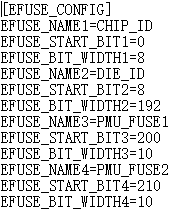

3.  选择需要读取的eFuse条目，单击“Read Efuse”按钮。
4.  查看上报内容，如[图2](#zh-cn_topic_0279549086_fig1371821614187)所示。

    **图 2**  eFuse读取结果示例<a name="zh-cn_topic_0279549086_fig1371821614187"></a>  
    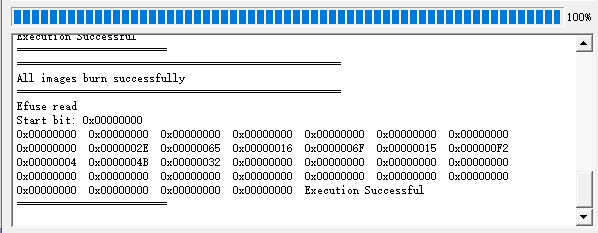

## 命令行读eFuse<a name="ZH-CN_TOPIC_0000002486136448"></a>

在Windows环境下，BurnTool.exe支持以命令行的方式读取efuse 命令之间用空格隔开，如果命令带有参数，命令与参数之间用冒号隔开，最简示例如下：

```
BurnTool.exe -com:1 -bin:C:\test_bin\xxx.fwpkg -onlyburn:loader.bin -signalbaud:115200 -readefuse -startbit:0x00 -bitwidth:0  -chiptype:XXXX
```

BurnTool.exe烧写命令可以配置的params。

**表 1**  BurnTool.exe烧写命令参数表

<a name="zh-cn_topic_0279549078_table51147202142_efuse"></a>
<table><thead align="left"><tr id="zh-cn_topic_0279549078_row111472021414"><th class="cellrowborder" valign="top" width="19.16191619161916%" id="mcps1.2.4.1.1"><p id="zh-cn_topic_0279549078_p1782320288143"><a name="zh-cn_topic_0279549078_p1782320288143"></a><a name="zh-cn_topic_0279549078_p1782320288143"></a>命令</p>
</th>
<th class="cellrowborder" valign="top" width="17.761776177617765%" id="mcps1.2.4.1.2"><p id="zh-cn_topic_0279549078_p4823202816141"><a name="zh-cn_topic_0279549078_p4823202816141"></a><a name="zh-cn_topic_0279549078_p4823202816141"></a>参数</p>
</th>
<th class="cellrowborder" valign="top" width="63.07630763076308%" id="mcps1.2.4.1.3"><p id="zh-cn_topic_0279549078_p782372815142"><a name="zh-cn_topic_0279549078_p782372815142"></a><a name="zh-cn_topic_0279549078_p782372815142"></a>说明</p>
</th>
</tr>
</thead>
<tbody><tr id="zh-cn_topic_0279549078_row4114220111417"><td class="cellrowborder" valign="top" width="19.16191619161916%" headers="mcps1.2.4.1.1 "><p id="zh-cn_topic_0279549078_p6464935131411"><a name="zh-cn_topic_0279549078_p6464935131411"></a><a name="zh-cn_topic_0279549078_p6464935131411"></a>-com:</p>
</td>
<td class="cellrowborder" valign="top" width="17.761776177617765%" headers="mcps1.2.4.1.2 "><p id="zh-cn_topic_0279549078_p146415352140"><a name="zh-cn_topic_0279549078_p146415352140"></a><a name="zh-cn_topic_0279549078_p146415352140"></a>x</p>
</td>
<td class="cellrowborder" valign="top" width="63.07630763076308%" headers="mcps1.2.4.1.3 "><p id="zh-cn_topic_0279549078_p846410354145"><a name="zh-cn_topic_0279549078_p846410354145"></a><a name="zh-cn_topic_0279549078_p846410354145"></a>PC端的串口号（例如：1）。</p>
</td>
</tr>
<tr id="zh-cn_topic_0279549078_row211482013145"><td class="cellrowborder" valign="top" width="19.16191619161916%" headers="mcps1.2.4.1.1 "><p id="zh-cn_topic_0279549078_p10464135131419"><a name="zh-cn_topic_0279549078_p10464135131419"></a><a name="zh-cn_topic_0279549078_p10464135131419"></a>-bin:</p>
</td>
<td class="cellrowborder" valign="top" width="17.761776177617765%" headers="mcps1.2.4.1.2 "><p id="zh-cn_topic_0279549078_p3464163511416"><a name="zh-cn_topic_0279549078_p3464163511416"></a><a name="zh-cn_topic_0279549078_p3464163511416"></a>path\xxx.bin</p>
</td>
<td class="cellrowborder" valign="top" width="63.07630763076308%" headers="mcps1.2.4.1.3 "><p id="zh-cn_topic_0279549078_p9464133571410"><a name="zh-cn_topic_0279549078_p9464133571410"></a><a name="zh-cn_topic_0279549078_p9464133571410"></a>固件包xxx.bin的绝对路径。固件包的名称和文件类型根据各产品实际情况可能有所不同。（路径不能存在空格字符）</p>
</td>
</tr>
<tr id="row1725103716397"><td class="cellrowborder" valign="top" width="19.16191619161916%" headers="mcps1.2.4.1.1 "><p id="p162513712394"><a name="p162513712394"></a><a name="p162513712394"></a>-onlyburn:（可选）</p>
</td>
<td class="cellrowborder" valign="top" width="17.761776177617765%" headers="mcps1.2.4.1.2 "><p id="p1090104243919"><a name="p1090104243919"></a><a name="p1090104243919"></a>loader.bin</p>
</td>
<td class="cellrowborder" valign="top" width="63.07630763076308%" headers="mcps1.2.4.1.3 "><p id="p17613166174020"><a name="p17613166174020"></a><a name="p17613166174020"></a>使用-onlyburn只烧写loader后进行导出，不使用则全部烧写完成后导出efuse。</p>
</td>
</tr>
<tr id="row5600171875019"><td class="cellrowborder" valign="top" width="19.16191619161916%" headers="mcps1.2.4.1.1 "><p id="p1584418119154"><a name="p1584418119154"></a><a name="p1584418119154"></a>-chiptype:</p>
</td>
<td class="cellrowborder" valign="top" width="17.761776177617765%" headers="mcps1.2.4.1.2 "><p id="p10464113013156"><a name="p10464113013156"></a><a name="p10464113013156"></a>xxxx</p>
</td>
<td class="cellrowborder" valign="top" width="63.07630763076308%" headers="mcps1.2.4.1.3 "><p id="p97041741131416"><a name="p97041741131416"></a><a name="p97041741131416"></a>芯片类型。</p>
</td>
</tr>
<tr id="zh-cn_topic_0279549078_row2114162071419"><td class="cellrowborder" valign="top" width="19.16191619161916%" headers="mcps1.2.4.1.1 "><p id="zh-cn_topic_0279549078_p146433513144"><a name="zh-cn_topic_0279549078_p146433513144"></a><a name="zh-cn_topic_0279549078_p146433513144"></a>-signalbaud:</p>
</td>
<td class="cellrowborder" valign="top" width="17.761776177617765%" headers="mcps1.2.4.1.2 "><p id="zh-cn_topic_0279549078_p19464193571410"><a name="zh-cn_topic_0279549078_p19464193571410"></a><a name="zh-cn_topic_0279549078_p19464193571410"></a>115200</p>
</td>
<td class="cellrowborder" valign="top" width="63.07630763076308%" headers="mcps1.2.4.1.3 "><p id="zh-cn_topic_0279549078_p54641835181410"><a name="zh-cn_topic_0279549078_p54641835181410"></a><a name="zh-cn_topic_0279549078_p54641835181410"></a>RomBoot下传输固件包时的串口波特率，默认为115200bit/s。建议根据硬件支持情况，配置成921600bit/s或更高波特率，以提升烧写效率。</p>
</td>
</tr>
<tr id="zh-cn_topic_0279549078_row1715818567399"><td class="cellrowborder" valign="top" width="19.16191619161916%" headers="mcps1.2.4.1.1 "><p id="p191732452015"><a name="p191732452015"></a><a name="p191732452015"></a>-readefuse:</p>
</td>
<td class="cellrowborder" valign="top" width="17.761776177617765%" headers="mcps1.2.4.1.2 "><p id="p163911722171817"><a name="p163911722171817"></a><a name="p163911722171817"></a>无</p>
</td>
<td class="cellrowborder" valign="top" width="63.07630763076308%" headers="mcps1.2.4.1.3 "><p id="p1284373115181"><a name="p1284373115181"></a><a name="p1284373115181"></a>读取efuse功能</p>
</td>
</tr>
<tr id="zh-cn_topic_0279549078_row164607487544"><td class="cellrowborder" valign="top" width="19.16191619161916%" headers="mcps1.2.4.1.1 "><p id="p1151734972018"><a name="p1151734972018"></a><a name="p1151734972018"></a>-startbit:</p>
</td>
<td class="cellrowborder" valign="top" width="17.761776177617765%" headers="mcps1.2.4.1.2 "><p id="zh-cn_topic_0279549078_p346034875416"><a name="zh-cn_topic_0279549078_p346034875416"></a><a name="zh-cn_topic_0279549078_p346034875416"></a>x</p>
</td>
<td class="cellrowborder" valign="top" width="63.07630763076308%" headers="mcps1.2.4.1.3 "><p id="p67274818211"><a name="p67274818211"></a><a name="p67274818211"></a>读取efuse开始地址</p>
</td>
</tr>
<tr id="zh-cn_topic_0279549078_row114172595516"><td class="cellrowborder" valign="top" width="19.16191619161916%" headers="mcps1.2.4.1.1 "><p id="p1474710279215"><a name="p1474710279215"></a><a name="p1474710279215"></a>-bitwidth:</p>
</td>
<td class="cellrowborder" valign="top" width="17.761776177617765%" headers="mcps1.2.4.1.2 "><p id="zh-cn_topic_0279549078_p74114253559"><a name="zh-cn_topic_0279549078_p74114253559"></a><a name="zh-cn_topic_0279549078_p74114253559"></a>x</p>
</td>
<td class="cellrowborder" valign="top" width="63.07630763076308%" headers="mcps1.2.4.1.3 "><p id="p17697195617210"><a name="p17697195617210"></a><a name="p17697195617210"></a>读取efuse长度</p>
</td>
</tr>
</tbody>
</table>

## 导出镜像<a name="ZH-CN_TOPIC_0000001162282012"></a>

**操作步骤<a name="zh-cn_topic_0279549096_ol3628185219234"></a>**

1.  不要勾选“Auto burn”和“Auto disconnect”，如[图1](#fig4992836163810)所示，按照“[串口烧写](#ZH-CN_TOPIC_0000001860836886)”烧写完成loader文件。

    **图 1**  去勾选Auto burn和Auto disconnect<a name="fig4992836163810"></a>  
    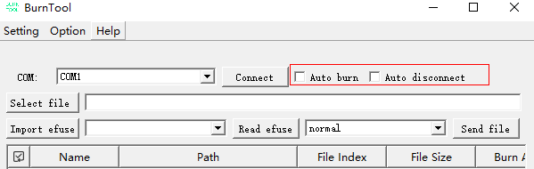

2.  单击“Select target”按钮，选择导出文件的存放位置。
3.  在“addr”编辑框中输入读取的Flash起始地址，在“size”编辑框中输入读取的Flash大小。
4.  单击“Export”按钮开始导出。
5.  等待导出完成，如[图2](#zh-cn_topic_0279549096_fig1371821614187)所示。

    **图 2**  导出文件结束示例<a name="zh-cn_topic_0279549096_fig1371821614187"></a>  
    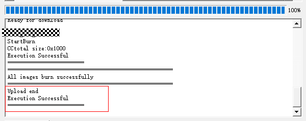

## 导出镜像-3x<a name="ZH-CN_TOPIC_0000001861321798"></a>

Flash导出

**操作步骤<a name="ol65241720913"></a>**

1.  在BurnTool界面的COM处选择串口。如[图1](#fig196045434581_export_3x)所示。

    **图 1**  选择串口<a name="fig196045434581_export_3x"></a>  
    

2.  （可选）点击“Setting”→“Settings”，配置串口参数，默认配置如[图2](#fig1136320254399_export_3x)所示。

    **图 2**  串口设置示例<a name="fig1136320254399_export_3x"></a>  
    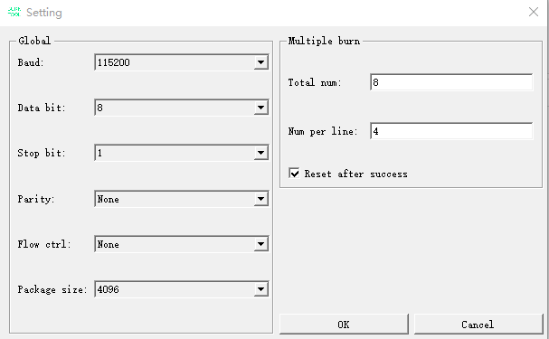

3.  点击“Select target”按钮，选择导出到本地路径。
4.  选择导出的起始地址和长度。如[图3](#fig10117824191016)所示。

    **图 3**  选择文件路径、起始地址和长度<a name="fig10117824191016"></a>  
    

5.  点击“Export”开始导出。
6.  重启单板，等待导出成功。导出成功如[图4](#fig87361235132216)所示。

    **图 4**  导出成功示意图<a name="fig87361235132216"></a>  
    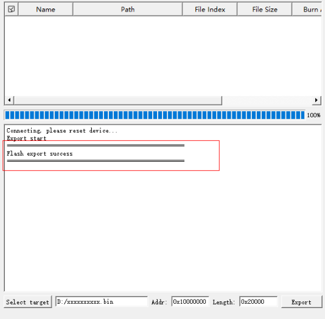

## 命令行导出<a name="ZH-CN_TOPIC_0000002335981193"></a>

BurnTool.exe支持不打开界面，直接通过命令行进行Flash导出操作，调用命令如下：

```
BurnTool.exe params
```

命令之间用空格隔开，如果命令带有参数，命令与参数之间用冒号隔开，最简示例如下：

```
BurnTool.exe -export -com:1 -signalbaud:115200 -bin:C:\test_bin\xxx.fwpkg -onlyburn:loader.bin -target:C:\test_bin\xxx.bin -addr:0x... -size:0x... -chiptype:XXXX
```

其中“loader.bin”为fwpkg中type为0的文件的名称，此处为举例，可能与实际情况不同。BurnTool.exe Flash导出命令可以配置的params参数如[表1](#zh-cn_topic_0279549078_table51147202142_export)所示。

**表 1**  BurnTool.exe flash导出命令参数表

<a name="zh-cn_topic_0279549078_table51147202142_export"></a>
<table><thead align="left"><tr id="zh-cn_topic_0279549078_row111472021414"><th class="cellrowborder" valign="top" width="17.931793179317932%" id="mcps1.2.4.1.1"><p id="zh-cn_topic_0279549078_p1782320288143"><a name="zh-cn_topic_0279549078_p1782320288143"></a><a name="zh-cn_topic_0279549078_p1782320288143"></a>命令</p>
</th>
<th class="cellrowborder" valign="top" width="18.051805180518052%" id="mcps1.2.4.1.2"><p id="zh-cn_topic_0279549078_p4823202816141"><a name="zh-cn_topic_0279549078_p4823202816141"></a><a name="zh-cn_topic_0279549078_p4823202816141"></a>参数</p>
</th>
<th class="cellrowborder" valign="top" width="64.016401640164%" id="mcps1.2.4.1.3"><p id="zh-cn_topic_0279549078_p782372815142"><a name="zh-cn_topic_0279549078_p782372815142"></a><a name="zh-cn_topic_0279549078_p782372815142"></a>说明</p>
</th>
</tr>
</thead>
<tbody><tr id="zh-cn_topic_0279549078_row4114220111417"><td class="cellrowborder" valign="top" width="17.931793179317932%" headers="mcps1.2.4.1.1 "><p id="p92205141189"><a name="p92205141189"></a><a name="p92205141189"></a>-export</p>
</td>
<td class="cellrowborder" valign="top" width="18.051805180518052%" headers="mcps1.2.4.1.2 "><p id="p1921881710193"><a name="p1921881710193"></a><a name="p1921881710193"></a>无</p>
</td>
<td class="cellrowborder" valign="top" width="64.016401640164%" headers="mcps1.2.4.1.3 "><p id="p1922015147189"><a name="p1922015147189"></a><a name="p1922015147189"></a>Flash导出操作。</p>
</td>
</tr>
<tr id="row743443621920"><td class="cellrowborder" valign="top" width="17.931793179317932%" headers="mcps1.2.4.1.1 "><p id="zh-cn_topic_0279549078_p10464135131419"><a name="zh-cn_topic_0279549078_p10464135131419"></a><a name="zh-cn_topic_0279549078_p10464135131419"></a>-bin:</p>
</td>
<td class="cellrowborder" valign="top" width="18.051805180518052%" headers="mcps1.2.4.1.2 "><p id="p514212617273"><a name="p514212617273"></a><a name="p514212617273"></a>path\xxx.bin</p>
</td>
<td class="cellrowborder" valign="top" width="64.016401640164%" headers="mcps1.2.4.1.3 "><p id="zh-cn_topic_0279549078_p9464133571410"><a name="zh-cn_topic_0279549078_p9464133571410"></a><a name="zh-cn_topic_0279549078_p9464133571410"></a>固件包xxx.bin的绝对路径。固件包的名称和文件类型根据各产品实际情况可能有所不同。需要烧写其中的loader文件（路径不能存在空格字符）。</p>
</td>
</tr>
<tr id="row847012614188"><td class="cellrowborder" valign="top" width="17.931793179317932%" headers="mcps1.2.4.1.1 "><p id="p18482961818"><a name="p18482961818"></a><a name="p18482961818"></a>-com:</p>
</td>
<td class="cellrowborder" valign="top" width="18.051805180518052%" headers="mcps1.2.4.1.2 "><p id="p984899111820"><a name="p984899111820"></a><a name="p984899111820"></a>x</p>
</td>
<td class="cellrowborder" valign="top" width="64.016401640164%" headers="mcps1.2.4.1.3 "><p id="p1484859161812"><a name="p1484859161812"></a><a name="p1484859161812"></a>PC端的串口号。</p>
<div class="note" id="note5848189131814"><a name="note5848189131814"></a><a name="note5848189131814"></a><span class="notetitle"> 说明： </span><div class="notebody"><p id="p28481598181"><a name="p28481598181"></a><a name="p28481598181"></a>参数为10进制数字。</p>
</div></div>
</td>
</tr>
<tr id="zh-cn_topic_0279549078_row2114162071419"><td class="cellrowborder" valign="top" width="17.931793179317932%" headers="mcps1.2.4.1.1 "><p id="zh-cn_topic_0279549078_p146433513144"><a name="zh-cn_topic_0279549078_p146433513144"></a><a name="zh-cn_topic_0279549078_p146433513144"></a>-signalbaud:</p>
</td>
<td class="cellrowborder" valign="top" width="18.051805180518052%" headers="mcps1.2.4.1.2 "><p id="zh-cn_topic_0279549078_p19464193571410"><a name="zh-cn_topic_0279549078_p19464193571410"></a><a name="zh-cn_topic_0279549078_p19464193571410"></a>115200</p>
</td>
<td class="cellrowborder" valign="top" width="64.016401640164%" headers="mcps1.2.4.1.3 "><p id="zh-cn_topic_0279549078_p54641835181410"><a name="zh-cn_topic_0279549078_p54641835181410"></a><a name="zh-cn_topic_0279549078_p54641835181410"></a>传输固件包时的串口波特率，默认为115200bit/s。</p>
<div class="note" id="note993072585219"><a name="note993072585219"></a><a name="note993072585219"></a><span class="notetitle"> 说明： </span><div class="notebody"><p id="p34064714513"><a name="p34064714513"></a><a name="p34064714513"></a>参数为10进制数字。</p>
<p id="p1248553118143"><a name="p1248553118143"></a><a name="p1248553118143"></a>建议根据产品形态，硬件支持情况，实际使用情况设置合适的波特率。</p>
</div></div>
</td>
</tr>
<tr id="zh-cn_topic_0279549078_row684720710565"><td class="cellrowborder" valign="top" width="17.931793179317932%" headers="mcps1.2.4.1.1 "><p id="zh-cn_topic_0279549078_p1484718711568"><a name="zh-cn_topic_0279549078_p1484718711568"></a><a name="zh-cn_topic_0279549078_p1484718711568"></a>-target:</p>
</td>
<td class="cellrowborder" valign="top" width="18.051805180518052%" headers="mcps1.2.4.1.2 "><p id="zh-cn_topic_0279549078_p3464163511416"><a name="zh-cn_topic_0279549078_p3464163511416"></a><a name="zh-cn_topic_0279549078_p3464163511416"></a>path\xxx.bin</p>
</td>
<td class="cellrowborder" valign="top" width="64.016401640164%" headers="mcps1.2.4.1.3 "><p id="p913314555204"><a name="p913314555204"></a><a name="p913314555204"></a>导出到本地路径。</p>
</td>
</tr>
<tr id="row13736412142110"><td class="cellrowborder" valign="top" width="17.931793179317932%" headers="mcps1.2.4.1.1 "><p id="p1973711124219"><a name="p1973711124219"></a><a name="p1973711124219"></a>-addr:</p>
</td>
<td class="cellrowborder" valign="top" width="18.051805180518052%" headers="mcps1.2.4.1.2 "><p id="p573719123215"><a name="p573719123215"></a><a name="p573719123215"></a>0x....</p>
</td>
<td class="cellrowborder" valign="top" width="64.016401640164%" headers="mcps1.2.4.1.3 "><p id="p7737101212211"><a name="p7737101212211"></a><a name="p7737101212211"></a>导出Flash地址。</p>
<div class="note" id="note99981652112119"><a name="note99981652112119"></a><a name="note99981652112119"></a><span class="notetitle"> 说明： </span><div class="notebody"><p id="p19998352202113"><a name="p19998352202113"></a><a name="p19998352202113"></a>带有0x为16进制输入，不带0x为10进制输入。</p>
</div></div>
</td>
</tr>
<tr id="row13157287227"><td class="cellrowborder" valign="top" width="17.931793179317932%" headers="mcps1.2.4.1.1 "><p id="p8152288226"><a name="p8152288226"></a><a name="p8152288226"></a>-size:</p>
</td>
<td class="cellrowborder" valign="top" width="18.051805180518052%" headers="mcps1.2.4.1.2 "><p id="p112451954192210"><a name="p112451954192210"></a><a name="p112451954192210"></a>0x....</p>
</td>
<td class="cellrowborder" valign="top" width="64.016401640164%" headers="mcps1.2.4.1.3 "><p id="p785815618226"><a name="p785815618226"></a><a name="p785815618226"></a>导出Flash大小。</p>
<div class="note" id="note58581556182216"><a name="note58581556182216"></a><a name="note58581556182216"></a><span class="notetitle"> 说明： </span><div class="notebody"><p id="p18858105615228"><a name="p18858105615228"></a><a name="p18858105615228"></a>带有0x为16进制输入，不带0x为10进制输入。</p>
</div></div>
</td>
</tr>
<tr id="row1371373342817"><td class="cellrowborder" valign="top" width="17.931793179317932%" headers="mcps1.2.4.1.1 "><p id="p159671534102816"><a name="p159671534102816"></a><a name="p159671534102816"></a>-console</p>
</td>
<td class="cellrowborder" valign="top" width="18.051805180518052%" headers="mcps1.2.4.1.2 "><p id="zh-cn_topic_0279549078_p88479725614"><a name="zh-cn_topic_0279549078_p88479725614"></a><a name="zh-cn_topic_0279549078_p88479725614"></a>无</p>
</td>
<td class="cellrowborder" valign="top" width="64.016401640164%" headers="mcps1.2.4.1.3 "><p id="zh-cn_topic_0279549078_p284777145614"><a name="zh-cn_topic_0279549078_p284777145614"></a><a name="zh-cn_topic_0279549078_p284777145614"></a>使用标准输入输出，为重定向做准备。</p>
</td>
</tr>
<tr id="row162351145143114"><td class="cellrowborder" valign="top" width="17.931793179317932%" headers="mcps1.2.4.1.1 "><p id="p1923510452311"><a name="p1923510452311"></a><a name="p1923510452311"></a>-onlyburn:</p>
</td>
<td class="cellrowborder" valign="top" width="18.051805180518052%" headers="mcps1.2.4.1.2 "><p id="zh-cn_topic_0279549078_p1696419248120"><a name="zh-cn_topic_0279549078_p1696419248120"></a><a name="zh-cn_topic_0279549078_p1696419248120"></a>name</p>
</td>
<td class="cellrowborder" valign="top" width="64.016401640164%" headers="mcps1.2.4.1.3 "><p id="zh-cn_topic_0279549078_p7964152410112"><a name="zh-cn_topic_0279549078_p7964152410112"></a><a name="zh-cn_topic_0279549078_p7964152410112"></a>指定烧写对应名字的文件，可重复传参，效果累加。</p>
</td>
</tr>
<tr id="row3891028135717"><td class="cellrowborder" valign="top" width="17.931793179317932%" headers="mcps1.2.4.1.1 "><p id="p178914280579"><a name="p178914280579"></a><a name="p178914280579"></a>-beforereset</p>
</td>
<td class="cellrowborder" valign="top" width="18.051805180518052%" headers="mcps1.2.4.1.2 "><p id="p48962815713"><a name="p48962815713"></a><a name="p48962815713"></a>无</p>
</td>
<td class="cellrowborder" valign="top" width="64.016401640164%" headers="mcps1.2.4.1.3 "><p id="p6898286578"><a name="p6898286578"></a><a name="p6898286578"></a>在发送打断报文后，发送at重启命令，复位单板。</p>
</td>
</tr>
</tbody>
</table>

**其他典型场景<a name="section173263145463"></a>**

如果需要使用标准输入输出获取烧写过程的打印，命令如下：

```
BurnTool.exe -export -com:1 -signalbaud:115200 -bin:C:\test_bin\xxx.fwpkg -target:C:\test_bin\xxx.bin -addr:0x... -size:0x... -console
```

如果需要先烧写全量镜像再导出，命令如下：

```
BurnTool.exe -export -com:1 -signalbaud:115200 -bin:C:\test_bin\xxx.fwpkg -target:C:\test_bin\xxx.bin -addr:0x... -size:0x...
```

## 命令行导出-3x<a name="ZH-CN_TOPIC_0000001861319574"></a>

BurnTool.exe支持不打开界面，直接通过命令行进行Flash导出操作，调用命令如下：

```
BurnTool.exe params
```

命令之间用空格隔开，如果命令带有参数，命令与参数之间用冒号隔开，最简示例如下：

```
BurnTool.exe -export -3x -com:1 -signalbaud:115200 -target:C:\test_bin\xxx.bin -addr:0x... -size:0x...
```

BurnTool.exe Flash导出命令可以配置的params参数如[表1](#zh-cn_topic_0279549078_table51147202142_export_3x)所示。

**表 1**  BurnTool.exe flash导出命令参数表

<a name="zh-cn_topic_0279549078_table51147202142_export_3x"></a>
<table><thead align="left"><tr id="zh-cn_topic_0279549078_row111472021414"><th class="cellrowborder" valign="top" width="16.611661166116612%" id="mcps1.2.4.1.1"><p id="zh-cn_topic_0279549078_p1782320288143"><a name="zh-cn_topic_0279549078_p1782320288143"></a><a name="zh-cn_topic_0279549078_p1782320288143"></a>命令</p>
</th>
<th class="cellrowborder" valign="top" width="17.85178517851785%" id="mcps1.2.4.1.2"><p id="zh-cn_topic_0279549078_p4823202816141"><a name="zh-cn_topic_0279549078_p4823202816141"></a><a name="zh-cn_topic_0279549078_p4823202816141"></a>参数</p>
</th>
<th class="cellrowborder" valign="top" width="65.53655365536554%" id="mcps1.2.4.1.3"><p id="zh-cn_topic_0279549078_p782372815142"><a name="zh-cn_topic_0279549078_p782372815142"></a><a name="zh-cn_topic_0279549078_p782372815142"></a>说明</p>
</th>
</tr>
</thead>
<tbody><tr id="zh-cn_topic_0279549078_row4114220111417"><td class="cellrowborder" valign="top" width="16.611661166116612%" headers="mcps1.2.4.1.1 "><p id="p92205141189"><a name="p92205141189"></a><a name="p92205141189"></a>-export</p>
</td>
<td class="cellrowborder" valign="top" width="17.85178517851785%" headers="mcps1.2.4.1.2 "><p id="p1921881710193"><a name="p1921881710193"></a><a name="p1921881710193"></a>无</p>
</td>
<td class="cellrowborder" valign="top" width="65.53655365536554%" headers="mcps1.2.4.1.3 "><p id="p1922015147189"><a name="p1922015147189"></a><a name="p1922015147189"></a>Flash导出操作。</p>
</td>
</tr>
<tr id="row743443621920"><td class="cellrowborder" valign="top" width="16.611661166116612%" headers="mcps1.2.4.1.1 "><p id="p324913371192"><a name="p324913371192"></a><a name="p324913371192"></a>-3x</p>
</td>
<td class="cellrowborder" valign="top" width="17.85178517851785%" headers="mcps1.2.4.1.2 "><p id="p724993791919"><a name="p724993791919"></a><a name="p724993791919"></a>无</p>
</td>
<td class="cellrowborder" valign="top" width="65.53655365536554%" headers="mcps1.2.4.1.3 "><p id="p182494373192"><a name="p182494373192"></a><a name="p182494373192"></a>按照3x协议导出镜像。</p>
</td>
</tr>
<tr id="row847012614188"><td class="cellrowborder" valign="top" width="16.611661166116612%" headers="mcps1.2.4.1.1 "><p id="p18482961818"><a name="p18482961818"></a><a name="p18482961818"></a>-com:</p>
</td>
<td class="cellrowborder" valign="top" width="17.85178517851785%" headers="mcps1.2.4.1.2 "><p id="p984899111820"><a name="p984899111820"></a><a name="p984899111820"></a>x</p>
</td>
<td class="cellrowborder" valign="top" width="65.53655365536554%" headers="mcps1.2.4.1.3 "><p id="p1484859161812"><a name="p1484859161812"></a><a name="p1484859161812"></a>PC端的串口号。</p>
<div class="note" id="note5848189131814"><a name="note5848189131814"></a><a name="note5848189131814"></a><span class="notetitle"> 说明： </span><div class="notebody"><p id="p28481598181"><a name="p28481598181"></a><a name="p28481598181"></a>参数为10进制数字。</p>
</div></div>
</td>
</tr>
<tr id="zh-cn_topic_0279549078_row2114162071419"><td class="cellrowborder" valign="top" width="16.611661166116612%" headers="mcps1.2.4.1.1 "><p id="zh-cn_topic_0279549078_p146433513144"><a name="zh-cn_topic_0279549078_p146433513144"></a><a name="zh-cn_topic_0279549078_p146433513144"></a>-signalbaud:</p>
</td>
<td class="cellrowborder" valign="top" width="17.85178517851785%" headers="mcps1.2.4.1.2 "><p id="zh-cn_topic_0279549078_p19464193571410"><a name="zh-cn_topic_0279549078_p19464193571410"></a><a name="zh-cn_topic_0279549078_p19464193571410"></a>115200</p>
</td>
<td class="cellrowborder" valign="top" width="65.53655365536554%" headers="mcps1.2.4.1.3 "><p id="zh-cn_topic_0279549078_p54641835181410"><a name="zh-cn_topic_0279549078_p54641835181410"></a><a name="zh-cn_topic_0279549078_p54641835181410"></a>传输固件包时的串口波特率，默认为115200bit/s。</p>
<div class="note" id="note993072585219"><a name="note993072585219"></a><a name="note993072585219"></a><span class="notetitle"> 说明： </span><div class="notebody"><p id="p34064714513"><a name="p34064714513"></a><a name="p34064714513"></a>参数为10进制数字。</p>
<p id="p1248553118143"><a name="p1248553118143"></a><a name="p1248553118143"></a>建议根据产品形态，硬件支持情况，实际使用情况设置合适的波特率。</p>
</div></div>
</td>
</tr>
<tr id="zh-cn_topic_0279549078_row684720710565"><td class="cellrowborder" valign="top" width="16.611661166116612%" headers="mcps1.2.4.1.1 "><p id="zh-cn_topic_0279549078_p1484718711568"><a name="zh-cn_topic_0279549078_p1484718711568"></a><a name="zh-cn_topic_0279549078_p1484718711568"></a>-target:</p>
</td>
<td class="cellrowborder" valign="top" width="17.85178517851785%" headers="mcps1.2.4.1.2 "><p id="zh-cn_topic_0279549078_p3464163511416"><a name="zh-cn_topic_0279549078_p3464163511416"></a><a name="zh-cn_topic_0279549078_p3464163511416"></a>path\xxx.bin</p>
</td>
<td class="cellrowborder" valign="top" width="65.53655365536554%" headers="mcps1.2.4.1.3 "><p id="p913314555204"><a name="p913314555204"></a><a name="p913314555204"></a>导出到本地路径。</p>
</td>
</tr>
<tr id="row13736412142110"><td class="cellrowborder" valign="top" width="16.611661166116612%" headers="mcps1.2.4.1.1 "><p id="p1973711124219"><a name="p1973711124219"></a><a name="p1973711124219"></a>-addr:</p>
</td>
<td class="cellrowborder" valign="top" width="17.85178517851785%" headers="mcps1.2.4.1.2 "><p id="p573719123215"><a name="p573719123215"></a><a name="p573719123215"></a>0x....</p>
</td>
<td class="cellrowborder" valign="top" width="65.53655365536554%" headers="mcps1.2.4.1.3 "><p id="p7737101212211"><a name="p7737101212211"></a><a name="p7737101212211"></a>导出Flash地址。</p>
<div class="note" id="note99981652112119"><a name="note99981652112119"></a><a name="note99981652112119"></a><span class="notetitle"> 说明： </span><div class="notebody"><p id="p19998352202113"><a name="p19998352202113"></a><a name="p19998352202113"></a>带有0x为16进制输入，不带0x为10进制输入。</p>
</div></div>
</td>
</tr>
<tr id="row13157287227"><td class="cellrowborder" valign="top" width="16.611661166116612%" headers="mcps1.2.4.1.1 "><p id="p8152288226"><a name="p8152288226"></a><a name="p8152288226"></a>-size:</p>
</td>
<td class="cellrowborder" valign="top" width="17.85178517851785%" headers="mcps1.2.4.1.2 "><p id="p112451954192210"><a name="p112451954192210"></a><a name="p112451954192210"></a>0x....</p>
</td>
<td class="cellrowborder" valign="top" width="65.53655365536554%" headers="mcps1.2.4.1.3 "><p id="p785815618226"><a name="p785815618226"></a><a name="p785815618226"></a>导出Flash大小。</p>
<div class="note" id="note58581556182216"><a name="note58581556182216"></a><a name="note58581556182216"></a><span class="notetitle"> 说明： </span><div class="notebody"><p id="p18858105615228"><a name="p18858105615228"></a><a name="p18858105615228"></a>带有0x为16进制输入，不带0x为10进制输入。</p>
</div></div>
</td>
</tr>
<tr id="row1371373342817"><td class="cellrowborder" valign="top" width="16.611661166116612%" headers="mcps1.2.4.1.1 "><p id="p159671534102816"><a name="p159671534102816"></a><a name="p159671534102816"></a>-console</p>
</td>
<td class="cellrowborder" valign="top" width="17.85178517851785%" headers="mcps1.2.4.1.2 "><p id="zh-cn_topic_0279549078_p88479725614"><a name="zh-cn_topic_0279549078_p88479725614"></a><a name="zh-cn_topic_0279549078_p88479725614"></a>无</p>
</td>
<td class="cellrowborder" valign="top" width="65.53655365536554%" headers="mcps1.2.4.1.3 "><p id="zh-cn_topic_0279549078_p284777145614"><a name="zh-cn_topic_0279549078_p284777145614"></a><a name="zh-cn_topic_0279549078_p284777145614"></a>使用标准输入输出，为重定向做准备。</p>
</td>
</tr>
</tbody>
</table>

**其他典型场景<a name="section173263145463"></a>**

如果需要使用标准输入输出获取烧写过程的打印，命令如下：

```
BurnTool.exe -export -3x -com:1 -signalbaud:115200 -target:C:\test_bin\xxx.bin -addr:0x... -size:0x... -console
```

## 组播升级<a name="ZH-CN_TOPIC_0000001861158562"></a>

-   **[开始升级](#ZH-CN_TOPIC_0000001861318402)**  

-   **[停止升级](#ZH-CN_TOPIC_0000001907158317)**  

### 开始升级<a name="ZH-CN_TOPIC_0000001861318402"></a>

**操作步骤<a name="zh-cn_topic_0281207485_ol91416525475"></a>**

1.  参考“选择Chip”章节选择带UPGRADE后缀的芯片，如“XXX-UPGRADE”。
2.  选择需要升级的网卡。
3.  选择升级文件。
4.  勾选表格中需要升级的内。
5.  点击“Start”按钮，开始升级。“start”、“Stop”和进度条变化如[图1](#fig1475585274519)所示。

    **图 1**  正在升级时界面<a name="fig1475585274519"></a>  
    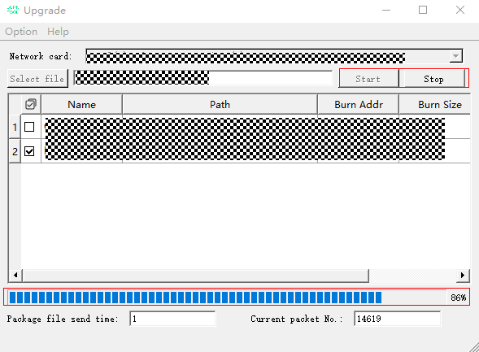

### 停止升级<a name="ZH-CN_TOPIC_0000001907158317"></a>

**操作步骤<a name="zh-cn_topic_0281207485_ol91416525475"></a>**

1.  进行“开始升级”操作。
2.  升级过程中点击“Stop”按钮，停止升级。“start”和“Stop”按钮状态如[图1](#fig19436152810492)所示。

    **图 1**  按钮状态示意图<a name="fig19436152810492"></a>  
    

## OTA升级<a name="ZH-CN_TOPIC_0000001966789053"></a>

**操作步骤<a name="zh-cn_topic_0281207485_ol91416525475"></a>**

1.  参考“[选择Chip](#ZH-CN_TOPIC_0000001906927033)”章节选择带SLE后缀的芯片，如“XXX-SLE”。
2.  选择设备信息如[图1](#fig11818313201417)所示。

    **图 1**  选择设备信息示意图<a name="fig11818313201417"></a>  
    

3.  点击“Open”按钮，打开所选设备，并将扫描到的对端设备地址加载到Address中。
4.  选择想要升级的地址，点击“Connect”连接设备，打印出"Device connected successfully"代表连接成功，如[图2](#fig388834812306)所示。

    **图 2**  连接成功示意图<a name="fig388834812306"></a>  
    

5.  选择所升级的文件，如[图3](#fig768310475299)所示。

    **图 3**  选择文件示意图<a name="fig768310475299"></a>  
    

6.  点击“Start”开始升级，“Start”按钮变更为“Stop”按钮（点击“Stop”按钮可停止升级），升级成功打印“Upgrade successfully”。如[图4](#fig114879911381)所示

    **图 4**  升级成功示意图<a name="fig114879911381"></a>  
    

## TFTP烧写<a name="ZH-CN_TOPIC_0000002043190224"></a>

-   **[LUOFU、EMEI、XILING和TG0](#ZH-CN_TOPIC_0000002043201556)**  

-   **[TG1和TG2](#ZH-CN_TOPIC_0000002079200929)**  

### LUOFU、EMEI、XILING和TG0<a name="ZH-CN_TOPIC_0000002043201556"></a>

**操作步骤<a name="ol1013614161104"></a>**

1.  请参见“[选择Chip](#ZH-CN_TOPIC_0000001906927033)”章节选择正确的芯片。
2.  在BurnTool界面的COM处选择串口，如[图1](#fig196045434581_tftp_luofu)所示。

    **图 1**  选择串口<a name="fig196045434581_tftp_luofu"></a>  
    

3.  选择使用的PC的IP地址，如[图2](#fig16764515122)所示。

    **图 2**  选择PC的IP地址<a name="fig16764515122"></a>  
    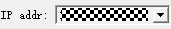

4.  单击“IP Config”按钮配置板端IP信息，配置项如[图3](#fig24934717151)所示。

    **图 3**  板端IP配置项<a name="fig24934717151"></a>  
    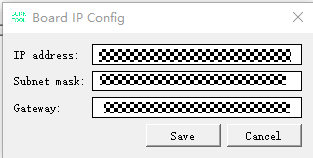

5.  单击“Erase config”配置擦除项，不同的产品有不同的配置项，如[图4](#fig705031818)所示。

    **图 4**  擦除项配置<a name="fig705031818"></a>  
    

6.  选择是否勾选Empty flash，勾选为裸烧模式，去勾选为非裸烧模式。
7.  在BurnTool界面中单击“...”按钮，选择产品编译生成的固件包，并单击“打开”，如[图5](#fig17333101517194)所示。

    **图 5**  选择文件界面<a name="fig17333101517194"></a>  
    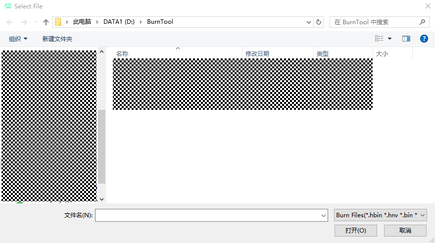

8.  在表格中选中需要烧写的文件，点击“Start”开始烧写（点击后有可能需要手动重启）。
9.  等待传输完成后结束烧写，烧写完成会出现“All images burn successfully”。烧写完成效果如[图6](#fig14610485390_tftp_luofu)所示。

    **图 6**  烧写完成示意图<a name="fig14610485390_tftp_luofu"></a>  
    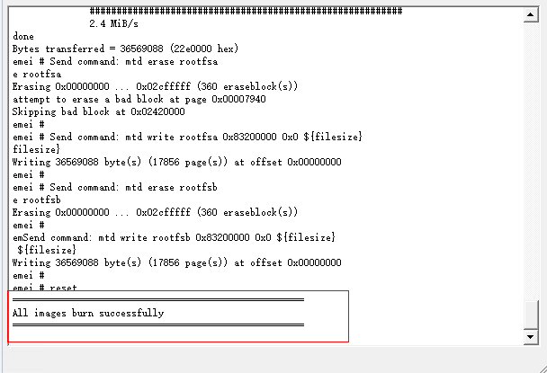

### TG1和TG2<a name="ZH-CN_TOPIC_0000002079200929"></a>

**操作步骤<a name="ol1013614161104"></a>**

1.  请参见“[选择Chip](#ZH-CN_TOPIC_0000001906927033)”章节选择正确的芯片。
2.  选择bootloader烧写方式，选择Serial执行[4](#li660734311584)，选择USB执行[3](#li18572813340)。

    **图 1**  bootloader烧写方式<a name="fig1345683817319"></a>  
    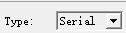

3.  <a name="li18572813340"></a>填写设备的Vid和Pid，如[图2](#fig1357012115341)所示。

    **图 2**  Vid、Pid填写区<a name="fig1357012115341"></a>  
    

4.  <a name="li660734311584"></a>在BurnTool界面的com处选择串口，如[图3](#fig196045434581_tftp_tg1_tg2)所示。

    **图 3**  选择串口<a name="fig196045434581_tftp_tg1_tg2"></a>  
    

5.  选择使用的PC的IP地址，如[图4](#fig16764515122_tg1_tg2)所示。

    **图 4**  选择PC的IP地址<a name="fig16764515122_tg1_tg2"></a>  
    

6.  单击“IP Config”按钮配置板端IP信息，配置项如[图5](#fig24934717151_tg1_tg2)所示。

    **图 5**  板端IP配置项<a name="fig24934717151_tg1_tg2"></a>  
    

7.  单击“Erase config”配置擦除项，不同的产品有不同的配置项，如[图6](#fig705031818_tg1_tg2)所示。

    **图 6**  擦除项配置<a name="fig705031818_tg1_tg2"></a>  
    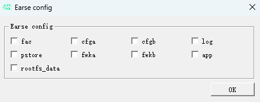

8.  选择是否勾选Empty flash。勾选为裸烧模式，去勾选为非裸烧模式。
9.  在BurnTool界面中单击“...”按钮，选择产品编译生成的固件包，并单击“打开”。如[图7](#fig17333101517194_tg1_tg2)所示。

    **图 7**  选择文件界面<a name="fig17333101517194_tg1_tg2"></a>  
    

10. 在表格中选中需要烧写的文件，点击“Start”开始烧写（点击后有可能需要手动重启）。
11. 等待传输完成后结束烧写，烧写完成会出现“All images burn successfully”，烧写完成效果如[图8](#fig14610485390_tftp_tg1_tg2)所示。

    **图 8**  烧写完成示意图<a name="fig14610485390_tftp_tg1_tg2"></a>  
    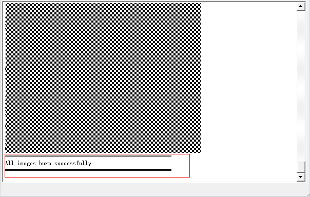

## MCU<a name="ZH-CN_TOPIC_0000002360460356"></a>

-   **[烧写](#ZH-CN_TOPIC_0000002079189581)**  

-   **[擦除](#ZH-CN_TOPIC_0000002394100193)**  

-   **[全部擦除](#ZH-CN_TOPIC_0000002394104317)**  

-   **[导出](#ZH-CN_TOPIC_0000002394140317)**  

### 烧写<a name="ZH-CN_TOPIC_0000002079189581"></a>

**操作步骤<a name="zh-cn_topic_0279549073_ol85749249353"></a>**

1.  请参见“[选择Chip](#ZH-CN_TOPIC_0000001906927033)”章节选择MCU。
2.  选择芯片、传输方式。
3.  在参数区设置对应传输方式的参数，点击“Connect”进行连接（连接时除SWD和JTAG方式外都需要重启单板，需要重启单板时会给出如[图1](#fig57224755914)所示的提示）。

    **图 1**  需重启单板提示<a name="fig57224755914"></a>  
    

4.  设置是否勾选加载后回读校验和加载后直接运行。
5.  单击“Select file”按钮，选择各产品编译生成的固件包，并单击“OK”。
6.  单击“Start burn”按钮开始烧写。
7.  等待传输完成后结束烧写，烧写完成会出现“All images burn successfully”。烧写完成效果如[图2](#fig133036255014)所示。

    **图 2**  烧写完成示意图<a name="fig133036255014"></a>  
    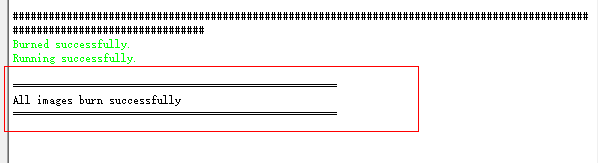

### 擦除<a name="ZH-CN_TOPIC_0000002394100193"></a>

**操作步骤<a name="zh-cn_topic_0279549073_ol85749249353"></a>**

1.  请参见“[选择Chip](#ZH-CN_TOPIC_0000001906927033)”章节选择MCU。
2.  选择芯片、传输方式。
3.  在参数区设置对应传输方式的参数，点击“Connect”进行连接（连接时除SWD和JTAG方式外都需要重启单板，需要重启单板时会给出如[图1](#fig57224755914_mcu_erase)所示的提示）。

    **图 1**  需重启单板提示<a name="fig57224755914_mcu_erase"></a>  
    

4.  设置擦除的起始位置和大小。

    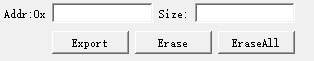

5.  单击“Erase”按钮开始擦除。
6.  等待擦除完成会出现“Erase successfully”。擦除完成效果如[图2](#fig133036255014_mcu_erase)所示。

    **图 2**  烧写完成示意图<a name="fig133036255014_mcu_erase"></a>  
    

### 全部擦除<a name="ZH-CN_TOPIC_0000002394104317"></a>

**操作步骤<a name="zh-cn_topic_0279549073_ol85749249353"></a>**

1.  请参见“[选择Chip](#ZH-CN_TOPIC_0000001906927033)”章节选择MCU。
2.  选择芯片、传输方式。
3.  在参数区设置对应传输方式的参数，点击“Connect”进行连接（连接时除SWD和JTAG方式外都需要重启单板，需要重启单板时会给出如[图1](#fig57224755914_mcu_erase_all)所示的提示）。

    **图 1**  需重启单板提示<a name="fig57224755914_mcu_erase_all"></a>  
    

4.  单击“EraseAll”按钮开始全部擦除。
5.  等待擦除完成会出现“Erase successfully”。擦除完成效果如[图2](#fig133036255014_mcu_erase_all)所示。

    **图 2**  烧写完成示意图<a name="fig133036255014_mcu_erase_all"></a>  
    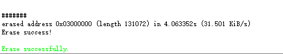

### 导出<a name="ZH-CN_TOPIC_0000002394140317"></a>

**操作步骤<a name="zh-cn_topic_0279549073_ol85749249353"></a>**

1.  请参见“[选择Chip](#ZH-CN_TOPIC_0000001906927033)”章节选择MCU。
2.  选择芯片、传输方式。
3.  在参数区设置对应传输方式的参数，点击“Connect”进行连接（连接时除SWD和JTAG方式外都需要重启单板，需要重启单板时会给出如[图1](#fig57224755914_mcu_export)所示的提示）。

    **图 1**  需重启单板提示<a name="fig57224755914_mcu_export"></a>  
    

4.  单击“Select file”按钮，填写导出文件的保存位置，并设置导出的起始位置和大小。

    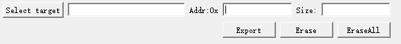

5.  单击“Export”按钮开始导出。
6.  等待传输完成后结束烧写，烧写完成会出现“Read successfully”。烧写完成效果如[图2](#fig133036255014_mcu_export)所示。

    **图 2**  烧写完成示意图<a name="fig133036255014_mcu_export"></a>  
    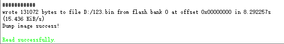

## 全部擦除<a name="ZH-CN_TOPIC_0000002335766225"></a>

**操作步骤<a name="ol145234189455"></a>**

1.  不要勾选“Auto burn“和“Auto disconnect”，如[图1](#fig1592535424516)所示，按照“[串口烧写](#ZH-CN_TOPIC_0000001860836886)”烧写完成loader文件。

    **图 1**  去勾选Auto burn和Auto disconnect<a name="fig1592535424516"></a>  
    

2.  点击“Erase all”开始擦除，如[图2](#fig44101741484)所示。

    **图 2**  Erase all按钮<a name="fig44101741484"></a>  
    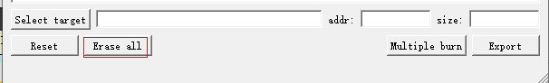

3.  等待擦除成功。

## fwpkg生成及拆分<a name="ZH-CN_TOPIC_0000002328102306"></a>

**操作步骤<a name="ol1662419318499"></a>**

1.  点击导入fwpkg文件。

    **图 1**  导入fwpkg文件<a name="fig104990302536"></a>  
    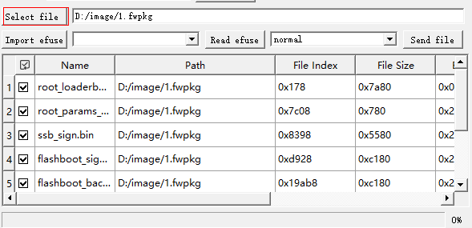

2.  编辑分区数据，Type可以直接编辑，点击+，-可以添加和删除分区，双击分区所在行的path列，可以更新该分区的bin文件，

    之后可以编辑该行的烧写地址和烧写长度。

    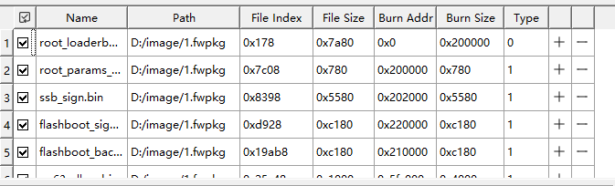

3.  右击分区表，会弹出一个菜单栏，点击“Create new file”,可以生成编辑后的新fwpkg文件。点击"Create new file”，

    可以保存每个分区的bin文件到选择的目录下，没有显示在界面上的分区文件也会保存。

    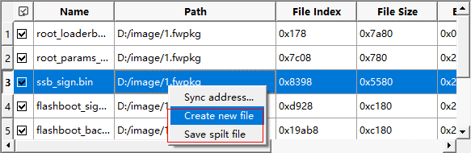

## Reset说明<a name="ZH-CN_TOPIC_0000002504111393"></a>

在AT口和烧录口相同，并且板端处于非空片状态，可以执行AT命令时，可以通过点击reset按钮来对单板进行复位打断，用户可以修改config\_all\_chip\_type.ini配置文件用来修改reset指令。具体步骤如下：

**操作步骤<a name="ol910735641218"></a>**

1.  打开安装目录下的configure文件夹找到onfig\_all\_chip\_type.ini
2.  找到对应芯片的配置选项，修改AT\_RESET对应的值。例如：

    ```
    CONFIG_ID28=29
    CHIP_NAME28=Hi3372
    BAUND_RATE28=115200
    ATTRIBUTES28=0
    AT_RESET28=at+reset\r\n
    ```

3.  烧写时可点击Reset按钮用来执行上述步骤中的Reset指令，用来重启打断。Reset按钮如[图1](#fig48944237464)所示。

    **图 1**  Reset按钮<a name="fig48944237464"></a>  
    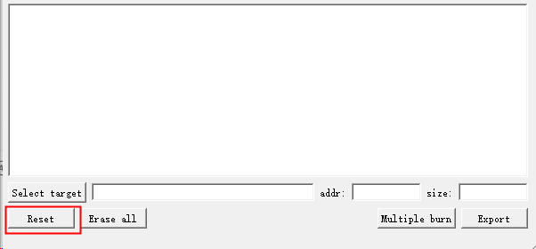

## 比较全部文件功能<a name="ZH-CN_TOPIC_0000002524412510"></a>

该功能用于比较选择的镜像和单板的flash上镜像是否相同，当前只有ws63芯片支持。

**操作步骤<a name="ol16712210172312"></a>**

1.  选择镜像，然后勾选需要比较的文件。

    **图 1**  配置镜像<a name="fig19978152815272"></a>  
    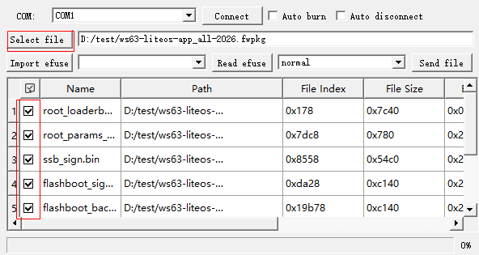

2.  点击Compare All开始比较。

    **图 2**  Compare All按钮<a name="fig10636145422811"></a>  
    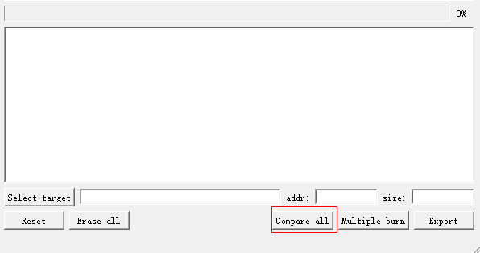

3.  打印结果，及上载文件存放路径

    **图 3**  打印结果<a name="fig9501628143316"></a>  
    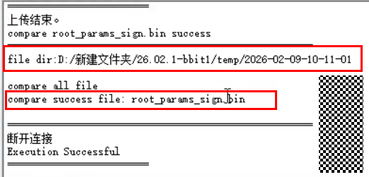

# FAQ<a name="ZH-CN_TOPIC_0000001207961979"></a>

-   **[工具未进入打断状态](#ZH-CN_TOPIC_0000001207563437)**  

-   **[如何获取符合格式的固件包](#ZH-CN_TOPIC_0000001207843445)**  

-   **[加载配置文件时出现错误提示](#ZH-CN_TOPIC_0000001162123484)**  

-   **[工厂烧写时随机串口无法进入doing状态](#ZH-CN_TOPIC_0000001207563435)**  

-   **[如何提升镜像烧录速度](#ZH-CN_TOPIC_0000001861324198)**  

-   **[一拖多烧写时反复烧写该如何解决](#ZH-CN_TOPIC_0000001907283793)**  

-   **[全擦功能异常](#ZH-CN_TOPIC_0000001907164113)**  

-   **[USB或SLE烧写时无法找到目标设备](#ZH-CN_TOPIC_0000002219655644)**  

-   **[如何使用BurnTool读取Flash](#ZH-CN_TOPIC_0000002335541389)**  

-   **[如何使用BurnTool进行固件全擦](#ZH-CN_TOPIC_0000002335501189)**  

-   **[工具错误码](#ZH-CN_TOPIC_0000002530643321)**  

## 工具未进入打断状态<a name="ZH-CN_TOPIC_0000001207563437"></a>

**问题描述<a name="zh-cn_topic_0279549084_section11476770"></a>**

单击连接、断电重启后，工具并没有进入打断状态。

**解决办法<a name="zh-cn_topic_0279549084_section36182073"></a>**

-   可能是串口选择错误或没有正常连接串口，请检查串口配置。
-   可能单板设置了1ms快速启动，需要在BurnTool“Setting”→“Burn interval”中选择2ms间隔。
-   可能使用win7系统产生部分兼容性问题，可切换至win10尝试。

## 如何获取符合格式的固件包<a name="ZH-CN_TOPIC_0000001207843445"></a>

**问题描述<a name="zh-cn_topic_0279549069_section11476770"></a>**

如何获取BurnTool可识别的固件包。

**解决办法<a name="zh-cn_topic_0279549069_section1639218138286"></a>**

请参见各产品关于编译或固件生成的文档。

## 加载配置文件时出现错误提示<a name="ZH-CN_TOPIC_0000001162123484"></a>

**问题描述<a name="zh-cn_topic_0000001163417487_section11476770"></a>**

在启动BurnTool后，如果同级目录或C盘BurnTool路径下有配置文件，则会提示“是否加载已存在的配置文件？”；如果选择加载配置文件且配置文件格式不正确，则会提示“文件格式错误，是否继续”。

**解决办法<a name="zh-cn_topic_0000001163417487_section1427474415433"></a>**

提示“文件格式错误，是否继续”表示当前的配置文件中有部分内容没有配置或配置值不符合预期，造成此问题的原因可能是由于手动修改过配置文件或当前版本没有主动保存过配置文件。此时可以选择不加载配置文件，全部重新手工配置并保存配置文件。

## 工厂烧写时随机串口无法进入doing状态<a name="ZH-CN_TOPIC_0000001207563435"></a>

**问题描述<a name="zh-cn_topic_0000001166752747_section11476770"></a>**

因串口驱动配合问题，在工厂烧写时，可能会出现随机串口无法进入工作（doing）状态的情况。

**解决办法<a name="zh-cn_topic_0000001166752747_section1427474415433"></a>**

在“Setting”→“Settings”中查看“Reopen Com Everytime”的勾选状态。

如果未勾选，则尝试勾选并重新开始工厂烧写；如果已勾选，则尝试取消勾选并重新开始工厂烧写。

## 如何提升镜像烧录速度<a name="ZH-CN_TOPIC_0000001861324198"></a>

**问题描述<a name="zh-cn_topic_0279549084_section11476770"></a>**

产线上烧录大镜像所需时间过长，导致生产成本增加。

**解决办法<a name="section669815717311"></a>**

**操作步骤<a name="ol942075355616"></a>**

1.  将烧写工具波特率设置为所能支持的最大值（目前单板所支持最大值为6M波特率，需串口小板支持6M及以上波特率）。
2.  将每包大小设置为20480。如[图1](#fig196168229)所示。

    **图 1**  烧写工具配置示意图<a name="fig196168229"></a>  
    

3.  按照“[手动烧写](#ZH-CN_TOPIC_0000001162123482)”章节步骤进行烧写即可。

## 一拖多烧写时反复烧写该如何解决<a name="ZH-CN_TOPIC_0000001907283793"></a>

**问题描述<a name="zh-cn_topic_0279549084_section11476770"></a>**

一拖多烧写时，每次烧写完成会重新开始烧写，具体表现为在没有进行手动复位的情况下，进度条达到100%后又从0%开始烧录。

**解决办法<a name="section1437042610496"></a>**

将设置中的“Reset after success”去勾选。

## 全擦功能异常<a name="ZH-CN_TOPIC_0000001907164113"></a>

**问题描述<a name="zh-cn_topic_0279549084_section11476770"></a>**

点击“Erase all”后，未擦除成功或单板死机或有其他异常打印。

**解决办法<a name="section1437042610496"></a>**

Sparta 1.1.10.600之前版本不支持全擦功能，单板需烧写到Sparta 1.1.10.600及之后版本再执行全擦。

## USB或SLE烧写时无法找到目标设备<a name="ZH-CN_TOPIC_0000002219655644"></a>

**问题描述<a name="zh-cn_topic_0279549084_section11476770"></a>**

在USB或SLE烧写时，设备下拉列表中找不到名为HH6666（名称是代码决定）的设备中usage page为0xffb2（usage page是代码决定）的设备，但设备管理器中能看到HH6666设备。

**解决办法<a name="section1437042610496"></a>**

设备管理器中是否有HH6666，如果有就右键点击卸载设备，并勾选删除驱动，然后点击确定。如果没有则检查连线。

## 如何使用BurnTool读取Flash<a name="ZH-CN_TOPIC_0000002335541389"></a>

**问题描述<a name="zh-cn_topic_0000002332655109_section15813561206"></a>**

如何使用BurnTool进行读取Flash。

**解决办法<a name="zh-cn_topic_0000002332655109_section153594371014"></a>**

**操作步骤<a name="zh-cn_topic_0000002332655109_ol1622325714446"></a>**

1.  BurnTool配置如下。

    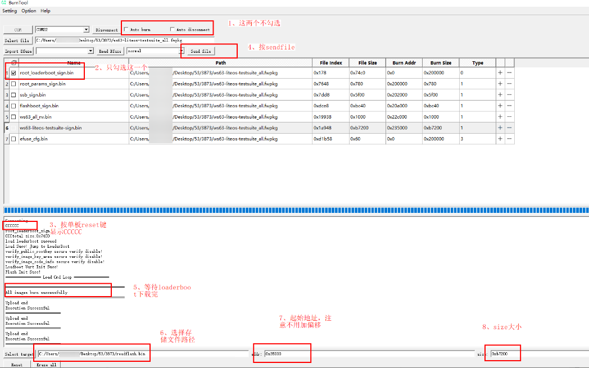

    **参数说明：**图片中第7步的地址，为从0开始的地址，我们代码中使用的地址是在该基础上加上了偏移0x200000。

**操作步骤<a name="zh-cn_topic_0000002332655109_ol16223257114413"></a>**

1.  开始读取Flash。

    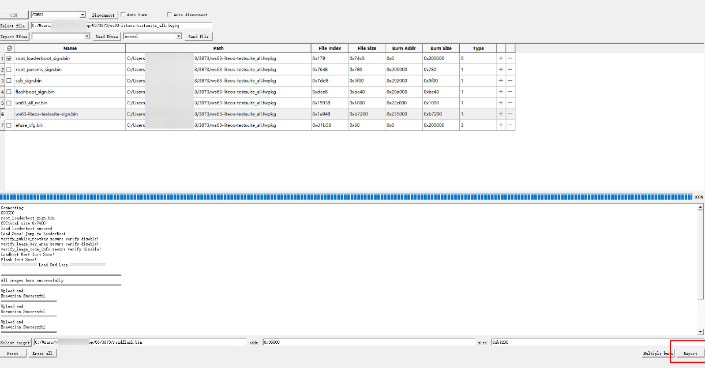

## 如何使用BurnTool进行固件全擦<a name="ZH-CN_TOPIC_0000002335501189"></a>

**问题描述<a name="zh-cn_topic_0000002298695732_section15813561206"></a>**

如何使用BurnTool进行固件全擦。

**解决方法<a name="zh-cn_topic_0000002298695732_section94671521818"></a>**

按照下图步骤依次操作即可。

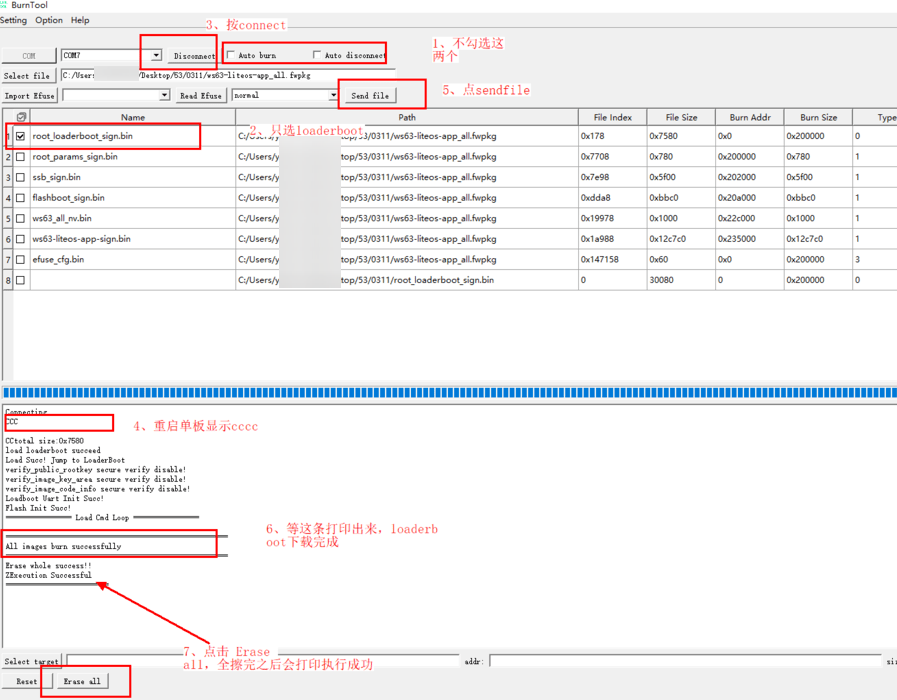

## 工具错误码<a name="ZH-CN_TOPIC_0000002530643321"></a>

命令行烧写结束后，若失败返回的错误码介绍如[表1](#table1923619111210_error_codes)所示。

**表 1**  命令行烧写失败返回错误码

<a name="table1923619111210_error_codes"></a>
<table><thead align="left"><tr id="row8232019141213"><th class="cellrowborder" valign="top" width="13.66%" id="mcps1.2.3.1.1"><p id="p12351913126"><a name="p12351913126"></a><a name="p12351913126"></a>错误码</p>
</th>
<th class="cellrowborder" valign="top" width="86.33999999999999%" id="mcps1.2.3.1.2"><p id="p9232199124"><a name="p9232199124"></a><a name="p9232199124"></a>错误信息</p>
</th>
</tr>
</thead>
<tbody><tr id="row1623119111212"><td class="cellrowborder" valign="top" width="13.66%" headers="mcps1.2.3.1.1 "><p id="p1723219201211"><a name="p1723219201211"></a><a name="p1723219201211"></a>1</p>
</td>
<td class="cellrowborder" valign="top" width="86.33999999999999%" headers="mcps1.2.3.1.2 "><p id="p1818943014619"><a name="p1818943014619"></a><a name="p1818943014619"></a>打断超时，可能是串口或没复位。</p>
</td>
</tr>
<tr id="row3237195120"><td class="cellrowborder" valign="top" width="13.66%" headers="mcps1.2.3.1.1 "><p id="p2023219131213"><a name="p2023219131213"></a><a name="p2023219131213"></a>4</p>
</td>
<td class="cellrowborder" valign="top" width="86.33999999999999%" headers="mcps1.2.3.1.2 "><p id="p17153174519450"><a name="p17153174519450"></a><a name="p17153174519450"></a>等待开始C超时。</p>
</td>
</tr>
<tr id="row1723121921215"><td class="cellrowborder" valign="top" width="13.66%" headers="mcps1.2.3.1.1 "><p id="p7232019151215"><a name="p7232019151215"></a><a name="p7232019151215"></a>5</p>
</td>
<td class="cellrowborder" valign="top" width="86.33999999999999%" headers="mcps1.2.3.1.2 "><p id="p19153145184516"><a name="p19153145184516"></a><a name="p19153145184516"></a>等待初始化ack超时。</p>
</td>
</tr>
<tr id="row1833714714476"><td class="cellrowborder" valign="top" width="13.66%" headers="mcps1.2.3.1.1 "><p id="p153371977475"><a name="p153371977475"></a><a name="p153371977475"></a>7</p>
</td>
<td class="cellrowborder" valign="top" width="86.33999999999999%" headers="mcps1.2.3.1.2 "><p id="p1533716710476"><a name="p1533716710476"></a><a name="p1533716710476"></a>等待结束报文C超时。</p>
</td>
</tr>
<tr id="row7914930144716"><td class="cellrowborder" valign="top" width="13.66%" headers="mcps1.2.3.1.1 "><p id="p189143306474"><a name="p189143306474"></a><a name="p189143306474"></a>8</p>
</td>
<td class="cellrowborder" valign="top" width="86.33999999999999%" headers="mcps1.2.3.1.2 "><p id="p11914330194718"><a name="p11914330194718"></a><a name="p11914330194718"></a>等待结束全0报文超时。</p>
</td>
</tr>
<tr id="row08115484711"><td class="cellrowborder" valign="top" width="13.66%" headers="mcps1.2.3.1.1 "><p id="p1081854184718"><a name="p1081854184718"></a><a name="p1081854184718"></a>15</p>
</td>
<td class="cellrowborder" valign="top" width="86.33999999999999%" headers="mcps1.2.3.1.2 "><p id="p1581454104717"><a name="p1581454104717"></a><a name="p1581454104717"></a>ack返回失败。</p>
</td>
</tr>
<tr id="row1865961011487"><td class="cellrowborder" valign="top" width="13.66%" headers="mcps1.2.3.1.1 "><p id="p11659171018488"><a name="p11659171018488"></a><a name="p11659171018488"></a>16</p>
</td>
<td class="cellrowborder" valign="top" width="86.33999999999999%" headers="mcps1.2.3.1.2 "><p id="p165991019481"><a name="p165991019481"></a><a name="p165991019481"></a>打开文件失败。</p>
</td>
</tr>
<tr id="row1060314229483"><td class="cellrowborder" valign="top" width="13.66%" headers="mcps1.2.3.1.1 "><p id="p116036224484"><a name="p116036224484"></a><a name="p116036224484"></a>17</p>
</td>
<td class="cellrowborder" valign="top" width="86.33999999999999%" headers="mcps1.2.3.1.2 "><p id="p9603182217481"><a name="p9603182217481"></a><a name="p9603182217481"></a>串口不存在或串口被占用。</p>
</td>
</tr>
<tr id="row1632555712504"><td class="cellrowborder" valign="top" width="13.66%" headers="mcps1.2.3.1.1 "><p id="p1932515711504"><a name="p1932515711504"></a><a name="p1932515711504"></a>0xfffffff0</p>
</td>
<td class="cellrowborder" valign="top" width="86.33999999999999%" headers="mcps1.2.3.1.2 "><p id="p15325205725018"><a name="p15325205725018"></a><a name="p15325205725018"></a>其他失败。</p>
</td>
</tr>
</tbody>
</table>

