# 插件指南

## 工具简介<a name="ZH-CN_TOPIC_0000002293219986"></a>

HiSpark Studio for VS Code插件面向智能设备开发者提供一站式集成开发环境。它为开发者提供代码编辑、编译、烧录和调试等功能，并支持C/C++语言，支持 Windows x86_64（Windows11/10）、Linux x86/aarch64（含 WSL，要求 Ubuntu 20.04 及以上版本）、macOS Apple Silicon 架构。该插件具有以下特点：

- 支持代码查找、代码高亮、代码自动补齐、代码输入提示、代码检查等，开发者可以轻松、高效编码。
- 支持单步调试和查看内存、变量、调用栈等调试信息。
- 支持自动检测各芯片/开发板依赖的工具链是否完备，并提供一键下载和安装缺失的工具链。

HiSpark Studio for VS Code插件主要分为以下6个功能区域（如图1所示）：

① WELCOME：提供欢迎页、使用指南、创建导入项目等选项。

② PROJECT EXPLORER：工程区文件展示区。

③ COMMANDS：提供新建工程、打开工程、清除、编译、烧录等功能按钮，并可控制状态栏中按钮的显隐。

④ 代码编辑区：提供代码的查看、编写、跳转、高亮等功能。

⑤ 输出控制台：提供操作日志的打印、调试命令的输入及命令行工具等功能。

⑥ 状态栏：提供常用功能按钮，包括新建工程、导入工程、工程配置、清除、编译、烧录等功能，并显示当前文件的编码格式、行数、列数等信息。

**图 1** 功能分区图<a name="fig19904573445"></a>
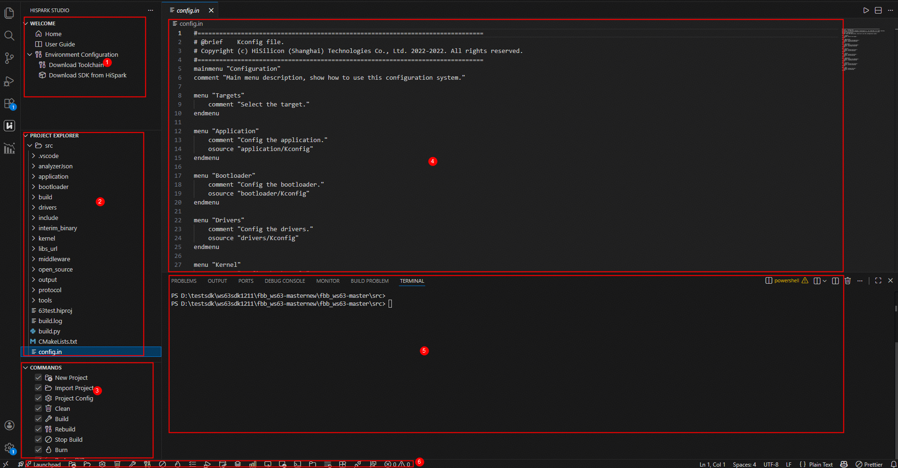

HiSpark Studio for VS Code插件当前支持的芯片和对应特性如表1所示。

**表 1** HiSpark Studio for VS Code插件支持的芯片及其特性（一）

<table>
<thead>
<tr>
<th>芯片系列</th>
<th>芯片名称</th>
<th>工程管理</th>
<th>编译运行</th>
<th>一键烧录</th>
<th>烧录配置</th>
<th>栈分析/镜像分析</th>
</tr>
</thead>
<tbody>
<tr>
<td rowspan="11"><strong>短距物联</strong></td>
<td style="background-color: #e6f7e6; color: #1a1a1a;">BS20</td>
<td>√</td>
<td>√</td>
<td>√</td>
<td>√</td>
<td>√</td>
</tr>
<tr>
<td>BS20C</td>
<td>√</td>
<td>√</td>
<td>√</td>
<td>√</td>
<td>√</td>
</tr>
<tr>
<td>BS21</td>
<td>√</td>
<td>√</td>
<td>√</td>
<td>√</td>
<td>√</td>
</tr>
<tr>
<td style="background-color: #e6f7e6; color: #1a1a1a;">BS21E</td>
<td>√</td>
<td>√</td>
<td>√</td>
<td>√</td>
<td>√</td>
</tr>
<tr>
<td style="background-color: #e6f7e6; color: #1a1a1a;">BS22</td>
<td>√</td>
<td>√</td>
<td>√</td>
<td>√</td>
<td>√</td>
</tr>
<tr>
<td>BS26</td>
<td>√</td>
<td>√</td>
<td>√</td>
<td>√</td>
<td>√</td>
</tr>
<tr>
<td>BS21A</td>
<td>√</td>
<td>√</td>
<td>√</td>
<td>√</td>
<td>√</td>
</tr>
<tr>
<td>BS25</td>
<td>√</td>
<td>√</td>
<td>√</td>
<td>√</td>
<td>√</td>
</tr>
<tr>
<td>BS27A</td>
<td>√</td>
<td>√</td>
<td>√</td>
<td>√</td>
<td>√</td>
</tr>
<tr>
<td>WS53</td>
<td>√</td>
<td>√</td>
<td>√</td>
<td>√</td>
<td>√</td>
</tr>
<tr>
<td style="background-color: #e6f7e6; color: #1a1a1a;">WS63</td>
<td>√</td>
<td>√</td>
<td>√</td>
<td>√</td>
<td>√</td>
</tr>
<tr>
<td rowspan="4"><strong>手机穿戴</strong></td>
<td>BRANDY</td>
<td>√</td>
<td>√</td>
<td>√</td>
<td>√</td>
<td>√</td>
</tr>
<tr>
<td>SOCMN2</td>
<td>√</td>
<td>√</td>
<td>√</td>
<td>√</td>
<td>√</td>
</tr>
<tr>
<td>SW21</td>
<td>√</td>
<td>√</td>
<td>√</td>
<td>√</td>
<td>√</td>
</tr>
<tr>
<td style="background-color: #e6f7e6; color: #1a1a1a;">3322</td>
<td>√</td>
<td>√</td>
<td>√</td>
<td>√</td>
<td>√</td>
</tr>
<tr>
<td rowspan="6"><strong>广域物联</strong></td>
<td>NB17</td>
<td>√</td>
<td>√</td>
<td>√</td>
<td>√</td>
<td>√</td>
</tr>
<tr>
<td>NB17E</td>
<td>√</td>
<td>√</td>
<td>√</td>
<td>√</td>
<td>√</td>
</tr>
<tr>
<td>NB18</td>
<td>√</td>
<td>√</td>
<td>√</td>
<td>√</td>
<td>√</td>
</tr>
<tr>
<td>Hi2113</td>
<td>√</td>
<td>√</td>
<td>√</td>
<td>√</td>
<td>√</td>
</tr>
<tr>
<td>Hi2131</td>
<td>√</td>
<td>√</td>
<td>√</td>
<td>√</td>
<td>√</td>
</tr>
<tr>
<td>Hi2131C</td>
<td>√</td>
<td>√</td>
<td>√</td>
<td>√</td>
<td>√</td>
</tr>
</tbody>
</table>

**表 1** HiSpark Studio for VS Code插件支持的芯片及其特性（二）

<table>
<thead>
<tr>
<th>芯片系列</th>
<th>芯片名称</th>
<th>工程调试</th>
<th>串口控制台</th>
<th>Kconfig</th>
<th>CodeSize</th>
<th>GUI</th>
<th>远程编译</th>
</tr>
</thead>
<tbody>
<tr>
<td rowspan="11"><strong>短距物联</strong></td>
<td style="background-color: #e6f7e6; color: #1a1a1a;">BS20</td>
<td>√</td>
<td>√</td>
<td>√</td>
<td>√</td>
<td>×</td>
<td>√</td>
</tr>
<tr>
<td>BS20C</td>
<td>√</td>
<td>√</td>
<td>√</td>
<td>√</td>
<td>×</td>
<td>√</td>
</tr>
<tr>
<td>BS21</td>
<td>√</td>
<td>√</td>
<td>√</td>
<td>√</td>
<td>×</td>
<td>√</td>
</tr>
<tr>
<td style="background-color: #e6f7e6; color: #1a1a1a;">BS21E</td>
<td>√</td>
<td>√</td>
<td>√</td>
<td>√</td>
<td>×</td>
<td>√</td>
</tr>
<tr>
<td style="background-color: #e6f7e6; color: #1a1a1a;">BS22</td>
<td>√</td>
<td>√</td>
<td>√</td>
<td>√</td>
<td>×</td>
<td>√</td>
</tr>
<tr>
<td>BS26</td>
<td>√</td>
<td>√</td>
<td>√</td>
<td>√</td>
<td>×</td>
<td>√</td>
</tr>
<tr>
<td>BS21A</td>
<td>√</td>
<td>√</td>
<td>√</td>
<td>√</td>
<td>×</td>
<td>√</td>
</tr>
<tr>
<td>BS25</td>
<td>√</td>
<td>√</td>
<td>√</td>
<td>√</td>
<td>×</td>
<td>√</td>
</tr>
<tr>
<td>BS27A</td>
<td>×</td>
<td>×</td>
<td>×</td>
<td>×</td>
<td>×</td>
<td>√</td>
</tr>
<tr>
<td>WS53</td>
<td>√</td>
<td>√</td>
<td>√</td>
<td>√</td>
<td>×</td>
<td>√</td>
</tr>
<tr>
<td style="background-color: #e6f7e6; color: #1a1a1a;">WS63</td>
<td>√</td>
<td>√</td>
<td>√</td>
<td>√</td>
<td>×</td>
<td>√</td>
</tr>
<tr>
<td rowspan="4"><strong>手机穿戴</strong></td>
<td>BRANDY</td>
<td>√</td>
<td>√</td>
<td>×</td>
<td>√</td>
<td>√</td>
<td>√</td>
</tr>
<tr>
<td>SOCMN2</td>
<td>√</td>
<td>√</td>
<td>×</td>
<td>√</td>
<td>×</td>
<td>√</td>
</tr>
<tr>
<td>SW21</td>
<td>√</td>
<td>√</td>
<td>×</td>
<td>×</td>
<td>×</td>
<td>√</td>
</tr>
<tr>
<td style="background-color: #e6f7e6; color: #1a1a1a;">3322</td>
<td>√</td>
<td>√</td>
<td>×</td>
<td>×</td>
<td>√</td>
<td>√</td>
</tr>
<tr>
<td rowspan="6"><strong>广域物联</strong></td>
<td>NB17</td>
<td>√</td>
<td>√</td>
<td>×</td>
<td>×</td>
<td>×</td>
<td>√</td>
</tr>
<tr>
<td>NB17E</td>
<td>√</td>
<td>√</td>
<td>×</td>
<td>×</td>
<td>×</td>
<td>√</td>
</tr>
<tr>
<td>NB18</td>
<td>√</td>
<td>√</td>
<td>×</td>
<td>×</td>
<td>×</td>
<td>√</td>
</tr>
<tr>
<td>Hi2113</td>
<td>√</td>
<td>√</td>
<td>×</td>
<td>×</td>
<td>×</td>
<td>√</td>
</tr>
<tr>
<td>Hi2131</td>
<td>√</td>
<td>√</td>
<td>√</td>
<td>√</td>
<td>×</td>
<td>√</td>
</tr>
<tr>
<td>Hi2131C</td>
<td>√</td>
<td>√</td>
<td>√</td>
<td>√</td>
<td>×</td>
<td>√</td>
</tr>
</tbody>
</table>

>  **说明：**
>
> - HiSpark Studio for VS Code所支持的芯片中，WS63、WS53、BS20、BS21E、BS22以及3322中的HiDiTing的SDK已经开放至gitcode社区，可通过“SDK下载”章节获取详细信息。
> - 芯片系列中，"短距物联"、"手机穿戴"、"广域物联"统一属于FBB系列，文档中FBB系列芯片指代这三个芯片系列。
> - [HiSpark Studio for VS Code用户指南](https://docs.hisilicon.com/repos/vscode-hispark-studio/zh-CN/main/HiSparkStudioforVSCodeUserGuide/index.html)
> - [海思官方网站](https://www.hisilicon.com/)
> - [海思生态论坛](https://developers.hisilicon.com/forum/0101108112079179002/)
> - [扩展插件市场](https://marketplace.ide.huaweicloud.com/)
> - [HiSpark 开发文档](https://docs.hisilicon.com/)
> - 3322包含3322和HiDiTing芯片。
> - Windows、Linux、MacOS 环境下都支持主页、新建工程、编译、栈/镜像分析功能、系统配置、命令行工具、高阶分析、烧录、下载管理、监视器、远程开发工具、调试功能。

## 开发环境搭建<a name="ZH-CN_TOPIC_0000002327179601"></a>

- **概述**
- **安装要求**
- **安装HiSpark Studio for VS Code插件**
- **工具链toolchain配置**
- **SDK下载**
- **MinGW安装**
- **bash环境准备**
- **CONFIG_PUBLIC_OPTION_IN_FILES宏开启**

### 概述<a name="ZH-CN_TOPIC_0000002293379654"></a>

当前版本支持 Windows x86_64（Windows 10/11）、Linux x86/aarch64（含 WSL，要求 Ubuntu 20.04 及以上版本）、macOS Apple Silicon 架构，本章节主要介绍 Windows 11 系统上的开发环境搭建，**其他操作系统环境可参考本节步骤进行配置**。

### 安装要求<a name="ZH-CN_TOPIC_0000002327219377"></a>

- 操作系统要求：Windows：x86_64 架构，Windows 11/10 64 位；Linux/WSL：x86/aarch64 架构，Ubuntu 20.04 及以上版本；macOS：Apple Silicon 架构。
- VS Code版本要求：1.85.0及以上。
- 硬盘要求：至少有900MB的硬盘空间来安装HiSpark Studio for VS Code插件。
- 内存要求：HiSpark Studio for VS Code插件最低要求为1GB RAM，建议至少有4GB RAM来安装运行HiSpark Studio for VS Code插件。
- CPU：HiSpark Studio for VS Code插件最低要求为1.6GHz或者更高的处理器。
- 运行空间：建议至少保留1GB可用空间。

### 安装HiSpark Studio for VS Code插件<a name="ZH-CN_TOPIC_0000002293219990"></a>

>  **说明：**
> 若之前已经安装过DevEco相关的插件，请手动禁用或者卸载所有与DevEco相关的插件，否则会与HiSpark Studio for VS Code插件功能冲突。
> WSL 环境下请先连接到远程环境，再安装HiSpark Studio for VS Code插件。

1. 打开VS Code插件市场，在搜索框中搜索HiSpark Studio。

   **图 1** VS Code插件市场搜索框<a name="fig155444514303"></a>
   

2. 在搜索结果中选择HiSpark Studio for VS Code，点击安装即可。如果不需要安装最新版本，可以在扩展页面点击“齿轮”按钮弹出的“安装特定版本”，或者在安装插件后的扩展页面中点击“卸载”下拉框中的“安装特定版本”功能，安装所需插件的以往版本。

   **图 2** 安装插件以往版本<a name="fig163656101744"></a>
   

   

### 工具链toolchain配置<a name="ZH-CN_TOPIC_0000002337256433"></a>

HiSpark Studio for VS Code插件在对工程进行编译等操作时，需要依赖工具链、Python以及pip.pyz等环境。可以使用插件中的Download Toolchain功能进行工具链等的自动下载和安装。

**图 1** Download Toolchain功能<a name="fig4608724245"></a>
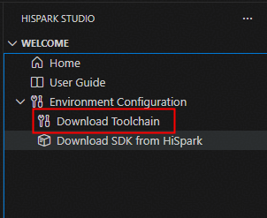

点击Download Toolchain功能后，会弹出一个文件夹选择框，用于选择工具链的下载和安装位置。

**图 2** 工具链保存位置选择<a name="fig76821526434"></a>
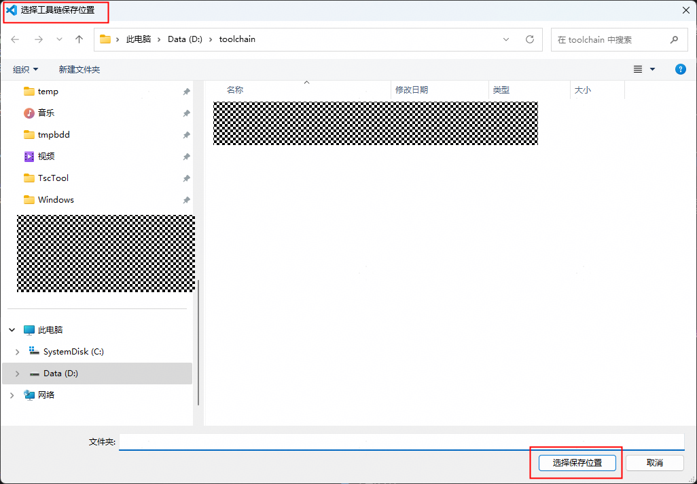

>  **须知：**
>
> - 首次选择文件夹进行工具链的配置时，为避免影响该文件夹内已有文件，建议选择一个空文件夹，用于下载和配置工具链。
> - Linux 环境下，工具链安装位置建议选择“home/用户/xxx”目录下。
> - MacOS 环境下，工具链安装位置建议选择“Users/用户/xxx”目录下。

文件夹选择路径不能包含中文或者空格，否则会有提示框弹出，此时选择“再次选择文件夹路径”会重新进入到工具链保存位置选择界面，选择“取消”则会退出工具链的选择安装。

**图 3** 文件夹路径选择中文或者空格后的提示弹窗<a name="fig162591729204619"></a>


选择完文件夹路径后，会依次下载Python 3.11.4、pip.pyz、pip.pyz的依赖（wheel、setuptools、cmake、kconfiglib、pycparser、pillow、numpy、opencv\-python、windows\-curses、ffmpeg\-python、pyelftools、openpyxl、pandas以及tkinter-embed），以及编译所需的tools工具。如果本地没有安装git，即命令提示符（cmd）中输入“git --version”时没有显示对应版本，系统会同时下载git安装包。下载过程VS Code右下角通知栏会有对应的工具下载提示以及进度展示。compiler由于文件比较大，下载时间较长，请耐心等待。

**图 4** Toolchain下载进度展示（部分）<a name="fig13993195610574"></a>
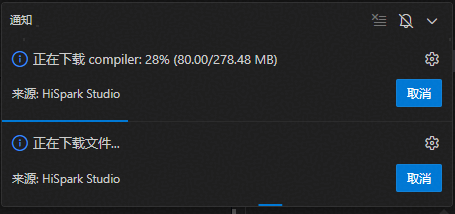

下载结束后，具体的下载内容保存在选择目录的downloads目录下，以选择路径为“D:\\toolchain”为例，工具链下载目录如图5所示。如果下载了git安装包，会在downloads目录下生成一个“Git.tar.gz”压缩包。

**图 5** Toolchain下载目录<a name="fig1964666125817"></a>
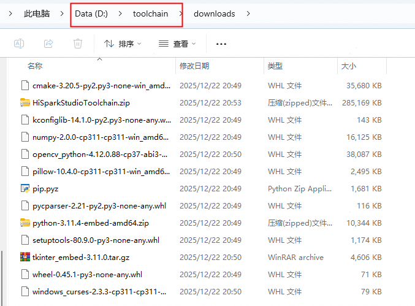

Python 3.11.4安装好后，会对pip.pyz的依赖进行安装，并对编译工具链进行解压，右下角会有对应的通知弹框提示，全部安装完成会提示环境准备完成。

**图 6** python3.11.4安装完成后的pip.pyz依赖及工具链的解压提示<a name="fig7778922205811"></a>
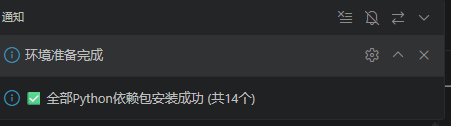

在环境准备中，会将文件夹下载路径如“D:\\toolchain\\downloads\\HiSparkStudioToolchain.zip”的这个zip压缩包解压到与downloads目录同级的tools目录（如“D:\\toolchain\\tools”中）。如果下载了git安装包，tools目录下会存在一个Git文件夹。

**图 7** 编译工具链解压结果<a name="fig136041725175413"></a>
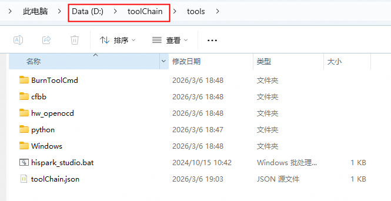

Python环境可以通过在tools目录下的python目录如“D:\\toolchain\\tools\\python”路径下打开cmd（命令提示符）窗口中进行验证。执行“.\\python.exe --version”输出结果为‘Python 3.11.4’，以及执行“python.exe ..\\..\\downloads\\pip.pyz list”命令输出结果显示有wheel、setuptools、cmake、kconfiglib、pycparser、pillow、numpy、opencv\-python、windows\-curses、ffmpeg\-python、pyelftools、openpyxl、pandas以及tkinter-embed这些pip.pyz的依赖及其对应版本，则说明Python环境配置正确。

**图 8** python环境验证<a name="fig1757924515812"></a>


工具链下载完成，环境配置完成后，会自动在用户环境变量中添加一个变量名为“HISPARK_TOOL_PATH”，变量值为选择的工具链存放位置如“D:\\toolchain”的环境变量，便于插件获取工具链的路径。

**图 9** 为工具链添加用户环境变量<a name="fig94491142417"></a>
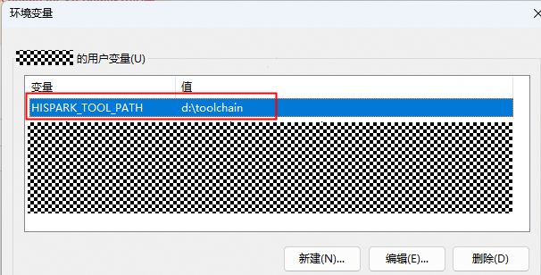

>  **说明：**
> **手动配置toolchain环境：**
> 如果由于环境或其他原因导致自动配置toolchain环境失败，用户也可以手动进行配置，首先创建一个空文件夹用于存放下载的工具链，如“D:\\toolchain”，并在该路径下创建两个文件夹downloads和tools分别用于存放下载的文件以及安装的工具链：
>
> - python下载链接：[python](https://mirrors.huaweicloud.com/python/3.11.4/python-3.11.4-embed-amd64.zip)，将该文件下载到downloads目录下（如“D:\\toolchain\\downloads”），并解压到tools目录下（如“D:\\toolchain\\tools”），将解压后文件命名为“python”。
>   
> - 下载“pip.pyz”文件至downloads目录下（如“D:\\toolchain\\downloads”），并将下载后的“pip.pyz”文件复制到tools\\python目录下（如“D:\\toolchain\\tools\\python”）。下载链接：[pip.pyz](https://hispark-obs.obs.cn-east-3.myhuaweicloud.com/pip.pyz)
> - 修改..\\tools\\python\\python311.\_pth文件的内容，删除“\#import site”前的\#号。
>   
> - pip.pyz依赖准备需要下载对应依赖的whl文件到downloads目录（如“D:\\toolchain\\downloads”）下，并复制到tools\\python目录下（如“D:\\toolchain\\tools\\python”），并在“D:\\toolchain\\tools\\python”目录下打开cmd执行“.\\python.exe pip.pyz install xx.whl”命令，如下载cmake的whl文件为“cmake-3.20.5-py2.py3-none-win_amd64.whl”，则在“D:\\toolchain\\tools\\python”目录下打开cmd执行“.\\python.exe pip.pyz install cmake-3.20.5-py2.py3-none-win_amd64.whl”即可。各依赖的whl文件下载链接如下：
>   [wheel](https://mirrors.cloud.tencent.com/pypi/packages/0b/2c/87f3254fd8ffd29e4c02732eee68a83a1d3c346ae39bc6822dcbcb697f2b/wheel-0.45.1-py3-none-any.whl)、[setuptools](https://mirrors.cloud.tencent.com/pypi/packages/a3/dc/17031897dae0efacfea57dfd3a82fdd2a2aeb58e0ff71b77b87e44edc772/setuptools-80.9.0-py3-none-any.whl)、[cmake](https://mirrors.cloud.tencent.com/pypi/packages/65/7f/80cf681cd376834b442af8af48e6f17b4197d20b7255aa2f76d8d93a9e44/cmake-3.20.5-py2.py3-none-win_amd64.whl)、[kconfiglib](https://mirrors.cloud.tencent.com/pypi/packages/8a/f1/d98a89231e779b079b977590efcc31249d959c8f1d4b5858cad69695ff9c/kconfiglib-14.1.0-py2.py3-none-any.whl)、[pycparser](https://mirrors.cloud.tencent.com/pypi/packages/62/d5/5f610ebe421e85889f2e55e33b7f9a6795bd982198517d912eb1c76e1a53/pycparser-2.21-py2.py3-none-any.whl)、[pillow](https://mirrors.cloud.tencent.com/pypi/packages/c1/d0/5866318eec2b801cdb8c82abf190c8343d8a1cd8bf5a0c17444a6f268291/pillow-10.4.0-cp311-cp311-win_amd64.whl)、[numpy](https://mirrors.cloud.tencent.com/pypi/packages/9b/0f/022ca4783b6e6239a53b988a4d315d67f9ae7126227fb2255054a558bd72/numpy-2.0.0-cp311-cp311-win_amd64.whl)、[opencv\-python](https://mirrors.cloud.tencent.com/pypi/packages/fa/80/eb88edc2e2b11cd2dd2e56f1c80b5784d11d6e6b7f04a1145df64df40065/opencv_python-4.12.0.88-cp37-abi3-win_amd64.whl)、[windows\-curses](https://mirrors.cloud.tencent.com/pypi/packages/18/1b/e06eb41dad1c74f0d3124218084f258f73a5e76c67112da0ba174162670f/windows_curses-2.3.3-cp311-cp311-win_amd64.whl)、[ffmpeg\-python](https://mirrors.cloud.tencent.com/pypi/packages/d7/0c/56be52741f75bad4dc6555991fabd2e07b432d333da82c11ad701123888a/ffmpeg_python-0.2.0-py3-none-any.whl)、[pyelftools](https://mirrors.cloud.tencent.com/pypi/packages/af/43/700932c4f0638c3421177144a2e86448c0d75dbaee2c7936bda3f9fd0878/pyelftools-0.32-py3-none-any.whl)、[openpyxl](https://mirrors.cloud.tencent.com/pypi/packages/c0/da/977ded879c29cbd04de313843e76868e6e13408a94ed6b987245dc7c8506/openpyxl-3.1.5-py2.py3-none-any.whl)、[pandas](https://mirrors.cloud.tencent.com/pypi/packages/44/a0/97a6339859d4acb2536efb24feb6708e82f7d33b2ed7e036f2983fcced82/pandas-3.0.2-cp311-cp311-win_amd64.whl)
> - 下载tkinter压缩包到downloads目录下（如“D:\\toolchain\\downloads”），并复制到“tools\\python”目录下（如“D:\\toolchain\\tools\\python”），并在“D:\\toolchain\\tools\\python”目录下打开cmd执行“.\\python.exe pip.pyz install --target .\\ tkinter_embed-3.11.0.tar.gz”命令。
>   下载链接：[tkinter压缩包](https://mirrors.cloud.tencent.com/pypi/packages/a2/b5/01fa4f6b1b78b01c1602d8e6e28879dcbef2d399d934f28d3324c1114552/tkinter_embed-3.11.0.tar.gz)
> - 新建“toolChain.json”文件到tools目录下（如“D:\\toolchain\\tools”），并添加python路径如“d:\\\\toolchain\\\\tools\\\\python”内容至“toolChain.json”中。
>
> ```
> {
>     "pythonDir": "d:\\toolchain\\tools\\python"
> }
> ```
>
> 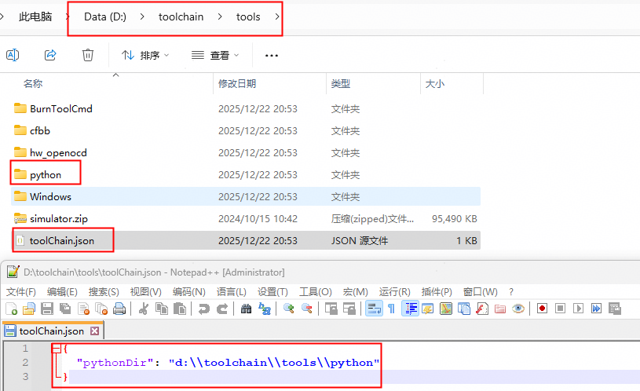
>
> - 工具链可以手动通过[工具链包](https://hispark-obs.obs.cn-east-3.myhuaweicloud.com/HiSparkStudioToolchain.zip)链接下载到downloads目录下（如“D:\\toolchain\\downloads”），并解压到tools目录下（如“D:\\toolchain\\tools”）。
> - 若本地没有配置git环境，可以手动下载git压缩包并解压到tools目录，git压缩包下载地址：[git包](https://hispark-obs.obs.cn-east-3.myhuaweicloud.com/Git.tar.gz)。解压后的目录结构如下：
>   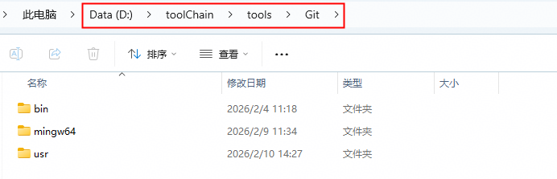
> - 工具链的环境和Python环境验证可参考图7和图8。
> - 验证成功后需手动将创建的用于存放下载工具链的文件夹目录（如“D:\\toolchain”）添加至用户环境变量中，变量名为“HISPARK_TOOL_PATH”，变量值为新建的文件夹目录（如“D:\\toolchain”），可参考图9。

>  **说明：**
> **半手动配置toolchain环境：**
> 如果只是少数文件下载失败，用户可以根据上述“手动配置toolchain环境”中相应文件的下载路径，手动下载相应的文件到downloads目录，然后再次点击英文“Download Toolchain”或者中文“下载工具链”按钮，HiSpark Studio会自动完成后续的文件的下载、安装以及配置操作。

### SDK下载<a name="ZH-CN_TOPIC_0000002303416852"></a>

HiSpark Studio for VS Code插件中创建工程需要依赖SDK软件包，插件当前提供WS63、BS2X系列以及HiDiTing的SDK下载。

**图 1** Download SDK from HiSpark功能<a name="fig16959181457"></a>


点击“Download SDK from HiSpark”后，弹出SDK下载列表。

**图 2** SDK下载列表<a name="fig862702418516"></a>
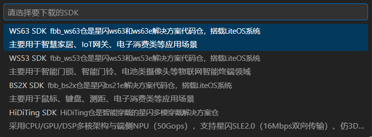

选中任意SDK，会弹出“选择SDK保存位置”选项。

**图 3** SDK保存位置选择<a name="fig109016331355"></a>


选中保存文件夹后，会优先使用本地系统中配置的git环境进行SDK下载，如果本地没有配置git环境，并且也没有进行下载工具链的操作，会提示“本地未安装配置git环境，请重新下载工具链配置git环境”。下载工具链的操作可以参考“工具链toolchain配置”。

**图 4** 下载SDK提示框<a name="fig1437317573111"></a>


SDK下载完成后，用户可根据SDK来进行工程创建。

>  **须知：**
>
> - 为避免SDK下载后与其他文件夹相互影响，建议选择SDK保存位置时选择一个空文件夹。
> - 由于Windows 11/10 的路径存在260Byte的长度限制，为后续编译操作，建议SDK存放路径不宜过长。
> - WS63 SDK通过git clone [https://gitcode.com/HiSpark/fbb_ws63.git](https://gitcode.com/HiSpark/fbb_ws63.git)在线下载。
> - WS53 SDK通过git clone [https://gitcode.com/HiSpark/fbb_ws53.git](https://gitcode.com/HiSpark/fbb_ws53.git)在线下载。
> - BS2X SDK通过git clone [https://gitcode.com/HiSpark/fbb_bs2x.git](https://gitcode.com/HiSpark/fbb_bs2x.git)在线下载。
> - HiDiTing SDK通过git clone [https://gitcode.com/HiSpark/hs-fbb.git](https://gitcode.com/HiSpark/hs-fbb.git)在线下载。

### MinGW安装<a name="ZH-CN_TOPIC_0000002524323169"></a>

使用GUI模拟器，需要安装CMake和MinGW。MinGW安装过程如下：

1. 下载7.3.0版本的[MinGW](https://sourceforge.net/projects/mingw-w64/files/Toolchains%20targetting%20Win64/Personal%20Builds/mingw-builds/7.3.0/threads-posix/seh/)。

   **图 1** MinGW-W64下载版本选择<a name="fig3726173721912"></a>
   

   下载得到如下压缩包：

   **图 2** MinGW-W64安装包<a name="fig18488603204"></a>
   

2. 在文件夹下解压，并将安装路径“/mingw64/bin”添加到系统环境变量，通过“gcc -v”命令查看是否成功安装。安装目录切勿包含中文路径，否则可能会导致编译失败。

   **图 3** MinGW-W64安装后添加环境变量验证<a name="fig15348183017207"></a>
   

### bash环境准备<a name="ZH-CN_TOPIC_0000002304004976"></a>

该小节仅针对需要依赖bash环境才可以编译的Hi2131、Hi2131C、3322工程。

如果需要编译Hi2131、Hi2131C、3322的工程，用户需手动下载[git](https://github.com/git-for-windows/git/releases/download/v2.48.1.windows.1/Git-2.48.1-64-bit.exe)
并将bash路径添加到环境变量中。

如果Windows系统System32下默认有“bash.exe”，需要删除其系统下的“bash.exe”，使用安装的git下内置的“bash.exe”。

完成后，关闭所有VS Code窗口，再重新打开，保证新环境变量生效，即可正常编译工程。

**图 1** 删除Windows系统库的bash<a name="fig9843191112367"></a>


>  **说明：**
> 若删除Windows系统库下的bash时提示没权限，可以在需要删除的bash.exe上右键点击，选择“属性”，在弹出的窗口中依次点击“安全”标签页→“高级”→点击“所有者”标签页下的“更改”按钮。选择一个新的所有者（例如当前用户），点击“应用”和“确定”。返回“安全”标签页，点击“编辑”。为当前添加的用户或组分配适当的权限（如完全控制、读取等）。点“应用”和“确定”后即可删掉选择的bash.exe文件。

**图 2** 配置bash.exe的删除权限<a name="fig31821532142019"></a>


**图 3** Git下的bash路径<a name="fig664202311363"></a>


**图 4** 添加到环境变量中<a name="fig1687216294365"></a>


**图 5** 保证Git下的bash被调用<a name="fig14591538123614"></a>


对于3322的工程，涉及用tar进行解压的操作，如果使用系统默认自带的tar会解压失败，需要对bash环境进行配置，使用bash环境中的tar来解压，保证编译正常运行。

1. 在bash环境准备好的基础上，将Git目录下的“..\\Git\\usr\\bin”目录添加到系统环境变量中，且优先级高于默认的System32。如图6所示。

   **图 6** 添加系统环境变量<a name="fig16428419174718"></a>
   

2. 将“..\\Git\\usr\\bin”添加到环境变量后，关闭所有VS Code窗口再重新打开，保证环境变量生效。在VS Code窗口中新建终端，输入“where.exe tar”，保证最新添加的“..\\Git\\usr\\bin”在系统默认的tar的环境变量之前，但需保留默认的System32目录下的tar，如图7所示。环境配置无误后再次编译，即可编译成功。

   **图 7** tar环境验证<a name="fig1022633464711"></a>
   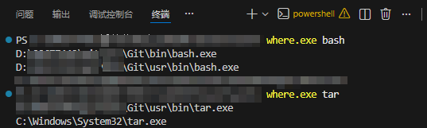

### CONFIG_PUBLIC_OPTION_IN_FILES宏开启<a name="ZH-CN_TOPIC_0000002622344905"></a>

对于3322工程（包含3322和diting工程），进行编译时，需要手动修改工程目录下的“build/config/target_config/3322/config.py”文件中的代码，将默认注释的宏“CONFIG_PUBLIC_OPTION_IN_FILES”开放，如不开放，在编译过程中会报“is command line too long”的错误，导致编译失败。

**图 1** 开启”CONFIG_PUBLIC_OPTION_IN_FILES”宏<a name=”fig1360193117574”></a>
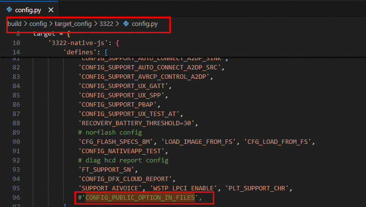

需要编译哪个target就需要开放哪个target的宏，如上图所示，“3322-native-js”target中的“CONFIG_PUBLIC_OPTION_IN_FILES”宏默认关闭，在编译“3322-native-js”target时需要将宏的注释去掉，开放该宏，保证编译通过。

>  **须知：**
>
> - diting工程的编译同样需要修改开放对应的宏。
> - 如果某一target中的参数没有“CONFIG_PUBLIC_OPTION_IN_FILES”宏，并且在编译时报“is command line too long”的错误，可以手动在“config.py”文件中的target下手动增加这一宏选项。
> - 开启CONFIG_PUBLIC_OPTION_IN_FILES宏后，Windows会读取.rsp文件执行编译，rsp文件读取是以流式方式读取，头文件的读取存在先后顺序问题，当存在同名头文件时，可能存在头文件引用错误问题，因此用户开发过程中需避免创建同名头文件。

## 工程管理<a name="ZH-CN_TOPIC_0000002293219994"></a>

- **新建工程**
- **导入工程**

### 新建工程<a name="ZH-CN_TOPIC_0000002327179609"></a>

1. 打开HiSpark Studio for VS Code插件，进入欢迎页面，点击“新建工程”，进入新建工程页面。

   **图 1** HiSpark Studio for VS Code插件欢迎页面<a name="fig6514428113718"></a>
   

2. <a name="li4852172114422"></a>在图2界面配置工程参数，点击“完成”。
   **图 2** 新建工程窗口<a name="fig2784311111318"></a>
   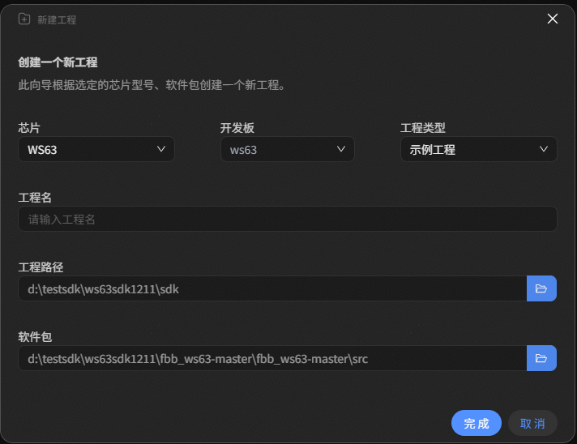
   - 芯片：选择工程使用的芯片名称。
   - 开发板：选择工程使用的开发板名称。当用户不需要自定义开发板时，默认芯片名作为开发板名。
   - 工程类型：选择创建的工程类型。包括示例工程和三方示例工程，其中三方示例工程当前仅支持WS63芯片。
   - 工程名：输入工程名称。
   - 工程路径：选择用于存放工程文件的目录。
   - 软件包：选择工程使用的软件开发驱动包（SDK）文件夹根目录。
     当芯片选择WS63，且工程类型选择“三方示例工程”后，工程界面会新增“sample路径”和“sample选择”选项，如图3所示。
     **图 3** sample工程创建页面<a name="fig16606922141519"></a>
     
     sample路径可选择WS63 SDK下载后与SDK同级目录下的vendor下的任意文件夹（所选文件夹下需包含“build_config.json”文件及demo文件夹），然后点击sample选择，弹出如图4所示界面。
     **图 4** sample选择页面<a name="fig111743454160"></a>
     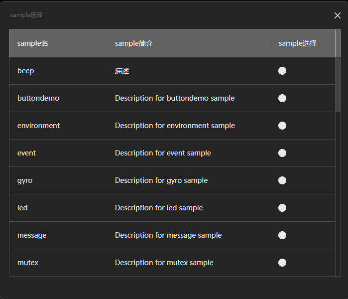
     选择需要的sample后，关闭sample选择页面，选择的sample选项名会填充到新建工程页面中的“sample选择”中，如图5所示。
     **图 5** sample选择完成后页面<a name="fig9923152471712"></a>
     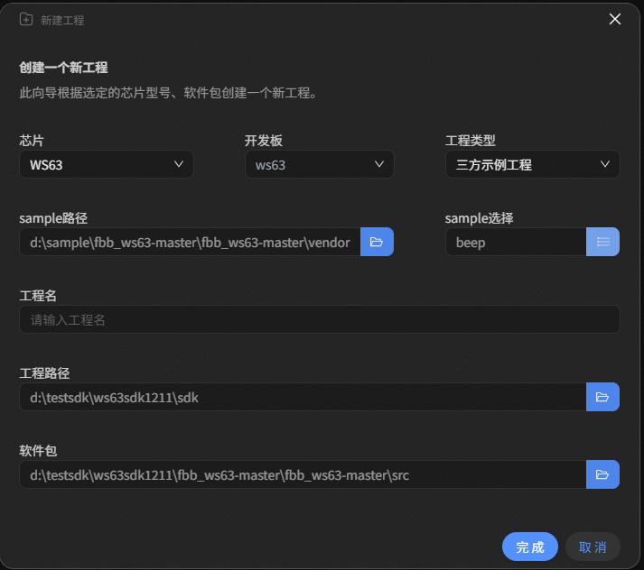
     后续选择合适的工程名、工程路径和WS63的软件包，点击“完成”即可创建工程。
3. 查看工程创建结果。

   HiSpark Studio for VS Code插件会自动打开新创建的工程，并在欢迎界面工程列表中显示创建的工程，如图6所示。如果是WS63创建“三方示例工程”，工程创建后会在“application/sample”工程目录下增加一个与已选sample同名的文件夹。

   **图 6** 工程创建结果页面<a name="fig551738161718"></a>
   

### 导入工程<a name="ZH-CN_TOPIC_0000002293379666"></a>

1. 打开HiSpark Studio for VS Code插件，进入欢迎页面，点击“导入工程”，进入导入工程页面。

   **图 1** HiSpark Studio for VS Code插件导入工程页面<a name="fig19540125184016"></a>
   

2. 选择导入的路径，即可查找该路径下所有的工程，勾选需要导入的工程，单击“完成”。

   **图 2** 导入工程配置页面<a name="fig3640203910157"></a>
   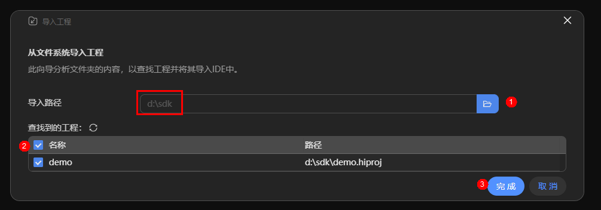

3. 导入工程完成后，会在工程区展示出工程的文件夹，并在欢迎界面的工程列表中展示已导入的工程。

   **图 3** 导入工程完成<a name="fig1617152231818"></a>
   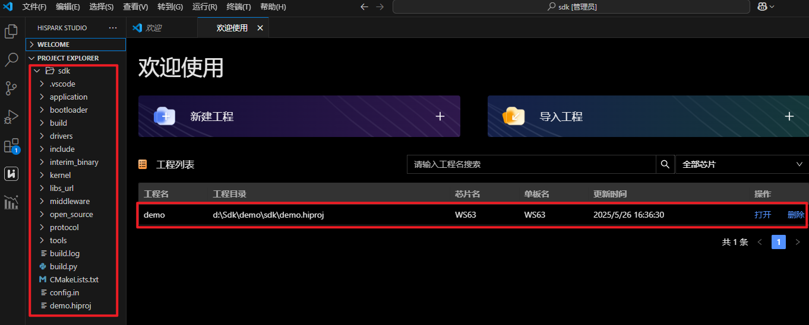

## 工程配置<a name="ZH-CN_TOPIC_0000002327179613"></a>

工程配置主要用于配置工程的基本信息、编译、调试、烧录等工程配置项，单击“”按钮可以打开工程配置界面，如图1所示。

**图 1** 单击工程配置按钮<a name="fig672755464817"></a>


- **基本信息配置**
- **编译器配置**
- **烧录器配置**
- **调试器配置**

### 基本信息配置<a name="ZH-CN_TOPIC_0000002293379670"></a>

单击工程配置界面左侧“基本信息”页签进入基本信息配置界面，如图1所示。该界面包含工程芯片系列、开发板型号、软件包路径，可以修改工程所对应的软件包路径。

**图 1** 基本信息配置界面<a name="fig18947542448"></a>

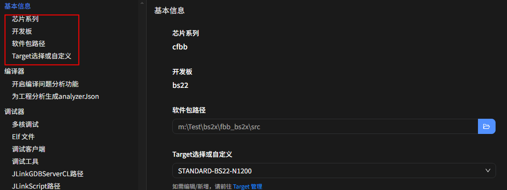

- 基本系列配置界面中，Target选择框以及关联的Target管理功能仅在部分FBB芯片中生效：

  BS20、BS20C、BS21、BS21E、BS21A、BS22、BS26既支持Target选择也支持Target管理，其余含有Target的工程仅支持Target选择。

- 以下指南仅针对上述涉及到Target功能的芯片：
  1.  如图2所示，通过选取不同的Target，可配合编译生成不同的编译产物。

      **图 2** Target选择界面<a name="fig1942333014511"></a>
      

  2.  单击Target选项框下方的 "Target 管理"，可进入Target管理界面，如图3所示。

      **图 3** Target管理界面<a name="fig1648301431310"></a>
      

      ① 不支持编辑和删除的SDK默认Target。

      ② 支持编辑和删除的Target。

  3.  单击Target管理界面的“添加”，可进入添加Target界面，如图4所示。

      **图 4** 添加Target界面<a name="fig13409104010130"></a>
      

  4.  当用户添加或删除Target时，工程配置界面的Target选项也会同步生效。以添加Target为例，当新增一个demo的Target后，如图5，工程配置界面Target下拉框也会同步更新DEMO选项，如图6。
      **图 5** 添加名称为demo的Target<a name="fig899411161410"></a>
      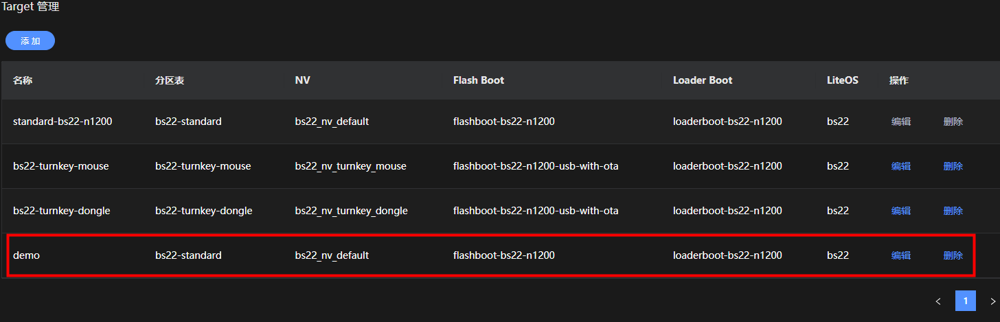

           **图 6**  Target下拉框同步更新DEMO<a name="fig38170493913"></a>
           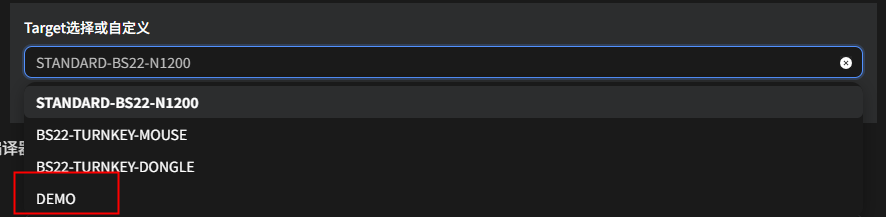

           配置后的Target参数宏信息会生成在target\_config目录下的“.config”文件中，如图7所示。

           **图 7**  Target配置文件<a name="fig8566412205415"></a>
           

           Target支持选择和自定义，单击Target选项框可以从Target列表中选择需要的Target，也可以自定义Target和编译的指令。

           **图 8**  Target自定义<a name="fig94764713276"></a>

      
           
           >  **须知：**
           > 
           > - Target支持选择和自定义，每次自定义时均需要手动输入完整的自定义Target及命令，不支持在选择或自定义的Target基础上二次编辑，即每次自定义Target时均需从第一个字符开始输入；
           > - Target自定义时，如果输入的Target为列表中已有的Target，在此基础上新增其他编译命令，如果编译能正常通过，调试和烧录均可正常执行。
           > - Target自定义时，如果输入的Target为列表中没有的Target，在此基础上进行编译，如果编译能正常通过，由于没有绑定elf和map文件，调试和栈分析、镜像分析功能会受到影响。此外，若使用自定义列表中没有的Target，重新打开工程配置时会提示launch.json缺失并影响调试功能，此为正常现象。

### 编译器配置<a name="ZH-CN_TOPIC_0000002327219389"></a>

单击工程配置界面左侧“编译器”页签进入编译器配置界面，如图1所示，该界面可配置工程是否开启编译问题分析功能和生成analyzerJson功能，默认不开启这两个功能。对于3322和3321工程会增加一个“-nhso构建参数”编译选项，默认开启，以加快3322和3321工程编译速度。

**图 1** 编译器配置界面-1<a name="fig177671416389"></a>


>  **说明：**
> 修改配置之后会自动保存并生效。文本输入框中的修改会在失焦时自动保存并生效。

### 烧录器配置<a name="ZH-CN_TOPIC_0000002327179617"></a>

单击工程配置界面左侧“程序加载”页签进入程序加载配置界面，如图1所示，该界面支持配置烧录传输方式以及传输方式对应的参数。

**图 1** 程序加载配置界面<a name="fig1851473982716"></a>
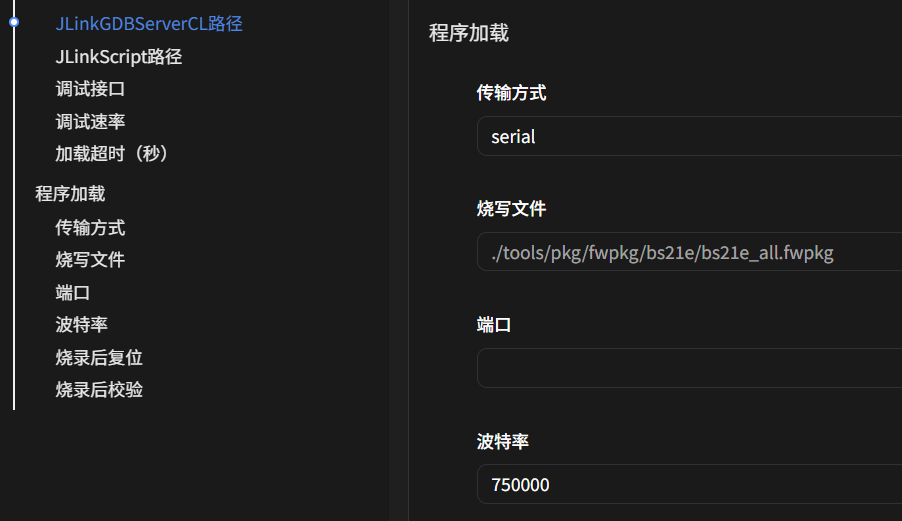

- 传输方式：选择数据传输方式。选择不同的传输方式，会出现不同的参数配置项。
  - serial：选择通过串口传输。如图2所示。
    - 端口
    - 波特率

    **图 2** 选择serial配置界面<a name="fig58771855184310"></a>

    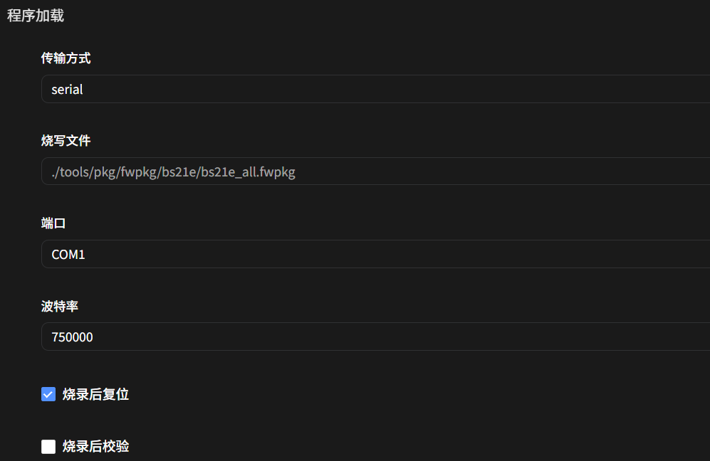

  - usb：选择通过USB设备完成烧写升级。如图3所示。（当前usb模式支持BS20、BS20C、BS21、BS21A、BS21E、BS22、BS25、BS26系列芯片。）
    - usb设备列表

      **图 3** 选择usb配置界面<a name="fig10468263017"></a>

      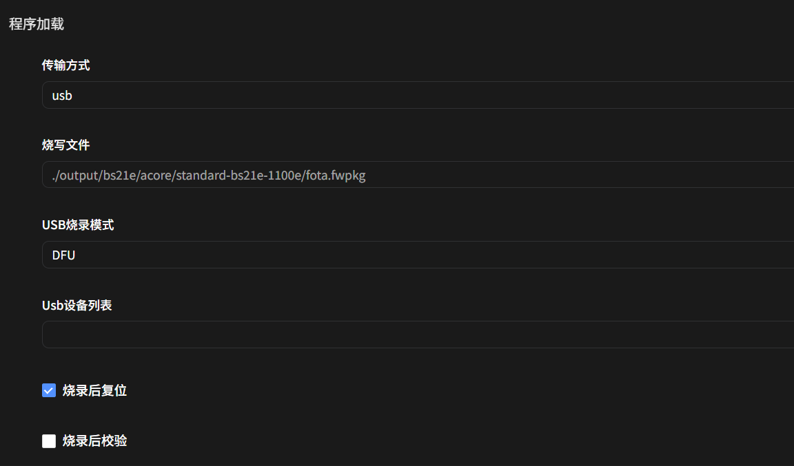

    - 如图所示，切换usb模式时，会修改默认烧写文件，且仅支持程序加载，不支持烧录配置。

      **图 4** 传输方式改为usb模式<a name="fig9131134814544"></a>
      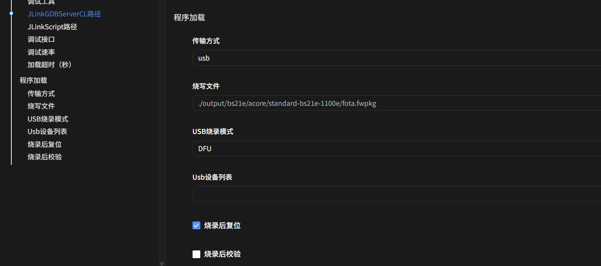

- 烧写文件：指定需要烧录的文件。
- 烧录后复位：烧录完成后，会进行单板软复位。
- 烧录后校验：烧录后，会将烧录文件进行回读对比，校验文件的完整性。

>  **说明：**
>
> - 修改配置之后会自动保存并生效。

### 调试器配置<a name="ZH-CN_TOPIC_0000002340080528"></a>

单击工程配置界面左侧“调试器”页签，在JlinkGDBServerCL路径中选择Jlink的执行软件，如图1所示。

**图 1** 工程配置界面中JlinkGDBServerCL路径选择<a name="fig205561635163111"></a>
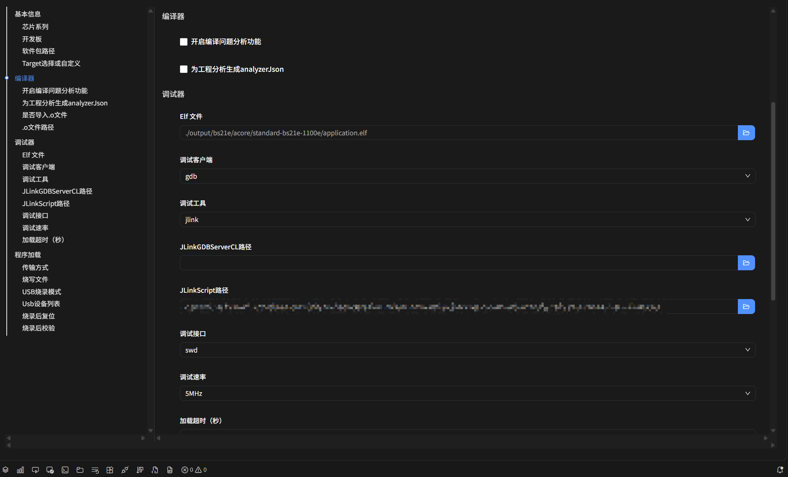

## 编译运行<a name="ZH-CN_TOPIC_0000002327183609"></a>

- **编译按钮介绍**
- **编译结果**
- **命令行编译工具**
- **脚本执行命令**

### 编译按钮介绍<a name="ZH-CN_TOPIC_0000002293383670"></a>

**图 1** 编译按钮<a name="fig7871826336"></a>


图1中按钮依次为：清除、编译、重编译和停止编译。

- ：单击触发工程清理，删除编译中间生成的文件。
- ：单击触发工程编译。
- ：单击触发先清理target再编译。
- ：单击触发停止编译。

>  **说明：**
>
> - 重编译功能会先清除output目录下当前target的内容，如acore目录和fwpkg目录下名为target的文件夹。如果存在该文件夹则会删除；如果没有，则不会清除任何文件或文件夹。清除完毕后会再执行编译功能。
> - 如果想删除output文件夹，执行“清除”功能即可。

### 编译结果<a name="ZH-CN_TOPIC_0000002293224006"></a>

单击“”按钮开始编译，编译成功后终端窗口输出如图1所示，且工程目录中生成output目录如图2所示。

**图 1** 编译成功<a name="fig738217204550"></a>
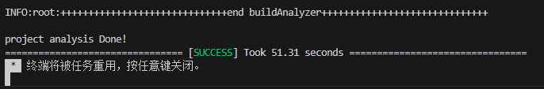

**图 2** 编译生成output目录<a name="fig114873277206"></a>


单击按钮开始清除编程生成的文件，成功后终端窗口输出如图3所示。工程清理会清除工程目录下的output文件夹。

**图 3** 清除工程编译成功<a name="fig1710335292011"></a>

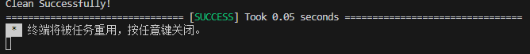

### 命令行编译工具<a name="ZH-CN_TOPIC_0000002413445032"></a>

点击COMMANDS中的Command Line功能或状态栏中的Command Line图标，可执行命令行工具功能。

**图 1** Command Line功能入口<a name="fig22561015171811"></a>


执行命令行工具功能后，会自动配置临时环境变量，并启动一个CommandLine终端。如果缺少编译所必需的工具链或其他依赖，会提示需先执行Download Toolchain功能配置环境。以Python环境配置失败为例，当Python环境未配置时点击Command Line会有信息提示先执行Download Toolchain配置环境。

**图 2** 环境配置失败提示信息<a name="fig820222016210"></a>


环境配置完成后，会打开一个CommandLine终端，默认在C盘根目录下，输入“d:”会切换至D盘根目录，然后cd到SDK目录，执行“python build.py -c”命令运行编译脚本，选择编译选项（“-c”为清除编译命令，可视情况选择是否在编译命令中带上“-c”）。

**图 3** 命令行编译<a name="fig126501319153419"></a>
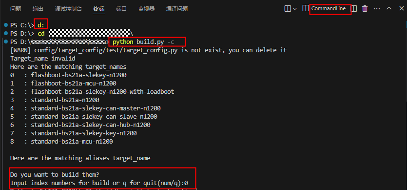

### 脚本执行命令<a name="ZH-CN_TOPIC_0000002526068312"></a>

在完成“工具链toolchain配置”后，在下载的工具链的tools目录下，如“D:\\toolChain\\tools”目录下，存在一个“hispark_studio.bat”的脚本。

**图 1** hispark_studio脚本所在位置<a name="fig2214951121219"></a>
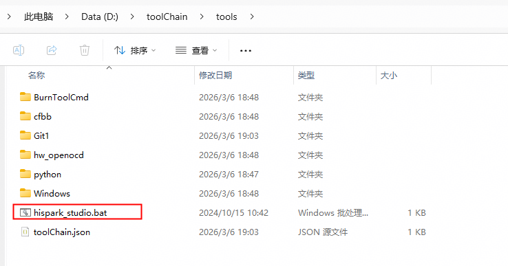

双击该脚本后，cd到SDK所在目录，执行“python build.py -c”并选择所需要的target，即可不依赖VS Code工具直接对SDK或工程进行编译操作。以WS63工程为例，操作过程如图2所示。

**图 2** 脚本起编译过程<a name="fig41347152166"></a>
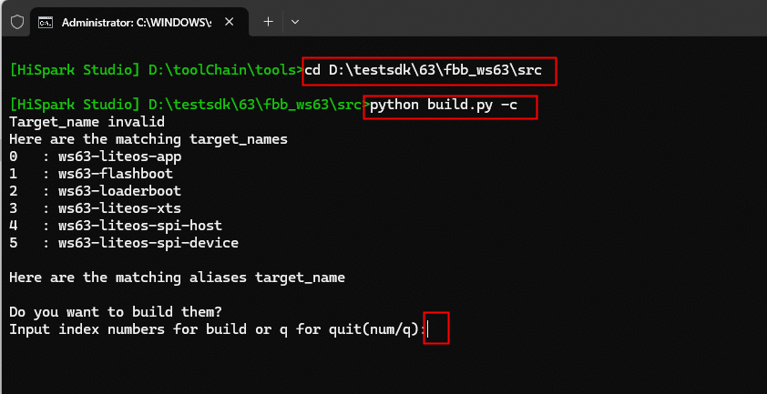

## 软件包烧录<a name="ZH-CN_TOPIC_0000002293224022"></a>

烧录功能只支持串口烧录。

- **连接烧录串口线**
- **配置工程的烧录选项**
- **烧录配置**

>  **说明：**
> **WSL挂载串口步骤：**
> 1、下载usbipd-win：访问usbipd-win的GitHub仓库下载最新版本的安装包（https://gitcode.com/gh_mirrors/us/usbipd-win?source_module=search_result_repo 查看该链接中的README，下载“最新版本”的.msi文件）。或者，在PowerShell中使用winget命令在线安装：winget install --interactive --exact dorssel.usbipd-win。
> 2、安装usbipd-win：双击下载的.msi文件，按照安装向导完成安装。
> 3、列出所有USB设备：在Windows搜索栏中输入“PowerShell”，右键点击“Windows PowerShell”，选择“以管理员身份运行”。在PowerShell中运行usbipd list命令，列出所有连接到Windows的USB设备及其总线ID。
> 4、选择并共享USB设备：根据需要，找到并复制想要在WSL中使用的串口设备的总线ID。运行usbipd bind --busid <BUSID>命令来绑定该设备，允许它被共享到WSL。其中<BUSID>为要共享的设备总线ID。注意：在某些情况下，用户可能不需要显式运行usbipd bind命令，直接执行usbipd attach即可。但根据最新信息，建议首先使用bind命令确保设备被正确共享。
> 5、附加USB设备到WSL：在PowerShell中，使用usbipd attach --wsl --busid <BUSID>命令将USB设备附加到WSL。其中<BUSID>为之前复制的设备总线ID。
> **设置执行权限报错**
> Linux、MacOS 环境下，如果 hsflash 设置执行权限报错，请在终端执行`sudo chmod +x XXX/tool/hsflash/hsflash`后重新尝试烧录。
> XXX：工具链安装目录

### 连接烧录串口线<a name="ZH-CN_TOPIC_0000002327223389"></a>

软件镜像烧录使用串口通信协议，需要将运行HiSpark Studio for VS Code插件的电脑与目标板用串口线连接，常见的串口线有标准的串口线和USB转串口线两种。如果使用USB转串口线，需提前安装USB转串口驱动。

**图 1** 烧录串口连接示意图<a name="fig8881486226"></a>


### 配置工程的烧录选项<a name="ZH-CN_TOPIC_0000002327183641"></a>

1. 配置好硬件环境。

   请用串口线连接好电脑和待烧录开发板。

2. <a name="li207851059104511"></a>确定所连接的串口号。
   打开电脑的设备管理器，查看并记录串口线对应的串口号。
   **图 1** 串口选择<a name="fig55913473219"></a>
   
   >  **须知：**
   > 如果使用USB转串口方式烧录，请安装USB转串口的驱动程序。
3. 进入工程配置界面。

   打开要烧录的工程后，单击工程配置的“”按钮，进入工程配置界面。

   **图 2** 工程配置入口<a name="fig337113913219"></a>
   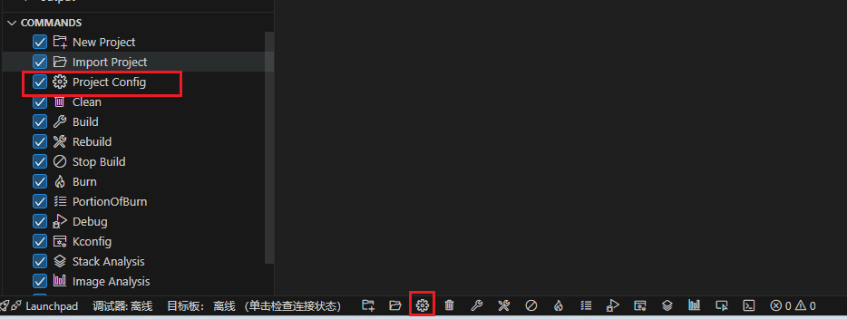

4. 单击“程序加载”中的“传输方式”，默认选择“serial”串口传输，“烧写文件”中，会默认选择烧录的烧写文件，按步骤2选择端口号，波特率默认115200。
   **图 3** 串口烧录配置<a name="fig99981772213"></a>
   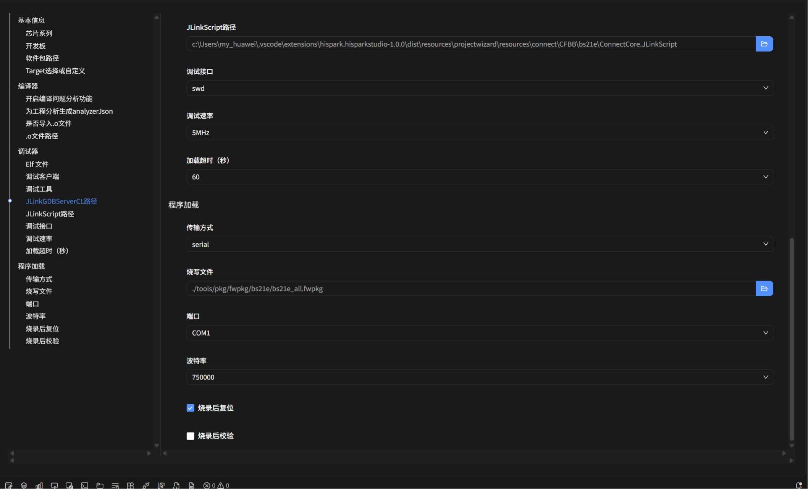
   >  **须知：**
   > FBB系列芯片选择“serial”烧写模式时，由于是USB转串口的方式，硬件设备的差异可能会对芯片支持的烧写波特率有限制，如果想支持更高的波特率，需要改板。其中，BRANDY系列芯片烧写波特率默认限制为不超过500000，BS2X系列芯片烧写波特率默认限制为不超过2000000，3322系列芯片烧写波特率默认限制为不超过750000。
5. 单击工具栏中的烧录按钮 ，开始执行烧写。

   **图 4** 烧录按钮入口<a name="fig1518855418224"></a>
   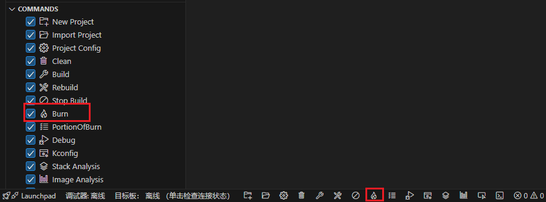

6. 根据终端打印的"Connection"或其他提示，对单板进行复位，烧录成功后终端窗口输出“Write successfully”。

### 烧录配置<a name="ZH-CN_TOPIC_0000002293383702"></a>

本章节主要介绍支持选择性烧录烧写文件的方法。使用此功能前如果编译成功则直接从本章节1开始，如果未编译，请参见“编译结果”章节进行编译，然后再根据本章节步骤进行操作。

1. <a name="p913mcpsimp"></a>单击工具栏中的“烧录配置”  按钮，进入烧录配置界面。

   **图 1** 烧录配置按钮及界面<a name="fig18205858181719"></a>

   

2. FBB分区文件默认为打包好的.fwpkg文件，或者单击“浏览”按钮从本地文件中选择打包好的.fwpkg文件。选择完成后，烧录工具会自动地将.fwpkg文件中包含的bin内容列出。

   **图 2** FBB烧录配置分区文件路径<a name="fig7273738121914"></a>

   

3. 勾选需要烧录的.bin文件。默认会勾选全部.bin文件，且不支持修改表格中包含loader.bin或ssb.bin的分区名属性所在行的编辑状态。而其他.bin文件可以根据烧写的需求勾选或者取消勾选。
4. 烧录之前需要配置传输方式及其他参数信息，具体操作请参见“烧录器配置”章节。
5. 单击“烧录”按钮，根据提示重启开发板，即可开始烧录。

   **图 3** 烧录<a name="fig7508701238"></a>

   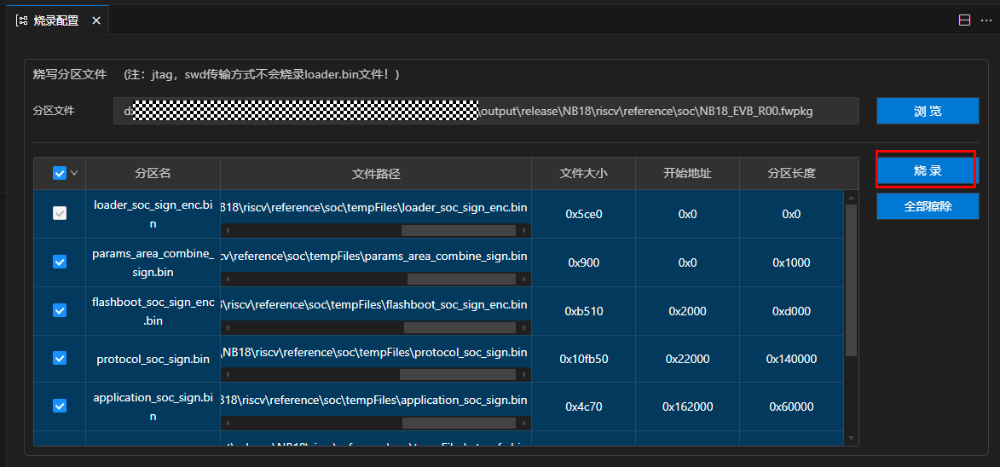

6. 开始烧录后，在分区文件下方会显示出烧录进度条，方便查看烧录进度。烧录开始后会在终端打印对应指令信息，最后烧录成功后会在界面显示“Write successfully”字样。

   **图 4** 烧录进度<a name="fig19626111222410"></a>

   

## 栈分析和镜像分析<a name="ZH-CN_TOPIC_0000002293383718"></a>

HiSpark Studio for VS Code插件集成了Stack Analysis栈分析工具和Image Analysis镜像分析工具，用于分析开发过程中的内存不足、内存溢出等问题，帮助开发者更加精准地分析、定位问题。

- Stack Analysis栈分析工具是基于静态二进制分析手段，提供任务栈开销估算值和函数调用关系图示，为栈内存使用、分析、优化、问题定位等开发场景提供较为准确的静态内存分析数据参考。
- Image Analysis镜像分析工具对工程构建出的.elf文件进行内存占用分析，帮助开发者快速评估内存段、符号表使用情况。
- **栈分析**
- **镜像分析**

### 栈分析<a name="ZH-CN_TOPIC_0000002293224062"></a>

**功能介绍<a name="section148321529151417"></a>**

栈分析工具基于静态二进制分析手段，提供任务栈开销估算值和函数调用关系图示，为栈内存使用、分析、优化和问题定位等开发场景提供较为准确的静态内存分析数据参考。

**功能入口<a name="section17325123961615"></a>**

创建工程并成功编译后，单击工具栏中“”按钮进行栈分析。

**栈分析功能页面<a name="section125419179175"></a>**

栈分析结果按照函数列表和调用关系进行展示。如图1所示，功能列表页面展示每个函数的名称、内部栈开销和位置信息，其中内部栈开销单位为Byte，支持关键字搜索和排序功能。

**图 1** 功能列表页面<a name="fig4596122219257"></a>


调用关系界面如图2所示，显示每个函数的调用关系，包括函数名称、调用深度、函数最大栈开销和内部栈开销，支持关键字搜索和排序功能。

**图 2** 调用图页面<a name="fig1384164712519"></a>


**统计项说明<a name="section618mcpsimp"></a>**

- 最大开销：为当前函数所有子函数中最大栈开销与循环次数的乘积，再加上自身的开销。

  计算公式：max（子函数1的自身栈开销，子函数2的自身栈开销，子函数3的自身栈开销，…）× 循环次数＋函数的自身栈开销

- 本地开销：当前函数的自身栈开销。
- 深度：当前函数每增加一层子函数，深度增加一层。

### 镜像分析<a name="ZH-CN_TOPIC_0000002327223425"></a>

**功能介绍<a name="section538803119292"></a>**

镜像分析工具通过分析.elf文件，图形化展示RAM和ROM的使用情况。

**功能入口<a name="section1582295611297"></a>**

创建工程并成功编译后，单击工具栏中的“”按钮。

**功能界面<a name="section1533673619307"></a>**

内存区域页面（如图1所示）评估分析工程对内存的细分使用情况。例如WS63，显示的内存区域region包含RAM、SRAM、ITCM等，展示的信息包含每个内存区域的名称、起始内存地址、结束内存地址、总大小、空闲大小、已用大小以及使用比例，支持关键字搜索和排序功能，如图1所示。

**图 1** 内存区域页面<a name="fig1787391122717"></a>


内存详细信息页面（如图2所示）展示每个内存区域包含的内存段section和内存段包含的symbol的详细信息。比如FLASH下面包含.text、.entry、.data等内存段，内存段又包含分配在该段的程序符号，支持关键字搜索和排序功能。

每一行展示的信息包含运行地址VMA（Virtual Memory Address，表示程序运行时的内存地址）、装载地址LMA（Load Memory Address，表示程序装载的内存地址）、内存段/符号的大小。

**图 2** 内存详细信息页面<a name="fig15591937172713"></a>


文件大小页面（如图3所示）展示每个链接进来的.o文件所占的内存区域及其大小，支持关键字搜索和排序功能。

**图 3** 文件大小页面<a name="fig9261641289"></a>


模块大小页面（如图4所示）展示了模块和组件的层级关系以及不同模块的内存占用，支持关键字搜索和排序功能。

**图 4** 模块大小页面<a name="fig1367222122813"></a>


文件夹大小页面（如图5所示）展示了不同文件夹中模块的内存占用，支持关键字搜索和排序功能，支持导出Excel。

**图 5** 文件夹大小<a name="fig1075993892817"></a>


## 工程调试<a name="ZH-CN_TOPIC_0000002327183673"></a>

- **调试配置选项**
- **启动调试**
- **常用调试功能**

### 调试配置选项<a name="ZH-CN_TOPIC_0000002293383734"></a>

>  **说明：**
> 调试配置选项中的JlinkGDBServerCL驱动需要在[J-Link官网](https://www.segger.com/products/debug-probes/j-link/models/j-link-base/)下载。

参考下图所示进行调试选项配置：

1. 选择要调试的工程：在HiSpark Studio for VS Code插件主界面中，选择要调试的工程，打开“工程配置”。
2. 修改调试选项，选择对应的调试器。

   **图 1** 调试选项修改<a name="fig4891141904416"></a>
   

### 启动调试<a name="ZH-CN_TOPIC_0000002293224078"></a>

1. 单击IDE工具栏调试按钮“”，在顶部弹框中选择需要的调试模式。
   **图 1** 调试模式选择<a name="fig0277550163411"></a>
   
   - GDB Launch（Acore）：A核重启，暂停CPU，设置PC指针从头开始运行程序（A核开头设置了一个虚拟断点）。
   - GDB Attach（Acore）：A核正在运行中，暂停CPU，程序直接停在CPU Halt处。
   - GDB Launch（Pcore）：P核重启，暂停CPU，设置PC指针从头开始运行程序（P核开头设置了一个虚拟断点）。
   - GDB Attach（Pcore）：P核正在运行中，暂停CPU，程序直接停在CPU Halt处。
     >  **说明：**
     > 3322芯片低功耗场景不支持launch模式，只支持attach模式。
2. 调试成功后示例如下图，若出现下面提示信息与工具栏调试图标，则说明已成功启动调试。

   **图 2** 调试成功后提示信息、调试图标及调试界面<a name="fig1214081317358"></a>
   

   

   

### 常用调试功能<a name="ZH-CN_TOPIC_0000002327223441"></a>

- **调试页面**

#### 调试页面<a name="ZH-CN_TOPIC_0000002327183693"></a>

调试工作界面如图1所示，主要由以下3个部分组成：

① 调试侧边栏

② 调试功能区

③ 调试控制台

**图 1** 调试工作界面<a name="fig132922116210"></a>


- **调试侧边栏**
- **调试功能区**
- **调试控制台**

##### 调试侧边栏<a name="ZH-CN_TOPIC_0000002293383750"></a>

调试侧边栏集合了调试常用功能，包括变量、监视、调用堆栈、断点、内存信息查看等。

##### 调试功能区<a name="ZH-CN_TOPIC_0000002293224090"></a>

启动调试功能后，当代码执行到设置的断点时，程序会暂停，用户可根据调试功能区的按钮进行代码调试。

**图 1** 调试图标<a name="fig1952516244357"></a>


- ：继续运行（“F5”），当程序执行到断点时停止执行，单击此按钮程序继续执行。
- ：单步跳过（“F10”），在单步调试时，直接前进到下一行（如果当前函数存在子函数调用，不会进入子函数内单步执行，而是将整个子函数当作一步执行）。
- ：单步执行（“F11”），在单步调试时，遇到子函数后，进入子函数并继续单步执行。
- ：单步跳出（“Shift+F11”），在单步调试执行到子函数内时，单击单步跳出会执行完子函数剩余部分，并跳出返回到上一层函数。
- ：重启调试（“Ctrl+Shift+F5”），重新启动调试。
- ：停止调试（“Shift+F5”），停止调试任务，断开连接。

##### 调试控制台<a name="ZH-CN_TOPIC_0000002327223477"></a>

调试控制台用来输出调试时的打印信息，也可以输入命令与调试器交互。

- 变量查看

  当运行到断点处暂停时，可以在变量界面查看变量的当前值。

  **图 1** 查看变量当前值<a name="fig122981731183513"></a>
  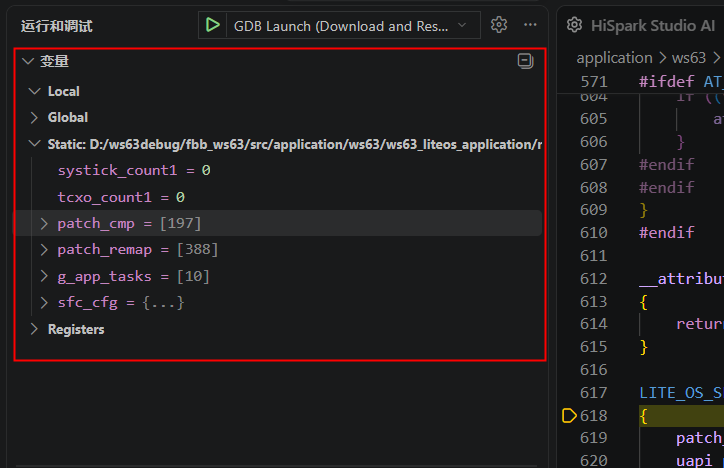

  支持如下4种变量类型：
  - 局部变量
  - 全局变量（可能会被编译器优化，可以使用关键字volatile来规避此问题）
  - 静态变量（可能会被编译器优化，可以使用关键字volatile来规避此问题）
  - 寄存器

- 监视功能

  在调试过程中，可以通过“监视”查看变量（包括局部变量、全局变量以及静态变量）和特定地址的取值来判断程序的运行结果是否有误。

  **图 2** 监视功能<a name="fig154504387355"></a>
  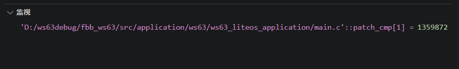

- 查看调用栈

  在调试过程中，可以通过查看调用栈来分析主程序调用的各子程序的调用关系，如下图所示。

  **图 3** 调用堆栈功能<a name="fig102391744183516"></a>
  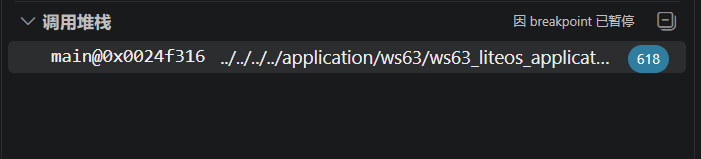

- 内存信息查看

  调试过程中，可以在内存查看界面查看指定内存地址的当前信息。

  **图 4** 查看内存信息菜单<a name="fig1536463013146"></a>
  

  点击侧边栏“MEMORY”-\>“open memory view”菜单项，弹出内存信息查看窗口。

  **图 5** 内存信息查看窗口<a name="fig126654372298"></a>
  

  在输入框“address”、“offset”、“Length”中分别输入起始地址、偏移量和长度，可查看指定范围的内存地址信息。默认情况下，查看从“address”指定的地址开始、连续128个字节的地址的值。

  **图 6** 查看内存信息<a name="fig416563263713"></a>
  

  点击“Save”按钮，可将当前地址信息以表格的形式保存到本地。

  点击侧边栏“MEMORY”-\>“open memory view”菜单项，可同时打开多个Memory窗口。

## 远程开发工具<a name="ZH-CN_TOPIC_0000002519102031"></a>

本章节主要介绍HiSpark Studio for VS Code插件中的远程开发工具。该工具可监测本地工程的文件变化并实时传输至服务器端，在服务器端编译后，将编译产物复制到本地工程目录，供本地执行调试、烧录等功能。

主要包括四个功能：连接服务器、打开远程配置管理、执行编译命令并传输文件、断开服务器。

>  **说明：**
>
> - 在使用远程开发工具之前，建议本地创建的工程目录与服务端需要传输文件的SDK目录保持一致，如：
> - 服务端目录：/home/developer/1a21
> - 本地工程目录：D:\\\\home\\\\developer\\\\1a21
> - 如果已经按照bash环境准备进行tar的环境配置，需要去除添加的Git目录下的“..\\Git\\usr\\bin”的系统环境变量，保证where tar指向的是系统默认的tar，而不是用户手动安装的git目录下的tar。

- **连接服务器**
- **打开远程配置管理**
- **执行编译命令并传输文件**
- **断开服务器**

### 连接服务器<a name="ZH-CN_TOPIC_0000002519102873"></a>

在本地和服务端分别创建工程并保持路径一致后，打开本地创建的工程目录，单击“远程开发工具”，会弹出远程开发选项框。

**图 1** 远程开发工具<a name="fig6230341121613"></a>
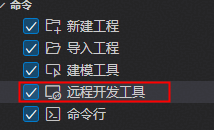

**图 2** 远程开发选项框<a name="fig99090381711"></a>


在弹出的远程开发选项框中选择“连接服务器”。按照提示进行服务器的连接，在选择模式中选择“文件同步Linux连接”，输入需要连接的服务器地址、连接端口号、用户名，选择认证方式（一般为“密码”），最后输入密码，连接步骤完成后，会在“输出”界面显示连接成功。

**图 3** 选择连接模式<a name="fig113221229102415"></a>


**图 4** 输入服务器地址<a name="fig5884613249"></a>


**图 5** 输入端口号<a name="fig135241815142515"></a>


**图 6** 选择认证方式，一般选择密码<a name="fig073063119252"></a>


**图 7** 输入密码<a name="fig12219125619253"></a>


**图 8** 连接成功状态<a name="fig63161839172614"></a>


>  **说明：**
> 若已经在该文件夹目录下连接过远程环境，在点击“连接服务器”后，会弹出是否使用已有的连接和重新配置连接的窗口。如果选择使用现有配置快速连接，则会直接跳转到输入密码阶段，输入密码后即可重新连接成功；如果选择重新连接，则会从连接选择模式开始重复上述操作。
> **图 9** 非首次连接在点击“连接服务器”后的界面显示<a name="fig18468435102816"></a>
> 

### 打开远程配置管理<a name="ZH-CN_TOPIC_0000002486863030"></a>

在首次连接或者点击“远程开发工具”后弹出的“打开远程配置管理”选项框，会弹出“远程编译执行配置”界面。

**图 1** 远程编译执行配置界面<a name="fig655612429325"></a>
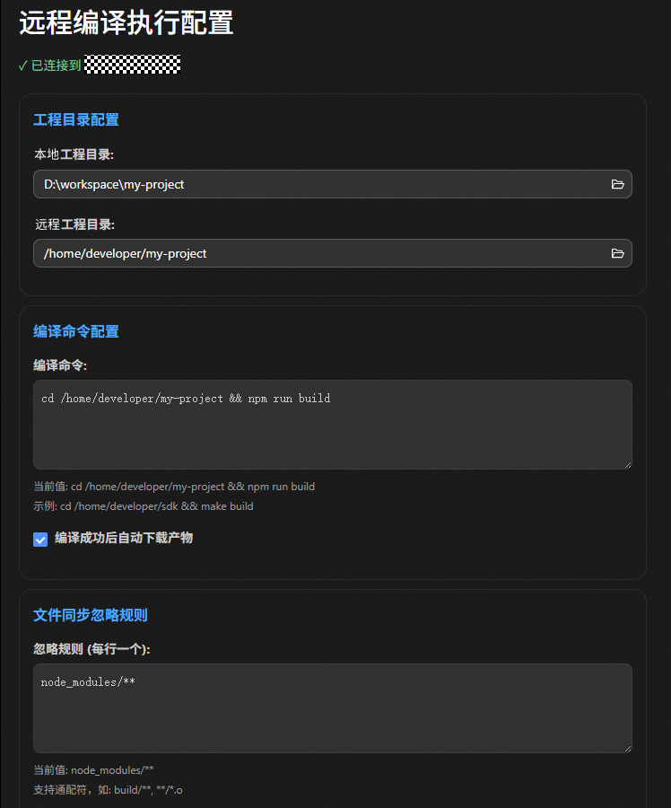

各选项框介绍说明：

- 本地工程目录：选择本地工程即当前打开的文件夹，用于与服务器目录的数据同步与传输。
- 远程工程目录：选择服务器端的工程目录，用于与本地端目录的数据同步。
- 编译命令配置：需要在服务器端执行的命令操作，一般为cd到服务器端的工程目录下，再执行编译命令，即能够编译出需要传输给本地目录的编译产物（即output目录）。
- 编译成功后自动下载产物：默认勾选，选择后执行编译命令会默认将远程工程目录下的output文件夹复制到“本地工程目录”选择的路径（即本地工程路径）；如果编译后生成的烧录fwpkg文件在“tools/pkg/fwpkg”下，会额外复制一份“tools/pkg/fwpkg”文件夹到本地工程目录，如bs系列和brandy工程。
- 文件同步忽略规则：与服务端建立连接后，会监测本地文件的变化改动，再自动上传到远程服务端，忽略规则可以输入不需要监测的文件夹。如果工程目录过大需要监测的文件过多，会导致性能变差，IDE工具出现卡顿等情况。

各选项选择完后，需要点击保存配置。

### 执行编译命令并传输文件<a name="ZH-CN_TOPIC_0000002487022994"></a>

点击“远程开发工具”后弹出的“执行编译命令并传输文件”选项框，会自动先执行“编译命令配置”中选择的编译命令，编译结束后，会自动将服务器端的编译产物传输至本地工程目录。

>  **说明：**
> 为提升传输速率，远程传输文件至本地采取先压缩编译产物为tar.gz压缩包，再传输单个压缩包文件，传输到本地后，再执行解压的操作。解压完成后会自动删除服务器和本地的tar.gz压缩包。如果编译产物（即output文件夹）下文件或者文件夹过多，会影响压缩和解压时间，造成传输时间过长。

服务器端的编译产物传输至本地后，可正常在本地使用调试、烧录等功能。

### 断开服务器<a name="ZH-CN_TOPIC_0000002519022891"></a>

点击“远程开发工具”后弹出的“断开服务器”选项框，会断开与服务器的连接。

## 串口控制台工具<a name="ZH-CN_TOPIC_0000002293383834"></a>

本章节主要介绍HiSpark Studio for VS Code插件中关于串口操作的工具监视器（Monitor）。主要功能包括显示串口列表、连接串口、断开串口连接、接收串口消息、给串口发送消息、清空串口输出区、开启\\关闭屏幕自动滚动等。

>  **说明：**
> 串口工具以“\\r\\n“作为每行的分隔符，所以要求被打印的每行字符串都要以“\\r\\n“结尾，否则可能会出现程序结尾打印丢失的情况。

- **打开监视器**
- **连接串口**
- **查看消息**
- **发送消息**
- **断开连接**
- **扩展工具使用**

### 打开监视器<a name="ZH-CN_TOPIC_0000002293224166"></a>

运行HiSpark Studio for VS Code插件后打开VS Code终端，找到终端区域、切换到“监视器”选项卡，如图1所示。

**图 1** 切换到“监视器”选项卡<a name="fig17771812125220"></a>


**图 2** 监视器界面介绍<a name="fig14318546512"></a>


- ①：串口配置区

  端口：显示当前电脑所连接的串口设备，单击“”按钮刷新串口列表。

  波特率：选择串口波特率，范围：300～250000。

  行尾：当给串口发送消息时，工具会根据此选项自动添加字符。
  - CRLF代表“\\r\\n”。
  - CR代表“\\r”。
  - LF代表“\\n”。

- ②：功能按钮区

  ：连接串口按钮。当连接串口后，按钮状态会变成，单击此按钮会断开串口连接。

  ：时间戳按钮。开启时会在每行输出前加上时间戳显示，如果按钮处于关闭状态则不显示时间戳，如图3所示。

  **图 3** 时间戳设置效果示例<a name="fig1040102615572"></a>
  

  ：隐藏输入框，隐藏/显示输入框界面如图4、图5所示。

  **图 4** 显示输入框<a name="fig209583373583"></a>
  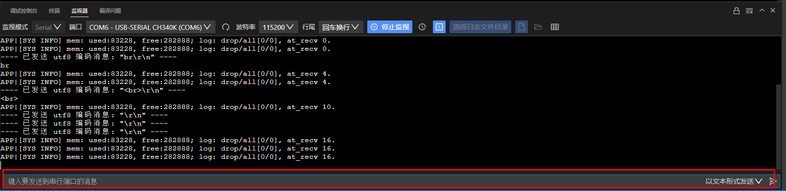

  **图 5** 隐藏输入框<a name="fig17214483580"></a>
  

  ：开启/关闭屏幕自动滚动。

  ：清空输出区。

  ：最大化面板。

  ：关闭面板。

- ③：输出区。
- ④：输入区。
- ⑤：发送消息按钮，单击按钮或按回车键向串口发送输入区信息，默认编码为UTF-8。

### 连接串口<a name="ZH-CN_TOPIC_0000002327223529"></a>

单击“”即可连接串口。连接串口前，输入区默认处于未激活状态（不可输入、不可点击）；连接串口后，输入区变为激活状态，串口配置区的监视模式选项变为未激活状态。

**图 1** 开始监视功能<a name="fig58721954163517"></a>


### 查看消息<a name="ZH-CN_TOPIC_0000002327183793"></a>

在输出区可以查看串口发送的消息。

**图 1** 查看串口消息<a name="fig15659205953510"></a>


### 发送消息<a name="ZH-CN_TOPIC_0000002293383846"></a>

在下方输入区输入消息后单击发送按钮或者单击键盘回车按钮发送消息。

**图 1** 发送消息<a name="fig1571552215364"></a>


### 断开连接<a name="ZH-CN_TOPIC_0000002293224182"></a>

单击“”按钮断开串口连接。

**图 1** 停止监视<a name="fig4728173953619"></a>


### 扩展工具使用<a name="ZH-CN_TOPIC_0000002327223541"></a>

扩展工具主要用于添加用户常用的命令，添加后点击名称即可发送命令。扩展工具在出厂时预置了一些常用命令，如果用户用不到这些命令，可以选择清空表格，然后手动添加所需命令，或通过Excel表格导入方式进行添加。除此之外，扩展工具还有循环发送功能，在后面章节中会详细介绍。

- 打开扩展工具。单击扩展按钮，会在右侧展开扩展页面。

  **图 1** 扩展工具<a name="fig1786951684210"></a>
  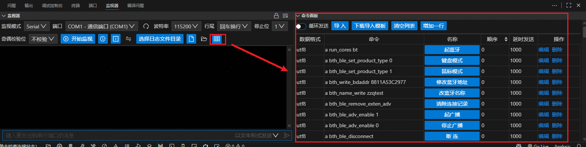

  单击此按钮可最大化面板。

  **图 2** 监视器面板最大化按钮<a name="fig11226132364210"></a>
  

- 单击清空列表按钮可清空列表。

  **图 3** 清空列表功能<a name="fig6150152913426"></a>
  

  如果清空出厂表格后需要恢复，可导入安装目录下“C:\\Users\\用户xxx\\.vscode\\extensions\\hispark.hisparkstudio-x.x.x\\dist\\resources\\terminal\\resources\\excelFile”中的“rawData.xlsx”表格。

- 手动新增命令行。单击“增加一行”按钮。

  **图 4** 新增一行功能<a name="fig1455312345424"></a>
  

  添加数据规则：

  数据格式：下拉框模式，下拉选项有utf8、bin、hex。

  命令：发送给串口的命令字符串。

  名称：识别命令功能的字符串。单击此按钮可立即发送命令给串口（前提是工具处于监测状态）。

  顺序：在使用循环发送功能时，顺序大于0，才会进行循环发送。如果有多个命令的顺序大于0，并且数值一样，则按照由上到下的顺序发送。

  延时发送：先发送一次，再进行延时，单位：ms。

  操作：有编辑和删除两个选项，单击编辑可对命令行进行修改，单击删除可删除命令行。

- 批量添加命令。
  1. 下载导入模板。导入模板会自动保存到“C:\\Users\\用户xxx\\.vscode\\extensions\\hispark.hisparkstudio-x.x.x\\dist\\resources\\terminal\\resources\\excelFile\\template.xlsx”。

     **图 5** 下载导入模板功能<a name="fig131081446114215"></a>
     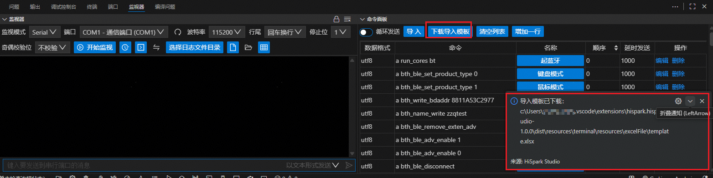

     导入模板中会显示需要导入的列，以及每个列的规则。

     **图 6** 导入模板<a name="fig4205125119425"></a>
     

  2. 填写导入模板。

     **图 7** 导入模板数据填写<a name="fig249315718422"></a>
     

  3. 导入“导入模板“文件。

     **图 8** 导入模板数据<a name="fig11424622434"></a>
     

     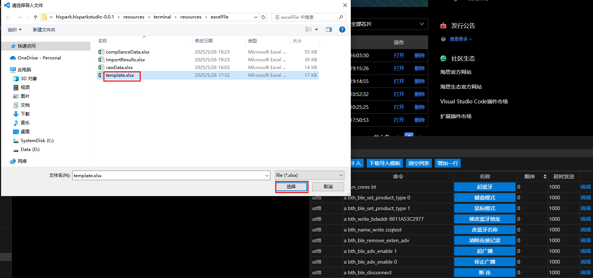

  4. 查看导入数据。

     **图 9** 查看导入数据<a name="fig18481158134314"></a>
     

     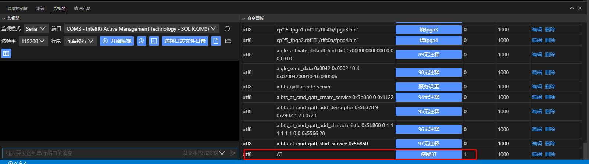

  5. 查看导入结果表格。导入结果列会显示导入不成功的原因。

     **图 10** 查看导入结果<a name="fig1017011484311"></a>
     

- 循环发送。
  1. 设置顺序和延时。

     **图 11** 设置顺序和延时功能<a name="fig6466102611434"></a>
     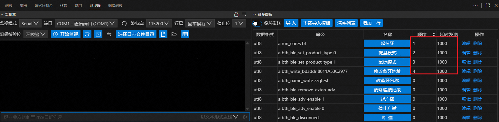

     上图表格执行命令的顺序：

     首先，发送“起蓝牙“命令，延时1000ms；然后，发送“键盘模式“命令，延时1000ms；最后，发送“鼠标模式“命令，延时1000ms；结束。这是一个循环发送的周期，循环发送会持续重复该周期。

     “修改蓝牙地址”命令并不会发送，因为它的顺序不大于0。

  2. 打开串口监测。

     **图 12** 串口监测功能<a name="fig5219203116435"></a>
     

  3. 打开循环发送开关（发送的命令自带“回车换行”）。开启后，会在左侧输出栏看到发送的命令。

     **图 13** 循环发送功能<a name="fig734614365431"></a>
     

     红色字体表明正在发送此条命令或者正在延时。

## Kconfig配置<a name="ZH-CN_TOPIC_0000002327183797"></a>

本功能主要用于控制工程的编译构建，支持通过图形化界面管理编译配置。

打开工程后，单击工具栏中的系统配置“”按钮，如图1所示。

**图 1** 系统配置入口<a name="fig1334674314438"></a>


系统配置界面如图2所示。

**图 2** 系统配置界面<a name="fig11641828725"></a>


- **按钮功能介绍**

### 按钮功能介绍<a name="ZH-CN_TOPIC_0000002293383854"></a>

系统配置界面按钮功能如下：

① save：配置文件默认保存至\`$\{menu_config_build_target\}\`下。

② save as：自定义保存路径，默认配置文件名 \`$\{menu_config_build_target\}\`.config。

③ save\(minimal\)：自定义保存路径和配置文件名称，且只保存修改过的配置项。

④ open：自定义加载配置文件。

⑤ jump to：配置项搜索。

⑥ show name：显示列名（Option-Name）。

⑦ show all：显示隐藏配置项。

⑧ Single-menu mode：单个菜单模式。

>  **说明：**
> 若插件执行环境下不支持图形化界面，操作界面显示为命令行模式。

## GUI工程创建与使用<a name="ZH-CN_TOPIC_0000002399739733"></a>

本章节内容较多，已拆分为独立文档，详见 [GUI指南](GUIProjectCreationAndUsage.md)。

## 高阶分析功能使用<a name="ZH-CN_TOPIC_0000002293224190"></a>

- **功能**
- **功能演示**

### 功能<a name="ZH-CN_TOPIC_0000002327223545"></a>

FBB系列工程支持高阶分析功能，具体如下：

- 支持代码大小分析功能，可显示每个目录每个文件的具体内存信息，且支持按内存区域以及符号类型筛选。
- 支持将当前代码大小保存为基线版本，支持将当前代码大小与基线版本做比较。
- 支持将代码大小导出为JSON/HTML文件，可在设置里配置“导出格式”以及“导出路径”。
- 支持CPU日志解析。
- 支持崩溃日志解析。
- 支持内存分配日志解析（支持BS20、BS20C、BS21、BS21A、BS21E、BS22、BS25和BS26系列芯片）。
- 支持中断日志解析。

### 功能演示<a name="ZH-CN_TOPIC_0000002327183805"></a>

- **代码大小分析功能**
- **基线对比功能**
- **CPU日志解析功能**
- **崩溃日志解析功能**
- **内存分配日志解析功能（BS2X和BS25系列芯片适用）**
- **中断日志解析功能**
- **Ko文件解析**
- **Bootimg文件解析**

### 代码大小分析功能<a name="ZH-CN_TOPIC_0000002293383866"></a>

FBB系列工程经过编译生成output目录后，单击侧边栏代码大小分析，在弹出的菜单栏中选择对应的target，如图1所示。

**图 1**  打开代码大小分析功能<a name="fig10508109124015"></a>
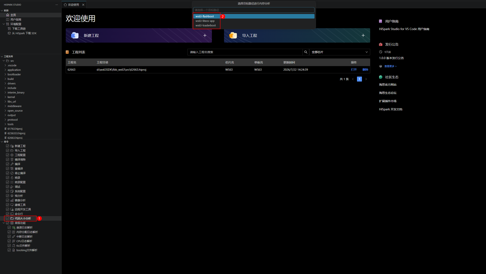

选择对应的target即可统计内存，内存统计界面如图2所示。

**图 2**  代码大小分析功能展示<a name="fig642651812595"></a>


#### 基线对比功能<a name="ZH-CN_TOPIC_0000002293224194"></a>

可快速对比更改代码前后的内存占用情况：

1. 单击保存为基线按钮，将当前内存保存为基线。
2. 修改代码或者切换target。
3. 刷新统计。
4. 单击对比按钮，如图1所示，对比结果示例如图2所示。

   **图 1** 保存基线版本和与基线版本对比按钮<a name="fig948185817020"></a>
   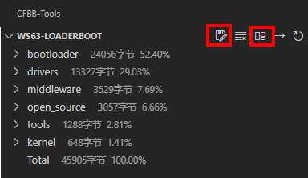

   **图 2** 与基线版本对比结果示例<a name="fig68321937318"></a>
   

### CPU日志解析功能<a name="ZH-CN_TOPIC_0000002327223553"></a>

使用DebugKits查看串口通信，芯片死机时通常会通过串口打印出死机日志，其中包含cpu\_trace信息（即死机前一段时间的函数调用链）。

单击侧边栏CPU日志解析，在弹出的菜单栏中选择对应的target，将死机时打印的cpu\_trace日志复制到文本框，再点击Trace按钮即可，如图1所示。

**图 1**  CPU日志解析功能<a name="fig2078817371822"></a>


### 崩溃日志解析功能<a name="ZH-CN_TOPIC_0000002379747024"></a>

此功能可以解析保存在芯片Flash中的CPU Trace二进制文件，主要用于定位芯片死机问题。

1. 点击侧边栏崩溃日志解析。

2. 在弹出的界面中按照提示选择需要解析的CPU Trace bin文件（使用DebugKits查看串口通信，芯片死机时会生成bin文件）、编译工具链中的nm文件（nm文件存在于编译后生成的output中，根据对应的target选择）、编译生成的elf文件以及芯片的CPU频率（elf文件存在于编译后生成的output中，根据对应的target选择），如图所示。
   
   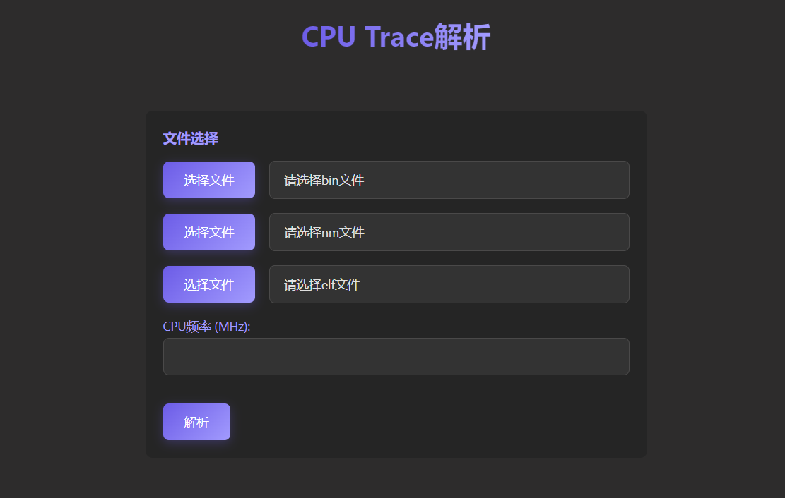
3. 设置完成后点击解析按钮进行二进制解析，解析完成后会在IDE界面显示解析的结果，并且会自动把解析结果以txt文件的格式保存至跟CPU Trace二进制文件相同的目录中，如下图示。
   
   

### 内存分配日志解析（BS2X和BS25系列芯片适用）<a name="ZH-CN_TOPIC_0000002327183813"></a>

此功能可以解析堆内存维测日志，快速分析出堆内存的占用情况。

1. 单击侧边栏内存分配日志解析。
2. 在弹出的菜单栏中选择对应的target，要打开堆内存维测，只需点击图示中的按钮即可，需要rebuild，使能后串口发送AT指令 AT+TASKMALLOC= \(指令后跟的参数是taskid\)或者调用print\_os\_all\_sys\_task\_heap即可打印出堆内存维测日志。
   
   **图 1**  内存分配日志解析功能<a name="fig02211941443"></a>
   
3. 将堆内存分配日志复制到文本框中。
4. 单击Trace按钮即可显示出统计图，如图2所示。

   **图 2** 与基线版本对比结果示例<a name="fig1836521310443"></a>
   

### 中断日志解析<a name="ZH-CN_TOPIC_0000002293383870"></a>

**打开锁中断维测<a name="section6996192714500"></a>**

要打开锁中断维测，需要在SDK根目录的“kernel/osal_adapter/CMakeLists.txt”文件的图示位置添加“set\(PUBLIC_DEFINESOSAL_IRQ_RECORD_INTTER OSAL_IRQ_RECORD_DEBUG\) ”， 注意：需要rebuild。

**图 1** CMakeLists.txt修改<a name="fig1883953718473"></a>
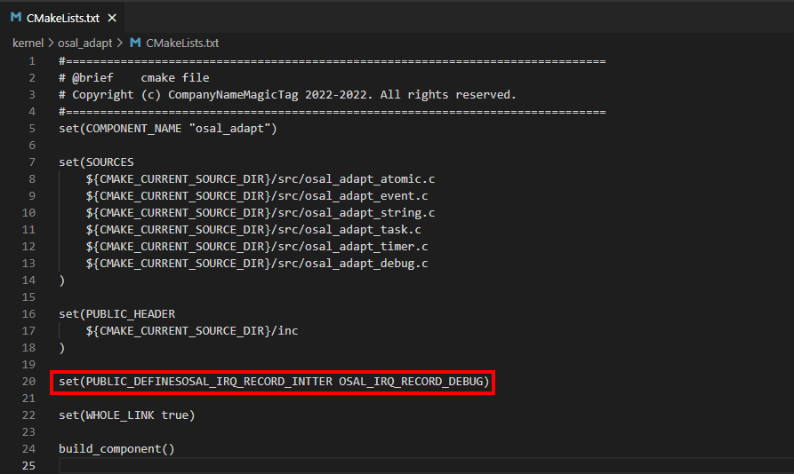

**使用锁中断维测<a name="section470364455017"></a>**

- 调用“osal_irq_record_flag_set\(\)”接口即可使能/失能锁中断维测，其参数为0～3，参数说明如下：

  0：失能中断维测；

  1：使能锁中断时间统计维测；

  2：使能中断函数执行时间统计维测；

  3：使能锁中断和中断函数执行时间统计维测。

- 调用“osal_print_irq_record\(\)”接口即可打印出记录的维测信息，其参数为空。

**中断日志解析<a name="section6885916125218"></a>**

1. 单击侧边栏中断日志解析。
2. 选择对应的target。
3. 将维测日志复制到文本框，单击“Trace”按钮即可。

**图 2**  中断日志解析功能<a name="fig15230162419526"></a>


#### Ko文件解析<a name="ZH-CN_TOPIC_0000002591819330"></a>

1. 完成工具链toolchain配置后打开带有.ko后缀文件的文件夹（.ko文件是内核模块文件，只有110x的代码才能编译出来）。
   
   **图 1**  打开带有.ko后缀文件的文件夹<a name="fig58945020273"></a>
   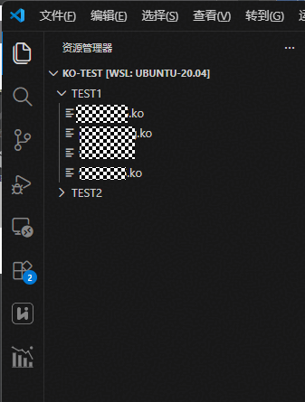

2. 单击ko文件解析按钮。

   **图 2** 点击.ko文件解析按钮<a name="fig12626195616277"></a>
   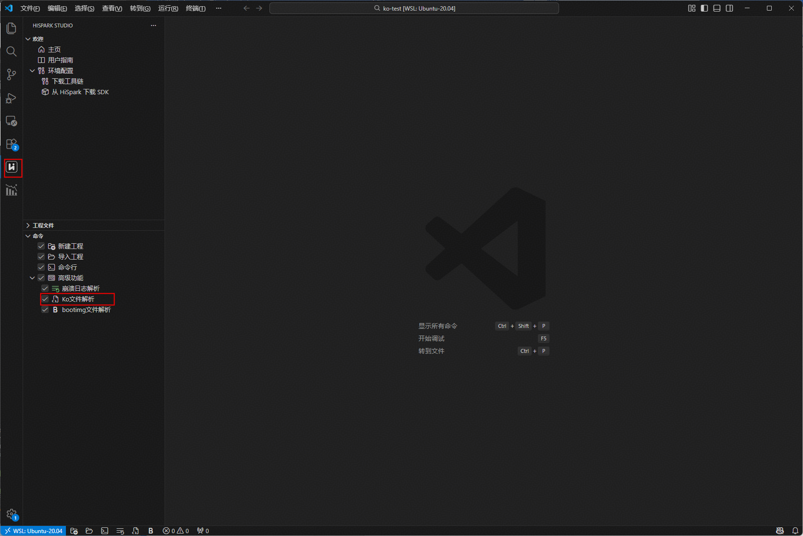

3. 选择对应.json文件。

   **图 3** 选择json文件<a name="fig3844055142810"></a>
   

4. 得到解析结果。

   **图 4** 得到解析结果<a name="fig4685431162911"></a>
   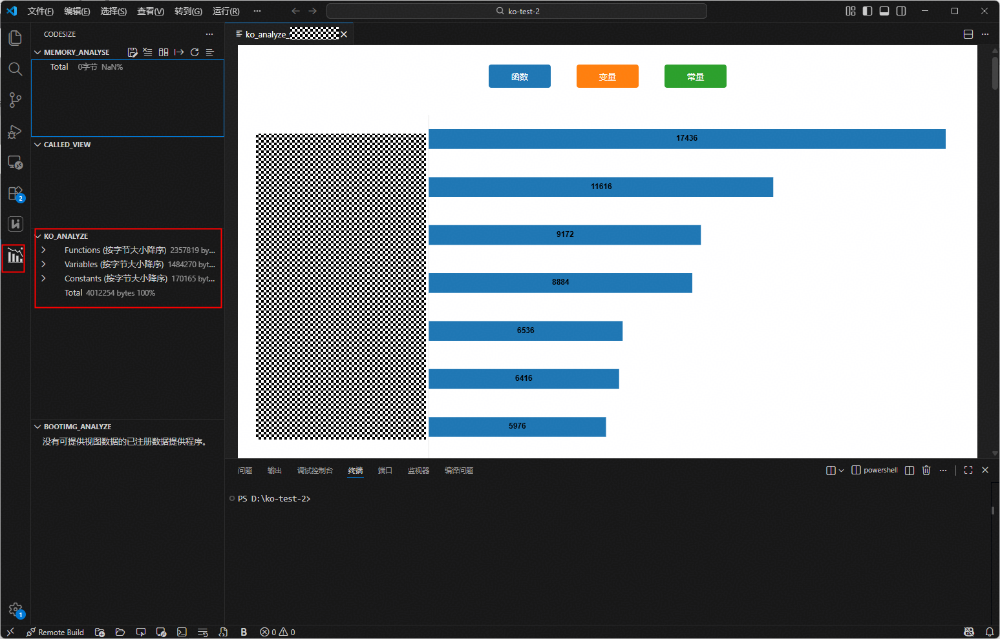

#### Bootimg文件解析<a name="ZH-CN_TOPIC_0000002622338905"></a>

1. 完成工具链toolchain配置后打开带有vmlinux文件的文件夹（vmlinux文件未经压缩的完整 Linux 内核原始镜像文件，需通过终端版本编译）。
   
   **图 1**  打开带有vmlinux文件的文件夹<a name="fig58945020273"></a>
   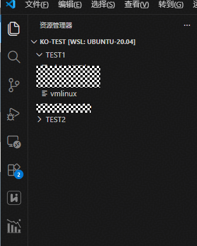

2. 单击bootimg文件解析按钮。

   **图 2** 点击bootimg文件解析按钮<a name="fig12626195616277"></a>
   

3. 选择对应.json文件。

   **图 3** 选择json文件<a name="fig3844055142810"></a>
   

4. 得到解析结果。

   **图 4** 得到解析结果<a name="fig4685431162911"></a>
   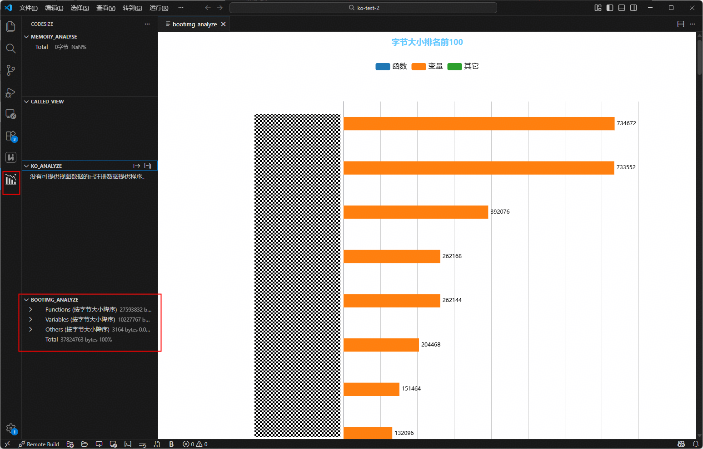

## 常见错误<a name="ZH-CN_TOPIC_0000002293224278"></a>

- **SDK根目录路径过长**
- **路径失效**
- **编译报错“Kconfig header saved to XXX”**
- **Kconfig Jump to弹框中搜索报错"NameError: name 're' is not defined"**
- **编译报错“Invalid argument”**
- **工程编译慢的问题**

### SDK根目录路径过长<a name="ZH-CN_TOPIC_0000002293383942"></a>

SDK根目录路径过长：

Windows 10和Windows 11下路径有260Byte的长度限制，过长的路径会导致编译时相关文件无法找到，或者编译时一直循环某些打印信息而不执行具体的编译内容，建议将SDK代码放到盘符的根目录或缩短SDK存放路径。

**图 1** SDK根目录路径过长<a name="fig13895175443715"></a>


### 路径失效<a name="ZH-CN_TOPIC_0000002293224282"></a>

导入工程路径问题导致的调试、栈分析、镜像分析等默认路径失效。

- 调试：修改默认的debug_elf路径。

  **图 1** 修改默认debug_elf路径<a name="fig1326371603814"></a>
  

### 编译报错“Kconfig header saved to XXX”<a name="ZH-CN_TOPIC_0000002327183901"></a>

如果编译报错“Kconfig header saved to XXX”，并且在SDK根目录下的build.log文件中搜索“error”有类似于“FAILED：xxx.c ccache”的字段。

**图 1** FAILED和ccache报错信息<a name="fig1964314202410"></a>


可以尝试在下载工具链的目录下的tools/cfbb/thirdparty/ccache目录下执行“ccache.exe -s”指令清除缓存即可。

### Kconfig Jump to弹框中搜索报错"NameError: name 're' is not defined"<a name="ZH-CN_TOPIC_0000002293383962"></a>

1. 打开Kconfig后，单击“Jump to...”按钮，在弹框中搜索相关内容。

   **图 1** 从Jump to打开搜索框<a name="fig252132311619"></a>
   

2. 若出现如下异常打印：

   **图 2** Kconfig异常打印<a name="fig17981081134"></a>
   

   需要修改“guiconfig.py”文件：在调用re模块前，添加import re，如图3所示。

   **图 3** 添加import re<a name="fig23065516141"></a>
   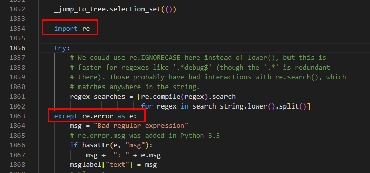

3. 添加代码之后可正常搜索，如图4所示。

   **图 4** 正常搜索示意图<a name="fig1265846121315"></a>
   

### 编译报错“Invalid argument”<a name="ZH-CN_TOPIC_0000002304197682"></a>

编译过程中如果报错“Invalid argument”。

**图 1** ws63编译报错“Invalid argument”<a name="fig1489361241813"></a>


报错原因：解析elf时由于没有管理员权限导致失败。解决方法：用管理员权限打开VS Code再次进行编译。

### 工程编译慢的问题<a name="ZH-CN_TOPIC_0000002423558450"></a>

可能原因一：Microsoft PC Manager Service的CPU占用率过高导致，可以结束或者禁用这个进程，加快工程编译速度。

**图 1** 禁用Microsoft PC Manager Service服务<a name="fig8963151164517"></a>


可能原因二：进程Antimalware Service Executable的CPU占用率较高，而且无法关闭。Antimalware Service Executable是一个Windows安全进程，它执行针对恶意软件的实时保护。其在后台运行，因此会不时地检测文件和程序。当它检测到病毒或其他恶意攻击时，它会删除或隔离它们。在工程编译时，其也会扫描整个工程目录，导致CPU占用率过高。因此，只要不让其扫描工程目录即可降低其CPU占用率，加快编译速度。解决方法如下：

1. 打开Windows安全中心，单击“威胁和病毒防护”**。**

   **图 2** 打开Windows安全中心<a name="fig34562361306"></a>
   

2. 打开“病毒威胁和防护设置”的“管理设置”，下滑找到“排除项”，单击“添加或删除排除项”。

   **图 3** 打开“病毒威胁和防护设置”的“管理设置”<a name="fig579017381819"></a>
   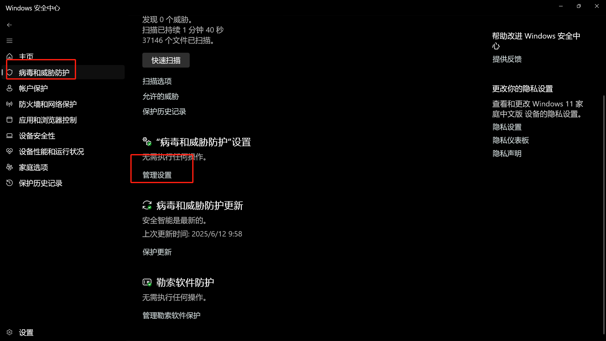

   **图 4** “排除项”， 点击 “添加或删除排除项**”**<a name="fig1779110251727"></a>
   

3. 在“排除项”中添加要编译的工程目录。

   **图 5** 在“排除项” 中添加要编译的工程目录<a name="fig553317481037"></a>
   

可能原因三：VS Code在效率模式下，可以关闭效率模式，提升编译速度。

1. 查看是否处于效率模式

   **图 6** 资源管理器中状态有“叶子”标志说明处于效率模式下<a name="fig1135213369810"></a>
   

2. 找到VS Code的快捷方式，右键进入属性，在“目标”栏后面加上一个英文空格，再添加“--disable-features=UseEcoQoSForBackgroundProcess”字段即可。

   **图 7** 添加字段解除效率模式<a name="fig17390172916149"></a>
   

3. 再次打开资源管理器，效率模式解除。

   **图 8** 效率模式解除<a name="fig7758184381415"></a>
   
